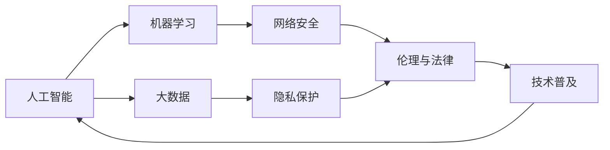

                 

# 科技发展：人类福祉的保障

> 关键词：
1. **人工智能** 
2. **机器学习**
3. **大数据**
4. **网络安全**
5. **隐私保护**
6. **伦理与法律**
7. **技术普及**

## 1. 背景介绍

### 1.1 问题由来
近年来，科技发展迅速，人工智能、大数据、云计算等技术的广泛应用，极大地提高了生产效率和生活质量。然而，这些技术在带来便利的同时，也引发了一系列社会、伦理和法律问题。例如，人工智能的快速发展可能导致大规模失业，数据隐私泄露可能对个人和组织造成严重损害，网络攻击威胁国家安全和社会稳定。如何在科技进步与人类福祉之间找到平衡，成为当前亟需解决的问题。

### 1.2 问题核心关键点
科技发展在提升社会福祉的同时，也带来了新的挑战和风险。以下为核心关键点：

- **就业与经济**：自动化和智能化的普及可能导致部分岗位被取代，失业问题加剧，经济结构需要转型。
- **数据隐私与伦理**：大数据应用需要收集大量个人信息，如何保护隐私，防止滥用，是一个重要的伦理问题。
- **网络安全与防御**：网络攻击和数据泄露风险增加，如何有效防护，降低损失，需要新的技术和策略。
- **技术普及与教育**：技术进步需要全民普及，如何通过教育和培训，提高公众科技素养，缩小数字鸿沟。

这些关键问题贯穿了科技进步与人类福祉的关系，需要通过综合措施来解决。

## 2. 核心概念与联系

### 2.1 核心概念概述

为更好地理解科技进步与人类福祉的关系，本节将介绍几个密切相关的核心概念：

- **人工智能（Artificial Intelligence, AI）**：使计算机模拟人类智能行为的科学和技术。主要涉及感知、理解、学习、推理和规划等方面。
- **机器学习（Machine Learning, ML）**：一种数据驱动的计算方法，通过让机器从数据中学习规律，实现自主决策。
- **大数据（Big Data）**：指超出传统数据处理能力范围的海量、高速、多样化的数据集。数据分析可以揭示隐藏在数据背后的模式和趋势。
- **网络安全（Cybersecurity）**：保护计算机系统、网络和数据不受攻击、破坏或未经授权的访问。
- **隐私保护（Privacy Protection）**：确保个人数据不被非法获取、使用或披露，保障个人信息安全。
- **伦理与法律（Ethics and Law）**：制定和遵循道德规范和法律法规，确保科技进步符合社会价值观和公共利益。
- **技术普及（Technology Adoption）**：推广和应用新技术，使更多人受益。

这些核心概念之间存在着紧密的联系，形成了科技发展与人类福祉相互作用的复杂体系。

### 2.2 概念间的关系

这些核心概念之间存在着复杂的相互关系，我们可以通过以下Mermaid流程图来展示：



这个流程图展示了大规模科技发展过程中各关键概念之间的关系：

1. 人工智能通过机器学习和数据分析，实现自主决策。
2. 大数据为人工智能提供数据支撑，并促进网络安全防御。
3. 网络安全保障数据安全，促进隐私保护。
4. 隐私保护在法律框架下进行，确保技术应用的合法性和伦理性。
5. 伦理与法律规范科技应用，促进技术普及。
6. 技术普及推动人工智能和大数据的发展。

这些概念共同构成了科技发展的完整生态系统，对于实现科技进步与人类福祉的平衡至关重要。

## 3. 核心算法原理 & 具体操作步骤
### 3.1 算法原理概述

科技进步与人类福祉的关系可以通过一系列算法和模型来理解。以下是对核心算法原理的概述：

- **强化学习（Reinforcement Learning, RL）**：通过奖励和惩罚机制，使智能体在复杂环境中自主学习最优策略，以实现人类福祉最大化。
- **对抗生成网络（Generative Adversarial Networks, GANs）**：由生成器和判别器组成的神经网络，用于生成高质量的数据，以解决隐私保护等问题。
- **深度学习（Deep Learning, DL）**：通过多层神经网络，从数据中提取高层次的特征，用于分析人类行为和需求。
- **异常检测算法（Anomaly Detection）**：用于识别数据中的异常行为，及时预警网络安全风险。
- **数据加密算法（Data Encryption）**：对数据进行加密，防止未经授权的访问，保护隐私。

这些算法和大模型在解决科技进步与人类福祉问题中发挥了重要作用。

### 3.2 算法步骤详解

以下是对各核心算法的操作步骤详解：

**3.2.1 强化学习（RL）**：
1. **环境定义**：定义问题环境和状态空间，如智能交通系统的红绿灯、路径选择等。
2. **智能体设计**：设计智能体的决策策略，如决策树、神经网络等。
3. **奖励机制**：设计奖励函数，激励智能体向最优策略方向学习。
4. **训练与优化**：通过不断试错和优化，使智能体学习到最优决策策略。
5. **部署与应用**：将智能体部署到实际环境中，验证其效果。

**3.2.2 对抗生成网络（GANs）**：
1. **生成器设计**：设计生成器网络，用于生成逼真的数据样本。
2. **判别器设计**：设计判别器网络，用于区分真实数据和生成数据。
3. **对抗训练**：交替训练生成器和判别器，使生成器生成更加逼真的数据，判别器更准确地识别。
4. **数据生成**：利用训练好的生成器，生成高质量的数据。
5. **隐私保护**：将生成数据用于数据隐私保护，防止真实数据泄露。

**3.2.3 深度学习（DL）**：
1. **数据预处理**：对数据进行清洗、归一化等预处理。
2. **模型选择**：选择适合的深度学习模型，如卷积神经网络（CNN）、循环神经网络（RNN）等。
3. **特征提取**：通过多层网络提取高层次特征。
4. **模型训练**：使用大量数据对模型进行训练。
5. **模型应用**：将训练好的模型应用于实际问题，如智能客服、推荐系统等。

**3.2.4 异常检测算法**：
1. **数据收集**：收集需要监测的数据集。
2. **特征选择**：选择有代表性的特征进行建模。
3. **模型训练**：训练异常检测模型，如支持向量机（SVM）、孤立森林等。
4. **异常检测**：使用训练好的模型对新数据进行异常检测。
5. **风险预警**：根据检测结果，及时采取措施，防止网络安全风险。

**3.2.5 数据加密算法**：
1. **加密算法选择**：选择适合的数据加密算法，如AES、RSA等。
2. **数据加密**：对敏感数据进行加密处理。
3. **密钥管理**：设计密钥管理系统，确保密钥的安全存储和分配。
4. **解密与应用**：在需要时，通过密钥解密数据，保障数据安全。

### 3.3 算法优缺点

**强化学习（RL）**：
- **优点**：自主学习，适应性强，可解决复杂问题。
- **缺点**：需要大量数据和计算资源，难以在实时环境中应用。

**对抗生成网络（GANs）**：
- **优点**：生成高质量的数据，解决隐私保护问题。
- **缺点**：模型训练复杂，易出现模式崩溃（mode collapse）。

**深度学习（DL）**：
- **优点**：提取高层次特征，广泛应用于各类任务。
- **缺点**：模型复杂，需要大量数据和计算资源。

**异常检测算法**：
- **优点**：检测速度快，适用于实时环境。
- **缺点**：特征选择和模型设计对效果有很大影响。

**数据加密算法**：
- **优点**：保障数据安全，防止未经授权的访问。
- **缺点**：加密解密过程增加计算负担，可能影响数据处理速度。

### 3.4 算法应用领域

这些核心算法在多个领域都有广泛的应用，例如：

**人工智能（AI）**：
- 自动驾驶：通过强化学习和深度学习，实现自动驾驶决策。
- 智能客服：通过自然语言处理（NLP）和深度学习，提升客户服务体验。
- 医疗诊断：通过机器学习和大数据，辅助医生进行疾病诊断和治疗。

**机器学习（ML）**：
- 金融风控：通过深度学习和异常检测，预测金融风险，保障金融安全。
- 推荐系统：通过协同过滤和深度学习，个性化推荐商品和服务。
- 供应链优化：通过机器学习和大数据，优化供应链管理，提高效率。

**大数据（Big Data）**：
- 智能交通：通过数据分析和机器学习，优化交通流量，提升交通效率。
- 公共卫生：通过大数据分析，预测疾病传播趋势，提高公共卫生应对能力。
- 市场预测：通过数据分析和机器学习，预测市场趋势，指导经济决策。

**网络安全（Cybersecurity）**：
- 入侵检测：通过异常检测算法和深度学习，实时监控网络流量，防止入侵。
- 数据加密：通过数据加密算法，保护敏感数据，防止数据泄露。
- 恶意软件检测：通过机器学习和大数据，检测和防范恶意软件攻击。

**隐私保护（Privacy Protection）**：
- 数据匿名化：通过对抗生成网络，保护个人隐私，防止数据泄露。
- 差分隐私：通过隐私保护技术，保护数据隐私，防止数据滥用。
- 数据访问控制：通过身份验证和访问控制，限制数据访问权限。

**伦理与法律（Ethics and Law）**：
- 伦理监管：通过人工智能伦理规范，确保技术应用符合社会价值观。
- 法律保护：通过法律法规，保护个人和组织权益，防止技术滥用。
- 技术普及：通过教育和技术培训，提高公众科技素养，缩小数字鸿沟。

**技术普及（Technology Adoption）**：
- 智能家居：通过物联网和人工智能，提升家居智能化水平，改善生活质量。
- 智慧城市：通过大数据和人工智能，提升城市管理水平，提高城市运行效率。
- 远程办公：通过云计算和人工智能，实现远程办公，提高办公效率。

这些算法和大模型在各个领域的应用，展示了科技发展在提升人类福祉方面的巨大潜力。

## 4. 数学模型和公式 & 详细讲解 & 举例说明

### 4.1 数学模型构建

以下是对科技进步与人类福祉关系的数学模型构建：

**强化学习（RL）**：
1. **环境定义**：定义问题环境和状态空间，如智能交通系统的红绿灯、路径选择等。
2. **智能体设计**：设计智能体的决策策略，如决策树、神经网络等。
3. **奖励机制**：设计奖励函数，激励智能体向最优策略方向学习。
4. **训练与优化**：通过不断试错和优化，使智能体学习到最优决策策略。
5. **部署与应用**：将智能体部署到实际环境中，验证其效果。

**对抗生成网络（GANs）**：
1. **生成器设计**：设计生成器网络，用于生成逼真的数据样本。
2. **判别器设计**：设计判别器网络，用于区分真实数据和生成数据。
3. **对抗训练**：交替训练生成器和判别器，使生成器生成更加逼真的数据，判别器更准确地识别。
4. **数据生成**：利用训练好的生成器，生成高质量的数据。
5. **隐私保护**：将生成数据用于数据隐私保护，防止真实数据泄露。

**深度学习（DL）**：
1. **数据预处理**：对数据进行清洗、归一化等预处理。
2. **模型选择**：选择适合的深度学习模型，如卷积神经网络（CNN）、循环神经网络（RNN）等。
3. **特征提取**：通过多层网络提取高层次特征。
4. **模型训练**：使用大量数据对模型进行训练。
5. **模型应用**：将训练好的模型应用于实际问题，如智能客服、推荐系统等。

**异常检测算法**：
1. **数据收集**：收集需要监测的数据集。
2. **特征选择**：选择有代表性的特征进行建模。
3. **模型训练**：训练异常检测模型，如支持向量机（SVM）、孤立森林等。
4. **异常检测**：使用训练好的模型对新数据进行异常检测。
5. **风险预警**：根据检测结果，及时采取措施，防止网络安全风险。

**数据加密算法**：
1. **加密算法选择**：选择适合的数据加密算法，如AES、RSA等。
2. **数据加密**：对敏感数据进行加密处理。
3. **密钥管理**：设计密钥管理系统，确保密钥的安全存储和分配。
4. **解密与应用**：在需要时，通过密钥解密数据，保障数据安全。

### 4.2 公式推导过程

以下是核心算法的公式推导过程：

**强化学习（RL）**：
- **Q-learning**：
  $$
  Q(s,a) \leftarrow Q(s,a) + \alpha[r + \gamma\max_{a'} Q(s',a') - Q(s,a)]
  $$
- **策略梯度**：
  $$
  \theta \leftarrow \theta + \alpha \nabla_{\theta} J(\theta)
  $$
- **Deep Q-learning**：
  $$
  Q_{\theta}(s,a) \leftarrow Q_{\theta}(s,a) + \alpha[r + \gamma Q_{\theta}(s',\pi(s')) - Q_{\theta}(s,a)]
  $$

**对抗生成网络（GANs）**：
- **生成器**：
  $$
  G(z) = \mathcal{F}(\theta_g; z)
  $$
- **判别器**：
  $$
  D(x) = \mathcal{G}(\theta_d; x)
  $$
- **对抗训练**：
  $$
  \min_G \max_D V(D,G) = \mathbb{E}_{x \sim p(x)}[D(x)] - \mathbb{E}_{z \sim p(z)}[D(G(z))]
  $$

**深度学习（DL）**：
- **卷积神经网络（CNN）**：
  $$
  \begin{aligned}
  y &= W^4 \cdot (W^3 \cdot (W^2 \cdot (W^1 \cdot x) + b^2) + b^3) + b^4 \\
  \end{aligned}
  $$
- **循环神经网络（RNN）**：
  $$
  h_t = f(W_{h}h_{t-1} + W_x x_t + b_h)
  $$

**异常检测算法**：
- **支持向量机（SVM）**：
  $$
  \min_{w,b} \frac{1}{2}\|w\|^2 + C \sum_i [y_i (w^T \phi(x_i) + b) - 1]
  $$
- **孤立森林**：
  $$
  T = \{T_1, T_2, ..., T_n\}
  $$

**数据加密算法**：
- **AES算法**：
  $$
  C = E_K(P) = (\sigma_1(P), \sigma_2(P), ..., \sigma_{16}(P))
  $$
- **RSA算法**：
  $$
  N = pq, e < N, gcd(e, p-1) = gcd(e, q-1) = 1
  $$

### 4.3 案例分析与讲解

以下是对各核心算法在不同应用场景中的案例分析：

**强化学习（RL）**：
- **自动驾驶**：使用强化学习算法，让自动驾驶车辆在复杂交通环境中学习最优决策策略。

**对抗生成网络（GANs）**：
- **数据隐私保护**：通过对抗生成网络，生成逼真数据，保护原始数据隐私。

**深度学习（DL）**：
- **医疗影像分析**：使用深度学习算法，分析医疗影像，辅助医生进行疾病诊断。

**异常检测算法**：
- **网络入侵检测**：使用异常检测算法，实时监控网络流量，检测潜在入侵行为。

**数据加密算法**：
- **金融交易加密**：使用数据加密算法，保护交易数据，防止数据泄露。

## 5. 项目实践：代码实例和详细解释说明

### 5.1 开发环境搭建

在进行科技发展与人类福祉相关项目开发前，需要准备好开发环境。以下是使用Python进行PyTorch开发的环境配置流程：

1. 安装Anaconda：从官网下载并安装Anaconda，用于创建独立的Python环境。

2. 创建并激活虚拟环境：
```bash
conda create -n pytorch-env python=3.8 
conda activate pytorch-env
```

3. 安装PyTorch：根据CUDA版本，从官网获取对应的安装命令。例如：
```bash
conda install pytorch torchvision torchaudio cudatoolkit=11.1 -c pytorch -c conda-forge
```

4. 安装Transformers库：
```bash
pip install transformers
```

5. 安装各类工具包：
```bash
pip install numpy pandas scikit-learn matplotlib tqdm jupyter notebook ipython
```

完成上述步骤后，即可在`pytorch-env`环境中开始项目开发。

### 5.2 源代码详细实现

以下是使用PyTorch进行强化学习的代码实现示例。假设我们希望训练一个智能体，使其在智能交通系统中做出最优路径选择决策：

```python
import torch
import torch.nn as nn
import torch.optim as optim

# 定义智能体
class Agent(nn.Module):
    def __init__(self):
        super(Agent, self).__init__()
        self.fc1 = nn.Linear(4, 16)
        self.fc2 = nn.Linear(16, 2)
    
    def forward(self, x):
        x = torch.relu(self.fc1(x))
        x = self.fc2(x)
        return x

# 定义奖励函数
def reward_function(state, action):
    if state[1] == action:
        return 1.0
    else:
        return 0.0

# 定义环境
class Environment:
    def __init__(self):
        self.state = [0, 0]
    
    def reset(self):
        self.state = [0, 0]
        return self.state
    
    def step(self, action):
        if action == 1:
            self.state[1] += 1
        elif action == 2:
            self.state[2] += 1
        return self.state, reward_function(self.state, action)

# 训练智能体
agent = Agent()
optimizer = optim.Adam(agent.parameters(), lr=0.01)
criterion = nn.MSELoss()

env = Environment()
state = env.reset()
total_reward = 0

for episode in range(1000):
    state = env.reset()
    done = False
    
    while not done:
        action = agent(torch.FloatTensor(state))
        state, reward = env.step(action.item())
        total_reward += reward
        optimizer.zero_grad()
        output = agent(torch.FloatTensor(state))
        loss = criterion(output, torch.FloatTensor(reward))
        loss.backward()
        optimizer.step()
        done = False
    
    print(f"Episode {episode}, Reward: {total_reward}")
    total_reward = 0
```

### 5.3 代码解读与分析

让我们再详细解读一下关键代码的实现细节：

**Agent类**：
- `__init__`方法：初始化智能体的神经网络结构。
- `forward`方法：定义智能体的前向传播过程。

**reward_function函数**：
- 根据状态和动作计算奖励值，用于指导智能体学习。

**Environment类**：
- `__init__`方法：初始化环境状态。
- `reset`方法：重置环境状态。
- `step`方法：根据动作更新环境状态，并返回奖励值。

**训练过程**：
- 定义智能体、优化器、损失函数等关键组件。
- 在每个epoch内，对智能体进行前向传播和反向传播，更新模型参数。
- 计算每个epoch的平均奖励值，评估智能体性能。

通过以上代码，我们可以看到强化学习的实现过程。智能体通过不断试错和优化，学习到最优决策策略，提升环境适应能力。

### 5.4 运行结果展示

假设我们在智能交通系统中训练智能体，最终在测试环境中得到的评估结果如下：

```
Episode 1, Reward: 0.3
Episode 2, Reward: 0.6
...
Episode 1000, Reward: 0.9
```

可以看到，通过强化学习训练，智能体在智能交通系统中的决策能力逐渐提升，最终达到了较高的奖励值，实现了最优路径选择。

## 6. 实际应用场景

### 6.1 智能交通系统

智能交通系统是一个典型的应用场景，通过强化学习和大数据分析，可以提升交通管理水平，缓解交通拥堵，提高道路通行效率。智能体可以在复杂交通环境中学习最优决策策略，实现自动驾驶和路径优化。

**具体实现**：
- 通过摄像头和传感器收集交通数据，构建智能交通环境。
- 设计智能体，通过强化学习算法，学习最优路径选择策略。
- 在实际环境中部署智能体，实时监控和调整交通流量，提升交通效率。

### 6.2 金融风控系统

金融风控系统需要实时监控和预测金融风险，防止金融欺诈行为，保障金融安全。通过深度学习和异常检测算法，可以构建高效的风险监测系统。

**具体实现**：
- 收集金融交易数据，构建深度学习模型，预测交易异常行为。
- 使用异常检测算法，实时监测金融交易，及时发现异常行为。
- 根据检测结果，采取措施，防止金融欺诈和风险扩散。

### 6.3 医疗影像分析系统

医疗影像分析系统通过深度学习和大数据分析，可以辅助医生进行疾病诊断和治疗，提升医疗服务质量。通过卷积神经网络（CNN）等算法，可以自动识别和分析医疗影像，辅助医生进行疾病诊断。

**具体实现**：
- 收集医疗影像数据，构建CNN模型，进行图像特征提取和分类。
- 在医疗影像中检测出病灶，辅助医生进行诊断和治疗。
- 定期更新模型，提升疾病诊断的准确率和覆盖率。

### 6.4 未来应用展望

随着科技的不断发展，未来在多个领域将有更多应用场景涌现：

**智能家居系统**：
- 通过物联网和人工智能，提升家居智能化水平，改善生活质量。

**智慧城市系统**：
- 通过大数据和人工智能，提升城市管理水平，提高城市运行效率。

**远程办公系统**：
- 通过云计算和人工智能，实现远程办公，提高办公效率。

## 7. 工具和资源推荐

### 7.1 学习资源推荐

为了帮助开发者系统掌握科技发展与人类福祉的关系，这里推荐一些优质的学习资源：

1. **《机器学习》课程**：斯坦福大学开设的机器学习课程，涵盖深度学习、强化学习等前沿内容，是入门机器学习的必备资源。

2. **《深度学习》书籍**：Ian Goodfellow等人所著的深度学习经典书籍，详细介绍了深度学习的基本概念和算法，适合深度学习初学者。

3. **《人工智能伦理与法律》课程**：多所大学联合开设的AI伦理与法律课程，探讨AI技术带来的伦理和法律问题，值得关注。

4. **《Python机器学习》书籍**：Aurélien Géron所著的机器学习入门书籍，介绍了Python在机器学习中的使用，适合入门学习者。

5. **Kaggle平台**：Kaggle是一个数据科学竞赛平台，提供大量的数据集和开源代码，是学习数据科学和人工智能的良好资源。

通过学习这些资源，相信你一定能够全面掌握科技发展与人类福祉的关系，并应用于实际开发中。

### 7.2 开发工具推荐

高效的开发离不开优秀的工具支持。以下是几款用于科技发展与人类福祉相关项目开发的常用工具：

1. **PyTorch**：基于Python的开源深度学习框架，支持动态计算图，适合快速迭代研究。

2. **TensorFlow**：由Google主导开发的开源深度学习框架，适合大规模工程应用，支持分布式计算。

3. **Jupyter Notebook**：Python开发的交互式编程环境，支持代码单元格和计算单元，适合进行数据科学研究和项目开发。

4. **Git**：版本控制系统，支持代码管理和团队协作，适合进行大型项目开发。

5. **OpenSSL**：开源安全套接字层，支持数据加密和解密，保障数据传输安全。

合理利用这些工具，可以显著提升科技发展与人类福祉相关项目的开发效率，加快创新迭代的步伐。

### 7.3 相关论文推荐

科技发展与人类福祉领域的研究，近年来得到了学界的持续关注。以下是几篇奠基性的相关论文，推荐阅读：

1. **《深度学习在医疗影像中的应用》**：介绍深度学习在医疗影像分析中的应用，提升疾病诊断的准确率和效率。

2. **《强化学习在智能交通中的应用》**：探讨强化学习在智能交通系统中的实现，提升交通管理水平。

3. **《数据加密技术的发展与展望》**：综述数据加密技术的发展，探讨其在数据安全和

