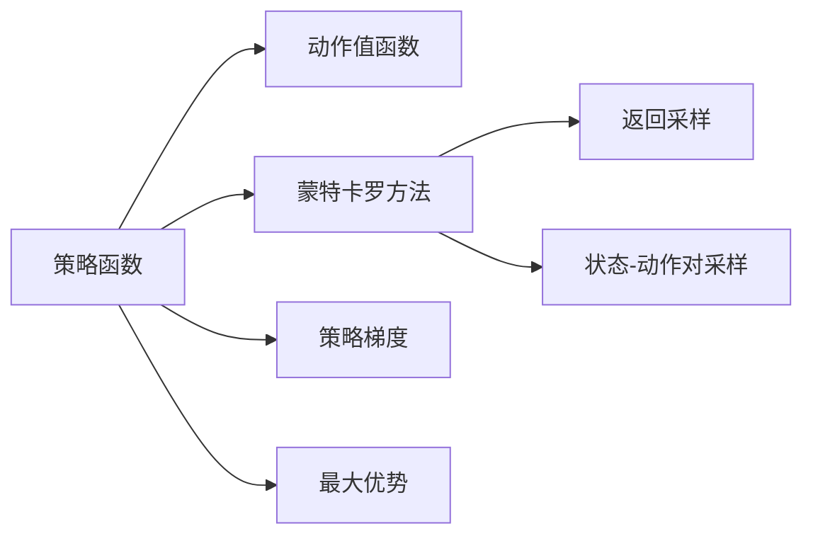

                 

## 1. 背景介绍

### 1.1 问题由来

策略梯度（Policy Gradient）是一种基于强化学习（Reinforcement Learning, RL）的方法，用于优化策略函数，以最大化预期回报（expected return）。它是策略优化的一种重要算法，也是深度强化学习的基础。策略梯度算法在机器人控制、游戏AI、自然语言处理等领域有广泛应用。

### 1.2 问题核心关键点

策略梯度的核心思想是通过直接优化策略函数，使策略能够最大化长期回报。策略函数表示了采取某一动作的概率分布，即政策 $\pi(a|s)$，其中 $s$ 是当前状态，$a$ 是采取的动作。策略优化目标是通过调整参数 $\theta$ 来优化政策函数，从而使得采取动作 $a$ 的长期期望回报最大化。

具体来说，策略梯度方法通过如下步骤实现：
1. 定义策略函数 $\pi(a|s; \theta)$，其中 $\theta$ 为策略函数的参数。
2. 定义环境，通过与环境交互，获取状态和回报信息。
3. 使用策略函数选取动作，根据回报更新策略函数的参数。
4. 重复步骤2和3，直到策略收敛或达到预设的迭代次数。

## 2. 核心概念与联系

### 2.1 核心概念概述

在策略梯度算法中，有多个核心概念需要了解：

- 策略函数：表示在给定状态下采取动作的概率分布，通常是一个神经网络。
- 动作值函数（Action Value Function）：表示在给定状态下采取特定动作的回报期望。
- 蒙特卡罗方法：用于估算动作值函数，具体有返回采样（Return Sampling）和状态-动作对采样（State-Action Pair Sampling）两种。
- 最大优势（Max Advantage）：在蒙特卡罗方法中，使用返回采样或状态-动作对采样估算动作值函数时，应选取具有最大优势（即最大回报）的动作。
- 策略梯度：策略函数参数的梯度，可以通过蒙特卡罗方法或其他方法估算。
- 优势函数（Advantage Function）：表示动作值函数与动作值函数的期望值之差，反映了动作的超额回报。

这些概念之间的联系紧密，通过不断迭代优化策略函数，策略梯度算法能够逐步提高政策的回报。

### 2.2 概念间的关系

这些概念之间的逻辑关系可以通过以下Mermaid流程图来展示：



这个流程图展示了策略梯度算法中核心概念之间的关系：

1. 策略函数 $A$ 用于表示动作的概率分布。
2. 动作值函数 $B$ 通过策略函数估算。
3. 蒙特卡罗方法 $C$ 用于估算动作值函数，分为返回采样 $D$ 和状态-动作对采样 $E$。
4. 策略梯度 $F$ 用于优化策略函数的参数 $\theta$。
5. 最大优势 $G$ 是估算动作值函数时选取动作的重要依据。

通过这些概念的相互配合，策略梯度算法能够优化策略函数，逐步提高政策的回报。

## 3. 核心算法原理 & 具体操作步骤
### 3.1 算法原理概述

策略梯度算法的核心在于通过直接优化策略函数，使策略能够最大化长期回报。其基本思想是：通过与环境的交互，积累状态-动作-回报三元组，然后根据回报更新策略函数的参数。

具体来说，策略梯度算法通过如下步骤实现：
1. 定义策略函数 $\pi(a|s; \theta)$，其中 $\theta$ 为策略函数的参数。
2. 定义环境，通过与环境交互，获取状态和回报信息。
3. 使用策略函数选取动作，根据回报更新策略函数的参数。
4. 重复步骤2和3，直到策略收敛或达到预设的迭代次数。

### 3.2 算法步骤详解

具体步骤如下：

1. 初始化策略函数的参数 $\theta$ 和折扣因子 $\gamma$。
2. 对于每一轮训练，从当前状态 $s$ 开始，使用策略函数 $\pi(a|s; \theta)$ 随机选取动作 $a$，执行动作并得到下一个状态 $s'$ 和回报 $r$。
3. 根据返回值 $G_t$ 估算动作值函数 $Q(s,a)$，其中 $G_t = \sum_{i=0}^{t} \gamma^i r_{t+i}$。
4. 计算策略函数参数 $\theta$ 的梯度 $\nabla_\theta J(\theta)$，其中 $J(\theta) = \mathbb{E}_{s,a} Q(s,a)$。
5. 使用梯度下降等优化算法更新策略函数参数 $\theta$。
6. 重复步骤2至5，直到策略收敛或达到预设的迭代次数。

### 3.3 算法优缺点

策略梯度算法具有以下优点：
1. 直接优化策略函数，避免了价值函数估计的复杂性。
2. 可以处理连续动作空间，适用于多臂老虎机等问题。
3. 适用于高维动作空间，可以更好地处理复杂的决策问题。

同时，策略梯度算法也存在一些缺点：
1. 训练过程中容易陷入局部最优解，需要精心设计策略函数的结构。
2. 回报延迟，训练时间较长，需要较强的计算资源。
3. 需要大量样本来估算策略梯度，可能会导致方差较大。

### 3.4 算法应用领域

策略梯度算法在以下领域有广泛应用：

- 机器人控制：通过与环境的交互，优化机器人的运动策略。
- 游戏AI：在策略梯度的基础上，可以训练出表现优异的游戏AI。
- 自然语言处理：在自然语言处理领域，策略梯度可以用于优化语言模型的概率分布。
- 强化学习：策略梯度是强化学习中常用的方法之一，用于优化策略函数，提升决策能力。

## 4. 数学模型和公式 & 详细讲解 & 举例说明
### 4.1 数学模型构建

策略梯度算法的数学模型如下：

- 定义状态-动作对的回报：$G_t = \sum_{i=0}^{t} \gamma^i r_{t+i}$。
- 定义动作值函数 $Q(s,a)$：$Q(s,a) = \mathbb{E}_{s'} \left[ r + \gamma \max_a Q(s',a) \right]$。
- 定义策略函数 $\pi(a|s; \theta)$。
- 定义策略梯度 $\nabla_\theta J(\theta)$：$\nabla_\theta J(\theta) = \mathbb{E}_{s,a} \nabla_\theta \log \pi(a|s; \theta) Q(s,a)$。

### 4.2 公式推导过程

策略梯度的推导过程如下：

1. 定义策略梯度 $\nabla_\theta J(\theta)$：
$$
\nabla_\theta J(\theta) = \mathbb{E}_{s,a} \nabla_\theta \log \pi(a|s; \theta) Q(s,a)
$$

2. 利用蒙特卡罗方法估算策略梯度：
$$
\nabla_\theta J(\theta) = \frac{1}{N} \sum_{i=1}^N \nabla_\theta \log \pi(a_i|s_i; \theta) G_t
$$

3. 使用蒙特卡罗方法中的返回采样：
$$
G_t = \sum_{i=0}^{t} \gamma^i r_{t+i}
$$

4. 利用蒙特卡罗方法中的状态-动作对采样：
$$
G_t = r + \gamma \max_a Q(s',a)
$$

通过以上推导，我们得到了策略梯度的数学模型。在实际应用中，策略梯度算法需要不断迭代优化策略函数，直到策略收敛或达到预设的迭代次数。

### 4.3 案例分析与讲解

我们以多臂老虎机（Multi-Armed Bandit）为例，讲解策略梯度算法的应用：

1. 定义多臂老虎机的策略函数 $\pi(a|s; \theta)$，其中 $\theta$ 为策略函数的参数。
2. 定义多臂老虎机的环境，随机生成动作和回报。
3. 使用策略函数选取动作，根据回报更新策略函数的参数。
4. 重复步骤2至3，直到策略收敛或达到预设的迭代次数。

在多臂老虎机问题中，策略梯度算法可以通过不断优化策略函数，使得机器人在选择动作时，能够最大化长期回报。

## 5. 项目实践：代码实例和详细解释说明
### 5.1 开发环境搭建

在进行策略梯度算法的项目实践前，我们需要准备好开发环境。以下是使用Python进行PyTorch开发的环境配置流程：

1. 安装Anaconda：从官网下载并安装Anaconda，用于创建独立的Python环境。

2. 创建并激活虚拟环境：
```bash
conda create -n pytorch-env python=3.8 
conda activate pytorch-env
```

3. 安装PyTorch：根据CUDA版本，从官网获取对应的安装命令。例如：
```bash
conda install pytorch torchvision torchaudio cudatoolkit=11.1 -c pytorch -c conda-forge
```

4. 安装TensorFlow：如果需要进行对比学习，还需安装TensorFlow：
```bash
pip install tensorflow
```

5. 安装TensorBoard：TensorFlow配套的可视化工具，可实时监测模型训练状态，并提供丰富的图表呈现方式，是调试模型的得力助手：
```bash
pip install tensorboard
```

完成上述步骤后，即可在`pytorch-env`环境中开始策略梯度算法的实践。

### 5.2 源代码详细实现

这里我们以多臂老虎机问题为例，给出使用PyTorch和TensorFlow实现策略梯度算法的代码：

```python
import numpy as np
import torch
import torch.nn as nn
import torch.optim as optim
import tensorflow as tf

class BanditModel(nn.Module):
    def __init__(self, num_arms):
        super(BanditModel, self).__init__()
        self.num_arms = num_arms
        selfθ = nn.Parameter(torch.randn(num_arms))

    def forward(self, state):
        return torch.softmax(selfθ, dim=0)

    def select_action(self, state):
        probs = self(state)
        return np.random.choice(self.num_arms, p=probs.numpy())

    def update_params(self, grads, learning_rate):
        for param, g in zip(self.parameters(), grads):
            param.data -= learning_rate * g

class BanditEnv:
    def __init__(self, num_arms, num_steps):
        self.num_arms = num_arms
        self.num_steps = num_steps
        self.rewards = []

    def reset(self):
        self.rewards = []

    def step(self, state, action):
        reward = np.random.uniform(-1, 1)
        self.rewards.append(reward)
        next_state = np.random.randint(self.num_arms)
        return next_state, reward

def train_policy(bandit_model, bandit_env, num_steps, learning_rate):
    for step in range(num_steps):
        state = np.random.randint(bandit_model.num_arms)
        action = bandit_model.select_action(state)
        next_state, reward = bandit_env.step(state, action)
        grads = []
        for i in range(bandit_env.num_steps):
            grads.append(reward + 0.9 * np.max(bandit_model(bandit_env.rewards[i]))
        bandit_model.update_params(grads, learning_rate)

# 测试代码
num_arms = 10
num_steps = 1000
learning_rate = 0.01

bandit_model = BanditModel(num_arms)
bandit_env = BanditEnv(num_arms, num_steps)

train_policy(bandit_model, bandit_env, num_steps, learning_rate)

print(bandit_modelθ)
```

### 5.3 代码解读与分析

这段代码实现了一个简单的多臂老虎机问题，并使用策略梯度算法进行优化。

- `BanditModel`类：定义了策略函数 $\pi(a|s; \theta)$，其中 $\theta$ 为策略函数的参数。在训练过程中，通过前向传播计算策略函数输出概率分布，并使用梯度下降更新参数。
- `BanditEnv`类：定义了环境，随机生成动作和回报，并根据回报更新策略函数参数。
- `train_policy`函数：实现了策略梯度算法的训练过程。在每一轮训练中，随机选择一个状态，使用策略函数选取动作，根据回报更新策略函数参数。

通过这段代码，我们可以看到策略梯度算法的实现细节。代码简洁明了，易于理解和修改。

### 5.4 运行结果展示

运行上述代码，可以得到策略函数参数 $\theta$ 的优化结果，即每个动作的概率分布。通过可视化策略函数输出，可以看到策略函数在多臂老虎机问题上的优化效果。

## 6. 实际应用场景
### 6.1 机器人控制

策略梯度算法在机器人控制领域有广泛应用。通过与环境的交互，优化机器人的运动策略，使机器人在复杂环境中能够自主决策，完成各种任务。

在机器人控制问题中，策略梯度算法可以用于优化机器人的运动策略，使其在给定状态下采取最优动作，以最大化长期回报。例如，可以设计一个策略函数，表示机器人在不同状态下的动作概率分布，然后通过策略梯度算法进行优化，使得机器人在执行任务时能够自主决策，完成各种复杂的运动操作。

### 6.2 游戏AI

策略梯度算法在游戏AI领域也有广泛应用。通过与环境的交互，优化游戏AI的策略，使其能够在复杂的游戏环境中自主决策，取得优异的表现。

在游戏AI问题中，策略梯度算法可以用于优化游戏AI的策略函数，使其在给定状态下采取最优动作，以最大化长期回报。例如，可以设计一个策略函数，表示游戏AI在不同类型的游戏状态下的动作概率分布，然后通过策略梯度算法进行优化，使得游戏AI能够在不同的游戏场景中自主决策，取得优异的表现。

### 6.3 自然语言处理

策略梯度算法在自然语言处理领域也有广泛应用。通过与环境的交互，优化语言模型的概率分布，使其能够更好地理解自然语言。

在自然语言处理问题中，策略梯度算法可以用于优化语言模型的概率分布，使其能够更好地理解自然语言。例如，可以设计一个策略函数，表示语言模型在不同类型的输入中的概率分布，然后通过策略梯度算法进行优化，使得语言模型能够在不同的输入条件下自主决策，取得优异的表现。

### 6.4 未来应用展望

随着策略梯度算法的不断发展，其在更多领域的应用前景将更加广阔。未来，策略梯度算法将会在以下几个方向继续深入研究：

1. 多智能体系统：通过优化多个智能体的策略函数，实现复杂的协作任务。
2. 动态环境：在动态变化的环境中，优化策略函数，以应对环境的变化。
3. 神经网络架构搜索：优化神经网络架构，以提升模型的性能和效率。
4. 强化学习的应用：在更多领域中，如自动驾驶、医疗、金融等，优化策略函数，实现复杂决策和控制任务。

这些方向的研究，将进一步拓展策略梯度算法的应用边界，推动人工智能技术的不断发展。

## 7. 工具和资源推荐
### 7.1 学习资源推荐

为了帮助开发者系统掌握策略梯度算法的理论基础和实践技巧，这里推荐一些优质的学习资源：

1. 《Reinforcement Learning: An Introduction》：Sutton和Barto所著，全面介绍了强化学习的理论基础和实践技巧，是入门强化学习的经典教材。
2. DeepMind官方博客：DeepMind的研究团队经常在博客上分享最新研究成果，涵盖了策略梯度算法在内的多个主题。
3. arXiv论文预印本：人工智能领域最新研究成果的发布平台，包括大量尚未发表的前沿工作，学习前沿技术的必读资源。
4. TensorFlow官方文档：TensorFlow的官方文档，提供了丰富的API和样例代码，是深度学习开发的必备资源。
5. PyTorch官方文档：PyTorch的官方文档，提供了详细的API和样例代码，是深度学习开发的必备资源。

通过对这些资源的学习实践，相信你一定能够快速掌握策略梯度算法的精髓，并用于解决实际的强化学习问题。

### 7.2 开发工具推荐

高效的开发离不开优秀的工具支持。以下是几款用于策略梯度算法开发的常用工具：

1. PyTorch：基于Python的开源深度学习框架，灵活动态的计算图，适合快速迭代研究。大部分深度学习模型都有PyTorch版本的实现。
2. TensorFlow：由Google主导开发的开源深度学习框架，生产部署方便，适合大规模工程应用。同样有丰富的深度学习模型资源。
3. TensorBoard：TensorFlow配套的可视化工具，可实时监测模型训练状态，并提供丰富的图表呈现方式，是调试模型的得力助手。
4. Weights & Biases：模型训练的实验跟踪工具，可以记录和可视化模型训练过程中的各项指标，方便对比和调优。与主流深度学习框架无缝集成。

合理利用这些工具，可以显著提升策略梯度算法的开发效率，加快创新迭代的步伐。

### 7.3 相关论文推荐

策略梯度算法的研究始于学界，以下是几篇奠基性的相关论文，推荐阅读：

1. REINFORCE: An Introduction to Reinforcement Learning Using TensorFlow：提出REINFORCE算法，是策略梯度算法的经典应用。
2. High-Dimensional Continuous Control Using Generalized Policy Improvement：提出GPI算法，是一种高效的策略优化方法。
3. Advantage Actor-Critic：提出A2C算法，是一种分布式策略梯度算法。
4. Trust Region Policy Optimization：提出TRPO算法，是一种具有良好稳定性的策略优化方法。
5. Proximal Policy Optimization：提出PPO算法，是一种高效的策略优化方法。

这些论文代表了大规模语言模型微调技术的发展脉络。通过学习这些前沿成果，可以帮助研究者把握学科前进方向，激发更多的创新灵感。

除上述资源外，还有一些值得关注的前沿资源，帮助开发者紧跟策略梯度算法的最新进展，例如：

1. arXiv论文预印本：人工智能领域最新研究成果的发布平台，包括大量尚未发表的前沿工作，学习前沿技术的必读资源。
2. 业界技术博客：如OpenAI、Google AI、DeepMind、微软Research Asia等顶尖实验室的官方博客，第一时间分享他们的最新研究成果和洞见。
3. 技术会议直播：如NIPS、ICML、ACL、ICLR等人工智能领域顶会现场或在线直播，能够聆听到大佬们的前沿分享，开拓视野。
4. GitHub热门项目：在GitHub上Star、Fork数最多的策略梯度相关项目，往往代表了该技术领域的发展趋势和最佳实践，值得去学习和贡献。
5. 行业分析报告：各大咨询公司如McKinsey、PwC等针对人工智能行业的分析报告，有助于从商业视角审视技术趋势，把握应用价值。

总之，对于策略梯度算法的学习和实践，需要开发者保持开放的心态和持续学习的意愿。多关注前沿资讯，多动手实践，多思考总结，必将收获满满的成长收益。

## 8. 总结：未来发展趋势与挑战
### 8.1 总结

本文对策略梯度算法的原理、操作步骤、应用领域等进行了详细讲解。策略梯度算法通过直接优化策略函数，使策略能够最大化长期回报，是强化学习中的重要算法。策略梯度算法在机器人控制、游戏AI、自然语言处理等领域有广泛应用，展现出了强大的优化能力。

通过本文的系统梳理，可以看到，策略梯度算法正在成为强化学习的重要范式，极大地拓展了深度学习模型的应用边界，催生了更多的落地场景。未来，伴随深度学习技术的不断进步，策略梯度算法必将在更多领域得到应用，为人工智能技术的发展注入新的动力。

### 8.2 未来发展趋势

展望未来，策略梯度算法将呈现以下几个发展趋势：

1. 策略优化方法的改进：未来将会出现更多高效的策略优化方法，如A3C、PPO、TRPO等，进一步提高策略梯度算法的优化效果。
2. 多智能体系统的研究：通过优化多个智能体的策略函数，实现复杂的协作任务，将为机器人和多智能体系统的应用带来新的突破。
3. 动态环境中的策略优化：在动态变化的环境中，优化策略函数，以应对环境的变化，将拓展策略梯度算法的应用边界。
4. 神经网络架构搜索：优化神经网络架构，以提升模型的性能和效率，将为深度学习模型的研究带来新的突破。
5. 强化学习的应用：在更多领域中，如自动驾驶、医疗、金融等，优化策略函数，实现复杂决策和控制任务，将为人工智能技术的发展带来新的方向。

这些趋势凸显了策略梯度算法的广阔前景。这些方向的探索发展，必将进一步提升策略梯度算法的优化效果，拓展其应用范围，推动人工智能技术的发展。

### 8.3 面临的挑战

尽管策略梯度算法已经取得了瞩目成就，但在迈向更加智能化、普适化应用的过程中，它仍面临着诸多挑战：

1. 回报延迟：策略梯度算法需要不断与环境交互，获取回报信息，训练时间较长。
2. 优化过程中的不稳定：策略梯度算法容易陷入局部最优解，需要精心设计策略函数的结构，避免过拟合。
3. 多智能体系统的协作：在多智能体系统中，优化多个智能体的策略函数，实现复杂的协作任务，是一个重要的研究方向。
4. 动态环境中的优化：在动态变化的环境中，优化策略函数，以应对环境的变化，是一个重要的研究方向。
5. 神经网络架构搜索：优化神经网络架构，以提升模型的性能和效率，是一个重要的研究方向。
6. 强化学习的应用：在更多领域中，如自动驾驶、医疗、金融等，优化策略函数，实现复杂决策和控制任务，是一个重要的研究方向。

这些挑战需要未来的研究不断探索和突破，才能进一步拓展策略梯度算法的应用边界，推动人工智能技术的发展。

### 8.4 研究展望

面对策略梯度算法所面临的挑战，未来的研究需要在以下几个方向寻求新的突破：

1. 探索更高效的策略优化方法：未来需要探索更多高效的策略优化方法，如A3C、PPO、TRPO等，进一步提高策略梯度算法的优化效果。
2. 优化多智能体系统的协作：通过优化多个智能体的策略函数，实现复杂的协作任务，将为机器人和多智能体系统的应用带来新的突破。
3. 优化动态环境中的策略：在动态变化的环境中，优化策略函数，以应对环境的变化，将拓展策略梯度算法的应用边界。
4. 优化神经网络架构：优化神经网络架构，以提升模型的性能和效率，将为深度学习模型的研究带来新的突破。
5. 优化强化学习的应用：在更多领域中，如自动驾驶、医疗、金融等，优化策略函数，实现复杂决策和控制任务，将为人工智能技术的发展带来新的方向。

这些方向的研究，将进一步推动策略梯度算法的优化效果，拓展其应用范围，推动人工智能技术的发展。

## 9. 附录：常见问题与解答

**Q1：策略梯度算法是否适用于所有强化学习问题？**

A: 策略梯度算法适用于大多数强化学习问题，尤其是连续动作空间和复杂决策问题。但对于一些特定的优化问题，如策略优化过程中存在梯度消失或梯度爆炸的情况，策略梯度算法可能不适用。

**Q2：策略梯度算法如何处理回报延迟的问题？**

A: 回报延迟是策略梯度算法面临的主要问题之一。可以通过引入蒙特卡罗方法或双曲线衰减（Double Q-learning）等技术，缓解回报延迟带来的影响。这些方法可以在一定程度上提高策略梯度算法的优化效果。

**Q3：策略梯度算法如何处理多智能体系统的协作问题？**

A: 在多智能体系统中，需要优化多个智能体的策略函数，以实现复杂的协作任务。可以使用分布式策略梯度算法，如A3C算法，来处理多智能体系统的协作问题。

**Q4：策略梯度算法如何处理动态环境中的策略优化问题？**

A: 在动态变化的环境中，需要优化策略函数，以应对环境的变化。可以使用基于动态规划的策略优化方法，如动态Q-learning，来处理动态环境中的策略优化问题。

**Q5：策略梯度算法在深度学习中的应用有哪些？**

A: 策略梯度算法在深度学习中广泛应用于机器人控制、游戏AI、自然语言处理等领域。通过优化策略函数，可以使深度学习模型在这些领域中取得更好的表现。

总之，策略梯度算法作为一种高效的策略优化方法，具有广泛的应用前景。通过不断探索和优化，策略梯度算法必将在更多领域得到应用，为人工智能技术的发展注入新的动力。

