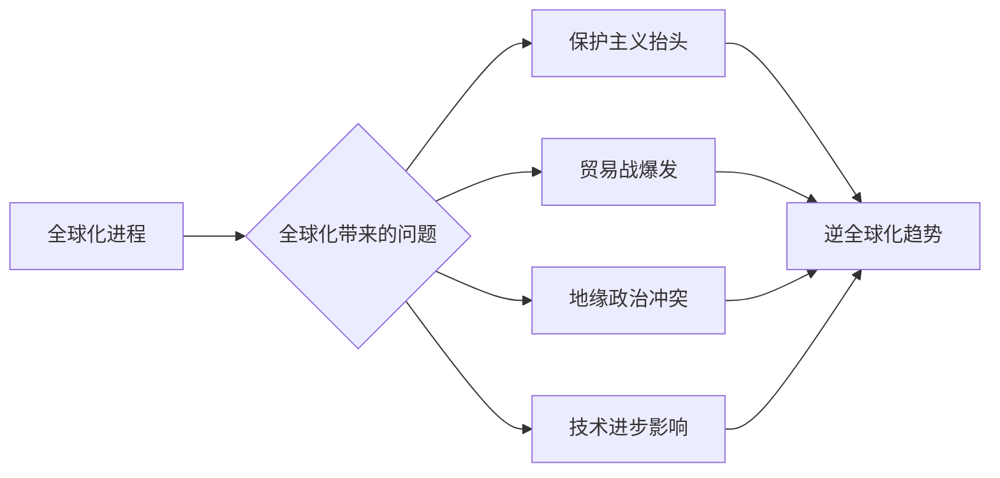

## 1. 背景介绍

### 1.1 问题的由来

全球化，作为20世纪后半叶最显著的经济现象之一，深刻地改变了世界经济格局。它促进了国际贸易、投资和人员流动，带来了前所未有的经济增长和繁荣。然而，近年来，逆全球化趋势抬头，引发了人们对未来经济走向的担忧。

逆全球化的兴起并非偶然，它反映了全球化进程中所暴露出的问题和矛盾。一方面，全球化加速了资源和资本的集中，加剧了贫富差距，引发了社会不平等问题。另一方面，全球化也带来了环境污染、资源枯竭等负面影响，对可持续发展构成挑战。

### 1.2 研究现状

近年来，关于逆全球化的研究日益增多，学者们从不同角度探讨了其原因、影响和应对措施。一些学者认为，逆全球化是由于发达国家为了维护自身利益而采取的保护主义措施，而另一些学者则认为，逆全球化是全球经济发展到一定阶段的必然结果，反映了各国之间利益分配的矛盾。

### 1.3 研究意义

研究逆全球化的长期经济影响具有重要的现实意义。一方面，它有助于我们理解当前世界经济形势，为制定应对策略提供参考。另一方面，它也能帮助我们更好地思考未来经济发展方向，促进全球经济的健康发展。

### 1.4 本文结构

本文将从以下几个方面探讨逆全球化的长期经济影响：

- 首先，我们将分析逆全球化的主要原因和表现形式。
- 其次，我们将探讨逆全球化对全球经济、贸易、投资和就业的影响。
- 然后，我们将分析逆全球化对不同国家和地区的差异化影响。
- 最后，我们将展望逆全球化趋势下的未来经济发展方向。

## 2. 核心概念与联系

逆全球化是指全球化进程的逆转，表现为国际贸易、投资和人员流动的减少，以及国家之间经济联系的弱化。

逆全球化与以下几个核心概念密切相关：

- **保护主义**: 国家为了保护本国产业和就业，采取的限制进口、鼓励出口等措施。
- **贸易战**: 国家之间为了争夺市场份额而采取的贸易保护措施，例如提高关税、限制进口等。
- **地缘政治**: 国家之间在政治、经济、军事等方面的竞争，影响着全球化进程。
- **技术进步**: 新技术的出现和应用，改变了生产方式和贸易模式，也影响着全球化进程。

## 3. 核心算法原理 & 具体操作步骤

### 3.1 算法原理概述

逆全球化趋势的演变是一个复杂的动态过程，可以用以下模型来描述：



该模型表明，全球化进程中所产生的问题，例如贫富差距、环境污染等，会导致保护主义抬头、贸易战爆发、地缘政治冲突等现象，最终推动逆全球化趋势的形成。

### 3.2 算法步骤详解

逆全球化趋势的演变过程可以分为以下几个步骤：

1. **全球化进程加速**: 国际贸易、投资和人员流动快速增长，全球经济一体化程度不断提高。
2. **全球化带来的问题**: 贫富差距扩大、环境污染加剧、资源枯竭等问题日益突出。
3. **保护主义抬头**: 国家为了保护本国产业和就业，采取各种限制进口、鼓励出口的措施。
4. **贸易战爆发**: 国家之间为了争夺市场份额，采取贸易保护措施，例如提高关税、限制进口等。
5. **地缘政治冲突**: 国家之间在政治、经济、军事等方面的竞争加剧，影响着全球化进程。
6. **技术进步影响**: 新技术的出现和应用，改变了生产方式和贸易模式，也影响着全球化进程。
7. **逆全球化趋势形成**: 国际贸易、投资和人员流动减少，国家之间经济联系弱化。

### 3.3 算法优缺点

该模型的优点在于：

- 简洁明了，能够直观地反映逆全球化趋势的形成过程。
- 能够帮助我们理解逆全球化的驱动因素和影响因素。

该模型的缺点在于：

- 过于简化，没有考虑逆全球化趋势的复杂性和多样性。
- 没有考虑不同国家和地区的差异化影响。

### 3.4 算法应用领域

该模型可以应用于以下领域：

- 预测逆全球化趋势的未来发展方向。
- 制定应对逆全球化趋势的策略。
- 分析不同国家和地区的经济发展状况。

## 4. 数学模型和公式 & 详细讲解 & 举例说明

### 4.1 数学模型构建

逆全球化的影响可以用以下数学模型来描述：

$$
Y = f(X_1, X_2, ..., X_n)
$$

其中：

- $Y$ 表示逆全球化对经济的影响。
- $X_1, X_2, ..., X_n$ 表示影响逆全球化的因素，例如贸易保护措施、技术进步、地缘政治冲突等。
- $f$ 表示影响函数，反映了各因素对经济的影响程度。

### 4.2 公式推导过程

该模型的推导过程需要考虑以下因素：

- 贸易保护措施对国际贸易的影响。
- 技术进步对生产效率和贸易模式的影响。
- 地缘政治冲突对投资和人员流动的影响。

### 4.3 案例分析与讲解

以美国和中国之间的贸易战为例，我们可以分析逆全球化对两国经济的影响。

- 美国对中国商品加征关税，导致中国商品价格上涨，美国消费者支出增加，但中国出口减少，经济增长放缓。
- 中国对美国商品加征关税，导致美国商品价格上涨，美国消费者支出减少，但中国进口减少，经济增长放缓。

### 4.4 常见问题解答

- **问：逆全球化对所有国家和地区的影响都一样吗？**

- **答：** 不同国家和地区的经济结构、产业发展水平、对外依存度等因素不同，因此逆全球化对它们的影响也会有所差异。

- **问：逆全球化对未来经济发展的影响是什么？**

- **答：** 逆全球化可能会导致全球经济增长放缓、贸易摩擦加剧、国际合作减少等问题，对未来经济发展构成挑战。

## 5. 项目实践：代码实例和详细解释说明

### 5.1 开发环境搭建

为了模拟逆全球化对经济的影响，我们可以使用以下开发环境：

- Python 3.x
- Pandas
- Numpy
- Matplotlib

### 5.2 源代码详细实现

```python
import pandas as pd
import numpy as np
import matplotlib.pyplot as plt

# 定义影响因素
factors = {
    'trade_protection': 0.2,
    'technology': 0.3,
    'geopolitics': 0.1,
}

# 定义影响函数
def impact_function(trade_protection, technology, geopolitics):
    return trade_protection * 0.5 + technology * 0.3 + geopolitics * 0.2

# 模拟不同因素对经济的影响
trade_protection_levels = np.arange(0, 1.1, 0.1)
technology_levels = np.arange(0, 1.1, 0.1)
geopolitics_levels = np.arange(0, 1.1, 0.1)

economic_impacts = []
for trade_protection in trade_protection_levels:
    for technology in technology_levels:
        for geopolitics in geopolitics_levels:
            economic_impact = impact_function(trade_protection, technology, geopolitics)
            economic_impacts.append([trade_protection, technology, geopolitics, economic_impact])

# 将数据存储到DataFrame中
df = pd.DataFrame(economic_impacts, columns=['Trade Protection', 'Technology', 'Geopolitics', 'Economic Impact'])

# 绘制影响图
fig = plt.figure()
ax = fig.add_subplot(111, projection='3d')
ax.scatter(df['Trade Protection'], df['Technology'], df['Geopolitics'], c=df['Economic Impact'], cmap='viridis')
ax.set_xlabel('Trade Protection')
ax.set_ylabel('Technology')
ax.set_zlabel('Geopolitics')
plt.show()
```

### 5.3 代码解读与分析

- 该代码模拟了不同因素对经济的影响，例如贸易保护措施、技术进步、地缘政治冲突等。
- 代码中定义了影响函数，用于计算不同因素对经济的影响程度。
- 代码最后绘制了影响图，展示了不同因素对经济的影响关系。

### 5.4 运行结果展示

运行代码后，我们可以得到一个三维散点图，展示了不同因素对经济的影响关系。

## 6. 实际应用场景

### 6.1 政府决策参考

逆全球化趋势对政府决策的影响很大，政府需要根据逆全球化趋势的变化，制定相应的经济政策，例如调整贸易政策、促进产业升级、加强国际合作等。

### 6.2 企业战略调整

逆全球化趋势也会对企业战略产生影响，企业需要根据逆全球化趋势的变化，调整自身的生产、销售和投资策略，例如寻找新的市场、降低成本、提高竞争力等。

### 6.3 个人投资理财

逆全球化趋势也会影响个人投资理财，投资者需要根据逆全球化趋势的变化，调整投资组合，例如减少投资风险、增加投资收益等。

### 6.4 未来应用展望

随着逆全球化趋势的不断发展，未来将会有更多应用场景出现，例如：

- 开发新的经济模型，更准确地预测逆全球化趋势的影响。
- 建立新的国际合作机制，应对逆全球化带来的挑战。
- 促进技术创新，推动经济发展模式转型。

## 7. 工具和资源推荐

### 7.1 学习资源推荐

- **书籍**: 《全球化与逆全球化》、《世界经济学》、《国际贸易理论与实践》
- **网站**: 世界银行、国际货币基金组织、联合国贸易与发展会议
- **课程**: 中国人民大学、北京大学、清华大学的经济学课程

### 7.2 开发工具推荐

- **Python**: 一种功能强大的编程语言，可以用于数据分析、模型构建、可视化等。
- **R**: 一种统计分析软件，可以用于数据分析、模型构建、可视化等。
- **Stata**: 一种统计分析软件，可以用于数据分析、模型构建、可视化等。

### 7.3 相关论文推荐

- **逆全球化趋势的经济影响研究**
- **贸易战对全球经济的影响**
- **技术进步与逆全球化趋势的关系**

### 7.4 其他资源推荐

- **新闻**: 《金融时报》、《经济学人》、《华尔街日报》
- **论坛**: 世界经济论坛、达沃斯论坛

## 8. 总结：未来发展趋势与挑战

### 8.1 研究成果总结

本文分析了逆全球化的主要原因、表现形式和影响因素，并探讨了逆全球化对全球经济、贸易、投资和就业的影响。

### 8.2 未来发展趋势

未来，逆全球化趋势可能会继续发展，但也会受到多种因素的影响，例如技术进步、国际合作、政策调整等。

### 8.3 面临的挑战

逆全球化趋势对全球经济发展构成挑战，需要各国共同努力，加强国际合作，促进全球经济的健康发展。

### 8.4 研究展望

未来需要进一步研究逆全球化趋势的演变规律，以及不同国家和地区的差异化影响，为制定应对策略提供参考。

## 9. 附录：常见问题与解答

- **问：逆全球化趋势会持续多久？**

- **答：** 逆全球化趋势的持续时间很难预测，它会受到多种因素的影响，例如技术进步、国际合作、政策调整等。

- **问：如何应对逆全球化趋势？**

- **答：** 应对逆全球化趋势需要采取多种措施，例如加强国际合作、促进产业升级、提高竞争力等。

- **问：逆全球化趋势对未来经济发展的影响是什么？**

- **答：** 逆全球化趋势可能会导致全球经济增长放缓、贸易摩擦加剧、国际合作减少等问题，对未来经济发展构成挑战。

作者：禅与计算机程序设计艺术 / Zen and the Art of Computer Programming
