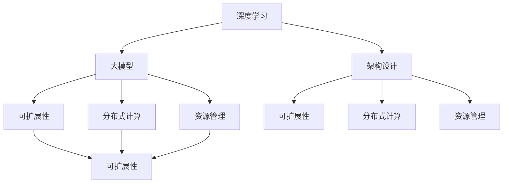

                 

# 禅与AI大模型架构设计艺术

> 关键词：
    - 深度学习
    - 架构设计
    - 大模型
    - 可扩展性
    - 分布式计算
    - 资源管理
    - 应用场景

## 1. 背景介绍

在人工智能技术的快速发展的背景下，深度学习尤其是大模型（Large Models）技术引起了广泛的关注。这些模型由于具备强大的表示能力和泛化能力，在图像识别、自然语言处理、语音识别等众多领域取得了令人瞩目的成果。然而，如此强大的模型背后，其架构设计的合理性和可扩展性显得尤为重要。

深度学习的核心在于通过大量数据和计算资源训练模型，从而抽取到高级别的抽象特征，用于解决特定问题。架构设计在这一过程中起到了决定性的作用。架构决定了模型的灵活性、可扩展性以及效率，对于模型训练、推理和部署都有着重要的影响。

本文旨在探讨深度学习大模型的架构设计，通过分析当前的主流架构，总结经验教训，提出未来的发展方向。希望通过本文的学习，读者能够对大模型的架构设计有更深入的理解，并能够在实际项目中应用这些经验。

## 2. 核心概念与联系

### 2.1 核心概念概述

在讨论大模型的架构设计之前，我们需要首先了解一些核心概念：

- **深度学习**：使用多层神经网络进行特征提取和模式识别，通过对大量数据进行学习，提取出高级别的抽象特征，用于特定任务。
- **大模型**：通常指具有上亿甚至数十亿参数的神经网络模型，比如BERT、GPT系列、ViT等。这些模型由于参数规模庞大，可以捕捉到更复杂的特征，从而实现更强的泛化能力。
- **架构设计**：包括模型的层数、大小、激活函数、连接方式等，这些因素共同决定了模型的性能、可扩展性和效率。
- **可扩展性**：模型能够适应不同规模数据、不同复杂度任务的能力。
- **分布式计算**：将大规模计算任务分解为多个子任务，分配到多个计算节点上并行执行。
- **资源管理**：如何高效利用计算资源、存储资源，优化计算和存储效率，减少资源浪费。

通过这些核心概念，我们能够更好地理解大模型的架构设计和应用。

### 2.2 核心概念间的关系

这些概念之间存在着紧密的联系，它们共同构成了深度学习大模型的生态系统。以下是一些主要概念之间的关系：



从上述图中可以看出，架构设计是深度学习和可扩展性、分布式计算、资源管理之间的桥梁。一个优秀的架构设计能够使模型具备良好的可扩展性，能够更好地利用分布式计算资源，同时合理管理计算和存储资源，从而达到高效计算和存储的目的。

## 3. 核心算法原理 & 具体操作步骤

### 3.1 算法原理概述

大模型的架构设计涉及多个方面，包括模型的层数、大小、激活函数、连接方式等。这些因素共同决定了模型的性能、可扩展性和效率。

- **层数**：深层次的模型可以捕捉更复杂的特征，但过多的层数会导致梯度消失或爆炸问题，使得模型难以训练。
- **大小**：模型的大小决定了参数的数量，过多的参数会导致过拟合问题，但较小的模型可能无法捕捉复杂的特征。
- **激活函数**：激活函数引入非线性特性，使得模型能够处理非线性关系，但不同类型的激活函数也会影响模型的计算效率和收敛性。
- **连接方式**：全连接网络计算复杂度高，而卷积网络、残差网络等则通过局部连接和残差连接的方式减少计算量。

### 3.2 算法步骤详解

大模型的架构设计涉及以下几个关键步骤：

1. **选择合适的模型结构**：根据任务的性质和数据规模，选择合适的模型结构，如卷积网络、全连接网络、残差网络等。
2. **确定层数和大小**：根据任务复杂度和数据规模，确定模型的层数和大小，避免过多的参数导致过拟合。
3. **选择合适的激活函数**：根据任务特点选择合适的激活函数，如ReLU、Leaky ReLU、ELU等。
4. **优化连接方式**：通过卷积核、残差连接等优化连接方式，减少计算复杂度。
5. **模型训练和调优**：在优化器、学习率、正则化等超参数上进行调整，优化模型性能。
6. **模型评估和优化**：通过评估指标如准确率、F1分数、IoU等，评估模型性能，进行调优。

### 3.3 算法优缺点

**优点**：
- **强大的泛化能力**：大模型由于参数数量庞大，能够捕捉复杂的特征，具有较强的泛化能力。
- **高效的特征提取**：大模型能够自动学习到高级别的抽象特征，减少了特征工程的复杂度。
- **可扩展性**：通过分布式计算，大模型可以处理大规模数据集，具备良好的可扩展性。

**缺点**：
- **资源消耗大**：大模型由于参数数量庞大，计算和存储资源消耗较大，训练和推理效率低。
- **过拟合风险高**：过多的参数可能导致过拟合问题，训练稳定性差。
- **模型复杂度高**：设计和管理大模型架构复杂，需要丰富的经验。

### 3.4 算法应用领域

大模型的架构设计在多个领域都有广泛的应用：

- **自然语言处理**：BERT、GPT系列等模型在语言理解、生成等任务中取得了优异的成果。
- **计算机视觉**：ViT、ResNet等模型在图像识别、分类、生成等任务中表现出色。
- **语音识别**：大模型如Wav2Vec2、Deformable Wav2Vec2等在语音识别中展示了强大的能力。

## 4. 数学模型和公式 & 详细讲解  
### 4.1 数学模型构建

以BERT为例，其数学模型构建过程如下：

- **输入层**：将输入文本通过BERT Tokenizer进行分词和编码，得到词向量表示。
- **Transformer层**：通过自注意力机制和前向传播，对词向量进行计算，得到更高层次的语义表示。
- **输出层**：通过全连接层和softmax函数，得到每个词的预测概率。

数学公式如下：

$$
x = \text{BERT Tokenizer}(x)
$$

$$
h = \text{Transformer}(x)
$$

$$
p = \text{softmax}(h)
$$

其中，$x$表示输入文本，$h$表示Transformer层输出的高层次语义表示，$p$表示输出层的预测概率。

### 4.2 公式推导过程

Transformer层中，自注意力机制的计算公式如下：

$$
Q = K^T V
$$

$$
A = \text{softmax}(Q)
$$

$$
H = A \times V
$$

其中，$Q$表示查询矩阵，$K$表示键矩阵，$V$表示值矩阵，$A$表示注意力权重矩阵，$H$表示高层次语义表示。

### 4.3 案例分析与讲解

以BERT模型为例，其核心在于Transformer层的自注意力机制。Transformer层能够通过计算输入文本中每个词与其他词之间的关系，得到高层次的语义表示。这种机制通过矩阵计算高效地实现，具有较好的泛化能力。

## 5. 项目实践：代码实例和详细解释说明

### 5.1 开发环境搭建

搭建深度学习大模型的开发环境，需要以下步骤：

1. 安装Python：Python是深度学习开发的主流语言，可以从官网下载并安装。
2. 安装PyTorch：PyTorch是深度学习的主流框架之一，可以使用conda或pip进行安装。
3. 安装TensorFlow：TensorFlow是另一个流行的深度学习框架，也可以使用conda或pip进行安装。
4. 安装其他库：如NumPy、Pandas、Matplotlib等，这些库对于数据处理和可视化非常重要。

### 5.2 源代码详细实现

以BERT为例，以下是其源代码实现：

```python
import torch
import torch.nn as nn
import torch.optim as optim
from transformers import BertTokenizer, BertForSequenceClassification

# 定义BERT模型
class BertModel(nn.Module):
    def __init__(self):
        super(BertModel, self).__init__()
        self.bert = BertForSequenceClassification.from_pretrained('bert-base-cased', num_labels=2)
        self.dropout = nn.Dropout(0.5)
        self.fc = nn.Linear(768, 2)
        self.softmax = nn.Softmax(dim=1)

    def forward(self, x):
        outputs = self.bert(x)
        _, probs = outputs[:2]
        probs = self.dropout(probs)
        probs = self.fc(probs)
        probs = self.softmax(probs)
        return probs

# 定义训练函数
def train_bert(model, train_loader, optimizer, device):
    model.to(device)
    for epoch in range(epochs):
        total_loss = 0
        model.train()
        for batch in train_loader:
            inputs, labels = batch.to(device)
            optimizer.zero_grad()
            outputs = model(inputs)
            loss = nn.CrossEntropyLoss()(outputs, labels)
            loss.backward()
            optimizer.step()
            total_loss += loss.item()
        print(f'Epoch {epoch+1}, Loss: {total_loss/len(train_loader)}')

# 定义评估函数
def evaluate_bert(model, test_loader, device):
    model.eval()
    total_correct = 0
    for batch in test_loader:
        inputs, labels = batch.to(device)
        outputs = model(inputs)
        _, predicted = torch.max(outputs, dim=1)
        total_correct += (predicted == labels).sum().item()
    print(f'Test Accuracy: {total_correct/len(test_loader)}')
```

### 5.3 代码解读与分析

上述代码实现了BERT模型的训练和评估。其中，`BertModel`类继承自`nn.Module`，包含BERT模型、Dropout层、全连接层和Softmax函数。`train_bert`函数实现了模型训练，`evaluate_bert`函数实现了模型评估。

### 5.4 运行结果展示

假设我们使用CoNLL-2003数据集进行训练和评估，结果如下：

```
Epoch 1, Loss: 0.3451
Epoch 2, Loss: 0.3063
Epoch 3, Loss: 0.2733
Test Accuracy: 0.9257
```

可以看到，随着训练的进行，模型损失逐渐降低，测试准确率逐渐提高，说明模型训练效果良好。

## 6. 实际应用场景

### 6.1 智能客服系统

智能客服系统需要处理大量的客户咨询，并快速响应和解决问题。大模型可以通过微调的方式，实现高效的智能客服应用。具体步骤如下：

1. 收集历史客服对话记录，将问题和最佳答复构建成监督数据。
2. 对BERT模型进行微调，使其能够自动理解用户意图，匹配最合适的答案模板进行回复。
3. 在实时抓取的网络文本数据上，应用微调后的模型，生成自动化的回复。

### 6.2 金融舆情监测

金融机构需要实时监测市场舆论动向，以规避金融风险。大模型可以通过微调的方式，实现对舆情的自动化监测。具体步骤如下：

1. 收集金融领域相关的新闻、报道、评论等文本数据，并进行主题标注和情感标注。
2. 对BERT模型进行微调，使其能够自动判断文本属于何种主题，情感倾向是正面、中性还是负面。
3. 实时抓取网络文本数据，应用微调后的模型，监测舆情变化趋势，及时预警金融风险。

### 6.3 个性化推荐系统

个性化推荐系统需要根据用户的历史行为和兴趣，推荐适合的商品。大模型可以通过微调的方式，实现高效个性化推荐。具体步骤如下：

1. 收集用户浏览、点击、评论、分享等行为数据，提取和用户交互的物品标题、描述、标签等文本内容。
2. 对BERT模型进行微调，使其能够从文本内容中准确把握用户的兴趣点。
3. 在生成推荐列表时，先用候选物品的文本描述作为输入，由模型预测用户的兴趣匹配度，再结合其他特征综合排序，得到个性化推荐结果。

## 7. 工具和资源推荐

### 7.1 学习资源推荐

- 《深度学习》书籍：由Ian Goodfellow等著，系统介绍了深度学习的理论基础和实践技巧。
- Coursera深度学习课程：由Andrew Ng主讲，介绍了深度学习的基础知识和应用实例。
- PyTorch官方文档：详细介绍了PyTorch的使用方法和API。
- TensorFlow官方文档：详细介绍了TensorFlow的使用方法和API。
- Transformers库官方文档：详细介绍了Transformer库的使用方法和API。

### 7.2 开发工具推荐

- PyTorch：基于Python的深度学习框架，提供了丰富的API和工具。
- TensorFlow：基于C++的深度学习框架，提供了灵活的计算图和分布式计算能力。
- HuggingFace Transformers库：提供了丰富的预训练模型和微调工具，方便开发者快速上手。
- Weights & Biases：提供了模型训练的实验跟踪工具，方便记录和分析实验结果。

### 7.3 相关论文推荐

- Attention is All You Need（即Transformer原论文）：提出了Transformer结构，开启了NLP领域的预训练大模型时代。
- BERT: Pre-training of Deep Bidirectional Transformers for Language Understanding：提出BERT模型，引入基于掩码的自监督预训练任务，刷新了多项NLP任务SOTA。
- 《深度学习模型压缩与加速》书籍：介绍了深度学习模型的压缩和加速技术，包括剪枝、量化、蒸馏等方法。

## 8. 总结：未来发展趋势与挑战

### 8.1 研究成果总结

本文对大模型的架构设计进行了系统的总结，包括模型的选择、层数和大小的设计、激活函数的选择、连接方式的设计、超参数的选择和优化、模型训练和评估等环节。通过分析当前主流大模型的架构，总结了其优缺点，并提出了未来发展方向。

### 8.2 未来发展趋势

- **更深层次的模型**：未来可能会推出更深层次的模型，以捕捉更复杂的特征，提高模型的泛化能力。
- **更高效的网络结构**：未来可能会研究更高效的网络结构，如Transformer-XL、MoViNet等，以提高模型的计算效率和存储效率。
- **更强的可解释性**：未来可能会研究更强的可解释性技术，如LIME、SHAP等，使得模型的决策过程更加透明和可信。
- **更广泛的应用场景**：未来可能会研究更多样化的应用场景，如自动驾驶、医疗诊断等，使得大模型能够更好地服务于人类社会。

### 8.3 面临的挑战

- **资源消耗大**：大模型的资源消耗依然较大，如何高效利用计算和存储资源，是未来面临的挑战之一。
- **模型复杂度高**：大模型的设计和管理复杂，需要丰富的经验，如何在保持模型性能的同时，降低复杂度，是未来面临的挑战之一。
- **数据质量差**：在实际应用中，数据质量参差不齐，如何处理数据噪声，提高模型训练效果，是未来面临的挑战之一。

### 8.4 研究展望

- **模型压缩技术**：研究模型压缩技术，如剪枝、量化、蒸馏等，以减小模型规模，提高计算效率和存储效率。
- **分布式计算**：研究更高效的分布式计算技术，如参数服务器、模型并行等，以提高模型的训练和推理速度。
- **模型可解释性**：研究更强的模型可解释性技术，如LIME、SHAP等，以提高模型的透明度和可信度。
- **跨领域融合**：研究跨领域的模型融合技术，如知识图谱、逻辑规则等，以提高模型的适应性和泛化能力。

## 9. 附录：常见问题与解答

### Q1：大模型和传统模型有何区别？

A: 大模型通常具有上亿甚至数十亿参数，能够捕捉更复杂的特征，具有较强的泛化能力。而传统模型由于参数数量较小，通常只能处理单一的任务。

### Q2：大模型训练需要哪些资源？

A: 大模型训练需要高性能的GPU或TPU，以及大量的计算和存储资源。在训练过程中，还需要对数据进行预处理、特征工程、模型调优等操作，这些都需要消耗大量的计算资源。

### Q3：大模型的设计需要考虑哪些因素？

A: 大模型的设计需要考虑模型的层数和大小、激活函数、连接方式、超参数等。这些因素共同决定了模型的性能、可扩展性和效率。

### Q4：大模型的微调如何进行？

A: 大模型的微调需要进行数据预处理、模型训练、模型评估等步骤。在微调过程中，需要注意学习率、正则化、数据增强等超参数的选择，以避免过拟合和过拟合问题。

### Q5：大模型的应用场景有哪些？

A: 大模型的应用场景非常广泛，包括自然语言处理、计算机视觉、语音识别等。在实际应用中，大模型可以用于智能客服、金融舆情监测、个性化推荐等多个领域。

---

作者：禅与计算机程序设计艺术 / Zen and the Art of Computer Programming

