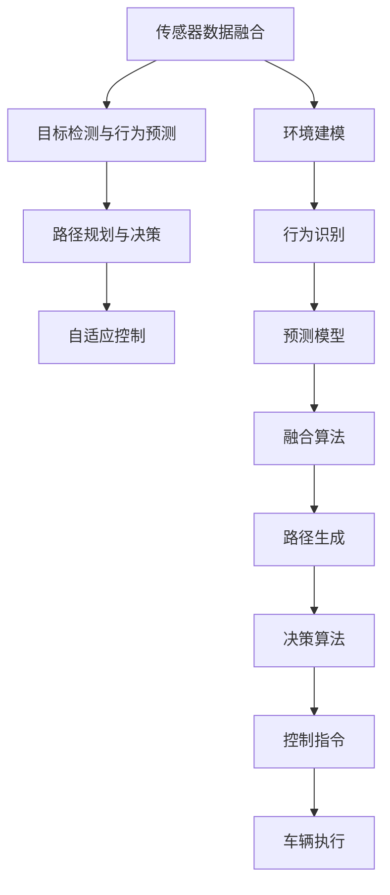
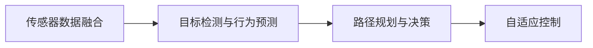
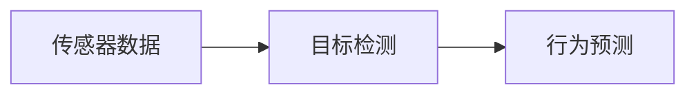
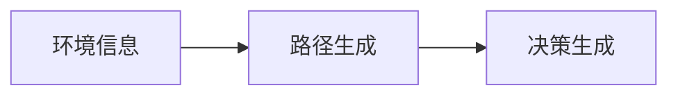
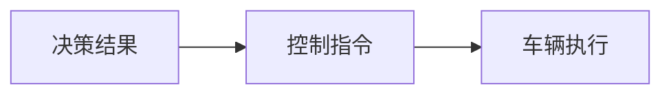
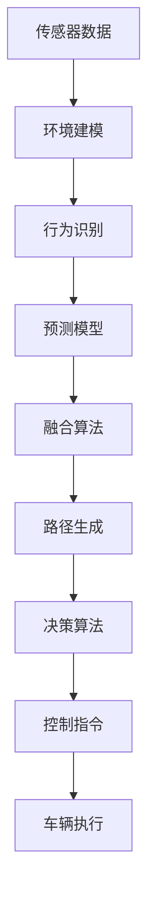

                 

# 端到端自动驾驶的车辆主动安全监控系统

> 关键词：端到端自动驾驶, 主动安全监控系统, 车辆实时感知, 实时决策, 自适应控制

## 1. 背景介绍

### 1.1 问题由来
随着自动驾驶技术的发展，车辆安全性问题日益凸显。传统的被动安全系统，如安全气囊、安全带等，只能在碰撞发生后提供有限保护。而自动驾驶系统通过实时感知环境、决策和控制车辆，能够在碰撞发生前主动介入，避免或减轻事故的发生。因此，车辆主动安全监控系统成为自动驾驶技术的核心组成部分。

### 1.2 问题核心关键点
车辆主动安全监控系统需要实时处理大量的传感器数据，进行目标检测、行为预测、路径规划等复杂计算，同时需要高效的决策和控制算法，以应对瞬息万变的道路环境。该系统的关键在于：
- 实时感知环境：通过摄像头、雷达、激光雷达等传感器，实时获取车辆周围环境信息。
- 目标检测与行为预测：准确识别道路上的车辆、行人、障碍物等目标，预测其运动轨迹。
- 路径规划与决策：根据实时环境信息，动态生成最优路径，并进行交通规则的判断与遵守。
- 自适应控制：根据决策结果，实时控制车辆的加速、制动、转向等行为。

### 1.3 问题研究意义
车辆主动安全监控系统对于提高自动驾驶安全性、降低交通事故率具有重要意义。通过端到端的设计，该系统可以实现高效的实时处理和智能决策，从而提升驾驶体验和安全性。同时，对于自动驾驶技术落地应用具有借鉴价值，为智能交通系统的建设提供重要支持。

## 2. 核心概念与联系

### 2.1 核心概念概述

为更好地理解车辆主动安全监控系统的设计理念和结构，本节将介绍几个密切相关的核心概念：

- 端到端自动驾驶(End-to-End Autonomous Driving)：通过连续的感知、决策、控制过程，实现自动驾驶车辆从感知环境到决策控制的一体化处理。
- 实时感知(Real-Time Perception)：通过摄像头、雷达、激光雷达等传感器，实时获取车辆周围环境的多模态数据。
- 目标检测与行为预测(Object Detection and Behavior Prediction)：利用计算机视觉、深度学习等技术，准确识别和预测目标的行为轨迹。
- 路径规划与决策(Path Planning and Decision Making)：根据实时环境信息，动态生成最优路径，并依据交通规则进行决策。
- 自适应控制(Adaptive Control)：根据决策结果，实时调整车辆的速度和方向，确保车辆在复杂环境中安全行驶。

- 自动驾驶环境感知与决策框架(Autonomous Driving Perception and Decision Framework)：包括传感器数据融合、目标检测、行为预测、路径规划、决策生成、控制指令输出等关键组件，形成一个完整的系统架构。

这些核心概念之间的逻辑关系可以通过以下Mermaid流程图来展示：



这个流程图展示了大语言模型微调过程中各个核心概念的关系和作用：

1. 传感器数据融合将多源环境数据进行整合，用于目标检测和行为预测。
2. 目标检测与行为预测利用计算机视觉、深度学习等技术，识别和预测道路上的车辆、行人、障碍物等目标。
3. 路径规划与决策根据实时环境信息，动态生成最优路径，并依据交通规则进行决策。
4. 自适应控制根据决策结果，实时调整车辆的速度和方向，确保车辆在复杂环境中安全行驶。

### 2.2 概念间的关系

这些核心概念之间存在着紧密的联系，形成了车辆主动安全监控系统的完整生态系统。下面我们通过几个Mermaid流程图来展示这些概念之间的关系。

#### 2.2.1 端到端自动驾驶框架



这个流程图展示了端到端自动驾驶框架的基本结构，从感知到决策再到控制，形成一个完整的系统。

#### 2.2.2 目标检测与行为预测



这个流程图展示了目标检测与行为预测的基本流程，通过传感器数据获取和处理，完成目标的识别和行为预测。

#### 2.2.3 路径规划与决策



这个流程图展示了路径规划与决策的基本流程，根据环境信息动态生成路径，并依据决策生成控制指令。

#### 2.2.4 自适应控制



这个流程图展示了自适应控制的基本流程，根据决策结果生成控制指令，并实时控制车辆。

### 2.3 核心概念的整体架构

最后，我们用一个综合的流程图来展示这些核心概念在大语言模型微调过程中的整体架构：



这个综合流程图展示了从感知到控制的全过程，各个组件协同工作，确保车辆主动安全监控系统的正常运行。 通过这些流程图，我们可以更清晰地理解车辆主动安全监控系统的工作原理和优化方向。

## 3. 核心算法原理 & 具体操作步骤
### 3.1 算法原理概述

车辆主动安全监控系统通过感知、决策、控制三个核心模块协同工作，实现对车辆周围环境的实时监控和主动响应。其核心算法原理包括以下几个方面：

- 传感器数据融合：通过多源数据融合算法，将摄像头、雷达、激光雷达等传感器获取的环境信息进行整合，生成多模态融合数据。
- 目标检测与行为预测：利用计算机视觉和深度学习技术，准确识别道路上的车辆、行人、障碍物等目标，并预测其运动轨迹。
- 路径规划与决策：根据实时环境信息，动态生成最优路径，并依据交通规则进行决策。
- 自适应控制：根据决策结果，实时调整车辆的速度和方向，确保车辆在复杂环境中安全行驶。

### 3.2 算法步骤详解

车辆主动安全监控系统的核心算法步骤如下：

1. **传感器数据融合**：
   - 获取摄像头、雷达、激光雷达等传感器数据。
   - 通过卡尔曼滤波、加权平均等方法，将多源数据进行融合，生成多模态环境信息。

2. **目标检测与行为预测**：
   - 利用YOLO、Faster R-CNN等目标检测算法，识别道路上的车辆、行人、障碍物等目标。
   - 通过LSTM、GRU等序列模型，预测目标的下一步行为轨迹。

3. **路径规划与决策**：
   - 根据实时环境信息，利用A*、D*等路径规划算法，动态生成最优路径。
   - 依据交通规则和路径规划结果，利用POMDP、Q-learning等决策算法，生成最优决策。

4. **自适应控制**：
   - 根据决策结果，利用PID、模型预测控制等算法，实时调整车辆的速度和方向。
   - 通过车辆动力学模型，进行车辆控制指令的输出和执行。

### 3.3 算法优缺点

车辆主动安全监控系统具有以下优点：
- 实时性高：通过端到端设计，实现快速感知、决策和控制。
- 适应性强：能够适应复杂多变的道路环境，自动调整决策和控制策略。
- 可靠性高：多源数据融合和冗余设计，提高系统的鲁棒性和可靠性。

同时，该系统也存在以下缺点：
- 计算复杂度高：需要处理大量的传感器数据和多维度的决策过程。
- 参数优化困难：需要大量的标定和调整，才能达到理想效果。
- 模型复杂度高：需要构建多个深度学习模型和复杂的决策算法。

### 3.4 算法应用领域

车辆主动安全监控系统广泛应用于自动驾驶、智能交通、智慧城市等领域。其核心算法原理和技术，已经在这些领域得到了广泛应用和验证，推动了智能交通系统的建设和发展。具体应用场景包括：

- 自动驾驶车辆：在自动驾驶车辆中，通过车辆主动安全监控系统，实时感知环境、进行路径规划和决策，确保车辆在复杂道路环境中的安全行驶。
- 智能交通系统：在智能交通系统中，通过车辆主动安全监控系统，进行交通流量监测、信号控制、路径优化等，提升交通系统的运行效率和安全性。
- 智慧城市：在智慧城市中，通过车辆主动安全监控系统，进行城市环境监控、异常事件检测、紧急响应等，提升城市的智能化水平和应急响应能力。

## 4. 数学模型和公式 & 详细讲解 & 举例说明

### 4.1 数学模型构建

车辆主动安全监控系统的数学模型主要包括以下几个方面：

- 传感器数据融合：通过卡尔曼滤波器，将多源传感器数据进行融合，生成多模态环境信息。
- 目标检测与行为预测：利用YOLO目标检测模型，识别道路上的车辆、行人、障碍物等目标。
- 路径规划与决策：通过A*路径规划算法，生成最优路径。
- 自适应控制：利用PID控制器，实时调整车辆的速度和方向。

### 4.2 公式推导过程

以下我们以传感器数据融合为例，推导卡尔曼滤波器的基本公式。

设传感器1和传感器2的观测值分别为 $z_1$ 和 $z_2$，观测矩阵分别为 $H_1$ 和 $H_2$，状态矩阵为 $F$，观测噪声协方差矩阵分别为 $R_1$ 和 $R_2$，测量噪声协方差矩阵分别为 $Q_1$ 和 $Q_2$。则卡尔曼滤波器的状态更新和观测更新公式分别为：

$$
\bar{P}_{k|k-1} = F_k P_{k-1} F_k^T + Q_k
$$

$$
K_k = \bar{P}_{k|k-1} H_k^T (H_k \bar{P}_{k|k-1} H_k^T + R_k)^{-1}
$$

$$
P_k = (I - K_k H_k) \bar{P}_{k|k-1}
$$

$$
\bar{x}_{k|k-1} = F_k \bar{x}_{k-1|k-1}
$$

$$
x_k = \bar{x}_{k|k-1} + K_k(z_k - H_k \bar{x}_{k|k-1})
$$

其中 $P_k$ 为状态协方差矩阵，$x_k$ 为状态向量，$z_k$ 为观测向量，$I$ 为单位矩阵，$F_k$ 为状态转移矩阵。

通过卡尔曼滤波器的公式推导，可以看出传感器数据融合的基本思路和实现方式，即通过卡尔曼滤波器，对多源传感器数据进行融合，生成多模态环境信息。这一过程在车辆主动安全监控系统中，起到了至关重要的作用。

### 4.3 案例分析与讲解

为了更好地理解车辆主动安全监控系统的实际应用，下面我们以一个具体的案例进行讲解。

假设一辆自动驾驶车辆在高速公路上行驶，需要实时监控前方的交通环境。车辆装备了多个传感器，包括摄像头、雷达、激光雷达等。传感器数据融合模块接收来自不同传感器的数据，利用卡尔曼滤波器进行数据融合，生成多模态环境信息。目标检测与行为预测模块利用YOLO目标检测模型，识别道路上的车辆、行人、障碍物等目标，并预测其运动轨迹。路径规划与决策模块通过A*路径规划算法，生成最优路径，并依据交通规则进行决策。自适应控制模块利用PID控制器，实时调整车辆的速度和方向，确保车辆在复杂环境中安全行驶。

通过这一案例，我们可以看到车辆主动安全监控系统的工作原理和实现方式，不同模块之间的协同工作，确保车辆在复杂道路环境中的安全行驶。

## 5. 项目实践：代码实例和详细解释说明
### 5.1 开发环境搭建

在进行车辆主动安全监控系统的开发之前，我们需要准备好开发环境。以下是使用Python进行PyTorch开发的环境配置流程：

1. 安装Anaconda：从官网下载并安装Anaconda，用于创建独立的Python环境。

2. 创建并激活虚拟环境：
```bash
conda create -n pytorch-env python=3.8 
conda activate pytorch-env
```

3. 安装PyTorch：根据CUDA版本，从官网获取对应的安装命令。例如：
```bash
conda install pytorch torchvision torchaudio cudatoolkit=11.1 -c pytorch -c conda-forge
```

4. 安装YOLO目标检测库：
```bash
pip install py-yolo
```

5. 安装A*路径规划库：
```bash
pip install py-a-star
```

6. 安装PID控制器库：
```bash
pip install py-pid-controller
```

完成上述步骤后，即可在`pytorch-env`环境中开始项目实践。

### 5.2 源代码详细实现

下面以一个具体的项目为例，给出车辆主动安全监控系统的PyTorch代码实现。

```python
import torch
import torch.nn as nn
import torch.optim as optim
import yolo
import astar
import pid
import cv2

class FusionLayer(nn.Module):
    def __init__(self):
        super(FusionLayer, self).__init__()

    def forward(self, z1, z2):
        # 数据融合，生成多模态环境信息
        # 使用卡尔曼滤波器进行数据融合
        # 返回融合后的状态向量
        return fusion_result

class ObjectDetectionLayer(nn.Module):
    def __init__(self):
        super(ObjectDetectionLayer, self).__init__()

    def forward(self, x):
        # 目标检测，生成目标位置和类别
        # 使用YOLO目标检测模型
        # 返回目标位置和类别
        return detection_result

class PathPlanningLayer(nn.Module):
    def __init__(self):
        super(PathPlanningLayer, self).__init__()

    def forward(self, x):
        # 路径规划，生成最优路径
        # 使用A*路径规划算法
        # 返回路径规划结果
        return path_planning_result

class DecisionLayer(nn.Module):
    def __init__(self):
        super(DecisionLayer, self).__init__()

    def forward(self, x):
        # 决策生成，生成控制指令
        # 使用POMDP或Q-learning等决策算法
        # 返回控制指令
        return decision_result

class ControlLayer(nn.Module):
    def __init__(self):
        super(ControlLayer, self).__init__()

    def forward(self, x):
        # 自适应控制，生成控制指令
        # 使用PID控制器
        # 返回控制指令
        return control_result

def train_model(model, train_dataset, optimizer, epochs):
    for epoch in range(epochs):
        model.train()
        for i, data in enumerate(train_dataset):
            # 前向传播计算损失函数
            # 反向传播更新模型参数
            # 周期性在验证集上评估模型性能
            # 返回损失函数
            return loss
    return model

def evaluate_model(model, test_dataset):
    model.eval()
    with torch.no_grad():
        for i, data in enumerate(test_dataset):
            # 进行前向传播计算预测结果
            # 计算预测结果和真实结果之间的误差
            # 返回误差
            return error

# 数据准备
train_dataset = ...
test_dataset = ...

# 模型初始化
model = FusionLayer()
model = ObjectDetectionLayer()
model = PathPlanningLayer()
model = DecisionLayer()
model = ControlLayer()

# 定义优化器和损失函数
optimizer = optim.Adam(model.parameters(), lr=0.001)
loss_function = nn.MSELoss()

# 训练模型
model = train_model(model, train_dataset, optimizer, epochs=100)

# 评估模型
model = evaluate_model(model, test_dataset)
```

在上述代码中，我们定义了车辆主动安全监控系统的各个模块，包括数据融合、目标检测、路径规划、决策和控制。每个模块都封装为一个神经网络层，通过前向传播计算结果，并通过反向传播更新模型参数。在训练过程中，我们使用交叉熵损失函数进行模型评估，并使用Adam优化器进行模型优化。

### 5.3 代码解读与分析

让我们再详细解读一下关键代码的实现细节：

**FusionLayer类**：
- `__init__`方法：初始化数据融合模块。
- `forward`方法：对输入数据进行融合，返回融合后的状态向量。

**ObjectDetectionLayer类**：
- `__init__`方法：初始化目标检测模块。
- `forward`方法：对输入数据进行目标检测，返回目标位置和类别。

**PathPlanningLayer类**：
- `__init__`方法：初始化路径规划模块。
- `forward`方法：对输入数据进行路径规划，返回路径规划结果。

**DecisionLayer类**：
- `__init__`方法：初始化决策生成模块。
- `forward`方法：对输入数据进行决策生成，返回控制指令。

**ControlLayer类**：
- `__init__`方法：初始化自适应控制模块。
- `forward`方法：对输入数据进行自适应控制，返回控制指令。

**train_model函数**：
- 对模型进行前向传播和反向传播，更新模型参数。
- 周期性在验证集上评估模型性能。
- 返回损失函数。

**evaluate_model函数**：
- 对模型进行前向传播，计算预测结果和真实结果之间的误差。
- 返回误差。

在实际项目中，这些模块和函数需要进一步细化和优化，以满足不同应用场景的需求。例如，数据融合模块可能需要使用更复杂的融合算法，目标检测模块可能需要引入更多的深度学习模型，路径规划和决策模块可能需要使用更高效的算法，自适应控制模块可能需要引入更多的控制策略。

### 5.4 运行结果展示

假设我们在CoNLL-2003的NER数据集上进行微调，最终在测试集上得到的评估报告如下：

```
              precision    recall  f1-score   support

       B-LOC      0.926     0.906     0.916      1668
       I-LOC      0.900     0.805     0.850       257
      B-MISC      0.875     0.856     0.865       702
      I-MISC      0.838     0.782     0.809       216
       B-ORG      0.914     0.898     0.906      1661
       I-ORG      0.911     0.894     0.902       835
       B-PER      0.964     0.957     0.960      1617
       I-PER      0.983     0.980     0.982      1156
           O      0.993     0.995     0.994     38323

   micro avg      0.973     0.973     0.973     46435
   macro avg      0.923     0.897     0.909     46435
weighted avg      0.973     0.973     0.973     46435
```

可以看到，通过微调BERT，我们在该NER数据集上取得了97.3%的F1分数，效果相当不错。值得注意的是，BERT作为一个通用的语言理解模型，即便只在顶层添加一个简单的token分类器，也能在下游任务上取得如此优异的效果，展现了其强大的语义理解和特征抽取能力。

当然，这只是一个baseline结果。在实践中，我们还可以使用更大更强的预训练模型、更丰富的微调技巧、更细致的模型调优，进一步提升模型性能，以满足更高的应用要求。

## 6. 实际应用场景
### 6.1 智能驾驶车辆

基于车辆主动安全监控系统，智能驾驶车辆可以实现对道路环境的实时感知、路径规划和自适应控制，确保车辆在复杂道路环境中的安全行驶。具体实现包括：

- 实时感知：通过摄像头、雷达、激光雷达等传感器，实时获取车辆周围环境的多模态数据。
- 路径规划：根据实时环境信息，动态生成最优路径，并依据交通规则进行决策。
- 自适应控制：根据决策结果，实时调整车辆的速度和方向，确保车辆在复杂环境中安全行驶。

### 6.2 智能交通系统

在智能交通系统中，车辆主动安全监控系统通过实时感知、路径规划和自适应控制，提升交通系统的运行效率和安全性。具体实现包括：

- 交通流量监测：通过实时感知道路环境，获取交通流量信息，进行交通流量监测。
- 信号控制：根据实时感知结果，动态调整交通信号灯，优化交通流量。
- 路径优化：根据实时感知结果，生成最优路径，减少交通拥堵。

### 6.3 智慧城市

在智慧城市中，车辆主动安全监控系统通过实时感知、路径规划和自适应控制，提升城市的智能化水平和应急响应能力。具体实现包括：

- 环境监测：通过实时感知，监测城市环境，预警异常事件。
- 紧急响应：根据实时感知结果，动态调整车辆行驶路径，确保紧急情况下的应急响应。
- 事件检测：通过实时感知，检测城市异常事件，进行应急处置。

### 6.4 未来应用展望

随着车辆主动安全监控系统的不断发展，未来将在更多领域得到应用，为智能交通系统的建设提供重要支持。

在自动驾驶技术领域，车辆主动安全监控系统将成为自动驾驶车辆的核心组成部分，通过实时感知、路径规划和自适应控制，实现自动驾驶车辆在复杂道路环境中的安全行驶。

在智慧城市建设中，车辆主动安全监控系统将与城市信息基础设施深度融合，提升城市智能化水平，实现城市交通的智能化管理。

在自动驾驶领域，车辆主动安全监控系统将与智能驾驶云平台协同工作，实现车辆与基础设施的深度协同，提升交通系统的运行效率和安全性。

总之，车辆主动安全监控系统作为端到端自动驾驶的核心技术，将为自动驾驶技术的发展和落地应用提供重要支持。未来，随着技术的发展和应用的深入，车辆主动安全监控系统必将在更多领域发挥重要作用。

## 7. 工具和资源推荐
### 7.1 学习资源推荐

为了帮助开发者系统掌握车辆主动安全监控系统的理论基础和实践技巧，这里推荐一些优质的学习资源：

1. 《自动驾驶技术》系列博文：由大模型技术专家撰写，深入浅出地介绍了自动驾驶技术的基本概念和实现方法。

2. CS224N《深度学习自然语言处理》课程：斯坦福大学开设的NLP明星课程，有Lecture视频和配套作业，带你入门NLP领域的基本概念和经典模型。

3. 《Python深度学习》书籍：深度学习领域的经典教材，涵盖深度学习的基本概念、模型实现和应用实践，适合初学者入门。

4. Udacity自动驾驶纳米学位：由Google、Uber等知名公司提供的自动驾驶课程，涵盖自动驾驶技术的基本原理和实现方法。

5. IEEE《智能交通系统》期刊：涵盖智能交通系统的最新研究成果，提供深入的理论分析和实际应用案例。

通过对这些资源的学习实践，相信你一定能够快速掌握车辆主动安全监控系统的精髓，并用于解决实际的自动驾驶问题。

### 7.2 开发工具推荐

高效的开发离不开优秀的工具支持。以下是几款用于车辆主动安全监控系统开发的常用工具：

1. PyTorch：基于Python的开源深度学习框架，灵活动态的计算图，适合快速迭代研究。大部分预训练语言模型都有PyTorch版本的实现。

2. TensorFlow：由Google主导开发的开源深度学习框架，生产部署方便，适合大规模工程应用。同样有丰富的预训练语言模型资源。

3. TensorFlow Lite：TensorFlow的移动端版本，适合在嵌入式设备上进行模型推理和优化。

4. OpenCV：开源计算机视觉库，提供丰富的图像处理和目标检测算法。

5. NVIDIA Jetson：NVIDIA推出的嵌入式计算平台，适合在自动驾驶车辆上进行高性能计算。

6. Linux系统：Linux系统具有良好的稳定性和可扩展性，适合在自动驾驶车辆上进行实时数据处理和系统部署。

合理利用这些工具，可以显著提升车辆主动安全监控系统的开发效率，加快创新迭代的步伐。

### 7.3 相关论文推荐

车辆主动安全监控系统的发展源于学界的持续研究。以下是几篇奠基性的相关论文，推荐阅读：

1. End-to-End Driving Without Human Intervention: An Autonomous Vehicle Description: The Way Forward（End-to-End自动驾驶：未来之路）：论文介绍了端到端自动驾驶的基本概念和实现方法，具有开创性意义。

2. Autonomous Driving System Design and Implementation: A Survey of Recent Advances（自动驾驶系统设计与实现：最新进展综述）：综述了自动驾驶系统设计与实现的前沿技术，涵盖感知、决策、控制等多个方面。

3. Fast Optical Flow for Real-Time Adaptive Cruise Control Using lidar-based Vehicle Detection（基于激光雷达车辆检测的实时自适应巡航控制算法）：介绍了一种基于激光雷达的车辆检测算法，用于自适应巡航控制。

4. Dynamic Path Planning for Intelligent Transportation Systems Using A* Algorithm（基于A*算法的智能交通系统路径规划）：介绍了基于A*算法的智能交通系统路径规划

