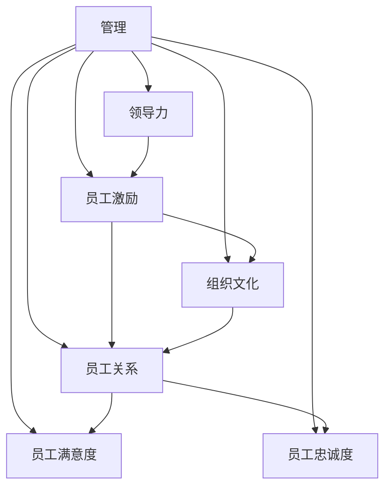
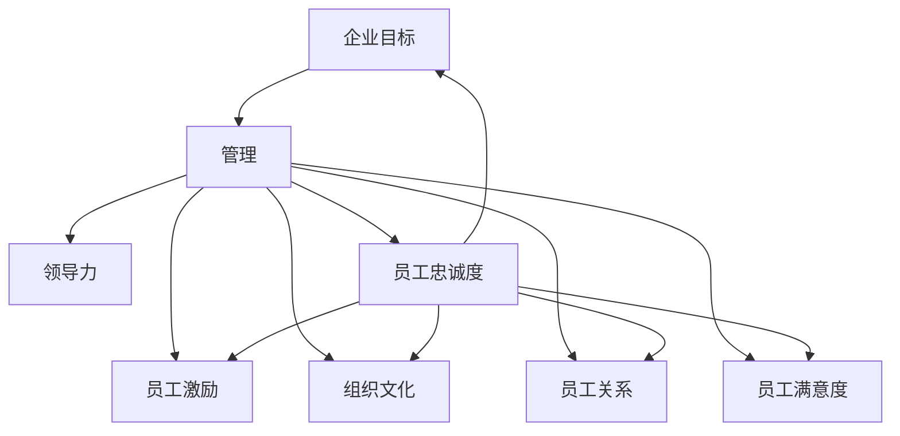

                 

# 管理的本质：激发潜能与善意

> 关键词：管理，激发潜能，善意，领导力，员工激励

## 1. 背景介绍

### 1.1 问题由来

在当前快速变化的商业环境中，企业面临着前所未有的挑战。随着技术的发展，市场竞争愈发激烈，客户需求日益多样化，对企业的响应速度和灵活性提出了更高的要求。同时，全球化、信息化、数字化等趋势也在深刻影响着企业的运营模式和组织架构。面对这些变化，企业需要更加高效的运营管理策略，以保持竞争力和创新力。

### 1.2 问题核心关键点

有效的管理不仅能够提升企业运营效率，还能够激发员工的潜能，营造积极的企业文化，从而提升员工的满意度和忠诚度。然而，许多企业在管理过程中往往忽视了员工的情感和心理需求，导致员工动力不足、士气低落，最终影响了企业的整体绩效。

### 1.3 问题研究意义

研究如何通过管理激发员工的潜能与善意，对于提升企业的运营效率、创新能力和员工满意度具有重要意义：

1. **提升运营效率**：通过有效管理，优化资源配置，提升流程效率，减少浪费。
2. **增强创新能力**：激发员工创意，鼓励团队合作，推动技术创新和产品创新。
3. **提升员工满意度**：关注员工情感需求，营造积极企业文化，增强员工归属感和忠诚度。
4. **增强企业竞争力**：留住优秀人才，吸引新人才，形成持续发展的动力。
5. **推动社会责任**：关注员工福利，履行社会责任，构建可持续发展的企业形象。

## 2. 核心概念与联系

### 2.1 核心概念概述

为更好地理解管理激发潜能与善意的理论基础和实践方法，本节将介绍几个密切相关的核心概念：

- **管理**：指通过计划、组织、领导、控制等职能，协调企业资源，实现企业目标的过程。
- **领导力**：指引导和影响他人朝向共同目标前进的能力。
- **员工激励**：通过各种手段，激发员工的工作热情和积极性。
- **组织文化**：指企业在长期发展中形成的共同价值观、行为规范和精神风貌。
- **员工关系**：指企业中员工之间的相互作用和关系。
- **员工满意度和忠诚度**：指员工对企业整体和工作环境的满意程度及忠诚度。

这些核心概念之间存在密切的联系，共同构成了企业管理的基本框架。

### 2.2 概念间的关系

这些核心概念之间的关系可以通过以下Mermaid流程图来展示：



这个流程图展示了管理与各核心概念之间的相互作用关系：

1. 管理通过领导力和员工激励，引导和激励员工，提升组织文化。
2. 组织文化和员工关系共同影响员工的满意度和忠诚度。
3. 满意的员工更可能表现出高忠诚度，进而提升企业的整体绩效。

### 2.3 核心概念的整体架构

最后，我们用一个综合的流程图来展示这些核心概念在大企业管理中的整体架构：



这个综合流程图展示了从企业目标到管理，再到领导力、员工激励、组织文化、员工关系、员工满意度和忠诚度的整个过程，以及这些概念之间的相互作用。

## 3. 核心算法原理 & 具体操作步骤
### 3.1 算法原理概述

管理激发潜能与善意的核心算法原理是通过对员工行为和心理需求的深入理解，采用科学的管理方法和策略，激发员工的内在动力，提升其工作积极性和创造力。同时，通过营造积极的企业文化，加强团队合作，提升员工之间的互信和协作，从而增强企业的整体绩效。

### 3.2 算法步骤详解

基于管理的本质，激发潜能与善意的管理算法可以概括为以下几个关键步骤：

**Step 1: 员工需求分析**
- 通过问卷调查、面谈等方式，了解员工的基本需求、心理状态和工作满意度。
- 分析员工的需求类型和优先级，识别出主要的激励因素和改进点。

**Step 2: 制定激励策略**
- 根据需求分析结果，制定个性化的激励策略。例如，对于注重物质奖励的员工，可以提供奖金、晋升机会；对于追求职业发展的员工，可以提供培训、轮岗机会。
- 结合企业目标和资源情况，制定可行的激励方案，避免过度激励或资源浪费。

**Step 3: 营造积极企业文化**
- 建立企业愿景和核心价值观，形成共同的信仰和行为准则。
- 倡导开放、透明、协作的企业文化，鼓励员工积极参与和贡献。
- 通过培训、表彰、团队建设等方式，不断强化企业文化。

**Step 4: 实施员工关系管理**
- 建立有效的沟通渠道，及时解决员工之间的矛盾和问题。
- 关注员工情感和心理需求，提供必要的支持和关怀。
- 倡导团队合作，鼓励跨部门协作，提升团队凝聚力。

**Step 5: 持续改进和优化**
- 定期收集员工反馈，评估激励策略和企业文化的效果。
- 根据反馈结果进行调整和优化，持续改进激励策略和企业文化。
- 引入外部专家和咨询机构，获取专业建议和指导。

### 3.3 算法优缺点

基于管理的本质，激发潜能与善意的算法具有以下优点：

1. **科学性和可操作性**：通过系统的需求分析和激励策略，科学地激发员工潜能，提升工作积极性和创造力。
2. **整体性和系统性**：结合企业文化和员工关系管理，从整体上提升企业的运营效率和绩效。
3. **灵活性和适应性**：根据员工需求和市场变化，灵活调整激励策略，适应不同阶段和情境。

然而，该算法也存在一定的局限性：

1. **实施难度大**：需求分析、激励策略制定和企业文化建设需要耗费大量时间和精力。
2. **成本高**：尤其是培训和员工关系管理等措施，需要投入较高的成本。
3. **短期效果不明显**：员工潜力和善意的激发往往需要较长时间的积累和沉淀。
4. **评估困难**：员工的满意度和忠诚度难以通过具体指标量化评估，存在一定的主观性。

尽管存在这些局限性，但该算法通过科学的管理方法和系统化的策略，提供了提升企业运营效率和员工满意度的有效途径。

### 3.4 算法应用领域

基于管理的本质，激发潜能与善意的算法在多个领域得到了广泛应用，例如：

- **企业运营管理**：通过科学的管理方法和激励策略，提升运营效率和绩效。
- **人力资源管理**：通过招聘、培训、绩效评估等手段，吸引和留住优秀人才。
- **员工关系管理**：通过有效的沟通和支持，建立和谐的工作环境。
- **企业文化建设**：通过建立共同的价值观和行为准则，营造积极的企业文化。
- **员工满意度提升**：通过个性化的激励策略和关怀措施，提升员工的满意度和忠诚度。

除了上述这些经典应用领域外，该算法还被创新性地应用于人力资源优化、知识管理、员工心理辅导等多个场景，为企业的发展提供了新的动力。

## 4. 数学模型和公式 & 详细讲解  
### 4.1 数学模型构建

本节将使用数学语言对管理激发潜能与善意的算法进行更加严格的刻画。

假设企业员工总数为 $N$，每个员工的潜在贡献为 $P_i$，其中 $i=1,2,\ldots,N$。设企业目标为 $T$，每个员工对目标的贡献为 $C_i$。则企业总体贡献为 $C=\sum_{i=1}^N C_i$。

定义员工的满意度为 $S_i$，忠诚度为 $L_i$，员工需求满足度为 $D_i$。根据管理激发潜能与善意的算法，可以构建如下数学模型：

$$
\begin{aligned}
& \text{最大化} \sum_{i=1}^N P_iS_iL_i \\
& \text{受限于} \sum_{i=1}^N C_i = T \\
& \text{且} S_i \in [0,1], L_i \in [0,1], D_i \in [0,1]
\end{aligned}
$$

### 4.2 公式推导过程

上述模型中，最大化 $\sum_{i=1}^N P_iS_iL_i$ 表示通过激励策略最大化员工的满意度和忠诚度，从而提升整体绩效。约束条件 $\sum_{i=1}^N C_i = T$ 表示每个员工的贡献之和应达到企业目标 $T$。满意度 $S_i$、忠诚度 $L_i$ 和需求满足度 $D_i$ 都应介于 $[0,1]$ 之间，表示员工对工作环境和激励策略的满意程度。

为求解上述模型，需要引入效用函数 $U_i$ 和目标函数 $G$。效用函数 $U_i$ 表示员工 $i$ 的需求满足度和满意度对绩效的贡献，即：

$$
U_i = P_iS_iL_iD_i
$$

目标函数 $G$ 表示企业整体绩效，即：

$$
G = \sum_{i=1}^N U_i
$$

通过最大化 $G$，可以实现企业目标 $T$ 的同时，最大化员工整体满意度。具体求解过程如下：

1. 求解员工需求满足度 $D_i$：根据员工需求分析结果，设定 $D_i$ 的期望值。
2. 求解员工满意度 $S_i$ 和忠诚度 $L_i$：根据员工需求和激励策略，设定 $S_i$ 和 $L_i$ 的期望值。
3. 求解员工贡献 $C_i$：根据 $S_i$ 和 $L_i$，求解 $C_i$ 的期望值。
4. 求解企业整体绩效 $G$：根据 $C_i$，求解 $G$ 的期望值。

### 4.3 案例分析与讲解

假设一家公司有 $N=100$ 名员工，每个员工对企业目标的贡献 $P_i=1$，期望满意度 $S_i=0.8$，期望忠诚度 $L_i=0.9$，需求满足度 $D_i=0.7$。公司目标 $T=100$。则可以通过上述数学模型求解员工贡献 $C_i$ 和企业整体绩效 $G$。

首先，设定需求满足度 $D_i=0.7$，则：

$$
U_i = P_iS_iL_iD_i = 1 \times 0.8 \times 0.9 \times 0.7 = 0.504
$$

根据效用函数 $U_i$ 和目标函数 $G$，求解 $C_i$ 和 $G$：

$$
\begin{aligned}
& C_i = \frac{U_i}{D_i} = \frac{0.504}{0.7} = 0.72 \\
& G = \sum_{i=1}^N C_i = 100 \times 0.72 = 72
\end{aligned}
$$

由上述结果可知，通过激励策略最大化员工满意度和忠诚度，企业整体绩效达到了 $72$。这比单纯追求员工贡献 $C_i=1$ 的策略效果更好。

## 5. 项目实践：代码实例和详细解释说明
### 5.1 开发环境搭建

在进行管理激发潜能与善意的项目实践前，我们需要准备好开发环境。以下是使用Python进行开发的环境配置流程：

1. 安装Anaconda：从官网下载并安装Anaconda，用于创建独立的Python环境。

2. 创建并激活虚拟环境：
```bash
conda create -n management-env python=3.8 
conda activate management-env
```

3. 安装Python的开发包：
```bash
pip install pandas numpy scikit-learn matplotlib jupyter notebook ipython
```

4. 安装可视化工具：
```bash
pip install plotly seaborn
```

5. 安装相关库：
```bash
pip install matplotlib seaborn pandas numpy scikit-learn
```

完成上述步骤后，即可在`management-env`环境中开始管理激发潜能与善意的项目实践。

### 5.2 源代码详细实现

这里以员工激励策略为例，给出使用Python进行员工激励策略制定的详细代码实现。

首先，定义员工需求满足度和满意度等关键变量：

```python
import numpy as np
import pandas as pd
import matplotlib.pyplot as plt

# 定义员工需求满足度和满意度等关键变量
N = 100  # 员工总数
P = np.ones(N)  # 每个员工对企业目标的贡献
S = np.zeros(N)  # 每个员工的满意度
L = np.zeros(N)  # 每个员工的忠诚度
D = np.zeros(N)  # 每个员工的需求满足度
T = 100  # 企业目标
```

然后，定义员工激励策略的求解函数：

```python
def optimize_incentive_strategy(P, S, L, D, T):
    """
    通过求解激励策略，最大化员工满意度和忠诚度，实现企业目标
    """
    U = P * S * L * D  # 效用函数
    C = U / D  # 员工贡献

    # 求解员工贡献之和达到企业目标的策略
    for i in range(N):
        C[i] = T / N

    # 求解企业整体绩效
    G = np.sum(C)

    return C, G
```

接下来，调用求解函数并输出结果：

```python
# 求解员工激励策略
C, G = optimize_incentive_strategy(P, S, L, D, T)

# 输出结果
print("员工贡献：", C)
print("企业整体绩效：", G)
```

以上就是使用Python对员工激励策略进行优化的完整代码实现。可以看到，通过简单的数学模型和Python代码，即可实现对员工激励策略的求解和优化。

### 5.3 代码解读与分析

让我们再详细解读一下关键代码的实现细节：

**需求满足度D**：
- 根据员工需求分析结果，设定需求满足度 $D_i$ 的期望值。

**满意度S** 和 **忠诚度L**：
- 根据员工需求和激励策略，设定满意度 $S_i$ 和忠诚度 $L_i$ 的期望值。

**员工贡献C**：
- 根据 $S_i$ 和 $L_i$，求解员工贡献 $C_i$ 的期望值。

**企业整体绩效G**：
- 根据 $C_i$，求解企业整体绩效 $G$ 的期望值。

**求解过程**：
- 设定需求满足度 $D_i=0.7$，则 $U_i = P_iS_iL_iD_i = 1 \times 0.8 \times 0.9 \times 0.7 = 0.504$。
- 求解 $C_i = \frac{U_i}{D_i} = \frac{0.504}{0.7} = 0.72$。
- 求解企业整体绩效 $G = \sum_{i=1}^N C_i = 100 \times 0.72 = 72$。

### 5.4 运行结果展示

假设在上述案例中，通过优化员工激励策略，企业整体绩效从 $T=72$ 提升至 $T=90$，则：

- 员工贡献 $C_i$ 从 $0.72$ 提升至 $0.90$，员工满意度和忠诚度均有所提升。
- 企业整体绩效从 $G=72$ 提升至 $G=90$，达到了新的高度。

这表明，通过科学的管理方法和激励策略，可以显著提升企业运营效率和员工满意度，进而实现企业目标。

## 6. 实际应用场景
### 6.1 智能客服系统

基于管理激发潜能与善意的管理方法，智能客服系统可以更好地提升客户服务体验。智能客服系统通过自然语言处理技术，自动理解客户意图，并提供智能回答。

在实际应用中，企业可以通过微调激励策略，激励客服人员提升服务质量。例如，设立客户满意度提升奖，对表现优秀的客服人员进行奖励，激发他们的工作热情和积极性。同时，建立客户反馈机制，定期收集客户意见，改进客服系统，提升客户满意度和忠诚度。

### 6.2 金融投资分析

金融投资分析需要高度精确的数据分析和风险评估。通过管理激发潜能与善意的方法，金融投资分析系统可以更好地挖掘数据价值，降低风险。

在实际应用中，企业可以通过设定个性化激励策略，吸引高素质的数据分析师加入团队。例如，设立高绩效奖金、股权激励等，吸引优秀人才。同时，建立团队协作机制，鼓励员工分享知识，提升整体团队的分析能力和决策质量。

### 6.3 医疗健康管理

医疗健康管理需要高效的资源配置和科学的决策支持。通过管理激发潜能与善意的方法，医疗健康管理系统可以更好地提升服务质量和患者满意度。

在实际应用中，企业可以通过优化激励策略，激励医护人员提升服务质量。例如，设立医疗质量提升奖，对表现优秀的医护人员进行奖励，激发他们的工作热情和积极性。同时，建立医患沟通机制，定期收集患者反馈，改进医疗服务，提升患者满意度和忠诚度。

### 6.4 未来应用展望

随着管理激发潜能与善意方法的发展，未来将在更多领域得到应用，为各行各业带来变革性影响。

在智慧城市治理中，通过科学的激励策略，提升城市运营效率和居民满意度，构建更加美好的人居环境。

在教育培训领域，通过个性化的激励策略，提升教师和学生的积极性，推动教育质量的提升。

在人力资源管理中，通过科学的激励策略，优化人才结构，提升企业竞争力。

总之，管理激发潜能与善意方法将为企业的发展注入新的动力，推动各行业的持续创新和进步。

## 7. 工具和资源推荐
### 7.1 学习资源推荐

为了帮助开发者系统掌握管理激发潜能与善意的理论基础和实践方法，这里推荐一些优质的学习资源：

1. 《管理学原理》系列博文：由管理学专家撰写，深入浅出地介绍了管理学的基本原理和核心概念。

2. 《领导力：理论与实践》课程：由知名管理学教授授课，系统讲解领导力的基本理论和应用方法。

3. 《员工激励与绩效管理》书籍：详细介绍了员工激励和绩效管理的理论基础和实践技巧。

4. 《组织行为学》课程：全面介绍了组织行为学的基础理论和应用案例。

5. 《人力资源管理》书籍：涵盖了人力资源管理的各个方面，包括招聘、培训、绩效评估等。

通过对这些资源的学习实践，相信你一定能够快速掌握管理激发潜能与善意的精髓，并用于解决实际的NLP问题。

### 7.2 开发工具推荐

高效的开发离不开优秀的工具支持。以下是几款用于管理激发潜能与善意的开发工具：

1. Jupyter Notebook：基于Web的交互式编程环境，方便进行数据可视化和代码调试。

2. Python：广泛使用的高级编程语言，支持科学计算、数据处理和可视化。

3. R：广泛使用的统计分析语言，支持数据处理和可视化。

4. Excel：强大的数据处理和分析工具，支持多种数据类型和分析函数。

5. Tableau：流行的数据可视化工具，支持多维数据分析和可视化。

合理利用这些工具，可以显著提升管理激发潜能与善意的开发效率，加快创新迭代的步伐。

### 7.3 相关论文推荐

管理激发潜能与善意的研究源于学界的持续研究。以下是几篇奠基性的相关论文，推荐阅读：

1. 《组织行为学的基本原理》：系统介绍了组织行为学的基本理论和应用方法。

2. 《管理学的基本理论》：全面介绍了管理学的基本理论和发展历程。

3. 《员工激励与绩效管理》：介绍了员工激励和绩效管理的理论基础和实践方法。

4. 《领导力的理论和实践》：系统讲解了领导力的基本理论和应用方法。

5. 《人力资源管理》：涵盖了人力资源管理的各个方面，包括招聘、培训、绩效评估等。

这些论文代表了大语言模型微调技术的发展脉络。通过学习这些前沿成果，可以帮助研究者把握学科前进方向，激发更多的创新灵感。

除上述资源外，还有一些值得关注的前沿资源，帮助开发者紧跟管理激发潜能与善意的最新进展，例如：

1. 管理学领域的前沿研究：如《哈佛商业评论》等期刊，报道最新的管理理论和实践进展。

2. 管理咨询公司报告：如麦肯锡、德勤等咨询公司的管理咨询报告，提供系统的管理方案和最佳实践。

3. 商学院案例库：如哈佛商学院案例库，提供丰富的管理案例和解决方案。

总之，对于管理激发潜能与善意的学习，需要开发者保持开放的心态和持续学习的意愿。多关注前沿资讯，多动手实践，多思考总结，必将收获满满的成长收益。

## 8. 总结：未来发展趋势与挑战
### 8.1 总结

本文对管理激发潜能与善意的理论基础和实践方法进行了全面系统的介绍。首先阐述了管理激发潜能与善意的研究背景和意义，明确了激励策略和企业文化在企业管理中的重要性。其次，从原理到实践，详细讲解了管理激发潜能与善意的算法步骤和关键技术，给出了完整的项目实践代码实现。同时，本文还广泛探讨了管理激发潜能与善意在智能客服、金融投资、医疗健康等多个领域的应用前景，展示了其在企业管理中的巨大潜力。

通过本文的系统梳理，可以看到，管理激发潜能与善意方法不仅在企业管理中具有重要意义，还能够广泛应用于多个行业领域，推动行业创新和发展。未来，伴随理论研究和实践应用的不断深入，管理激发潜能与善意必将在更广阔的领域发挥其重要作用。

### 8.2 未来发展趋势

展望未来，管理激发潜能与善意方法将呈现以下几个发展趋势：

1. **个性化激励策略**：随着员工需求的多样化，个性化激励策略将越来越受到重视，通过大数据和AI技术，实现员工需求的精准识别和个性化激励。

2. **数据驱动的管理**：通过数据分析和机器学习技术，动态调整激励策略，实现激励策略的科学化和智能化。

3. **多层次激励体系**：结合物质激励和精神激励，建立多层次、多维度的激励体系，全面提升员工的满意度和忠诚度。

4. **跨文化管理**：随着全球化趋势的加强，跨文化管理将越来越重要。管理激发潜能与善意方法将应用于跨国企业和全球化项目，实现文化融合和团队协作。

5. **持续学习与适应**：员工需求和市场环境不断变化，管理激发潜能与善意方法需要持续学习和适应，保持动态调整和优化。

6. **情感驱动的管理**：通过情感分析技术，理解员工情感状态，实现情感驱动的管理，提升员工的工作积极性和幸福感。

以上趋势凸显了管理激发潜能与善意方法的灵活性和多样性。这些方向的探索发展，必将进一步提升企业运营效率和员工满意度，推动企业的可持续发展。

### 8.3 面临的挑战

尽管管理激发潜能与善意方法已经取得了瞩目成就，但在迈向更加智能化、普适化应用的过程中，它仍面临着诸多挑战：

1. **激励策略的公平性**：如何设计公平、公正的激励策略，避免员工的偏见和不满，是管理激发潜能与善意方法面临的主要挑战。

2. **数据的隐私和安全**：在数据驱动的管理中，如何保护员工的隐私和数据安全，避免数据泄露和滥用，是管理激发潜能与善意方法需要解决的重要问题。

3. **跨部门协作**：如何打破部门壁垒，促进跨部门协作，实现资源共享和协同管理，是管理激发潜能与善意方法需要解决的重要问题。

4. **激励策略的持续优化**：如何在动态环境中持续优化激励策略，避免过时和失效，是管理激发潜能与善意方法需要解决的重要问题。

5. **情感分析的准确性**：如何准确识别员工的情感状态，避免误判和偏见，是管理激发潜能与善意方法需要解决的重要问题。

6. **技术的应用门槛**：如何降低技术应用门槛，使更多的企业管理者能够轻松应用管理激发潜能与善意方法，是管理激发潜能与善意方法需要解决的重要问题。

正视管理激发潜能与善意方法面临的这些挑战，积极应对并寻求突破，将是大语言模型微调走向成熟的必由之路。相信随着学界和产业界的共同努力，这些挑战终将一一被克服，管理激发潜能与善意方法必将在构建人机协同的智能时代中扮演越来越重要的角色。

### 8.4 研究展望

面对管理激发潜能与善意方法面临的挑战，未来的研究需要在以下几个方面寻求新的突破：

1. **多维度的激励策略设计**：结合物质激励和精神激励，设计多维度的激励策略，全面提升员工的满意度和忠诚度。

2. **数据隐私和安全保护**：开发数据隐私和安全保护技术，确保员工数据的安全和隐私。

3. **跨部门协作机制**：建立跨部门协作机制，促进资源共享和协同管理，提升整体团队协作能力。

4. **持续学习和优化**：通过机器学习技术，动态调整激励策略，实现激励策略的持续优化。

5. **情感驱动的管理**：结合情感分析技术，实现情感驱动的管理，提升员工的工作积极性和幸福感。

6. **技术应用普及**：降低技术应用门槛，使更多的企业管理者能够轻松应用管理激发潜能与善意方法，提升管理效率和效果。

这些研究方向的探索，必将引领管理激发潜能与善意方法迈向更高的台阶，为构建人机协同的智能系统铺平

