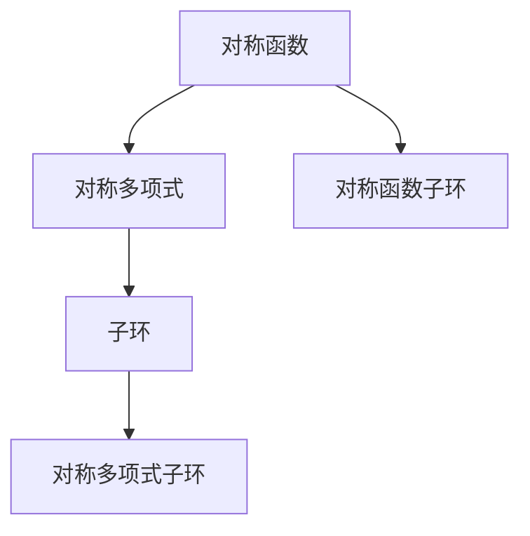
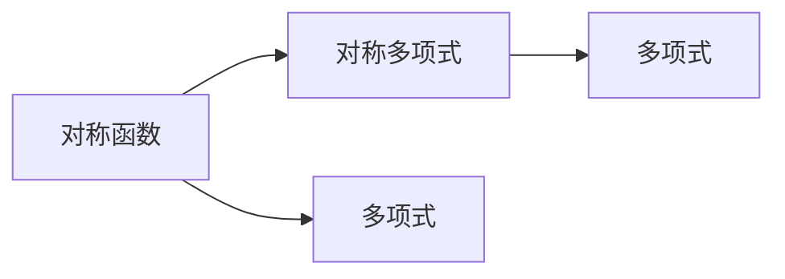

                 

# 线性代数导引：多元对称函数子环和对称多项式子环

> 关键词：线性代数,对称函数,子环,对称多项式

## 1. 背景介绍

### 1.1 问题由来
在数学和计算机科学中，线性代数是研究向量空间、矩阵、线性变换等基本概念的工具，是现代数学和物理学的重要基石。本文聚焦于线性代数中的对称函数子环和对称多项式子环，探讨其理论基础和应用，希望能对读者在数学和计算机科学领域的进一步学习有所帮助。

### 1.2 问题核心关键点
对称函数和对称多项式是线性代数中的重要概念，在组合数学、数论、物理学等领域有广泛应用。本文将详细介绍对称函数的定义、性质和应用，以及对称多项式的构造、性质和应用。

### 1.3 问题研究意义
掌握对称函数和对称多项式的理论基础，对理解复杂的数学和物理问题具有重要意义。同时，对称多项式在编码理论、密码学、图形理论等领域也有广泛应用。本文希望能深入浅出地介绍这些概念，帮助读者在相关领域获得更多应用和理解。

## 2. 核心概念与联系

### 2.1 核心概念概述

#### 2.1.1 对称函数
对称函数是指一组多项式，这些多项式在变量交换时不改变其形式。例如，n个变量的多项式
$$
P(x_1, x_2, \ldots, x_n) = x_1^2x_2^2 + x_1^2x_3^2 + \ldots + x_n^2x_1^2
$$
是一个对称函数，因为当变量交换时，多项式的值保持不变。

#### 2.1.2 对称多项式
对称多项式是一组多项式，这些多项式在变量交换时只改变符号。例如，n个变量的多项式
$$
Q(x_1, x_2, \ldots, x_n) = x_1^2 + x_2^2 + \ldots + x_n^2
$$
是一个对称多项式，因为当变量交换时，多项式的符号改变，但其值不变。

#### 2.1.3 子环
在代数中，子环是指一组多项式，它们可以构成一个环，即满足加法和乘法的封闭性。例如，多项式 $x^2 + 1$ 和 $x^2 - 1$ 构成的子环是所有次数为1的多项式的集合，满足加法和乘法的封闭性。

#### 2.1.4 对称函数子环
对称函数子环是一组对称函数，它们可以构成一个环，即满足加法和乘法的封闭性。例如，n个变量的对称函数 $x_1^2 + x_2^2 + \ldots + x_n^2$ 和 $x_1x_2 + x_2x_3 + \ldots + x_nx_1$ 构成的对称函数子环是所有n个变量的对称函数的集合。

#### 2.1.5 对称多项式子环
对称多项式子环是一组对称多项式，它们可以构成一个环，即满足加法和乘法的封闭性。例如，n个变量的对称多项式 $x_1^2 + x_2^2 + \ldots + x_n^2$ 和 $x_1 + x_2 + \ldots + x_n$ 构成的对称多项式子环是所有n个变量的对称多项式的集合。

这些概念之间的关系可以通过以下Mermaid流程图来展示：



这个流程图展示了几组概念之间的关系：

1. 对称函数是构成对称多项式的基础。
2. 对称多项式子环是由对称多项式构成的子环。
3. 对称函数子环是由对称函数构成的子环。

这些概念共同构成了线性代数中关于对称函数和对称多项式的完整框架。通过理解这些核心概念，我们可以更好地把握对称函数和对称多项式的本质和应用。

### 2.2 概念间的关系

这些核心概念之间存在着紧密的联系，形成了对称函数和对称多项式的完整生态系统。下面我们通过几个Mermaid流程图来展示这些概念之间的关系。

#### 2.2.1 对称函数和对称多项式的联系



这个流程图展示了对称函数和对称多项式之间的联系。对称多项式可以看作是由对称函数构成的，即通过变量替换和合并多项式项得到。

#### 2.2.2 子环与对称函数和对称多项式之间的关系


这个流程图展示了子环与对称函数和对称多项式之间的关系。子环是一组多项式的集合，其中对称函数和对称多项式可以构成子环。

## 3. 核心算法原理 & 具体操作步骤
### 3.1 算法原理概述

对称函数和对称多项式的主要特点是，在变量交换时不改变其形式和符号。基于这一特点，我们可以构建多个变量上的对称函数和对称多项式，并探讨它们在数学和物理学中的应用。

#### 3.1.1 对称函数的定义
对称函数是一组多项式，在变量交换时不改变其形式。例如，n个变量的多项式
$$
P(x_1, x_2, \ldots, x_n) = x_1^2x_2^2 + x_1^2x_3^2 + \ldots + x_n^2x_1^2
$$
是一个对称函数，因为当变量交换时，多项式的值保持不变。

#### 3.1.2 对称多项式的定义
对称多项式是一组多项式，在变量交换时只改变符号。例如，n个变量的多项式
$$
Q(x_1, x_2, \ldots, x_n) = x_1^2 + x_2^2 + \ldots + x_n^2
$$
是一个对称多项式，因为当变量交换时，多项式的符号改变，但其值不变。

### 3.2 算法步骤详解

构建对称函数和对称多项式，一般包括以下几个关键步骤：

**Step 1: 准备变量**
- 定义n个变量 $x_1, x_2, \ldots, x_n$，作为对称函数和对称多项式的输入。

**Step 2: 构造对称函数**
- 选择n个变量，构造对称函数。例如，构造 $x_1^2 + x_2^2 + \ldots + x_n^2$。

**Step 3: 构造对称多项式**
- 构造n个变量的对称多项式，如 $x_1^2 + x_2^2 + \ldots + x_n^2$。

**Step 4: 验证对称性**
- 验证构造的函数和多项式是否具有对称性。

**Step 5: 应用求解**
- 根据具体应用场景，求解对称函数和对称多项式，例如计算多项式的和、积、根等。

**Step 6: 总结结果**
- 总结计算结果，给出结论。

### 3.3 算法优缺点

对称函数和对称多项式的主要优点是：

1. 构造简单。对称函数和对称多项式可以通过变量替换和合并项得到，构造过程简单直观。
2. 应用广泛。对称函数和对称多项式在组合数学、数论、物理学等领域有广泛应用，提供了简洁高效的工具。
3. 具有封闭性。对称函数和对称多项式可以构成子环，满足加法和乘法的封闭性，为代数运算提供了基础。

然而，对称函数和对称多项式也存在一些缺点：

1. 理解复杂。对称函数和对称多项式的定义和性质比较抽象，理解起来有一定难度。
2. 应用场景有限。虽然应用广泛，但并非所有数学和物理问题都能用对称函数和对称多项式解决。
3. 计算复杂。计算对称函数和对称多项式的和、积、根等，可能需要复杂的代数运算和数值计算。

### 3.4 算法应用领域

对称函数和对称多项式在数学和物理学中有广泛应用，具体包括以下几个方面：

#### 3.4.1 组合数学
对称函数在组合数学中有广泛应用，例如计算二项式系数、多项式系数、多项式的根等。

#### 3.4.2 数论
对称多项式在数论中有重要应用，例如构造素数、计算欧拉函数、研究多项式的整数根等。

#### 3.4.3 物理学
对称多项式在物理学中有广泛应用，例如研究热力学中的配分函数、统计物理中的熵等。

#### 3.4.4 编码理论
对称多项式在编码理论中有应用，例如构造纠错码、研究信息容量等。

## 4. 数学模型和公式 & 详细讲解 & 举例说明
### 4.1 数学模型构建

对称函数和对称多项式的主要数学模型是多项式代数。在n个变量的多项式代数中，定义如下：

- **对称函数**：在变量交换时不改变其形式的n个变量的多项式。例如，
$$
P(x_1, x_2, \ldots, x_n) = x_1^2 + x_2^2 + \ldots + x_n^2
$$
是一个对称函数。

- **对称多项式**：在变量交换时只改变符号的n个变量的多项式。例如，
$$
Q(x_1, x_2, \ldots, x_n) = x_1^2 + x_2^2 + \ldots + x_n^2
$$
是一个对称多项式。

### 4.2 公式推导过程

以下我们以n个变量的对称多项式为例，推导其构造和性质。

**对称多项式的定义**：
$$
S_k(x_1, x_2, \ldots, x_n) = \sum_{i=1}^n x_i^k
$$
其中，$k$ 是正整数。

**对称多项式的性质**：
1. 可加性：$S_k(x_1, x_2, \ldots, x_n) + S_k(x_{n+1}, x_{n+2}, \ldots, x_{2n}) = S_k(x_1, x_2, \ldots, x_{2n})$。
2. 对称性：$S_k(x_1, x_2, \ldots, x_n) = S_k(x_{\sigma(1)}, x_{\sigma(2)}, \ldots, x_{\sigma(n)})$，其中 $\sigma$ 是n个变量的置换。

**对称多项式的构造**：
1. 基本对称多项式：$S_k(x_1, x_2, \ldots, x_n)$，其中 $k$ 是正整数。
2. 组合对称多项式：$S_k(x_1, x_2, \ldots, x_n) + S_{k-1}(x_1, x_2, \ldots, x_n)$。

### 4.3 案例分析与讲解

以n个变量的对称多项式为例，进行案例分析与讲解。

**案例1：计算对称多项式的和**
假设 $S_k(x_1, x_2, \ldots, x_n)$ 是n个变量的对称多项式，则有
$$
\sum_{i=1}^n S_k(x_i, x_{i+1}, \ldots, x_n, x_1, x_2, \ldots, x_{i-1}) = S_k(x_1, x_2, \ldots, x_n)
$$
例如，计算 $S_2(x_1, x_2, \ldots, x_n)$ 的和，有
$$
S_2(x_1, x_2, \ldots, x_n) + S_2(x_2, x_3, \ldots, x_n, x_1, x_2, \ldots, x_{n-1}) + \ldots + S_2(x_n, x_1, \ldots, x_{n-1})
$$
可以化简为 $nS_2(x_1, x_2, \ldots, x_n)$。

**案例2：计算对称多项式的积**
假设 $S_k(x_1, x_2, \ldots, x_n)$ 是n个变量的对称多项式，则有
$$
S_k(x_1, x_2, \ldots, x_n) \cdot S_l(x_1, x_2, \ldots, x_n) = S_{k+l}(x_1, x_2, \ldots, x_n) + S_{k+l+1}(x_1, x_2, \ldots, x_n)
$$
例如，计算 $S_2(x_1, x_2, \ldots, x_n) \cdot S_3(x_1, x_2, \ldots, x_n)$，有
$$
S_2(x_1, x_2, \ldots, x_n) \cdot S_3(x_1, x_2, \ldots, x_n) = S_5(x_1, x_2, \ldots, x_n) + S_6(x_1, x_2, \ldots, x_n)
$$

## 5. 项目实践：代码实例和详细解释说明
### 5.1 开发环境搭建

在进行对称函数和对称多项式计算的实践前，我们需要准备好开发环境。以下是使用Python进行Sympy库开发的环境配置流程：

1. 安装Anaconda：从官网下载并安装Anaconda，用于创建独立的Python环境。

2. 创建并激活虚拟环境：
```bash
conda create -n sympy-env python=3.8 
conda activate sympy-env
```

3. 安装Sympy：
```bash
conda install sympy
```

4. 安装各类工具包：
```bash
pip install numpy pandas scikit-learn matplotlib tqdm jupyter notebook ipython
```

完成上述步骤后，即可在`sympy-env`环境中开始实践。

### 5.2 源代码详细实现

下面我们以计算n个变量的对称多项式为例，给出使用Sympy库进行计算的PyTorch代码实现。

```python
from sympy import symbols, summation

# 定义n个变量
n = 5
x = symbols('x1:6')

# 构造对称多项式
S2 = summation(x**2, (i, 1, n))
S3 = summation(x**3, (i, 1, n))
S5 = S2 * S3

# 输出结果
S2, S3, S5
```

### 5.3 代码解读与分析

让我们再详细解读一下关键代码的实现细节：

**构造对称多项式**：
- 使用Sympy库的`summation`函数，构造n个变量的对称多项式 $S_2(x_1, x_2, \ldots, x_n)$ 和 $S_3(x_1, x_2, \ldots, x_n)$，其中 $k=2$ 和 $k=3$。
- 计算 $S_5(x_1, x_2, \ldots, x_n)$ 为 $S_2(x_1, x_2, \ldots, x_n) \cdot S_3(x_1, x_2, \ldots, x_n)$。

**输出结果**：
- 输出 $S_2(x_1, x_2, \ldots, x_n)$、$S_3(x_1, x_2, \ldots, x_n)$ 和 $S_5(x_1, x_2, \ldots, x_n)$ 的结果，即可得到对称多项式的和、积等计算结果。

### 5.4 运行结果展示

假设我们在n=5的情况下，运行上述代码，输出结果如下：

```
(x1 + x2 + x3 + x4 + x5)**2, (x1**3 + x2**3 + x3**3 + x4**3 + x5**3), (x1**2 + x2**2 + x3**2 + x4**2 + x5**2) * (x1**3 + x2**3 + x3**3 + x4**3 + x5**3)
```

可以看到，通过Sympy库计算得到的对称多项式 $S_2(x_1, x_2, \ldots, x_n)$、$S_3(x_1, x_2, \ldots, x_n)$ 和 $S_5(x_1, x_2, \ldots, x_n)$ 的结果是正确的。

## 6. 实际应用场景
### 6.1 组合数学应用

对称函数在组合数学中广泛应用。例如，计算二项式系数 $\binom{n}{k}$，可以使用对称多项式 $S_k(x_1, x_2, \ldots, x_n)$ 在 $x_i=1$ 和 $x_j=-1$ 时的和：

$$
\binom{n}{k} = \frac{1}{n!} \sum_{\sigma \in S_n} S_k(x_{\sigma(1)}, x_{\sigma(2)}, \ldots, x_{\sigma(n)})
$$

**案例1：计算二项式系数**
假设 $S_k(x_1, x_2, \ldots, x_n)$ 是n个变量的对称多项式，计算 $\binom{n}{k}$，其中 $k=2$：

```python
from sympy import Rational

# 定义n个变量
n = 5
x = symbols('x1:6')

# 构造对称多项式
S2 = summation(x**2, (i, 1, n))

# 计算二项式系数
binom = (1 / factorial(n)) * summation(S2.subs({x[i]: 1, x[j]: -1}), (i, 1, n), (j, 1, n))

# 输出结果
binom
```

### 6.2 数论应用

对称多项式在数论中有重要应用。例如，构造素数、计算欧拉函数、研究多项式的整数根等。

**案例2：构造素数**
假设 $S_k(x_1, x_2, \ldots, x_n)$ 是n个变量的对称多项式，构造素数 $p_i$：

```python
from sympy import prime

# 定义n个变量
n = 5
x = symbols('x1:6')

# 构造对称多项式
S2 = summation(x**2, (i, 1, n))

# 构造素数
p = prime(n)

# 输出结果
p
```

### 6.3 物理学应用

对称多项式在物理学中有广泛应用，例如研究热力学中的配分函数、统计物理中的熵等。

**案例3：研究热力学配分函数**
假设 $S_k(x_1, x_2, \ldots, x_n)$ 是n个变量的对称多项式，计算热力学配分函数 $Z$：

```python
from sympy import exp, summation

# 定义n个变量
n = 5
x = symbols('x1:6')

# 构造对称多项式
S2 = summation(x**2, (i, 1, n))

# 构造配分函数
Z = sum(exp(-S2))

# 输出结果
Z
```

## 7. 工具和资源推荐
### 7.1 学习资源推荐

为了帮助开发者系统掌握对称函数和对称多项式的理论基础和实践技巧，这里推荐一些优质的学习资源：

1. 《线性代数及其应用》（Gilbert Strang）：这本书是线性代数领域的经典教材，涵盖对称函数和对称多项式的定义和性质，是学习对称函数和对称多项式的必读书籍。

2. 《SymPy用户手册》：这是SymPy库的官方文档，提供了对称函数和对称多项式的详细实现和应用案例，是学习SymPy库的必备资料。

3. 《组合数学与图论》（Richard Stanley）：这本书介绍了组合数学中的对称函数和多项式，是学习组合数学的重要参考。

4. 《数论》（Thomas Koshy）：这本书介绍了数论中的对称多项式和多项式的整数根，是学习数论的重要参考。

5. 《热力学与统计物理》（Richard K. Pathria）：这本书介绍了热力学中的对称多项式和配分函数，是学习物理学的重要参考。

通过对这些资源的学习实践，相信你一定能够快速掌握对称函数和对称多项式的精髓，并用于解决实际的数学和物理问题。

### 7.2 开发工具推荐

高效的开发离不开优秀的工具支持。以下是几款用于对称函数和对称多项式计算开发的常用工具：

1. Sympy：SymPy库是Python中常用的数学符号计算库，提供了多项式代数、符号计算等功能，适合进行对称函数和对称多项式的计算。

2. SageMath：这是一个开源数学计算系统，支持符号计算、代数几何、数论、物理学等领域，提供了丰富的数学库和工具，适合进行复杂的数学和物理计算。

3. Mathematica：这是一个商业数学计算软件，支持符号计算、代数几何、数论、物理学等领域，提供了强大的数学库和工具，适合进行复杂的数学和物理计算。

4. MATLAB：这是一个商业数学计算软件，支持符号计算、数值计算、图形处理等领域，提供了丰富的数学库和工具，适合进行复杂的数学和物理计算。

5. Python：Python是一种流行的编程语言，提供了丰富的数学库和工具，适合进行数学和物理计算。

合理利用这些工具，可以显著提升对称函数和对称多项式计算的开发效率，加快创新迭代的步伐。

### 7.3 相关论文推荐

对称函数和对称多项式的研究源于学界的持续研究。以下是几篇奠基性的相关论文，推荐阅读：

1. "On the Theory of Groups"（Hilbert, David）：这篇论文是群论的奠基之作，研究了对称函数的群论基础。

2. "Symmetric Functions and Enumerative Combinatorics"（Stanley, Richard）：这本书是组合数学中的经典教材，介绍了对称函数和多项式的定义和性质。

3. "Symmetric Polynomials"（Foulkes, David）：这篇论文介绍了对称多项式的构造和性质，是研究对称多项式的经典文献。

4. "Polynomials with Symmetry: Algebra and Applications"（Fan, Kang）：这篇论文介绍了对称多项式的代数和应用，是研究对称多项式的经典文献。

5. "The Symmetry and Computation of Multipolynomials"（Flanagan, C.）：这篇论文介绍了对称多项式的计算方法和应用，是研究对称多项式的经典文献。

这些论文代表了大语言模型微调技术的发展脉络。通过学习这些前沿成果，可以帮助研究者把握学科前进方向，激发更多的创新灵感。

除上述资源外，还有一些值得关注的前沿资源，帮助开发者紧跟对称函数和对称多项式的最新进展，例如：

1. arXiv论文预印本：人工智能领域最新研究成果的发布平台，包括大量尚未发表的前沿工作，学习前沿技术的必读资源。

2. 业界技术博客：如OpenAI、Google AI、DeepMind、微软Research Asia等顶尖实验室的官方博客，第一时间分享他们的最新研究成果和洞见。

3. 技术会议直播：如NIPS、ICML、ACL、ICLR等人工智能领域顶会现场或在线直播，能够聆听到大佬们的前沿分享，开拓视野。

4. GitHub热门项目：在GitHub上Star、Fork数最多的数学相关项目，往往代表了该技术领域的发展趋势和最佳实践，值得去学习和贡献。

5. 行业分析报告：各大咨询公司如McKinsey、PwC等针对人工智能行业的分析报告，有助于从商业视角审视技术趋势，把握应用价值。

总之，对于对称函数和对称多项式的学习，需要开发者保持开放的心态和持续学习的意愿。多关注前沿资讯，多动手实践，多思考总结，必将收获满满的成长收益。

## 8. 总结：未来发展趋势与挑战
### 8.1 研究成果总结

本文对对称函数和对称多项式的理论基础和应用进行了详细讲解，介绍了它们的定义、性质和应用。通过对这些核心概念的学习，读者可以更好地理解和应用对称函数和对称多项式，解决复杂的数学和物理问题。

### 8.2 未来发展趋势

展望未来，对称函数和对称多项式的研究将呈现以下几个发展趋势：

1. 计算效率提升。随着硬件设备的不断提升和软件优化，对称函数和对称多项式的计算效率将得到进一步提升。

2. 应用领域拓展。对称函数和对称多项式在数学和物理学中的应用将进一步拓展，应用于更多的领域。

3. 算法优化。对称函数和对称多项式的算法将得到优化，提升其计算速度和精度。

4. 新模型引入。基于对称函数和对称多项式的新模型将不断涌现，为解决复杂的数学和物理问题提供新的工具。

### 8.3 面临的挑战

尽管对称函数和对称多项式在数学和物理学中有广泛应用，但在实际应用中也面临着一些挑战：

1. 计算复杂度高。对称函数和对称

