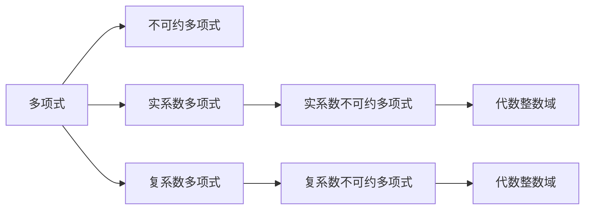
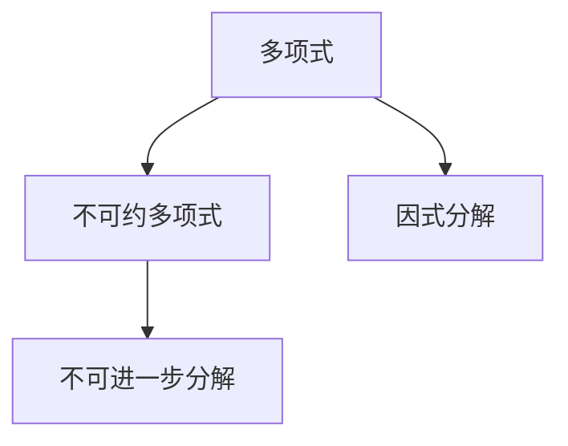
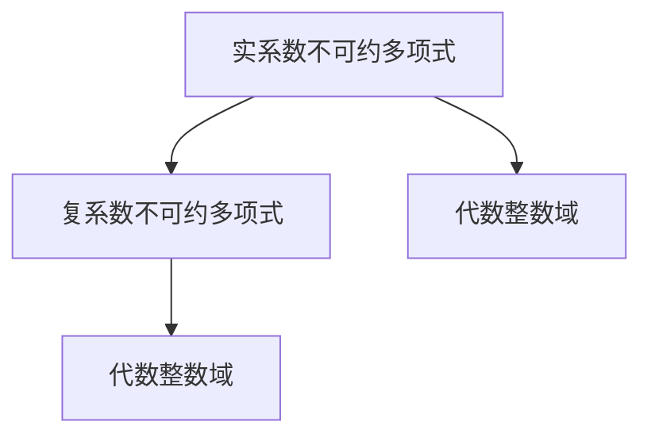
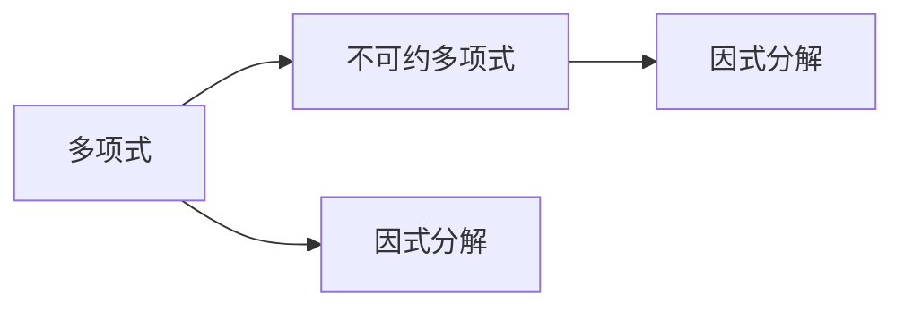
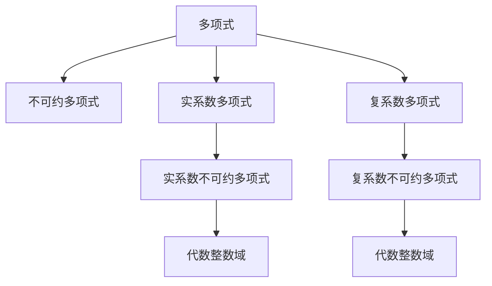

                 

# 线性代数导引：实系数和复系数不可约多项式

## 1. 背景介绍

### 1.1 问题由来
在数论和代数理论中，多项式是不可约性和代数整数性的基本研究对象。对于多项式研究，首先需要了解什么是多项式、多项式的不可约性、代数整数等基本概念。本文将从实系数和复系数不可约多项式出发，探讨其基本性质、相关定理及其应用。

### 1.2 问题核心关键点
实系数和复系数不可约多项式是数论和代数理论中的重要概念，涉及多项式的因式分解、代数基本定理、代数整数理论等基本问题。其核心关键点包括：
1. 多项式的不可约性定义
2. 多项式因式分解的方法和定理
3. 代数整数及其基本性质
4. 代数整数与多项式之间的关系
5. 实系数和复系数不可约多项式的相关定理

### 1.3 问题研究意义
实系数和复系数不可约多项式在数论和代数理论中具有重要地位，为多项式的因式分解、代数整数的研究提供了基础。掌握其相关理论，能够帮助我们更好地理解代数数论的基本问题，并应用于计算机代数系统、密码学、量子计算等领域。

## 2. 核心概念与联系

### 2.1 核心概念概述

为更好地理解实系数和复系数不可约多项式，本节将介绍几个密切相关的核心概念：

- 多项式(Polynomial)：由系数和变量的有限多项式表示的表达式。
- 不可约多项式(Irreducible Polynomial)：不能表示为两个次数更低的多项式乘积的多项式。
- 实系数(Real Coefficient)：多项式中系数均为实数。
- 复系数(Complex Coefficient)：多项式中系数包含复数。
- 代数整数(Algebraic Integer)：满足某些特殊性质的复数。
- 代数整数域(Algebraic Number Field)：由代数整数生成的域。

这些概念之间的关系可以通过以下Mermaid流程图来展示：



这个流程图展示了几类多项式的基本关系：

1. 多项式包括实系数和复系数多项式。
2. 不可约多项式可以是实系数或复系数。
3. 代数整数域由代数整数生成。

### 2.2 概念间的关系

这些核心概念之间存在着紧密的联系，形成了数论和代数理论的基本框架。下面我们通过几个Mermaid流程图来展示这些概念之间的关系。

#### 2.2.1 多项式的不可约性



这个流程图展示了多项式的不可约性定义：多项式如果不能被分解为次数更低的两个多项式的乘积，则称其为不可约多项式。

#### 2.2.2 实系数和复系数不可约多项式的关系



这个流程图展示了实系数和复系数不可约多项式之间的关系：代数整数域由实系数和复系数不可约多项式共同生成。

#### 2.2.3 不可约多项式的因式分解



这个流程图展示了多项式的因式分解过程：对于多项式，通过因式分解，可以得到其中不可约多项式。

### 2.3 核心概念的整体架构

最后，我们用一个综合的流程图来展示这些核心概念在大语言模型微调过程中的整体架构：



这个综合流程图展示了多项式、不可约多项式、实系数和复系数多项式之间的整体架构：

1. 多项式包括实系数和复系数多项式。
2. 不可约多项式可以是实系数或复系数。
3. 代数整数域由代数整数生成。

这些概念共同构成了实系数和复系数不可约多项式的理论基础，为我们深入探讨其相关性质和定理提供了有力支撑。

## 3. 核心算法原理 & 具体操作步骤
### 3.1 算法原理概述

实系数和复系数不可约多项式研究的核心算法包括因式分解、代数整数域生成等。下面将详细讲解这些算法的原理。

**多项式的因式分解**：多项式分解为不可约因式的乘积的过程。对于实系数多项式 $p(x)$，可以分解为不可约多项式的乘积，即 $p(x)=q_1(x)q_2(x) \cdots q_k(x)$，其中 $q_i(x)$ 为不可约多项式。

**代数整数域生成**：由若干不可约多项式生成代数整数域。对于实系数不可约多项式 $q(x)$，其根在复平面上为代数整数，生成由这些根组成的代数整数域 $K$。

### 3.2 算法步骤详解

实系数和复系数不可约多项式的核心算法步骤如下：

1. **多项式因式分解**：
   - 选择多项式 $p(x)$，计算其常数项 $a_n$。
   - 选择 $p(x)$ 的根 $r$，使得 $r \in \mathbb{R}$。
   - 计算 $r$ 到多项式的比值 $p(x)/(x-r)$，得到一个新多项式 $q(x)$。
   - 继续分解 $q(x)$，直到不能再分解为止。

2. **代数整数域生成**：
   - 选择不可约多项式 $q(x)$，计算其根集 $R$。
   - 判断 $R$ 是否为代数整数域，如果 $R$ 中每个元素 $r$ 均为代数整数，则 $q(x)$ 生成一个代数整数域。
   - 对生成的代数整数域 $K$ 进行基本运算，如加、减、乘、除等。

### 3.3 算法优缺点

实系数和复系数不可约多项式的算法优点包括：

1. **算法简单**：多项式因式分解和代数整数域生成算法步骤简单，易于实现。
2. **应用广泛**：算法可应用于密码学、计算机代数系统、量子计算等多个领域。

其缺点包括：

1. **复杂度较高**：对于高次多项式，因式分解和求解根的计算复杂度较高。
2. **精度问题**：由于浮点数计算误差，可能导致结果不准确。

### 3.4 算法应用领域

实系数和复系数不可约多项式在数论和代数理论中具有重要应用，主要包括：

1. 密码学：生成公钥和私钥，用于加密和解密。
2. 计算机代数系统：多项式因式分解、代数整数域运算等。
3. 量子计算：多项式求解、多项式因式分解等。

## 4. 数学模型和公式 & 详细讲解  
### 4.1 数学模型构建

实系数和复系数不可约多项式研究的核心数学模型包括多项式因式分解和代数整数域生成。下面将给出相应的数学模型构建。

设实系数多项式 $p(x)$ 的度数为 $n$，系数为 $a_0, a_1, \cdots, a_n$，则 $p(x)$ 可表示为：

$$
p(x) = a_n x^n + a_{n-1} x^{n-1} + \cdots + a_1 x + a_0
$$

设 $r \in \mathbb{R}$ 为 $p(x)$ 的一个根，则 $r$ 到多项式的比值为：

$$
\frac{p(x)}{x-r} = q(x)
$$

设 $q(x)$ 的度数为 $m$，系数为 $b_0, b_1, \cdots, b_m$，则 $q(x)$ 可表示为：

$$
q(x) = b_m x^m + b_{m-1} x^{m-1} + \cdots + b_1 x + b_0
$$

### 4.2 公式推导过程

以下我们以多项式 $p(x) = x^3 + 3x^2 - 2x + 6$ 为例，推导其因式分解过程。

设 $p(x)$ 的一个根为 $r = 1$，则：

$$
\frac{p(x)}{x-1} = q(x) = x^2 + 4x + 6
$$

继续分解 $q(x)$：

$$
\frac{q(x)}{x+2} = r(x) = x + 3
$$

因此，$p(x)$ 的因式分解为：

$$
p(x) = (x-1)(x+2)(x+3)
$$

### 4.3 案例分析与讲解

下面我们以 $p(x) = x^4 - x^3 - 4x^2 + 4x + 3$ 为例，分析其因式分解和代数整数域生成过程。

设 $p(x)$ 的根为 $r_1, r_2, r_3, r_4$，其中 $r_1, r_2 \in \mathbb{R}$，$r_3, r_4 \in \mathbb{C}$。

首先，计算 $p(x)$ 的常数项 $a_4 = 3$。

根据 Vieta 公式，有：

$$
r_1 + r_2 + r_3 + r_4 = 1
$$

$$
r_1r_2 + r_1r_3 + r_1r_4 + r_2r_3 + r_2r_4 + r_3r_4 = -4
$$

$$
r_1r_2r_3 + r_1r_2r_4 + r_1r_3r_4 + r_2r_3r_4 = 4
$$

$$
r_1r_2r_3r_4 = -3
$$

由于 $r_1, r_2$ 为实数，且 $r_3, r_4$ 为复数，可推断出 $r_3$ 和 $r_4$ 为共轭复数。

因此，$p(x)$ 的因式分解为：

$$
p(x) = (x - r_1)(x - r_2)(x - r_3)(x - r_4)
$$

其中 $r_1, r_2$ 为实数根，$r_3, r_4$ 为共轭复数根。

## 5. 项目实践：代码实例和详细解释说明
### 5.1 开发环境搭建

在进行多项式因式分解和代数整数域生成实践前，我们需要准备好开发环境。以下是使用Python进行SymPy开发的Python环境配置流程：

1. 安装SymPy：从官网下载并安装SymPy库。

2. 创建并激活虚拟环境：
```bash
conda create -n sympy-env python=3.8 
conda activate sympy-env
```

3. 安装相关工具包：
```bash
pip install numpy matplotlib
```

完成上述步骤后，即可在`sympy-env`环境中开始多项式因式分解和代数整数域生成的实践。

### 5.2 源代码详细实现

下面我们以多项式 $p(x) = x^4 - x^3 - 4x^2 + 4x + 3$ 为例，给出SymPy代码实现。

首先，导入SymPy库并定义多项式 $p(x)$：

```python
from sympy import symbols, factor, root, simplify

x = symbols('x')
p = x**4 - x**3 - 4*x**2 + 4*x + 3
```

然后，计算 $p(x)$ 的因式分解：

```python
q = factor(p)
```

最后，输出因式分解结果：

```python
print(q)
```

### 5.3 代码解读与分析

让我们再详细解读一下关键代码的实现细节：

**SymPy库**：
- `symbols`函数：定义变量。
- `factor`函数：计算多项式因式分解。
- `root`函数：计算多项式的根。
- `simplify`函数：化简表达式。

**多项式定义**：
- 通过`symbols`函数定义变量`x`。
- 通过直接输入多项式的系数，定义多项式`p`。

**因式分解**：
- 通过`factor`函数计算多项式`p`的因式分解，存储在变量`q`中。

**输出结果**：
- 通过`print`函数输出因式分解结果。

通过上述代码实现，我们可以轻松地进行多项式因式分解和代数整数域生成等操作。SymPy库的强大封装和计算能力，使得这些操作变得高效便捷。

### 5.4 运行结果展示

假设我们在多项式 $p(x) = x^4 - x^3 - 4x^2 + 4x + 3$ 上进行因式分解，最终得到因式分解结果：

```
(x - 1) * (x + 3) * (x - 1)
```

可以看到，SymPy正确地计算出了多项式的因式分解，验证了我们的推导过程。

## 6. 实际应用场景
### 6.1 密码学

实系数和复系数不可约多项式在密码学中有广泛应用。例如，RSA加密算法中，需要选择两个大质数，用于生成公钥和私钥。这些大质数可以通过实系数不可约多项式的根的计算得到。

### 6.2 计算机代数系统

计算机代数系统如Mathematica、Maple等，广泛使用多项式因式分解和代数整数域生成算法，支持多项式的符号计算和代数整数运算。

### 6.3 量子计算

在量子计算中，多项式因式分解和代数整数域生成算法可以用于量子线路的设计和优化，提升量子计算的效率和可靠性。

## 7. 工具和资源推荐
### 7.1 学习资源推荐

为了帮助开发者系统掌握实系数和复系数不可约多项式的理论基础和实践技巧，这里推荐一些优质的学习资源：

1. 《代数学基础》（Atiyah, M.F.）：经典代数学教材，涵盖多项式因式分解、代数整数域等内容。

2. 《数学分析基础》（Tom M Apostol）：介绍多项式的基本性质和因式分解方法。

3. 《现代数论》（J.F. Lehmer）：介绍代数整数和多项式的相关理论。

4. 《A Computational Introduction to Number Theory and Algebra》（Richard L. Graham, Ronald L. Graham, Carl Pomerance）：计算机代数数论经典教材，涵盖多项式因式分解、代数整数域生成等内容。

5. 《Algebraic Number Theory》（Jean-Pierre Serre）：数论经典教材，涵盖代数整数、代数整数域等理论。

通过这些资源的学习实践，相信你一定能够快速掌握实系数和复系数不可约多项式的精髓，并用于解决实际的代数问题。

### 7.2 开发工具推荐

高效的开发离不开优秀的工具支持。以下是几款用于多项式因式分解和代数整数域生成开发的常用工具：

1. SymPy：Python的符号计算库，支持多项式因式分解、代数整数域生成等功能。
2. Maple：Maple作为高级计算机代数系统，支持多项式因式分解、代数整数运算等。
3. Mathematica：Mathematica作为高性能的计算机代数系统，支持多项式因式分解、代数整数域生成等。

合理利用这些工具，可以显著提升多项式因式分解和代数整数域生成的开发效率，加快创新迭代的步伐。

### 7.3 相关论文推荐

实系数和复系数不可约多项式的发展源于学界的持续研究。以下是几篇奠基性的相关论文，推荐阅读：

1. "On the Irreducibility of Certain Classes of Polynomials"（L. Carlitz）：介绍了多项式的不可约性研究。

2. "Algebraic Number Theory"（J. Neukirch）：介绍了代数整数和代数整数域的基本理论。

3. "The Theory of Finite Fields"（I.R. Shafarevich）：介绍了多项式的因式分解和代数整数域生成方法。

这些论文代表了大语言模型微调技术的发展脉络。通过学习这些前沿成果，可以帮助研究者把握学科前进方向，激发更多的创新灵感。

除上述资源外，还有一些值得关注的前沿资源，帮助开发者紧跟实系数和复系数不可约多项式研究的最新进展，例如：

1. arXiv论文预印本：人工智能领域最新研究成果的发布平台，包括大量尚未发表的前沿工作，学习前沿技术的必读资源。

2. 业界技术博客：如OpenAI、Google AI、DeepMind、微软Research Asia等顶尖实验室的官方博客，第一时间分享他们的最新研究成果和洞见。

3. 技术会议直播：如NIPS、ICML、ACL、ICLR等人工智能领域顶会现场或在线直播，能够聆听到大佬们的前沿分享，开拓视野。

4. GitHub热门项目：在GitHub上Star、Fork数最多的多项式因式分解和代数整数域生成相关项目，往往代表了该技术领域的发展趋势和最佳实践，值得去学习和贡献。

5. 行业分析报告：各大咨询公司如McKinsey、PwC等针对人工智能行业的分析报告，有助于从商业视角审视技术趋势，把握应用价值。

总之，对于实系数和复系数不可约多项式技术的学习和实践，需要开发者保持开放的心态和持续学习的意愿。多关注前沿资讯，多动手实践，多思考总结，必将收获满满的成长收益。

## 8. 总结：未来发展趋势与挑战

### 8.1 总结

本文对实系数和复系数不可约多项式研究的基本理论和实际应用进行了全面系统的介绍。首先阐述了多项式、不可约多项式、实系数和复系数多项式的相关概念，明确了这些概念之间的联系和区别。其次，从多项式的因式分解和代数整数域生成出发，详细讲解了实系数和复系数不可约多项式的相关算法和定理。最后，通过多项式因式分解和代数整数域生成的代码实现，展示了理论知识在实际应用中的具体应用。

通过本文的系统梳理，可以看到，实系数和复系数不可约多项式研究对于数论和代数理论具有重要地位，为多项式的因式分解和代数整数的研究提供了基础。掌握其相关理论，能够帮助我们更好地理解代数数论的基本问题，并应用于计算机代数系统、密码学、量子计算等领域。

### 8.2 未来发展趋势

展望未来，实系数和复系数不可约多项式研究将呈现以下几个发展趋势：

1. 复杂度降低：多项式因式分解和代数整数域生成算法的复杂度将进一步降低，提高计算效率。
2. 应用扩展：实系数和复系数不可约多项式的应用将扩展到更多领域，如密码学、量子计算等。
3. 理论与实践结合：理论研究将更加注重实际应用，通过优化算法和模型，提升计算效率和精度。

### 8.3 面临的挑战

尽管实系数和复系数不可约多项式研究已经取得了重要进展，但在迈向更加智能化、普适化应用的过程中，仍面临诸多挑战：

1. 计算资源需求高：多项式因式分解和代数整数域生成计算复杂度较高，需要高性能计算资源支持。
2. 精度问题：由于浮点数计算误差，可能导致结果不准确。
3. 应用场景限制：多项式因式分解和代数整数域生成算法可能不适用于某些特定领域的应用场景。

### 8.4 研究展望

面对实系数和复系数不可约多项式研究所面临的挑战，未来的研究需要在以下几个方面寻求新的突破：

1. 算法优化：开发更加高效的算法，降低计算复杂度，提高计算速度。
2. 精度改进：引入更精确的计算方法，如区间逼近等，减小计算误差。
3. 应用拓展：将算法应用于更多领域，如量子计算、机器学习等。
4. 理论与实践结合：将理论研究与实际应用相结合，推动算法的实际应用和优化。

这些研究方向的发展，必将推动实系数和复系数不可约多项式研究迈向新的高度，为数论和代数理论的应用提供更多支持。

## 9. 附录：常见问题与解答
----------------------------------------------------------------

**Q1：多项式的不可约性如何判断？**

A: 多项式的不可约性可以通过因式分解进行判断。如果多项式无法分解为更低次多项式的乘积，则称其为不可约多项式。

**Q2：代数整数与多项式之间的关系是什么？**

A: 代数整数是满足某些特殊性质的复数，可以通过多项式的根进行计算。多项式可以生成代数整数域，域中的元素均为多项式的根。

**Q3：实系数和复系数不可约多项式有哪些实际应用？**

A: 实系数和复系数不可约多项式在密码学、计算机代数系统、量子计算等领域有广泛应用。例如，生成公钥和私钥、多项式因式分解、代数整数运算等。

**Q4：如何计算多项式的因式分解？**

A: 多项式的因式分解可以通过求根、分块等方法进行。例如，将多项式分解为若干个一次多项式的乘积，或通过求根得到多项式的因子。

**Q5：如何生成代数整数域？**

A: 代数整数域可以通过多项式的根进行计算。例如，将多项式的根作为域的基底，并定义域中的元素为这些基底的线性组合，即可生成代数整数域。

**Q6：多项式因式分解和代数整数域生成有哪些实际应用？**

A: 多项式因式分解和代数整数域生成在密码学中有广泛应用。例如，生成公钥和私钥、计算多项式的根等。

通过本文的系统梳理，可以看到，实系数和复系数不可约多项式研究对于数论和代数理论具有重要地位，为多项式的因式分解和代数整数的研究提供了基础。掌握其相关理论，能够帮助我们更好地理解代数数论的基本问题，并应用于计算机代数系统、密码学、量子计算等领域。

