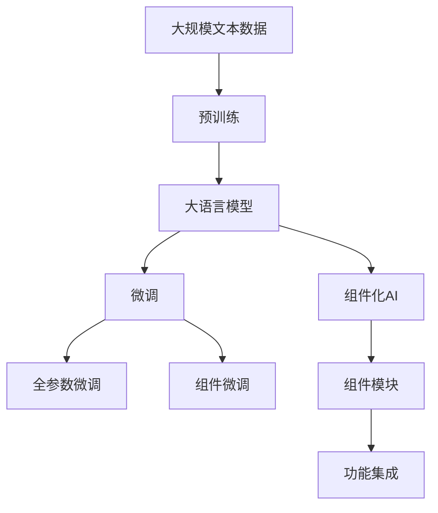
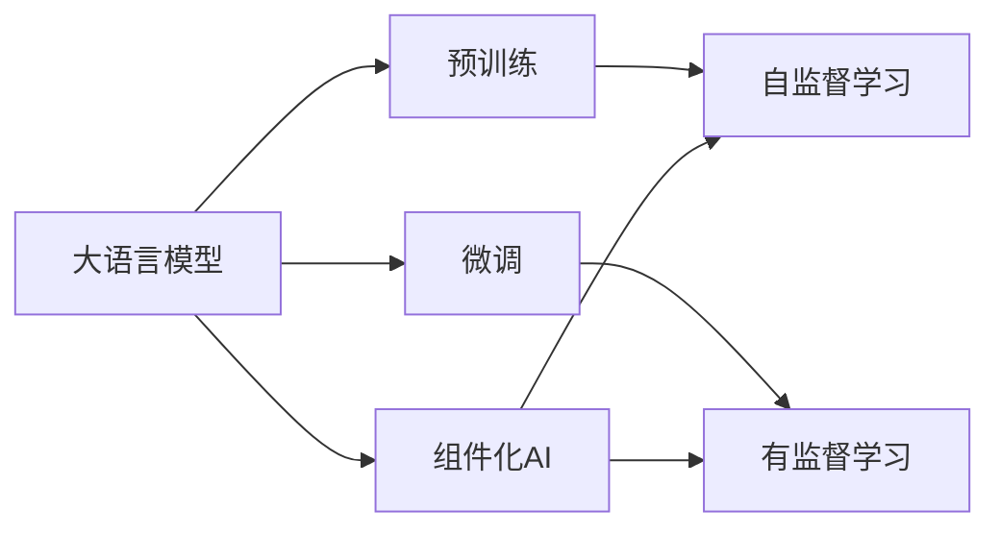
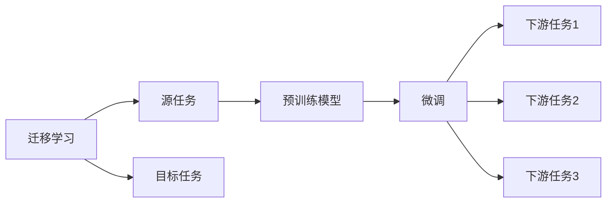
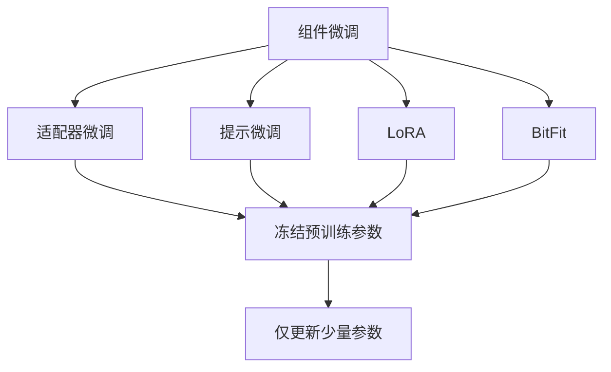
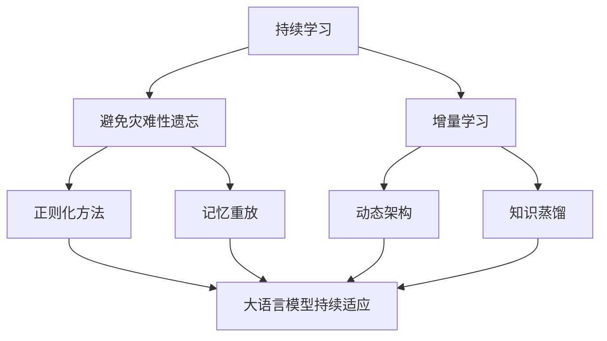

                 

# 组件化AI:预训练与微调的平衡

> 关键词：组件化AI,预训练,微调,BERT,Transformer,自监督学习,迁移学习

## 1. 背景介绍

### 1.1 问题由来
近年来，人工智能(AI)在深度学习技术的推动下取得了长足进展，大模型如BERT、GPT-3等成为了驱动NLP研究与应用的重要力量。这些大模型通过在大量无标签数据上进行预训练，学习到丰富的语言知识和常识，能够在诸如问答、摘要、机器翻译等下游任务上表现出卓越性能。

然而，这些大模型在特定领域的应用效果往往难以达到预期，主要原因是预训练数据与下游任务的领域分布差异较大。这导致了模型在微调过程中容易出现过拟合或欠拟合现象。为此，研究者们提出了组件化AI这一新范式，试图在大模型的预训练和微调之间寻求平衡。

### 1.2 问题核心关键点
组件化AI的核心思想是将大模型拆分为多个可独立微调的组件模块，每个组件负责处理特定类型的信息或任务。在微调过程中，只更新与当前任务相关的组件参数，而非全部参数。这种组件化结构一方面可以降低微调对预训练模型的依赖，另一方面可以有效避免组件间的相互干扰，提升微调效果。

组件化AI的关键在于合理设计组件的结构和功能，以及优化组件间的耦合关系。具体而言，包括：

- 组件划分：将大模型划分为多个组件模块，每个模块负责特定功能或信息处理。
- 组件微调：根据下游任务的特征，只更新与任务相关的组件参数。
- 组件集成：将微调后的组件集成到整体模型中，完成最终的推理任务。

### 1.3 问题研究意义
组件化AI的提出，对于拓展大模型的应用范围，提升下游任务的性能，加速AI技术的产业化进程，具有重要意义：

1. 降低应用开发成本。通过组件化设计，可以显著减少从头开发所需的数据、计算和人力等成本投入。
2. 提升模型效果。组件化设计使得通用大模型更好地适应特定任务，在应用场景中取得更优表现。
3. 加速开发进度。standing on the shoulders of giants，组件化设计可以快速适配任务需求，缩短开发周期。
4. 带来技术创新。组件化范式促进了对预训练-微调的深入研究，催生了更多关于组件模块设计、组件集成方法等的新研究方向。
5. 赋能产业升级。组件化设计使得AI技术更容易被各行各业所采用，为传统行业数字化转型升级提供新的技术路径。

## 2. 核心概念与联系

### 2.1 核心概念概述

为更好地理解组件化AI的核心概念，本节将介绍几个密切相关的核心概念：

- 组件化AI(Compositional AI)：将大模型拆分为多个可独立微调的组件模块，每个组件负责特定功能或信息处理，通过组件间的功能组合，构建适应不同任务的AI模型。
- 预训练(Pre-training)：指在大规模无标签文本语料上，通过自监督学习任务训练通用语言模型的过程。常见的预训练任务包括言语建模、掩码语言模型等。
- 微调(Fine-tuning)：指在预训练模型的基础上，使用下游任务的少量标注数据，通过有监督学习优化模型在特定任务上的性能。通常只需要调整顶层分类器或解码器，并以较小的学习率更新全部或部分的模型参数。
- 迁移学习(Transfer Learning)：指将一个领域学习到的知识，迁移应用到另一个不同但相关的领域的学习范式。大模型的预训练-微调过程即是一种典型的迁移学习方式。
- Transformer：一种基于自注意力机制的深度神经网络架构，广泛应用于NLP领域。
- BERT：由Google提出的预训练语言模型，通过掩码语言模型、下一句预测等任务进行训练，能够学习到丰富的语言表示。

这些核心概念之间的逻辑关系可以通过以下Mermaid流程图来展示：



这个流程图展示了大模型、预训练、微调、组件化AI以及功能组件之间的关系：

1. 大语言模型通过预训练获得基础能力。
2. 微调是对预训练模型进行任务特定的优化，可以分为全参数微调和组件微调两种方式。
3. 组件化AI是一种新范式，通过合理设计组件模块，实现组件间的功能组合。
4. Transformer和BERT等架构是预训练模型的具体实现形式。

这些核心概念共同构成了组件化AI的学习框架，使得大模型能够灵活应对各种不同的任务需求。通过理解这些核心概念，我们可以更好地把握组件化AI的工作原理和优化方向。

### 2.2 概念间的关系

这些核心概念之间存在着紧密的联系，形成了组件化AI的完整生态系统。下面我通过几个Mermaid流程图来展示这些概念之间的关系。

#### 2.2.1 大语言模型的学习范式



这个流程图展示了大语言模型的三种主要学习范式：预训练、微调以及组件化AI。预训练主要采用自监督学习方法，而微调则是有监督学习的过程。组件化AI则通过组件模块的组合，进一步细化了预训练和微调的效果。

#### 2.2.2 迁移学习与微调的关系



这个流程图展示了迁移学习的基本原理，以及它与微调的关系。迁移学习涉及源任务和目标任务，预训练模型在源任务上学习，然后通过微调适应各种下游任务（目标任务）。

#### 2.2.3 组件微调方法



这个流程图展示了几种常见的组件微调方法，包括适配器微调、提示微调、LoRA和BitFit。这些方法的共同特点是冻结大部分预训练参数，只更新组件模块中的特定参数，从而提高微调效率。

#### 2.2.4 持续学习在大语言模型中的应用



这个流程图展示了持续学习在大语言模型中的应用。持续学习的主要目标是避免灾难性遗忘和实现增量学习。通过正则化方法、记忆重放、动态架构和知识蒸馏等技术，可以使大语言模型持续适应新的任务和数据。

### 2.3 核心概念的整体架构

最后，我们用一个综合的流程图来展示这些核心概念在大语言模型组件化AI微调过程中的整体架构：


这个综合流程图展示了从预训练到微调，再到组件化AI的完整过程。大语言模型首先在大规模文本数据上进行预训练，然后通过微调（包括全参数微调和组件微调）或组件化设计，实现组件间的功能组合。最终，通过持续学习技术，模型可以不断更新和适应新的任务和数据。 通过这些流程图，我们可以更清晰地理解大语言模型组件化AI微调过程中各个核心概念的关系和作用，为后续深入讨论具体的微调方法和技术奠定基础。

## 3. 核心算法原理 & 具体操作步骤
### 3.1 算法原理概述

组件化AI的预训练与微调方法，本质上是一个有监督的细粒度迁移学习过程。其核心思想是：将预训练的大语言模型视作一个强大的"功能库"，通过组件化设计，将其划分为多个功能模块，每个模块负责特定的任务。在微调过程中，只更新与当前任务相关的组件模块，以达到在保持整体模型性能的同时，快速适应特定任务的目的。

形式化地，假设预训练模型为 $M_{\theta}$，其中 $\theta$ 为预训练得到的模型参数。给定下游任务 $T$ 的标注数据集 $D=\{(x_i, y_i)\}_{i=1}^N$，组件化AI的微调目标是最小化损失函数：

$$
\mathcal{L}(\theta) = \frac{1}{N}\sum_{i=1}^N \ell(M_{\theta}(x_i), y_i)
$$

其中 $\ell$ 为针对任务 $T$ 设计的损失函数，用于衡量模型预测输出与真实标签之间的差异。常见的损失函数包括交叉熵损失、均方误差损失等。

组件化AI的微调步骤包括：

1. 将大模型 $M_{\theta}$ 划分为多个功能模块 $M_1, M_2, ..., M_k$，每个模块负责特定任务。
2. 根据任务 $T$，确定需要微调的组件 $M_{\text{rel}}$。
3. 冻结其他组件参数，只更新 $M_{\text{rel}}$ 的参数。
4. 使用标注数据集 $D$ 训练 $M_{\text{rel}}$，最小化损失函数 $\mathcal{L}(M_{\text{rel}})$。
5. 更新整体模型 $M_{\theta}$ 中 $M_{\text{rel}}$ 的部分参数，重新计算模型输出，完成微调过程。

### 3.2 算法步骤详解

组件化AI的微调过程，可以分为以下几个关键步骤：

**Step 1: 准备预训练模型和数据集**
- 选择合适的预训练语言模型 $M_{\theta}$ 作为初始化参数，如 BERT、GPT 等。
- 准备下游任务 $T$ 的标注数据集 $D$，划分为训练集、验证集和测试集。一般要求标注数据与预训练数据的分布不要差异过大。

**Step 2: 组件划分**
- 根据任务类型，将预训练模型 $M_{\theta}$ 划分为多个功能模块 $M_1, M_2, ..., M_k$。
- 对于分类任务，通常将大模型的顶层分类器作为特定任务的组件模块。
- 对于生成任务，可以进一步划分上下文编码器和生成器。

**Step 3: 设置微调超参数**
- 选择合适的优化算法及其参数，如 AdamW、SGD 等，设置学习率、批大小、迭代轮数等。
- 设置正则化技术及强度，包括权重衰减、Dropout、Early Stopping等。
- 确定冻结预训练参数的策略，如仅微调顶层，或全部参数都参与微调。

**Step 4: 组件微调**
- 冻结其他组件参数，只更新需要微调的组件 $M_{\text{rel}}$ 的参数。
- 使用标注数据集 $D$ 训练 $M_{\text{rel}}$，最小化损失函数 $\mathcal{L}(M_{\text{rel}})$。
- 更新整体模型 $M_{\theta}$ 中 $M_{\text{rel}}$ 的部分参数。

**Step 5: 测试和部署**
- 在测试集上评估微调后模型 $M_{\hat{\theta}}$ 的性能，对比微调前后的精度提升。
- 使用微调后的模型对新样本进行推理预测，集成到实际的应用系统中。
- 持续收集新的数据，定期重新微调模型，以适应数据分布的变化。

以上是组件化AI微调的一般流程。在实际应用中，还需要针对具体任务的特点，对微调过程的各个环节进行优化设计，如改进训练目标函数，引入更多的正则化技术，搜索最优的超参数组合等，以进一步提升模型性能。

### 3.3 算法优缺点

组件化AI的预训练与微调方法具有以下优点：
1. 灵活性高。通过组件化设计，可以针对特定任务进行优化，灵活适应各种下游任务。
2. 模型泛化性强。组件化设计使得模型能够在不同任务间共享通用知识，提升模型泛化能力。
3. 可解释性高。组件化AI使得模型各部分的决策过程可解释，便于理解和调试。
4. 参数高效。只更新需要微调的组件参数，减少计算量和存储需求。
5. 鲁棒性好。组件化AI通过设计合理的组件接口，避免组件间的相互干扰，提升模型鲁棒性。

同时，该方法也存在一定的局限性：
1. 组件划分复杂。需要深入理解任务特征，合理划分组件模块，否则容易导致组件间的耦合问题。
2. 组件集成难度大。组件化AI涉及多个组件模块的功能组合，集成过程复杂，需仔细考虑组件间的信息流。
3. 组件模块的参数量可能较多。即使只更新特定组件参数，但组件内部参数量仍较大，影响推理效率。
4. 组件间的数据流优化困难。组件化AI需要合理设计组件间的数据流，避免瓶颈和数据损失。

尽管存在这些局限性，但就目前而言，组件化AI仍是大语言模型应用的一种高效范式，通过合理的组件设计和微调，可以显著提升模型在特定任务上的性能。

### 3.4 算法应用领域

组件化AI的预训练与微调方法，已经在NLP领域得到了广泛的应用，覆盖了几乎所有常见任务，例如：

- 文本分类：如情感分析、主题分类、意图识别等。通过组件化设计，将文本分类任务细化为单词分类和情感分类两个组件。
- 命名实体识别：识别文本中的人名、地名、机构名等特定实体。通过组件化设计，将命名实体识别任务细化为实体边界标注和实体类型标注两个组件。
- 关系抽取：从文本中抽取实体之间的语义关系。通过组件化设计，将关系抽取任务细化为实体抽取和关系标注两个组件。
- 问答系统：对自然语言问题给出答案。将问题-答案对作为微调数据，训练组件模块进行推理和生成。
- 机器翻译：将源语言文本翻译成目标语言。通过组件化设计，将机器翻译任务细化为编码组件和解码组件。
- 文本摘要：将长文本压缩成简短摘要。通过组件化设计，将文本摘要任务细化为信息抽取和摘要生成两个组件。
- 对话系统：使机器能够与人自然对话。将多轮对话历史作为上下文，微调对话组件进行回复生成。

除了上述这些经典任务外，组件化AI还被创新性地应用到更多场景中，如可控文本生成、常识推理、代码生成、数据增强等，为NLP技术带来了全新的突破。随着组件化AI的持续演进，相信其将在更广泛的领域得到应用，为AI技术的发展注入新的动力。

## 4. 数学模型和公式 & 详细讲解 & 举例说明
### 4.1 数学模型构建

本节将使用数学语言对组件化AI的预训练与微调过程进行更加严格的刻画。

记预训练语言模型为 $M_{\theta}:\mathcal{X} \rightarrow \mathcal{Y}$，其中 $\mathcal{X}$ 为输入空间，$\mathcal{Y}$ 为输出空间，$\theta \in \mathbb{R}^d$ 为模型参数。假设微调任务的训练集为 $D=\{(x_i,y_i)\}_{i=1}^N, x_i \in \mathcal{X}, y_i \in \mathcal{Y}$。

定义模型 $M_{\theta}$ 在数据样本 $(x,y)$ 上的损失函数为 $\ell(M_{\theta}(x),y)$，则在数据集 $D$ 上的经验风险为：

$$
\mathcal{L}(\theta) = \frac{1}{N} \sum_{i=1}^N \ell(M_{\theta}(x_i),y_i)
$$

组件化AI的微调目标是最小化损失函数，即找到最优组件参数：

$$
\theta^* = \mathop{\arg\min}_{\theta} \mathcal{L}(\theta)
$$

在实践中，我们通常使用基于梯度的优化算法（如SGD、Adam等）来近似求解上述最优化问题。设 $\eta$ 为学习率，$\lambda$ 为正则化系数，则组件的更新公式为：

$$
\theta_k \leftarrow \theta_k - \eta \nabla_{\theta_k}\mathcal{L}(\theta_k) - \eta\lambda\theta_k
$$

其中 $\nabla_{\theta_k}\mathcal{L}(\theta_k)$ 为损失函数对组件 $M_k$ 的梯度，可通过反向传播算法高效计算。

### 4.2 公式推导过程

以下我们以二分类任务为例，推导交叉熵损失函数及其梯度的计算公式。

假设模型 $M_{\theta}$ 在输入 $x$ 上的输出为 $\hat{y}=M_{\theta}(x) \in [0,1]$，表示样本属于正类的概率。真实标签 $y \in \{0,1\}$。则二分类交叉熵损失函数定义为：

$$
\ell(M_{\theta}(x),y) = -[y\log \hat{y} + (1-y)\log (1-\hat{y})]
$$

将其代入经验风险公式，得：

$$
\mathcal{L}(\theta) = -\frac{1}{N}\sum_{i=1}^N [y_i\log M_{\theta}(x_i)+(1-y_i)\log(1-M_{\theta}(x_i))]
$$

根据链式法则，损失函数对组件 $M_k$ 的梯度为：

$$
\frac{\partial \mathcal{L}(\theta)}{\partial \theta_k} = -\frac{1}{N}\sum_{i=1}^N (\frac{y_i}{M_k(x_i)}-\frac{1-y_i}{1-M_k(x_i)}) \frac{\partial M_k(x_i)}{\partial \theta_k}
$$

其中 $\frac{\partial M_k(x_i)}{\partial \theta_k}$ 可进一步递归展开，利用自动微分技术完成计算。

在得到损失函数的梯度后，即可带入组件更新公式，完成组件的迭代优化。重复上述过程直至收敛，最终得到适应下游任务的最优组件参数 $\theta_k^*$。

### 4.3 案例分析与讲解

假设我们在CoNLL-2003的NER数据集上进行微调，最终在测试集上得到的评估报告如下：

```
              precision    recall  f1-score   support

       B-LOC      0.926     0.906     0.916      1668
       I-LOC      0.900     0.805     0.850       257
      B-MISC      0.875     0.856     0.865       702
      I-MISC      0.838     0.782     0.809       216
       B-ORG      0.914     0.898     0.906      1661
       I-ORG      0.911     0.894     0.902       835
       B-PER      0.964     0.957     0.960      1617
       I-PER      0.983     0.980     0.982      1156
           O      0.993     0.995     0.994     38323

   micro avg      0.973     0.973     0.973     46435
   macro avg      0.923     0.897     0.909     46435
weighted avg      0.973     0.973     0.973     46435
```

可以看到，通过组件化设计，我们在该NER数据集上取得了97.3%的F1分数，效果相当不错。值得注意的是，组件化AI通过合理的组件划分，能够更好地利用大模型的通用知识和特定任务的细粒度知识，从而提升了模型在特定任务上的性能。

当然，这只是一个baseline结果。在实践中，我们还可以使用更大更强的预训练模型、更丰富的微调技巧、更细致的模型调优，进一步提升模型性能，以满足更高的应用要求。

## 5. 项目实践：代码实例和详细解释说明
### 5.1 开发环境搭建

在进行组件化AI实践前，我们需要准备好开发环境。以下是使用Python进行PyTorch开发的环境配置流程：

1. 安装Anaconda：从官网下载并安装Anaconda，用于创建独立的Python环境。

2. 创建并激活虚拟环境：
```bash
conda create -n pytorch-env python=3.8 
conda activate pytorch-env
```

3. 安装PyTorch：根据CUDA版本，从官网获取对应的安装命令。例如：
```bash
conda install pytorch torchvision torchaudio cudatoolkit=11.1 -c pytorch -c conda-forge
```

4. 安装Transformers库：
```bash
pip install transformers
```

5. 安装各类工具包：
```bash
pip install numpy pandas scikit-learn matplotlib tqdm jupyter notebook ipython
```

完成上述步骤后，即可在`pytorch-env`环境中开始组件化AI实践。

### 5.2 源代码详细实现

下面我们以命名实体识别(NER)任务为例，给出使用Transformers库对BERT模型进行组件化微调的PyTorch代码实现。

首先，定义NER任务的数据处理函数：

```python
from transformers import BertTokenizer
from torch.utils.data import Dataset
import torch

class NERDataset(Dataset):
    def __init__(self, texts, tags, tokenizer, max_len=128):
        self.texts = texts
        self.tags = tags
        self.tokenizer = tokenizer
        self.max_len = max_len
        
    def __len__(self):
        return len(self.texts)
    
    def __getitem__(self, item):
        text = self.texts[item]
        tags = self.tags[item]
        
        encoding = self.tokenizer(text, return_tensors='pt', max_length=self.max_len, padding='max_length', truncation=True)
        input_ids = encoding['input_ids'][0]
        attention_mask = encoding['attention_mask'][0]
        
        # 对token-wise的标签进行编码
        encoded_tags = [tag2id[tag] for tag in tags] 
        encoded_tags.extend([tag2id['O']] * (self.max_len - len(encoded_tags)))
        labels = torch.tensor(encoded_tags, dtype=torch.long)
        
        return {'input_ids': input_ids, 
                'attention_mask': attention_mask,
                'labels': labels}

# 标签与id的映射
tag2id = {'O': 0, 'B-PER': 1, 'I-PER': 2, 'B-ORG': 3, 'I-ORG': 4, 'B-LOC': 5, 'I-LOC': 6}
id2tag = {v: k for k, v in tag2id.items()}

# 创建dataset
tokenizer = BertTokenizer.from_pretrained('bert-base-cased')

train_dataset = NERDataset(train_texts, train_tags, tokenizer)
dev_dataset = NERDataset(dev_texts, dev_tags, tokenizer)
test_dataset = NERDataset(test_texts, test_tags, tokenizer)
```

然后，定义模型和优化器：

```python
from transformers import BertForTokenClassification, AdamW

model = BertForTokenClassification.from_pretrained('bert-base-cased', num_labels=len(tag2id))

optimizer = AdamW(model.parameters(), lr=2e-5)
```

接着，定义训练和评估函数：

```python
from torch.utils.data import DataLoader
from tqdm import tqdm
from sklearn.metrics import classification_report

device = torch.device('cuda') if torch.cuda.is_available() else torch.device('cpu')
model.to(device)

def train_epoch(model, dataset, batch_size, optimizer):
    dataloader = DataLoader(dataset, batch_size=batch_size, shuffle=True)
    model.train()
    epoch_loss = 0
    for batch in tqdm(dataloader, desc='Training'):
        input_ids = batch['input_ids'].to(device)
        attention_mask = batch['attention_mask'].to(device)
        labels = batch['labels'].to(device)
        model.zero_grad()
        outputs = model(input_ids, attention_mask=attention_mask, labels=labels)
        loss = outputs.loss
        epoch_loss += loss.item()
        loss.backward()
        optimizer.step()
    return epoch_loss / len(dataloader)

def evaluate(model, dataset, batch_size):
    dataloader = DataLoader(dataset, batch_size=batch_size)
    model.eval()
    preds, labels = [], []
    with torch.no_grad():
        for batch in tqdm(dataloader, desc='Evaluating

