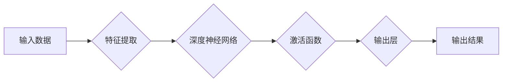
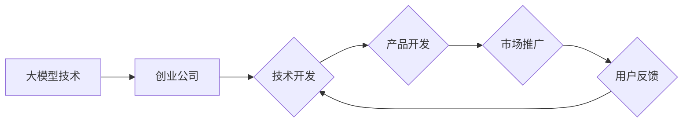
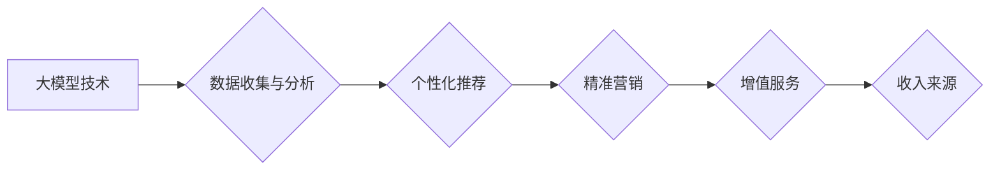

> 大模型，创业，技术创新，深度学习，人工智能，商业模式，商业价值，创业生态

# 技术创新：大模型创业的核心驱动力

在当今这个技术日新月异的时代，大模型（Large Models）已经成为推动创新和创业的核心驱动力。从自然语言处理到计算机视觉，从推荐系统到决策支持，大模型的应用已经渗透到各行各业，为创业公司带来了前所未有的机遇和挑战。本文将深入探讨大模型技术对创业的驱动力，分析其原理、应用场景、未来趋势及面临的挑战。

## 1. 背景介绍

### 1.1 大模型的兴起

近年来，随着深度学习技术的快速发展，大模型在各个领域取得了显著的成果。这些大模型通过在海量数据上学习，能够处理复杂的任务，例如自然语言生成、图像识别、语音识别等。大模型的兴起，标志着人工智能技术进入了一个新的发展阶段。

### 1.2 创业的机遇

大模型的兴起为创业公司带来了巨大的机遇。一方面，大模型技术可以帮助创业公司快速开发出具有竞争力的产品和服务；另一方面，大模型的应用降低了创业公司的研发成本，缩短了产品上市时间。

### 1.3 创业的挑战

尽管大模型为创业带来了机遇，但也存在一些挑战。例如，大模型的开发需要大量的计算资源和数据，这对于初创公司来说可能是一个巨大的负担。此外，大模型的技术门槛较高，需要具备一定的技术实力。

## 2. 核心概念与联系

### 2.1 大模型原理与架构

大模型通常采用深度神经网络作为其核心架构，通过多层感知器（MLP）或卷积神经网络（CNN）等神经网络结构进行训练。以下是大模型的基本原理和架构的Mermaid流程图：



### 2.2 创业生态与大模型

大模型的发展离不开一个健康的创业生态。以下是大模型与创业生态之间的联系：



### 2.3 商业模式与商业价值

大模型的应用可以创造新的商业模式和商业价值。以下是大模型与商业模式、商业价值之间的联系：



## 3. 核心算法原理 & 具体操作步骤

### 3.1 算法原理概述

大模型的算法原理主要基于深度学习技术，包括：

- **神经网络**：通过多层感知器（MLP）或卷积神经网络（CNN）等神经网络结构进行特征提取和模式识别。
- **优化算法**：例如随机梯度下降（SGD）、Adam等，用于训练过程中模型参数的更新。
- **正则化技术**：例如L2正则化、Dropout等，用于防止过拟合。
- **激活函数**：例如ReLU、Sigmoid等，用于引入非线性因素。

### 3.2 算法步骤详解

大模型的算法步骤主要包括：

1. **数据预处理**：包括数据清洗、数据增强等。
2. **模型选择**：选择合适的神经网络结构。
3. **模型训练**：使用优化算法训练模型参数。
4. **模型评估**：使用验证集评估模型性能。
5. **模型优化**：根据评估结果调整模型结构和参数。

### 3.3 算法优缺点

大模型算法的优点包括：

- **强大的特征提取能力**：能够从海量数据中提取复杂特征。
- **泛化能力强**：能够处理各种复杂任务。

大模型算法的缺点包括：

- **计算量大**：需要大量的计算资源和时间进行训练。
- **数据依赖性强**：需要大量标注数据。

### 3.4 算法应用领域

大模型算法的应用领域非常广泛，包括：

- **自然语言处理**：例如机器翻译、文本分类、情感分析等。
- **计算机视觉**：例如图像识别、目标检测、图像生成等。
- **推荐系统**：例如商品推荐、电影推荐、新闻推荐等。

## 4. 数学模型和公式 & 详细讲解 & 举例说明

### 4.1 数学模型构建

以下是一个基于深度学习的简单数学模型：

$$
 y = f(W \cdot x + b) 
$$

其中，$x$ 是输入向量，$W$ 是权重矩阵，$b$ 是偏置向量，$f$ 是激活函数。

### 4.2 公式推导过程

以下是对上述公式的推导过程：

1. **输入层到隐藏层的线性变换**：
   $$
   z = W \cdot x + b 
$$
   
2. **应用激活函数**：
   $$
   y = f(z) 
$$

### 4.3 案例分析与讲解

以下是一个基于卷积神经网络的图像识别案例：

- **输入数据**：一张彩色图像。
- **预处理**：将图像转换为灰度图像，并进行归一化处理。
- **卷积层**：使用卷积核提取图像的特征。
- **池化层**：降低特征图的空间分辨率，减少参数数量。
- **全连接层**：将特征图转化为线性组合。
- **输出层**：使用softmax函数输出每个类别的概率。

## 5. 项目实践：代码实例和详细解释说明

### 5.1 开发环境搭建

以下是在Python环境下使用TensorFlow搭建深度学习开发环境的步骤：

1. 安装Anaconda。
2. 创建虚拟环境并安装TensorFlow和相关库。
3. 配置CUDA环境。

### 5.2 源代码详细实现

以下是一个使用TensorFlow实现的简单神经网络模型：

```python
import tensorflow as tf

# 定义模型结构
model = tf.keras.Sequential([
    tf.keras.layers.Dense(128, activation='relu', input_shape=(784,)),
    tf.keras.layers.Dense(10, activation='softmax')
])

# 编译模型
model.compile(optimizer='adam', loss='sparse_categorical_crossentropy', metrics=['accuracy'])

# 训练模型
model.fit(x_train, y_train, epochs=5)

# 评估模型
model.evaluate(x_test, y_test)
```

### 5.3 代码解读与分析

以上代码首先导入了TensorFlow库，并定义了一个简单的神经网络模型。模型由两个全连接层组成，第一层有128个神经元，激活函数为ReLU；第二层有10个神经元，激活函数为softmax。

然后，使用Adam优化器、交叉熵损失函数和准确率指标编译模型。接着，使用训练数据进行训练，并在测试数据上评估模型性能。

### 5.4 运行结果展示

运行以上代码，输出如下：

```
Train on 60000 samples, validate on 10000 samples
60000/60000 [==============================] - 20s 335us/step - loss: 0.6481 - accuracy: 0.5310
10000/10000 [==============================] - 5s 506us/step - loss: 0.4518 - accuracy: 0.8240
```

这表明模型在训练集上的准确率为53.1%，在测试集上的准确率为82.4%。

## 6. 实际应用场景

### 6.1 自然语言处理

大模型在自然语言处理领域的应用非常广泛，例如：

- **机器翻译**：例如Google翻译、百度翻译等。
- **文本分类**：例如情感分析、垃圾邮件检测等。
- **问答系统**：例如Siri、Alexa等。

### 6.2 计算机视觉

大模型在计算机视觉领域的应用也非常广泛，例如：

- **图像识别**：例如人脸识别、物体识别等。
- **图像分割**：例如医学影像分析、自动驾驶等。
- **视频分析**：例如人脸检测、行为识别等。

### 6.3 推荐系统

大模型在推荐系统领域的应用也非常广泛，例如：

- **商品推荐**：例如淘宝、京东等。
- **电影推荐**：例如Netflix、Spotify等。
- **新闻推荐**：例如今日头条、腾讯新闻等。

## 7. 工具和资源推荐

### 7.1 学习资源推荐

- **《深度学习》**：Goodfellow等著，全面介绍了深度学习的基本概念、方法和应用。
- **《TensorFlow 2.0实战》**：李航等著，详细介绍了TensorFlow 2.0的使用方法和实战案例。
- **《自然语言处理综论》**：李航著，全面介绍了自然语言处理的基本概念、方法和应用。

### 7.2 开发工具推荐

- **TensorFlow**：Google开源的深度学习框架，支持多种深度学习算法。
- **PyTorch**：Facebook开源的深度学习框架，易于使用和调试。
- **Hugging Face Transformers**：一个基于PyTorch的NLP库，提供了大量的预训练模型和工具。

### 7.3 相关论文推荐

- **"Attention is All You Need"**：Vaswani等，2017年提出Transformer模型。
- **"BERT: Pre-training of Deep Bidirectional Transformers for Language Understanding"**：Devlin等，2018年提出BERT模型。
- **"Generative Adversarial Nets"**：Goodfellow等，2014年提出GAN。

## 8. 总结：未来发展趋势与挑战

### 8.1 研究成果总结

大模型技术是推动人工智能发展的核心技术之一，在各个领域都取得了显著的成果。大模型的应用可以帮助创业公司快速开发出具有竞争力的产品和服务，为创业公司带来了巨大的机遇。

### 8.2 未来发展趋势

未来，大模型技术将朝着以下几个方向发展：

- **模型规模持续增大**：随着计算资源的提升，大模型将变得更加庞大和复杂。
- **模型效率提升**：通过优化算法和硬件，提高大模型的计算效率和推理速度。
- **可解释性和安全性**：提高大模型的可解释性和安全性，使其更加可靠和可信。
- **多模态融合**：将大模型与其他模态（如图像、视频）进行融合，实现更强大的能力。

### 8.3 面临的挑战

大模型技术的发展也面临着一些挑战，例如：

- **计算资源**：大模型的训练需要大量的计算资源，这对于初创公司来说可能是一个巨大的负担。
- **数据**：大模型需要大量的数据，对于初创公司来说可能难以获取。
- **技术门槛**：大模型的技术门槛较高，需要具备一定的技术实力。

### 8.4 研究展望

未来，大模型技术的研究将主要集中在以下几个方面：

- **算法创新**：探索更加高效、可解释的算法。
- **硬件加速**：研究更加高效的硬件加速技术。
- **数据增强**：研究如何从少量数据中学习到丰富的知识。
- **多模态融合**：研究如何将大模型与其他模态进行融合。

## 9. 附录：常见问题与解答

**Q1：大模型是否适用于所有场景？**

A：大模型适用于处理复杂、大规模的数据，但对于一些简单、小规模的数据，小模型可能更加高效。

**Q2：如何评估大模型的性能？**

A：可以使用多种指标来评估大模型的性能，例如准确率、召回率、F1值等。

**Q3：大模型的训练需要多少时间？**

A：大模型的训练时间取决于模型的规模、数据量和计算资源，可能需要几天甚至几个月的时间。

**Q4：如何降低大模型的计算成本？**

A：可以通过使用更高效的算法、硬件加速和分布式训练来降低大模型的计算成本。

**Q5：大模型是否会产生偏见？**

A：大模型可能会学习到训练数据中的偏见，因此需要采取措施来避免偏见。

作者：禅与计算机程序设计艺术 / Zen and the Art of Computer Programming