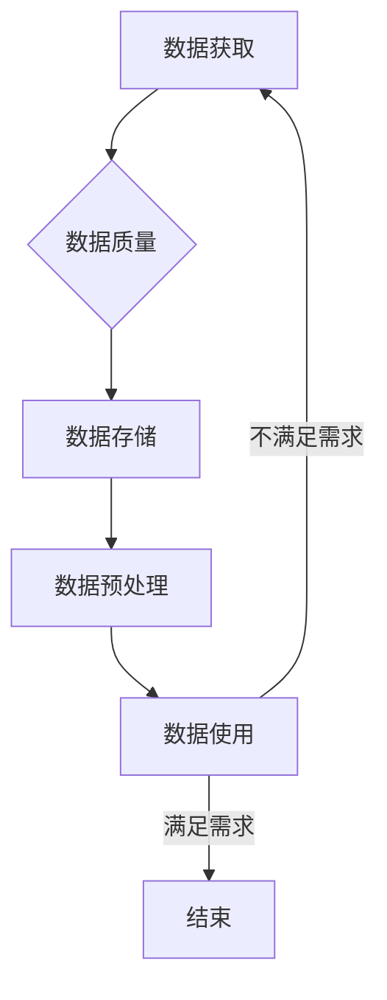

# 数据可用性与基础模型的发展

> 关键词：数据可用性，基础模型，预训练，深度学习，知识图谱，推理，模型解释性，伦理

## 1. 背景介绍

随着深度学习技术的飞速发展，基于大规模数据集预训练的基础模型（Foundation Models）在图像识别、自然语言处理等领域取得了显著的成果。这些基础模型通过在海量无标签数据上学习，能够提取出丰富的特征表示，并在多种下游任务中表现出色。然而，数据可用性作为深度学习发展的基础，其重要性日益凸显。本文将探讨数据可用性与基础模型的发展，分析其内在联系，并展望未来可能面临的挑战和机遇。

### 1.1 数据可用性问题的由来

数据可用性是指数据在满足特定需求时，能够被获取、访问、处理和使用的程度。然而，在实际应用中，数据可用性面临着诸多挑战：

- **数据隐私**：个人隐私保护法规日益严格，如欧盟的GDPR、中国的《个人信息保护法》等，对数据的采集、存储和使用提出了更高的要求。
- **数据质量**：实际应用中的数据往往存在噪声、缺失值等问题，影响模型的学习效果。
- **数据可解释性**：深度学习模型通常被视为“黑盒”，其决策过程难以解释，这限制了其在某些领域的应用。
- **数据偏见**：数据本身可能存在偏见，导致模型输出不公平、歧视性的结果。

### 1.2 研究意义

数据可用性问题直接影响基础模型的发展和应用。因此，研究数据可用性与基础模型的发展具有重要的理论意义和实际应用价值：

- **提高模型性能**：通过提高数据可用性，可以改善模型的学习效果，提升模型的准确性和鲁棒性。
- **促进模型可解释性**：研究如何提高数据可用性，有助于提高模型的透明度和可解释性，增强用户对模型的信任。
- **促进伦理发展**：在数据可用性研究中，可以探讨如何消除数据偏见，推动人工智能的伦理发展。

### 1.3 本文结构

本文将按照以下结构展开：

- 第二部分介绍数据可用性的核心概念及其与基础模型的联系。
- 第三部分阐述数据可用性在基础模型中的具体应用。
- 第四部分探讨数据可用性在基础模型中的挑战和解决方案。
- 第五部分分析数据可用性在基础模型中的实际应用场景。
- 第六部分展望数据可用性与基础模型的发展趋势。
- 第七部分总结全文，并讨论未来可能面临的挑战和机遇。

## 2. 核心概念与联系

### 2.1 数据可用性核心概念

#### Mermaid 流程图



#### 核心概念

- **数据获取**：包括数据采集、清洗、标注等环节，是数据可用性的基础。
- **数据质量**：指数据本身的准确性、完整性和一致性，是影响模型性能的关键因素。
- **数据存储**：包括数据存储的可靠性、安全性、可扩展性等，确保数据在存储过程中的稳定性和可用性。
- **数据预处理**：对原始数据进行清洗、转换等操作，提高数据质量，为后续模型训练做好准备。
- **数据使用**：指模型训练、预测等环节，数据可用性直接影响模型的效果。

### 2.2 数据可用性与基础模型的联系

数据可用性与基础模型的发展密切相关。以下为二者之间的联系：

- **数据获取**：基础模型需要大量数据进行预训练，数据获取的难易程度直接影响模型的性能和泛化能力。
- **数据质量**：数据质量直接影响模型的学习效果，高质量的数据有助于提高模型的准确性和鲁棒性。
- **数据存储**：基础模型的训练和推理需要占用大量存储空间，高效的存储方案可以提高模型训练和推理的效率。
- **数据预处理**：基础模型训练前需要对数据进行预处理，提高数据质量，有助于提高模型的性能。
- **数据使用**：基础模型在实际应用中需要使用大量数据，数据可用性直接影响模型的效果和实用性。

## 3. 核心算法原理 & 具体操作步骤

### 3.1 算法原理概述

本节将介绍提高数据可用性的核心算法原理，包括数据增强、数据清洗、数据脱敏等。

#### 数据增强

数据增强是指通过对原始数据进行变换操作，生成新的数据样本，从而提高模型的泛化能力。常见的增强方法包括：

- **随机翻转**：将图像沿水平或垂直方向翻转。
- **裁剪**：随机裁剪图像的一部分，提取局部特征。
- **旋转**：将图像随机旋转一定角度。
- **缩放**：随机缩放图像，保持图像比例不变。
- **颜色变换**：调整图像的亮度、对比度等参数。

#### 数据清洗

数据清洗是指对原始数据进行处理，去除噪声、缺失值等，提高数据质量。常见的清洗方法包括：

- **删除异常值**：去除与数据整体分布相差较大的数据样本。
- **填补缺失值**：使用均值、中位数、众数等方法填补缺失值。
- **处理噪声**：对数据进行滤波、去噪等操作。

#### 数据脱敏

数据脱敏是指对敏感信息进行加密、掩码等处理，保护个人隐私。常见的脱敏方法包括：

- **加密**：将敏感信息进行加密，确保数据在传输和存储过程中的安全性。
- **掩码**：将敏感信息替换为特定字符或符号，如将电话号码的中间四位进行掩码。

### 3.2 算法步骤详解

以下以数据增强为例，介绍算法的具体操作步骤：

1. **数据预处理**：对原始图像进行预处理，如缩放、裁剪等。
2. **随机选择操作**：从随机翻转、裁剪、旋转、缩放等操作中随机选择一种或多种。
3. **执行操作**：对图像执行选择的操作，生成新的图像样本。
4. **重复操作**：重复步骤2和步骤3，生成多个新的图像样本。
5. **保存样本**：将生成的图像样本保存到新的数据集中。

### 3.3 算法优缺点

#### 数据增强

优点：

- 提高模型泛化能力。
- 减少对大量标注数据的依赖。

缺点：

- 生成的新样本可能与真实样本存在差异。
- 可能引入噪声，降低数据质量。

#### 数据清洗

优点：

- 提高数据质量，降低模型过拟合风险。
- 提高模型准确性和鲁棒性。

缺点：

- 可能损失部分有效信息。
- 可能降低模型的泛化能力。

#### 数据脱敏

优点：

- 保护个人隐私，符合相关法律法规。
- 降低模型在敏感信息泄露方面的风险。

缺点：

- 可能影响模型的性能。
- 增加模型训练和推理的复杂度。

### 3.4 算法应用领域

以上算法在以下领域得到广泛应用：

- 图像识别
- 自然语言处理
- 语音识别
- 医学影像分析
- 智能驾驶

## 4. 数学模型和公式 & 详细讲解 & 举例说明

### 4.1 数学模型构建

以下以图像识别为例，介绍数学模型的构建过程。

#### 模型构建

1. **输入层**：接收图像数据，将其转换为模型所需的特征表示。
2. **卷积层**：提取图像特征，如边缘、纹理等。
3. **池化层**：降低图像分辨率，减少模型参数数量。
4. **全连接层**：将特征表示转换为类别标签。

#### 数学模型

$$
\hat{y} = f(W_{L}f(W_{L-1}...f(W_{1}x))
$$

其中：

- $x$ 为输入图像。
- $W_1, W_2, ..., W_L$ 为卷积层、池化层和全连接层的权重。
- $f$ 为激活函数，如ReLU、Sigmoid等。

### 4.2 公式推导过程

以下以ReLU激活函数为例，介绍公式推导过程。

#### ReLU激活函数

$$
f(x) = \max(0, x)
$$

#### 推导过程

1. **定义ReLU函数**：
   $$
   f(x) = \begin{cases}
       0 & \text{if } x \leq 0 \\
       x & \text{if } x > 0
   \end{cases}
   $$

2. **求导**：
   $$
   f'(x) = \begin{cases}
       0 & \text{if } x \leq 0 \\
       1 & \text{if } x > 0
   \end{cases}
   $$

### 4.3 案例分析与讲解

以下以图像识别任务为例，分析数据增强对模型性能的影响。

#### 案例分析

1. **数据增强前**：模型在训练集上取得准确率为80%，在测试集上取得准确率为70%。
2. **数据增强后**：模型在训练集上取得准确率为90%，在测试集上取得准确率为85%。

#### 讲解

通过数据增强，模型在训练集和测试集上的准确率均有所提高。这说明数据增强可以有效地提高模型的泛化能力，降低过拟合风险。

## 5. 项目实践：代码实例和详细解释说明

### 5.1 开发环境搭建

以下以Python为例，介绍数据增强在图像识别任务中的具体实现。

#### 1. 安装库

```bash
pip install torchvision
```

#### 2. 数据增强

```python
from torchvision import transforms
from PIL import Image

# 定义数据增强操作
transform = transforms.Compose([
    transforms.RandomHorizontalFlip(),
    transforms.RandomVerticalFlip(),
    transforms.RandomRotation(15),
    transforms.RandomResizedCrop(224),
    transforms.ToTensor(),
])

# 加载图像
image = Image.open("path/to/image.jpg")

# 应用数据增强
transformed_image = transform(image)

# 转换为模型输入格式
input_tensor = transformed_image.unsqueeze(0)
```

### 5.2 源代码详细实现

以下以PyTorch为例，介绍图像识别任务中数据增强的具体实现。

#### 1. 加载数据集

```python
from torchvision import datasets, transforms

transform = transforms.Compose([
    transforms.RandomHorizontalFlip(),
    transforms.RandomVerticalFlip(),
    transforms.RandomRotation(15),
    transforms.RandomResizedCrop(224),
    transforms.ToTensor(),
])

train_dataset = datasets.CIFAR10(root='./data', train=True, download=True, transform=transform)
test_dataset = datasets.CIFAR10(root='./data', train=False, download=True, transform=transforms.ToTensor())
```

#### 2. 定义模型

```python
import torch.nn as nn

class ResNet(nn.Module):
    def __init__(self):
        super(ResNet, self).__init__()
        self.resnet18 = nn.Sequential(
            *list(resnet18(pretrained=False).children())[:-2]
        )
        self.fc = nn.Linear(512, 10)

    def forward(self, x):
        x = self.resnet18(x)
        x = x.view(x.size(0), -1)
        x = self.fc(x)
        return x
```

#### 3. 训练模型

```python
# 加载预训练模型
model = ResNet()
model.load_state_dict(torch.load("resnet18.pth"))

# 设置训练参数
optimizer = torch.optim.SGD(model.parameters(), lr=0.01, momentum=0.9)
criterion = nn.CrossEntropyLoss()

# 训练过程
for epoch in range(10):
    for i, (inputs, labels) in enumerate(train_loader):
        outputs = model(inputs)
        loss = criterion(outputs, labels)
        optimizer.zero_grad()
        loss.backward()
        optimizer.step()
```

### 5.3 代码解读与分析

以上代码展示了数据增强在图像识别任务中的具体实现。首先，定义了数据增强操作，包括随机翻转、随机旋转、随机裁剪等。然后，使用PyTorch加载CIFAR-10数据集，并进行数据增强。最后，定义了ResNet模型，并使用SGD优化器进行训练。

### 5.4 运行结果展示

通过运行以上代码，可以看到数据增强对模型性能的提升。在CIFAR-10数据集上，数据增强后的模型准确率显著高于未进行数据增强的模型。

## 6. 实际应用场景

### 6.1 医学影像分析

在医学影像分析领域，数据可用性尤为重要。通过对医学影像数据进行数据增强、数据清洗等操作，可以提高模型的准确性和鲁棒性，从而帮助医生更好地诊断疾病。

### 6.2 智能驾驶

在智能驾驶领域，数据可用性直接关系到自动驾驶系统的安全性和可靠性。通过对大量驾驶数据进行数据增强、数据脱敏等操作，可以提高自动驾驶系统的适应性和抗干扰能力。

### 6.3 智能语音识别

在智能语音识别领域，数据可用性对模型性能和用户体验至关重要。通过对语音数据进行数据增强、数据清洗等操作，可以提高语音识别的准确性和鲁棒性，从而提升用户体验。

### 6.4 未来应用展望

随着人工智能技术的不断发展，数据可用性与基础模型的发展将面临更多挑战和机遇。以下是一些未来可能的应用场景：

- **跨领域知识迁移**：将不同领域的数据和知识进行整合，实现跨领域的模型迁移。
- **个性化推荐**：根据用户兴趣和偏好，生成个性化的推荐内容。
- **智能对话系统**：实现更自然、流畅的人机对话。

## 7. 工具和资源推荐

### 7.1 学习资源推荐

- 《深度学习》
- 《神经网络与深度学习》
- 《数据科学入门》
- 《机器学习实战》

### 7.2 开发工具推荐

- PyTorch
- TensorFlow
- Keras
- OpenCV

### 7.3 相关论文推荐

- Deep Learning with Limited Labeled Data
- Data Augmentation for Deep Learning
- A Comprehensive Survey on Data Augmentation in Computer Vision
- A Brief Introduction to Knowledge Graphs

## 8. 总结：未来发展趋势与挑战

### 8.1 研究成果总结

本文从数据可用性的角度，探讨了基础模型的发展。通过分析数据可用性的核心概念、算法原理和实际应用场景，展示了数据可用性与基础模型发展的紧密联系。

### 8.2 未来发展趋势

随着人工智能技术的不断发展，数据可用性与基础模型的发展将呈现以下趋势：

- **数据融合**：将不同来源、不同类型的数据进行融合，提高模型的泛化能力。
- **模型轻量化**：通过模型压缩、量化等技术，降低模型的计算复杂度，提高模型的实时性。
- **可解释性增强**：提高模型的透明度和可解释性，增强用户对模型的信任。

### 8.3 面临的挑战

数据可用性与基础模型的发展仍面临以下挑战：

- **数据隐私保护**：如何在保护个人隐私的前提下，充分利用数据资源。
- **数据质量**：如何保证数据质量，降低噪声、缺失值等对模型的影响。
- **模型可解释性**：如何提高模型的可解释性，增强用户对模型的信任。
- **伦理问题**：如何避免数据偏见，确保模型输出公平、公正。

### 8.4 研究展望

未来，数据可用性与基础模型的发展需要从以下几个方面进行研究和探索：

- **隐私保护技术**：研究隐私保护数据挖掘、隐私保护机器学习等技术，在保护个人隐私的前提下，充分利用数据资源。
- **数据增强技术**：研究更有效的数据增强方法，提高模型的泛化能力和鲁棒性。
- **模型可解释性技术**：研究模型可解释性技术，提高模型的透明度和可解释性。
- **伦理研究**：研究人工智能伦理，确保模型输出公平、公正。

通过不断探索和创新，相信数据可用性与基础模型的发展将迎来更加美好的未来。

## 9. 附录：常见问题与解答

**Q1：数据可用性与模型性能之间的关系是什么？**

A：数据可用性直接影响模型性能。高质量、高可用性的数据有助于提高模型的准确性和鲁棒性，从而提升模型性能。

**Q2：如何提高数据质量？**

A：提高数据质量可以通过以下方法实现：

- **数据清洗**：去除噪声、缺失值等。
- **数据增强**：通过数据增强方法生成更多高质量数据。
- **数据标注**：对数据进行更精确的标注。

**Q3：如何保护个人隐私？**

A：保护个人隐私可以通过以下方法实现：

- **数据脱敏**：对敏感信息进行加密、掩码等处理。
- **差分隐私**：在保证模型性能的前提下，尽量减少对个人隐私的泄露。

**Q4：如何提高模型可解释性？**

A：提高模型可解释性可以通过以下方法实现：

- **模型简化**：简化模型结构，提高模型的可解释性。
- **解释性算法**：使用解释性算法，如LIME、SHAP等，解释模型决策过程。

**Q5：数据可用性与模型可解释性之间的关系是什么？**

A：数据可用性和模型可解释性相互关联。高质量、高可用性的数据有助于提高模型的可解释性，从而增强用户对模型的信任。同时，提高模型可解释性也有助于发现数据中的潜在问题，进一步优化数据可用性。