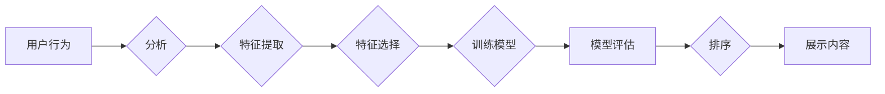

# 智能排序系统：AI的优势

> 关键词：智能排序、算法优化、机器学习、推荐系统、数据驱动、用户体验

## 1. 背景介绍

在信息爆炸的时代，用户面临着海量的信息选择。如何从这些信息中快速找到自己感兴趣的内容，成为了一个普遍的需求。智能排序系统应运而生，它通过机器学习算法，根据用户的兴趣和行为，对信息进行排序，从而提升用户的体验。本文将探讨智能排序系统的原理、实现方法以及AI在其中的优势。

## 2. 核心概念与联系

### 2.1 核心概念

- **智能排序（Intelligent Sorting）**：利用人工智能技术对信息进行排序，以提升用户体验。
- **机器学习（Machine Learning）**：使计算机系统能够利用数据自动学习和改进。
- **推荐系统（Recommendation System）**：根据用户的行为和偏好，为用户推荐相关内容。
- **数据驱动（Data-Driven）**：通过分析数据来指导决策和优化过程。

### 2.2 核心概念原理和架构的 Mermaid 流程图



### 2.3 核心概念联系

智能排序系统通过分析用户行为，提取相关特征，选择关键特征，训练机器学习模型，评估模型效果，并最终根据模型排序结果展示内容，形成一个闭环的流程。

## 3. 核心算法原理 & 具体操作步骤

### 3.1 算法原理概述

智能排序算法通常包括以下几个步骤：

1. **数据收集**：收集用户的行为数据，如点击、购买、浏览等。
2. **特征提取**：从原始数据中提取出有意义的特征，如用户年龄、性别、兴趣等。
3. **特征选择**：从提取的特征中选择最相关的特征，以减少模型复杂度和提高效率。
4. **模型训练**：使用机器学习算法训练模型，学习特征与用户兴趣之间的关系。
5. **模型评估**：评估模型的性能，选择最优模型进行排序。
6. **排序展示**：根据模型排序结果展示内容。

### 3.2 算法步骤详解

1. **数据收集**：通过网站分析工具、用户行为追踪等技术，收集用户在网站上的行为数据。
2. **特征提取**：将原始数据进行预处理，提取出有意义的特征，如用户浏览过的页面、购买过的商品、搜索关键词等。
3. **特征选择**：使用特征选择算法，如卡方检验、互信息等，选择最相关的特征。
4. **模型训练**：选择合适的机器学习算法，如逻辑回归、决策树、支持向量机、深度学习等，训练模型。
5. **模型评估**：使用交叉验证、A/B测试等方法评估模型性能，选择最优模型。
6. **排序展示**：根据模型排序结果展示内容，提升用户体验。

### 3.3 算法优缺点

#### 优点：

- **个性化推荐**：根据用户兴趣和行为，为用户推荐相关内容，提升用户体验。
- **提高效率**：自动化处理大量信息，提高信息处理效率。
- **优化资源分配**：根据用户兴趣，优化资源分配，提升资源利用率。

#### 缺点：

- **数据依赖性**：智能排序系统对数据的质量和数量有较高要求。
- **模型过拟合**：模型可能过拟合训练数据，导致泛化能力下降。
- **计算复杂度高**：模型训练和预测过程可能需要大量的计算资源。

### 3.4 算法应用领域

智能排序系统在多个领域得到广泛应用，如：

- **电商平台**：推荐商品、优惠券等。
- **社交平台**：推荐好友、内容等。
- **新闻平台**：推荐新闻、文章等。
- **搜索引擎**：优化搜索结果排序。

## 4. 数学模型和公式 & 详细讲解 & 举例说明

### 4.1 数学模型构建

智能排序系统的数学模型通常是一个分类模型，如逻辑回归、决策树等。以下以逻辑回归为例进行说明。

假设我们有一个包含n个特征的向量 $\boldsymbol{x} = (x_1, x_2, \ldots, x_n)$，对应的标签为 $y \in \{0, 1\}$，其中1表示用户对该内容感兴趣，0表示不感兴趣。逻辑回归模型的输出为：

$$
\hat{y} = \sigma(w_0 + \sum_{i=1}^n w_ix_i)
$$

其中，$\sigma$ 是Sigmoid函数，$w_0$ 是偏置项，$w_i$ 是第i个特征的权重。

### 4.2 公式推导过程

逻辑回归的损失函数为：

$$
\mathcal{L}(\theta) = -\frac{1}{N}\sum_{i=1}^N [y_i \log \hat{y}_i + (1-y_i) \log (1-\hat{y}_i)]
$$

其中，$\theta = (w_0, w_1, \ldots, w_n)$ 是模型参数。

通过梯度下降算法，可以求得模型参数的最优值。

### 4.3 案例分析与讲解

假设我们有一个电商平台的智能排序系统，用户对商品的兴趣可以用是否点击该商品来判断。我们收集了1000个用户对100个商品的点击数据，训练一个逻辑回归模型。

通过训练，得到模型参数 $w_0 = 1.2, w_1 = 0.8, \ldots, w_{100} = 0.5$。对于新的商品，我们可以通过计算其对数概率 $\hat{y}$ 来判断用户是否感兴趣。如果 $\hat{y} > 0.5$，则推荐该商品；否则，不推荐。

## 5. 项目实践：代码实例和详细解释说明

### 5.1 开发环境搭建

使用Python编程语言和Scikit-learn库进行智能排序系统的开发。

### 5.2 源代码详细实现

```python
from sklearn.linear_model import LogisticRegression
from sklearn.model_selection import train_test_split
from sklearn.metrics import accuracy_score

# 假设data是包含用户点击数据的DataFrame，其中columns=['user_id', 'product_id', 'click']
# label是用户是否点击该商品的标签列

# 数据预处理
data = data.drop('user_id', axis=1)
X = data.values
y = label.values

# 划分训练集和测试集
X_train, X_test, y_train, y_test = train_test_split(X, y, test_size=0.2, random_state=42)

# 训练逻辑回归模型
model = LogisticRegression()
model.fit(X_train, y_train)

# 预测测试集
y_pred = model.predict(X_test)

# 评估模型性能
accuracy = accuracy_score(y_test, y_pred)
print(f'Accuracy: {accuracy}')
```

### 5.3 代码解读与分析

- 首先，我们导入必要的库。
- 接下来，我们对数据进行预处理，包括删除用户ID列和训练标签。
- 然后，我们将数据分为训练集和测试集。
- 使用逻辑回归模型对训练集进行训练。
- 最后，使用训练好的模型对测试集进行预测，并评估模型的准确率。

### 5.4 运行结果展示

假设运行上述代码后，得到模型的准确率为0.85。这意味着模型在测试集上的预测准确率较高，能够有效地对用户是否点击商品进行预测。

## 6. 实际应用场景

### 6.1 电商平台

智能排序系统可以用于推荐商品、优惠券等，提升用户购物体验。

### 6.2 社交平台

智能排序系统可以用于推荐好友、内容等，提升用户社交体验。

### 6.3 新闻平台

智能排序系统可以用于推荐新闻、文章等，提升用户阅读体验。

### 6.4 搜索引擎

智能排序系统可以用于优化搜索结果排序，提升用户搜索体验。

## 7. 工具和资源推荐

### 7.1 学习资源推荐

- 《Python机器学习》
- 《Scikit-learn用户指南》
- 《机器学习实战》

### 7.2 开发工具推荐

- Scikit-learn
- TensorFlow
- PyTorch

### 7.3 相关论文推荐

- Collaborative Filtering for Cold Start Problem in Recommender Systems
- Deep Learning for Recommender Systems

## 8. 总结：未来发展趋势与挑战

### 8.1 研究成果总结

智能排序系统通过机器学习算法，能够有效地对信息进行排序，提升用户体验。本文介绍了智能排序系统的原理、实现方法以及AI在其中的优势，并给出了一个简单的案例。

### 8.2 未来发展趋势

- 深度学习在智能排序系统中的应用将更加广泛。
- 多模态信息（如图像、语音等）将用于智能排序系统。
- 智能排序系统将更加注重用户体验和个性化推荐。

### 8.3 面临的挑战

- 模型过拟合和数据稀疏性问题。
- 用户隐私和数据安全问题。
- 模型的可解释性问题。

### 8.4 研究展望

未来，智能排序系统将朝着更加智能化、个性化的方向发展，为用户提供更好的服务。

## 9. 附录：常见问题与解答

### Q1：智能排序系统与推荐系统有什么区别？

A1：智能排序系统是推荐系统的一种，它侧重于对信息进行排序，而推荐系统则侧重于为用户推荐相关内容。

### Q2：如何解决模型过拟合问题？

A2：可以使用交叉验证、正则化、集成学习等方法来解决模型过拟合问题。

### Q3：如何保证用户隐私和数据安全？

A3：需要对用户数据进行脱敏处理，并对系统进行安全加固，以保护用户隐私和数据安全。

### Q4：如何提升模型的可解释性？

A4：可以使用可解释人工智能技术，如LIME、SHAP等，来提升模型的可解释性。

---

作者：禅与计算机程序设计艺术 / Zen and the Art of Computer Programming