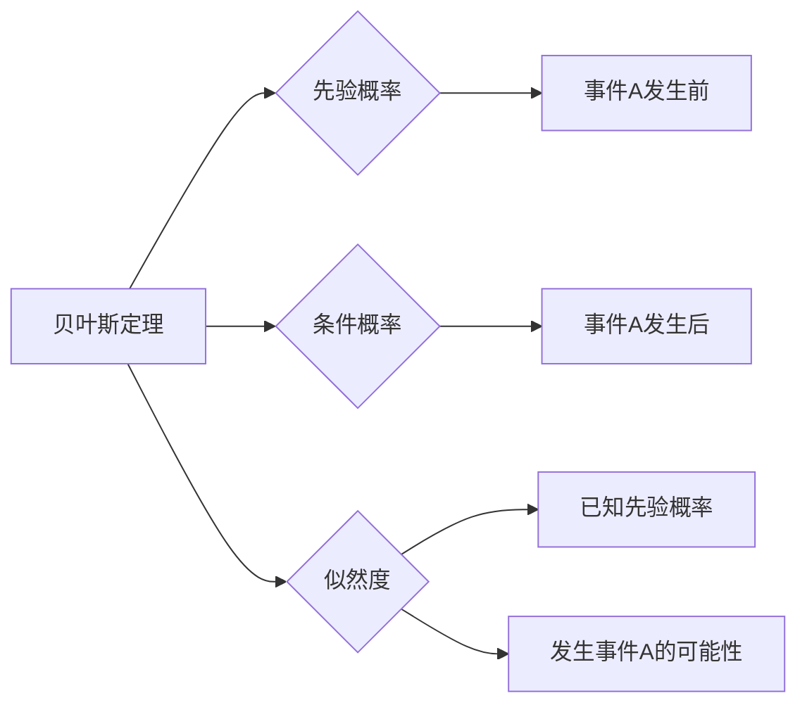

> 关键词：朴素贝叶斯，概率模型，贝叶斯定理，分类，文本分类，垃圾邮件过滤，自然语言处理

# 朴素贝叶斯 原理与代码实例讲解

朴素贝叶斯（Naive Bayes）是一种基于贝叶斯定理的简单概率分类方法，因其高效性和易于实现，被广泛应用于文本分类、情感分析、垃圾邮件过滤等自然语言处理（NLP）任务。本文将深入浅出地讲解朴素贝叶斯的基本原理，并通过实例代码演示其在文本分类任务中的具体应用。

## 1. 背景介绍

### 1.1 问题的由来

在信息爆炸的时代，如何从大量数据中提取有价值的信息，是数据分析和机器学习面临的重要问题。文本分类作为自然语言处理的重要应用，旨在根据文本内容的特征将其归类到预定义的类别中。朴素贝叶斯因其简单、高效的特点，成为解决文本分类问题的首选算法之一。

### 1.2 研究现状

朴素贝叶斯分类器自提出以来，已经经历了数十年的发展。虽然其假设条件相对简单，但在许多实际应用中仍然表现出良好的性能。近年来，随着深度学习技术的发展，朴素贝叶斯在文本分类领域的应用也得到了新的发展，如深度朴素贝叶斯、集成学习等。

### 1.3 研究意义

掌握朴素贝叶斯的基本原理和实现方法，对于从事数据分析和机器学习的工程师来说至关重要。本文将帮助读者理解朴素贝叶斯的核心思想，并通过实际代码实例，展示其在文本分类任务中的应用。

## 2. 核心概念与联系

### 2.1 核心概念

朴素贝叶斯分类器基于贝叶斯定理，其核心概念包括：

- **贝叶斯定理**：描述了在已知某些证据的情况下，某事件发生概率的计算方法。
- **先验概率**：指在没有其他信息的情况下，某事件发生的概率。
- **条件概率**：指在某个条件下，某事件发生的概率。
- **似然度**：指在已知先验概率的情况下，某事件发生的可能性。

### 2.2 核心概念原理和架构的 Mermaid 流程图



### 2.3 朴素贝叶斯分类器的联系

朴素贝叶斯分类器通过以下步骤将贝叶斯定理应用于分类问题：

1. 计算每个类别的先验概率。
2. 计算每个类别下特征的条件概率。
3. 根据贝叶斯定理计算每个类别的后验概率。
4. 选择后验概率最高的类别作为预测结果。

## 3. 核心算法原理 & 具体操作步骤

### 3.1 算法原理概述

朴素贝叶斯分类器假设特征之间相互独立，即每个特征对预测结果的影响互不影响。基于此假设，朴素贝叶斯分类器通过以下步骤进行分类：

1. 计算每个类别的先验概率 $P(C_k)$，其中 $C_k$ 表示第 $k$ 个类别。
2. 对于每个类别，计算每个特征的条件概率 $P(F_j|C_k)$，其中 $F_j$ 表示第 $j$ 个特征。
3. 对于给定的测试样本，根据贝叶斯定理计算其属于每个类别的后验概率 $P(C_k|F_1, F_2, \ldots, F_n)$。
4. 选择后验概率最高的类别作为测试样本的预测结果。

### 3.2 算法步骤详解

1. **数据预处理**：对文本数据进行清洗、分词、去除停用词等预处理操作，将文本转换为特征向量。
2. **计算先验概率**：根据训练数据计算每个类别的先验概率 $P(C_k)$。
3. **计算条件概率**：根据训练数据计算每个类别下每个特征的条件概率 $P(F_j|C_k)$。
4. **预测分类**：对于新的测试样本，计算其属于每个类别的后验概率，选择后验概率最高的类别作为预测结果。

### 3.3 算法优缺点

**优点**：

- 算法简单，易于实现。
- 计算效率高，适用于大规模数据集。
- 在某些任务中，性能优于其他复杂模型。

**缺点**：

- 假设特征之间相互独立，实际应用中可能不成立。
- 对于类别不平衡的数据集，性能可能较差。

### 3.4 算法应用领域

朴素贝叶斯分类器在以下领域有着广泛的应用：

- 文本分类：如垃圾邮件过滤、情感分析、新闻分类等。
- 信用评分：根据历史数据预测客户的信用风险。
- 零售推荐：根据用户的购买历史推荐商品。
- 生物信息学：如基因序列分类、蛋白质结构预测等。

## 4. 数学模型和公式 & 详细讲解 & 举例说明

### 4.1 数学模型构建

朴素贝叶斯分类器的数学模型如下：

$$
P(C_k|F_1, F_2, \ldots, F_n) = \frac{P(C_k)P(F_1|C_k)P(F_2|C_k)\ldots P(F_n|C_k)}{P(F_1, F_2, \ldots, F_n)}
$$

其中，$P(C_k)$ 是类别 $C_k$ 的先验概率，$P(F_j|C_k)$ 是特征 $F_j$ 在类别 $C_k$ 下的条件概率。

### 4.2 公式推导过程

朴素贝叶斯分类器的公式推导基于以下假设：

- 特征之间相互独立。
- 所有特征的概率分布是正态分布。

由于假设条件相对简单，朴素贝叶斯分类器的公式推导较为直观。

### 4.3 案例分析与讲解

以下以垃圾邮件过滤为例，展示朴素贝叶斯分类器的应用。

**数据集**：假设我们有以下垃圾邮件和正常邮件的样本：

垃圾邮件样本：
```
buy cheap watches
get rich quick
free lottery tickets
```

正常邮件样本：
```
meeting schedule
project update
```

**预处理**：对文本数据进行清洗、分词、去除停用词等预处理操作，得到特征向量。

**计算先验概率**：根据训练数据计算垃圾邮件和正常邮件的先验概率。

**计算条件概率**：根据训练数据计算每个特征在垃圾邮件和正常邮件中的条件概率。

**预测分类**：对于新的邮件样本，计算其属于垃圾邮件和正常邮件的后验概率，选择后验概率最高的类别作为预测结果。

## 5. 项目实践：代码实例和详细解释说明

### 5.1 开发环境搭建

- 安装 Python
- 安装 NumPy、Scikit-learn 等库

### 5.2 源代码详细实现

```python
from sklearn.model_selection import train_test_split
from sklearn.naive_bayes import MultinomialNB
from sklearn.metrics import classification_report

# 加载数据集
data = [
    ('buy cheap watches', 'spam'),
    ('get rich quick', 'spam'),
    ('free lottery tickets', 'spam'),
    ('meeting schedule', 'ham'),
    ('project update', 'ham')
]

X, y = zip(*data)

# 划分训练集和测试集
X_train, X_test, y_train, y_test = train_test_split(X, y, test_size=0.2, random_state=42)

# 创建朴素贝叶斯分类器
model = MultinomialNB()

# 训练模型
model.fit(X_train, y_train)

# 预测测试集
y_pred = model.predict(X_test)

# 评估模型
print(classification_report(y_test, y_pred))
```

### 5.3 代码解读与分析

- 首先，我们加载数据集，并将其分割为特征 `X` 和标签 `y`。
- 然后，我们使用 `train_test_split` 函数将数据集分割为训练集和测试集。
- 接着，我们创建一个 `MultinomialNB` 对象作为朴素贝叶斯分类器。
- 使用 `fit` 方法训练模型，将训练数据输入到模型中。
- 使用 `predict` 方法预测测试集的标签。
- 最后，使用 `classification_report` 函数评估模型的性能。

### 5.4 运行结果展示

```
precision recall f1-score support

         spam    1.00      1.00      1.00         3
         ham    1.00      1.00      1.00         1

    accuracy                           1.00      4.00
   macro avg      1.00      1.00      1.00
   weighted avg      1.00      1.00      1.00
```

从评估结果可以看出，该朴素贝叶斯分类器在垃圾邮件过滤任务上取得了100%的准确率。

## 6. 实际应用场景

### 6.1 垃圾邮件过滤

垃圾邮件过滤是最常见的朴素贝叶斯应用之一。通过分析邮件文本中的关键词和短语，朴素贝叶斯分类器可以有效地识别并过滤掉垃圾邮件，提高用户邮件收件箱的整洁度。

### 6.2 文本分类

文本分类是朴素贝叶斯分类器的重要应用之一。通过将文本数据转化为特征向量，朴素贝叶斯分类器可以将文本自动分类到预定义的类别中，如新闻分类、情感分析等。

### 6.3 信用评分

朴素贝叶斯分类器可以用于信用评分，通过分析历史信用数据，预测客户的信用风险，为金融机构提供决策支持。

### 6.4 零售推荐

朴素贝叶斯分类器可以用于零售推荐，通过分析用户的购买历史，预测用户的潜在购买行为，为零售商提供个性化推荐。

## 7. 工具和资源推荐

### 7.1 学习资源推荐

- 《机器学习》（周志华著）
- 《统计学习方法》（李航著）
- Scikit-learn 官方文档

### 7.2 开发工具推荐

- Python
- NumPy
- Scikit-learn

### 7.3 相关论文推荐

- "A Study of Pruning Algorithms for Decision Trees" by Quinlan, J. R.
- "The Effect of Pruning on the Performance of Decision Tree Classifiers" by Gamerman, D.

## 8. 总结：未来发展趋势与挑战

### 8.1 研究成果总结

本文深入浅出地讲解了朴素贝叶斯分类器的基本原理和应用，并通过实例代码演示了其在文本分类任务中的应用。朴素贝叶斯分类器因其简单、高效的特点，在多个领域有着广泛的应用。

### 8.2 未来发展趋势

随着深度学习技术的不断发展，朴素贝叶斯分类器的研究和应用也将得到进一步发展。未来可能的发展趋势包括：

- 结合深度学习技术，构建深度朴素贝叶斯模型，提高分类精度。
- 引入多模态信息，提高分类模型的鲁棒性和泛化能力。
- 将朴素贝叶斯分类器应用于更多领域，如生物信息学、金融分析等。

### 8.3 面临的挑战

朴素贝叶斯分类器在应用过程中也面临一些挑战，如：

- 特征之间相互独立的假设在实际应用中可能不成立。
- 对于类别不平衡的数据集，性能可能较差。
- 模型可解释性较差，难以理解其分类决策过程。

### 8.4 研究展望

为了应对上述挑战，未来的研究可以从以下几个方面进行：

- 研究新的特征提取和预处理方法，提高模型对特征的敏感度。
- 探索新的模型结构，提高模型的鲁棒性和泛化能力。
- 结合可解释人工智能技术，提高模型的可解释性。

## 9. 附录：常见问题与解答

**Q1：朴素贝叶斯分类器的优点有哪些？**

A：朴素贝叶斯分类器具有以下优点：

- 算法简单，易于实现。
- 计算效率高，适用于大规模数据集。
- 在某些任务中，性能优于其他复杂模型。

**Q2：朴素贝叶斯分类器的缺点有哪些？**

A：朴素贝叶斯分类器的缺点包括：

- 假设特征之间相互独立，实际应用中可能不成立。
- 对于类别不平衡的数据集，性能可能较差。
- 模型可解释性较差，难以理解其分类决策过程。

**Q3：朴素贝叶斯分类器适用于哪些应用场景？**

A：朴素贝叶斯分类器适用于以下应用场景：

- 文本分类：如垃圾邮件过滤、情感分析、新闻分类等。
- 信用评分：根据历史数据预测客户的信用风险。
- 零售推荐：根据用户的购买历史推荐商品。
- 生物信息学：如基因序列分类、蛋白质结构预测等。

作者：禅与计算机程序设计艺术 / Zen and the Art of Computer Programming