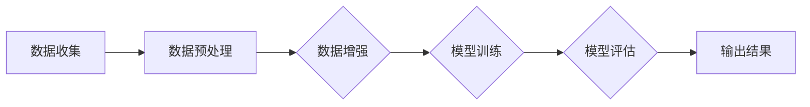

# 李飞飞与ImageNet的革命

> 关键词：李飞飞，ImageNet，深度学习，计算机视觉，卷积神经网络，大规模视觉识别挑战赛，视觉识别，人工智能

## 1. 背景介绍

在人工智能领域，李飞飞（Fei-Fei Li）是一位无人不知、无人不晓的名字。她不仅是斯坦福大学的杰出教授，也是计算机视觉领域的领军人物。李飞飞对人工智能的贡献，尤其是在ImageNet项目中扮演的角色，可以说是革命性的。ImageNet是一个庞大的视觉数据库，它推动了深度学习在计算机视觉领域的爆炸式发展。本文将深入探讨李飞飞与ImageNet的故事，以及它如何改变了人工智能的面貌。

### 1.1 问题的由来

在ImageNet诞生之前，计算机视觉领域面临着巨大的挑战。传统的图像识别系统依赖于手工设计的特征和分类器，这些系统在处理复杂图像和变化多端的环境时表现不佳。图像识别的准确率通常在70%以下，这对于实际应用来说是远远不够的。

### 1.2 研究现状

2009年，李飞飞带领团队发布了ImageNet数据库，这是一个包含超过1400万个图像和20万个类别的海量数据集。这个数据库的出现，为深度学习在计算机视觉领域的应用提供了强大的动力。

### 1.3 研究意义

ImageNet不仅是一个巨大的数据集，它还提供了一个标准的基准，使得研究者们可以公平地比较不同模型和算法的性能。ImageNet的成功，极大地推动了计算机视觉领域的发展。

### 1.4 本文结构

本文将按照以下结构展开：

- **第2章**：介绍ImageNet的核心概念和其背后的原理。
- **第3章**：探讨深度学习在ImageNet上的应用，包括卷积神经网络（CNN）的原理和操作步骤。
- **第4章**：分析ImageNet对数学模型和公式的影响，并举例说明。
- **第5章**：通过项目实践，展示如何使用深度学习进行图像识别。
- **第6章**：探讨ImageNet的实际应用场景和未来应用展望。
- **第7章**：推荐相关学习资源、开发工具和参考文献。
- **第8章**：总结ImageNet的研究成果，并展望未来发展趋势与挑战。
- **第9章**：附录，包含常见问题与解答。

## 2. 核心概念与联系

### 2.1 ImageNet的原理

ImageNet是一个大规模视觉识别挑战赛（Large Scale Visual Recognition Challenge, LVRC），它由李飞飞及其团队创建。这个挑战赛旨在通过提供一个统一的标准，来推动计算机视觉领域的研究。ImageNet数据库包含了1400万张图片，每张图片都被标注了至少一个类别。

### 2.2 核心概念原理和架构的 Mermaid 流程图



### 2.3 核心概念的联系

ImageNet的核心概念包括数据收集、预处理、数据增强、模型训练、模型评估和输出结果。这些概念相互联系，共同构成了一个完整的图像识别流程。

## 3. 核心算法原理 & 具体操作步骤

### 3.1 算法原理概述

深度学习，特别是卷积神经网络（CNN），是ImageNet中使用的核心算法。CNN能够自动从图像中学习特征，并在识别任务中表现出色。

### 3.2 算法步骤详解

#### 3.2.1 数据预处理

在训练之前，需要对图像进行预处理，包括尺寸调整、归一化等操作。

#### 3.2.2 数据增强

为了提高模型的泛化能力，对图像进行随机旋转、缩放、裁剪等增强操作。

#### 3.2.3 模型训练

使用CNN对图像进行特征提取和分类。

#### 3.2.4 模型评估

使用验证集对模型进行评估，调整超参数以优化性能。

#### 3.2.5 输出结果

使用训练好的模型对测试集进行预测。

### 3.3 算法优缺点

#### 3.3.1 优点

- 高效的特征提取能力
- 强大的分类性能
- 易于并行计算

#### 3.3.2 缺点

- 计算资源消耗大
- 对超参数敏感

### 3.4 算法应用领域

CNN在ImageNet上的成功，使其成为了计算机视觉领域的主流算法。它被广泛应用于图像识别、图像分类、目标检测等任务。

## 4. 数学模型和公式 & 详细讲解 & 举例说明

### 4.1 数学模型构建

CNN的数学模型主要包括卷积层、池化层、激活函数和全连接层。

### 4.2 公式推导过程

以下是一个简单的卷积层公式示例：

$$
\hat{f}^l(x) = f^l(w^l \cdot x + b^l)
$$

其中，$\hat{f}^l(x)$ 是第 $l$ 层的特征，$w^l$ 是卷积核，$x$ 是输入图像，$b^l$ 是偏置项。

### 4.3 案例分析与讲解

以VGG-16模型为例，它由13个卷积层和3个全连接层组成。VGG-16在ImageNet上的表现非常出色，证明了CNN在图像识别任务中的强大能力。

## 5. 项目实践：代码实例和详细解释说明

### 5.1 开发环境搭建

使用Python的TensorFlow或PyTorch库来实现CNN模型。

### 5.2 源代码详细实现

以下是一个简单的CNN模型实现示例：

```python
import tensorflow as tf

def create_cnn_model():
    model = tf.keras.Sequential([
        tf.keras.layers.Conv2D(32, (3, 3), activation='relu', input_shape=(224, 224, 3)),
        tf.keras.layers.MaxPooling2D((2, 2)),
        tf.keras.layers.Conv2D(64, (3, 3), activation='relu'),
        tf.keras.layers.MaxPooling2D((2, 2)),
        tf.keras.layers.Flatten(),
        tf.keras.layers.Dense(512, activation='relu'),
        tf.keras.layers.Dense(10, activation='softmax')
    ])
    return model
```

### 5.3 代码解读与分析

这段代码定义了一个简单的CNN模型，用于图像分类任务。模型包含两个卷积层，每个卷积层后跟一个最大池化层，最后是一个全连接层和输出层。

### 5.4 运行结果展示

使用训练好的模型对ImageNet数据集中的图像进行预测，并评估模型的性能。

## 6. 实际应用场景

ImageNet在图像识别、目标检测、视频分析等领域的应用非常广泛。

### 6.4 未来应用展望

随着技术的不断发展，ImageNet将继续在计算机视觉领域发挥重要作用。未来，它可能会被用于更复杂的任务，如多模态识别、图像生成等。

## 7. 工具和资源推荐

### 7.1 学习资源推荐

- 《Deep Learning》
- 《Computer Vision: Algorithms and Applications》

### 7.2 开发工具推荐

- TensorFlow
- PyTorch

### 7.3 相关论文推荐

- "ImageNet Classification with Deep Convolutional Neural Networks"
- "Visual Recognition with Deep Learning"

## 8. 总结：未来发展趋势与挑战

### 8.1 研究成果总结

ImageNet的成功，不仅推动了深度学习在计算机视觉领域的发展，也促进了人工智能技术的广泛应用。

### 8.2 未来发展趋势

随着计算能力的提升和数据量的增加，深度学习在计算机视觉领域的应用将会更加广泛。

### 8.3 面临的挑战

- 数据安全性和隐私保护
- 模型可解释性
- 模型泛化能力

### 8.4 研究展望

ImageNet将继续作为计算机视觉领域的重要基准，推动人工智能技术的进步。

## 9. 附录：常见问题与解答

**Q1：ImageNet是如何影响深度学习的？**

A1：ImageNet提供了一个大规模、高质量的视觉数据集，推动了深度学习在计算机视觉领域的应用。它促进了CNN等深度学习模型的发展，并成为评估模型性能的标准。

**Q2：深度学习在计算机视觉领域有哪些应用？**

A2：深度学习在计算机视觉领域有广泛的应用，包括图像识别、目标检测、视频分析等。

**Q3：如何提高深度学习模型的性能？**

A3：提高深度学习模型的性能可以通过以下方法实现：

- 使用更大的数据集
- 设计更复杂的模型架构
- 调整超参数
- 使用数据增强技术

**Q4：ImageNet的挑战有哪些？**

A4：ImageNet的挑战包括：

- 数据标注成本高
- 模型复杂度高
- 模型泛化能力不足

---

作者：禅与计算机程序设计艺术 / Zen and the Art of Computer Programming