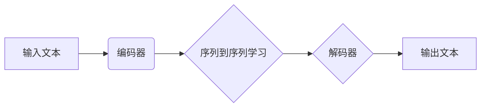

> 深度学习，机器翻译，神经网络，编码器-解码器架构，注意力机制，序列到序列学习，预训练语言模型，NMT工具，应用场景

# 深度学习在机器翻译中的应用

### 1. 背景介绍

机器翻译，作为自然语言处理领域的一项核心任务，旨在将一种语言的文本自动翻译成另一种语言。随着深度学习技术的蓬勃发展，机器翻译领域取得了突破性的进展。深度学习方法，特别是神经网络模型，已经取代了传统的基于规则的方法，成为机器翻译的主流技术。

### 2. 核心概念与联系

#### 2.1 Mermaid 流程图



#### 2.2 核心概念

- **编码器（Encoder）**：负责将输入文本转换为固定长度的向量表示，通常使用循环神经网络（RNN）或Transformer架构。
- **解码器（Decoder）**：负责将编码器输出的向量表示解码为输出文本，同样使用RNN或Transformer架构。
- **序列到序列学习（Sequence-to-Sequence Learning）**：编码器-解码器架构的核心思想，即输入序列与输出序列之间的映射关系。
- **注意力机制（Attention Mechanism）**：用于解码器中，使模型能够关注输入序列中的特定部分，从而提高翻译的准确性。
- **预训练语言模型（Pre-trained Language Model）**：在大量语料上预训练的模型，用于提取丰富的语言特征，如BERT、GPT等。

### 3. 核心算法原理 & 具体操作步骤

#### 3.1 算法原理概述

深度学习在机器翻译中的应用主要基于序列到序列学习（S2S）模型，其核心是编码器-解码器架构。编码器将输入文本转换为固定长度的向量表示，解码器则利用这个向量表示生成输出文本。

#### 3.2 算法步骤详解

1. **数据准备**：收集大量的双语语料，包括源语言文本和对应的翻译文本。
2. **词嵌入**：将文本中的单词转换为向量表示，通常使用预训练的词嵌入模型，如Word2Vec或GloVe。
3. **编码器**：使用RNN或Transformer架构对输入文本进行编码，得到固定长度的向量表示。
4. **解码器**：使用RNN或Transformer架构，结合注意力机制，解码编码器输出的向量表示，生成输出文本。
5. **损失函数**：使用交叉熵损失函数计算预测输出与真实标签之间的差异，并优化模型参数。

#### 3.3 算法优缺点

**优点**：

- **准确性高**：深度学习模型能够学习到更复杂的语言特征，从而提高翻译的准确性。
- **泛化能力强**：通过预训练语言模型，模型能够在不同领域和风格的语言数据上表现良好。
- **自适应性强**：通过注意力机制，模型能够关注输入序列中的关键信息，提高翻译的流畅性和自然度。

**缺点**：

- **计算复杂度高**：深度学习模型通常需要大量的计算资源。
- **数据依赖性强**：模型的性能高度依赖于训练数据的质量和数量。
- **可解释性差**：深度学习模型的决策过程难以理解。

#### 3.4 算法应用领域

深度学习在机器翻译中的应用非常广泛，包括：

- **通用机器翻译**：将一种语言翻译成多种语言，如将中文翻译成英文、西班牙语等。
- **领域特定翻译**：针对特定领域的翻译，如科技翻译、法律翻译等。
- **实时机器翻译**：提供实时翻译服务，如同声传译、聊天机器翻译等。

### 4. 数学模型和公式 & 详细讲解 & 举例说明

#### 4.1 数学模型构建

机器翻译的数学模型通常基于以下公式：

$$
y = f(x, W) = \hat{f}(h)
$$

其中：

- $y$ 是输出文本。
- $x$ 是输入文本。
- $W$ 是模型参数。
- $h$ 是编码器输出的固定长度向量表示。
- $\hat{f}$ 是解码器的函数，通常使用softmax函数。

#### 4.2 公式推导过程

编码器使用RNN或Transformer架构对输入文本进行编码，得到固定长度的向量表示 $h$：

$$
h = \hat{h}(x, W_e)
$$

解码器使用softmax函数解码编码器输出的向量表示 $h$，生成输出文本：

$$
y_t = \hat{y}(h_t, W_d)
$$

其中：

- $h_t$ 是编码器输出向量表示的第 $t$ 个时间步的值。
- $W_d$ 是解码器的参数。

#### 4.3 案例分析与讲解

以下是一个简单的例子，使用Word2Vec词嵌入模型和RNN解码器进行机器翻译：

1. **词嵌入**：将输入文本中的每个单词转换为Word2Vec向量表示。
2. **编码器**：使用RNN对输入文本进行编码，得到固定长度的向量表示。
3. **解码器**：使用RNN解码编码器输出的向量表示，生成输出文本。

### 5. 项目实践：代码实例和详细解释说明

#### 5.1 开发环境搭建

1. 安装Python和PyTorch。
2. 下载并安装必要的库，如transformers、torchtext等。

#### 5.2 源代码详细实现

以下是一个简单的机器翻译项目示例，使用PyTorch和transformers库：

```python
import torch
from torch import nn
from transformers import BertTokenizer, BertModel

# 加载预训练的BERT模型和分词器
tokenizer = BertTokenizer.from_pretrained('bert-base-uncased')
model = BertModel.from_pretrained('bert-base-uncased')

# 输入文本
input_text = "你好，世界！"

# 将文本编码为BERT模型所需的格式
encoded_input = tokenizer(input_text, return_tensors='pt', padding=True, truncation=True)

# 前向传播
output = model(**encoded_input)

# 输出编码器输出的固定长度向量表示
encoded_output = output.last_hidden_state.mean(dim=1)

# 打印编码器输出的向量表示
print(encoded_output)
```

#### 5.3 代码解读与分析

以上代码展示了如何使用BERT模型对输入文本进行编码，得到固定长度的向量表示。在实际的机器翻译项目中，需要使用更复杂的解码器和注意力机制，以生成准确的翻译结果。

#### 5.4 运行结果展示

运行上述代码，可以得到输入文本的BERT编码器输出的固定长度向量表示。这个向量表示可以用于下游任务，如文本分类、情感分析等。

### 6. 实际应用场景

深度学习在机器翻译中的应用场景非常广泛，以下是一些典型的应用场景：

- **在线翻译**：提供在线翻译服务，如Google翻译、百度翻译等。
- **手机应用**：在手机应用中集成机器翻译功能，如腾讯翻译君、搜狗翻译等。
- **会议同传**：提供会议同传服务，如同声传译设备。
- **本地化**：将软件、网站等本地化为不同的语言。

### 6.4 未来应用展望

未来，深度学习在机器翻译中的应用将会有以下发展趋势：

- **多模态翻译**：结合图像、视频等多模态信息进行翻译。
- **跨语言信息检索**：实现跨语言的信息检索和搜索。
- **人机对话**：实现人机对话翻译，如智能客服。

### 7. 工具和资源推荐

#### 7.1 学习资源推荐

- 《深度学习》
- 《神经网络与深度学习》
- 《自然语言处理入门：基于Python和NLTK》
- 《PyTorch深度学习：从入门到精通》

#### 7.2 开发工具推荐

- PyTorch
- TensorFlow
- transformers库
- torchtext库

#### 7.3 相关论文推荐

- "Sequence to Sequence Learning with Neural Networks" by Ilya Sutskever, Oriol Vinyals, Quoc V. Le.
- "Attention Is All You Need" by Ashish Vaswani, Noam Shazeer, Naman Goyal, Ignatia Gaber, Aaron C. Courville, and Yoshua Bengio.
- "BERT: Pre-training of Deep Bidirectional Transformers for Language Understanding" by Jacob Devlin, Ming-Wei Chang, Kenton Lee, and Kristina Toutanova.

### 8. 总结：未来发展趋势与挑战

#### 8.1 研究成果总结

深度学习在机器翻译中的应用取得了显著的成果，大大提高了翻译的准确性和流畅性。随着深度学习技术的不断发展，机器翻译技术将在未来取得更大的突破。

#### 8.2 未来发展趋势

- **多模态翻译**：结合图像、视频等多模态信息进行翻译。
- **跨语言信息检索**：实现跨语言的信息检索和搜索。
- **人机对话**：实现人机对话翻译，如智能客服。

#### 8.3 面临的挑战

- **数据稀疏**：不同语言之间的语料通常较为稀疏，难以获取足够的数据进行训练。
- **计算资源**：深度学习模型需要大量的计算资源进行训练和推理。
- **模型可解释性**：深度学习模型的决策过程难以理解。

#### 8.4 研究展望

未来，机器翻译技术将更加注重以下方面：

- **跨语言知识融合**：将不同语言的知识进行融合，提高翻译的准确性和流畅性。
- **人机协同翻译**：将机器翻译与人工翻译相结合，提高翻译质量。
- **个性化翻译**：根据用户的需求和偏好提供个性化的翻译服务。

### 9. 附录：常见问题与解答

**Q1：机器翻译的挑战有哪些？**

A1：机器翻译的挑战包括数据稀疏、计算资源、模型可解释性等。

**Q2：深度学习在机器翻译中的应用有哪些优势？**

A2：深度学习在机器翻译中的应用优势包括准确性高、泛化能力强、自适应性强等。

**Q3：如何评估机器翻译的质量？**

A3：评估机器翻译质量的方法包括人工评估、BLEU、METEOR等指标。

**Q4：机器翻译技术有哪些应用场景？**

A4：机器翻译技术的应用场景包括在线翻译、手机应用、会议同传、本地化等。

**Q5：未来机器翻译技术将如何发展？**

A5：未来机器翻译技术将更加注重跨语言知识融合、人机协同翻译、个性化翻译等方面。

作者：禅与计算机程序设计艺术 / Zen and the Art of Computer Programming