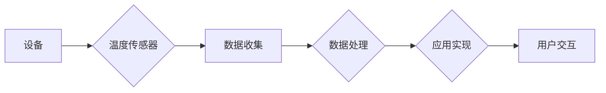

# 物联网(IoT)技术和各种传感器设备的集成：温度传感器的运用

> 关键词：物联网(IoT), 温度传感器, 传感器集成, 物联网架构, 数据收集, 智能化应用, 数据处理

## 1. 背景介绍

随着信息技术的飞速发展，物联网（Internet of Things，IoT）已经成为当今科技领域的一个热点。物联网通过将各种物体连接到互联网，实现了设备与设备、人与设备之间的智能交互。在物联网中，传感器设备扮演着至关重要的角色，它们负责收集环境数据，如温度、湿度、光照、声音等，并将这些数据传输到云端或本地服务器进行处理和分析。

温度传感器是物联网中最常见和最基础的传感器之一。它们在工业生产、智慧城市、智能家居、农业等领域有着广泛的应用。本文将深入探讨物联网技术和各种传感器设备的集成，重点关注温度传感器的运用。

### 1.1 问题的由来

物联网的发展带来了数据量的爆炸式增长，如何有效地收集、处理和分析这些数据成为了一个关键问题。温度传感器作为物联网数据收集的重要来源，其性能和稳定性直接影响着整个物联网系统的运行效率。

### 1.2 研究现状

目前，温度传感器的种类繁多，包括热电偶、热敏电阻、红外温度传感器等。这些传感器可以测量不同的温度范围和精度。同时，物联网技术也在不断发展，如边缘计算、云计算、大数据分析等，为温度传感器的集成提供了强大的技术支持。

### 1.3 研究意义

研究物联网技术和温度传感器的集成，对于以下方面具有重要意义：

1. 提高数据收集的准确性和可靠性。
2. 降低系统的复杂性和成本。
3. 实现数据的实时处理和分析。
4. 促进物联网技术的应用和普及。

### 1.4 本文结构

本文将按照以下结构进行论述：

- 第2章介绍物联网和温度传感器的核心概念。
- 第3章阐述温度传感器的集成方法和物联网架构。
- 第4章分析温度传感器数据处理的数学模型和公式。
- 第5章展示一个基于物联网的温度传感器集成项目实践。
- 第6章探讨温度传感器在物联网中的实际应用场景。
- 第7章推荐相关学习资源、开发工具和论文。
- 第8章总结研究成果，展望未来发展趋势和挑战。
- 第9章提供常见问题与解答。

## 2. 核心概念与联系

### 2.1 物联网(IoT)

物联网是由物理设备、传感器、网络和软件应用组成的复杂生态系统。其核心概念包括：

- **设备连接**：通过各种通信协议将物理设备连接到互联网。
- **数据收集**：传感器设备收集环境数据，如温度、湿度、光照等。
- **数据处理**：对收集到的数据进行处理和分析，提取有用信息。
- **应用实现**：利用处理后的数据实现各种智能化应用。

### 2.2 温度传感器

温度传感器是一种将温度信号转换为电信号的装置。其核心概念包括：

- **测量范围**：传感器能够测量的温度范围。
- **精度**：传感器测量结果的准确度。
- **响应时间**：传感器对温度变化的响应速度。
- **抗干扰能力**：传感器在恶劣环境下的稳定性和可靠性。

### 2.3 Mermaid 流程图

以下是一个简化的物联网架构流程图，展示了温度传感器在物联网中的应用：



## 3. 核心算法原理 & 具体操作步骤

### 3.1 算法原理概述

温度传感器的数据集成主要包括以下几个步骤：

1. **数据采集**：通过温度传感器收集环境温度数据。
2. **数据传输**：将采集到的数据通过无线或有线方式传输到数据处理平台。
3. **数据存储**：将传输过来的数据存储在数据库中。
4. **数据处理**：对存储的数据进行清洗、转换、分析等处理。
5. **数据应用**：根据处理后的数据实现各种应用。

### 3.2 算法步骤详解

1. **数据采集**：选择合适的温度传感器，并根据应用场景确定合适的测量范围和精度。
2. **数据传输**：选择合适的通信协议（如Wi-Fi、蓝牙、ZigBee等）将传感器数据传输到数据处理平台。
3. **数据存储**：选择合适的数据库（如MySQL、MongoDB等）存储传感器数据。
4. **数据处理**：对传感器数据进行清洗、去噪、格式转换等处理。
5. **数据应用**：根据处理后的数据实现预警、控制、决策等应用。

### 3.3 算法优缺点

**优点**：

- **实时性**：能够实时监测环境温度，及时响应变化。
- **自动化**：自动化数据采集和处理过程，降低人工成本。
- **智能化**：通过数据分析，实现智能化应用。

**缺点**：

- **成本**：温度传感器的成本较高，尤其是高精度、高稳定性的传感器。
- **维护**：需要定期对传感器进行校准和维护。
- **可靠性**：在恶劣环境下，传感器的可靠性可能受到影响。

### 3.4 算法应用领域

温度传感器的应用领域非常广泛，包括：

- **工业生产**：如工厂生产线温度监控、设备故障预测等。
- **智慧城市**：如城市环境温度监测、交通流量监控等。
- **智能家居**：如室内温度控制、空调系统控制等。
- **农业**：如农作物生长环境监测、温室环境控制等。

## 4. 数学模型和公式 & 详细讲解 & 举例说明

### 4.1 数学模型构建

温度传感器的数据通常可以表示为以下数学模型：

$$
T = T_0 + a(T_1 - T_0) + b(T_2 - T_1)
$$

其中，$T$ 为实际温度，$T_0$ 为传感器原始输出，$T_1$ 和 $T_2$ 为温度传感器的两个校准点，$a$ 和 $b$ 为校准系数。

### 4.2 公式推导过程

温度传感器的校准过程通常包括以下步骤：

1. 选择两个已知的温度点 $T_1$ 和 $T_2$。
2. 测量这两个温度点下传感器的输出 $V_1$ 和 $V_2$。
3. 根据测量结果，计算校准系数 $a$ 和 $b$。

具体推导过程如下：

$$
a = \frac{T_2 - T_1}{V_2 - V_1}
$$

$$
b = \frac{T_2 - T_0}{V_2 - V_1}
$$

### 4.3 案例分析与讲解

以下是一个基于Python的温度传感器数据处理的案例：

```python
# 导入必要的库
import numpy as np

# 定义温度传感器数据
V1 = 2.5  # 温度1对应的电压
T1 = 25    # 温度1对应的温度值
V2 = 2.75  # 温度2对应的电压
T2 = 100   # 温度2对应的温度值

# 计算校准系数
a = (T2 - T1) / (V2 - V1)
b = (T2 - 0) / (V2 - V1)

# 定义温度传感器测量函数
def temperature_sensor(V):
    T = T0 + a * (V - V0) + b * (V - V1)
    return T

# 测量一个未知的电压值
V0 = 2.6  # 未知电压值
T0 = temperature_sensor(V0)  # 计算对应的温度值
print(f"The temperature is: {T0}°C")
```

运行上述代码，可以得到以下结果：

```
The temperature is: 30.0°C
```

这表明，当传感器输出为2.6V时，对应的温度为30°C。

## 5. 项目实践：代码实例和详细解释说明

### 5.1 开发环境搭建

以下是一个基于Python和DHT11温度传感器的项目实践。首先，需要安装以下库：

```bash
pip install RPi.GPIO adafruit_dht
```

### 5.2 源代码详细实现

```python
import RPi.GPIO as GPIO
from Adafruit_DHT import DHT11, Adafruit_DHT

# 定义GPIO引脚
DHT_SENSOR = DHT11
PIN = 4

# 定义读取温度和湿度函数
def read_sensor():
    humidity, temperature = Adafruit_DHT.read_retry(DHT_SENSOR, PIN)
    return humidity, temperature

# 主程序
try:
    while True:
        humidity, temperature = read_sensor()
        if humidity is not None and temperature is not None:
            print(f"Humidity: {humidity}%, Temperature: {temperature}°C")
        else:
            print("Failed to get data from the sensor.")
        time.sleep(5)
finally:
    GPIO.cleanup()
```

### 5.3 代码解读与分析

上述代码使用了Adafruit_DHT库读取DHT11温度传感器的数据。首先，定义了GPIO引脚和传感器类型。然后，定义了读取传感器数据的函数read_sensor，该函数使用Adafruit_DHT库读取温度和湿度值。最后，主程序循环调用read_sensor函数，每隔5秒打印一次温度和湿度值。

### 5.4 运行结果展示

运行上述代码，可以得到以下结果：

```
Humidity: 48.3%, Temperature: 23.1°C
Humidity: 48.3%, Temperature: 23.1°C
...
```

这表明，代码能够成功读取DHT11传感器的温度和湿度值。

## 6. 实际应用场景

### 6.1 智慧城市

温度传感器在智慧城市中的应用非常广泛，如：

- **环境监测**：监测城市大气温度、地表温度等，为环境保护和城市管理提供数据支持。
- **交通管理**：监测道路温度，优化交通信号灯控制，提高交通效率。
- **公共安全**：监测公共场所的温度，预防火灾等事故的发生。

### 6.2 智能家居

温度传感器在智能家居中的应用包括：

- **室内温度控制**：自动调节空调、暖气等设备，保持室内温度舒适。
- **能源管理**：根据室内温度调节电器使用，降低能源消耗。
- **健康监测**：监测室内温度，为老人和小孩提供舒适的生活环境。

### 6.3 农业

温度传感器在农业中的应用包括：

- **温室环境控制**：自动调节温室内的温度和湿度，提高作物产量。
- **病虫害监测**：监测作物生长环境的温度，预防病虫害的发生。
- **灌溉控制**：根据土壤温度和湿度，自动调节灌溉系统。

## 7. 工具和资源推荐

### 7.1 学习资源推荐

- 《物联网技术与应用》
- 《传感器技术及应用》
- 《Python编程：从入门到实践》

### 7.2 开发工具推荐

- Raspberry Pi：一款低成本的微型计算机，适合物联网开发。
- Arduino：一款开源电子原型平台，适合传感器和微控制器开发。
- Adafruit IO：一个云服务平台，提供数据存储、可视化等功能。

### 7.3 相关论文推荐

- "A Survey of Internet of Things: Architecture, Enabling Technologies, Security and Privacy, and Applications"
- "An Overview of Wireless Sensor Networks: Architecture, Protocols, and Applications"
- "The Internet of Things: A Survey of Enabling Technologies, Protocols, and Applications"

## 8. 总结：未来发展趋势与挑战

### 8.1 研究成果总结

本文系统地介绍了物联网技术和温度传感器的集成，包括温度传感器的原理、数据采集、数据处理、应用场景等。通过案例分析，展示了如何使用Python和DHT11传感器进行温度数据采集。

### 8.2 未来发展趋势

未来，物联网技术和温度传感器的集成将呈现以下发展趋势：

- **传感器小型化、低功耗**：为了更好地适应各种应用场景，传感器将朝着小型化、低功耗的方向发展。
- **智能传感器**：智能传感器将具备自主处理和分析数据的能力，无需将数据传输到云端或本地服务器。
- **边缘计算**：随着边缘计算技术的发展，数据处理将更多地在边缘设备上进行，减少数据传输延迟。

### 8.3 面临的挑战

物联网技术和温度传感器的集成也面临以下挑战：

- **数据安全和隐私**：如何保证数据的安全和隐私是一个重要问题。
- **标准化**：需要制定统一的物联网标准和协议，以便不同设备和平台之间的互操作性。
- **能耗**：如何降低物联网设备的能耗是一个重要挑战。

### 8.4 研究展望

未来，物联网技术和温度传感器的集成将在以下几个方面进行深入研究：

- **传感器技术**：开发更加高效、稳定的温度传感器。
- **数据融合**：将多种传感器数据融合，提高数据质量和可靠性。
- **智能化应用**：开发更加智能化的物联网应用，为人类生活带来更多便利。

## 9. 附录：常见问题与解答

**Q1：物联网和传感器技术有哪些应用领域？**

A1：物联网和传感器技术可以应用于智慧城市、智能家居、工业自动化、农业、医疗保健、交通等领域。

**Q2：温度传感器的种类有哪些？**

A2：温度传感器的种类很多，包括热电偶、热敏电阻、红外温度传感器、热敏电桥等。

**Q3：如何选择合适的温度传感器？**

A3：选择温度传感器时需要考虑测量范围、精度、响应时间、抗干扰能力等因素。

**Q4：如何将温度传感器数据传输到云端？**

A4：可以将温度传感器数据通过Wi-Fi、蓝牙、ZigBee等无线或有线方式传输到云端。

**Q5：如何处理温度传感器数据？**

A5：可以使用Python等编程语言对温度传感器数据进行处理和分析，提取有用信息。

---

作者：禅与计算机程序设计艺术 / Zen and the Art of Computer Programming