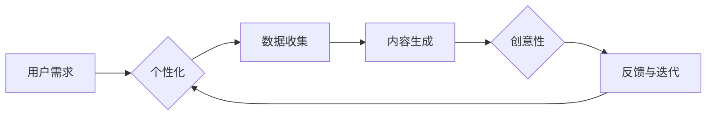

# 生成式AIGC是金矿还是泡沫：第四部分：“让人尖叫”的用户体验

> 关键词：生成式AI，AIGC，用户体验，金矿，泡沫，交互设计，个性化，可解释性，伦理

## 1. 背景介绍

在上一篇文章中，我们探讨了生成式AI（Artificial Intelligence Generated Content，AIGC）的现状和未来趋势，从技术到市场，从伦理到社会影响，全面分析了AIGC的潜在价值和可能带来的风险。在本篇第四部分，我们将聚焦于AIGC的核心——用户体验，深入探讨如何打造“让人尖叫”的AIGC产品。

## 2. 核心概念与联系

### 2.1 生成式AI（AIGC）

生成式AI是一种能够自动生成新内容的人工智能技术，它能够创作音乐、绘画、文本、代码等不同形式的内容。AIGC的核心是算法，它通过学习大量的数据，理解内容的结构和规则，然后生成新的、具有创造性的内容。

### 2.2 用户需求

在AIGC领域，用户需求是多方面的，包括个性化、高效性、创意性、可解释性等。

### 2.3 用户体验

用户体验是指用户在使用产品或服务过程中的感受和体验，它直接影响用户对产品的满意度和忠诚度。

### 2.4 Mermaid流程图



### 2.5 联系

生成式AI通过满足用户的个性化需求，提供创意性的内容生成，最终目标是提升用户体验。

## 3. 核心算法原理 & 具体操作步骤

### 3.1 算法原理概述

生成式AI的算法原理主要包括：

- 预训练：在大量数据上预训练模型，使其具备通用的内容生成能力。
- 个性化：根据用户输入和偏好，调整模型参数，生成个性化的内容。
- 创意性：通过算法创新，使生成的内容具有创意和独特性。

### 3.2 算法步骤详解

1. 数据收集：收集用户输入和偏好数据，以及大量的文本、图像、音乐等生成数据。
2. 模型选择：选择合适的生成模型，如GAN、VAE、Transformer等。
3. 预训练：在收集到的数据上预训练模型，使其具备通用内容生成能力。
4. 个性化调整：根据用户输入和偏好，调整模型参数，生成个性化内容。
5. 创意优化：通过算法创新，优化模型生成的内容，提升创意性。
6. 反馈与迭代：收集用户反馈，持续优化模型和用户体验。

### 3.3 算法优缺点

**优点**：

- 个性化：能够根据用户需求生成个性化的内容。
- 创意性：能够生成具有创意和独特性的内容。
- 高效性：能够快速生成大量内容。

**缺点**：

- 数据需求量大：需要大量高质量的数据进行预训练。
- 模型复杂度高：生成模型通常比较复杂，训练和推理成本较高。
- 可解释性差：生成的内容往往难以解释，用户难以理解生成过程。

### 3.4 算法应用领域

生成式AI在以下领域有广泛的应用：

- 文本生成：如自动写作、机器翻译、对话系统等。
- 图像生成：如艺术创作、游戏开发、虚拟现实等。
- 音乐生成：如创作音乐、制作音效等。

## 4. 数学模型和公式 & 详细讲解 & 举例说明

### 4.1 数学模型构建

生成式AI的数学模型主要包括：

- 概率模型：如GAN、VAE等。
- 序列模型：如RNN、Transformer等。

### 4.2 公式推导过程

以GAN为例，其核心公式如下：

$$
G(z) = \mathcal{D}(G(z)) \sim \mathcal{D}(x)
$$

其中，$G(z)$ 表示生成器，$\mathcal{D}(x)$ 表示鉴别器。

### 4.3 案例分析与讲解

以一个简单的文本生成任务为例，我们使用Transformer模型进行微调。

1. 数据收集：收集大量文本数据，如新闻报道、博客文章等。
2. 数据预处理：将文本数据转换为词向量。
3. 模型选择：选择Transformer模型作为生成模型。
4. 模型训练：在预处理后的数据上训练模型。
5. 生成文本：输入种子文本，使用训练好的模型生成新的文本内容。

## 5. 项目实践：代码实例和详细解释说明

### 5.1 开发环境搭建

1. 安装Python和必要的库：transformers、torch等。
2. 准备数据集：收集文本数据，并进行预处理。
3. 选择模型：选择合适的Transformer模型。
4. 模型训练：在预处理后的数据上训练模型。
5. 生成文本：输入种子文本，使用训练好的模型生成新的文本内容。

### 5.2 源代码详细实现

```python
from transformers import TransformerModel, AdamW
from torch.utils.data import DataLoader
import torch

# ...（省略代码）

# 模型训练
def train(model, data_loader, optimizer, device):
    model.train()
    for data in data_loader:
        input_ids, labels = data['input_ids'], data['labels']
        optimizer.zero_grad()
        outputs = model(input_ids.to(device), labels=labels.to(device))
        loss = outputs.loss
        loss.backward()
        optimizer.step()

# 生成文本
def generate(model, prompt, device):
    model.eval()
    input_ids = tokenizer(prompt, return_tensors='pt').input_ids.to(device)
    with torch.no_grad():
        outputs = model.generate(input_ids, max_length=100)
    return tokenizer.decode(outputs[0])

# ...（省略代码）
```

### 5.3 代码解读与分析

以上代码展示了如何使用Transformer模型进行文本生成。首先，我们定义了模型训练和文本生成的函数。在训练过程中，我们通过优化器更新模型参数，以最小化损失函数。在生成文本时，我们输入种子文本，使用模型生成新的文本内容。

### 5.4 运行结果展示

```python
# ...（省略代码）

# 训练模型
train(model, data_loader, optimizer, device)

# 生成文本
prompt = "The weather today is"
print(generate(model, prompt, device))
```

以上代码展示了如何训练模型并生成文本。训练完成后，我们输入一个种子文本，使用模型生成了一个新的句子。

## 6. 实际应用场景

### 6.1 文本生成

文本生成是AIGC的重要应用场景，如自动写作、机器翻译、对话系统等。

### 6.2 图像生成

图像生成可以应用于艺术创作、游戏开发、虚拟现实等领域。

### 6.3 音乐生成

音乐生成可以用于创作音乐、制作音效等。

## 7. 工具和资源推荐

### 7.1 学习资源推荐

- 《深度学习与自然语言处理》
- 《计算机视觉：算法与应用》
- 《音乐生成与合成》

### 7.2 开发工具推荐

- TensorFlow
- PyTorch
- Hugging Face Transformers

### 7.3 相关论文推荐

- Generative Adversarial Networks
- Variational Autoencoders
- Transformer

## 8. 总结：未来发展趋势与挑战

### 8.1 研究成果总结

AIGC技术已经取得了显著的成果，在文本生成、图像生成、音乐生成等领域都有广泛的应用。

### 8.2 未来发展趋势

- 模型将更加通用，能够生成更多类型的内容。
- 个性化将更加精准，满足用户的个性化需求。
- 可解释性将得到提升，用户能够更好地理解生成过程。
- 伦理问题将得到更多关注，确保AIGC的健康发展。

### 8.3 面临的挑战

- 数据隐私和安全问题。
- 知识产权保护问题。
- 可解释性和透明度问题。
- 伦理和社会影响问题。

### 8.4 研究展望

AIGC技术将不断发展和完善，为人类创造更多价值。未来，AIGC将在更多领域得到应用，推动社会的进步。

## 9. 附录：常见问题与解答

**Q1：什么是AIGC？**

AIGC是一种能够自动生成新内容的人工智能技术，它能够创作音乐、绘画、文本、代码等不同形式的内容。

**Q2：AIGC有哪些应用场景？**

AIGC在文本生成、图像生成、音乐生成等领域有广泛的应用。

**Q3：AIGC面临的挑战有哪些？**

AIGC面临的挑战包括数据隐私和安全问题、知识产权保护问题、可解释性和透明度问题、伦理和社会影响问题等。

**Q4：如何确保AIGC的伦理和社会影响？**

需要从数据、算法、模型设计、应用场景等方面入手，确保AIGC的伦理和社会影响。

**Q5：AIGC的未来发展趋势是什么？**

AIGC技术将不断发展和完善，在更多领域得到应用，推动社会的进步。

作者：禅与计算机程序设计艺术 / Zen and the Art of Computer Programming