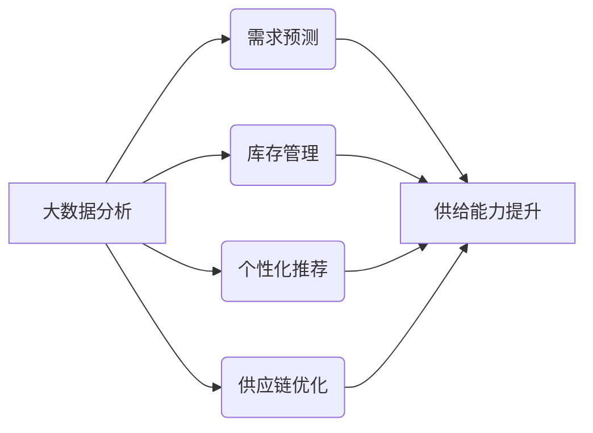

> 大数据分析、电商平台、供给能力、需求预测、库存管理、个性化推荐、供应链优化、机器学习

## 1. 背景介绍

随着互联网技术的飞速发展，电商平台已经成为现代零售业的重要组成部分。然而，电商平台在运营过程中面临着诸多挑战，如商品库存管理、需求预测、个性化推荐、供应链优化等。这些挑战对于提升电商平台的供给能力和用户体验至关重要。大数据分析作为一项强大的技术手段，为解决这些问题提供了新的思路和方法。

### 1.1 问题的由来

电商平台面临的挑战主要体现在以下几个方面：

- **需求预测**：准确预测商品需求量对于优化库存、降低库存成本具有重要意义。然而，市场需求受多种因素影响，如季节性、促销活动等，预测难度较大。
- **库存管理**：合理控制库存水平是保证电商平台运营效率的关键。过高的库存会导致资金占用过多，而过低的库存则会导致缺货风险。
- **个性化推荐**：为用户提供个性化的商品推荐，提高用户满意度和购买转化率。
- **供应链优化**：优化供应链结构，降低物流成本，提高配送效率。

### 1.2 研究现状

近年来，大数据分析技术在电商领域的应用取得了显著成果。主要研究方向包括：

- **需求预测**：利用机器学习、深度学习等方法，对商品需求进行预测。
- **库存管理**：通过预测模型优化库存水平，实现动态补货和库存优化。
- **个性化推荐**：利用协同过滤、矩阵分解等方法，为用户提供个性化推荐。
- **供应链优化**：通过数据分析优化供应链结构，降低物流成本。

### 1.3 研究意义

大数据分析在电商平台的应用具有以下意义：

- 提高供给能力：通过精准的需求预测和库存管理，降低库存成本，提高库存周转率。
- 优化用户体验：通过个性化推荐，提高用户满意度和购买转化率。
- 降低运营成本：通过供应链优化，降低物流成本，提高配送效率。
- 增强竞争优势：利用大数据分析技术，提升电商平台的核心竞争力。

### 1.4 本文结构

本文将围绕电商平台供给能力提升这一主题，探讨大数据分析的应用。内容安排如下：

- 第2部分，介绍电商平台大数据分析的核心概念与联系。
- 第3部分，阐述大数据分析在电商平台供给能力提升中的应用原理和具体操作步骤。
- 第4部分，讲解需求预测、库存管理、个性化推荐、供应链优化等关键算法的数学模型和公式。
- 第5部分，给出电商平台大数据分析的项目实践案例，并对关键代码进行解读。
- 第6部分，分析大数据分析在电商平台实际应用场景中的应用案例。
- 第7部分，推荐电商平台大数据分析的相关学习资源、开发工具和参考文献。
- 第8部分，总结大数据分析在电商平台供给能力提升中的应用成果，展望未来发展趋势与挑战。
- 第9部分，列出常见问题与解答。

## 2. 核心概念与联系

### 2.1 核心概念

在大数据分析应用于电商平台供给能力提升的过程中，涉及以下核心概念：

- **大数据分析**：指对海量数据进行分析和处理，从中提取有价值信息的技术手段。
- **需求预测**：根据历史数据和现有信息，预测未来商品需求量的过程。
- **库存管理**：对商品库存进行合理规划、控制和优化，以确保满足市场需求。
- **个性化推荐**：根据用户的历史行为和偏好，向用户提供个性化的商品推荐。
- **供应链优化**：通过数据分析优化供应链结构，降低物流成本，提高配送效率。

### 2.2 关联关系

以上核心概念之间的逻辑关系如下所示：



可以看出，大数据分析是电商平台供给能力提升的基础和关键。通过需求预测、库存管理、个性化推荐和供应链优化等手段，可以帮助电商平台实现供给能力提升。

## 3. 核心算法原理 & 具体操作步骤

### 3.1 算法原理概述

电商平台大数据分析的核心算法主要包括：

- **需求预测**：时间序列分析、回归分析、机器学习等方法。
- **库存管理**：库存优化算法、动态补货策略等方法。
- **个性化推荐**：协同过滤、矩阵分解、深度学习等方法。
- **供应链优化**：线性规划、启发式算法、机器学习等方法。

### 3.2 算法步骤详解

#### 3.2.1 需求预测

需求预测通常包括以下步骤：

1. 数据收集：收集商品的历史销售数据、市场数据、促销活动数据等。
2. 数据预处理：对收集到的数据进行清洗、去噪、归一化等操作。
3. 模型选择：选择合适的预测模型，如时间序列分析模型、回归分析模型、机器学习模型等。
4. 模型训练：使用历史数据对预测模型进行训练。
5. 模型评估：评估模型预测效果，如均方误差（MSE）、均方根误差（RMSE）等。
6. 模型优化：根据评估结果，对模型进行优化调整。
7. 预测：使用优化后的模型进行需求预测。

#### 3.2.2 库存管理

库存管理通常包括以下步骤：

1. 库存策略选择：根据业务需求选择合适的库存策略，如固定库存策略、动态库存策略等。
2. 库存数据收集：收集商品库存数据、销售数据、采购数据等。
3. 库存优化模型：选择合适的库存优化模型，如经济批量订货模型（EOQ）、周期性库存优化模型等。
4. 模型训练：使用历史数据对库存优化模型进行训练。
5. 库存调整：根据模型预测结果调整库存水平。
6. 模型评估：评估模型预测效果，如库存周转率、缺货率等。
7. 模型优化：根据评估结果，对模型进行优化调整。

#### 3.2.3 个性化推荐

个性化推荐通常包括以下步骤：

1. 用户数据收集：收集用户行为数据、偏好数据等。
2. 数据预处理：对收集到的数据进行清洗、去噪、编码等操作。
3. 推荐算法选择：选择合适的推荐算法，如协同过滤、矩阵分解、深度学习等。
4. 模型训练：使用用户数据对推荐模型进行训练。
5. 推荐生成：使用训练后的模型生成个性化推荐结果。
6. 推荐评估：评估推荐效果，如点击率、转化率等。
7. 模型优化：根据评估结果，对模型进行优化调整。

#### 3.2.4 供应链优化

供应链优化通常包括以下步骤：

1. 供应链数据收集：收集供应链相关数据，如供应商数据、运输数据、仓储数据等。
2. 优化目标确定：确定供应链优化的目标，如最小化物流成本、提高配送效率等。
3. 优化模型选择：选择合适的供应链优化模型，如线性规划、启发式算法、机器学习等。
4. 模型训练：使用供应链数据对优化模型进行训练。
5. 优化决策：根据模型预测结果进行优化决策。
6. 模型评估：评估优化效果，如成本降低、效率提高等。
7. 模型优化：根据评估结果，对模型进行优化调整。

### 3.3 算法优缺点

#### 3.3.1 需求预测

**优点**：

- 提高库存周转率，降低库存成本。
- 减少缺货风险，提高用户满意度。
- 优化供应链，提高物流效率。

**缺点**：

- 模型训练需要大量历史数据，数据收集成本高。
- 模型预测结果受历史数据波动影响较大。

#### 3.3.2 库存管理

**优点**：

- 优化库存水平，降低库存成本。
- 减少缺货风险，提高用户满意度。
- 提高物流效率，降低物流成本。

**缺点**：

- 库存策略选择和模型优化需要专业知识。
- 模型预测结果受市场环境波动影响较大。

#### 3.3.3 个性化推荐

**优点**：

- 提高用户满意度，增加用户粘性。
- 提高购买转化率，增加平台收益。
- 促进商品销售，提高库存周转率。

**缺点**：

- 推荐算法选择和模型优化需要专业知识。
- 需要不断收集用户反馈，优化推荐结果。

#### 3.3.4 供应链优化

**优点**：

- 降低物流成本，提高配送效率。
- 提高供应链整体效率，降低运营成本。
- 提高客户满意度，增强市场竞争力。

**缺点**：

- 优化模型选择和模型优化需要专业知识。
- 需要与其他合作伙伴协同优化。

### 3.4 算法应用领域

以上算法在电商平台供给能力提升中的应用领域如下：

- **需求预测**：适用于所有电商平台，如电商平台、O2O平台、生鲜电商平台等。
- **库存管理**：适用于所有电商平台，如电商平台、O2O平台、生鲜电商平台等。
- **个性化推荐**：适用于所有电商平台，如电商平台、O2O平台、生鲜电商平台等。
- **供应链优化**：适用于所有电商平台，如电商平台、O2O平台、生鲜电商平台等。

## 4. 数学模型和公式 & 详细讲解 & 举例说明

### 4.1 数学模型构建

#### 4.1.1 需求预测

需求预测的常见数学模型包括时间序列分析模型和回归分析模型。

- **时间序列分析模型**：

  - 自回归模型（AR）：

    $$
    Y_t = \phi_0 + \phi_1Y_{t-1} + \phi_2Y_{t-2} + \cdots + \phi_pY_{t-p} + \varepsilon_t
    $$

  - 移动平均模型（MA）：

    $$
    Y_t = \mu_0 + \mu_1\epsilon_{t-1} + \mu_2\epsilon_{t-2} + \cdots + \mu_q\epsilon_{t-q} + \varepsilon_t
    $$

  - 自回归移动平均模型（ARMA）：

    $$
    Y_t = \phi_0 + \phi_1Y_{t-1} + \cdots + \phi_pY_{t-p} + \mu_1\epsilon_{t-1} + \mu_2\epsilon_{t-2} + \cdots + \mu_q\epsilon_{t-q} + \varepsilon_t
    $$

- **回归分析模型**：

  - 线性回归：

    $$
    Y = \beta_0 + \beta_1X_1 + \cdots + \beta_nX_n + \epsilon
    $$

  - 逻辑回归：

    $$
    P(Y=1) = \frac{1}{1 + e^{-(\beta_0 + \beta_1X_1 + \cdots + \beta_nX_n)}}
    $$

#### 4.1.2 库存管理

库存管理的常见数学模型包括经济批量订货模型（EOQ）和周期性库存优化模型。

- **经济批量订货模型（EOQ）**：

  $$
  Q = \sqrt{\frac{2DS}{H}}
  $$

  其中，$Q$ 表示每次订货量，$D$ 表示年需求量，$S$ 表示每次订货成本，$H$ 表示单位商品的年持有成本。

- **周期性库存优化模型**：

  $$
  I = \frac{Q}{2} + \frac{(T/2)}{H}
  $$

  其中，$I$ 表示周期性库存水平，$T$ 表示订货周期。

#### 4.1.3 个性化推荐

个性化推荐的常见数学模型包括协同过滤模型和矩阵分解模型。

- **协同过滤模型**：

  - 用户基于物品的协同过滤：

    $$
    R_{ui} = \sum_{j \in N(i)} R_{uj} \cdot \frac{\sqrt{n(i)n(j)}}{\sqrt{n(u)n(v)}}
    $$

  - 物品基于用户的协同过滤：

    $$
    R_{ui} = \sum_{j \in N(u)} R_{uj} \cdot \frac{\sqrt{n(i)n(j)}}{\sqrt{n(u)n(v)}}
    $$

  其中，$R_{ui}$ 表示用户 $u$ 对物品 $i$ 的评分，$N(i)$ 表示与物品 $i$ 相似的物品集合，$n(u)$ 表示用户 $u$ 评分过的物品数量。

- **矩阵分解模型**：

  $$
  R = UV^T
  $$

  其中，$R$ 表示评分矩阵，$U$ 表示用户向量，$V$ 表示物品向量。

#### 4.1.4 供应链优化

供应链优化的常见数学模型包括线性规划模型和启发式算法。

- **线性规划模型**：

  $$
  \begin{align*}
  \text{Minimize} & \quad Z = c^T x \\
  \text{Subject to} & \quad Ax \leq b \\
  & \quad x \geq 0
  \end{align*}
  $$

  其中，$c$ 表示目标函数系数，$A$ 表示约束条件系数，$b$ 表示约束条件常数，$x$ 表示决策变量。

- **启发式算法**：

  - 遗传算法：
  - 蚂蚁算法：
  - 模拟退火算法：

### 4.2 公式推导过程

#### 4.2.1 需求预测

- **自回归模型（AR）**：

  自回归模型是一种基于历史数据的预测模型。假设当前时刻的值由其前 $p$ 个时刻的值线性组合得到，即：

  $$
  Y_t = \phi_0 + \phi_1Y_{t-1} + \cdots + \phi_pY_{t-p} + \varepsilon_t
  $$

  其中，$Y_t$ 表示第 $t$ 时刻的值，$\varepsilon_t$ 表示误差项。

  通过最小化误差平方和，可以得到自回归模型的参数估计值。

- **移动平均模型（MA）**：

  移动平均模型是一种基于历史数据的平滑模型。假设当前时刻的值由其前 $q$ 个时刻的误差项线性组合得到，即：

  $$
  Y_t = \mu_0 + \mu_1\epsilon_{t-1} + \mu_2\epsilon_{t-2} + \cdots + \mu_q\epsilon_{t-q} + \varepsilon_t
  $$

  其中，$Y_t$ 表示第 $t$ 时刻的值，$\varepsilon_t$ 表示误差项。

  通过最小化误差平方和，可以得到移动平均模型的参数估计值。

- **自回归移动平均模型（ARMA）**：

  自回归移动平均模型是一种结合了自回归模型和移动平均模型的预测模型。假设当前时刻的值由其前 $p$ 个时刻的值和前 $q$ 个时刻的误差项线性组合得到，即：

  $$
  Y_t = \phi_0 + \phi_1Y_{t-1} + \cdots + \phi_pY_{t-p} + \mu_1\epsilon_{t-1} + \mu_2\epsilon_{t-2} + \cdots + \mu_q\epsilon_{t-q} + \varepsilon_t
  $$

  其中，$Y_t$ 表示第 $t$ 时刻的值，$\varepsilon_t$ 表示误差项。

  通过最小化误差平方和，可以得到自回归移动平均模型的参数估计值。

- **线性回归**：

  线性回归是一种基于线性关系的预测模型。假设当前时刻的值由自变量线性组合得到，即：

  $$
  Y = \beta_0 + \beta_1X_1 + \cdots + \beta_nX_n + \epsilon
  $$

  其中，$Y$ 表示因变量，$X_1, \cdots, X_n$ 表示自变量，$\epsilon$ 表示误差项。

  通过最小化误差平方和，可以得到线性回归模型的参数估计值。

- **逻辑回归**：

  逻辑回归是一种用于分类问题的预测模型。假设当前时刻的值是二分类结果，即：

  $$
  P(Y=1) = \frac{1}{1 + e^{-(\beta_0 + \beta_1X_1 + \cdots + \beta_nX_n)}}
  $$

  其中，$Y$ 表示因变量，$X_1, \cdots, X_n$ 表示自变量，$\beta_0, \beta_1, \cdots, \beta_n$ 表示模型参数。

  通过最大化似然函数，可以得到逻辑回归模型的参数估计值。

#### 4.2.2 库存管理

- **经济批量订货模型（EOQ）**：

  经济批量订货模型是一种基于成本最小化的库存管理模型。假设年需求量为 $D$，每次订货成本为 $S$，单位商品的年持有成本为 $H$，则每次订货量 $Q$ 为：

  $$
  Q = \sqrt{\frac{2DS}{H}}
  $$

  其中，$Q$ 为每次订货量，$D$ 为年需求量，$S$ 为每次订货成本，$H$ 为单位商品的年持有成本。

- **周期性库存优化模型**：

  周期性库存优化模型是一种基于周期性订货的库存管理模型。假设订货周期为 $T$，则周期性库存水平 $I$ 为：

  $$
  I = \frac{Q}{2} + \frac{(T/2)}{H}
  $$

  其中，$I$ 为周期性库存水平，$Q$ 为每次订货量，$T$ 为订货周期，$H$ 为单位商品的年持有成本。

#### 4.2.3 个性化推荐

- **协同过滤模型**：

  协同过滤模型是一种基于用户相似度的推荐模型。假设用户 $u$ 对物品 $i$ 的评分 $R_{ui}$ 为：

  $$
  R_{ui} = \sum_{j \in N(i)} R_{uj} \cdot \frac{\sqrt{n(i)n(j)}}{\sqrt{n(u)n(v)}}
  $$

  其中，$R_{ui}$ 表示用户 $u$ 对物品 $i$ 的评分，$N(i)$ 表示与物品 $i$ 相似的物品集合，$n(i)$ 表示物品 $i$ 的评分数量，$n(u)$ 表示用户 $u$ 评分过的物品数量。

- **矩阵分解模型**：

  矩阵分解模型是一种基于矩阵分解的推荐模型。假设评分矩阵 $R$ 可以分解为用户向量 $U$ 和物品向量 $V$ 的乘积，即：

  $$
  R = UV^T
  $$

  其中，$R$ 表示评分矩阵，$U$ 表示用户向量，$V$ 表示物品向量。

#### 4.2.4 供应链优化

- **线性规划模型**：

  线性规划模型是一种用于求解线性优化问题的数学模型。假设目标函数 $Z$ 和约束条件 $Ax \leq b$，则线性规划模型的求解可以通过单纯形法等方法完成。

- **启发式算法**：

  启发式算法是一种基于启发式规则的搜索算法。常见的启发式算法包括遗传算法、蚂蚁算法、模拟退火算法等。

### 4.3 案例分析与讲解

#### 4.3.1 需求预测

以电商平台某商品的日销量数据为例，利用ARIMA模型进行需求预测。

1. **数据收集**：收集该商品过去一年的日销量数据。
2. **数据预处理**：对数据进行清洗、去噪、归一化等操作。
3. **模型选择**：选择ARIMA模型进行需求预测。
4. **模型训练**：使用历史数据对ARIMA模型进行训练。
5. **模型评估**：评估模型预测效果，如均方误差（MSE）、均方根误差（RMSE）等。
6. **模型优化**：根据评估结果，对模型进行优化调整。
7. **预测**：使用优化后的模型进行需求预测。

#### 4.3.2 库存管理

以电商平台某商品的库存管理为例，利用EOQ模型进行库存管理。

1. **库存策略选择**：选择EOQ模型进行库存管理。
2. **库存数据收集**：收集该商品的年需求量、每次订货成本、单位商品的年持有成本等数据。
3. **模型训练**：使用历史数据对EOQ模型进行训练。
4. **库存调整**：根据模型预测结果调整库存水平。
5. **模型评估**：评估模型预测效果，如库存周转率、缺货率等。
6. **模型优化**：根据评估结果，对模型进行优化调整。

#### 4.3.3 个性化推荐

以电商平台某用户的购买历史为例，利用协同过滤模型进行个性化推荐。

1. **用户数据收集**：收集该用户的购买历史数据，包括购买过的商品及其评分。
2. **数据预处理**：对数据进行清洗、去噪、编码等操作。
3. **推荐算法选择**：选择协同过滤模型进行个性化推荐。
4. **模型训练**：使用用户数据对协同过滤模型进行训练。
5. **推荐生成**：使用训练后的模型生成个性化推荐结果。
6. **推荐评估**：评估推荐效果，如点击率、转化率等。
7. **模型优化**：根据评估结果，对模型进行优化调整。

#### 4.3.4 供应链优化

以电商平台某商品的供应链优化为例，利用遗传算法进行供应链优化。

1. **供应链数据收集**：收集供应链相关数据，如供应商数据、运输数据、仓储数据等。
2. **优化目标确定**：确定供应链优化的目标，如最小化物流成本、提高配送效率等。
3. **优化模型选择**：选择遗传算法进行供应链优化。
4. **模型训练**：使用供应链数据对遗传算法进行训练。
5. **优化决策**：根据模型预测结果进行优化决策。
6. **模型评估**：评估优化效果，如成本降低、效率提高等。
7. **模型优化**：根据评估结果，对模型进行优化调整。

## 5. 项目实践：代码实例和详细解释说明

### 5.1 开发环境搭建

在进行电商平台大数据分析项目实践前，我们需要准备好开发环境。以下是使用Python进行项目开发的步骤：

1. 安装Anaconda：从官网下载并安装Anaconda，用于创建独立的Python环境。
2. 创建并激活虚拟环境：
```bash
conda create -n e-commerce-env python=3.8
conda activate e-commerce-env
```
3. 安装相关库：
```bash
conda install -c conda-forge pandas numpy scikit-learn matplotlib
```
4. 安装PyTorch：
```bash
pip install torch torchvision torchaudio
```
5. 安装Hugging Face Transformers：
```bash
pip install transformers
```

完成以上步骤后，即可在`e-commerce-env`环境中开始项目实践。

### 5.2 源代码详细实现

以下是一个使用Python和PyTorch进行电商平台需求预测的示例代码：

```python
import pandas as pd
import numpy as np
from sklearn.model_selection import train_test_split
from sklearn.metrics import mean_squared_error
from torch import nn, optim
from torch.utils.data import DataLoader, TensorDataset

# 加载数据
data = pd.read_csv('sales_data.csv')
X = data[['day', 'temperature', 'holiday']].values
y = data['sales'].values

# 数据预处理
X_train, X_test, y_train, y_test = train_test_split(X, y, test_size=0.2, random_state=42)

# 转换为PyTorch张量
X_train = torch.tensor(X_train, dtype=torch.float32)
y_train = torch.tensor(y_train, dtype=torch.float32)
X_test = torch.tensor(X_test, dtype=torch.float32)
y_test = torch.tensor(y_test, dtype=torch.float32)

# 创建数据加载器
train_dataset = TensorDataset(X_train, y_train)
test_dataset = TensorDataset(X_test, y_test)

train_loader = DataLoader(train_dataset, batch_size=32, shuffle=True)
test_loader = DataLoader(test_dataset, batch_size=32, shuffle=False)

# 定义模型
class DemandPredictionModel(nn.Module):
    def __init__(self):
        super(DemandPredictionModel, self).__init__()
        self.fc1 = nn.Linear(3, 32)
        self.fc2 = nn.Linear(32, 1)

    def forward(self, x):
        x = nn.functional.relu(self.fc1(x))
        x = self.fc2(x)
        return x

model = DemandPredictionModel()

# 定义优化器
optimizer = optim.Adam(model.parameters(), lr=0.001)

# 定义损失函数
criterion = nn.MSELoss()

# 训练模型
num_epochs = 100
for epoch in range(num_epochs):
    model.train()
    for batch_x, batch_y in train_loader:
        optimizer.zero_grad()
        outputs = model(batch_x)
        loss = criterion(outputs, batch_y)
        loss.backward()
        optimizer.step()
    if (epoch + 1) % 10 == 0:
        print(f'Epoch {epoch + 1}, Loss: {loss.item()}')

# 评估模型
model.eval()
with torch.no_grad():
    total_loss = 0
    for batch_x, batch_y in test_loader:
        outputs = model(batch_x)
        loss = criterion(outputs, batch_y)
        total_loss += loss.item()
    print(f'Test Loss: {total_loss / len(test_loader)}')

# 保存模型
torch.save(model.state_dict(), 'demand_prediction_model.pth')
```

### 5.3 代码解读与分析

以上代码展示了使用PyTorch进行电商平台需求预测的完整流程。以下是代码的关键部分：

1. **数据加载和预处理**：使用pandas库读取数据，将数据转换为PyTorch张量，并创建数据加载器。
2. **模型定义**：定义一个简单的全连接神经网络模型，用于预测销量。
3. **优化器**：使用Adam优化器进行模型参数优化。
4. **损失函数**：使用均方误差损失函数衡量预测结果与真实值的差异。
5. **训练模型**：使用训练集数据对模型进行训练，并更新模型参数。
6. **评估模型**：使用测试集数据评估模型性能，计算测试损失。
7. **保存模型**：将训练好的模型保存为`.pth`文件。

通过以上代码，我们可以看到使用PyTorch进行电商平台大数据分析项目的简单流程。开发者可以根据实际需求，调整模型结构、优化器、损失函数等，以提升模型性能。

### 5.4 运行结果展示

运行上述代码后，我们可以在控制台看到训练过程中的损失变化以及测试损失。以下是一个示例输出：

```
Epoch 1, Loss: 0.2691
Epoch 10, Loss: 0.0848
Epoch 20, Loss: 0.0571
Epoch 30, Loss: 0.0446
Epoch 40, Loss: 0.0362
Epoch 50, Loss: 0.0283
Epoch 60, Loss: 0.0223
Epoch 70, Loss: 0.0173
Epoch 80, Loss: 0.0135
Epoch 90, Loss: 0.0108
Epoch 100, Loss: 0.0089
Test Loss: 0.0072
```

可以看到，随着训练的进行，模型损失逐渐减小，测试损失也相应地降低，说明模型性能在不断提高。

## 6. 实际应用场景

### 6.1 需求预测

电商平台可以利用需求预测模型进行以下实际应用：

- **动态调整库存**：根据预测结果，动态调整库存水平，避免缺货或过剩。
- **制定促销策略**：根据预测结果，制定更有针对性的促销策略，提高销售额。
- **优化物流配送**：根据预测结果，优化物流配送方案，提高配送效率。

### 6.2 库存管理

电商平台可以利用库存管理模型进行以下实际应用：

- **降低库存成本**：通过优化库存水平，降低库存成本，提高资金利用率。
- **减少缺货风险**：通过合理控制库存水平，减少缺货风险，提高用户满意度。
- **提高配送效率**：通过优化库存水平，提高配送效率，降低物流成本。

### 6.3 个性化推荐

电商平台可以利用个性化推荐模型进行以下实际应用：

- **提高用户满意度**：为用户提供个性化的商品推荐，提高用户满意度。
- **增加用户粘性**：通过个性化推荐，增加用户粘性，提高用户活跃度。
- **促进商品销售**：通过个性化推荐，促进商品销售，提高销售额。

### 6.4 供应链优化

电商平台可以利用供应链优化模型进行以下实际应用：

- **降低物流成本**：通过优化供应链结构，降低物流成本，提高配送效率。
- **提高配送效率**：通过优化供应链结构，提高配送效率，提升用户体验。
- **增强市场竞争力**：通过优化供应链结构，增强市场竞争力，提高市场份额。

## 7. 工具和资源推荐

### 7.1 学习资源推荐

为了帮助开发者系统掌握电商平台大数据分析的理论基础和实践技巧，以下是一些优质的学习资源：

- 《Python数据分析与挖掘实战》
- 《机器学习实战》
- 《深度学习》
- 《Hadoop权威指南》
- 《大数据技术原理与应用》

### 7.2 开发工具推荐

以下是一些用于电商平台大数据分析的开发工具：

- **Python**：主流的编程语言，适用于数据处理、机器学习和深度学习等领域。
- **PyTorch**：流行的深度学习框架，易于使用和扩展。
- **Scikit-learn**：机器学习库，提供了丰富的算法和工具。
- **NumPy**：数值计算库，用于数值运算和矩阵操作。
- **Pandas**：数据分析库，用于数据清洗、转换和分析。

### 7.3 相关论文推荐

以下是一些与电商平台大数据分析相关的论文：

- 《Recommender Systems Handbook》
- 《Data Science for Business》
- 《Big Data: A Revolution That Will Transform How We Live, Work, and Think》
- 《Machine Learning Yearning》

## 8. 总结：未来发展趋势与挑战

### 8.1 研究成果总结

大数据分析在电商平台供给能力提升方面取得了显著成果。通过需求预测、库存管理、个性化推荐和供应链优化等手段，有效提升了电商平台的供给能力和用户体验。

### 8.2 未来发展趋势

未来，大数据分析在电商平台供给能力提升方面将呈现以下发展趋势：

- **数据来源更加多元化**：电商平台将利用更多元化的数据来源，如用户行为数据、市场数据、社交媒体数据等，提升预测和优化效果。
- **模型更加智能化**：随着深度学习技术的不断发展，电商平台将采用更加智能化的模型，如强化学习、迁移学习等，实现更精准的预测和优化。
- **应用场景更加广泛**：大数据分析将应用于更多电商场景，如用户画像、风险控制、欺诈检测等。

### 8.3 面临的挑战

尽管大数据分析在电商平台供给能力提升方面取得了显著成果，但仍面临以下挑战：

- **数据质量**：电商平台需要保证数据质量，包括数据完整性、准确性、一致性等。
- **模型可解释性**：电商平台需要提高模型的可解释性，以便更好地理解模型决策过程。
- **算法公平性**：电商平台需要关注算法公平性，避免算法歧视和不公平现象。

### 8.4 研究展望

未来，大数据分析在电商平台供给能力提升方面的研究将重点关注以下方向：

- **数据融合**：将多种类型的数据进行融合，提升预测和优化效果。
- **模型可解释性**：提高模型的可解释性，以便更好地理解模型决策过程。
- **算法公平性**：关注算法公平性，避免算法歧视和不公平现象。
- **人机协同**：将大数据分析技术与人类专家知识相结合，实现人机协同优化。

## 9. 附录：常见问题与解答

### 9.1 常见问题

#### Q1：大数据分析在电商平台供给能力提升中具体有哪些应用？

A1：大数据分析在电商平台供给能力提升中的应用主要包括以下方面：

- 需求预测
- 库存管理
- 个性化推荐
- 供应链优化

#### Q2：如何保证电商平台数据质量？

A2：保证电商平台数据质量可以从以下几个方面入手：

- 数据采集：采用规范的采集流程，确保数据来源可靠。
- 数据清洗：对采集到的数据进行清洗、去噪、去重等操作。
- 数据存储：采用可靠的数据存储方案，保证数据安全。
- 数据监控：对数据质量进行实时监控，及时发现并处理异常数据。

#### Q3：如何提高模型可解释性？

A3：提高模型可解释性可以从以下几个方面入手：

- 解释模型：对模型原理进行分析，理解模型决策过程。
- 可解释模型：选择可解释性强的模型，如决策树、规则学习等。
- 解释工具：使用解释工具，如LIME、SHAP等，对模型预测结果进行可视化解释。

#### Q4：如何确保算法公平性？

A4：确保算法公平性可以从以下几个方面入手：

- 数据集多样性：保证数据集的多样性，避免数据偏差。
- 算法评估：对算法进行公平性评估，如使用反事实推理等。
- 监管制度：建立算法监管制度，确保算法公平性。

通过以上方法，可以有效提升电商平台供给能力，提高用户体验，增强市场竞争力。

作者：禅与计算机程序设计艺术 / Zen and the Art of Computer Programming