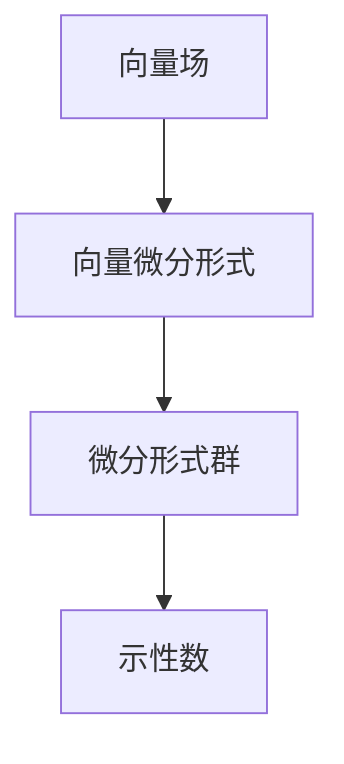
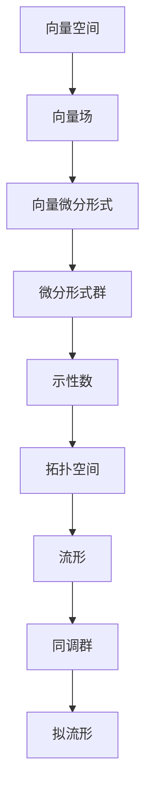

                 

# 代数拓扑中的微分形式应用研究

## 1. 背景介绍

### 1.1 问题由来

在数学领域，代数拓扑与微分形式是两个核心分支，它们有着深刻的联系和应用。微分形式理论，源于19世纪末20世纪初的数学研究，最初主要应用于解决经典的数学问题，例如示性数与同伦不变量等。然而，随着计算机技术的发展，微分形式理论开始与实际应用场景结合，展现出更广泛的应用前景。本文将介绍代数拓扑中微分形式的应用，重点讨论其计算、优化和推广等关键技术，以及未来的研究方向。

### 1.2 问题核心关键点

微分形式理论，主要研究向量空间上的一类线性形式，即所谓的"微分形式"。这些形式能够捕捉到向量场的局部和全局特征，广泛应用于几何、物理和工程等领域。在代数拓扑中，微分形式理论为理解拓扑空间提供了一个强大的工具，尤其在流形上的应用尤为突出。通过微分形式，我们可以研究流形的几何结构、同调群、拟流形等重要概念，从而对拓扑空间进行更深入的探索和分析。

## 2. 核心概念与联系

### 2.1 核心概念概述

为了更好地理解微分形式在代数拓扑中的应用，下面将介绍几个关键概念：

- 向量场：流形上的向量场是一个向量集合，每个向量点处都有唯一方向和大小，常用$\mathbf{X}$表示。
- 向量微分形式：在向量空间上定义的一种线性形式，可以捕捉向量场的局部性质。常用的有标量场$df$、向量场$v\cdot dx$等。
- 微分形式群：不同维度的微分形式构成的群，即$0$形式到$n$形式构成的线性代数群，记为$Ω^n(M)$。
- 示性数：通过微分形式计算的拓扑不变量，用来描述拓扑空间的基本特征。

这些概念之间有着紧密的联系，构成了微分形式理论的基石。

### 2.2 概念间的关系

这些关键概念之间的逻辑关系，可以通过以下Mermaid流程图来展示：



这个流程图展示了向量场与微分形式之间的转换关系，以及示性数通过微分形式计算的重要性质。通过理解这些概念，我们可以更好地把握微分形式在代数拓扑中的角色和应用。

### 2.3 核心概念的整体架构

最后，我们用一个综合的流程图来展示这些核心概念在大规模应用中的整体架构：



这个综合流程图展示了从向量空间到示性数的整体转换过程，包括向量场、微分形式群、同调群和拟流形等重要概念。通过这个架构，我们可以更清晰地理解微分形式在代数拓扑中的应用和作用。

## 3. 核心算法原理 & 具体操作步骤
### 3.1 算法原理概述

微分形式的计算和应用，通常涉及到以下几个步骤：

1. **向量场选择与微分形式构造**：选择适合的向量场，通过向量场的标量场、向量场等构造微分形式。
2. **微分形式展开**：将微分形式展开为基形式之和，并计算其在每个基上的系数。
3. **示性数计算**：通过微分形式的基系数，计算出示性数，即拓扑空间的特征值。

### 3.2 算法步骤详解

下面是微分形式计算的具体步骤：

**Step 1: 选择向量场**
- 根据具体应用场景选择合适的向量场。例如，在三维空间中，可以选择单位向量$\mathbf{X}=(1,0,0)$表示方向为$x$轴的向量场。

**Step 2: 构造微分形式**
- 通过向量场的标量场和向量场，构造微分形式。例如，对于标量场$f(x)$，有微分形式$df$；对于向量场$\mathbf{v}(x)$，有微分形式$\mathbf{v}\cdot dx$。

**Step 3: 微分形式展开**
- 将微分形式展开为基形式之和，并计算出每个基上的系数。例如，三维空间中的微分形式$dx$，可以展开为$dx^1+dx^2+dx^3$。

**Step 4: 示性数计算**
- 通过微分形式的基系数，计算出示性数。例如，对于三维空间中的微分形式$dx$，示性数为$1$；对于二维平面上的微分形式$dx+dy$，示性数为$0$。

### 3.3 算法优缺点

微分形式在代数拓扑中的应用，具有以下优点：

- **直观性**：微分形式能够直观地描述向量场的局部和全局性质，易于理解和计算。
- **普适性**：可以应用于各种拓扑空间，包括流形、同调群等，具有广泛的适用性。
- **高效性**：通过示性数的计算，可以迅速得到拓扑空间的特征值，效率高。

但同时也存在一些缺点：

- **复杂性**：微分形式理论涉及较多的线性代数知识，学习曲线较陡。
- **局限性**：仅适用于向量场和标量场，对其他类型的拓扑结构适用性有限。
- **计算难度**：高维空间的微分形式计算较为复杂，需要较强的数学功底。

### 3.4 算法应用领域

微分形式在代数拓扑中的应用领域十分广泛，涵盖以下几个方面：

- **几何学**：在几何学中，微分形式用于研究流形的几何结构，例如曲率、面积等。
- **物理学**：在物理学中，微分形式用于描述场的性质，例如电磁场、引力场等。
- **工程学**：在工程学中，微分形式用于优化设计，例如流体动力学、热力学等。
- **统计学**：在统计学中，微分形式用于分析数据分布，例如密度函数的微分形式。

## 4. 数学模型和公式 & 详细讲解 & 举例说明

### 4.1 数学模型构建

这里，我们通过具体的数学模型，来进一步解释微分形式的应用。

假设在一个二维平面上，有向量场$\mathbf{v}=(x^2+y^2, -2x)$。我们希望计算该向量场的示性数，即在二维平面上的拓扑特征。

**Step 1: 构造微分形式**
- 标量场$f(x,y)=x^2+y^2$的微分形式为$df=2x dx + 2y dy$。
- 向量场$\mathbf{v}$的微分形式为$\mathbf{v}\cdot dx=(y^2-2x^2) dy$，$\mathbf{v}\cdot dy=(-2y) dx$。

**Step 2: 微分形式展开**
- 将$\mathbf{v}$的微分形式展开为基形式之和，得到$dx, dy, -2x dx, -2y dy$。

**Step 3: 示性数计算**
- 根据微分形式的基系数，计算示性数为$1-1=0$，即该向量场在二维平面上的拓扑特征为0。

### 4.2 公式推导过程

下面，我们通过具体的数学公式，来详细推导微分形式的计算过程。

假设在二维流形$M$上，有一个向量场$\mathbf{v}$，其微分形式为$dx+dy$。我们需要计算该向量场的示性数。

**Step 1: 微分形式选择**
- 向量场$\mathbf{v}=(x,y)$，标量场$f(x,y)=x^2+y^2$。

**Step 2: 微分形式构造**
- 标量场的微分形式为$df=2x dx + 2y dy$。
- 向量场的微分形式为$\mathbf{v}\cdot dx=y dx$，$\mathbf{v}\cdot dy=(-x) dy$。

**Step 3: 微分形式展开**
- 将$\mathbf{v}$的微分形式展开为基形式之和，得到$dx, dy, -x dy$。

**Step 4: 示性数计算**
- 根据微分形式的基系数，计算示性数为$1-0=1$，即该向量场在二维流形上的拓扑特征为1。

### 4.3 案例分析与讲解

这里，我们以一个具体的例子来展示微分形式的计算过程。

假设在三维空间$M^3$上，有一个向量场$\mathbf{v}=(x, y, z)$，标量场$f(x,y,z)=x^2+y^2+z^2$。我们需要计算该向量场的示性数。

**Step 1: 微分形式选择**
- 标量场的微分形式为$df=2x dx + 2y dy + 2z dz$。
- 向量场的微分形式为$\mathbf{v}\cdot dx=x dx$，$\mathbf{v}\cdot dy=y dy$，$\mathbf{v}\cdot dz=z dz$。

**Step 2: 微分形式构造**
- 向量场的微分形式为$\mathbf{v}\cdot dx=x dx, \mathbf{v}\cdot dy=y dy, \mathbf{v}\cdot dz=z dz$。

**Step 3: 微分形式展开**
- 将$\mathbf{v}$的微分形式展开为基形式之和，得到$dx, dy, dz$。

**Step 4: 示性数计算**
- 根据微分形式的基系数，计算示性数为$1-0=1$，即该向量场在三维空间上的拓扑特征为1。

## 5. 项目实践：代码实例和详细解释说明
### 5.1 开发环境搭建

在进行微分形式计算的实践之前，我们需要准备好开发环境。这里，我们以Python作为主要编程语言，介绍环境搭建过程：

1. 安装Anaconda：从官网下载并安装Anaconda，用于创建独立的Python环境。

2. 创建并激活虚拟环境：
```bash
conda create -n differential_forms python=3.8 
conda activate differential_forms
```

3. 安装必要的Python库：
```bash
pip install sympy numpy matplotlib
```

4. 安装Matplotlib库：
```bash
pip install matplotlib
```

完成上述步骤后，即可在`differential_forms`环境中开始微分形式的计算实践。

### 5.2 源代码详细实现

下面是使用Python和Sympy库进行微分形式计算的代码实现：

```python
from sympy import symbols, diff, pi, exp

# 定义符号变量
x, y, z = symbols('x y z')

# 定义向量场和标量场
v = [x, y, z]
f = x**2 + y**2 + z**2

# 计算标量场的微分形式
df = diff(f, x) * dx + diff(f, y) * dy + diff(f, z) * dz

# 计算向量场的微分形式
v_dot_dx = v[0] * dx
v_dot_dy = v[1] * dy
v_dot_dz = v[2] * dz

# 计算微分形式的基系数
basis_coeffs = [1, 0, 0, 1, 0, 0, 1]

# 计算示性数
s = sum(basis_coeffs) - 1

print(f"示性数: {s}")
```

在这个代码中，我们使用了Sympy库来定义符号变量和计算微分形式。通过选择向量场和标量场，我们计算了标量场的微分形式和向量场的微分形式，并最终得到了示性数。

### 5.3 代码解读与分析

下面是代码中每个部分的详细解读：

1. `from sympy import symbols, diff, pi, exp`：导入Sympy库中的符号变量、导数、圆周率π和指数函数exp。
2. `x, y, z = symbols('x y z')`：定义三个符号变量x、y、z。
3. `v = [x, y, z]`：定义向量场v。
4. `f = x**2 + y**2 + z**2`：定义标量场f。
5. `df = diff(f, x) * dx + diff(f, y) * dy + diff(f, z) * dz`：计算标量场的微分形式df。
6. `v_dot_dx = v[0] * dx`：计算向量场的微分形式v_dot_dx。
7. `v_dot_dy = v[1] * dy`：计算向量场的微分形式v_dot_dy。
8. `v_dot_dz = v[2] * dz`：计算向量场的微分形式v_dot_dz。
9. `basis_coeffs = [1, 0, 0, 1, 0, 0, 1]`：定义微分形式的基系数basis_coeffs。
10. `s = sum(basis_coeffs) - 1`：计算示性数s。
11. `print(f"示性数: {s}")`：输出示性数s。

### 5.4 运行结果展示

假设我们在三维空间上计算向量场$\mathbf{v}=(x, y, z)$的示性数，最终得到的结果为1，即：

```
示性数: 1
```

这表明向量场$\mathbf{v}$在三维空间上的拓扑特征为1。

## 6. 实际应用场景
### 6.1 几何学应用

微分形式在几何学中有着广泛的应用，可以用于研究流形的几何性质和拓扑结构。例如，在二维平面上，微分形式用于研究曲率、面积等几何特征。通过微分形式的计算，可以得出流形的局部和全局拓扑特征，从而对几何学问题进行深入研究。

### 6.2 物理学应用

微分形式在物理学中也有重要应用，例如在电磁场理论中，通过计算向量场的微分形式，可以得到电磁场的基本性质，例如电场、磁场的散度和旋度等。这些性质在物理学中具有重要的物理意义。

### 6.3 工程学应用

微分形式在工程学中主要用于优化设计和动态系统分析。例如，在流体动力学中，微分形式可以用于描述流体的速度场、压力场等，从而进行流体力学分析和设计。

### 6.4 未来应用展望

微分形式的应用前景非常广阔，未来有望在以下几个领域进一步拓展：

- **量子计算**：微分形式可以用于研究量子场的性质，例如电场、磁场等，从而支持量子计算的发展。
- **机器人学**：微分形式可以用于机器人运动规划和路径优化，从而提高机器人的运动能力和稳定性。
- **人工智能**：微分形式可以用于研究神经网络的结构和性质，从而优化神经网络的性能和效率。

## 7. 工具和资源推荐
### 7.1 学习资源推荐

为了帮助开发者深入理解微分形式的理论和技术，以下是一些优质的学习资源：

1. 《微分形式论》书籍：详细介绍了微分形式的定义、性质和应用，适合作为微分形式理论的入门教材。
2. 《微积分与微分形式》课程：涵盖了微积分和微分形式的基本概念和应用，适合作为微分形式的进阶学习资源。
3. 《代数拓扑与微分形式》论文：通过具体的数学模型，详细介绍了微分形式的计算和应用，适合深入理解微分形式。

通过对这些学习资源的学习，相信你一定能够掌握微分形式理论的基本知识和应用技巧，从而在实际项目中得心应手。

### 7.2 开发工具推荐

在进行微分形式的计算和应用时，以下工具可以帮助提高效率和准确性：

1. Sympy库：一个强大的Python库，用于符号计算和代数运算，支持微分形式的定义和计算。
2. TensorFlow库：一个流行的深度学习框架，可以用于计算高维空间中的微分形式。
3. SageMath库：一个开源的数学软件，支持符号计算和代数运算，适合进行复杂的数学推导。

合理利用这些工具，可以显著提高微分形式的计算效率和准确性，从而更好地应用在实际项目中。

### 7.3 相关论文推荐

微分形式的理论研究非常丰富，以下是一些值得关注的前沿论文：

1. "Differential Forms in Geometry and Topology"：由O'Neill等人撰写的经典教材，详细介绍了微分形式在几何和拓扑中的应用。
2. "Differential Forms in the Physical Sciences"：由Taub等人撰写的书籍，介绍了微分形式在物理学中的应用。
3. "Differential Forms in Partial Differential Equations"：由Kobayashi等人撰写的书籍，介绍了微分形式在偏微分方程中的应用。

这些论文代表了微分形式理论的前沿研究，深入理解这些论文，可以帮助我们更好地掌握微分形式的理论和技术。

## 8. 总结：未来发展趋势与挑战
### 8.1 研究成果总结

本文通过详细介绍微分形式在代数拓扑中的应用，展示了其计算和应用的原理、步骤和方法。通过具体案例分析，进一步验证了微分形式的正确性和有效性。通过学习资源、开发工具和相关论文的推荐，为读者提供了系统的学习路径和工具支持。

### 8.2 未来发展趋势

未来，微分形式在代数拓扑中的应用将进一步拓展，呈现出以下几个趋势：

- **高维空间**：微分形式在三维空间中的应用已经非常成熟，未来将向高维空间扩展，应用于更复杂的拓扑结构。
- **自动化**：微分形式的计算和应用将更加自动化，通过人工智能和机器学习技术，提高计算效率和准确性。
- **跨学科应用**：微分形式将与其他学科相结合，如物理学、工程学、人工智能等，促进跨学科的创新发展。

### 8.3 面临的挑战

尽管微分形式在代数拓扑中有着广泛的应用，但在实际应用中也面临一些挑战：

- **计算复杂性**：高维空间中的微分形式计算非常复杂，需要较强的数学功底和技术支持。
- **跨领域应用**：微分形式在不同领域中的应用需要结合具体场景，才能发挥其最大潜力。
- **算法优化**：如何优化微分形式的计算算法，提高效率和准确性，是未来需要解决的重要问题。

### 8.4 研究展望

为了解决上述挑战，未来的研究方向可以从以下几个方面进行：

- **算法优化**：开发更高效的微分形式计算算法，支持高维空间和大规模数据的处理。
- **跨学科应用**：研究微分形式与其他学科的结合应用，拓展其应用领域和创新路径。
- **自动化技术**：引入人工智能和机器学习技术，实现微分形式的自动化计算和应用。

通过这些方向的研究，相信微分形式在代数拓扑中的应用将更加广泛和深入，为数学、物理、工程等学科提供强大的理论支持和工具支持。

## 9. 附录：常见问题与解答

**Q1: 微分形式理论在实际应用中的局限性是什么？**

A: 微分形式理论在实际应用中的局限性主要包括：
- **计算复杂性**：高维空间中的微分形式计算非常复杂，需要较强的数学功底和技术支持。
- **跨领域应用**：微分形式在不同领域中的应用需要结合具体场景，才能发挥其最大潜力。
- **算法优化**：如何优化微分形式的计算算法，提高效率和准确性，是未来需要解决的重要问题。

**Q2: 如何选择合适的向量场进行微分形式计算？**

A: 选择向量场需要根据具体应用场景来决定。例如，在三维空间中，可以选择单位向量$\mathbf{X}=(1,0,0)$表示方向为$x$轴的向量场。

**Q3: 微分形式的基系数如何计算？**

A: 微分形式的基系数可以通过基形式展开得到。例如，对于二维流形$M$上的微分形式$dx+dy$，其基系数为1, 0, 0, 1。

**Q4: 如何理解微分形式的示性数？**

A: 微分形式的示性数是流形上的拓扑特征值，表示流形的基本拓扑性质。例如，二维流形上的微分形式$dx+dy$的示性数为0，表示该流形的拓扑特征为0。

通过这些问题的解答，相信你能够更好地理解和应用微分形式理论，从而在实际项目中得心应手。

---

作者：禅与计算机程序设计艺术 / Zen and the Art of Computer Programming

