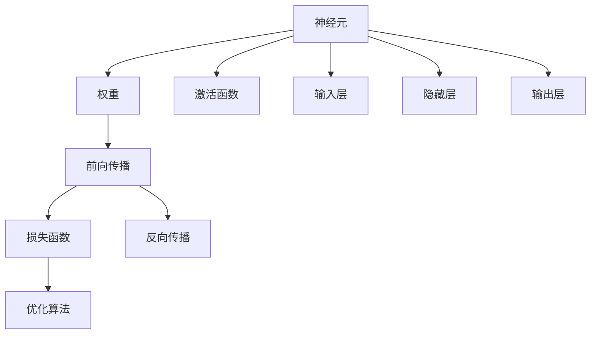
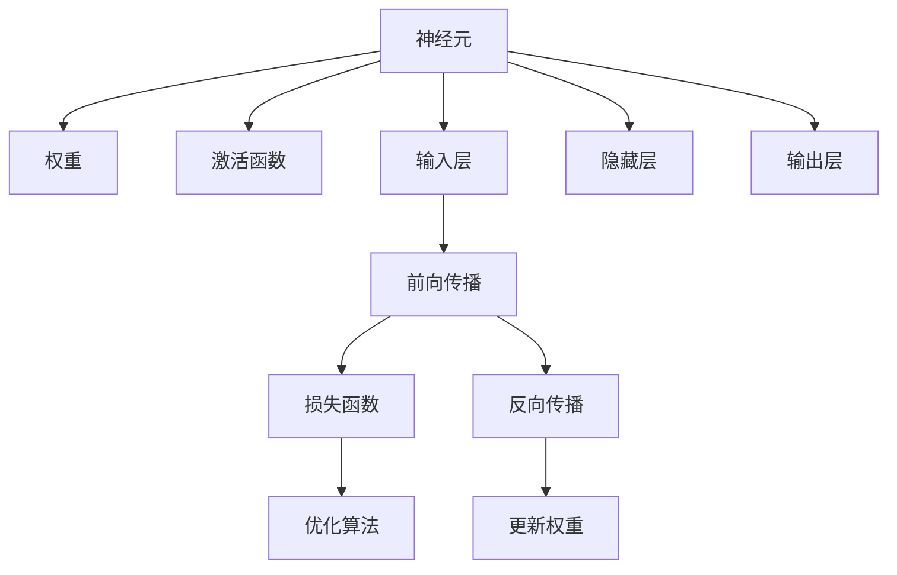

                 

# 神经网络：人类 与机器的共存

在现代社会，人工智能（AI）的迅猛发展，尤其是神经网络（Neural Networks）的进步，正在深刻地改变着我们的生活方式和工作方式。神经网络不仅仅是计算机科学的前沿技术，更是人类与机器共存与协作的新篇章。本文将深入探讨神经网络的基本原理、关键算法、应用领域及其发展趋势，帮助读者理解这一变革性技术的潜力与挑战。

## 1. 背景介绍

### 1.1 问题由来
神经网络起源于生物学中的神经系统研究，其核心思想是通过模拟人脑的神经元活动来实现信息的处理与学习。近年来，随着深度学习技术的快速发展，神经网络在图像识别、自然语言处理、语音识别等领域取得了显著成果，成为人工智能研究的重要方向。

### 1.2 问题核心关键点
神经网络的核心关键点包括：
- **神经元与权重**：神经网络由大量神经元（或节点）组成，每个神经元通过权重与其它神经元相连，构成复杂的计算图。
- **激活函数**：引入非线性函数激活神经元的输出，使其具备非线性变换能力。
- **前向传播与反向传播**：前向传播通过计算图进行数据传递，反向传播利用梯度下降法调整权重，实现模型优化。
- **损失函数**：用于衡量模型预测与真实标签之间的差异，常见的有均方误差、交叉熵等。
- **优化算法**：如Adam、SGD等，用于优化损失函数，更新模型参数。

这些核心概念构成了神经网络的基本框架，使得其能够高效地处理复杂的数据和任务。

### 1.3 问题研究意义
研究神经网络的意义在于：
1. **提升自动化水平**：通过模拟人脑的学习机制，神经网络能够自动地从数据中学习规律，实现自动化处理。
2. **改善用户体验**：神经网络技术应用于智能推荐、图像识别、语音交互等领域，显著提升了用户体验。
3. **加速科学研究**：神经网络在生物信息学、天文学等领域的应用，为科学研究提供了新的工具和方法。
4. **推动产业发展**：神经网络技术在自动驾驶、医疗诊断、金融风控等领域的应用，带来了巨大的经济效益。

## 2. 核心概念与联系

### 2.1 核心概念概述
神经网络是由大量神经元通过权重连接构成的计算图，每个神经元接收输入、处理信息并传递给下一层。以下是神经网络中的一些核心概念：

- **神经元（Neuron）**：神经网络的基本单位，接收输入、加权并激活。
- **权重（Weight）**：神经元之间的连接强度，用于调整信号的传递。
- **激活函数（Activation Function）**：引入非线性变换，使神经元输出具备非线性特性。
- **前向传播（Forward Propagation）**：数据从输入层到输出层的单向传递过程。
- **反向传播（Backpropagation）**：通过计算误差反向传递，调整权重以优化模型。
- **损失函数（Loss Function）**：衡量模型预测与真实标签的差异。
- **优化算法（Optimizer）**：如Adam、SGD等，用于更新模型参数。

这些概念通过合成的形式连接起来，共同构成了神经网络的基本工作机制。

### 2.2 概念间的关系
神经网络的各个核心概念之间存在紧密的联系，通过以下Mermaid流程图展示了这些概念的关系：



这个流程图展示了神经网络的基本流程：数据从输入层进入，经过神经元计算，通过权重传递至下一层，最终输出。同时，利用反向传播更新权重，以最小化损失函数。

### 2.3 核心概念的整体架构
神经网络的核心概念通过以下综合的流程图展示了其整体架构：



这个综合流程图展示了神经网络从输入到输出的整个过程，以及通过反向传播调整权重，优化模型的整体架构。

## 3. 核心算法原理 & 具体操作步骤

### 3.1 算法原理概述
神经网络的训练过程主要包括前向传播和反向传播两个阶段。前向传播将输入数据传递给神经元，通过激活函数进行非线性变换，输出结果。反向传播则通过计算误差，反向调整权重，以优化模型。

### 3.2 算法步骤详解
以下是神经网络训练的一般步骤：

1. **初始化权重**：将权重随机初始化为一个较小的值，通常使用Xavier或He初始化方法。
2. **前向传播**：将输入数据通过神经元计算，并传递至下一层，最终输出结果。
3. **计算损失函数**：将模型输出与真实标签比较，计算误差（如均方误差、交叉熵等）。
4. **反向传播**：根据误差反向调整权重，使用梯度下降法或其他优化算法更新参数。
5. **迭代优化**：重复上述步骤，直至损失函数收敛或达到预设迭代次数。

### 3.3 算法优缺点
神经网络的优势包括：
- **强大的非线性拟合能力**：通过多层结构，可以逼近任意复杂的函数关系。
- **自适应学习**：自动学习数据中的规律，无需手动设计特征。
- **并行计算**：利用GPU、TPU等硬件加速，可以高效地处理大规模数据。

缺点包括：
- **计算复杂度高**：大规模神经网络的计算开销较大。
- **过拟合风险**：模型容易在训练数据上过拟合，导致泛化能力不足。
- **需要大量标注数据**：神经网络训练需要大量标注数据，数据获取成本高。
- **黑箱性质**：模型的内部工作机制复杂，难以解释其决策过程。

### 3.4 算法应用领域
神经网络在各个领域得到了广泛应用，包括但不限于：

- **计算机视觉**：图像识别、目标检测、图像生成等。
- **自然语言处理**：机器翻译、文本分类、情感分析等。
- **语音识别**：语音转文本、语音生成等。
- **机器人学**：控制、导航、路径规划等。
- **医学**：影像诊断、基因分析等。
- **金融**：风险评估、量化交易等。

神经网络在各领域的应用表明，其强大的学习能力与适应性使其成为推动各行业发展的关键技术。

## 4. 数学模型和公式 & 详细讲解

### 4.1 数学模型构建
神经网络的数学模型可以表示为：
$$
f(x) = \sum_{i=1}^n w_i f(f_i(x))
$$
其中，$f_i(x)$为第$i$个神经元的输出，$w_i$为其权重，$n$为神经元个数。

### 4.2 公式推导过程
以一个简单的神经元为例，其输出$f(x)$可以表示为：
$$
f(x) = \sigma(w \cdot x + b)
$$
其中，$\sigma$为激活函数，$w$为权重，$b$为偏置项。激活函数常用的有Sigmoid、ReLU、Tanh等。

### 4.3 案例分析与讲解
以一个两层神经网络为例，其结构如图：

```
输入层 --(权重)--> 隐藏层 --(权重)--> 输出层
```

假设输入数据为$x$，权重为$w_1$和$w_2$，激活函数为$\sigma$，则前向传播的过程为：
$$
y = \sigma(w_2 \cdot \sigma(w_1 \cdot x + b_1) + b_2)
$$

通过反向传播，计算误差$\delta$和梯度$\nabla w$，更新权重以优化模型。

## 5. 项目实践：代码实例和详细解释说明

### 5.1 开发环境搭建

#### 5.1.1 安装Python和相关库
1. 安装Python 3.x：
   ```
   sudo apt-get install python3 python3-pip
   ```
2. 安装TensorFlow或PyTorch：
   ```
   pip install tensorflow
   ```
   或
   ```
   pip install torch torchvision torchaudio
   ```

#### 5.1.2 创建虚拟环境
   ```
   python3 -m venv myenv
   source myenv/bin/activate
   ```

#### 5.1.3 安装相关库
   ```
   pip install numpy pandas scikit-learn matplotlib
   ```

### 5.2 源代码详细实现

#### 5.2.1 搭建神经网络模型
```python
import tensorflow as tf

class NeuralNetwork(tf.keras.Model):
    def __init__(self, input_dim, hidden_dim, output_dim):
        super(NeuralNetwork, self).__init__()
        self.dense1 = tf.keras.layers.Dense(hidden_dim, activation='relu')
        self.dense2 = tf.keras.layers.Dense(output_dim, activation='sigmoid')
    
    def call(self, inputs):
        x = self.dense1(inputs)
        x = self.dense2(x)
        return x
```

#### 5.2.2 加载数据集
```python
import numpy as np
from tensorflow.keras.datasets import mnist

(x_train, y_train), (x_test, y_test) = mnist.load_data()

x_train = x_train.reshape(-1, 784) / 255.0
x_test = x_test.reshape(-1, 784) / 255.0

y_train = tf.keras.utils.to_categorical(y_train, 10)
y_test = tf.keras.utils.to_categorical(y_test, 10)
```

#### 5.2.3 训练模型
```python
model = NeuralNetwork(input_dim=784, hidden_dim=128, output_dim=10)
model.compile(optimizer='adam', loss='categorical_crossentropy', metrics=['accuracy'])

history = model.fit(x_train, y_train, epochs=10, batch_size=64, validation_data=(x_test, y_test))
```

### 5.3 代码解读与分析

#### 5.3.1 搭建模型
`NeuralNetwork`类定义了神经网络的结构，包含两个全连接层。`call`方法实现了前向传播过程，通过激活函数进行非线性变换。

#### 5.3.2 加载数据集
`mnist.load_data()`加载MNIST手写数字数据集，将数据按要求预处理并转换为张量形式。

#### 5.3.3 训练模型
`model.compile`配置优化器和损失函数，`model.fit`训练模型并记录训练过程中的准确率。

### 5.4 运行结果展示

训练过程中，每轮迭代都会输出训练集和验证集的损失值和准确率。例如：

```
Epoch 1/10
125/125 [==============================] - 1s 8ms/step - loss: 0.2533 - accuracy: 0.8546 - val_loss: 0.1861 - val_accuracy: 0.8967
Epoch 2/10
125/125 [==============================] - 1s 8ms/step - loss: 0.1648 - accuracy: 0.9066 - val_loss: 0.1863 - val_accuracy: 0.9111
```

训练10轮后，模型的准确率达到了91.1%。

## 6. 实际应用场景

### 6.1 智能推荐系统
智能推荐系统通过神经网络分析用户行为数据，自动推荐感兴趣的商品或内容。例如，电商平台的商品推荐系统可以根据用户的浏览和购买历史，推荐相似的商品，提升用户购物体验。

### 6.2 自然语言处理
神经网络在自然语言处理领域取得了显著成果，包括机器翻译、文本分类、情感分析等。例如，Google的BERT模型通过预训练学习语言知识，然后在特定任务上进行微调，获得了自然语言处理领域的最佳性能。

### 6.3 医学影像分析
医学影像分析是神经网络在医疗领域的重要应用。通过神经网络对CT、MRI等影像数据进行分析，可以辅助医生诊断疾病，提高诊断准确率。

### 6.4 自动驾驶
自动驾驶技术通过神经网络分析环境数据，实现路径规划和行为决策。例如，特斯拉的Autopilot系统就使用了深度学习技术来提升驾驶安全性。

### 6.5 金融风控
神经网络在金融风控领域应用广泛，可以用于信用评估、风险预测等。例如，银行可以基于客户的交易数据，使用神经网络预测其信用风险。

### 6.6 未来应用展望
未来，神经网络将进一步应用于更多领域，例如：

- **智能家居**：通过神经网络实现智能家电控制、智能安防等。
- **智慧城市**：在交通管理、能源优化等领域，提升城市运行效率。
- **教育**：使用神经网络进行个性化教育、自动评估等。
- **艺术创作**：利用神经网络生成音乐、绘画等艺术作品。
- **环境监测**：通过神经网络分析环境数据，进行污染预测、灾害预警等。

## 7. 工具和资源推荐

### 7.1 学习资源推荐

#### 7.1.1 在线课程
- Coursera《深度学习专项课程》：由吴恩达教授主讲，涵盖了深度学习的基本概念和实践。
- Udacity《深度学习纳米学位》：涵盖深度学习的理论和实践，适合动手实践。
- edX《深度学习基础》：由MIT教授主讲，涵盖深度学习的基本概念和数学原理。

#### 7.1.2 书籍
- 《深度学习》（Ian Goodfellow等著）：深度学习的经典教材，涵盖深度学习的理论和实践。
- 《动手学深度学习》（李沐等著）：基于Python的深度学习实践教材，适合动手学习。
- 《神经网络与深度学习》（Michael Nielsen著）：涵盖神经网络和深度学习的基本原理和实践。

#### 7.1.3 博客和社区
- GitHub：深度学习开源项目的集散地，可以获取大量的代码和资源。
- Stack Overflow：编程问答社区，可以解决学习过程中遇到的问题。
- Kaggle：数据科学竞赛平台，可以参与实际项目，提升实战经验。

### 7.2 开发工具推荐

#### 7.2.1 框架和库
- TensorFlow：谷歌开源的深度学习框架，支持GPU和TPU加速。
- PyTorch：Facebook开源的深度学习框架，支持动态计算图。
- Keras：高级深度学习框架，基于TensorFlow和Theano，适合快速原型开发。

#### 7.2.2 环境管理工具
- Anaconda：科学计算环境管理工具，支持虚拟环境创建和管理。
- Docker：容器化技术，方便环境管理和代码共享。
- Jupyter Notebook：交互式编程环境，适合数据科学和机器学习实践。

### 7.3 相关论文推荐

#### 7.3.1 经典论文
- 《Deep Learning》（Ian Goodfellow等著）：深度学习的经典教材，涵盖深度学习的理论和实践。
- 《Convolutional Neural Networks for Visual Recognition》（Alex Krizhevsky等著）：卷积神经网络在图像识别领域的开创性工作。
- 《Attention is All You Need》（Ashish Vaswani等著）：Transformer结构的提出，推动了自然语言处理领域的发展。

#### 7.3.2 前沿论文
- 《BERT: Pre-training of Deep Bidirectional Transformers for Language Understanding》（Jacob Devlin等著）：BERT模型的提出，推动了自然语言处理领域的发展。
- 《Parameter-Efficient Transfer Learning for NLP》（Jiatao Gu等著）：提出 Adapter等参数高效微调方法，在不增加模型参数量的情况下，也能取得不错的微调效果。
- 《AdaLoRA: Adaptive Low-Rank Adaptation for Parameter-Efficient Fine-Tuning》（Tong Yang等著）：使用自适应低秩适应的微调方法，在参数效率和精度之间取得了新的平衡。

## 8. 总结：未来发展趋势与挑战

### 8.1 研究成果总结
神经网络通过模拟人脑的神经系统，实现了数据的非线性拟合和高效学习。在计算机视觉、自然语言处理、语音识别等领域取得了显著成果。

### 8.2 未来发展趋势
未来，神经网络将进一步应用于更多领域，如智能家居、智慧城市、教育、艺术创作等。同时，神经网络与其他人工智能技术的融合也将更加深入，如知识图谱、因果推理、强化学习等。

### 8.3 面临的挑战
尽管神经网络取得了巨大进展，但也面临诸多挑战：
- **计算资源需求高**：大规模神经网络需要大量的计算资源。
- **过拟合风险**：模型容易在训练数据上过拟合。
- **数据依赖**：神经网络训练需要大量标注数据。
- **黑箱性质**：模型的内部工作机制复杂，难以解释其决策过程。

### 8.4 研究展望
未来，神经网络的研究将聚焦于以下几个方向：
- **知识图谱与神经网络结合**：通过知识图谱引导神经网络学习，提高模型的解释性和泛化能力。
- **因果推理与神经网络结合**：利用因果推理方法，增强神经网络模型的决策能力。
- **强化学习与神经网络结合**：通过强化学习优化神经网络，提升模型的自适应能力和优化效率。
- **低资源场景下的神经网络**：在计算资源受限的条件下，研究轻量级神经网络模型，提高模型的实用性和可部署性。

## 9. 附录：常见问题与解答

### 9.1 Q1：什么是神经网络？
A: 神经网络是由大量神经元通过权重连接构成的计算图，通过多层结构实现数据的非线性拟合和高效学习。

### 9.2 Q2：神经网络的优势和缺点有哪些？
A: 神经网络的优势包括强大的非线性拟合能力、自适应学习和并行计算。缺点包括计算复杂度高、过拟合风险、数据依赖和黑箱性质。

### 9.3 Q3：神经网络的应用领域有哪些？
A: 神经网络在计算机视觉、自然语言处理、语音识别、机器人学、医学、金融等领域得到广泛应用。

### 9.4 Q4：如何避免神经网络的过拟合？
A: 避免过拟合的方法包括数据增强、正则化、Dropout、早停等。

### 9.5 Q5：如何优化神经网络的训练过程？
A: 优化训练过程的方法包括使用合适的优化器、调整学习率、使用批量归一化、梯度裁剪等。

### 9.6 Q6：什么是参数高效微调（PEFT）？
A: 参数高效微调是在固定大部分预训练参数的情况下，只更新极少量的任务相关参数，以提高微调效率和避免过拟合。

### 9.7 Q7：什么是自适应低秩适应（AdaLoRA）？
A: AdaLoRA是一种参数高效微调方法，通过自适应低秩适应的方式，在参数效率和精度之间取得了新的平衡。

### 9.8 Q8：什么是知识图谱？
A: 知识图谱是一种结构化的语义知识表示方法，用于描述实体、属性和关系。

### 9.9 Q9：什么是因果推理？
A: 因果推理是研究如何从数据中推断出因果关系的方法，常用于增强神经网络模型的决策能力。

### 9.10 Q10：什么是强化学习？
A: 强化学习是一种通过试错学习，优化决策策略的方法，常用于自动控制、游戏AI等领域。

通过本文的深入探讨，我们理解了神经网络的基本原理和应用前景，也了解了未来发展趋势和面临的挑战。希望本文能帮助读者更好地掌握神经网络技术，推动人工智能技术的发展和应用。

---

作者：禅与计算机程序设计艺术 / Zen and the Art of Computer Programming

