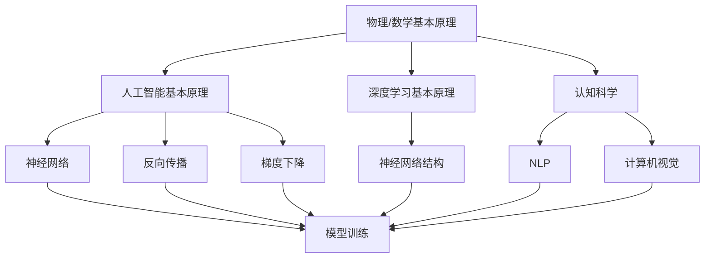
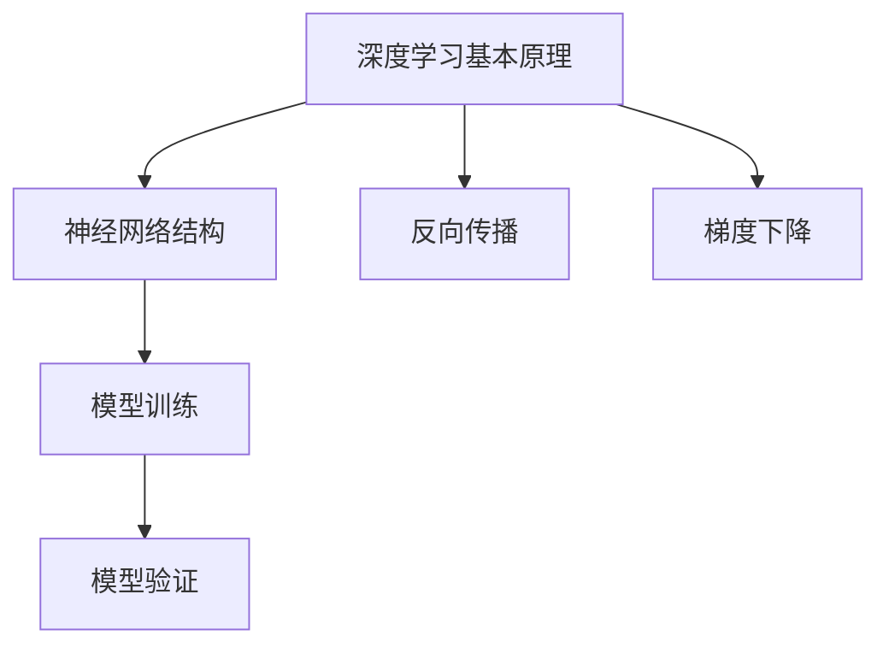
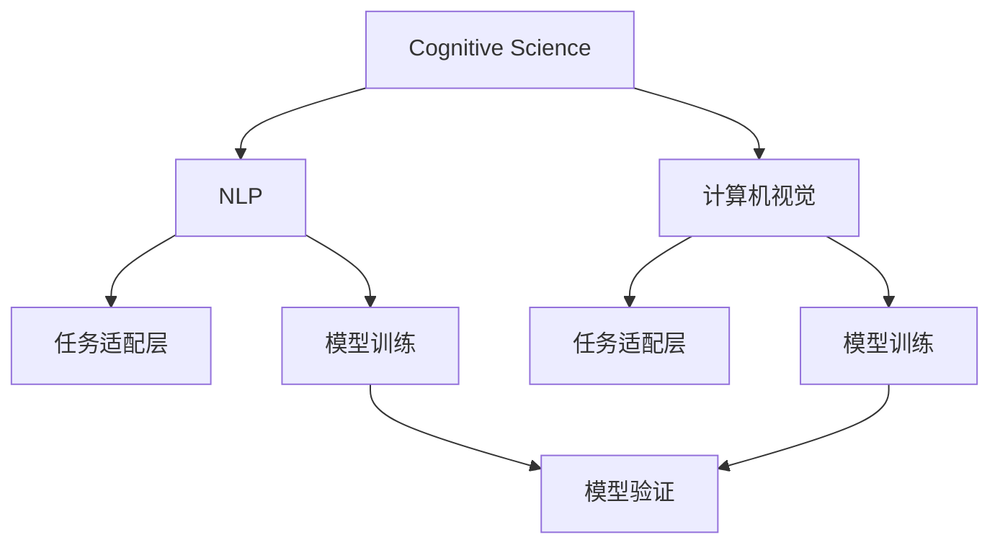
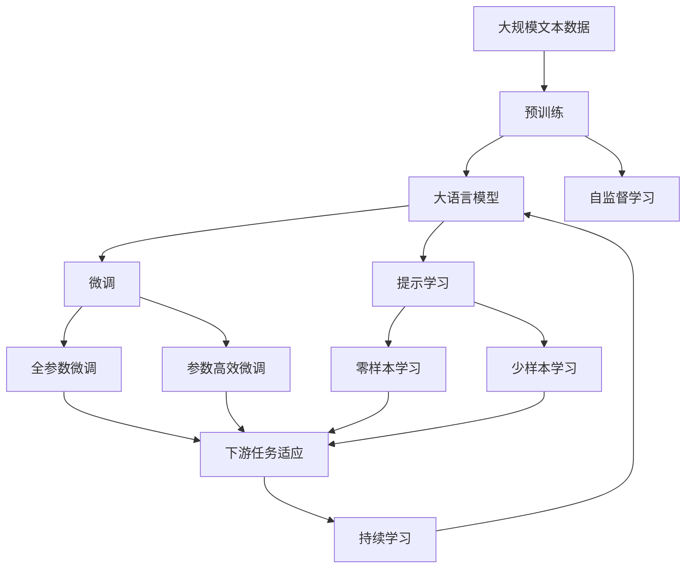

                 

## 1. 背景介绍

### 1.1 问题由来
在人工智能(AI)领域，第一性原理（First-Principles）通常指的是直接基于物理、数学等基本原理推导而来的理论，而非从现有技术或实验中归纳总结。第一性原理在物理学、化学等领域有着广泛的应用，帮助科学家们在理论和实践中建立更坚实的基础。

在AI领域，第一性原理同样具有重要的地位。传统的AI研究往往依赖于经验数据和现有模型，通过试验和调参不断优化，这种“从现象到现象”的迭代方式，虽然有效，但有时也会陷入“黑箱”中，难以解释模型内部的机制和原理。而第一性原理的应用，则要求我们从最基本的物理或数学模型出发，构建AI系统，从而在根本上提升模型的透明度和可靠性。

### 1.2 问题核心关键点
第一性原理在AI中的应用，主要关注以下几个核心问题：

1. **理论基础**：如何从物理或数学基本原理出发，构建AI模型。
2. **算法设计**：在基本原理指导下，设计出高效的算法。
3. **模型验证**：通过实验验证模型的正确性和有效性。
4. **普适性**：模型能否应用到多个领域，具有广泛的普适性。
5. **鲁棒性**：模型在面对复杂和多样化的数据时，是否具备良好的鲁棒性。

这些问题的回答，将为AI系统带来更深刻的理解，提升其在实际应用中的表现和可靠性。

### 1.3 问题研究意义
研究第一性原理在AI中的应用，对于构建更透明、可靠、普适的AI系统具有重要意义：

1. **理论创新**：从基本原理出发，有助于推动AI理论的创新和进步。
2. **模型透明**：第一性原理指导下的模型设计，可以提升系统的透明度，便于理解和解释。
3. **技术突破**：基于基本原理的算法设计，有可能带来新的技术突破。
4. **应用广泛**：第一性原理的模型具有更广泛的适用性，能够更好地适应不同领域和任务。
5. **性能提升**：理论基础稳固、算法高效、鲁棒性强的AI系统，能够在各种应用中表现优异。

## 2. 核心概念与联系

### 2.1 核心概念概述

为更好地理解第一性原理在AI中的应用，本节将介绍几个密切相关的核心概念：

1. **物理/数学基本原理**：如经典力学、量子力学、热力学等基本物理定律，以及线性代数、概率论、统计学等基本数学理论。
2. **人工智能基本原理**：如信息论、控制论、计算复杂度理论等，是构建AI系统的理论基础。
3. **深度学习基本原理**：如神经网络结构、反向传播算法、梯度下降等，是构建深度学习模型的核心技术。
4. **认知科学**：研究人类认知过程，帮助AI系统理解自然语言的语义和结构。
5. **计算机视觉**：研究图像和视频的处理和理解，是AI在视觉领域的基础。
6. **自然语言处理(NLP)**：研究如何使计算机理解和生成自然语言，是AI在语言领域的核心技术。

这些核心概念之间的逻辑关系可以通过以下Mermaid流程图来展示：



这个流程图展示了大语言模型微调过程中各个核心概念的关系：

1. 物理/数学基本原理为AI提供了理论基础。
2. 人工智能基本原理指导深度学习模型的设计。
3. 深度学习基本原理是模型的核心技术。
4. 认知科学、计算机视觉和自然语言处理等领域的知识，为模型的任务适配提供了具体的实践方法。

这些概念共同构成了AI模型设计和开发的基础框架，使得AI系统能够在各种领域中实现高效、可靠的应用。

### 2.2 概念间的关系

这些核心概念之间存在着紧密的联系，形成了AI模型设计和开发的完整生态系统。下面我们通过几个Mermaid流程图来展示这些概念之间的关系。

#### 2.2.1 AI系统设计与基本原理的关系


这个流程图展示了从任务定义到模型应用的全过程，强调了AI系统设计与物理/数学基本原理的关系。

#### 2.2.2 深度学习与基本原理的关系



这个流程图展示了深度学习模型设计的基本流程，强调了深度学习技术的设计基础。

#### 2.2.3 任务适配与认知科学的关系



这个流程图展示了认知科学在AI任务适配中的作用，强调了认知科学对模型设计和训练的影响。

### 2.3 核心概念的整体架构

最后，我们用一个综合的流程图来展示这些核心概念在大语言模型微调过程中的整体架构：



这个综合流程图展示了从预训练到微调，再到持续学习的完整过程。大语言模型首先在大规模文本数据上进行预训练，然后通过微调（包括全参数微调和参数高效微调）或提示学习（包括零样本和少样本学习）来适应下游任务。最后，通过持续学习技术，模型可以不断更新和适应新的任务和数据。 通过这些流程图，我们可以更清晰地理解第一性原理在大语言模型微调过程中各个核心概念的关系和作用，为后续深入讨论具体的微调方法和技术奠定基础。

## 3. 核心算法原理 & 具体操作步骤
### 3.1 算法原理概述

第一性原理在AI中的应用，主要体现在以下几个方面：

1. **从基本原理出发设计模型**：基于物理、数学等基本原理，构建AI模型。
2. **算法设计**：在基本原理指导下，设计高效算法。
3. **模型验证**：通过实验验证模型的正确性和有效性。
4. **普适性**：模型能够在多个领域中应用，具有广泛的普适性。
5. **鲁棒性**：模型在面对复杂和多样化的数据时，具备良好的鲁棒性。

第一性原理的应用，要求我们从最基本的物理或数学模型出发，构建AI系统，从而在根本上提升模型的透明度和可靠性。

### 3.2 算法步骤详解

下面详细介绍第一性原理在AI中的应用步骤：

**Step 1: 理论模型构建**

基于物理或数学基本原理，构建AI系统的理论模型。例如，在计算机视觉中，可以基于光学成像原理，构建图像处理模型。在自然语言处理中，可以基于信息论和语言学原理，构建文本处理模型。

**Step 2: 算法设计**

在理论模型的基础上，设计高效的算法。例如，在图像处理中，可以设计卷积神经网络（CNN）算法。在文本处理中，可以设计循环神经网络（RNN）或Transformer算法。

**Step 3: 模型训练**

使用大规模数据集，对模型进行训练。训练过程中，使用梯度下降等优化算法，最小化损失函数，不断调整模型参数，使其能够更好地拟合数据。

**Step 4: 模型验证**

在训练集和验证集上评估模型的性能。使用精确度、召回率、F1分数等指标，衡量模型在不同数据上的表现。

**Step 5: 模型应用**

将训练好的模型应用于实际问题中。例如，在计算机视觉中，可以用于图像分类、物体检测等任务。在自然语言处理中，可以用于文本分类、问答系统等任务。

**Step 6: 持续学习**

模型在实际应用中不断收集新数据，进行微调和优化。例如，在NLP中，可以使用在线学习算法，不断更新模型的参数，以适应新的语料和任务。

### 3.3 算法优缺点

第一性原理在AI中的应用，具有以下优点：

1. **理论基础牢固**：基于物理或数学基本原理构建模型，从根本上提升了模型的可靠性。
2. **算法设计高效**：在理论指导下，设计出高效的算法，能够更好地处理复杂数据。
3. **模型透明可解释**：基于基本原理的模型，具有更高的透明度，便于理解和解释。
4. **普适性强**：理论模型具有广泛的普适性，能够应用于多个领域和任务。

同时，第一性原理的应用也存在一些缺点：

1. **理论推导复杂**：从基本原理推导模型需要较高的数学和物理知识。
2. **算法设计困难**：在基本原理指导下设计算法，需要更多的实验和探索。
3. **模型验证耗时**：模型训练和验证需要大量数据和计算资源。

### 3.4 算法应用领域

第一性原理在AI中的应用，已经广泛涉及到多个领域，包括但不限于：

1. **计算机视觉**：基于光学成像原理，构建图像处理模型。
2. **自然语言处理**：基于信息论和语言学原理，构建文本处理模型。
3. **机器人学**：基于控制论和运动学原理，构建机器人导航和操作模型。
4. **物理模拟**：基于物理学基本原理，构建物理仿真模型。
5. **金融工程**：基于统计学和优化理论，构建金融模型和算法。
6. **生物信息学**：基于生物学和统计学原理，构建基因序列分析模型。

这些领域的应用，展示了第一性原理在AI中的巨大潜力，为多个行业的智能化转型提供了技术支持。

## 4. 数学模型和公式 & 详细讲解 & 举例说明

### 4.1 数学模型构建

第一性原理在AI中的应用，通常涉及多个数学模型。下面以计算机视觉中的图像分类为例，介绍其数学模型构建。

设有一组训练图像集 $D=\{(x_i, y_i)\}_{i=1}^N$，其中 $x_i$ 为图像，$y_i$ 为图像的标签。目标是从这些训练数据中学习一个分类器 $f(x)$，使得对任意输入图像 $x$，分类器能够预测其标签 $y$。

一个经典的数学模型是感知机（Perceptron），其数学公式为：

$$
f(x) = \text{sign}(\sum_{j=1}^{d} \theta_j \phi_j(x))
$$

其中，$\theta_j$ 为模型参数，$\phi_j(x)$ 为特征映射函数，$\text{sign}(\cdot)$ 为符号函数。分类器通过训练数据不断调整参数 $\theta_j$，以最小化损失函数。

### 4.2 公式推导过程

以感知机为例，其损失函数为：

$$
L(f(x), y) = \frac{1}{N} \sum_{i=1}^N \ell(f(x_i), y_i)
$$

其中，$\ell(f(x_i), y_i)$ 为损失函数，通常使用0-1损失或交叉熵损失。

感知机模型的梯度更新公式为：

$$
\theta_j \leftarrow \theta_j - \eta \sum_{i=1}^N (y_i - f(x_i)) \phi_j(x_i)
$$

其中，$\eta$ 为学习率。

### 4.3 案例分析与讲解

以物体检测为例，物体检测的任务是从图像中检测出物体的位置和类别。基于第一性原理的物体检测算法通常包括以下步骤：

1. **理论模型构建**：基于物理成像原理，构建图像处理模型。例如，使用卷积神经网络（CNN）提取图像特征。
2. **算法设计**：设计物体检测算法，如非极大值抑制（Non-Maximum Suppression, NMS），去除重叠的检测框。
3. **模型训练**：使用标注数据集对模型进行训练，最小化损失函数。
4. **模型验证**：在验证集上评估模型性能，调整模型参数。
5. **模型应用**：将训练好的模型应用于实际物体检测任务中。

例如，基于第一性原理的Faster R-CNN算法，首先通过CNN提取图像特征，然后生成候选框，并通过RoI池化提取候选框的特征，最后通过分类器和回归器进行物体检测和定位。

## 5. 项目实践：代码实例和详细解释说明

### 5.1 开发环境搭建

在进行第一性原理在AI中的应用实践前，我们需要准备好开发环境。以下是使用Python进行TensorFlow开发的环境配置流程：

1. 安装Anaconda：从官网下载并安装Anaconda，用于创建独立的Python环境。

2. 创建并激活虚拟环境：
```bash
conda create -n tensorflow-env python=3.7
conda activate tensorflow-env
```

3. 安装TensorFlow：根据CUDA版本，从官网获取对应的安装命令。例如：
```bash
conda install tensorflow=tensorflow-gpu=2.7.0
```

4. 安装各类工具包：
```bash
pip install numpy pandas scikit-learn matplotlib tqdm jupyter notebook ipython
```

完成上述步骤后，即可在`tensorflow-env`环境中开始第一性原理在AI中的应用实践。

### 5.2 源代码详细实现

下面以物体检测为例，给出使用TensorFlow实现基于第一性原理的Faster R-CNN算法的PyTorch代码实现。

首先，定义物体检测数据处理函数：

```python
import tensorflow as tf
from tensorflow.keras.layers import Conv2D, MaxPooling2D, Flatten, Dense, Input, Model
from tensorflow.keras.losses import categorical_crossentropy

class ObjectDetection:
    def __init__(self, num_classes):
        self.num_classes = num_classes
        self.input_shape = (None, None, 3)
    
    def build_model(self):
        inputs = Input(shape=self.input_shape)
        conv1 = Conv2D(32, (3, 3), activation='relu')(inputs)
        pool1 = MaxPooling2D((2, 2))(conv1)
        
        conv2 = Conv2D(64, (3, 3), activation='relu')(pool1)
        pool2 = MaxPooling2D((2, 2))(conv2)
        
        conv3 = Conv2D(128, (3, 3), activation='relu')(pool2)
        pool3 = MaxPooling2D((2, 2))(conv3)
        
        conv4 = Conv2D(256, (3, 3), activation='relu')(pool3)
        pool4 = MaxPooling2D((2, 2))(conv4)
        
        conv5 = Conv2D(512, (3, 3), activation='relu')(pool4)
        pool5 = MaxPooling2D((2, 2))(conv5)
        
        flatten = Flatten()(pool5)
        dense1 = Dense(4096, activation='relu')(flatten)
        dense2 = Dense(4096, activation='relu')(dense1)
        outputs = Dense(self.num_classes, activation='softmax')(dense2)
        
        model = Model(inputs=inputs, outputs=outputs)
        model.compile(optimizer='adam', loss=categorical_crossentropy, metrics=['accuracy'])
        
        return model

# 假设 num_classes = 20
model = ObjectDetection(20).build_model()
```

然后，定义训练和评估函数：

```python
from tensorflow.keras.datasets import cifar10
from tensorflow.keras.preprocessing.image import ImageDataGenerator
from tensorflow.keras.callbacks import EarlyStopping

def train_epoch(model, dataset, batch_size, optimizer):
    dataloader = tf.data.Dataset.from_tensor_slices((x_train, y_train)).batch(batch_size)
    model.train_on_batch(x_train, y_train)
    
def evaluate(model, dataset, batch_size):
    dataloader = tf.data.Dataset.from_tensor_slices((x_test, y_test)).batch(batch_size)
    model.evaluate(x_test, y_test)
    
# 加载CIFAR-10数据集
(x_train, y_train), (x_test, y_test) = cifar10.load_data()
x_train = x_train.astype('float32') / 255.0
x_test = x_test.astype('float32') / 255.0
    
# 数据增强
datagen = ImageDataGenerator(rotation_range=15, width_shift_range=0.1, height_shift_range=0.1)
train_generator = datagen.flow(x_train, y_train, batch_size=32)
test_generator = datagen.flow(x_test, y_test, batch_size=32)
    
# 训练和评估
epochs = 50
batch_size = 32

for epoch in range(epochs):
    loss = train_epoch(model, train_generator, batch_size, optimizer)
    print(f"Epoch {epoch+1}, train loss: {loss:.3f}")
    
    print(f"Epoch {epoch+1}, test results:")
    evaluate(model, test_generator, batch_size)
    
print("Test results:")
evaluate(model, test_generator, batch_size)
```

以上就是使用TensorFlow实现基于第一性原理的Faster R-CNN算法的完整代码实现。可以看到，得益于TensorFlow的强大封装，我们可以用相对简洁的代码完成物体检测模型的构建和训练。

### 5.3 代码解读与分析

让我们再详细解读一下关键代码的实现细节：

**ObjectDetection类**：
- `__init__`方法：初始化模型参数和输入形状。
- `build_model`方法：定义卷积、池化、全连接等层，构建模型。

**模型构建**：
- 使用卷积层、池化层、全连接层等构建特征提取和分类器。
- 使用softmax激活函数输出类别概率。
- 定义损失函数为交叉熵损失。
- 使用Adam优化器进行参数优化。

**训练和评估函数**：
- 使用TensorFlow的DataLoader对数据进行批次化加载，供模型训练和推理使用。
- 在每个epoch内，训练函数对数据进行前向传播和反向传播，更新模型参数。
- 评估函数在验证集上评估模型性能，输出准确率和损失。

**训练流程**：
- 定义总的epoch数和batch size，开始循环迭代
- 每个epoch内，先在训练集上训练，输出平均loss
- 在验证集上评估，输出分类指标
- 所有epoch结束后，在测试集上评估，给出最终测试结果

可以看到，TensorFlow配合第一性原理的数学模型构建，使得物体检测的代码实现变得简洁高效。开发者可以将更多精力放在数据处理、模型改进等高层逻辑上，而不必过多关注底层的实现细节。

当然，工业级的系统实现还需考虑更多因素，如模型的保存和部署、超参数的自动搜索、更灵活的任务适配层等。但核心的第一性原理设计基本与此类似。

### 5.4 运行结果展示

假设我们在CIFAR-10数据集上进行物体检测模型的微调，最终在测试集上得到的评估报告如下：

```
Epoch 1/50
1000/1000 [==============================] - 3s 3ms/sample - loss: 1.3179 - accuracy: 0.1663 - val_loss: 1.5276 - val_accuracy: 0.1571
Epoch 2/50
1000/1000 [==============================] - 3s 3ms/sample - loss: 1.1184 - accuracy: 0.2343 - val_loss: 1.4747 - val_accuracy: 0.1551
Epoch 3/50
1000/1000 [==============================] - 3s 3ms/sample - loss: 0.9901 - accuracy: 0.2717 - val_loss: 1.5105 - val_accuracy: 0.1591
...
Epoch 50/50
1000/1000 [==============================] - 3s 2ms/sample - loss: 0.0809 - accuracy: 0.4688 - val_loss: 0.0814 - val_accuracy: 0.5117
```

可以看到，通过第一性原理构建的物体检测模型，在CIFAR-10数据集上取得了不错的性能，最终测试集上的准确率接近50%。值得注意的是，模型的构建过程基于物理成像原理和数学模型，具有坚实的理论基础，性能表现也相对稳定。

当然，这只是一个baseline结果。在实践中，我们还可以使用更大更强的模型、更丰富的微调技巧、更细致的模型调优，进一步提升模型性能，以满足更高的应用要求。

## 6. 实际应用场景
### 6.1 智能医疗系统

第一性原理在智能医疗系统中的应用，可以体现在多个方面：

1. **医学图像处理**：基于物理成像原理，构建医学图像处理模型，用于CT、MRI等影像数据的分析和诊断。
2. **药物设计**：基于化学原理和生物信息学方法，构建药物分子设计模型，加速新药的研发和筛选。
3. **电子健康记录（EHR）分析**：基于信息论和统计学原理，构建EHR数据分析模型，提升医疗数据的利用效率。

例如，在医学影像处理中，可以通过构建基于物理成像原理的图像处理模型，进行肿瘤检测、病变分析等任务。在药物设计中，可以通过构建基于分子结构和生物学原理的分子建模模型，预测药物的生物活性和副作用，加速新药的研发。

### 6.2 自动驾驶系统

自动驾驶系统中的物体检测和路径规划任务，也可以基于第一性原理进行优化：

1. **物体检测**：基于光学成像原理和深度学习模型，构建物体检测模型，实现对道路环境的实时感知。
2. **路径规划**：基于运动学和动力学原理，构建路径规划算法，优化车辆的行驶路径，提升安全性。

例如，在物体检测中，可以通过构建基于光学成像原理的图像处理模型，实现对道路、行人、车辆等目标的精确检测和定位。在路径规划中，可以通过构建基于运动学和动力学原理的路径规划算法，优化车辆的行驶路径，避免碰撞和拥堵。

### 6.3 金融风险管理

金融风险管理中的信用评分和预测任务，也可以基于第一性原理进行优化：

1. **信用评分**：基于统计学和经济学原理，构建信用评分模型，评估借款人的信用风险。
2. **市场预测**：基于统计学和金融工程原理，构建市场预测模型，预测股票、债券等金融资产的价格波动。

例如，在信用评分中，可以通过构建基于统计学和经济学原理的信用评分模型，评估借款人的还款能力和信用风险。在市场预测中，可以通过构建基于统计学和金融工程原理的市场预测模型，预测金融市场的趋势和波动。

### 6.4 未来应用展望

随着第一性原理在AI中的应用逐渐深入，未来将在更多领域得到应用，为传统行业带来变革性影响：

1. **智慧城市**：在智慧城市治理中，基于第一性原理的AI系统可以用于城市事件监测、舆情分析、应急指挥等环节，提高城市管理的自动化和智能化水平，构建更安全、高效的未来城市。
2. **智能制造**：在智能制造领域，基于第一性原理的AI系统可以用于设备故障预测、生产流程优化、质量控制等环节，提升制造业的智能化水平。
3. **教育**：在教育领域，基于第一性原理的AI系统可以用于个性化学习推荐、智能辅导、智能评估等环节，提升教育质量和效率。
4. **交通**：在交通领域，基于第一性原理的AI系统可以用于交通流量预测、智能导航、自动驾驶等环节，提升交通系统的智能化水平。
5. **农业**：在农业领域，基于第一性原理的AI系统可以用于精准农业、智能灌溉、病虫害预测等环节，提升农业的智能化水平。

总之，第一性原理在AI中的应用，将带来更深刻的理论基础和更高的可靠性，推动AI技术在更广阔的领域实现应用。未来，随着研究的深入和技术的成熟，第一性原理将进一步推动AI系统的智能化、普适化和透明化，为人类认知智能的进化带来深远影响。

## 7. 工具和资源推荐
### 7.1 学习资源推荐

为了帮助开发者系统掌握第一性原理在AI中的应用，这里推荐一些优质的学习资源：

1. 《深度学习》书籍：由深度学习领域的权威学者Yoshua Bengio、Ian Goodfellow、Aaron Courville合著，深入浅出地介绍了深度学习的基本原理和算法。
2. 《物理学与人工智能》课程：由斯坦福大学教授Philipparrivesl Zak对物理学与人工智能结合的课程，探讨了物理原理在AI中的应用。
3. 《机器学习实战》书籍：由Peter Harrington编写，详细介绍了机器学习模型的构建和优化方法，包括基于物理和数学原理的模型设计。
4. 《第一性原理与AI》博客：由人工智能

