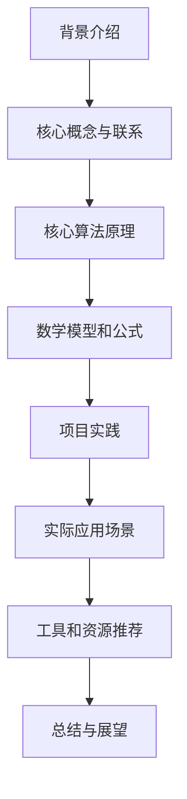

# AI人工智能代理工作流AI Agent WorkFlow：互动学习在工作流中的角色与方法

## 1. 背景介绍

### 1.1 问题的由来

在当今快节奏的商业环境中，工作流程的优化和自动化已成为提高效率和降低成本的关键因素。传统的工作流程通常由人工完成,存在着效率低下、错误率高和成本昂贵等问题。随着人工智能(AI)和机器学习(ML)技术的不断发展,AI代理(Agent)已逐渐被引入工作流程中,旨在提高工作效率、减少人工错误并降低运营成本。

AI代理作为智能系统的一种,能够感知环境、做出决策并执行相应的动作。在工作流程中,AI代理可以承担各种任务,如数据收集、处理、分析、决策和执行等。然而,AI代理在工作流中的应用还面临着诸多挑战,如如何与人类协作、如何处理复杂和动态的工作流、如何确保AI代理的决策公平性和可解释性等。

### 1.2 研究现状

近年来,研究人员已开始探索将AI代理应用于工作流程的各个方面。一些研究侧重于开发能够自动执行特定任务的AI代理,如文档处理、客户服务等。另一些研究则关注于如何将AI代理与人类协作,以充分发挥人机协同的优势。

此外,一些研究着眼于提高AI代理的可解释性和公平性,以确保其决策过程的透明度和公正性。同时,也有研究探讨了AI代理在动态和复杂工作流中的应用,旨在提高其适应性和灵活性。

然而,现有研究大多集中于特定领域或特定任务,缺乏一个全面的框架来指导AI代理在工作流中的应用和优化。因此,需要一种综合性的方法来解决AI代理在工作流中面临的各种挑战。

### 1.3 研究意义

将AI代理引入工作流程中具有重要的理论和实践意义。从理论层面上,它可以推动人工智能、机器学习和工作流管理等领域的发展,促进跨学科的交叉研究。从实践层面上,它有望显著提高工作效率、降低运营成本,并为企业带来竞争优势。

具体而言,将AI代理应用于工作流程可以带来以下潜在好处:

1. **提高效率**:AI代理可以自动化重复性任务,减少人工干预,从而提高工作流程的整体效率。
2. **降低成本**:通过自动化和优化,AI代理可以减少人力和资源的投入,降低运营成本。
3. **减少错误**:AI代理能够执行精确的操作,减少人为错误的发生。
4. **提高可扩展性**:AI代理可以轻松地扩展到更大规模的工作流程中,而无需大量增加人力资源。
5. **增强决策能力**:AI代理可以基于大量数据和复杂模型做出优化决策,超越人类的认知能力。
6. **促进人机协作**:通过合理分配任务,AI代理可以与人类协作,发挥人机各自的优势。

### 1.4 本文结构

本文旨在提供一个综合性的框架,探讨AI代理在工作流中的角色和应用方法。文章首先介绍相关的核心概念和技术,包括AI代理、工作流管理和互动学习等。接下来,详细阐述AI代理在工作流中的核心算法原理和数学模型。然后,通过实际项目案例,展示AI代理在工作流中的实践应用。最后,讨论AI代理在工作流中的未来发展趋势和面临的挑战。

文章的主要结构如下:

## 2. 核心概念与联系

在探讨AI代理在工作流中的应用之前,有必要先了解几个核心概念及其相互关系。

### 2.1 AI代理(AI Agent)

AI代理是一种智能系统,能够感知环境、做出决策并执行相应的动作。它通常由以下几个核心组件组成:

1. **感知器(Sensor)**:用于获取环境信息,如视觉、语音等数据。
2. **决策器(Decision Maker)**:基于感知器获取的信息和内部知识库,做出相应的决策。
3. **执行器(Actuator)**:根据决策器的指令,执行相应的动作,如控制机器人运动、发送指令等。
4. **知识库(Knowledge Base)**:存储代理所需的各种知识,如规则、模型、数据等。

AI代理可以分为不同类型,如反应型代理(Reactive Agent)、基于模型的代理(Model-based Agent)、基于目标的代理(Goal-based Agent)等。不同类型的代理适用于不同的场景和任务。

在工作流中,AI代理可以承担各种角色,如数据处理、决策支持、任务执行等。它们需要与其他组件(如工作流引擎、人工参与者等)协同工作,形成一个完整的工作流系统。

### 2.2 工作流管理(Workflow Management)

工作流是指为了完成某个目标而执行的一系列有序活动。工作流管理是指对这些活动进行设计、执行、监控和优化的过程。

一个典型的工作流管理系统通常包括以下几个核心组件:

1. **流程设计器(Process Designer)**:用于设计和定义工作流程,包括活动、控制流、数据流等。
2. **工作流引擎(Workflow Engine)**:负责执行和控制工作流程,根据预定义的流程模型协调各个活动的执行。
3. **任务列表(Task List)**:存储待执行的任务,供参与者(人工或AI代理)选择和执行。
4. **监控和优化模块(Monitoring and Optimization)**:监控工作流执行情况,收集相关数据,并基于这些数据优化流程。

在传统的工作流管理系统中,大部分活动都由人工参与者完成。而在引入AI代理后,部分活动可以由AI代理自动执行或辅助执行,从而提高工作流的效率和智能化水平。

### 2.3 互动学习(Interactive Learning)

互动学习是一种机器学习范式,旨在通过人机交互来提高AI系统的性能和适应性。在互动学习过程中,人类和AI代理通过不断的互动来共同学习和优化任务模型。

互动学习通常包括以下几个关键步骤:

1. **初始模型训练**:基于现有数据,训练出一个初始的任务模型。
2. **人机交互**:人类与AI代理进行交互,人类提供反馈和指导,AI代理执行任务。
3. **模型更新**:基于人类反馈和交互数据,更新和优化任务模型。
4. **迭代学习**:重复上述步骤,不断优化模型,直到达到满意的性能水平。

在工作流中,互动学习可以应用于多个方面,如流程优化、任务模型学习、人机协作等。通过互动学习,AI代理可以不断从人类专家那里学习,提高自身的决策和执行能力,从而更好地适应复杂动态的工作流环境。

### 2.4 人机协作(Human-AI Collaboration)

人机协作是指人类和AI系统通过合理分工和协调来完成共同的目标。在工作流中,人机协作可以发挥人类和AI代理各自的优势,提高工作效率和质量。

人机协作通常遵循以下几个原则:

1. **合理分工**:根据人类和AI代理的特点,合理分配不同的任务和职责。
2. **协调互动**:人类和AI代理需要通过有效的交互机制进行协调,共享信息和决策。
3. **互相学习**:人类可以从AI代理的决策和执行中学习,AI代理也可以通过互动学习来优化自身。
4. **信任和透明**:建立人机之间的互信关系,确保AI代理的决策过程透明和可解释。

在工作流中,人机协作可以体现在多个层面,如流程设计、任务分配、决策支持、执行监控等。通过合理的人机协作机制,可以充分发挥人机各自的优势,提高工作流的整体效能。

## 3. 核心算法原理与具体操作步骤

### 3.1 算法原理概述

将AI代理应用于工作流涉及多个核心算法,包括工作流模型化、任务分配、决策优化和互动学习等。这些算法共同构建了一个完整的AI代理工作流框架。

该框架的核心思想是将工作流过程建模为一个马尔可夫决策过程(Markov Decision Process, MDP),并利用强化学习等技术来优化AI代理在该过程中的决策和行为。同时,通过引入互动学习机制,AI代理可以不断从人类专家那里获取反馈和指导,持续优化自身的决策模型。

具体而言,该框架包括以下几个关键组成部分:

1. **工作流建模模块**:将工作流过程抽象为一个MDP模型,包括状态空间、动作空间、状态转移概率和奖励函数等。
2. **任务分配模块**:根据工作流模型和当前状态,将合适的任务分配给AI代理或人类参与者。
3. **决策优化模块**:基于强化学习等技术,优化AI代理在工作流MDP中的决策策略,以最大化长期累积奖励。
4. **互动学习模块**:通过人机交互,不断优化AI代理的决策模型,提高其适应性和性能。
5. **执行和监控模块**:执行AI代理的决策动作,并监控执行过程,收集相关数据用于模型优化。

该框架的优势在于,它将工作流建模、任务分配、决策优化和互动学习有机结合,形成一个闭环的优化过程。AI代理可以在该过程中不断学习和进化,逐步提高其在复杂工作流环境中的决策和执行能力。

### 3.2 算法步骤详解

现在,我们对该框架的核心算法步骤进行详细阐述。

#### 步骤1:工作流建模

首先,需要将工作流过程抽象为一个MDP模型。一个MDP可以用一个五元组 $(S, A, P, R, \gamma)$ 来表示,其中:

- $S$ 是状态空间,表示工作流可能的状态集合。
- $A$ 是动作空间,表示在每个状态下AI代理可执行的动作集合。
- $P(s'|s,a)$ 是状态转移概率,表示在状态 $s$ 下执行动作 $a$ 后,转移到状态 $s'$ 的概率。
- $R(s,a)$ 是奖励函数,表示在状态 $s$ 下执行动作 $a$ 所获得的即时奖励。
- $\gamma \in [0,1)$ 是折现因子,用于权衡即时奖励和长期累积奖励的重要性。

对于工作流建模,状态空间 $S$ 可以包括工作流的当前进度、待处理任务、相关数据等信息。动作空间 $A$ 则对应于可执行的任务操作,如数据处理、决策、任务分配等。状态转移概率 $P$ 和奖励函数 $R$ 需要根据具体的工作流逻辑和优化目标来定义。

#### 步骤2:任务分配

在每个决策时刻,需要根据当前工作流状态 $s$ 将合适的任务分配给AI代理或人类参与者。这可以通过一个任务分配策略 $\pi_{task}(a|s)$ 来实现,它给出了在状态 $s$ 下选择动作(任务) $a$ 的概率。

任务分配策略可以基于多种因素来设计,如任务复杂度、人机各自的优势领域、可用资源等。一种常见的方法是,将简单重复性任务分配给AI代理自动执行,而将复杂决策性任务分配给人类参与者。同时,也可以引入人机协作机制,让人机共同参与某些关键任务的执行。

#### 步骤3:决策优化

对于分配给AI代理的任务,需要优化其在工作流MDP中的决策策略 $\pi(a|s)