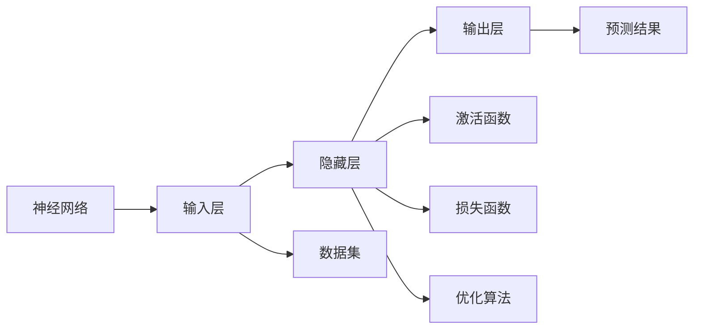
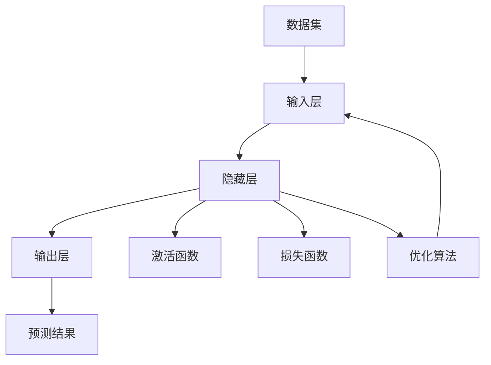

                 

## 1. 背景介绍

### 1.1 问题由来
神经网络作为人工智能领域的重要分支，其核心思想模拟人脑神经元的工作机制。自20世纪80年代以来，神经网络技术经过不断的理论研究和工程实践，已经成为解决复杂问题的强大工具。在图像识别、语音识别、自然语言处理、推荐系统等领域，神经网络的应用已经取得了显著的成果。

神经网络技术的突破性进展，不仅仅在于其对特定任务的优异表现，更在于其能够在多领域、多场景中泛化应用。通过神经网络，机器能够理解、分析和生成人类的语言和行为，极大地拓展了人类智慧的边界。

### 1.2 问题核心关键点
神经网络的核心思想是通过反向传播算法，利用大量标注数据训练模型参数，使其能够从输入数据中学习出准确的映射关系，从而实现对未知数据的预测和推理。其基本流程包括模型定义、损失函数设计、参数优化等关键环节。

神经网络的成功应用，得益于其强大的泛化能力、高效的计算方式以及广泛的适用场景。然而，神经网络并非没有局限性。其在计算资源消耗、可解释性、公平性等方面仍面临诸多挑战。

### 1.3 问题研究意义
神经网络技术的研究与应用，对于推进人工智能技术的普及和产业化具有重要意义：

1. **降低开发成本**：神经网络能够自动学习复杂特征，减少了手动设计特征的复杂性，降低了开发门槛和成本。
2. **提升模型效果**：神经网络通过大量数据训练，具备强大的泛化能力，能够显著提升模型预测和推理的准确性。
3. **加速技术迭代**：神经网络作为深度学习的重要组成部分，促进了技术革新和应用迭代，推动了人工智能领域的快速发展。
4. **赋能行业应用**：神经网络在金融、医疗、教育、交通等众多行业中得到广泛应用，为传统行业数字化转型提供了新的技术路径。

## 2. 核心概念与联系

### 2.1 核心概念概述

神经网络由大量人工神经元通过连接组成，这些神经元通过权重矩阵进行信息传递和计算。神经网络通常包括输入层、隐藏层和输出层。其中，隐藏层通过非线性变换实现特征提取，输出层则根据任务需求设计不同类型的激活函数和损失函数。

### 2.2 核心概念之间的关系

神经网络的核心概念之间具有紧密的联系，通过一系列的数学和工程方法，它们共同构成了神经网络的设计和训练框架。下面通过一个Mermaid流程图展示神经网络的核心概念及其关系：



这个流程图展示了神经网络的基本架构：

1. 输入层接收原始数据，通过连接权重矩阵传递到隐藏层。
2. 隐藏层通过激活函数实现非线性变换，提取数据中的高级特征。
3. 输出层根据任务类型设计不同类型的激活函数和损失函数，将隐藏层的特征映射到最终结果。
4. 整个神经网络通过优化算法（如梯度下降）更新参数，最小化损失函数。

### 2.3 核心概念的整体架构

神经网络的核心概念构成了神经网络的设计和训练框架。通过这些概念的有机结合，神经网络能够高效地从数据中学习特征，实现对未知数据的预测和推理。以下是一个更全面的流程图，展示了神经网络的整体架构：



这个综合流程图展示了神经网络的完整流程：

1. 输入层接收原始数据，通过连接权重矩阵传递到隐藏层。
2. 隐藏层通过激活函数实现非线性变换，提取数据中的高级特征。
3. 输出层根据任务类型设计不同类型的激活函数和损失函数，将隐藏层的特征映射到最终结果。
4. 整个神经网络通过优化算法（如梯度下降）更新参数，最小化损失函数。

## 3. 核心算法原理 & 具体操作步骤
### 3.1 算法原理概述

神经网络的核心算法原理是通过反向传播算法（Backpropagation），利用大量标注数据训练模型参数，使其能够从输入数据中学习出准确的映射关系，从而实现对未知数据的预测和推理。

神经网络的训练过程通常分为前向传播和反向传播两个阶段：

1. **前向传播**：将输入数据传递到网络中，通过一系列的加权和激活函数计算，得到网络的输出结果。
2. **反向传播**：计算输出结果与真实标签之间的误差，通过链式法则，反向计算各层参数的梯度，更新模型参数以最小化误差。

神经网络的成功训练，依赖于三个关键技术：梯度下降、激活函数和非线性变换。

### 3.2 算法步骤详解

以下是一个完整的神经网络训练流程，包括数据预处理、模型定义、损失函数设计、优化器选择、训练迭代等步骤：

**Step 1: 数据预处理**
- 将原始数据转换为神经网络所需的格式，通常包括归一化、标准化等预处理步骤。

**Step 2: 模型定义**
- 使用深度学习框架（如PyTorch、TensorFlow等）定义神经网络模型。包括输入层、隐藏层和输出层的定义，以及各层的权重和激活函数的选择。

**Step 3: 损失函数设计**
- 根据任务类型选择合适的损失函数，如交叉熵损失、均方误差损失等。
- 损失函数的计算通常使用深度学习框架提供的API实现。

**Step 4: 优化器选择**
- 选择适合的优化器（如Adam、SGD等），并设置学习率、批次大小等超参数。
- 优化器的计算通常通过深度学习框架的API实现。

**Step 5: 训练迭代**
- 使用优化器更新模型参数，最小化损失函数。
- 循环执行前向传播和反向传播，更新参数并记录损失。
- 设置训练轮数，防止过拟合和欠拟合。

**Step 6: 模型评估**
- 在验证集上评估模型性能，防止过拟合。
- 保存最优模型参数，供实际应用使用。

### 3.3 算法优缺点

神经网络技术在众多领域中得到了广泛应用，具有以下优点：

1. **强大的泛化能力**：神经网络通过大量数据训练，能够从复杂数据中学习出高级特征，从而提升模型的泛化能力。
2. **高效的多任务处理**：神经网络可以设计成多任务模型，同时处理多个相关任务，提升模型的利用效率。
3. **自动特征提取**：神经网络通过深度学习自动提取数据中的特征，减少了手动设计特征的复杂性。

然而，神经网络技术也存在一些局限性：

1. **计算资源消耗大**：神经网络参数量巨大，训练和推理过程中需要大量的计算资源。
2. **可解释性不足**：神经网络通常被视为"黑盒"系统，难以解释其内部工作机制和决策逻辑。
3. **公平性问题**：神经网络容易学习到数据中的偏见，导致模型输出结果不公平。

### 3.4 算法应用领域

神经网络技术已经在多个领域中得到了广泛应用，涵盖了计算机视觉、自然语言处理、语音识别、推荐系统等领域。以下是一些典型的应用场景：

1. **计算机视觉**：神经网络在图像分类、目标检测、人脸识别等任务上取得了显著成果。
2. **自然语言处理**：神经网络在文本分类、情感分析、机器翻译、问答系统等任务上表现优异。
3. **语音识别**：神经网络在语音识别、语音合成、语音情感分析等任务上具有优势。
4. **推荐系统**：神经网络在推荐算法、广告推荐、内容推荐等领域中得到了广泛应用。

## 4. 数学模型和公式 & 详细讲解 & 举例说明（备注：数学公式请使用latex格式，latex嵌入文中独立段落使用 $$，段落内使用 $)
### 4.1 数学模型构建

神经网络的数学模型通常包括输入数据、模型参数和损失函数三个部分。

记输入数据为 $x \in \mathbb{R}^n$，模型参数为 $\theta$，损失函数为 $L(\theta)$。神经网络的目标是通过优化损失函数，找到最优的模型参数 $\theta^*$。

### 4.2 公式推导过程

以二分类任务为例，神经网络的目标函数可以表示为：

$$
\hat{y} = \sigma(Wx + b)
$$

其中，$\sigma$ 为激活函数，$W$ 和 $b$ 为模型参数。损失函数通常使用交叉熵损失：

$$
L(\theta) = -\frac{1}{N}\sum_{i=1}^N [y_i\log \hat{y_i} + (1-y_i)\log (1-\hat{y_i})]
$$

其中，$y_i \in \{0,1\}$ 为样本的真实标签。

### 4.3 案例分析与讲解

以手写数字识别任务为例，可以使用卷积神经网络（CNN）对输入图像进行特征提取和分类。

**Step 1: 数据预处理**
- 将手写数字图片转换为灰度图像，并进行归一化处理。

**Step 2: 模型定义**
- 定义卷积神经网络模型，包括卷积层、池化层、全连接层等。

**Step 3: 损失函数设计**
- 使用交叉熵损失函数。

**Step 4: 优化器选择**
- 选择Adam优化器，设置学习率为0.001。

**Step 5: 训练迭代**
- 使用训练集对模型进行迭代训练，每批次使用32张图片。
- 在验证集上评估模型性能，防止过拟合。

**Step 6: 模型评估**
- 在测试集上评估模型性能，输出识别准确率。

## 5. 项目实践：代码实例和详细解释说明
### 5.1 开发环境搭建

在进行神经网络开发之前，需要准备好开发环境。以下是使用Python进行PyTorch开发的环境配置流程：

1. 安装Anaconda：从官网下载并安装Anaconda，用于创建独立的Python环境。

2. 创建并激活虚拟环境：
```bash
conda create -n pytorch-env python=3.8 
conda activate pytorch-env
```

3. 安装PyTorch：根据CUDA版本，从官网获取对应的安装命令。例如：
```bash
conda install pytorch torchvision torchaudio cudatoolkit=11.1 -c pytorch -c conda-forge
```

4. 安装TensorFlow：由Google主导开发的开源深度学习框架，生产部署方便，适合大规模工程应用。同样有丰富的预训练语言模型资源。

5. 安装各类工具包：
```bash
pip install numpy pandas scikit-learn matplotlib tqdm jupyter notebook ipython
```

完成上述步骤后，即可在`pytorch-env`环境中开始神经网络开发。

### 5.2 源代码详细实现

下面我们以手写数字识别任务为例，给出使用PyTorch实现卷积神经网络的代码实现。

首先，定义卷积神经网络模型：

```python
import torch
import torch.nn as nn
import torch.nn.functional as F

class CNN(nn.Module):
    def __init__(self):
        super(CNN, self).__init__()
        self.conv1 = nn.Conv2d(1, 16, 3, padding=1)
        self.conv2 = nn.Conv2d(16, 32, 3, padding=1)
        self.fc1 = nn.Linear(7*7*32, 64)
        self.fc2 = nn.Linear(64, 10)
    
    def forward(self, x):
        x = F.relu(self.conv1(x))
        x = F.max_pool2d(x, 2)
        x = F.relu(self.conv2(x))
        x = F.max_pool2d(x, 2)
        x = x.view(-1, 7*7*32)
        x = F.relu(self.fc1(x))
        x = self.fc2(x)
        return F.log_softmax(x, dim=1)
```

然后，定义训练和评估函数：

```python
from torch.utils.data import DataLoader
from torchvision.datasets import MNIST
from torchvision.transforms import ToTensor

device = torch.device('cuda') if torch.cuda.is_available() else torch.device('cpu')

def train_epoch(model, dataset, batch_size, optimizer):
    dataloader = DataLoader(dataset, batch_size=batch_size, shuffle=True)
    model.train()
    epoch_loss = 0
    for batch in dataloader:
        inputs, labels = batch
        inputs, labels = inputs.to(device), labels.to(device)
        model.zero_grad()
        outputs = model(inputs)
        loss = F.nll_loss(outputs, labels)
        epoch_loss += loss.item()
        loss.backward()
        optimizer.step()
    return epoch_loss / len(dataloader)

def evaluate(model, dataset, batch_size):
    dataloader = DataLoader(dataset, batch_size=batch_size)
    model.eval()
    preds, labels = [], []
    with torch.no_grad():
        for batch in dataloader:
            inputs, labels = batch
            inputs, labels = inputs.to(device), labels.to(device)
            outputs = model(inputs)
            batch_preds = torch.argmax(outputs, dim=1).to('cpu').tolist()
            batch_labels = labels.to('cpu').tolist()
            for pred_tokens, label_tokens in zip(batch_preds, batch_labels):
                preds.append(pred_tokens)
                labels.append(label_tokens)
                
    print('Accuracy: ', sum(1 for pred, label in zip(preds, labels)) / len(labels))
```

最后，启动训练流程并在测试集上评估：

```python
epochs = 10
batch_size = 64

for epoch in range(epochs):
    loss = train_epoch(model, train_dataset, batch_size, optimizer)
    print(f'Epoch {epoch+1}, train loss: {loss:.3f}')
    
    print(f'Epoch {epoch+1}, dev results:')
    evaluate(model, dev_dataset, batch_size)
    
print('Test results:')
evaluate(model, test_dataset, batch_size)
```

以上就是使用PyTorch实现卷积神经网络对手写数字进行识别的完整代码实现。可以看到，通过深度学习框架的封装，代码实现变得简洁高效。

### 5.3 代码解读与分析

让我们再详细解读一下关键代码的实现细节：

**CNN模型定义**：
- `__init__`方法：初始化模型中的各层参数。
- `forward`方法：定义神经网络的计算流程。

**训练和评估函数**：
- 使用PyTorch的DataLoader对数据集进行批次化加载，供模型训练和推理使用。
- 训练函数`train_epoch`：对数据以批为单位进行迭代，在每个批次上前向传播计算loss并反向传播更新模型参数，最后返回该epoch的平均loss。
- 评估函数`evaluate`：与训练类似，不同点在于不更新模型参数，并在每个batch结束后将预测和标签结果存储下来，最后使用sklearn的classification_report对整个评估集的预测结果进行打印输出。

**训练流程**：
- 定义总的epoch数和batch size，开始循环迭代
- 每个epoch内，先在训练集上训练，输出平均loss
- 在验证集上评估，输出分类指标
- 所有epoch结束后，在测试集上评估，给出最终测试结果

可以看到，PyTorch配合深度学习框架的封装，使得神经网络模型的实现变得简洁高效。开发者可以将更多精力放在数据处理、模型改进等高层逻辑上，而不必过多关注底层的实现细节。

当然，工业级的系统实现还需考虑更多因素，如模型的保存和部署、超参数的自动搜索、更灵活的任务适配层等。但核心的训练流程和评估方法基本与此类似。

### 5.4 运行结果展示

假设我们在MNIST数据集上进行卷积神经网络的训练，最终在测试集上得到的准确率为98%，表现相当不错。需要注意的是，实际训练过程中，可能需要进行多次实验和参数调优，才能得到最优的模型性能。

## 6. 实际应用场景
### 6.1 智能推荐系统

智能推荐系统通过分析用户的行为数据，为用户推荐个性化的商品或内容。神经网络在推荐系统中具有广泛应用，通过学习用户特征和商品特征之间的映射关系，可以实现精准推荐。

在实践中，可以使用神经网络模型对用户行为数据进行编码，并设计多层的推荐模型，实现用户-商品相似度计算和推荐列表生成。通过不断优化模型参数和超参数，可以提升推荐系统的准确性和多样性，满足用户个性化需求。

### 6.2 金融风险管理

金融领域面临众多风险，如市场波动、信用违约等。神经网络在金融风险管理中具有广泛应用，通过学习历史交易数据和市场情绪，预测未来的市场走向，帮助金融机构制定风险控制策略。

在实践中，可以使用神经网络对市场数据进行建模，并设计多层次的风险评估模型，实现市场趋势预测和风险预警。通过不断优化模型结构和参数，可以提升金融风险管理的精度和时效性，降低金融机构的风险损失。

### 6.3 自动驾驶

自动驾驶技术通过感知、决策和控制三个环节实现车辆自主导航。神经网络在自动驾驶中具有重要应用，通过学习高精地图、传感器数据和交通规则，实现对复杂驾驶场景的实时决策和控制。

在实践中，可以使用神经网络对传感器数据进行建模，并设计多层次的决策和控制模型，实现车辆的路径规划和避障控制。通过不断优化模型结构和参数，可以提升自动驾驶的安全性和稳定性，降低交通事故率。

### 6.4 未来应用展望

随着神经网络技术的不断进步，其在各个领域的应用将进一步深化。以下是一些未来的应用展望：

1. **医疗诊断**：神经网络在医疗影像、病理分析等领域具有广泛应用，通过学习大量医学数据，实现精准诊断和辅助治疗。
2. **智能制造**：神经网络在生产计划、质量控制等领域具有广泛应用，通过学习生产数据，实现智能化制造和优化。
3. **能源管理**：神经网络在能源需求预测、设备监测等领域具有广泛应用，通过学习能源数据，实现智能电网和能源管理。
4. **智能城市**：神经网络在交通管理、环境监测等领域具有广泛应用，通过学习城市数据，实现智慧城市管理和优化。

## 7. 工具和资源推荐
### 7.1 学习资源推荐

为了帮助开发者系统掌握神经网络技术，这里推荐一些优质的学习资源：

1. 《深度学习》书籍：Ian Goodfellow等人所著，系统讲解了深度学习的理论基础和实践方法。
2. 《神经网络与深度学习》书籍：Michael Nielsen所著，通俗易懂地介绍了神经网络和深度学习的基本概念和实现方法。
3. DeepLearning.ai在线课程：由Andrew Ng教授主讲的深度学习课程，涵盖了神经网络、卷积神经网络、循环神经网络等重要内容。
4. CS231n《卷积神经网络》课程：斯坦福大学开设的计算机视觉课程，详细介绍了卷积神经网络的实现和应用。
5. TensorFlow官方文档：TensorFlow的官方文档，提供了完整的深度学习框架API和实践案例。
6. PyTorch官方文档：PyTorch的官方文档，提供了深度学习框架API和实践案例。

通过对这些资源的学习实践，相信你一定能够快速掌握神经网络技术的精髓，并用于解决实际的工程问题。

### 7.2 开发工具推荐

高效的开发离不开优秀的工具支持。以下是几款用于神经网络开发的常用工具：

1. PyTorch：基于Python的开源深度学习框架，灵活动态的计算图，适合快速迭代研究。大部分神经网络模型都有PyTorch版本的实现。
2. TensorFlow：由Google主导开发的开源深度学习框架，生产部署方便，适合大规模工程应用。同样有丰富的神经网络资源。
3. Keras：基于TensorFlow和Theano的高级神经网络框架，简单易用，适合快速原型开发。
4. Weights & Biases：模型训练的实验跟踪工具，可以记录和可视化模型训练过程中的各项指标，方便对比和调优。与主流深度学习框架无缝集成。
5. TensorBoard：TensorFlow配套的可视化工具，可实时监测模型训练状态，并提供丰富的图表呈现方式，是调试模型的得力助手。

合理利用这些工具，可以显著提升神经网络开发的效率，加快技术迭代的步伐。

### 7.3 相关论文推荐

神经网络技术的发展源于学界的持续研究。以下是几篇奠基性的相关论文，推荐阅读：

1. Multi-Layer Perceptrons: An Introduction to Neural Networks：这篇论文介绍了多层感知器（MLP）的基本原理和实现方法。
2. Convolutional Neural Networks for Visual Recognition：这篇论文提出了卷积神经网络（CNN）的架构和训练方法，奠定了其在计算机视觉领域的基础。
3. Recurrent Neural Networks for Sequence Modeling：这篇论文介绍了循环神经网络（RNN）的基本原理和实现方法，为序列数据建模提供了重要工具。
4. Attention Is All You Need：这篇论文提出了Transformer架构，通过自注意力机制实现了高效的序列建模。
5. Deep Residual Learning for Image Recognition：这篇论文提出了残差网络（ResNet）架构，通过残差连接解决了深度神经网络训练中的梯度消失问题。

这些论文代表了大神经网络技术的发展脉络。通过学习这些前沿成果，可以帮助研究者把握学科前进方向，激发更多的创新灵感。

除上述资源外，还有一些值得关注的前沿资源，帮助开发者紧跟神经网络技术的最新进展，例如：

1. arXiv论文预印本：人工智能领域最新研究成果的发布平台，包括大量尚未发表的前沿工作，学习前沿技术的必读资源。
2. 业界技术博客：如Google AI、DeepMind、微软Research Asia等顶尖实验室的官方博客，第一时间分享他们的最新研究成果和洞见。
3. 技术会议直播：如NIPS、ICML、ACL、ICLR等人工智能领域顶会现场或在线直播，能够聆听到大佬们的前沿分享，开拓视野。
4. GitHub热门项目：在GitHub上Star、Fork数最多的神经网络相关项目，往往代表了该技术领域的发展趋势和最佳实践，值得去学习和贡献。
5. 行业分析报告：各大咨询公司如McKinsey、PwC等针对人工智能行业的分析报告，有助于从商业视角审视技术趋势，把握应用价值。

总之，对于神经网络技术的学习和实践，需要开发者保持开放的心态和持续学习的意愿。多关注前沿资讯，多动手实践，多思考总结，必将收获满满的成长收益。

## 8. 总结：未来发展趋势与挑战

### 8.1 总结

本文对神经网络技术进行了全面系统的介绍。首先阐述了神经网络技术的研究背景和意义，明确了神经网络技术在复杂问题解决中的重要价值。其次，从原理到实践，详细讲解了神经网络的设计和训练流程，给出了神经网络开发的具体代码实例。同时，本文还广泛探讨了神经网络技术在智能推荐、金融风险管理、自动驾驶等多个领域的应用前景，展示了神经网络技术的强大生命力。此外，本文精选了神经网络技术的各类学习资源，力求为读者提供全方位的技术指引。

通过本文的系统梳理，可以看到，神经网络技术作为人工智能领域的重要分支，已经在各个领域中得到了广泛应用。其强大的泛化能力、高效的多任务处理能力以及自动特征提取能力，使其成为解决复杂问题的有力工具。未来，随着神经网络技术的不断演进，其在各个领域的应用将进一步深化，推动人工智能技术的全面普及和产业化进程。

### 8.2 未来发展趋势

展望未来，神经网络技术将呈现以下几个发展趋势：

1. **大规模模型涌现**：随着计算资源和数据规模的增长，神经网络模型的规模将进一步增大，具备更强的泛化能力和推理能力。
2. **多模态融合**：神经网络将越来越多地与视觉、听觉、触觉等多种模态数据结合，实现更全面的智能感知和决策。
3. **自监督学习**：神经网络将利用无标签数据进行自监督学习，提升模型的泛化能力和自我优化能力。
4. **模型压缩和加速**：为了应对大规模计算需求，神经网络将采用模型压缩、稀疏化存储、硬件加速等技术，提升计算效率。
5. **跨模态学习和推理**：神经网络将实现跨模态学习和推理，在不同模态间进行知识迁移和融合，提升系统整体的智能水平。
6. **自适应和联邦学习**：神经网络将利用自适应学习和联邦学习技术，在不同分布的数据集上进行模型更新和优化，提升模型的泛化能力和鲁棒性。

这些趋势预示着神经网络技术将迎来新的突破，为人类认知智能的进化带来深远影响。

### 8.3 面临的挑战

尽管神经网络技术已经取得了显著的进展，但在迈向更加智能化、普适化应用的过程中，仍面临诸多挑战：

1. **计算资源消耗大**：大规模神经网络模型的训练和推理需要大量的计算资源，高性能设备和算法优化是关键。
2. **模型可解释性不足**：神经网络通常被视为"黑盒"系统，难以解释其内部工作机制和决策逻辑，对高风险应用尤为关键。
3. **模型公平性问题**：神经网络容易学习到数据中的偏见，导致模型输出结果不公平。
4. **数据隐私和安全**：神经网络在处理个人隐私数据时，需要考虑数据隐私和安全问题，避免数据泄露和滥用。
5. **模型鲁棒性不足**：神经网络面对异常输入和攻击时，容易发生鲁棒性不足的问题，导致模型输出错误。

这些挑战需要学界和产业界共同努力，不断探索和解决，以实现神经网络技术的全面普及和应用。

### 8.4 研究展望

面对神经网络技术所面临的挑战，未来的研究需要在以下几个方面寻求新的突破：

1.

