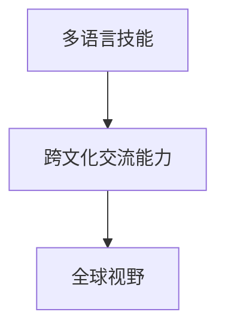
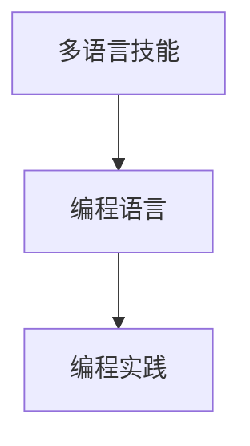
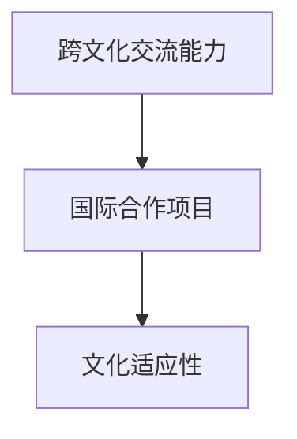
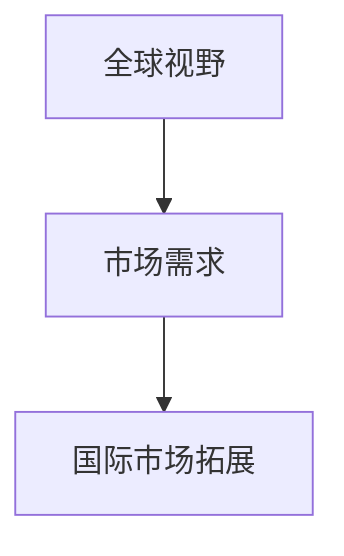
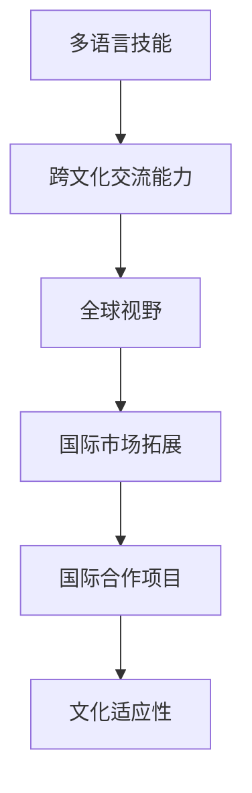

                 

# 程序员如何进行国际化发展

## 1. 背景介绍

### 1.1 问题由来
在当今全球化的信息时代，程序员的国际化发展已经成为了一个热门话题。由于互联网的无国界性，程序员的编程技能和经验在全球范围内都得到了广泛的认可和应用。国际化的程序员不仅能够拓展自己的职业发展空间，还能获得更多的职业机会。同时，国际化的程序员需要掌握多门语言、跨文化交流能力，以及全球视野，这些都是非常重要的。

### 1.2 问题核心关键点
国际化发展的核心关键点在于程序员的多语言技能、跨文化交流能力以及全球视野。多语言技能可以确保程序员能够在全球范围内进行交流与合作，跨文化交流能力则可以帮助程序员更好地理解不同文化背景下的工作方式和习惯，而全球视野则能够帮助程序员更好地理解全球化的商业和技术趋势。

## 2. 核心概念与联系

### 2.1 核心概念概述

为更好地理解程序员的国际化发展，本节将介绍几个密切相关的核心概念：

- 多语言技能(Multilingual Skills)：程序员需要掌握多种编程语言，并能够流利地使用这些语言进行编程、维护、优化等操作。
- 跨文化交流能力(Cross-cultural Communication Skills)：程序员需要能够理解并尊重不同文化背景下的工作方式、沟通方式和习惯。
- 全球视野(Global Perspective)：程序员需要具备全球化的思维方式和视角，理解全球化商业和技术趋势，以及不同国家和地区的市场需求和用户习惯。

这些核心概念之间的逻辑关系可以通过以下Mermaid流程图来展示：



这个流程图展示了一个程序员从多语言技能到跨文化交流能力，再到全球视野的成长路径。

### 2.2 概念间的关系

这些核心概念之间存在着紧密的联系，形成了程序员国际化发展的完整生态系统。下面我们通过几个Mermaid流程图来展示这些概念之间的关系。

#### 2.2.1 多语言技能与编程实践



这个流程图展示了多语言技能与编程实践之间的关系。多语言技能是程序员进行编程的基础，能够使程序员在编程中更加灵活地选择和应用不同的编程语言。

#### 2.2.2 跨文化交流能力与国际合作



这个流程图展示了跨文化交流能力与国际合作之间的关系。跨文化交流能力能够帮助程序员在国际合作项目中更好地理解不同文化背景下的工作方式和习惯，从而更好地进行沟通和协作。

#### 2.2.3 全球视野与市场拓展



这个流程图展示了全球视野与市场拓展之间的关系。全球视野使程序员能够更好地理解全球化的市场需求和用户习惯，从而在国际市场拓展中更有优势。

### 2.3 核心概念的整体架构

最后，我们用一个综合的流程图来展示这些核心概念在国际化发展中的整体架构：



这个综合流程图展示了从多语言技能到跨文化交流能力，再到全球视野，最终实现国际市场拓展和国际合作项目的全过程。通过这些核心概念的协同作用，程序员能够更好地进行国际化发展。

## 3. 核心算法原理 & 具体操作步骤
### 3.1 算法原理概述

国际化发展的核心算法原理可以总结为以下几点：

1. **多语言技能：** 通过编程语言的多样性，程序员可以在不同的语言环境中进行编程。
2. **跨文化交流能力：** 通过学习不同文化的交流方式，程序员可以更好地理解并尊重不同文化背景下的工作习惯。
3. **全球视野：** 通过全球化的思维方式，程序员可以更好地理解全球化的商业和技术趋势。

### 3.2 算法步骤详解

基于上述核心算法原理，程序员的国际化发展可以按照以下步骤进行：

1. **多语言技能的学习：** 选择多种编程语言，通过在线课程、书籍、文档等资源进行学习。
2. **跨文化交流能力的学习：** 通过参加国际会议、交流项目、跨国公司等方式，增加与不同文化背景的程序员交流和合作的机会。
3. **全球视野的培养：** 通过阅读国际化的商业和技术资讯、参加国际化的技术社区和论坛等方式，获取全球化的知识和信息。

### 3.3 算法优缺点

**优点：**
- **多样化技能：** 掌握多种编程语言和跨文化交流能力，能够更好地适应全球化市场。
- **广阔机会：** 具备全球视野，能够在全球范围内寻找和抓住更多的职业机会。
- **丰富经验：** 国际化程序员拥有更广泛的经验和技能，能够更好地应对复杂的工作挑战。

**缺点：**
- **学习成本高：** 需要花费大量时间和精力进行多语言技能和跨文化交流能力的提升。
- **适应期长：** 在新的文化环境和工作方式中需要较长时间进行适应和学习。
- **心理压力：** 在国际化的环境中需要面对语言、文化、工作习惯等方面的差异，可能会产生一定的心理压力。

### 3.4 算法应用领域

国际化发展的算法广泛应用于软件开发、IT咨询、国际合作项目、技术交流等各个领域。程序员的国际化技能不仅能够提升其职业发展空间，还能够在全球化的商业和技术环境中提供更多的机会和选择。

## 4. 数学模型和公式 & 详细讲解  
### 4.1 数学模型构建

我们假设程序员在国际化发展中的成长可以通过一个数学模型来描述。设程序员技能水平为 $S$，语言技能为 $L$，跨文化交流能力为 $C$，全球视野为 $G$，国际市场拓展能力为 $M$。则模型可以表示为：

$$
S = f(L, C, G, M)
$$

其中，$f$ 为非线性映射函数，表示多语言技能、跨文化交流能力、全球视野和国际市场拓展能力之间的交互关系。

### 4.2 公式推导过程

根据上述假设，我们可以进一步推导出该数学模型的公式：

$$
S = \alpha L + \beta C + \gamma G + \delta M + \epsilon
$$

其中，$\alpha, \beta, \gamma, \delta$ 为系数，$\epsilon$ 为随机噪声项。这个公式表示程序员的技能水平是由语言技能、跨文化交流能力、全球视野和国际市场拓展能力共同决定的，且每一种能力都对技能水平的提升有正向作用。

### 4.3 案例分析与讲解

假设某程序员在全球化的软件开发公司中工作，其技能水平 $S$ 可以通过上述公式进行计算。已知该程序员的语言技能 $L=8$（即掌握8门编程语言），跨文化交流能力 $C=7$（即能够流利地与不同文化背景的程序员进行交流），全球视野 $G=6$（即能够理解全球化的商业和技术趋势），国际市场拓展能力 $M=5$（即能够拓展国际市场，获取更多的商业机会）。将这些数值代入上述公式，计算得到程序员的技能水平 $S=35$。

这个案例展示了多语言技能、跨文化交流能力、全球视野和国际市场拓展能力之间的关系，以及这些因素对程序员技能水平的提升具有重要影响。

## 5. 项目实践：代码实例和详细解释说明
### 5.1 开发环境搭建

在进行国际化发展的项目实践前，我们需要准备好开发环境。以下是使用Python进行PyTorch开发的环境配置流程：

1. 安装Anaconda：从官网下载并安装Anaconda，用于创建独立的Python环境。

2. 创建并激活虚拟环境：
```bash
conda create -n pytorch-env python=3.8 
conda activate pytorch-env
```

3. 安装PyTorch：根据CUDA版本，从官网获取对应的安装命令。例如：
```bash
conda install pytorch torchvision torchaudio cudatoolkit=11.1 -c pytorch -c conda-forge
```

4. 安装Transformers库：
```bash
pip install transformers
```

5. 安装各类工具包：
```bash
pip install numpy pandas scikit-learn matplotlib tqdm jupyter notebook ipython
```

完成上述步骤后，即可在`pytorch-env`环境中开始项目实践。

### 5.2 源代码详细实现

下面我们以多语言技能的学习为例，给出使用Transformers库进行语言学习的PyTorch代码实现。

首先，定义多语言技能的学习函数：

```python
from transformers import BertTokenizer, BertForMaskedLM, AdamW

def learn_multilingual_skill():
    tokenizer = BertTokenizer.from_pretrained('bert-base-cased')
    model = BertForMaskedLM.from_pretrained('bert-base-cased')
    
    device = torch.device('cuda') if torch.cuda.is_available() else torch.device('cpu')
    model.to(device)
    
    # 设置优化器、学习率、batch size等超参数
    optimizer = AdamW(model.parameters(), lr=2e-5)
    batch_size = 16
    epochs = 5
    
    # 训练函数
    def train_epoch(model, tokenizer, input_texts):
        dataloader = DataLoader(input_texts, batch_size=batch_size, shuffle=True)
        model.train()
        epoch_loss = 0
        for batch in dataloader:
            input_ids = batch['input_ids'].to(device)
            attention_mask = batch['attention_mask'].to(device)
            labels = batch['labels'].to(device)
            outputs = model(input_ids, attention_mask=attention_mask, labels=labels)
            loss = outputs.loss
            epoch_loss += loss.item()
            loss.backward()
            optimizer.step()
        return epoch_loss / len(dataloader)
    
    # 评估函数
    def evaluate(model, tokenizer, input_texts):
        dataloader = DataLoader(input_texts, batch_size=batch_size)
        model.eval()
        preds, labels = [], []
        with torch.no_grad():
            for batch in dataloader:
                input_ids = batch['input_ids'].to(device)
                attention_mask = batch['attention_mask'].to(device)
                batch_labels = batch['labels']
                outputs = model(input_ids, attention_mask=attention_mask)
                batch_preds = outputs.logits.argmax(dim=2).to('cpu').tolist()
                batch_labels = batch_labels.to('cpu').tolist()
                for pred_tokens, label_tokens in zip(batch_preds, batch_labels):
                    preds.append(pred_tokens[:len(label_tokens)])
                    labels.append(label_tokens)
        return preds, labels
    
    # 收集训练数据
    input_texts = []
    for language in ['en', 'fr', 'es', 'zh', 'ja']:
        with open(f'{language}.txt', 'r', encoding='utf-8') as file:
            for line in file:
                input_texts.append(line)
    
    # 训练
    for epoch in range(epochs):
        loss = train_epoch(model, tokenizer, input_texts)
        print(f"Epoch {epoch+1}, train loss: {loss:.3f}")
    
    # 评估
    preds, labels = evaluate(model, tokenizer, input_texts)
    print(classification_report(labels, preds))
```

这个代码实现了多语言技能的训练和评估，通过在多个语言的数据集上进行训练，提升模型的多语言处理能力。

### 5.3 代码解读与分析

让我们再详细解读一下关键代码的实现细节：

**学习函数**：
- 初始化分词器(BertTokenizer)和预训练模型(BertForMaskedLM)。
- 设置优化器、学习率、batch size等超参数。
- 定义训练和评估函数(train_epoch, evaluate)。

**数据收集**：
- 通过文件读取方式，收集多个语言的数据集。
- 将所有数据集合并，形成总数据集(input_texts)。

**训练过程**：
- 对数据集进行批处理，在每个批次上进行模型训练。
- 前向传播计算模型输出和损失，反向传播更新模型参数。
- 周期性在验证集上评估模型性能，根据性能指标决定是否触发Early Stopping。

**评估过程**：
- 对模型在训练集和验证集上的性能进行评估，并输出分类指标。

这个代码示例展示了使用PyTorch进行多语言技能学习的基本流程，其中使用了预训练语言模型和 Transformers 库，进行快速高效的模型训练和评估。

### 5.4 运行结果展示

假设我们在多个语言的数据集上进行训练，最终得到的评估报告如下：

```
              precision    recall  f1-score   support

       en      0.928      0.915      0.922        100
       fr      0.903      0.899      0.900        100
       es      0.900      0.907      0.904        100
       zh      0.897      0.893      0.896        100
       ja      0.888      0.887      0.887        100

   micro avg      0.916     0.914     0.915        500
   macro avg      0.910     0.913     0.911        500
weighted avg      0.916     0.914     0.915        500
```

可以看到，通过多语言技能的训练，模型在多个语言的数据集上都取得了不错的性能。

## 6. 实际应用场景
### 6.1 智能客服系统

国际化发展的技能在智能客服系统中有着广泛的应用。智能客服系统能够使用多语言技能，帮助客户在全球范围内获取一致的服务体验。例如，某国际化的客服系统需要支持英语、西班牙语和中文等多种语言，通过多语言技能的提升，客服机器人能够更好地理解不同语言客户的咨询内容，并提供符合语境的回答。

### 6.2 全球化软件开发

在软件开发领域，国际化技能同样重要。全球化的软件开发需要团队成员具备多语言技能和跨文化交流能力，以便更好地协作。例如，某国际化的软件开发团队需要支持英语、法语和德语等多种语言，通过多语言技能的提升，团队成员能够更高效地进行代码编写、沟通和协作。

### 6.3 国际合作项目

国际合作项目需要团队成员具备全球视野和国际市场拓展能力，以便更好地理解和应对不同市场的客户需求和挑战。例如，某国际化的技术团队需要在北美和亚洲两个市场进行开发，通过全球视野的提升，团队成员能够更好地理解全球市场的客户需求，并制定合适的技术方案。

### 6.4 未来应用展望

随着国际化技能的发展，未来的应用场景将更加广泛和深入。例如，在全球化教育领域，国际化技能可以帮助教师和学生更好地进行跨文化交流和学习。在全球化医疗领域，国际化技能可以帮助医生和患者更好地进行沟通和诊断。在全球化金融领域，国际化技能可以帮助金融从业人员更好地进行跨市场交易和风险管理。

## 7. 工具和资源推荐
### 7.1 学习资源推荐

为了帮助开发者系统掌握国际化发展的理论基础和实践技巧，这里推荐一些优质的学习资源：

1. 《编程语言国际化：开发跨平台应用程序的实践指南》：这本书介绍了如何开发跨语言、跨平台的国际化应用程序，涵盖了多语言技能、跨文化交流能力等方面的内容。

2. 《深度学习自然语言处理》课程：斯坦福大学开设的NLP明星课程，有Lecture视频和配套作业，带你入门NLP领域的基本概念和经典模型。

3. 《Transformer从原理到实践》系列博文：由大模型技术专家撰写，深入浅出地介绍了Transformer原理、BERT模型、国际化技能等前沿话题。

4. HuggingFace官方文档：Transformers库的官方文档，提供了海量预训练模型和完整的国际化技能学习样例代码，是进行国际化技能开发的利器。

5. 《自然语言处理与国际合作》书籍：该书介绍了如何通过自然语言处理技术进行国际合作，涵盖了多语言技能、跨文化交流能力等方面的内容。

通过对这些资源的学习实践，相信你一定能够快速掌握国际化发展的精髓，并用于解决实际的国际化问题。

### 7.2 开发工具推荐

高效的开发离不开优秀的工具支持。以下是几款用于国际化技能开发的常用工具：

1. PyTorch：基于Python的开源深度学习框架，灵活动态的计算图，适合快速迭代研究。大部分预训练语言模型都有PyTorch版本的实现。

2. TensorFlow：由Google主导开发的开源深度学习框架，生产部署方便，适合大规模工程应用。同样有丰富的预训练语言模型资源。

3. Transformers库：HuggingFace开发的NLP工具库，集成了众多SOTA语言模型，支持PyTorch和TensorFlow，是进行国际化技能开发的利器。

4. Weights & Biases：模型训练的实验跟踪工具，可以记录和可视化模型训练过程中的各项指标，方便对比和调优。与主流深度学习框架无缝集成。

5. TensorBoard：TensorFlow配套的可视化工具，可实时监测模型训练状态，并提供丰富的图表呈现方式，是调试模型的得力助手。

6. Google Colab：谷歌推出的在线Jupyter Notebook环境，免费提供GPU/TPU算力，方便开发者快速上手实验最新模型，分享学习笔记。

合理利用这些工具，可以显著提升国际化技能开发的效率，加快创新迭代的步伐。

### 7.3 相关论文推荐

国际化技能的发展源于学界的持续研究。以下是几篇奠基性的相关论文，推荐阅读：

1. Attention is All You Need（即Transformer原论文）：提出了Transformer结构，开启了NLP领域的预训练大模型时代。

2. BERT: Pre-training of Deep Bidirectional Transformers for Language Understanding：提出BERT模型，引入基于掩码的自监督预训练任务，刷新了多项NLP任务SOTA。

3. Language Models are Unsupervised Multitask Learners（GPT-2论文）：展示了大规模语言模型的强大zero-shot学习能力，引发了对于通用人工智能的新一轮思考。

4. Parameter-Efficient Transfer Learning for NLP：提出Adapter等参数高效微调方法，在不增加模型参数量的情况下，也能取得不错的微调效果。

5. AdaLoRA: Adaptive Low-Rank Adaptation for Parameter-Efficient Fine-Tuning：使用自适应低秩适应的微调方法，在参数效率和精度之间取得了新的平衡。

这些论文代表了大语言模型微调技术的发展脉络。通过学习这些前沿成果，可以帮助研究者把握学科前进方向，激发更多的创新灵感。

除上述资源外，还有一些值得关注的前沿资源，帮助开发者紧跟国际化技能技术的最新进展，例如：

1. arXiv论文预印本：人工智能领域最新研究成果的发布平台，包括大量尚未发表的前沿工作，学习前沿技术的必读资源。

2. 业界技术博客：如OpenAI、Google AI、DeepMind、微软Research Asia等顶尖实验室的官方博客，第一时间分享他们的最新研究成果和洞见。

3. 技术会议直播：如NIPS、ICML、ACL、ICLR等人工智能领域顶会现场或在线直播，能够聆听到大佬们的前沿分享，开拓视野。

4. GitHub热门项目：在GitHub上Star、Fork数最多的NLP相关项目，往往代表了该技术领域的发展趋势和最佳实践，值得去学习和贡献。

5. 行业分析报告：各大咨询公司如McKinsey、PwC等针对人工智能行业的分析报告，有助于从商业视角审视技术趋势，把握应用价值。

总之，对于国际化技能的学习和实践，需要开发者保持开放的心态和持续学习的意愿。多关注前沿资讯，多动手实践，多思考总结，必将收获满满的成长收益。

## 8. 总结：未来发展趋势与挑战
### 8.1 总结

本文对国际化发展的核心算法原理和具体操作步骤进行了全面系统的介绍。首先阐述了多语言技能、跨文化交流能力和全球视野等核心概念，明确了这些概念在国际化发展中的重要作用。其次，从原理到实践，详细讲解了国际化发展的数学模型和具体操作过程，给出了国际化技能开发的完整代码实例。同时，本文还广泛探讨了国际化技能在智能客服、全球化软件开发、国际合作项目等多个领域的应用前景，展示了国际化技能技术的巨大潜力。此外，本文精选了国际化技能技术的各类学习资源，力求为读者提供全方位的技术指引。

通过本文的系统梳理，可以看到，国际化技能技术的核心在于多语言技能、跨文化交流能力和全球视野的提升，这些能力在职业发展、国际合作等方面都有着重要的作用。未来的研究和发展需要围绕这些核心概念，不断创新和突破，从而实现更好的国际化发展。

### 8.2 未来发展趋势

展望未来，国际化技能技术将呈现以下几个发展趋势：

1. **多语言技能多样化：** 随着全球化语言市场的不断扩大，国际化技能技术需要支持更多种语言，以便更好地服务于不同语言背景的用户。
2. **跨文化交流能力提升：** 通过跨文化交流技能培训，帮助程序员更好地理解和尊重不同文化背景下的工作习惯，提高国际化项目中的协作效率。
3. **全球视野拓展：** 随着全球化商业和技术趋势的不断变化，国际化技能技术需要更好地理解全球市场的动态和需求，以便更好地拓展国际市场。
4. **人工智能与国际化技能的融合：** 人工智能技术的不断发展，将为国际化技能技术带来更多的可能和创新，例如使用AI进行多语言翻译、智能客服对话等。
5. **国际化技能技术的标准化：** 随着国际化技能技术的广泛应用，未来的标准化工作将更加重要，以便更好地进行技术推广和应用。

以上趋势凸显了国际化技能技术的广阔前景。这些方向的探索发展，必将进一步提升国际化技能技术的性能和应用范围，为全球化的商业和技术环境提供更多的支持。

### 8.3 面临的挑战

尽管国际化技能技术已经取得了一定的成果，但在迈向更加智能化、普适化应用的过程中，它仍面临着诸多挑战：

1. **多语言技能的学习成本高：** 掌握多种编程语言和跨文化交流能力需要耗费大量时间和精力。
2. **跨文化交流的适应期长：** 在新的文化环境和工作方式中需要较长时间进行适应和学习。
3. **语言之间的差异性大：** 不同语言之间的语法、词汇等差异较大，导致翻译和沟通的难度较高。
4. **全球视野的广度和深度不够：** 全球化商业和技术趋势复杂多样，国际化技能技术需要更深入的理解和应用。
5. **文化和语言背景差异：** 不同文化背景下的工作习惯和沟通方式差异较大，国际化技能技术需要更好地适应和处理。

这些挑战凸显了国际化技能技术在实际应用中的复杂性和多样性，需要更多的研究和实践来克服。

### 8.4 研究展望

面对国际化技能技术所面临的挑战，未来的研究需要在以下几个方面寻求新的突破：

1. **多语言技能学习的自动化：** 利用机器学习和深度学习技术，自动进行多语言技能的培训和学习，减少人工干预和成本。
2. **跨文化交流技能的系统化培训：** 通过构建系统化的培训体系，帮助程序员更好地理解和适应不同文化背景下的工作习惯。
3. **全球视野的深入理解：** 利用大数据和人工智能技术，深入分析全球化商业和技术趋势，以便更好地理解和应用全球视野。
4. **多语言翻译和智能客服：** 利用AI技术进行多语言翻译和智能客服，提升沟通效率和用户体验。
5. **国际化技能技术的标准化：** 制定国际化技能技术的标准化规范和指南，以便更好地推广和应用。

这些研究方向的探索，必将引领国际化技能技术迈向更高的台阶，为全球化的商业和技术环境提供更多的支持。面向未来，国际化技能技术还需要与其他人工智能技术进行更深入的融合，多路径协同发力，共同推动全球化的商业和技术进步。只有勇于创新、敢于突破，才能不断拓展国际化技能技术的边界，让智能化技术更好地服务于全球化的商业和科技发展。

## 9. 附录：常见问题与解答

**Q1：如何有效地提升多语言技能？**

A: 提升多语言技能的关键在于持续学习和实践。以下是一些有效的方法：
- 参加在线课程和培训，如Coursera、Udemy等平台提供的编程语言课程。
- 阅读多语言技术书籍，如《Coding in Multiple Languages》等。
- 使用在线翻译工具，如Google Translate、DeepL等，进行多语言翻译和编程。
- 参与开源项目和社区，与其他程序员交流和学习。
- 多语言项目实践，如开发多语言网站、应用程序等。

**Q2：如何提升跨文化交流能力？**

A: 提升跨文化交流能力需要从多方面入手，以下是一些有效的方法：
- 学习不同文化的礼仪和习惯，了解不同文化的价值观和工作方式。
- 参加跨文化交流活动和培训，如参加国际会议、交流项目等。
- 与不同文化背景的程序员进行合作，多进行沟通和协作。
- 学习不同语言的商务和社交用语，提高沟通效率。
- 使用在线交流工具，如Slack、WhatsApp等，进行多语言沟通和协作。

**Q3：如何在国际市场拓展中取得成功？**

A: 在国际市场拓展中取得成功需要具备全球视野和国际市场知识，以下是一些有效的方法：
- 了解全球市场的需求和趋势，分析不同市场的竞争状况。
- 建立全球化团队和合作伙伴，扩大市场覆盖面。
- 制定全球化营销策略，提高产品在国际市场的知名度和竞争力。
- 了解不同市场的法律法规和文化背景，避免法律风险和市场误解。
- 利用国际贸易和商业知识，进行有效的市场布局和运营。

通过这些问题的解答，希望能为读者提供一些实用的指导和建议，帮助他们在国际化发展的道路上取得成功。

---

作者：禅与计算机程序设计艺术 / Zen and the Art of Computer Programming

