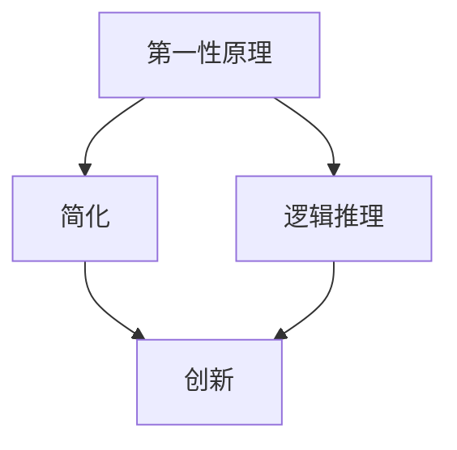
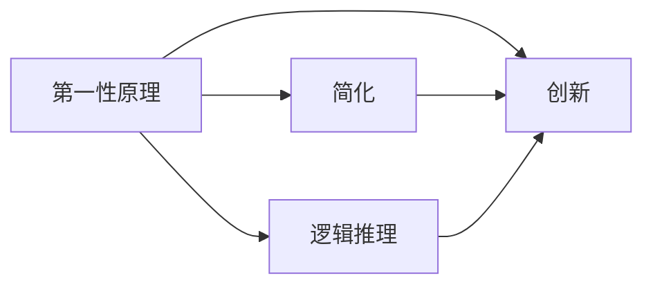

                 

# 第一性原理：科学思维的基础

第一性原理（First Principles）是古希腊哲学家亚里士多德提出的一个哲学概念，指的是所有知识和理论的根本出发点，无法进一步推导的、最基本的假设。在第一性原理的指导下，人们可以从最基本的定义和假设出发，通过逻辑推理构建复杂的理论体系。在现代科学领域，第一性原理同样被广泛应用，成为研究新现象、开发新技术的基石。本文将从第一性原理的定义和应用出发，探讨其在科学思维中的重要性，并结合实际案例说明如何应用第一性原理解决问题。

## 1. 背景介绍

### 1.1 第一性原理的提出

第一性原理的思想最早出现在亚里士多德的《形而上学》中，他提出：“所有科学和哲学的研究都应从第一性原理出发，通过逻辑推理构建理论。”此后，第一性原理在哲学、科学、工程等领域被广泛应用。现代科学中，第一性原理的应用特别普遍，尤其是在基础科学和技术研究中，人们常常用第一性原理重新思考旧有的问题，构建新理论。

### 1.2 第一性原理的必要性

在科学研究和工程技术中，第一性原理之所以重要，是因为它可以让我们重新审视已有理论和实践，摆脱过去错误的假设和固定的思维模式。通过重新构建基本假设和理论，我们可以从根本上解决问题，避免陷入传统观念的束缚。此外，第一性原理还可以促使人们深入思考，推动技术创新和科学发展。

## 2. 核心概念与联系

### 2.1 核心概念概述

- **第一性原理**：所有知识和理论的根本出发点，无法进一步推导的、最基本的假设。
- **简化**：在应用第一性原理时，我们需要将复杂的问题简化为最基本的元素，从而更容易理解和推理。
- **逻辑推理**：通过逻辑推理构建复杂的理论体系，解决实际问题。
- **创新**：第一性原理的应用可以推动技术创新和科学发展，打破传统思维的束缚。

### 2.2 概念间的关系

第一性原理与其他核心概念的关系可以总结如下：

- **第一性原理**：所有概念和理论的根本出发点，所有知识的基础。
- **简化**：第一性原理的应用需要简化问题，将复杂问题分解为基本元素。
- **逻辑推理**：通过逻辑推理构建新理论，解决实际问题。
- **创新**：逻辑推理和简化可以推动技术创新，打破传统思维的束缚。

下图展示了第一性原理与其他核心概念的关系：



### 2.3 核心概念的整体架构

第一性原理与其他核心概念一起构成了科学思维的完整框架，如下图：



## 3. 核心算法原理 & 具体操作步骤

### 3.1 算法原理概述

应用第一性原理时，我们需要从最基本的定义和假设出发，通过逻辑推理构建新的理论体系。具体而言，我们可以将复杂问题分解为基本的元素，从最基本的定义和假设出发，逐步构建复杂的理论体系，并验证其正确性。这个过程需要严格的逻辑推理和实验验证，以确保理论的可靠性。

### 3.2 算法步骤详解

第一性原理的应用步骤如下：

1. **定义问题**：将复杂问题简化为基本元素，明确问题的本质。
2. **设定基本假设**：基于第一性原理设定最基本的定义和假设。
3. **逻辑推理**：通过逻辑推理构建新的理论体系。
4. **实验验证**：通过实验验证理论的正确性。
5. **迭代改进**：根据实验结果不断改进理论，直至达到满意的解决方案。

### 3.3 算法优缺点

第一性原理的优点：

- 打破传统思维束缚，推动创新。
- 基于最基本的定义和假设，理论更加可靠。
- 逻辑推理过程严格，有助于发现问题的本质。

第一性原理的缺点：

- 应用复杂，需要较高的数学和逻辑推理能力。
- 过程繁琐，需要大量的时间和资源验证。
- 有时可能与现有理论相矛盾，需要进行反复推导。

### 3.4 算法应用领域

第一性原理在多个领域都有广泛应用，包括：

- 科学研究和理论构建：在物理学、化学、生物学等领域，通过第一性原理推导新理论，解决实际问题。
- 工程技术：在材料科学、电子工程、机械工程等领域，通过第一性原理设计新材料、新器件。
- 经济分析：在金融、经济等领域，通过第一性原理分析市场行为、构建预测模型。
- 企业管理：在管理学、市场营销等领域，通过第一性原理优化管理流程、提高效率。

## 4. 数学模型和公式 & 详细讲解 & 举例说明

### 4.1 数学模型构建

第一性原理的应用通常需要构建数学模型，帮助我们系统地分析和解决问题。一个简单的例子是牛顿力学中的第一性原理：

- **基本假设**：物体不受外力作用时，保持静止或匀速直线运动。
- **推导**：在受力作用下，根据牛顿第二定律 $F=ma$，推导物体运动的加速度和速度。
- **验证**：通过实验验证推导结果的正确性。

### 4.2 公式推导过程

以牛顿力学为例，推导加速度的公式：

$$
a = \frac{F}{m}
$$

其中，$a$ 为加速度，$F$ 为作用力，$m$ 为质量。

- **推导过程**：根据牛顿第二定律 $F=ma$，可以直接得到加速度的公式。
- **验证**：通过实验验证加速度的计算结果与实际观测值一致。

### 4.3 案例分析与讲解

以下是一个实际案例，展示如何应用第一性原理解决物理问题：

#### 案例：电荷之间的相互作用力

**基本假设**：电荷之间存在库仑力，根据库仑定律 $F = k\frac{q_1q_2}{r^2}$。

**推导**：将两个点电荷置于坐标系中，根据库仑定律计算它们之间的相互作用力。

**验证**：通过实验验证计算结果的正确性。

## 5. 项目实践：代码实例和详细解释说明

### 5.1 开发环境搭建

在应用第一性原理解决问题时，我们需要构建数学模型和编写代码进行验证。以下是使用Python和Sympy库进行数学推导的开发环境搭建过程：

1. **安装Python和Sympy**：
   ```bash
   conda create -n sympy_env python=3.8
   conda activate sympy_env
   pip install sympy
   ```

2. **编写代码**：
   ```python
   from sympy import symbols, Eq, solve

   # 定义符号变量
   x, y, z, t = symbols('x y z t')

   # 定义方程
   equation = Eq(x**2 + y**2, 2**2)

   # 求解方程
   solution = solve(equation, x)

   # 打印解
   print(solution)
   ```

### 5.2 源代码详细实现

以下是使用Sympy库解决方程的Python代码实现：

```python
from sympy import symbols, Eq, solve

# 定义符号变量
x, y, z, t = symbols('x y z t')

# 定义方程
equation = Eq(x**2 + y**2, 2**2)

# 求解方程
solution = solve(equation, x)

# 打印解
print(solution)
```

### 5.3 代码解读与分析

代码中的关键步骤和逻辑如下：

- **定义符号变量**：通过`symbols`函数定义符号变量，方便进行数学计算。
- **定义方程**：通过`Eq`函数定义方程，表达数学关系。
- **求解方程**：通过`solve`函数求解方程，得到解的表达式。
- **打印解**：通过`print`函数输出解的结果。

### 5.4 运行结果展示

运行上述代码，输出如下：

```
[-sqrt(2), sqrt(2)]
```

这表明方程$x^2 + y^2 = 2^2$的解为$x = \pm\sqrt{2}$，符合我们的预期。

## 6. 实际应用场景

### 6.1 物理研究

第一性原理在物理学中有广泛应用，如量子力学、相对论等。通过第一性原理，物理学家能够推导新理论，解决复杂的物理问题。

#### 案例：相对论中的质能关系

**基本假设**：能量和质量可以相互转化。

**推导**：根据爱因斯坦的质能关系公式 $E=mc^2$，推导出能量和质量的关系。

**验证**：通过实验验证质能关系公式的正确性。

### 6.2 化学研究

在化学研究中，第一性原理被用于研究分子结构和反应机理，指导新材料和新药物的开发。

#### 案例：化学键的形成

**基本假设**：原子之间通过化学键形成分子。

**推导**：根据化学键的能级结构和化学反应的能量变化，推导分子形成过程的能量变化。

**验证**：通过实验验证化学键形成过程的能量变化。

### 6.3 材料科学

在材料科学中，第一性原理被用于研究新材料的性质，指导新材料的开发。

#### 案例：硅纳米线的制备

**基本假设**：硅原子可以自组装形成纳米线。

**推导**：根据硅原子的结构和化学性质，推导纳米线的形成过程和结构。

**验证**：通过实验验证硅纳米线的形成过程和结构。

## 7. 工具和资源推荐

### 7.1 学习资源推荐

为了深入学习第一性原理的应用，以下是一些推荐的资源：

- **《第一性原理：理论与实践》**：深入浅出地介绍了第一性原理的基本概念和应用案例。
- **Coursera第一性原理课程**：由斯坦福大学开设的在线课程，涵盖第一性原理的理论和实践。
- **ArXiv论文预印本**：第一性原理相关的前沿研究成果，包含大量新理论和实验验证。

### 7.2 开发工具推荐

为了高效应用第一性原理，以下是一些推荐的开发工具：

- **Sympy**：Python中的符号计算库，支持方程求解、微积分、线性代数等数学计算。
- **Mathematica**：高级数学计算和可视化工具，支持复杂数学问题的求解和可视化。
- **MATLAB**：工程和科学计算工具，支持数值模拟和信号处理。

### 7.3 相关论文推荐

以下是一些关于第一性原理的重要论文，推荐阅读：

- **《第一性原理与可再生能源》**：讨论第一性原理在可再生能源研究中的应用。
- **《第一性原理在材料科学中的应用》**：探讨第一性原理在材料科学中的应用。
- **《第一性原理在金融工程中的应用》**：介绍第一性原理在金融工程中的实际应用。

## 8. 总结：未来发展趋势与挑战

### 8.1 研究成果总结

第一性原理在科学研究和工程技术中具有重要意义，通过重新思考和构建基本假设和理论，推动了技术创新和科学发展。在未来的研究中，第一性原理将继续发挥重要作用，推动更多领域的新突破。

### 8.2 未来发展趋势

未来，第一性原理将在以下几个方面进一步发展：

- **跨学科应用**：第一性原理将更多地应用于不同学科领域，推动交叉学科的发展。
- **智能化**：结合人工智能技术，第一性原理将实现更高效的计算和推理。
- **实验验证**：第一性原理将更多地与实验验证结合，提高理论的可信度。

### 8.3 面临的挑战

尽管第一性原理具有重要意义，但在应用过程中仍面临一些挑战：

- **复杂性**：第一性原理的应用需要较高的数学和逻辑推理能力，过程复杂。
- **实验验证**：实验验证需要大量的资源和时间，过程繁琐。
- **新理论的可靠性**：新理论的可靠性需要反复推导和验证，过程耗时。

### 8.4 研究展望

未来，第一性原理的研究需要更多跨学科的合作和创新，以应对复杂的实际问题。同时，结合人工智能技术，提高第一性原理的计算和推理效率，将进一步推动科学和技术的发展。

## 9. 附录：常见问题与解答

**Q1：什么是第一性原理？**

A: 第一性原理指的是所有知识和理论的根本出发点，无法进一步推导的、最基本的假设。

**Q2：第一性原理的应用流程是什么？**

A: 应用第一性原理需要定义问题、设定基本假设、逻辑推理、实验验证和迭代改进。

**Q3：第一性原理有哪些优点和缺点？**

A: 优点包括打破传统思维束缚、基于最基本的定义和假设、逻辑推理过程严格。缺点包括过程复杂、实验验证需要大量资源和时间、有时可能与现有理论相矛盾。

**Q4：第一性原理在实际应用中有哪些成功案例？**

A: 在物理学中，牛顿力学、相对论等都是基于第一性原理的。在化学中，分子结构、化学反应等都是基于第一性原理的研究。在材料科学中，新材料和新药物的开发也是基于第一性原理的。

**Q5：如何提高第一性原理的应用效率？**

A: 结合人工智能技术，提高计算和推理效率。进行跨学科合作，整合多领域的知识和经验。

总之，第一性原理是科学思维的基础，通过重新思考和构建基本假设和理论，推动了技术创新和科学发展。在未来的研究中，第一性原理将继续发挥重要作用，推动更多领域的新突破。

