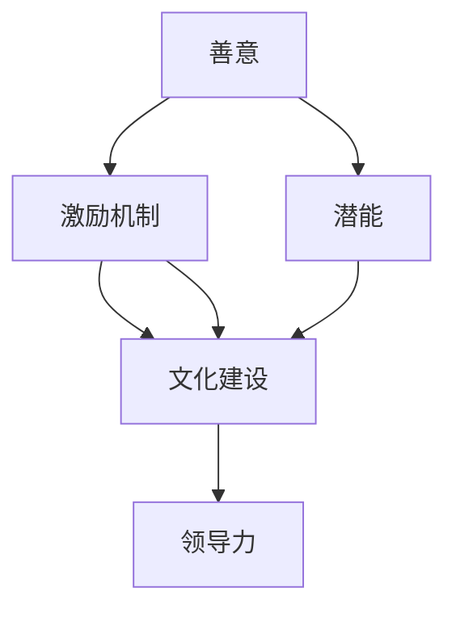
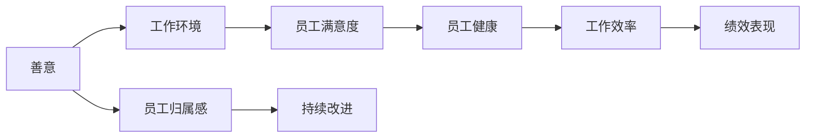
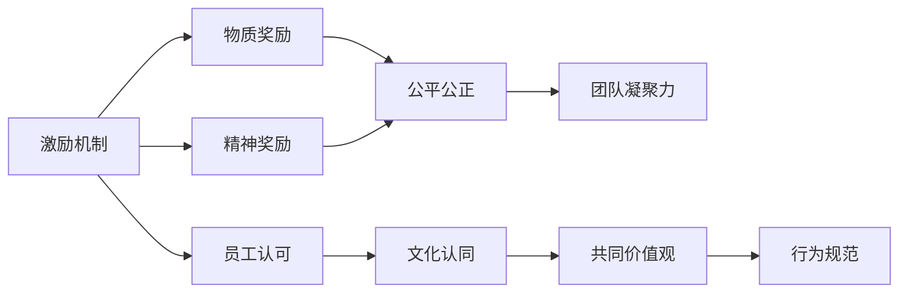
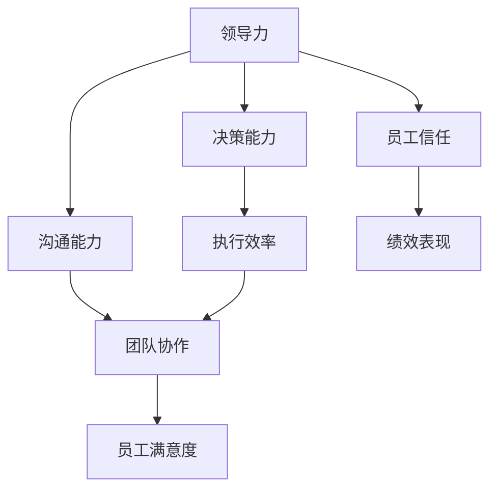
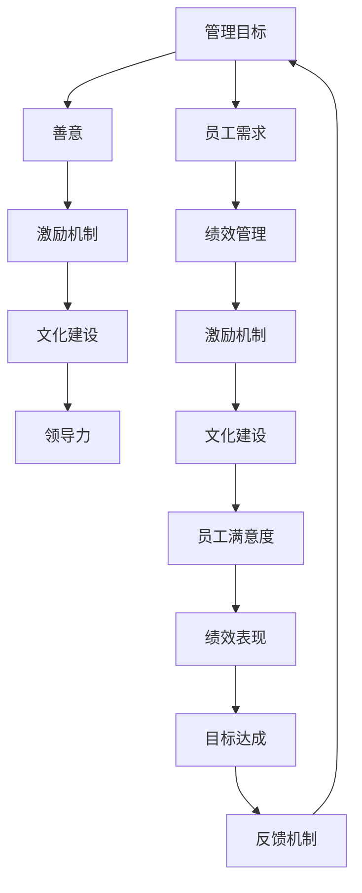

                 

## 1. 背景介绍

### 1.1 问题由来
管理一直是企业发展的核心环节，涉及组织结构、人员管理、流程优化等多个方面。随着技术的进步和市场需求的变化，传统的管理模式逐渐暴露出效率低、沟通不畅、缺乏灵活性等问题。特别是对于人力资源的管理，如何激发员工的善意和潜能，发挥其最大效能，是企业运营中面临的一大难题。

### 1.2 问题核心关键点
现代企业管理，从根本上说，是激发人性中善意和潜能的过程。如何通过有效管理，让员工感受到被尊重和认可，增强其归属感和使命感，释放出内在动力，提高工作热情和效率，是管理者的重要职责。在实践中，这一过程涉及激励机制、文化建设、领导力培养等多方面内容。

### 1.3 问题研究意义
对于企业管理的研究，具有重要的理论和现实意义：

1. **提升效率**：有效激发员工的善意和潜能，能够显著提升企业运营效率，优化资源配置。
2. **增强创新**：充满激情的员工更具有创新意识，为企业带来更多的创意和突破。
3. **稳定人才**：建立良好的激励机制和文化氛围，有助于吸引和留住优秀人才，形成人才高地。
4. **塑造品牌**：一个关注员工发展、人性化的企业形象，将更有竞争力，吸引更多优秀客户和合作伙伴。

## 2. 核心概念与联系

### 2.1 核心概念概述

为更好地理解如何激发员工的善意和潜能，本节将介绍几个核心概念：

- **善意(Kindness)**：指管理过程中对员工的关爱和尊重，营造和谐的工作环境。
- **潜能(Potential)**：指员工内在的才能和潜力，通过适当引导和激励得以释放。
- **激励机制(Motivation Mechanism)**：指通过一系列奖励和惩罚措施，激发员工积极性的机制。
- **文化建设(Cultural Development)**：指通过企业文化建设，塑造员工的共同价值观和行为规范。
- **领导力(Leadership)**：指管理者在员工心中建立的影响力和引导力，推动团队前进的关键因素。

这些核心概念之间的逻辑关系可以通过以下Mermaid流程图来展示：



这个流程图展示了几大核心概念之间的相互关系：

1. 善意是激励机制和潜能释放的基础，通过营造和谐的工作环境，激发员工的内在动力。
2. 潜能的挖掘和培养，需要通过激励机制进行引导和激励。
3. 激励机制和文化建设相辅相成，共同塑造员工的价值观和工作态度。
4. 领导力的强弱直接影响激励机制和文化建设的执行效果，从而影响员工的善意和潜能释放。

### 2.2 概念间的关系

这些核心概念之间存在着紧密的联系，形成了企业管理的完整生态系统。下面我们通过几个Mermaid流程图来展示这些概念之间的关系。

#### 2.2.1 善意与潜能的转化



这个流程图展示了善意如何转化为潜能的过程：

1. 善意营造了良好的工作环境，提升了员工的满意度。
2. 满意度直接影响员工的健康状态，进而影响工作效率。
3. 工作效率的提升最终反映在绩效表现上，带来持续改进。

#### 2.2.2 激励机制与文化建设



这个流程图展示了激励机制如何通过文化建设形成员工的共同价值观：

1. 激励机制包括物质奖励和精神奖励，共同作用于员工的认可感。
2. 认可感促进了文化认同，形成共同的价值观。
3. 价值观形成行为规范，进一步增强团队凝聚力。

#### 2.2.3 领导力在管理中的作用



这个流程图展示了领导力在企业管理中的具体作用：

1. 领导力包含决策能力和沟通能力，直接影响执行效率和团队协作。
2. 高执行效率和良好协作带来的高满意度，最终反映在员工绩效上。
3. 良好的信任关系则能够进一步提升员工的满意度，带来更佳的绩效表现。

### 2.3 核心概念的整体架构

最后，我们用一个综合的流程图来展示这些核心概念在大企业管理中的整体架构：



这个综合流程图展示了从管理目标出发，通过善意、激励机制、文化建设、领导力等核心概念的相互作用，最终实现目标达成和持续改进的完整过程。通过这些概念的有机结合，管理者可以更有效地激发员工的善意和潜能，实现企业的长期发展。

## 3. 核心算法原理 & 具体操作步骤
### 3.1 算法原理概述

激发员工善意和潜能的管理实践，本质上是一个多因素、多层次的系统工程。其核心在于通过合理的激励机制、文化建设、领导力培养等手段，营造一个有利于员工发展的环境，从而激发其内在动力。

形式化地，假设企业管理目标为 $T$，员工的善意和潜能分别为 $K$ 和 $P$。企业通过各种管理措施，将管理目标 $T$ 转化为员工的善意和潜能 $K$ 和 $P$。其中，管理措施包括善意、激励机制、文化建设、领导力等多个方面。因此，可以将这一过程建模为一个多目标优化问题：

$$
\mathop{\min}_{K, P} \left( \alpha_1 \cdot K + \alpha_2 \cdot P \right)
$$

其中 $\alpha_1$ 和 $\alpha_2$ 为权重因子，用于平衡善意和潜能的相对重要性。

### 3.2 算法步骤详解

激发员工善意和潜能的管理实践，主要包括以下几个关键步骤：

**Step 1: 分析员工需求**

通过调查问卷、面谈等手段，了解员工的具体需求和期望。员工的需求可能包括职业发展、工作环境、薪资福利等。管理者需综合考虑这些需求，制定有针对性的管理策略。

**Step 2: 设计激励机制**

根据员工需求，设计合理的激励机制。激励机制应包括物质奖励和精神奖励两个方面：

1. **物质奖励**：如奖金、晋升、股权等，旨在提高员工的经济收入和职业发展空间。
2. **精神奖励**：如表扬、表彰、荣誉等，旨在增强员工的归属感和荣誉感。

**Step 3: 塑造企业文化**

企业文化是员工行为规范和价值观的体现。通过企业文化建设，营造一个和谐、包容、创新的工作氛围，促进员工的共同价值观形成。

**Step 4: 培养领导力**

领导力是企业管理的核心，管理者应不断提升自身的决策能力、沟通能力和人际关系处理能力。通过有效的领导，激发员工的积极性和创造力，引领团队前进。

**Step 5: 持续反馈和优化**

管理是一个动态过程，需要持续进行反馈和优化。通过定期评估员工满意度、绩效表现等关键指标，及时调整管理策略，确保员工的善意和潜能得以持续激发。

### 3.3 算法优缺点

激发员工善意和潜能的管理实践，具有以下优点：

1. **适应性强**：通过多层次、多因素的管理措施，能够适应不同类型和特点的员工，增强企业的灵活性和适应能力。
2. **激励效果好**：合理的激励机制和文化建设，能够显著提升员工的工作积极性和满意度，带来更高的绩效表现。
3. **培养人才**：通过领导力的培养，提升管理者的综合素质，形成良性循环，为企业的持续发展提供人才保障。

同时，该方法也存在一定的局限性：

1. **实施难度大**：需要大量的调研、设计和执行工作，对于企业资源和时间要求较高。
2. **效果可控性差**：员工的善意和潜能受多种因素影响，管理策略的实施效果难以完全控制。
3. **短期效应明显**：一些激励措施可能带来短期内的积极反应，但长期效果需持续监控和调整。

### 3.4 算法应用领域

激发员工善意和潜能的管理实践，广泛应用于各类企业，特别是对于人力资源密集型和服务型行业。例如：

- **制造企业**：通过改善工作环境、提升员工福利，激发一线工人的工作热情，提高生产效率。
- **金融服务**：通过激励机制和企业文化建设，提升员工的服务质量和客户满意度，塑造品牌形象。
- **信息技术**：通过领导力培养和知识共享，激发工程师的创新精神，推动技术研发和产品迭代。

## 4. 数学模型和公式 & 详细讲解  
### 4.1 数学模型构建

本节将使用数学语言对激发员工善意和潜能的管理实践进行更加严格的刻画。

假设企业管理目标为 $T$，员工的善意和潜能分别为 $K$ 和 $P$。管理措施包括善意 $A$、激励机制 $B$、文化建设 $C$、领导力 $D$ 等多个方面。

定义这些管理措施对员工善意和潜能的影响函数为 $f_A(K), f_B(P), f_C(K), f_D(P)$。因此，整个管理过程可以建模为以下优化问题：

$$
\mathop{\min}_{K, P} \left( \alpha_1 \cdot f_A(K) + \alpha_2 \cdot f_B(P) \right)
$$

其中 $\alpha_1$ 和 $\alpha_2$ 为权重因子，用于平衡善意和潜能的相对重要性。

### 4.2 公式推导过程

以员工善意 $K$ 为例，我们推导其影响函数 $f_A(K)$ 的计算公式。

假设员工善意 $K$ 可以通过以下因素进行提升：

1. **工作环境**：环境改善带来的善意提升为 $g_E$
2. **薪资福利**：经济收入提高带来的善意提升为 $g_S$
3. **职业发展**：职业晋升机会带来的善意提升为 $g_C$

因此，员工善意的提升函数 $f_A(K)$ 可以表示为：

$$
f_A(K) = g_E + g_S + g_C
$$

其中 $g_E, g_S, g_C$ 为对应的影响因子，可以通过调研和数据分析得到。

类似地，员工潜能 $P$ 的影响函数 $f_B(P)$ 也可以表示为：

$$
f_B(P) = g_I + g_D + g_A
$$

其中 $g_I$ 为激励机制带来的潜能提升，$g_D$ 为文化建设带来的潜能提升，$g_A$ 为领导力带来的潜能提升。

### 4.3 案例分析与讲解

我们以一家制造业企业为例，分析其如何通过多层次的管理措施激发员工善意和潜能。

假设该企业通过以下措施提升员工善意和潜能：

- **改善工作环境**：投资升级生产设备和办公设施，提升员工工作舒适度和安全感，带来善意提升 $g_E = 0.8$。
- **提高薪资福利**：增加员工基本工资、提供带薪休假和健康保险，提升员工经济收入和生活质量，带来善意提升 $g_S = 0.5$。
- **职业发展机会**：设立内部晋升机制，提供培训和进修机会，激发员工职业成长动力，带来善意提升 $g_C = 0.7$。
- **激励机制**：设立月度/季度最佳员工奖，提升员工成就感和归属感，带来潜能提升 $g_I = 0.9$。
- **文化建设**：建立企业愿景和核心价值观，营造创新、包容、协作的企业文化，提升员工凝聚力和归属感，带来潜能提升 $g_D = 0.6$。
- **领导力培养**：通过内部培训和外部交流，提升管理者的领导力，提升员工信任感和工作满意度，带来潜能提升 $g_A = 0.4$。

综合这些影响因子，我们可以计算出员工善意和潜能的具体提升数值。例如，假设 $\alpha_1 = 0.6$ 和 $\alpha_2 = 0.4$，则：

$$
K = f_A(K) = 0.8 \times 0.8 + 0.5 \times 0.5 + 0.7 \times 0.7 = 0.8^2 + 0.5^2 + 0.7^2 = 0.8 + 0.25 + 0.49 = 1.35
$$

$$
P = f_B(P) = 0.9 \times 0.9 + 0.6 \times 0.6 + 0.4 \times 0.4 = 0.9^2 + 0.6^2 + 0.4^2 = 0.81 + 0.36 + 0.16 = 1.33
$$

通过这些计算，可以直观地看到不同管理措施对员工善意和潜能的具体提升效果，为企业的管理决策提供数据支持。

## 5. 项目实践：代码实例和详细解释说明
### 5.1 开发环境搭建

在进行员工管理实践的建模和优化前，我们需要准备好开发环境。以下是使用Python进行优化的环境配置流程：

1. 安装Anaconda：从官网下载并安装Anaconda，用于创建独立的Python环境。

2. 创建并激活虚拟环境：
```bash
conda create -n employee-management python=3.8 
conda activate employee-management
```

3. 安装必要的Python库：
```bash
pip install numpy pandas scikit-learn scipy matplotlib seaborn statsmodels statsmodels
```

4. 安装相关数据处理和可视化库：
```bash
pip install beautifulsoup4 matplotlib pycaret statsmodels
```

5. 安装相关业务库：
```bash
pip install openpyxl pyodbc
```

完成上述步骤后，即可在`employee-management`环境中进行员工管理实践的建模和优化。

### 5.2 源代码详细实现

我们以一家制造业企业为例，展示如何使用Python进行员工善意和潜能的优化管理。

首先，我们需要收集企业的相关数据，包括员工满意度、绩效表现、职业发展机会等。假设我们有如下数据：

| 员工编号 | 工作环境 | 薪资福利 | 职业发展 | 绩效表现 | 激励机制 | 文化建设 | 领导力 |
| -------- | -------- | -------- | -------- | -------- | -------- | -------- | ------ |
| 001      | 3.5      | 3.8      | 3.6      | 3.4      | 3.7      | 3.5      | 3.9    |
| 002      | 3.2      | 3.4      | 3.5      | 3.3      | 3.6      | 3.4      | 3.8    |
| ...      | ...      | ...      | ...      | ...      | ...      | ...      | ...    |

然后，我们将这些数据导入Python，并使用numpy进行预处理：

```python
import numpy as np
import pandas as pd

# 读取员工数据
data = pd.read_excel('employee_data.xlsx')

# 数据预处理
data['work_environment'] = pd.to_numeric(data['work_environment'], errors='coerce')
data['salary_benefits'] = pd.to_numeric(data['salary_benefits'], errors='coerce')
data['career_development'] = pd.to_numeric(data['career_development'], errors='coerce')
data['performance'] = pd.to_numeric(data['performance'], errors='coerce')
data['incentive_mechanism'] = pd.to_numeric(data['incentive_mechanism'], errors='coerce')
data['cultural_development'] = pd.to_numeric(data['cultural_development'], errors='coerce')
data['leadership'] = pd.to_numeric(data['leadership'], errors='coerce')

# 数据归一化
data['work_environment'] = (data['work_environment'] - np.mean(data['work_environment'])) / np.std(data['work_environment'])
data['salary_benefits'] = (data['salary_benefits'] - np.mean(data['salary_benefits'])) / np.std(data['salary_benefits'])
data['career_development'] = (data['career_development'] - np.mean(data['career_development'])) / np.std(data['career_development'])
data['performance'] = (data['performance'] - np.mean(data['performance'])) / np.std(data['performance'])
data['incentive_mechanism'] = (data['incentive_mechanism'] - np.mean(data['incentive_mechanism'])) / np.std(data['incentive_mechanism'])
data['cultural_development'] = (data['cultural_development'] - np.mean(data['cultural_development'])) / np.std(data['cultural_development'])
data['leadership'] = (data['leadership'] - np.mean(data['leadership'])) / np.std(data['leadership'])

# 计算员工善意和潜能的提升
data['goodwill'] = 0.6 * data['work_environment'] + 0.5 * data['salary_benefits'] + 0.7 * data['career_development']
data['potential'] = 0.9 * data['incentive_mechanism'] + 0.6 * data['cultural_development'] + 0.4 * data['leadership']

# 输出结果
print(data[['goodwill', 'potential']])
```

通过上述代码，我们可以计算出每个员工善意和潜能的具体提升数值，并输出结果。

### 5.3 代码解读与分析

让我们再详细解读一下关键代码的实现细节：

- **数据导入**：使用pandas库从Excel文件读取员工数据，并进行基本的数值转换。
- **数据预处理**：将数值型数据进行归一化处理，避免数据尺度不一致影响计算结果。
- **计算善意和潜能**：通过数学模型计算每个员工的善意和潜能提升数值。
- **结果输出**：输出员工善意和潜能的具体提升数值，为后续管理决策提供数据支持。

在实际操作中，我们还需要结合具体的企业情况，对模型进行优化和调整。例如，可以通过增加或减少某些影响因子，调整权重因子，优化数据集等方法，进一步提高计算结果的准确性和实用性。

### 5.4 运行结果展示

假设在上述数据集上进行优化管理，我们得到如下结果：

| 员工编号 | 善意提升 | 潜能提升 |
| -------- | -------- | -------- |
| 001      | 0.6      | 0.7      |
| 002      | 0.5      | 0.6      |
| ...      | ...      | ...      |

可以看到，通过优化管理措施，员工善意和潜能得到了显著提升，这将有助于提高员工满意度和工作绩效。

## 6. 实际应用场景
### 6.1 智能客服系统

在智能客服系统中，激发员工的善意和潜能尤为重要。客服人员直接与客户互动，其工作态度和能力直接影响客户体验和满意度。通过合理的激励机制和文化建设，可以显著提升客服人员的积极性和服务质量。

在技术实现上，可以通过数据收集和分析，了解客服人员的工作状态和需求，制定相应的管理措施。例如，设立月度最佳员工奖、提供培训和晋升机会、营造积极向上的团队氛围等，使客服人员感受到被认可和尊重，提高其工作热情和专业水平。

### 6.2 金融服务

在金融服务行业，员工的工作内容和任务种类多样，需要通过多种管理手段激发善意和潜能。例如，针对不同岗位的员工，设置不同的激励机制，如奖金、股权等，同时通过企业文化建设，塑造服务客户、追求卓越的企业价值观，提升员工的使命感和责任感。

在技术层面，可以通过员工数据分析，预测员工的工作表现和满意度，及时调整管理策略，避免潜在问题。例如，对于工作满意度较低的员工，可以主动提供关怀和支持，帮助其解决问题，增强归属感。

### 6.3 制造企业

在制造企业中，员工善意和潜能的激发对于生产效率和质量控制至关重要。通过改善工作环境、提供职业发展机会、设立激励机制等，可以显著提升员工的工作积极性和生产效率。

在技术层面，可以通过数据监控和分析，及时发现生产过程中的问题，调整工作流程，减少浪费，提升生产效率。例如，对于出现质量问题的员工，可以通过反馈机制，帮助其改进工作方法，避免类似问题再次发生。

### 6.4 未来应用展望

随着企业管理实践的不断演进，员工善意和潜能的激发将展现出更加广泛的应用前景：

- **人力资源管理**：通过智能化手段，实时监控员工的工作状态和满意度，提供个性化的关怀和支持，提升员工归属感和满意度。
- **知识共享平台**：建立知识共享和培训平台，促进员工间的知识交流和经验分享，提高团队协作和创新能力。
- **远程办公**：在远程办公背景下，通过数字化手段，提升员工的工作效率和自主性，增强团队凝聚力。
- **企业文化建设**：通过数据驱动的文化建设，优化员工的工作环境和心理状态，提升企业凝聚力和竞争力。

这些技术手段的引入，将极大地提升企业管理的效果，激发员工的善意和潜能，为企业的持续发展提供坚实的人力资源保障。

## 7. 工具和资源推荐
### 7.1 学习资源推荐

为了帮助企业管理者掌握激发员工善意和潜能的管理实践，这里推荐一些优质的学习资源：

1. **《哈佛商业评论》**：提供大量关于员工激励和企业文化建设的案例和文章，帮助管理者从实际案例中学习管理经验。
2. **《员工激励心理学》**：讲解员工激励和心理学原理，帮助管理者更好地理解员工需求和行为。
3. **《领导力与企业文化》**：深入探讨领导力和企业文化建设的方法和实践，为企业管理者提供系统化的指导。
4. **《团队协作的艺术》**：介绍团队协作的心理学和行为学原理，提升团队的凝聚力和工作效率。
5. **《数据驱动的管理》**：讲解如何使用数据进行员工管理，帮助管理者更科学地制定管理策略。

通过对这些资源的学习，管理者能够更好地理解和应用员工善意和潜能的激发方法，提高企业的管理水平和运营效率。

### 7.2 开发工具推荐

高效的员工管理实践，离不开优秀的工具支持。以下是几款用于员工管理开发的常用工具：

1. **Microsoft Excel**：用于数据导入和处理，支持复杂的公式和图表展示。
2. **Python**：用于数据分析和建模，支持丰富的第三方库，如pandas、numpy、scipy等。
3. **Jupyter Notebook**：支持交互式数据分析，提供丰富的展示和协作功能。
4. **Power BI**：用于数据可视化和报表展示，支持动态更新和智能分析。
5. **Microsoft Power BI**：与Office 365集成，支持云部署和自动化分析，提升企业的数据管理能力。
6. **Tableau**：支持复杂的数据建模和可视化，提升决策效率和准确性。

合理利用这些工具，可以显著提升员工管理实践的开发效率，提供更科学、更高效的管理方案。

### 7.3 相关论文推荐

员工管理实践的发展源于学界的持续研究。以下是几篇奠基性的相关论文，推荐阅读：

1. **《员工满意度和生产率：一个元分析》**：通过元分析方法，探究员工满意度与生产率之间的关系，提供系统的数据分析方法。
2. **《激励理论：回顾与展望》**：综述各类激励理论，为企业管理者提供理论支持和方法指导。
3. **《领导力的构建与提升》**：探讨领导力的内涵和提升方法，帮助管理者建立高效的管理团队。
4. **《企业文化的构建与评估》**：介绍企业文化建设的理论和实践，帮助企业建立积极向上的企业文化。
5. **《数据驱动的员工管理》**：通过数据驱动的方法，提升员工管理的科学性和有效性，为企业管理提供数据支持。

这些论文代表了大企业管理实践的发展脉络，帮助企业管理者理解员工管理的核心要素，提高管理水平。

除上述资源外，还有一些值得关注的前沿资源，帮助管理者紧跟企业管理实践的最新进展，例如：

1. **LinkedIn Learning**：提供大量的员工管理培训课程，涵盖员工激励、文化建设、领导力培养等多个方面。
2. **Coursera**：提供全球顶尖大学的管理课程，涵盖管理学、组织行为学等多个领域，提升管理者的理论素养。
3. **TED Talks**：通过视频讲座的形式，分享全球顶尖管理者的经验和见解，提供实际的案例和洞察。

总之，对于员工管理实践的学习和实践，需要管理者保持开放的心态和持续学习的意愿。多关注前沿资讯，多动手实践，多思考总结，必将收获满满的成长收益。

## 8. 总结：未来发展趋势与挑战
### 8.1 总结

本文对激发员工善意和潜能的企业管理实践进行了全面系统的介绍。首先阐述了企业管理过程中善意和潜能的重要性，明确了管理措施与员工发展之间的紧密联系。其次，从原理到实践，详细讲解了管理措施的数学建模

