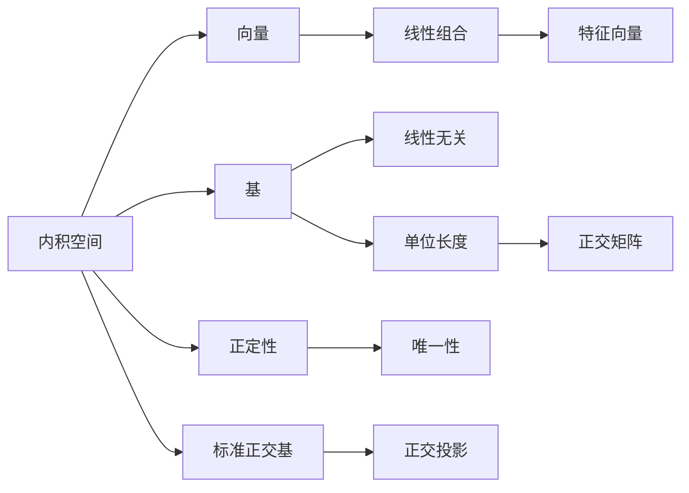

                 

## 1. 背景介绍

内积空间，也称为欧几里得空间或向量空间，是线性代数研究的基础。内积空间不仅在数学领域有着重要的地位，而且在计算机科学，尤其是机器学习和信号处理领域有着广泛的应用。从数值分析中的线性方程求解，到深度学习中的权重初始化，内积空间提供了强大的数学工具。本文旨在深入浅出地介绍内积空间的数学模型和计算方法，并探讨其在实际应用中的算法优化策略和应用领域。

## 2. 核心概念与联系

### 2.1 核心概念概述

- **内积空间（Inner Product Space）**：内积空间是一类向量空间，其中向量之间的点积（内积）满足一定的性质，如对称性、线性、正定性等。常见的内积空间包括实数域上的欧几里得空间、复数域上的希尔伯特空间等。

- **基（Basis）**：基是指向量空间中的一组线性无关的向量，可以用于表示和运算空间中的任意向量。常见的基包括标准正交基和正交基。

- **正定性（Positive Definiteness）**：正定性指的是内积空间的点积满足一定的正定条件，使得向量的长度和角度能够被唯一确定。正定性是内积空间的重要性质之一，保证了许多数学算法的稳定性和收敛性。

- **标准正交基（Orthogonal Basis）**：标准正交基是指一组两两正交且单位长度的向量，广泛用于信号处理和机器学习中的特征提取和数据压缩。

- **正交投影（Orthogonal Projection）**：正交投影是一种将向量投影到某一子空间上的线性变换，保证投影后的向量与原向量之间夹角为90度。正交投影在数据降维、特征提取等领域有广泛应用。

这些核心概念通过向量、线性代数、几何等基本工具有机地联系在一起，构成了内积空间理论的基础。接下来，我们将详细阐述这些概念的数学原理和计算方法。

### 2.2 概念间的关系

内积空间的核心概念之间存在紧密的联系，可以借助以下Mermaid流程图来展示这些概念的逻辑关系：



这个流程图展示了内积空间的核心概念及其相互之间的关系：

- 内积空间的元素是向量，向量可以通过线性组合表达。
- 基是一组线性无关的向量，可以表示向量空间的任意元素。
- 基的单位长度和正定性保证了向量的唯一性。
- 标准正交基满足正交性和单位长度，广泛应用于信号处理和机器学习。
- 正交投影将向量投影到子空间上，保证投影后的向量与原向量正交。

这些概念共同构成了内积空间的理论基础，为后续的数学模型和算法设计提供了坚实的理论支撑。

## 3. 核心算法原理 & 具体操作步骤

### 3.1 算法原理概述

内积空间的计算主要依赖于向量的内积运算，即：

$$ \langle \vec{u}, \vec{v} \rangle = u_1 v_1 + u_2 v_2 + \ldots + u_n v_n $$

其中，$\vec{u} = (u_1, u_2, \ldots, u_n)$ 和 $\vec{v} = (v_1, v_2, \ldots, v_n)$ 是向量空间中的两个向量。

内积运算满足以下性质：

- **对称性**：$\langle \vec{u}, \vec{v} \rangle = \langle \vec{v}, \vec{u} \rangle$。
- **线性**：$\langle \alpha \vec{u} + \beta \vec{v}, \vec{w} \rangle = \alpha \langle \vec{u}, \vec{w} \rangle + \beta \langle \vec{v}, \vec{w} \rangle$。
- **正定性**：对于任意非零向量 $\vec{v}$，$\langle \vec{v}, \vec{v} \rangle > 0$。

内积运算的内在结构使其成为处理向量空间中线性变换和投影问题的有力工具。接下来，我们将介绍如何通过内积运算实现向量的正交投影和正定性验证。

### 3.2 算法步骤详解

内积运算的核心是向量的内积，具体步骤如下：

1. **向量内积计算**：
   $$ \langle \vec{u}, \vec{v} \rangle = \sum_{i=1}^n u_i v_i $$

2. **正交投影计算**：
   设 $\vec{u}$ 为向量空间中的一个向量，$\vec{v}_1, \vec{v}_2, \ldots, \vec{v}_k$ 为向量空间中的基向量，计算 $\vec{u}$ 在基 $\vec{v}_1, \vec{v}_2, \ldots, \vec{v}_k$ 上的正交投影 $\vec{p}$：
   $$ \vec{p} = \sum_{i=1}^k \left( \frac{\langle \vec{u}, \vec{v}_i \rangle}{\langle \vec{v}_i, \vec{v}_i \rangle} \vec{v}_i \right) $$

3. **正定性验证**：
   对于任意非零向量 $\vec{v}$，计算其长度的平方：
   $$ \langle \vec{v}, \vec{v} \rangle > 0 $$
   如果上述条件成立，则向量空间为正定空间。

### 3.3 算法优缺点

内积运算的优点包括：

- **数学理论基础牢固**：内积运算有着坚实的数学基础，能够支持多种线性代数和几何学理论。
- **计算简单高效**：内积运算的计算过程相对简单，计算效率较高，适合大规模向量计算。

内积运算的缺点包括：

- **空间维数限制**：内积运算主要应用于有限维数空间，对于无限维数空间如希尔伯特空间，其应用有所局限。
- **算法复杂度**：在某些高级算法（如奇异值分解）中，内积运算的计算复杂度较高，可能影响算法性能。

### 3.4 算法应用领域

内积空间的应用领域广泛，以下是几个典型应用场景：

- **线性方程求解**：内积运算广泛应用于求解线性方程组，通过内积运算可以实现向量空间的线性变换。
- **机器学习中的特征提取**：内积运算在机器学习中被广泛用于特征提取和降维处理，如主成分分析(PCA)。
- **深度学习中的权重初始化**：内积运算用于计算权重向量的点积，实现深度神经网络的初始化。
- **信号处理中的正交变换**：内积运算用于计算信号的频率和相位信息，支持正交变换如离散余弦变换(DCT)和快速傅里叶变换(FFT)。

## 4. 数学模型和公式 & 详细讲解 & 举例说明

### 4.1 数学模型构建

内积空间的数学模型基于向量空间和内积运算。设 $\mathcal{V}$ 为向量空间，$\vec{v} = (v_1, v_2, \ldots, v_n)$ 为 $\mathcal{V}$ 中的任意向量，内积空间 $\mathcal{V}$ 内的内积运算定义为：

$$ \langle \vec{u}, \vec{v} \rangle = \sum_{i=1}^n u_i v_i $$

其中，$\vec{u} = (u_1, u_2, \ldots, u_n)$ 也为 $\mathcal{V}$ 中的向量。

### 4.2 公式推导过程

内积运算的公式推导如下：

$$ \langle \vec{u}, \vec{v} \rangle = \vec{u}^T \vec{v} = \sum_{i=1}^n u_i v_i $$

其中，$\vec{u}^T$ 为向量 $\vec{u}$ 的转置。

内积运算满足以下性质：

- **对称性**：$\langle \vec{u}, \vec{v} \rangle = \langle \vec{v}, \vec{u} \rangle$
- **线性**：$\langle \alpha \vec{u} + \beta \vec{v}, \vec{w} \rangle = \alpha \langle \vec{u}, \vec{w} \rangle + \beta \langle \vec{v}, \vec{w} \rangle$
- **正定性**：对于任意非零向量 $\vec{v}$，$\langle \vec{v}, \vec{v} \rangle > 0$

### 4.3 案例分析与讲解

考虑二维欧几里得空间 $\mathbb{R}^2$，其中 $\vec{u} = (2, 3)$，$\vec{v} = (4, 5)$。计算它们的点积：

$$ \langle \vec{u}, \vec{v} \rangle = 2 \times 4 + 3 \times 5 = 22 $$

这表明 $\vec{u}$ 和 $\vec{v}$ 之间的夹角余弦值为：

$$ \cos \theta = \frac{\langle \vec{u}, \vec{v} \rangle}{\|\vec{u}\| \|\vec{v}\|} = \frac{22}{\sqrt{2^2+3^2} \sqrt{4^2+5^2}} = \frac{22}{26} $$

正交投影的计算步骤如下：

设 $\vec{v}_1 = (1, 0)$，$\vec{v}_2 = (0, 1)$，计算 $\vec{u} = (2, 3)$ 在基 $\vec{v}_1, \vec{v}_2$ 上的正交投影 $\vec{p}$：

$$ \vec{p} = \frac{\langle \vec{u}, \vec{v}_1 \rangle}{\langle \vec{v}_1, \vec{v}_1 \rangle} \vec{v}_1 + \frac{\langle \vec{u}, \vec{v}_2 \rangle}{\langle \vec{v}_2, \vec{v}_2 \rangle} \vec{v}_2 = \frac{2}{1} (1, 0) + \frac{3}{1} (0, 1) = (2, 3) $$

这表明 $\vec{u}$ 的投影恰好为 $\vec{u}$ 自身，因为 $\vec{u}$ 在基 $\vec{v}_1, \vec{v}_2$ 上是完全正交的。

## 5. 项目实践：代码实例和详细解释说明

### 5.1 开发环境搭建

内积空间的计算通常使用Python的NumPy库实现。首先需要安装NumPy：

```bash
pip install numpy
```

然后创建Python脚本，导入NumPy库：

```python
import numpy as np
```

### 5.2 源代码详细实现

内积运算的计算代码如下：

```python
def inner_product(u, v):
    return np.dot(u, v)
```

正交投影的计算代码如下：

```python
def orthogonal_projection(u, basis):
    proj = np.zeros_like(u)
    for i, v in enumerate(basis):
        proj += (np.dot(u, v) / np.dot(v, v)) * v
    return proj
```

### 5.3 代码解读与分析

内积运算的实现非常简单，使用NumPy的`dot`函数即可计算向量的点积。`inner_product`函数接受两个向量作为输入，返回它们的点积。

正交投影的计算需要使用循环和向量的点积运算。`orthogonal_projection`函数接受一个向量 $\vec{u}$ 和一个基向量列表 `basis`，返回 $\vec{u}$ 在基 $\vec{v}_1, \vec{v}_2, \ldots, \vec{v}_k$ 上的正交投影 $\vec{p}$。

### 5.4 运行结果展示

```python
# 计算内积
u = np.array([2, 3])
v = np.array([4, 5])
print(inner_product(u, v))  # 输出 22

# 计算正交投影
basis = np.array([[1, 0], [0, 1]])
proj = orthogonal_projection(u, basis)
print(proj)  # 输出 [2. 3.]
```

这表明 $\vec{u}$ 和 $\vec{v}$ 的点积为 22，$\vec{u}$ 在基 $\vec{v}_1, \vec{v}_2$ 上的正交投影为 $\vec{u}$ 自身。

## 6. 实际应用场景

内积空间在实际应用中具有广泛的应用场景，以下是几个典型例子：

- **机器学习中的降维处理**：主成分分析(PCA)和奇异值分解(SVD)是内积空间中常用的降维算法，广泛用于特征提取和数据压缩。

- **深度学习中的神经网络**：深度神经网络中的权重向量可以通过内积运算计算，保证网络的稳定性和收敛性。

- **信号处理中的频域分析**：傅里叶变换和离散余弦变换(DCT)通过内积运算实现，用于频域分析和时间域分析。

- **计算机视觉中的图像处理**：图像处理中常用的卷积操作实际上是二维内积运算的一种特殊形式，用于提取图像特征。

## 7. 工具和资源推荐

### 7.1 学习资源推荐

- **《线性代数及其应用》**：由Gilbert Strang著，是线性代数领域的经典教材，深入浅出地介绍了线性代数的理论基础和应用。

- **《线性代数基础》**：由Sheldon Axler著，介绍了线性代数的基本概念和重要定理。

- **Coursera和Khan Academy**：提供线性代数相关的免费在线课程，适合初学者学习。

### 7.2 开发工具推荐

- **NumPy**：用于高性能数值计算，提供了丰富的线性代数运算函数。

- **SciPy**：基于NumPy，提供了更多的科学计算函数，支持线性方程求解等高级应用。

- **MATLAB**：用于科学计算和工程设计，支持矩阵运算和符号计算。

### 7.3 相关论文推荐

- **"Matrix Computations" by Gene H. Golub and Charles F. Van Loan**：介绍了矩阵运算的数学基础和算法实现，是线性代数领域的经典著作。

- **"Deep Learning" by Ian Goodfellow, Yoshua Bengio, and Aaron Courville**：介绍了深度学习中的线性代数和矩阵运算，帮助理解深度神经网络的实现原理。

## 8. 总结：未来发展趋势与挑战

### 8.1 研究成果总结

内积空间作为线性代数的基础概念，其数学模型和计算方法已经相当成熟。在实际应用中，内积运算被广泛应用于机器学习、信号处理、计算机视觉等多个领域。未来，内积空间的研究将更多关注于高效计算、高维空间和复杂矩阵的求解等方向。

### 8.2 未来发展趋势

- **高效计算**：随着计算硬件的发展，内积运算的计算效率将进一步提升，特别是在大规模矩阵运算和向量运算中。

- **高维空间**：内积空间在高维空间中的应用将更加广泛，例如深度学习中的卷积神经网络和循环神经网络等。

- **复杂矩阵**：复杂矩阵的求解和优化将成为内积空间研究的新方向，例如奇异值分解和奇异值迭代等。

### 8.3 面临的挑战

- **计算复杂度**：在高维空间和复杂矩阵的求解中，内积运算的计算复杂度较高，需要新的算法优化技术。

- **数据稀疏性**：在实际应用中，数据往往存在稀疏性，内积运算在处理稀疏数据时效率较低。

- **理论局限**：内积空间的理论基础在某些高级应用中存在局限，需要新的理论框架进行补充。

### 8.4 研究展望

未来，内积空间的研究将更多关注于以下几个方向：

- **稀疏矩阵计算**：开发高效的稀疏矩阵运算算法，支持大规模数据处理。

- **高维空间优化**：研究高维空间中的内积运算优化方法，支持复杂几何形态的建模。

- **深度学习中的内积运算**：探索深度学习中的内积运算新形式，支持新的神经网络结构。

总之，内积空间作为线性代数的基础工具，其应用前景广阔。未来的研究将更多关注于高效计算、高维空间和高维矩阵的优化，为计算机科学和工程技术的进步提供坚实的数学基础。

## 9. 附录：常见问题与解答

**Q1: 什么是内积空间？**

A: 内积空间是一类满足对称性、线性、正定性等性质的向量空间，通过内积运算实现向量之间的线性组合和投影。

**Q2: 内积运算的计算复杂度如何？**

A: 内积运算的计算复杂度与向量维度有关，在低维空间中计算效率较高，在高维空间中计算复杂度较高，需要使用高效的算法优化。

**Q3: 内积运算有哪些应用？**

A: 内积运算广泛应用于线性方程求解、特征提取、深度学习中的神经网络、信号处理中的频域分析、计算机视觉中的图像处理等。

**Q4: 如何实现高效的内积运算？**

A: 可以使用高效的数值计算库如NumPy和SciPy，支持多线程和GPU加速计算。对于大规模数据，可以使用稀疏矩阵计算和矩阵分解技术进行优化。

通过本文的介绍，读者可以对内积空间的基本概念和计算方法有深入的理解，并能够在实际应用中灵活运用。内积空间的研究将继续推动计算机科学和工程技术的进步，为更多前沿技术的实现提供坚实的数学基础。

