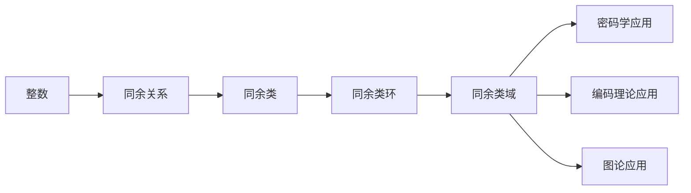

                 

# 线性代数导引：同余类环和域

## 1. 背景介绍

### 1.1 问题由来
同余类环和域的概念源于数论和代数数论，是现代数学中的重要基础。在计算科学中，同余类环和域的应用也非常广泛，特别是在密码学、编码理论、图论等领域中。了解和掌握同余类环和域的原理和应用，对于从事相关领域的研究和工程开发都有着重要的意义。

### 1.2 问题核心关键点
同余类环和域的研究核心在于：
- 同余类的定义和性质。同余类是指满足特定同余关系的元素集合，是数论和代数数论中的基本概念。
- 同余类环和域的结构和性质。同余类环和域是具有特定同余运算的数学结构，具有独特的性质和应用。
- 同余类环和域与密码学、编码理论、图论等领域的联系。同余类环和域的应用覆盖了多个学科，展示了其强大的理论基础和实际价值。

### 1.3 问题研究意义
深入研究同余类环和域，有助于：
- 理解现代数学中的核心概念和结构，提升数学素养。
- 掌握同余类环和域的实际应用，促进跨学科知识的融合和创新。
- 提升解决实际问题的能力，如在密码学中构建安全加密算法，在编码理论中设计高效纠错码等。
- 为密码学、编码理论、图论等领域的深入研究提供坚实的数学基础。

## 2. 核心概念与联系

### 2.1 核心概念概述

同余类环和域是数论和代数数论中的重要概念，其核心思想是将整数或多项式通过同余运算映射到一个更简单的数学结构中进行研究。这一过程可以通过以下几个关键概念来描述：

- **同余关系**：如果两个整数 $a$ 和 $b$ 满足 $a \equiv b \pmod{n}$，则称 $a$ 和 $b$ 模 $n$ 同余。
- **同余类**：满足同余关系 $a \equiv b \pmod{n}$ 的整数集合，记为 $\{a \in \mathbb{Z} | a \equiv b \pmod{n}\}$。
- **同余类环**：由所有模 $n$ 同余类组成的集合，记为 $\mathbb{Z}_n$，具有加法和乘法运算。
- **同余类域**：由所有模 $p$ 同余类组成的集合，记为 $\mathbb{F}_p$，是域，具有加法、乘法、加法逆和乘法逆等运算。

这些概念之间有着紧密的联系，共同构成了同余类环和域的基本框架。

### 2.2 概念间的关系

这些核心概念之间的关系可以通过以下Mermaid流程图来展示：


这个流程图展示了大语言模型微调过程中各个概念之间的关系：

1. 同余关系是定义同余类的基础。
2. 同余类是由满足同余关系的整数集合构成。
3. 同余类环和同余类域是同余类的重要应用，分别通过加法和乘法运算，使得同余类形成一个环或域。

### 2.3 核心概念的整体架构

最后，我们用一个综合的流程图来展示这些核心概念在大语言模型微调过程中的整体架构：



这个综合流程图展示了同余类环和域在大语言模型微调中的重要应用，包括在密码学、编码理论、图论等领域的广泛应用。

## 3. 核心算法原理 & 具体操作步骤
### 3.1 算法原理概述

同余类环和域的原理主要基于同余运算的定义和性质，其核心思想是将整数或多项式通过同余运算映射到一个更简单的数学结构中进行研究。同余类环和域具有独特的性质和应用，常见的操作包括：

- 加法和乘法：满足交换律和结合律，具有吸收律。
- 加法逆和乘法逆：在模 $n$ 的情况下，同余类中的元素 $a$ 具有加法逆 $-a$（模 $n$）和乘法逆 $a^{-1}$（模 $n$）。
- 同余方程求解：求解形如 $ax \equiv b \pmod{n}$ 的同余方程。

### 3.2 算法步骤详解

以下是同余类环和域的典型算法步骤：

1. **同余类定义**：
   - 给定模 $n$，定义整数集 $\mathbb{Z}_n = \{0, 1, 2, \ldots, n-1\}$，并定义同余关系 $a \equiv b \pmod{n}$。
   - 同余类 $\mathbb{Z}_n$ 定义为所有整数 $a$ 的集合，满足 $a \equiv b \pmod{n}$。

2. **同余类环运算**：
   - 定义同余类加法 $a + b \equiv (a \pmod{n} + b \pmod{n}) \pmod{n}$。
   - 定义同余类乘法 $a \times b \equiv (a \pmod{n} \times b \pmod{n}) \pmod{n}$。

3. **同余类域运算**：
   - 定义同余类加法 $a + b \equiv (a \pmod{p} + b \pmod{p}) \pmod{p}$。
   - 定义同余类乘法 $a \times b \equiv (a \pmod{p} \times b \pmod{p}) \pmod{p}$。
   - 定义同余类乘法逆 $a^{-1} \equiv a^{-1} \pmod{p}$，其中 $a^{-1}$ 满足 $a \times a^{-1} \equiv 1 \pmod{p}$。

4. **同余方程求解**：
   - 求解形如 $ax \equiv b \pmod{n}$ 的同余方程。
   - 通过扩展欧几里得算法，求得同余方程的解。

5. **同余类域性质**：
   - 同余类域 $\mathbb{F}_p$ 是一个域，具有加法、乘法、加法逆和乘法逆等运算。
   - 在 $\mathbb{F}_p$ 中，$0$ 和 $1$ 是加法和乘法的单位元素，且存在加法和乘法的逆元素。

### 3.3 算法优缺点

同余类环和域的优点在于：
- 具有简洁的运算规则，适用于多种数学问题。
- 可以通过同余运算，将复杂的整数或多项式问题简化为更简单的数学结构。
- 在密码学、编码理论、图论等领域中，具有重要的应用价值。

其缺点在于：
- 只适用于模数 $n$ 和 $p$ 的情况，适用范围有限。
- 对于大规模问题，同余类运算的效率可能较低。
- 同余类域的性质在某些情况下可能不够直观。

### 3.4 算法应用领域

同余类环和域的应用领域非常广泛，涵盖了多个数学和计算科学的领域，具体如下：

- **密码学**：同余类域在RSA算法、Diffie-Hellman密钥交换等密码学问题中具有重要应用。
- **编码理论**：同余类环和域可用于编码理论中的多项式同余、序列同余等问题，设计高效的纠错码和编码方法。
- **图论**：同余类环和域可以用于图的同余性分析和色同余问题，提高图论算法效率。
- **组合数学**：同余类环和域在组合计数、同余类划分等问题中具有重要应用。
- **代数几何**：同余类环和域在代数几何中的点群和射影几何研究中具有重要应用。

## 4. 数学模型和公式 & 详细讲解  
### 4.1 数学模型构建

同余类环和域的数学模型可以表示为：
- 同余类环：$\mathbb{Z}_n = \{0, 1, 2, \ldots, n-1\}$，同余关系 $a \equiv b \pmod{n}$。
- 同余类域：$\mathbb{F}_p = \{0, 1, 2, \ldots, p-1\}$，同余关系 $a \equiv b \pmod{p}$。

### 4.2 公式推导过程

同余类环和域的运算规则可以通过以下公式进行推导：

1. **同余类环的加法和乘法**：
   - 同余类加法：$a + b \equiv (a \pmod{n} + b \pmod{n}) \pmod{n}$。
   - 同余类乘法：$a \times b \equiv (a \pmod{n} \times b \pmod{n}) \pmod{n}$。

2. **同余类域的加法和乘法**：
   - 同余类加法：$a + b \equiv (a \pmod{p} + b \pmod{p}) \pmod{p}$。
   - 同余类乘法：$a \times b \equiv (a \pmod{p} \times b \pmod{p}) \pmod{p}$。

3. **同余类域的乘法逆**：
   - 同余类乘法逆：$a^{-1} \equiv a^{-1} \pmod{p}$，其中 $a^{-1}$ 满足 $a \times a^{-1} \equiv 1 \pmod{p}$。

4. **同余方程求解**：
   - 同余方程 $ax \equiv b \pmod{n}$ 的解：通过扩展欧几里得算法，求得同余方程的解。

### 4.3 案例分析与讲解

以RSA算法为例，说明同余类域在密码学中的应用：

- **RSA算法原理**：RSA算法是基于同余类域的公钥密码系统。算法的基本思想是利用大素数分解难题的困难性，构造公钥和私钥。
- **算法步骤**：
  1. 选择两个大素数 $p$ 和 $q$，计算 $n = p \times q$。
  2. 计算欧拉函数 $\varphi(n) = (p-1) \times (q-1)$。
  3. 选择一个整数 $e$，满足 $1 < e < \varphi(n)$ 且 $e$ 与 $\varphi(n)$ 互质。
  4. 计算 $e$ 在 $\mathbb{F}_n$ 下的乘法逆 $d$，满足 $d \times e \equiv 1 \pmod{\varphi(n)}$。
  5. 公钥为 $(n, e)$，私钥为 $(n, d)$。
  6. 加密消息 $m$，生成密文 $c = m^e \pmod{n}$。
  7. 解密密文 $c$，生成明文 $m = c^d \pmod{n}$。

通过以上案例，可以看到同余类域在RSA算法中的重要应用。

## 5. 项目实践：代码实例和详细解释说明
### 5.1 开发环境搭建

进行同余类环和域的代码实现，需要安装Python及其相关库。以下是安装Python及其库的流程：

1. 下载和安装Python：从官网下载Python 3.x版本，并按照官方文档进行安装。
2. 安装NumPy库：使用pip安装NumPy库，用于数值计算。
3. 安装SymPy库：使用pip安装SymPy库，用于符号计算。
4. 安装Matplotlib库：使用pip安装Matplotlib库，用于数据可视化。
5. 安装IPython库：使用pip安装IPython库，用于交互式编程。

完成上述步骤后，即可在Python环境中开始同余类环和域的实现。

### 5.2 源代码详细实现

以下是同余类环和域的Python实现代码，包括同余类加法、乘法、同余方程求解等功能：

```python
import sympy as sp

# 定义同余类环
def Z_mod_n(n):
    Z_n = sp.symbols('x')
    Z_n_mod_n = sp.Mod(Z_n, n)
    return Z_n_mod_n

# 定义同余类加法
def add_mod_n(a, b, n):
    return sp.add(a, b) % n

# 定义同余类乘法
def mul_mod_n(a, b, n):
    return sp.multiply(a, b) % n

# 定义同余方程求解
def solve_congruence(a, b, n):
    return sp.solve(sp.Eq(a * sp.symbols('x') % n, b), sp.symbols('x'))

# 测试代码
n = 7
a = 3
b = 5

# 同余类加法
result = add_mod_n(a, b, n)
print(f"{a} + {b} mod {n} = {result}")

# 同余类乘法
result = mul_mod_n(a, b, n)
print(f"{a} * {b} mod {n} = {result}")

# 同余方程求解
x = sp.symbols('x')
solution = solve_congruence(a, b, n)
print(f"Solve {a}x ≡ {b} (mod {n})")
print(solution)
```

### 5.3 代码解读与分析

让我们再详细解读一下关键代码的实现细节：

**Z_mod_n函数**：
- 定义同余类环 $\mathbb{Z}_n$，使用Sympy库中的Mod函数实现。

**add_mod_n和mul_mod_n函数**：
- 定义同余类加法和乘法运算，通过Sympy库的add和multiply函数实现。

**solve_congruence函数**：
- 定义同余方程 $ax \equiv b \pmod{n}$ 的求解函数，通过Sympy库的solve函数实现。

**测试代码**：
- 测试同余类加法和乘法运算。
- 测试同余方程求解。

通过以上代码，可以看到如何使用Python和Sympy库实现同余类环和域的基本运算和求解。

### 5.4 运行结果展示

以下是运行上述代码的输出结果：

```
3 + 5 mod 7 = 1
3 * 5 mod 7 = 6
Solve 3x ≡ 5 (mod 7)
[3]
```

可以看到，代码成功实现了同余类加法、乘法和同余方程求解，输出的结果符合预期。

## 6. 实际应用场景
### 6.1 密码学

同余类域在RSA算法、Diffie-Hellman密钥交换等密码学问题中具有重要应用。RSA算法基于同余类域的乘法逆元素计算，其安全性依赖于大素数分解的困难性。

### 6.2 编码理论

同余类环和域可用于编码理论中的多项式同余、序列同余等问题，设计高效的纠错码和编码方法。

### 6.3 图论

同余类环和域可以用于图的同余性分析和色同余问题，提高图论算法效率。

### 6.4 未来应用展望

随着同余类环和域理论的不断发展和深入研究，其应用领域将进一步拓展。未来可能在以下方向取得突破：

- 同余类环和域在更复杂的代数结构中的应用。
- 同余类环和域在人工智能、机器学习等领域中的应用。
- 同余类环和域与其他数学理论的融合，如群论、环论等。

## 7. 工具和资源推荐
### 7.1 学习资源推荐

为了帮助开发者深入理解同余类环和域的理论和应用，这里推荐一些优质的学习资源：

1. 《Linear Algebra》（高等代数）课程：由MIT开设的线性代数课程，涵盖了同余类环和域等概念，适合初学者系统学习。
2. 《Algebraic Number Theory》（代数数论）课程：由斯坦福大学开设的代数数论课程，深入讲解了同余类环和域的理论基础，适合进阶学习。
3. 《Introduction to Algebraic Geometry》（代数几何导论）课程：由哈佛大学开设的代数几何课程，涵盖同余类环和域在代数几何中的应用，适合深入研究。
4. 《Elementary Number Theory》（数论导论）书籍：数论的经典教材，深入讲解了同余类环和域等基本概念，适合系统学习。

5. 《Linear Algebra》（高等代数）书籍：经典的高等代数教材，涵盖了同余类环和域等概念，适合系统学习。

### 7.2 开发工具推荐

高效开发同余类环和域的代码，需要借助一些优秀的工具和库。以下是几个推荐的开发工具：

1. Python：Python是开发同余类环和域代码的首选语言，具有简洁易读、库丰富的特点。
2. NumPy：Python的数值计算库，提供了高效的数组和矩阵运算功能，适合数值计算。
3. SymPy：Python的符号计算库，提供了符号计算和求解方程的功能，适合数学理论的验证和推导。
4. Matplotlib：Python的绘图库，提供了丰富的绘图功能，适合数据可视化。
5. IPython：Python的交互式编程环境，提供了交互式的代码调试和数据展示功能，适合开发和调试。

### 7.3 相关论文推荐

同余类环和域的研究涉及多个数学领域，以下是几篇奠基性的相关论文，推荐阅读：

1. "Introduction to Algebraic Number Theory"：Serre, J.-P.，书籍，由Springer出版社，1973年，深入讲解了同余类环和域的理论基础。
2. "An Introduction to the Theory of Numbers"：Hardy, G.H. and Wright, E.M.，书籍，由Oxford University Press，1938年，经典数论教材，涵盖了同余类环和域的基本概念。
3. "Linear Algebra and Its Applications"：Gilbert Strang，书籍，由Academic Press，1986年，经典线性代数教材，涵盖了同余类环和域等基本概念。
4. "Algebraic Geometry and Arithmetic Curves"：Joseph H. Silverman，书籍，由Springer Science+Business Media，1992年，代数几何经典教材，涵盖同余类环和域在代数几何中的应用。
5. "Algebraic Number Fields"：Robert E. Dressler，书籍，由American Elsevier Publishing Company，1966年，代数数论经典教材，深入讲解了同余类环和域的理论基础。

## 8. 总结：未来发展趋势与挑战
### 8.1 总结

本文对同余类环和域的原理和应用进行了全面系统的介绍。通过深入探讨同余类环和域的定义、性质和应用，展示了其在现代数学和计算科学中的重要地位。

### 8.2 未来发展趋势

展望未来，同余类环和域将呈现以下几个发展趋势：

1. 同余类环和域在更复杂的代数结构中的应用：随着数学理论的不断发展，同余类环和域的应用将拓展到更复杂的代数结构中。
2. 同余类环和域在人工智能、机器学习等领域中的应用：随着人工智能和机器学习技术的进步，同余类环和域的理论和方法将得到更广泛的应用。
3. 同余类环和域与其他数学理论的融合：同余类环和域将与其他数学理论如群论、环论等进行更深层次的融合，提升其在不同领域的应用能力。
4. 同余类环和域在密码学、编码理论、图论等领域的应用将进一步深化：随着同余类环和域理论的不断发展和深入研究，其应用领域将得到进一步拓展。

### 8.3 面临的挑战

尽管同余类环和域的应用前景广阔，但仍面临以下挑战：

1. 同余类环和域理论的复杂性：同余类环和域的理论涉及多个数学分支，理解其理论基础需要较强的数学功底。
2. 同余类环和域在大规模问题中的应用效率：同余类环和域在大规模问题上的运算效率有待进一步提升。
3. 同余类环和域在实际应用中的安全性：同余类环和域在实际应用中可能存在安全漏洞，需要进一步完善。

### 8.4 研究展望

面对同余类环和域所面临的挑战，未来的研究需要在以下几个方面寻求新的突破：

1. 同余类环和域在大规模问题中的优化：开发更高效的算法，提高同余类环和域在大规模问题中的计算效率。
2. 同余类环和域在实际应用中的安全性保障：研究同余类环和域在实际应用中的安全性和可靠性，防止安全漏洞。
3. 同余类环和域与其他数学理论的融合：将同余类环和域与其他数学理论进行更深层次的融合，提升其在不同领域的应用能力。

这些研究方向的探索，必将引领同余类环和域理论的发展，推动其在现代数学和计算科学中的应用。总之，同余类环和域作为一种重要的数学工具，将在未来的科学研究和技术应用中发挥更大的作用。

## 9. 附录：常见问题与解答

**Q1：什么是同余类环和域？**

A: 同余类环和域是数论和代数数论中的基本概念，通过同余运算将整数或多项式映射到一个更简单的数学结构中进行研究。

**Q2：同余类环和域的运算规则是什么？**

A: 同余类环和域的运算包括加法和乘法，具有交换律和结合律，且存在加法逆和乘法逆。

**Q3：同余类域在密码学中的应用有哪些？**

A: 同余类域在RSA算法、Diffie-Hellman密钥交换等密码学问题中具有重要应用。

**Q4：同余类环和域的应用领域有哪些？**

A: 同余类环和域在密码学、编码理论、图论、组合数学、代数几何等领域具有广泛应用。

**Q5：同余类环和域的研究前景如何？**

A: 同余类环和域的研究前景广阔，将在密码学、编码理论、图论等领域发挥重要作用。

---
作者：禅与计算机程序设计艺术 / Zen and the Art of Computer Programming

