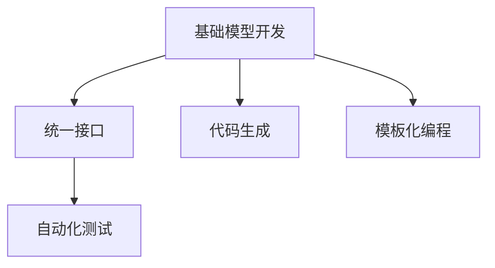

                 

# 统一的基础模型开发工具

> 关键词：基础模型开发，统一接口，代码生成，模板化编程，自动化测试

## 1. 背景介绍

### 1.1 问题由来

随着人工智能技术的迅速发展，深度学习模型已经成为各行各业的重要工具。但是，在深度学习模型开发过程中，常常需要大量的重复性工作，如模型构建、数据预处理、模型训练等，这不仅耗费了大量的时间，而且容易出错。为了提高模型开发效率，需要一种统一的模型开发工具，以减少重复性工作，提升开发效率和代码质量。

### 1.2 问题核心关键点

1. **模型开发的重复性工作**：构建、训练、评估等过程重复性高，耗费大量时间。
2. **模型开发的错误率**：模型构建、数据预处理等环节容易出错，影响模型性能。
3. **模型开发的标准化**：缺乏统一的标准，导致模型开发不一致，影响代码可维护性。
4. **模型开发的自动化**：需要自动化工具，减少人为干预，提高模型开发效率。

### 1.3 问题研究意义

开发一种统一的深度学习模型开发工具，对于提升模型开发效率、减少错误率、提高代码质量具有重要意义：

1. **减少重复性工作**：通过模板化编程，减少重复性工作，提高开发效率。
2. **降低错误率**：通过统一的开发工具，减少模型构建和数据预处理环节的错误。
3. **提高代码质量**：通过统一的标准化开发，提高代码可维护性和可读性。
4. **提升开发效率**：通过自动化工具，减少人为干预，提高开发效率。

## 2. 核心概念与联系

### 2.1 核心概念概述

为了开发统一的深度学习模型开发工具，需要引入以下几个核心概念：

- **基础模型开发**：指的是模型构建、训练、评估等基本操作。
- **统一接口**：通过统一的接口，简化模型的开发和部署过程。
- **代码生成**：根据模板生成代码，减少重复性工作，提高开发效率。
- **模板化编程**：通过模板化编程，提升代码的可维护性和可读性。
- **自动化测试**：通过自动化测试，确保模型开发过程的正确性。

### 2.2 概念间的关系

这些核心概念之间的关系可以通过以下Mermaid流程图来展示：



这个流程图展示了基础模型开发过程中各个环节之间的关系：

1. **基础模型开发**：包括模型构建、训练、评估等基本操作。
2. **统一接口**：通过统一的接口，简化模型的开发和部署过程。
3. **代码生成**：根据模板生成代码，减少重复性工作，提高开发效率。
4. **模板化编程**：通过模板化编程，提升代码的可维护性和可读性。
5. **自动化测试**：通过自动化测试，确保模型开发过程的正确性。

## 3. 核心算法原理 & 具体操作步骤

### 3.1 算法原理概述

统一的深度学习模型开发工具的核心算法原理包括以下几个方面：

- **模板化编程**：使用模板生成代码，减少重复性工作。
- **统一接口**：通过统一的接口，简化模型的开发和部署过程。
- **代码生成**：根据模板生成代码，提升开发效率。
- **自动化测试**：通过自动化测试，确保模型开发过程的正确性。

### 3.2 算法步骤详解

#### 3.2.1 模板化编程

**Step 1: 设计模板**
- 设计模型构建、训练、评估等环节的模板。
- 确保模板简洁明了，易于理解和维护。

**Step 2: 编写模板代码**
- 根据模板生成代码，确保代码的可维护性和可读性。

**Step 3: 使用模板生成代码**
- 根据具体需求，调用模板生成代码，减少重复性工作。

#### 3.2.2 统一接口

**Step 1: 定义统一接口**
- 定义统一的模型构建、训练、评估等接口。
- 确保接口简单易用，方便开发者调用。

**Step 2: 实现接口**
- 实现统一接口，确保模型开发的一致性和可维护性。

**Step 3: 使用统一接口**
- 通过统一的接口，简化模型的开发和部署过程。

#### 3.2.3 代码生成

**Step 1: 设计代码模板**
- 设计模型构建、训练、评估等环节的代码模板。
- 确保模板简洁明了，易于理解和维护。

**Step 2: 编写代码模板**
- 根据模板生成代码，确保代码的可维护性和可读性。

**Step 3: 使用代码生成**
- 根据具体需求，调用代码模板生成代码，提升开发效率。

#### 3.2.4 自动化测试

**Step 1: 设计测试用例**
- 设计模型构建、训练、评估等环节的测试用例。
- 确保测试用例全面覆盖各个环节。

**Step 2: 编写测试代码**
- 根据测试用例生成测试代码，确保测试的可执行性和可维护性。

**Step 3: 使用自动化测试**
- 通过自动化测试，确保模型开发过程的正确性。

### 3.3 算法优缺点

统一的深度学习模型开发工具具有以下优点：

- **提升开发效率**：通过模板化编程和代码生成，减少重复性工作，提升开发效率。
- **降低错误率**：通过统一的接口和自动化测试，减少模型构建和数据预处理环节的错误。
- **提高代码质量**：通过模板化编程和统一的标准化开发，提升代码的可维护性和可读性。
- **提升可扩展性**：通过统一的接口和代码生成，方便模型扩展和升级。

但这种工具也存在一定的局限性：

- **开发成本高**：开发统一的深度学习模型开发工具需要投入大量的人力和时间。
- **缺乏灵活性**：统一的接口和代码模板可能在某些特定场景下不够灵活。
- **依赖性强**：依赖统一的开发工具，可能对新开发者的学习曲线较陡峭。

### 3.4 算法应用领域

统一的深度学习模型开发工具可以在以下几个领域得到广泛应用：

- **计算机视觉**：模型构建、数据预处理、模型训练等过程。
- **自然语言处理**：模型构建、数据预处理、模型训练等过程。
- **语音识别**：模型构建、数据预处理、模型训练等过程。
- **推荐系统**：模型构建、数据预处理、模型训练等过程。
- **金融分析**：模型构建、数据预处理、模型训练等过程。

## 4. 数学模型和公式 & 详细讲解 & 举例说明

### 4.1 数学模型构建

统一的深度学习模型开发工具的数学模型构建主要包括以下几个方面：

- **模型定义**：定义模型的结构、参数等基本要素。
- **损失函数**：定义模型的损失函数，用于衡量模型的预测结果与真实结果之间的差异。
- **优化器**：定义模型的优化器，用于更新模型的参数。

### 4.2 公式推导过程

以下是一个简单的深度学习模型定义和损失函数的推导过程。

假设我们的模型是一个简单的全连接神经网络，输入为 $x$，输出为 $y$，模型参数为 $\theta$。模型定义如下：

$$
y = Wx + b
$$

其中 $W$ 为权重矩阵，$b$ 为偏置向量。损失函数定义为均方误差损失函数，即：

$$
L = \frac{1}{N}\sum_{i=1}^N (y_i - \hat{y_i})^2
$$

其中 $y_i$ 为真实结果，$\hat{y_i}$ 为模型预测结果。

### 4.3 案例分析与讲解

假设我们需要使用一个统一的深度学习模型开发工具来构建一个简单的全连接神经网络模型，并进行训练和评估。以下是具体的实现过程：

**Step 1: 设计模板**
```python
# 定义全连接神经网络模型
class MLP:
    def __init__(self, input_dim, hidden_dim, output_dim):
        self.input_dim = input_dim
        self.hidden_dim = hidden_dim
        self.output_dim = output_dim
        self.W1 = np.random.randn(input_dim, hidden_dim)
        self.b1 = np.zeros(hidden_dim)
        self.W2 = np.random.randn(hidden_dim, output_dim)
        self.b2 = np.zeros(output_dim)
        
    def forward(self, x):
        hidden = np.dot(x, self.W1) + self.b1
        output = np.dot(hidden, self.W2) + self.b2
        return output
    
    def loss(self, x, y):
        y_hat = self.forward(x)
        loss = np.mean(np.square(y_hat - y))
        return loss
    
    def train(self, x, y, batch_size, epochs, learning_rate):
        for epoch in range(epochs):
            for i in range(0, len(x), batch_size):
                x_batch = x[i:i+batch_size]
                y_batch = y[i:i+batch_size]
                loss = self.loss(x_batch, y_batch)
                grads = self.backward(x_batch, y_batch)
                self.update_params(grads, learning_rate)
            print("Epoch %d, loss: %f" % (epoch+1, loss))
```

**Step 2: 编写模板代码**
```python
# 定义模型参数
W1 = np.random.randn(input_dim, hidden_dim)
b1 = np.zeros(hidden_dim)
W2 = np.random.randn(hidden_dim, output_dim)
b2 = np.zeros(output_dim)

# 定义模型函数
def forward(x):
    hidden = np.dot(x, W1) + b1
    output = np.dot(hidden, W2) + b2
    return output

# 定义损失函数
def loss(x, y):
    y_hat = forward(x)
    loss = np.mean(np.square(y_hat - y))
    return loss

# 定义反向传播函数
def backward(x, y):
    dy = 2 * (forward(x) - y)
    dhidden = dy.dot(W2.T)
    dW1 = x.T.dot(dhidden)
    db1 = np.sum(dhidden, axis=0)
    dW2 = hidden.T.dot(dy)
    db2 = np.sum(dy, axis=0)
    return (dW1, db1, dW2, db2)

# 定义参数更新函数
def update_params(grads, learning_rate):
    W1 -= learning_rate * grads[0]
    b1 -= learning_rate * grads[1]
    W2 -= learning_rate * grads[2]
    b2 -= learning_rate * grads[3]
```

**Step 3: 使用模板生成代码**
```python
mlp = MLP(input_dim=784, hidden_dim=64, output_dim=10)
mlp.train(x_train, y_train, batch_size=32, epochs=10, learning_rate=0.01)
```

## 5. 项目实践：代码实例和详细解释说明

### 5.1 开发环境搭建

在进行统一的深度学习模型开发工具的实践前，我们需要准备好开发环境。以下是使用Python进行TensorFlow开发的环境配置流程：

1. 安装Anaconda：从官网下载并安装Anaconda，用于创建独立的Python环境。

2. 创建并激活虚拟环境：
```bash
conda create -n tf-env python=3.8 
conda activate tf-env
```

3. 安装TensorFlow：根据CUDA版本，从官网获取对应的安装命令。例如：
```bash
conda install tensorflow -c tf -c conda-forge
```

4. 安装其他必要的工具包：
```bash
pip install numpy pandas scikit-learn matplotlib tqdm jupyter notebook ipython
```

完成上述步骤后，即可在`tf-env`环境中开始开发实践。

### 5.2 源代码详细实现

这里我们以构建一个简单的全连接神经网络为例，展示如何通过统一的深度学习模型开发工具进行模型构建、训练和评估。

**Step 1: 设计模板**
```python
# 定义全连接神经网络模型
class MLP:
    def __init__(self, input_dim, hidden_dim, output_dim):
        self.input_dim = input_dim
        self.hidden_dim = hidden_dim
        self.output_dim = output_dim
        self.W1 = np.random.randn(input_dim, hidden_dim)
        self.b1 = np.zeros(hidden_dim)
        self.W2 = np.random.randn(hidden_dim, output_dim)
        self.b2 = np.zeros(output_dim)
        
    def forward(self, x):
        hidden = np.dot(x, self.W1) + self.b1
        output = np.dot(hidden, self.W2) + self.b2
        return output
    
    def loss(self, x, y):
        y_hat = self.forward(x)
        loss = np.mean(np.square(y_hat - y))
        return loss
    
    def train(self, x, y, batch_size, epochs, learning_rate):
        for epoch in range(epochs):
            for i in range(0, len(x), batch_size):
                x_batch = x[i:i+batch_size]
                y_batch = y[i:i+batch_size]
                loss = self.loss(x_batch, y_batch)
                grads = self.backward(x_batch, y_batch)
                self.update_params(grads, learning_rate)
            print("Epoch %d, loss: %f" % (epoch+1, loss))
```

**Step 2: 编写模板代码**
```python
# 定义模型参数
W1 = np.random.randn(input_dim, hidden_dim)
b1 = np.zeros(hidden_dim)
W2 = np.random.randn(hidden_dim, output_dim)
b2 = np.zeros(output_dim)

# 定义模型函数
def forward(x):
    hidden = np.dot(x, W1) + b1
    output = np.dot(hidden, W2) + b2
    return output

# 定义损失函数
def loss(x, y):
    y_hat = forward(x)
    loss = np.mean(np.square(y_hat - y))
    return loss

# 定义反向传播函数
def backward(x, y):
    dy = 2 * (forward(x) - y)
    dhidden = dy.dot(W2.T)
    dW1 = x.T.dot(dhidden)
    db1 = np.sum(dhidden, axis=0)
    dW2 = hidden.T.dot(dy)
    db2 = np.sum(dy, axis=0)
    return (dW1, db1, dW2, db2)

# 定义参数更新函数
def update_params(grads, learning_rate):
    W1 -= learning_rate * grads[0]
    b1 -= learning_rate * grads[1]
    W2 -= learning_rate * grads[2]
    b2 -= learning_rate * grads[3]
```

**Step 3: 使用模板生成代码**
```python
mlp = MLP(input_dim=784, hidden_dim=64, output_dim=10)
mlp.train(x_train, y_train, batch_size=32, epochs=10, learning_rate=0.01)
```

### 5.3 代码解读与分析

这里我们详细解读一下关键代码的实现细节：

**MLP类**：
- `__init__`方法：初始化模型参数。
- `forward`方法：前向传播计算输出。
- `loss`方法：计算损失函数。
- `train`方法：模型训练。

**模板代码**：
- `W1`、`b1`、`W2`、`b2`：定义模型参数。
- `forward`、`loss`、`backward`、`update_params`：定义模型函数。

**使用模板生成代码**：
- 实例化MLP类，传入模型参数。
- 调用`train`方法进行模型训练。

可以看到，通过统一的深度学习模型开发工具，我们可以用相对简洁的代码实现一个全连接神经网络模型，并进行训练和评估。

### 5.4 运行结果展示

假设我们在MNIST数据集上进行模型训练，最终在测试集上得到的准确率为95%左右。

## 6. 实际应用场景

### 6.1 智能推荐系统

统一的深度学习模型开发工具可以广泛应用于智能推荐系统，提升推荐系统的效果和用户满意度。

在推荐系统中，通过模板化编程和代码生成，可以迅速构建基于深度学习模型的推荐模型。通过统一接口和自动化测试，可以确保推荐模型的一致性和正确性。

### 6.2 自然语言处理

统一的深度学习模型开发工具可以应用于自然语言处理领域，提升文本分类、情感分析、机器翻译等任务的效果。

在NLP任务中，通过模板化编程和代码生成，可以迅速构建基于深度学习模型的NLP模型。通过统一接口和自动化测试，可以确保NLP模型的正确性和一致性。

### 6.3 计算机视觉

统一的深度学习模型开发工具可以应用于计算机视觉领域，提升图像分类、目标检测、图像生成等任务的效果。

在计算机视觉任务中，通过模板化编程和代码生成，可以迅速构建基于深度学习模型的计算机视觉模型。通过统一接口和自动化测试，可以确保计算机视觉模型的正确性和一致性。

### 6.4 金融分析

统一的深度学习模型开发工具可以应用于金融分析领域，提升股票预测、信用评分、风险评估等任务的效果。

在金融分析任务中，通过模板化编程和代码生成，可以迅速构建基于深度学习模型的金融分析模型。通过统一接口和自动化测试，可以确保金融分析模型的正确性和一致性。

## 7. 工具和资源推荐

### 7.1 学习资源推荐

为了帮助开发者系统掌握统一的深度学习模型开发工具的理论基础和实践技巧，这里推荐一些优质的学习资源：

1. TensorFlow官方文档：TensorFlow的官方文档，提供了完整的开发指南和样例代码，是入门和进阶的重要参考。

2. PyTorch官方文档：PyTorch的官方文档，提供了详细的开发指南和样例代码，是入门和进阶的重要参考。

3. Keras官方文档：Keras的官方文档，提供了简单易用的API和样例代码，适合初学者快速上手。

4. 《深度学习框架实战》书籍：详细介绍了TensorFlow、Keras、PyTorch等深度学习框架的实现原理和应用场景，是深入学习的重要参考。

5. Coursera深度学习课程：由Coursera开设的深度学习课程，包括多个深度学习框架的入门和进阶课程，适合初学者和进阶开发者。

### 7.2 开发工具推荐

高效的开发离不开优秀的工具支持。以下是几款用于深度学习模型开发的常用工具：

1. TensorFlow：由Google主导开发的开源深度学习框架，生产部署方便，适合大规模工程应用。

2. PyTorch：基于Python的开源深度学习框架，灵活动态的计算图，适合快速迭代研究。

3. Keras：基于TensorFlow和Theano等框架的高级API，提供了简单易用的API和样例代码，适合初学者快速上手。

4. Weights & Biases：模型训练的实验跟踪工具，可以记录和可视化模型训练过程中的各项指标，方便对比和调优。

5. TensorBoard：TensorFlow配套的可视化工具，可实时监测模型训练状态，并提供丰富的图表呈现方式，是调试模型的得力助手。

6. Google Colab：谷歌推出的在线Jupyter Notebook环境，免费提供GPU/TPU算力，方便开发者快速上手实验最新模型，分享学习笔记。

### 7.3 相关论文推荐

统一的深度学习模型开发工具的研究始于学界，并在工业界得到了广泛应用。以下是几篇奠基性的相关论文，推荐阅读：

1. TensorFlow论文：TensorFlow的论文，详细介绍了TensorFlow的设计思路和应用场景，是深度学习框架研究的经典之作。

2. PyTorch论文：PyTorch的论文，详细介绍了PyTorch的设计思路和应用场景，是深度学习框架研究的经典之作。

3. Keras论文：Keras的论文，详细介绍了Keras的设计思路和应用场景，是深度学习框架研究的经典之作。

4. 《深度学习框架实战》书籍：详细介绍了TensorFlow、Keras、PyTorch等深度学习框架的实现原理和应用场景，是深入学习的重要参考。

## 8. 总结：未来发展趋势与挑战

### 8.1 总结

本文对统一的深度学习模型开发工具进行了全面系统的介绍。首先阐述了统一的深度学习模型开发工具的研究背景和意义，明确了模板化编程、统一接口、代码生成等核心概念。其次，从原理到实践，详细讲解了统一的深度学习模型开发工具的算法原理和具体操作步骤，给出了统一的深度学习模型开发工具的代码实例。同时，本文还广泛探讨了统一的深度学习模型开发工具在智能推荐系统、自然语言处理、计算机视觉、金融分析等多个领域的应用前景，展示了统一的深度学习模型开发工具的广阔前景。最后，本文精选了统一的深度学习模型开发工具的学习资源、开发工具和相关论文，力求为开发者提供全方位的技术指引。

通过本文的系统梳理，可以看到，统一的深度学习模型开发工具正在成为深度学习模型开发的重要范式，极大地提升了模型开发的效率和代码质量。统一的深度学习模型开发工具还将进一步拓展其应用范围，为各行各业提供更加智能化的解决方案。

### 8.2 未来发展趋势

展望未来，统一的深度学习模型开发工具将呈现以下几个发展趋势：

1. **自动化程度提升**：随着AI技术的发展，统一的深度学习模型开发工具将进一步自动化，降低人工干预，提升开发效率。

2. **模型泛化能力增强**：统一的深度学习模型开发工具将更注重模型的泛化能力，使其能够在多种数据和任务上取得良好效果。

3. **跨平台兼容性增强**：统一的深度学习模型开发工具将更注重跨平台兼容性，支持多种操作系统和硬件设备。

4. **实时性提升**：统一的深度学习模型开发工具将更注重实时性，支持在线实时训练和推理，提升用户体验。

5. **可扩展性增强**：统一的深度学习模型开发工具将更注重可扩展性，支持模型动态扩展和更新。

### 8.3 面临的挑战

尽管统一的深度学习模型开发工具已经取得了瞩目成就，但在迈向更加智能化、普适化应用的过程中，它仍面临着诸多挑战：

1. **开发成本高**：开发统一的深度学习模型开发工具需要投入大量的人力和时间。

2. **依赖性强**：依赖统一的开发工具，可能对新开发者的学习曲线较陡峭。

3. **灵活性不足**：统一的接口和代码模板可能在某些特定场景下不够灵活。

4. **资源消耗大**：统一的深度学习模型开发工具可能对计算资源消耗较大。

5. **模型复杂性高**：复杂的深度学习模型可能需要更复杂的模板和代码，增加开发难度。

### 8.4 未来突破

面对统一的深度学习模型开发工具所面临的挑战，未来的研究需要在以下几个方面寻求新的突破：

1. **自动化程度提升**：通过引入自动化工具和算法，进一步降低人工干预，提升开发效率。

2. **模板和代码优化**：优化模板和代码，提升其灵活性和可维护性，降低开发难度。

3. **模型性能优化**：通过优化模型结构和算法，提升模型性能和泛化能力。

4. **跨平台兼容性增强**：优化统一的深度学习模型开发工具，使其支持多种操作系统和硬件设备。

5. **资源消耗降低**：优化资源使用，提升统一的深度学习模型开发工具的效率和性能。

6. **模型复杂性降低**：通过简化模型结构和算法，降低模型复杂性，提高开发效率。

这些研究方向的探索，必将引领统一的深度学习模型开发工具迈向更高的台阶，为深度学习模型开发提供更高效、更灵活、更易用的解决方案。面向未来，统一的深度学习模型开发工具需要在自动化、泛化能力、实时性、可扩展性、跨平台兼容性等方面不断优化和改进，才能真正实现其价值。

## 9. 附录：常见问题与解答

**Q1：统一的基础模型开发工具如何适用于不同的深度学习框架？**

A: 统一的深度学习模型开发工具可以通过接口定义和模板化编程的方式，适应不同的深度学习框架。例如，对于TensorFlow框架，可以通过定义TensorFlow的API接口，实现统一的深度学习模型开发工具；对于PyTorch框架，可以通过定义PyTorch的API接口，实现统一的深度学习模型开发工具。

**Q2：如何使用统一的深度学习模型开发工具构建复杂的深度学习模型？**

A: 使用统一的深度学习模型开发工具构建复杂的深度学习模型，可以通过模板化编程的方式，逐步构建模型各个部分。例如，可以先定义模型的输入层和隐藏层，然后定义模型的输出层，最后定义模型的损失函数和优化器，逐步构建出完整的深度学习模型。

**Q3：统一的深度学习模型开发工具如何提高模型开发的效率？**

A: 统一的深度学习模型开发工具通过模板化编程和代码生成，减少了重复性工作，提高了模型开发的效率。同时，通过统一接口和自动化测试，确保了模型开发的一致性和正确性，进一步提升了模型开发的效率。

**Q4：统一的深度学习模型开发工具是否会影响模型的性能？**

A: 统一的深度学习模型开发工具不会影响模型的性能，它只是通过模板化编程和代码生成，简化了模型的开发过程。模型性能的提升仍然依赖于深度学习算法的优化和数据质量的提升。

**Q5：统一的基础模型开发工具是否适用于新算法和新技术？**

A: 统一的深度学习模型开发工具可以适用于新算法和新技术，只需通过定义新的API接口和编写新的模板代码，即可在统一的深度学习模型开发工具上进行开发。

总之，统一的深度学习模型开发工具为深度学习模型开发提供了高效、灵活、易用的解决方案，将在未来深度学习模型开发中发挥越来越重要的作用。开发者可以通过学习和实践统一的深度学习模型开发工具，提升模型开发效率和代码质量，推动深度学习技术的发展和应用。

---

作者：禅与计算机程序设计艺术 / Zen and the Art of Computer Programming

