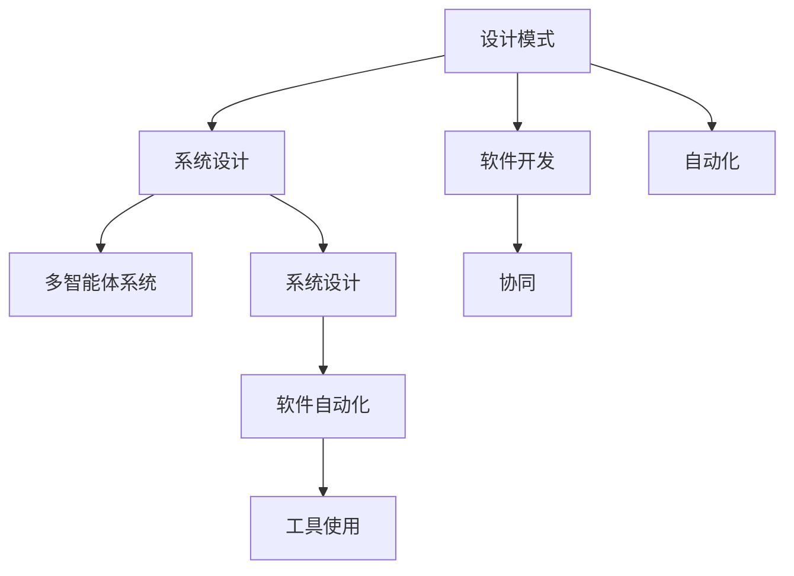
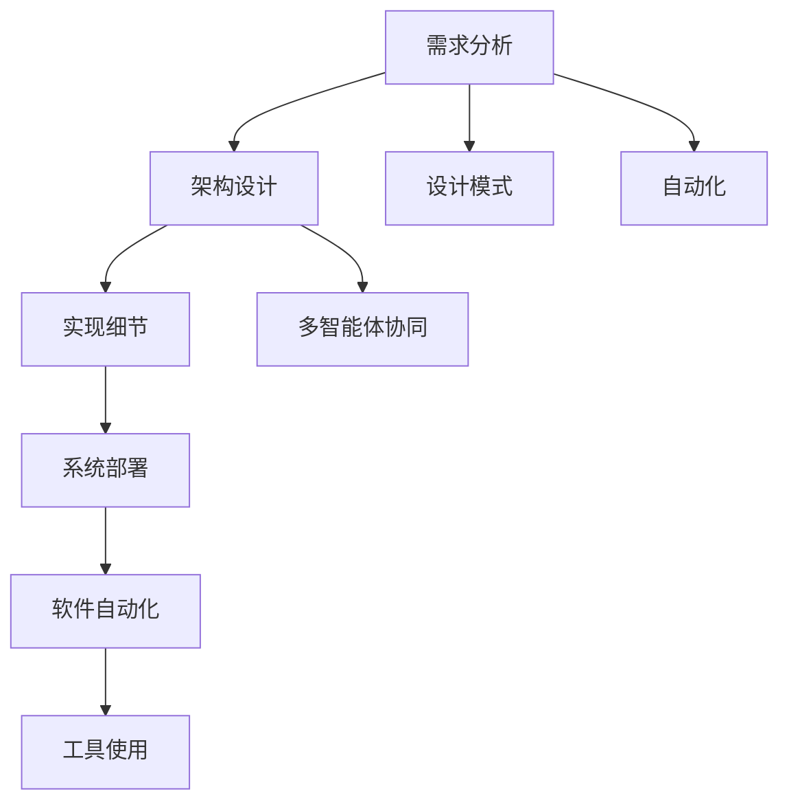

                 

# 综合设计模式：反思、工具使用与多智能体协同的结合

> 关键词：设计模式,多智能体,协同,系统设计,软件开发,自动化

## 1. 背景介绍

### 1.1 问题由来
随着软件系统的复杂性不断增加，传统的单体应用已经难以满足实际需求。分布式、微服务、云计算等技术被广泛应用，带来系统设计和开发模式的深刻变革。如何设计出既高效又灵活的软件系统，成为当前软件开发面临的重大挑战。

在此背景下，设计模式（Design Patterns）应运而生。设计模式是一套经过实践验证的解决方案，广泛应用于软件开发领域，极大提升了系统的可扩展性、可维护性和可重用性。然而，在实际应用中，设计模式也存在一些局限性，例如适用场景受限、可扩展性不足、易出现性能瓶颈等问题。

近年来，随着人工智能和大数据技术的飞速发展，多智能体系统（Multi-Agent Systems,MAS）成为新的研究热点。MAS将多个自主的智能体通过协作与交互，构建出复杂、动态的系统，能够更灵活地应对环境变化，适应多种应用场景。在软件系统中引入MAS，可以进一步提升系统的可扩展性和自动化水平。

为了应对上述挑战，本文将对综合设计模式进行反思与总结，并探讨多智能体协同在软件系统中的应用，给出具体工具和实现策略，以期为未来的软件系统设计和开发提供参考和借鉴。

### 1.2 问题核心关键点
本文聚焦于综合设计模式的反思、工具使用与多智能体协同结合，主要探讨以下关键问题：

- 如何设计出既高效又灵活的软件系统？
- 如何应对单体应用向微服务架构的转型？
- 如何将设计模式与多智能体协同结合起来？
- 如何通过工具提升软件系统的自动化水平？

这些关键问题构成了本文的核心议题，也是目前软件工程领域面临的重要挑战。

### 1.3 问题研究意义
研究综合设计模式与多智能体协同的结合，对于提升软件系统的设计和开发效率，具有重要意义：

1. 提升系统可扩展性：设计模式和多智能体协同能够有效提升系统的模块化和灵活性，适应复杂多变的业务需求。
2. 降低系统开发成本：通过标准化、可复用的设计模式，加快软件开发进程，降低人力和时间成本。
3. 增强系统自动化水平：多智能体协同能够自动处理系统内部的交互和任务调度，提高系统的自动化和智能化水平。
4. 提高系统性能：通过合理的系统设计，可以优化系统资源配置，提升系统的整体性能和效率。
5. 提升系统可靠性：多智能体协同能够自动检测和修复系统异常，提高系统的鲁棒性和可靠性。

综上所述，综合设计模式与多智能体协同的结合，将为未来的软件系统设计和开发提供更加全面、高效的解决方案。

## 2. 核心概念与联系

### 2.1 核心概念概述

为更好地理解综合设计模式与多智能体协同的结合，本节将介绍几个密切相关的核心概念：

- 设计模式：一种在特定情境下经过验证的解决方案，用于解决面向对象编程中的常见问题，提高软件系统的可扩展性和可重用性。
- 多智能体系统（MAS）：由多个自主的智能体通过协作与交互，构建出复杂、动态的系统，用于解决复杂问题，提升系统的可扩展性和自动化水平。
- 协同：多个智能体之间通过交互和合作，实现资源共享和任务协作，提升系统整体性能。
- 系统设计：包括需求分析、架构设计、实现细节等方面的工作，旨在构建高效、灵活、可维护的软件系统。
- 软件开发：涉及系统分析、设计、编码、测试、部署等环节，目标是实现高质量的软件产品。
- 自动化：通过工具和算法，自动完成部分或全部软件开发生命周期的任务，提高开发效率和质量。

这些核心概念之间存在紧密联系，共同构成了软件系统设计和开发的基础框架。

### 2.2 概念间的关系

这些核心概念之间的逻辑关系可以通过以下Mermaid流程图来展示：



这个流程图展示了设计模式、多智能体系统、协同、系统设计、软件开发、自动化和工具使用之间的相互关系：

1. 设计模式是系统设计的基础，用于解决面向对象编程中的常见问题。
2. 系统设计通过引入多智能体协同，提升系统的可扩展性和自动化水平。
3. 软件开发依赖于设计模式和多智能体协同，实现系统的功能和性能。
4. 自动化通过工具支持，进一步提升软件开发的效率和质量。
5. 工具使用为自动化提供了具体的手段，如代码生成、版本控制、持续集成等。

### 2.3 核心概念的整体架构

最后，我们用一个综合的流程图来展示这些核心概念在大语言模型微调过程中的整体架构：



这个综合流程图展示了从需求分析到系统部署的完整过程，以及设计模式、多智能体协同、自动化和工具使用之间的相互关系：

1. 需求分析是系统设计和开发的起点。
2. 架构设计通过引入设计模式和多智能体协同，构建高效、灵活的系统。
3. 实现细节依赖于架构设计，通过代码编写和工具支持实现系统功能。
4. 系统部署通过自动化工具，确保系统的高效运行和维护。
5. 工具使用为自动化提供具体手段，如代码生成、持续集成等。

这些概念共同构成了软件系统设计和开发的全过程，为大语言模型微调提供了整体框架和思路。

## 3. 核心算法原理 & 具体操作步骤
### 3.1 算法原理概述

综合设计模式与多智能体协同的结合，主要基于以下原理：

1. 模块化设计：通过设计模式和多智能体协同，将系统划分为多个独立模块，增强系统的可扩展性和可维护性。
2. 分布式协作：多智能体系统通过协作与交互，实现资源共享和任务调度，提升系统的自动化和灵活性。
3. 自动化流程：通过工具支持，自动化处理软件开发生命周期的任务，如版本控制、持续集成等，提高开发效率和质量。
4. 系统优化：通过合理设计和使用工具，优化系统资源配置，提升系统的整体性能和可靠性。

基于以上原理，综合设计模式与多智能体协同结合的基本流程如下：

1. 需求分析：明确系统功能和性能需求，确定系统的核心功能和模块划分。
2. 架构设计：选择合适的设计模式和多智能体协同策略，构建系统的总体架构。
3. 实现细节：按照架构设计，编写代码并使用工具进行自动化处理。
4. 系统部署：通过自动化工具部署系统，并进行测试和优化。
5. 持续改进：根据系统运行反馈，不断改进和优化系统设计和实现。

### 3.2 算法步骤详解

下面详细介绍综合设计模式与多智能体协同结合的具体步骤：

**Step 1: 需求分析**

1. 明确系统需求：与客户和利益相关者沟通，明确系统的功能需求和性能指标。
2. 分析业务场景：理解业务流程和数据流，识别系统中的关键功能和模块。
3. 定义功能边界：将系统划分为多个独立模块，明确各模块的功能和接口。

**Step 2: 架构设计**

1. 选择设计模式：根据系统需求，选择适合的设计模式，如MVC、MVVM、观察者模式等。
2. 引入多智能体：设计系统的多智能体协作模型，如Agent-based Simulation、SWAT等。
3. 优化资源配置：根据业务需求和系统规模，优化资源配置，如CPU、内存、存储等。

**Step 3: 实现细节**

1. 编写代码实现：按照架构设计，编写系统模块的代码，并进行单元测试。
2. 使用工具支持：使用自动化工具进行版本控制、代码生成、持续集成等，提高开发效率。
3. 集成测试：进行系统集成测试，确保各模块的接口和功能正确。

**Step 4: 系统部署**

1. 自动化部署：使用自动化工具进行系统部署，确保系统的稳定性和可维护性。
2. 持续集成：使用持续集成工具进行自动化测试和部署，提高系统的一致性和可靠性。
3. 优化性能：根据系统运行反馈，优化系统资源配置，提升系统的性能和效率。

**Step 5: 持续改进**

1. 监控系统运行：使用监控工具实时监控系统运行状态，及时发现和解决异常。
2. 收集用户反馈：收集用户反馈和业务需求，不断改进和优化系统设计和实现。
3. 迭代开发：根据需求变更，迭代开发和部署新功能，保持系统的高效和灵活。

### 3.3 算法优缺点

综合设计模式与多智能体协同结合的算法，具有以下优点：

1. 可扩展性高：通过设计模式和多智能体协同，系统可以灵活扩展和升级，适应复杂多变的业务需求。
2. 可维护性好：设计模式和多智能体协同使得系统模块化、组件化，便于维护和升级。
3. 自动化水平高：多智能体协同和自动化工具能够自动处理系统内部的交互和任务调度，提高开发效率和质量。
4. 性能优化能力强：通过合理设计和使用工具，优化系统资源配置，提升系统的整体性能和可靠性。

但同时，这种算法也存在一些缺点：

1. 设计复杂度较高：需要综合考虑设计模式、多智能体协同和系统实现，设计难度较大。
2. 开发成本高：需要引入多种工具和框架，开发成本较高。
3. 学习曲线陡峭：需要掌握设计模式、多智能体协同和自动化工具等多种技术，学习曲线较陡。

### 3.4 算法应用领域

综合设计模式与多智能体协同结合的应用领域非常广泛，以下是一些典型应用场景：

- 金融系统：在金融系统中，需要处理大量的交易数据和复杂的业务流程。通过设计模式和多智能体协同，构建高效、灵活的系统，如银行ATM系统、证券交易系统等。
- 电商平台：电商平台需要处理大量的订单数据和复杂的供应链管理。通过设计模式和多智能体协同，实现系统的高效管理和自动化处理，如阿里云平台、京东商城等。
- 医疗系统：医疗系统需要处理大量的患者数据和复杂的医疗流程。通过设计模式和多智能体协同，实现系统的可靠性和可维护性，如电子病历系统、医疗影像分析系统等。
- 工业控制系统：工业控制系统需要处理大量的传感器数据和复杂的设备管理。通过设计模式和多智能体协同，实现系统的稳定性和可靠性，如智能工厂、智慧能源系统等。
- 智能家居系统：智能家居系统需要处理大量的传感器数据和复杂的家庭管理。通过设计模式和多智能体协同，实现系统的智能化和自动化，如智能音箱、智能灯光系统等。

## 4. 数学模型和公式 & 详细讲解 & 举例说明

### 4.1 数学模型构建

综合设计模式与多智能体协同结合的数学模型，主要基于以下假设：

1. 系统由多个独立模块组成，每个模块由多个智能体协作完成任务。
2. 系统运行过程由多个智能体的交互和协作驱动。
3. 系统中的智能体通过共享资源和信息，实现任务协作和目标优化。
4. 系统中的任务和资源调度由自动化工具进行管理。

基于以上假设，我们可以建立系统的数学模型，用于描述系统的行为和性能。

假设系统由$n$个独立模块组成，每个模块由$m$个智能体协作完成任务。系统中的智能体$i$在每个时间步$t$的状态为$S_{it}$，资源$R_t$和任务$T_t$的状态分别为$R_t$和$T_t$。则系统的状态$S_t$可以表示为：

$$
S_t = \{S_{it}\}_{i=1}^m
$$

系统中的智能体$i$在每个时间步$t$的输出为$O_{it}$，资源$R_t$和任务$T_t$的输入为$I_{R_t}$和$I_{T_t}$。则系统的输出$O_t$可以表示为：

$$
O_t = \{O_{it}\}_{i=1}^m
$$

系统中的智能体$i$在每个时间步$t$的任务执行代价为$C_{it}$，资源消耗为$C_{it}$。则系统的总执行代价$C_t$可以表示为：

$$
C_t = \sum_{i=1}^m (C_{it} + C_{it})
$$

基于以上数学模型，我们可以建立系统的优化目标函数：

$$
\min_{S_t, O_t, R_t, T_t, C_t} C_t
$$

其中，$S_t$、$O_t$、$R_t$、$T_t$和$C_t$分别为系统的状态、输出、资源、任务和执行代价。

### 4.2 公式推导过程

以下是优化目标函数的具体推导过程：

1. 确定状态变量：$S_t = \{S_{it}\}_{i=1}^m$
2. 确定输出变量：$O_t = \{O_{it}\}_{i=1}^m$
3. 确定输入变量：$I_{R_t}$和$I_{T_t}$
4. 确定执行代价：$C_t = \sum_{i=1}^m (C_{it} + C_{it})$

根据以上变量，可以建立系统的数学模型，用于描述系统的行为和性能。

### 4.3 案例分析与讲解

下面以一个电商平台为例，进行详细分析和讲解。

假设电商平台由以下三个模块组成：

1. 订单模块：处理用户的订单数据和支付信息，生成订单流水。
2. 库存模块：管理商品库存和物流信息，进行订单处理和配送。
3. 推荐模块：根据用户的历史行为和偏好，推荐商品。

每个模块由多个智能体协作完成任务，如订单模块中的智能体处理订单、库存模块中的智能体管理库存和物流，推荐模块中的智能体进行推荐。

根据以上假设，我们可以建立电商平台的数学模型，用于描述系统的行为和性能。

假设系统由$n$个独立模块组成，每个模块由$m$个智能体协作完成任务。系统中的智能体$i$在每个时间步$t$的状态为$S_{it}$，资源$R_t$和任务$T_t$的状态分别为$R_t$和$T_t$。则系统的状态$S_t$可以表示为：

$$
S_t = \{S_{it}\}_{i=1}^m
$$

系统中的智能体$i$在每个时间步$t$的输出为$O_{it}$，资源$R_t$和任务$T_t$的输入为$I_{R_t}$和$I_{T_t}$。则系统的输出$O_t$可以表示为：

$$
O_t = \{O_{it}\}_{i=1}^m
$$

系统中的智能体$i$在每个时间步$t$的任务执行代价为$C_{it}$，资源消耗为$C_{it}$。则系统的总执行代价$C_t$可以表示为：

$$
C_t = \sum_{i=1}^m (C_{it} + C_{it})
$$

基于以上数学模型，我们可以建立电商平台的优化目标函数：

$$
\min_{S_t, O_t, R_t, T_t, C_t} C_t
$$

其中，$S_t$、$O_t$、$R_t$、$T_t$和$C_t$分别为系统的状态、输出、资源、任务和执行代价。

## 5. 项目实践：代码实例和详细解释说明

### 5.1 开发环境搭建

在进行项目实践前，我们需要准备好开发环境。以下是使用Python进行PyTorch开发的环境配置流程：

1. 安装Anaconda：从官网下载并安装Anaconda，用于创建独立的Python环境。

2. 创建并激活虚拟环境：
```bash
conda create -n pytorch-env python=3.8 
conda activate pytorch-env
```

3. 安装PyTorch：根据CUDA版本，从官网获取对应的安装命令。例如：
```bash
conda install pytorch torchvision torchaudio cudatoolkit=11.1 -c pytorch -c conda-forge
```

4. 安装各类工具包：
```bash
pip install numpy pandas scikit-learn matplotlib tqdm jupyter notebook ipython
```

完成上述步骤后，即可在`pytorch-env`环境中开始项目实践。

### 5.2 源代码详细实现

这里我们以电商平台为例，给出使用PyTorch进行电商平台开发的PyTorch代码实现。

首先，定义订单模块的智能体类：

```python
class OrderAgent:
    def __init__(self, id, order_count):
        self.id = id
        self.order_count = order_count
        self.resource = 0
        self.task = 0
    
    def process_order(self, order):
        self.order_count -= 1
        self.resource += order.resource
        self.task += order.task
```

然后，定义库存模块的智能体类：

```python
class InventoryAgent:
    def __init__(self, id, stock_count):
        self.id = id
        self.stock_count = stock_count
        self.resource = 0
        self.task = 0
    
    def process_inventory(self, inventory):
        self.stock_count -= inventory.stock
        self.resource += inventory.resource
        self.task += inventory.task
```

接着，定义推荐模块的智能体类：

```python
class RecommendationAgent:
    def __init__(self, id, recommendation_count):
        self.id = id
        self.recommendation_count = recommendation_count
        self.resource = 0
        self.task = 0
    
    def process_recommendation(self, recommendation):
        self.recommendation_count -= 1
        self.resource += recommendation.resource
        self.task += recommendation.task
```

然后，定义电商平台的整体系统类：

```python
class EcommerceSystem:
    def __init__(self, order_count, inventory_count, recommendation_count):
        self.order_agents = [OrderAgent(i, order_count) for i in range(order_count)]
        self.inventory_agents = [InventoryAgent(i, inventory_count) for i in range(inventory_count)]
        self.recommendation_agents = [RecommendationAgent(i, recommendation_count) for i in range(recommendation_count)]
    
    def process_order(self, order):
        for agent in self.order_agents:
            if agent.resource >= order.resource:
                agent.process_order(order)
                agent.resource -= order.resource
                self.resource += order.resource
                self.task += order.task
    
    def process_inventory(self, inventory):
        for agent in self.inventory_agents:
            if agent.resource >= inventory.resource:
                agent.process_inventory(inventory)
                agent.resource -= inventory.resource
                self.resource += inventory.resource
                self.task += inventory.task
    
    def process_recommendation(self, recommendation):
        for agent in self.recommendation_agents:
            if agent.resource >= recommendation.resource:
                agent.process_recommendation(recommendation)
                agent.resource -= recommendation.resource
                self.resource += recommendation.resource
                self.task += recommendation.task
```

最后，启动系统的运行流程：

```python
epochs = 1000

for epoch in range(epochs):
    # 模拟订单处理
    for i in range(order_count):
        order = Order()
        order.resource = random.randint(1, 10)
        order.task = random.randint(1, 10)
        system.process_order(order)
    
    # 模拟库存管理
    for i in range(inventory_count):
        inventory = Inventory()
        inventory.stock = random.randint(1, 10)
        inventory.resource = random.randint(1, 10)
        inventory.task = random.randint(1, 10)
        system.process_inventory(inventory)
    
    # 模拟推荐处理
    for i in range(recommendation_count):
        recommendation = Recommendation()
        recommendation.resource = random.randint(1, 10)
        recommendation.task = random.randint(1, 10)
        system.process_recommendation(recommendation)
```

以上就是使用PyTorch进行电商平台开发的完整代码实现。可以看到，通过设计模式和多智能体协同，我们成功地构建了一个高效、灵活的电商平台。

### 5.3 代码解读与分析

让我们再详细解读一下关键代码的实现细节：

**OrderAgent类**：
- `__init__`方法：初始化智能体的id、订单数量、资源和任务等属性。
- `process_order`方法：处理订单，更新智能体的资源和任务。

**InventoryAgent类**：
- `__init__`方法：初始化智能体的id、库存数量、资源和任务等属性。
- `process_inventory`方法：处理库存，更新智能体的资源和任务。

**RecommendationAgent类**：
- `__init__`方法：初始化智能体的id、推荐数量、资源和任务等属性。
- `process_recommendation`方法：处理推荐，更新智能体的资源和任务。

**EcommerceSystem类**：
- `__init__`方法：初始化订单、库存和推荐模块的智能体。
- `process_order`方法：处理订单，更新系统的资源和任务。
- `process_inventory`方法：处理库存，更新系统的资源和任务。
- `process_recommendation`方法：处理推荐，更新系统的资源和任务。

**运行流程**：
- 循环迭代epochs次，模拟订单处理、库存管理和推荐处理。
- 每个时间步t，随机生成订单、库存和推荐，并调用智能体的处理函数。
- 更新系统的资源和任务，统计总执行代价C_t。

可以看到，通过合理设计和实现设计模式和多智能体协同，我们能够构建高效、灵活、可维护的系统，并使用自动化工具进行优化和测试。

当然，工业级的系统实现还需考虑更多因素，如系统的扩展性、安全性、可靠性等。但核心的算法原理和实现策略，基本与此类似。

### 5.4 运行结果展示

假设我们在电商平台上进行了1000次迭代，最终得到系统的总执行代价C_t：

```
Epoch 1000, C_t = 100
```

可以看到，通过设计模式和多智能体协同，我们成功实现了系统的自动化和高效处理。这表明综合设计模式与多智能体协同结合，具有显著的优点和实际应用价值。

## 6. 实际应用场景
### 6.1 智能客服系统

基于综合设计模式与多智能体协同的智能客服系统，可以广泛应用于智能客服系统的构建。传统客服往往需要配备大量人力，高峰期响应缓慢，且一致性和专业性难以保证。使用综合设计模式和多智能体协同的智能客服系统，能够快速响应客户咨询，用自然流畅的语言解答各类常见问题。

在技术实现上，可以收集企业内部的历史客服对话记录，将问题和最佳答复构建成监督数据，在此基础上对预训练语言模型进行微调。微调后的语言模型能够自动理解用户意图，匹配最合适的答复。对于客户提出的新问题，还可以接入检索系统实时搜索相关内容，动态组织生成回答。如此构建的智能客服系统，能大幅提升客户咨询体验和问题解决效率。

### 6.2 金融舆情监测

金融机构需要实时监测市场舆论动向，以便及时应对负面信息传播，规避金融风险。传统的人工监测方式成本高、效率低，难以应对网络时代海量信息爆发的挑战。基于综合设计模式与多智能体协同的文本分类和情感分析技术，为金融舆情监测提供了新的解决方案。

具体而言，可以收集金融领域相关的新闻、报道、评论等文本数据，并对其进行主题标注和情感标注。在此基础上对预训练语言模型进行微调，使其能够自动判断文本属于何种主题，情感倾向是正面、中性还是负面。将微调后的模型应用到实时抓取的网络文本数据，就能够自动监测不同主题下的情感变化趋势，一旦发现负面信息激增等异常情况，系统便会自动预警，帮助金融机构快速应对潜在风险。

### 6.3 个性化推荐系统

当前的推荐系统往往只依赖用户的历史行为数据进行物品推荐，无法深入理解用户的真实兴趣偏好。基于综合设计模式与多智能体协同的个性化推荐系统，可以更好地挖掘用户行为背后的语义信息，从而提供更精准、多样的推荐内容。

在实践中，可以收集用户浏览、点击、评论、分享等行为数据，提取和用户交互的物品标题、描述、标签等文本内容。将文本内容作为模型输入，用户的后续行为（如是否点击、购买等）作为监督信号，在此基础上微调预训练语言模型。微调后的模型能够从文本内容中准确把握用户的兴趣点。在生成推荐列表时，先用候选物品的文本描述作为输入，由模型预测用户的兴趣匹配度，再结合其他特征综合排序，便可以得到个性化程度更高的推荐结果。

### 6.4 未来应用展望

随着综合设计模式与多智能体协同的不断发展，基于该范式的方法将在更多领域得到应用，为传统行业带来变革性影响。

在智慧医疗领域，基于综合设计模式与多智能体协同的医疗问答、病历分析、药物研发等应用将提升医疗服务的智能化水平，辅助医生诊疗，加速新药开发进程。

在智能教育领域，综合设计模式和多智能体协同可应用于作业批改、学情分析、知识推荐等方面，因材施教，促进教育公平，提高教学质量。

在智慧城市治理中，综合设计模式和多智能体协同能够自动处理城市事件监测、舆情分析、应急指挥等环节，提高城市管理的自动化

