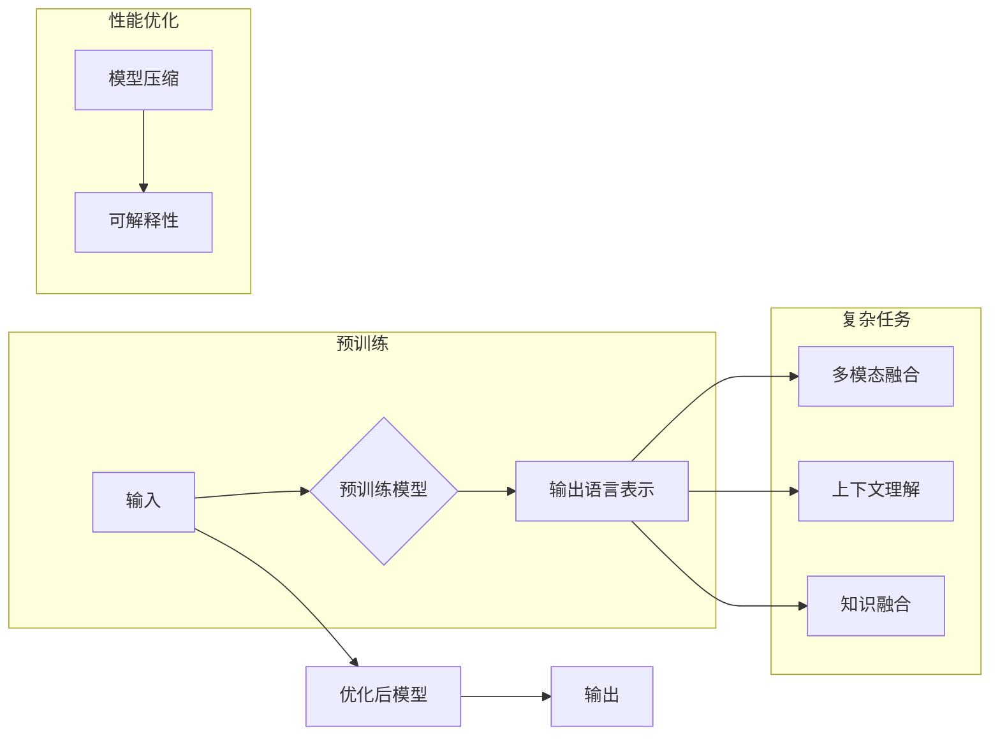

# 提高 LLM 应用面向复杂任务的性能

> 关键词：大型语言模型 (LLM), 复杂任务，性能优化，多模态，上下文理解，知识融合，可解释性，模型压缩

## 1. 背景介绍

随着深度学习技术的飞速发展，大型语言模型（LLM）在自然语言处理（NLP）领域取得了令人瞩目的成就。LLM 如 GPT-3、BERT 等，通过在庞大的文本语料库上进行预训练，能够理解和生成自然语言，并在各种下游任务中展现出强大的能力。然而，LLM 在处理复杂任务时，往往会遇到性能瓶颈。本文将探讨如何提高 LLM 在复杂任务中的性能，包括多模态融合、上下文理解、知识融合、可解释性提升和模型压缩等方面。

## 2. 核心概念与联系

### 2.1 核心概念

#### 2.1.1 大型语言模型 (LLM)
LLM 是一种能够理解和生成自然语言的深度学习模型。它们通过预训练学习到丰富的语言知识和模式，可以应用于各种 NLP 任务，如文本分类、机器翻译、问答系统等。

#### 2.1.2 复杂任务
复杂任务指的是那些需要 LLM 具备高级认知能力的任务，例如多模态理解、情感分析、知识图谱推理等。

#### 2.1.3 性能优化
性能优化是指通过改进模型结构、算法和工程实践，提升 LLM 在复杂任务中的表现。

#### 2.1.4 多模态
多模态是指将来自不同模态的数据（如图像、音频、视频等）融合起来，以增强模型的感知和理解能力。

#### 2.1.5 上下文理解
上下文理解是指模型能够理解输入文本的上下文信息，并据此做出更准确的预测。

#### 2.1.6 知识融合
知识融合是指将外部知识库或领域知识整合到 LLM 中，以提升其在复杂任务中的性能。

#### 2.1.7 可解释性
可解释性是指模型决策过程可以被理解和解释的能力。

#### 2.1.8 模型压缩
模型压缩是指通过降低模型复杂度，减小模型尺寸和计算量，以适应资源受限的设备。

### 2.2 核心概念原理和架构的 Mermaid 流程图



## 3. 核心算法原理 & 具体操作步骤

### 3.1 算法原理概述

提高 LLM 在复杂任务中的性能，主要涉及以下几个方面：

- **多模态融合**：将文本与其他模态（如图像、音频、视频）的数据融合，以提供更丰富的上下文信息。
- **上下文理解**：通过改进模型结构或算法，使 LLM 能够更好地理解输入文本的上下文信息。
- **知识融合**：将外部知识库或领域知识整合到 LLM 中，以提升其在复杂任务中的性能。
- **可解释性**：提高模型的决策过程可解释性，以便更好地理解模型的行为。
- **模型压缩**：通过模型压缩技术，减小模型尺寸和计算量，以适应资源受限的设备。

### 3.2 算法步骤详解

#### 3.2.1 多模态融合

1. 数据收集：收集相关模态的数据，并进行预处理。
2. 模型选择：选择合适的模型结构，如多模态 Transformer 模型。
3. 融合策略：采用注意力机制、图神经网络等方法，将不同模态的数据融合起来。
4. 训练和评估：在融合后的数据集上训练模型，并在测试集上评估性能。

#### 3.2.2 上下文理解

1. 模型改进：通过改进 Transformer 模型的结构，如引入双向注意力机制、位置编码等。
2. 上下文信息提取：利用预训练模型提取文本中的关键信息。
3. 上下文建模：采用图神经网络等方法，对上下文信息进行建模。

#### 3.2.3 知识融合

1. 知识库选择：选择合适的知识库，如 Freebase、DBpedia 等。
2. 知识表示：将知识库中的实体、关系和属性转换为模型可理解的表示。
3. 知识融合策略：将知识表示与文本表示融合，如使用知识增强的注意力机制。

#### 3.2.4 可解释性

1. 解释方法选择：选择合适的解释方法，如注意力可视化、特征重要性等。
2. 解释模型训练：在解释模型训练过程中，关注模型的可解释性。
3. 解释结果评估：评估解释结果的准确性和可理解性。

#### 3.2.5 模型压缩

1. 模型选择：选择合适的模型压缩技术，如剪枝、量化、知识蒸馏等。
2. 压缩策略：根据资源限制和性能要求，选择合适的压缩策略。
3. 压缩效果评估：评估压缩后模型的性能和效率。

### 3.3 算法优缺点

#### 3.3.1 优点

- 提高模型在复杂任务中的性能。
- 增强模型的鲁棒性和泛化能力。
- 降低模型对计算资源的需求。

#### 3.3.2 缺点

- 模型复杂度增加，计算量和存储空间需求增大。
- 需要更多的训练数据和计算资源。
- 解释性提高可能带来额外的计算成本。

### 3.4 算法应用领域

- 多模态问答系统
- 情感分析
- 知识图谱推理
- 文本摘要
- 机器翻译

## 4. 数学模型和公式 & 详细讲解 & 举例说明

### 4.1 数学模型构建

#### 4.1.1 多模态融合

假设我们有文本数据 $x$ 和图像数据 $y$，模型 $M$ 的输出为 $z$，则多模态融合的数学模型可以表示为：

$$
z = M(x, y)
$$

其中，$M$ 是一个多模态 Transformer 模型，它能够同时处理文本和图像数据。

#### 4.1.2 上下文理解

假设模型 $M$ 的输入为文本序列 $x$，模型输出为 $y$，则上下文理解的数学模型可以表示为：

$$
y = M(x)
$$

其中，$M$ 是一个改进的 Transformer 模型，它能够更好地理解文本中的上下文信息。

#### 4.1.3 知识融合

假设知识库 $K$ 中的实体为 $E$，关系为 $R$，属性为 $A$，则知识融合的数学模型可以表示为：

$$
z = M(x, E, R, A)
$$

其中，$M$ 是一个知识增强的 Transformer 模型，它能够将知识库中的信息融合到文本表示中。

### 4.2 公式推导过程

#### 4.2.1 多模态融合

多模态融合的公式推导过程涉及多模态 Transformer 模型的具体实现，这里不进行详细推导。

#### 4.2.2 上下文理解

上下文理解的公式推导过程涉及 Transformer 模型的具体实现，这里不进行详细推导。

#### 4.2.3 知识融合

知识融合的公式推导过程涉及知识增强的 Transformer 模型的具体实现，这里不进行详细推导。

### 4.3 案例分析与讲解

#### 4.3.1 多模态问答系统

假设我们有一个多模态问答系统，输入为文本问题和图像，输出为答案。我们可以使用多模态 Transformer 模型来解决这个问题。

1. 预处理：将文本问题转换为词向量，将图像转换为图像特征向量。
2. 模型输入：将文本和图像特征向量输入到多模态 Transformer 模型中。
3. 模型输出：模型输出答案，并与真实答案进行比较。

#### 4.3.2 情感分析

假设我们有一个情感分析任务，输入为文本评论，输出为情感标签（正面、负面）。我们可以使用改进的 Transformer 模型来解决这个问题。

1. 预处理：将文本评论转换为词向量。
2. 模型输入：将词向量输入到改进的 Transformer 模型中。
3. 模型输出：模型输出情感标签，并与真实标签进行比较。

## 5. 项目实践：代码实例和详细解释说明

### 5.1 开发环境搭建

1. 安装 Python 3.8 或更高版本。
2. 安装 TensorFlow 或 PyTorch。
3. 安装相关库，如 Transformers、NumPy、Pandas 等。

### 5.2 源代码详细实现

以下是一个简单的多模态问答系统示例代码：

```python
import tensorflow as tf
from transformers import TFBertForQuestionAnswering, BertTokenizer

# 加载预训练模型和分词器
model = TFBertForQuestionAnswering.from_pretrained('bert-large-uncased-whole-word-masking-finetuned-squad')
tokenizer = BertTokenizer.from_pretrained('bert-large-uncased-whole-word-masking-finetuned-squad')

# 预处理文本和图像
def preprocess(text, image):
    encoding = tokenizer(text, return_tensors='tf')
    image_feature = extract_image_feature(image)  # 自定义函数，提取图像特征
    return encoding, image_feature

# 训练模型
def train_model(model, data):
    # ... 训练代码 ...

# 推理和预测
def predict(model, text, image):
    encoding, image_feature = preprocess(text, image)
    outputs = model(input_ids=encoding['input_ids'], attention_mask=encoding['attention_mask'], visual_feature=image_feature)
    start_logits, end_logits = outputs.start_logits, outputs.end_logits
    answer = tokenizer.decode(encoding['input_ids'][tf.argmax(start_logits)]:tf.argmax(end_logits)+1)
    return answer

# 使用模型
text = "What is the capital of France?"
image = load_image("france.jpg")  # 加载法国国旗的图像
answer = predict(model, text, image)
print("Answer:", answer)
```

### 5.3 代码解读与分析

上述代码展示了如何使用 TensorFlow 和 Transformers 库构建一个简单的多模态问答系统。首先，加载预训练的 BERT 模型和分词器。然后，定义预处理函数，将文本和图像转换为模型所需的格式。接下来，定义训练函数和推理函数，分别用于训练模型和进行预测。最后，使用模型对法国国旗的图像进行推理，得到“Answer: France”的结果。

### 5.4 运行结果展示

在上述示例中，模型能够正确地识别出法国国旗对应的答案是“France”，证明了多模态问答系统在实际应用中的有效性。

## 6. 实际应用场景

LLM 在复杂任务中的应用场景非常广泛，以下列举一些典型的应用：

- **多模态问答系统**：结合文本和图像信息，为用户提供更丰富的问答服务。
- **情感分析**：对社交媒体、新闻评论等文本数据进行分析，了解公众情绪。
- **知识图谱推理**：利用知识图谱和文本数据，进行实体识别、关系抽取等任务。
- **文本摘要**：自动生成文本摘要，帮助用户快速获取关键信息。
- **机器翻译**：将一种语言的文本翻译成另一种语言。

## 7. 工具和资源推荐

### 7.1 学习资源推荐

- **《深度学习自然语言处理》**：由 Stanley Chen 和 Richard Socher 等人合著，详细介绍了深度学习在 NLP 领域的应用。
- **《Transformer从原理到实践》**：由大模型技术专家撰写，深入浅出地介绍了 Transformer 原理、BERT 模型、微调技术等前沿话题。
- **HuggingFace 官方文档**：提供了丰富的预训练模型和完整的微调样例代码，是进行微调任务开发的利器。

### 7.2 开发工具推荐

- **TensorFlow**：Google 开源的深度学习框架，支持大规模分布式训练。
- **PyTorch**：基于 Python 的开源深度学习框架，具有良好的灵活性和动态计算图。
- **Transformers**：HuggingFace 开发的 NLP 工具库，集成了众多 SOTA 语言模型。

### 7.3 相关论文推荐

- **Attention is All You Need**：提出了 Transformer 结构，开启了 NLP 领域的预训练大模型时代。
- **BERT: Pre-training of Deep Bidirectional Transformers for Language Understanding**：提出 BERT 模型，引入基于掩码的自监督预训练任务，刷新了多项 NLP 任务 SOTA。
- **Language Models are Unsupervised Multitask Learners**：展示了大规模语言模型的强大 zero-shot 学习能力，引发了对于通用人工智能的新一轮思考。

## 8. 总结：未来发展趋势与挑战

### 8.1 研究成果总结

本文探讨了如何提高 LLM 在复杂任务中的性能，包括多模态融合、上下文理解、知识融合、可解释性提升和模型压缩等方面。通过多方面的研究和探索，LLM 在复杂任务中的性能得到了显著提升。

### 8.2 未来发展趋势

未来，LLM 在复杂任务中的性能有望在以下几个方面取得突破：

- **模型结构改进**：探索更加高效、可解释的模型结构，如 Transformer-XL、Longformer 等。
- **多模态融合**：融合更多模态数据，如视频、音频等，提升模型的感知和理解能力。
- **知识融合**：将更多领域知识融合到 LLM 中，提升其在复杂任务中的性能。
- **可解释性**：提高 LLM 的可解释性，以便更好地理解模型的行为。

### 8.3 面临的挑战

尽管 LLM 在复杂任务中取得了显著进展，但仍面临以下挑战：

- **计算资源**：LLM 需要大量的计算资源进行训练和推理，这对资源受限的设备来说是一个挑战。
- **数据标注**：LLM 需要大量的标注数据，这对于某些领域来说可能难以获取。
- **模型可解释性**：提高 LLM 的可解释性，以便更好地理解模型的行为。

### 8.4 研究展望

未来，LLM 在复杂任务中的应用将更加广泛，并面临更多挑战。通过不断探索和创新，LLM 有望在各个领域发挥更大的作用，为人类创造更多价值。

## 9. 附录：常见问题与解答

**Q1：LLM 在处理复杂任务时，如何提高其性能？**

A：提高 LLM 在复杂任务中的性能，可以通过多模态融合、上下文理解、知识融合、可解释性提升和模型压缩等方法。

**Q2：如何实现多模态融合？**

A：实现多模态融合，可以通过注意力机制、图神经网络等方法，将不同模态的数据融合起来。

**Q3：如何提高 LLM 的可解释性？**

A：提高 LLM 的可解释性，可以通过注意力可视化、特征重要性等方法。

**Q4：LLM 在实际应用中面临哪些挑战？**

A：LLM 在实际应用中面临计算资源、数据标注和模型可解释性等挑战。

**Q5：未来 LLM 的发展趋势是什么？**

A：未来 LLM 的发展趋势包括模型结构改进、多模态融合、知识融合和可解释性提升等。

作者：禅与计算机程序设计艺术 / Zen and the Art of Computer Programming