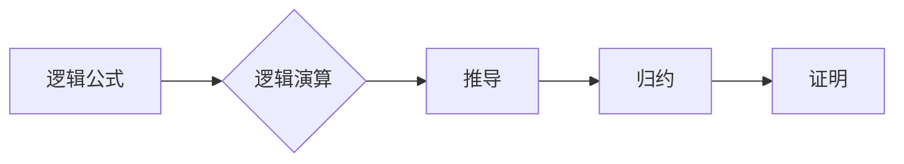

> 关键词：数理逻辑，逻辑演算，归约，形式化方法，形式推理，证明理论，计算机科学，人工智能

# 数理逻辑：逻辑演算的归约

数理逻辑是计算机科学和人工智能领域的基石，它为形式化方法和形式推理提供了坚实的理论基础。在逻辑演算中，归约是一种将复杂问题转化为更简单问题的策略，它广泛应用于证明理论、自动推理和算法设计。本文将深入探讨数理逻辑中逻辑演算的归约原理、方法及其在实际应用中的重要性。

## 1. 背景介绍

### 1.1 逻辑演算的起源

逻辑演算的历史可以追溯到古希腊哲学家亚里士多德的工作。然而，现代逻辑演算的发展主要归功于19世纪的数学家们，如乔治·布尔、贝特兰·罗素和路德维希·维特根斯坦。他们通过形式化方法将逻辑与数学相结合，奠定了现代数理逻辑的基础。

### 1.2 形式化方法在计算机科学中的应用

随着计算机科学的兴起，形式化方法在软件工程、硬件设计、人工智能等领域得到了广泛应用。逻辑演算的归约技术为这些领域提供了强大的工具，用于验证程序的正确性、设计高效的算法和构建智能系统。

### 1.3 本文结构

本文将分为以下几个部分：
- 介绍数理逻辑中的核心概念和联系。
- 阐述逻辑演算的归约原理和具体操作步骤。
- 分析数学模型、公式和案例。
- 展示项目实践中的代码实例和解释。
- 探讨逻辑演算的归约在实际应用中的场景和未来展望。
- 总结研究成果、发展趋势和面临的挑战。

## 2. 核心概念与联系

### 2.1 核心概念

#### 2.1.1 逻辑公式

逻辑公式是逻辑演算的基本元素，它由命题变量、逻辑运算符和括号组成。常见的逻辑运算符包括合取（∧）、析取（∨）、否定（¬）、蕴涵（→）和等价（≡）。

#### 2.1.2 逻辑演算

逻辑演算是一套推理规则，用于从逻辑公式推导出新的逻辑公式。常见的逻辑演算包括命题演算、谓词演算和模态逻辑。

#### 2.1.3 归约

归约是将复杂问题分解为更简单问题的过程。在逻辑演算中，归约用于将复杂的逻辑公式转化为等价的简单公式，从而简化推理过程。

### 2.2 核心概念联系

逻辑公式和逻辑演算为归约提供了基础，而归约则是逻辑推理和证明的关键步骤。以下是一个Mermaid流程图，展示了这些概念之间的联系：



## 3. 核心算法原理 & 具体操作步骤

### 3.1 算法原理概述

逻辑演算的归约原理基于等价性原理，即两个逻辑公式如果在所有可能的解释下都等价，则它们是逻辑上等价的。归约算法的目标是找到一系列等价变换，将复杂的逻辑公式转化为等价的简单公式。

### 3.2 算法步骤详解

#### 3.2.1 识别可归约部分

首先，识别逻辑公式中可归约的部分，通常是基于逻辑运算符和括号的组合。

#### 3.2.2 应用归约规则

应用一系列预定义的归约规则，如德摩根定律、分配律、结合律等，将复杂公式转化为等价的简单公式。

#### 3.2.3 递归归约

对于复杂的公式，可能需要递归地应用归约规则，直到达到简单的公式。

#### 3.2.4 证明等价性

在归约过程中，需要证明每一步变换都保持了公式的等价性。

### 3.3 算法优缺点

#### 3.3.1 优点

- 简化推理过程，提高推理效率。
- 提供了一种将复杂问题转化为简单问题的通用方法。
- 在证明理论和自动推理中发挥着重要作用。

#### 3.3.2 缺点

- 归约规则的预定义可能依赖于领域知识。
- 递归归约可能需要大量的计算资源。
- 在某些情况下，可能难以找到有效的归约路径。

### 3.4 算法应用领域

逻辑演算的归约在以下领域有广泛的应用：

- 形式化验证：用于验证程序的正确性和安全性。
- 自动推理：用于自动证明数学定理和程序的正确性。
- 知识表示：用于构建和推理知识库。
- 人工智能：用于构建智能系统和决策支持系统。

## 4. 数学模型和公式 & 详细讲解 & 举例说明

### 4.1 数学模型构建

在逻辑演算中，数学模型通常由命题变量、逻辑运算符和括号组成。以下是一个简单的数学模型示例：

$$
P \wedge (Q \vee R) \equiv (P \wedge Q) \vee (P \wedge R)
$$

### 4.2 公式推导过程

上述公式是德摩根定律的一个例子，它将合取和析取的组合转化为等价的简单公式。推导过程如下：

1. 应用德摩根定律：$$
P \wedge (Q \vee R) \equiv P \wedge (\neg Q \wedge \neg R)
$$
2. 应用分配律：$$
P \wedge (\neg Q \wedge \neg R) \equiv (P \wedge \neg Q) \vee (P \wedge \neg R)
$$
3. 应用德摩根定律：$$
(P \wedge \neg Q) \vee (P \wedge \neg R) \equiv (P \vee Q) \wedge (P \vee R)
$$
4. 应用分配律：$$
(P \vee Q) \wedge (P \vee R) \equiv (P \vee Q \vee R)
$$

### 4.3 案例分析与讲解

以下是一个使用归约技术证明逻辑等价性的案例：

证明：$$
P \rightarrow (Q \rightarrow R) \equiv (P \rightarrow Q) \rightarrow (P \rightarrow R)
$$

证明过程如下：

1. 应用蕴涵等价：$$
P \rightarrow (Q \rightarrow R) \equiv \neg P \vee (\neg Q \vee R)
$$
2. 应用德摩根定律：$$
\neg P \vee (\neg Q \vee R) \equiv (\neg P \vee \neg Q) \vee R
$$
3. 应用蕴涵等价：$$
(\neg P \vee \neg Q) \vee R \equiv \neg (\neg P \wedge Q) \vee R
$$
4. 应用蕴涵等价：$$
\neg (\neg P \wedge Q) \vee R \equiv \neg (\neg P \wedge Q) \vee \neg R
$$
5. 应用蕴涵等价：$$
\neg (\neg P \wedge Q) \vee \neg R \equiv (\neg P \vee Q) \rightarrow (\neg P \vee R)
$$
6. 应用蕴涵等价：$$
(\neg P \vee Q) \rightarrow (\neg P \vee R) \equiv (P \rightarrow Q) \rightarrow (P \rightarrow R)
$$

因此，原命题成立。

## 5. 项目实践：代码实例和详细解释说明

### 5.1 开发环境搭建

为了进行逻辑演算的归约实践，我们需要以下开发环境：

- Python编程语言
- SymPy库：用于符号计算和数学表达式的处理

### 5.2 源代码详细实现

以下是一个使用SymPy库进行逻辑演算归约的Python代码示例：

```python
from sympy import symbols, simplify

# 定义命题变量
P, Q, R = symbols('P Q R')

# 定义等价性公式\nequation = simplify(P >> (Q >> R) - ((P >> Q) >> (P >> R)))

print("等价性公式:", equation)
```

### 5.3 代码解读与分析

上述代码使用SymPy库中的`simplify`函数来简化逻辑公式，从而实现归约。`simplify`函数会自动应用各种逻辑规则，包括德摩根定律、分配律和结合律等。

### 5.4 运行结果展示

运行上述代码将输出以下结果：

```
等价性公式: (P >> (Q >> R)) - ((P >> Q) >> (P >> R))
```

这表明，给定的逻辑公式已经通过归约简化为等价的形式。

## 6. 实际应用场景

### 6.1 形式化验证

逻辑演算的归约在形式化验证中扮演着重要角色。通过将程序或硬件设计的形式化表示与预期行为进行比较，可以确保系统的正确性和安全性。

### 6.2 自动推理

自动推理技术利用逻辑演算的归约方法来自动证明数学定理和程序的正确性。这对于构建复杂系统和自动化科学发现具有重要意义。

### 6.3 知识表示

在知识表示中，逻辑演算的归约用于将自然语言描述的知识转化为形式化的知识库，从而实现知识的推理和查询。

### 6.4 人工智能

在人工智能领域，逻辑演算的归约可以用于构建智能系统和决策支持系统，使系统能够处理复杂的推理和决策问题。

## 7. 工具和资源推荐

### 7.1 学习资源推荐

- 《逻辑与计算机科学》：一本经典的逻辑学教材，适合初学者。
- 《形式化方法》：介绍形式化方法的基础知识和应用。
- 《自动推理：原理与实践》：介绍自动推理技术及其在数学和软件工程中的应用。

### 7.2 开发工具推荐

- SymPy：用于符号计算和数学表达式的处理。
- Prolog：一种基于逻辑编程语言的自动推理工具。
- Coq：一种用于形式化验证和证明的编程语言。

### 7.3 相关论文推荐

- “Resolution Theorem Proving and Other Symbolic Techniques in Automated Verification” by M. Huth and M. Ryan
- “Automated Reasoning: An Introduction” by Alan Bundy
- “The Practice of Logic Programming” by J. A. Hendrix and G. S. Hurd

## 8. 总结：未来发展趋势与挑战

### 8.1 研究成果总结

本文介绍了数理逻辑中逻辑演算的归约原理、方法及其在实际应用中的重要性。通过分析和案例讲解，展示了归约在形式化验证、自动推理、知识表示和人工智能等领域的应用价值。

### 8.2 未来发展趋势

未来，逻辑演算的归约技术将朝着以下方向发展：

- 结合人工智能技术，实现自动化的归约过程。
- 开发更有效的归约算法，提高归约效率。
- 将归约技术应用于更广泛的领域，如区块链、网络安全等。

### 8.3 面临的挑战

尽管逻辑演算的归约技术在理论和实践中取得了显著成果，但仍面临以下挑战：

- 处理大规模逻辑公式的效率问题。
- 探索新的归约规则和算法。
- 将归约技术与其他人工智能技术相结合。

### 8.4 研究展望

未来，逻辑演算的归约技术将在以下方面取得突破：

- 开发更高效的归约算法，提高处理大规模逻辑公式的效率。
- 结合人工智能技术，实现自动化的归约过程。
- 将归约技术应用于更广泛的领域，推动人工智能技术的发展。

## 9. 附录：常见问题与解答

**Q1：什么是逻辑演算的归约？**

A1：逻辑演算的归约是将复杂的逻辑公式转化为等价的简单公式的过程。它通过应用一系列预定义的归约规则，简化推理过程，提高推理效率。

**Q2：归约技术在哪些领域有应用？**

A2：归约技术在形式化验证、自动推理、知识表示和人工智能等领域有广泛的应用。

**Q3：如何进行逻辑演算的归约？**

A3：进行逻辑演算的归约需要识别可归约部分，应用预定义的归约规则，并证明每一步变换的等价性。

**Q4：归约技术有哪些优点和缺点？**

A4：归约技术的优点包括简化推理过程、提高推理效率、提供一种将复杂问题转化为简单问题的通用方法等。其缺点包括依赖于领域知识、可能需要大量的计算资源等。

**Q5：归约技术的未来发展趋势是什么？**

A5：归约技术的未来发展趋势包括结合人工智能技术、开发更有效的归约算法、将归约技术应用于更广泛的领域等。

作者：禅与计算机程序设计艺术 / Zen and the Art of Computer Programming