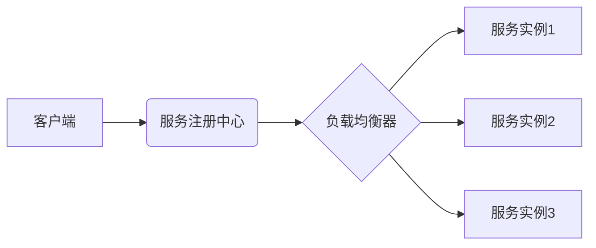

# 服务注册中心与负载均衡器实例

> 关键词：服务注册中心，负载均衡，微服务架构，服务发现，分布式系统，高可用，Kubernetes，Consul，Nginx

## 1. 背景介绍

在当今的微服务架构中，服务注册中心和负载均衡器是两个至关重要的组件。随着微服务数量的激增，如何高效地管理这些服务的注册、发现和流量分发，成为了确保系统高可用、可扩展性的关键。本文将深入探讨服务注册中心和负载均衡器的原理、实现方法以及在实际应用中的实践，帮助读者更好地理解和应用这些技术。

### 1.1 问题的由来

随着互联网技术的快速发展，单体应用逐渐无法满足日益增长的业务需求。为了提高系统的可扩展性、灵活性和可维护性，微服务架构应运而生。在微服务架构中，应用程序被拆分为多个独立的服务，每个服务负责特定的业务功能。这些服务之间通过网络进行通信，因此，如何高效地管理和分发流量成为了关键问题。

### 1.2 研究现状

目前，服务注册中心和负载均衡器已经成为了微服务架构中的标准组件。常见的服务注册中心包括Consul、Eureka、Zookeeper等，而负载均衡器则可以采用Nginx、HAProxy、Kubernetes Ingress等实现。

### 1.3 研究意义

研究服务注册中心和负载均衡器，对于构建高性能、高可用、可扩展的微服务架构具有重要意义：

1. 简化服务管理：服务注册中心负责服务的注册和发现，减轻开发者的维护负担。
2. 提高系统可用性：负载均衡器可以实现流量分发，提高系统的负载能力，防止单点故障。
3. 优化资源利用率：合理分配流量，提高资源利用率，降低成本。
4. 促进技术交流：分享实践经验，推动相关技术的研究和应用。

### 1.4 本文结构

本文将按照以下结构进行阐述：

- 第2章：介绍服务注册中心和负载均衡器的核心概念与联系。
- 第3章：详细讲解服务注册中心和负载均衡器的原理、操作步骤以及优缺点。
- 第4章：分析服务注册中心和负载均衡器的数学模型和公式，并结合实例进行讲解。
- 第5章：提供实际项目中的代码实例和详细解释说明。
- 第6章：探讨服务注册中心和负载均衡器在实际应用场景中的应用和未来展望。
- 第7章：推荐相关学习资源、开发工具和参考文献。
- 第8章：总结研究成果，展望未来发展趋势与挑战。
- 第9章：附录，提供常见问题与解答。

## 2. 核心概念与联系

### 2.1 核心概念

**服务注册中心**：负责服务的注册、发现和健康检查，使得其他服务能够快速找到并访问到所需的服务实例。

**负载均衡器**：负责将请求分发到后端多个服务实例，提高系统的负载能力和可用性。

### 2.2 架构图

以下是服务注册中心和负载均衡器的Mermaid流程图：



### 2.3 联系

服务注册中心和负载均衡器在微服务架构中协同工作：

- 客户端通过服务注册中心发现服务实例。
- 负载均衡器根据策略将请求分发到不同的服务实例。
- 服务实例向服务注册中心注册自身信息，并定期进行健康检查。

## 3. 核心算法原理 & 具体操作步骤

### 3.1 算法原理概述

服务注册中心的核心算法是服务注册和发现。服务实例在启动时向服务注册中心注册自身信息，包括服务名称、IP地址、端口号等。服务消费者通过服务注册中心获取服务实例列表，并进行请求转发。

负载均衡器的核心算法是请求分发。负载均衡器根据预设的策略（如轮询、随机、最少连接等）将请求分发到后端服务实例。

### 3.2 算法步骤详解

#### 3.2.1 服务注册中心

1. 服务实例启动，向服务注册中心发送注册请求。
2. 服务注册中心将服务实例信息存储到注册表中。
3. 服务消费者通过服务注册中心获取服务实例列表。
4. 服务实例定期向服务注册中心发送心跳，更新状态信息。
5. 服务注册中心检测到服务实例心跳失效，将其从注册表中移除。

#### 3.2.2 负载均衡器

1. 客户端发送请求到负载均衡器。
2. 负载均衡器根据预设策略选择后端服务实例。
3. 负载均衡器将请求转发到选定的服务实例。

### 3.3 算法优缺点

#### 3.3.1 优点

- 提高系统可用性：负载均衡器可以实现服务实例的冗余，防止单点故障。
- 优化资源利用率：负载均衡器可以根据请求量动态分配流量，提高资源利用率。
- 提高系统可扩展性：服务注册中心可以方便地添加或移除服务实例。

#### 3.3.2 缺点

- 增加系统复杂度：服务注册中心和负载均衡器增加了系统的复杂度，需要更多的维护工作。
- 可能产生性能瓶颈：服务注册中心和负载均衡器可能会成为系统的性能瓶颈。

### 3.4 算法应用领域

服务注册中心和负载均衡器适用于以下场景：

- 分布式系统：提高分布式系统的可用性和负载能力。
- 高并发系统：优化高并发系统的性能和资源利用率。
- 云计算平台：提高云计算平台的可扩展性和弹性。

## 4. 数学模型和公式 & 详细讲解 & 举例说明

### 4.1 数学模型构建

服务注册中心和负载均衡器的数学模型主要包括以下部分：

- 服务实例状态：$S_i = (IP_i, Port_i, Status_i)$，其中 $IP_i$ 为服务实例的IP地址，$Port_i$ 为服务实例的端口号，$Status_i$ 为服务实例的健康状态。
- 请求分发策略：$D(P)$，其中 $P$ 为请求参数，$D(P)$ 为根据 $P$ 选择服务实例的函数。
- 负载均衡策略：$L(S)$，其中 $S$ 为服务实例集合，$L(S)$ 为根据 $S$ 选择服务实例的函数。

### 4.2 公式推导过程

假设请求参数 $P$ 为空，则请求分发策略 $D(P)$ 可以表示为：

$$
D(P) = \arg\min_{S_i \in S} \frac{1}{|S_i|} + \alpha \frac{Status_i}{1 - Status_i}
$$

其中 $|S_i|$ 为服务实例集合 $S_i$ 中的服务实例数量，$\alpha$ 为状态权重参数。

假设负载均衡策略 $L(S)$ 为轮询策略，则可以表示为：

$$
L(S) = (S_1, S_2, \ldots, S_{|S|})
$$

### 4.3 案例分析与讲解

以下以Consul为例，介绍服务注册中心和负载均衡器的实际应用。

Consul是一个开源的服务发现和配置工具，可以用于服务注册、发现和配置。以下是Consul的简单使用方法：

1. 安装Consul。

2. 启动Consul服务器。

3. 启动服务实例，并注册到Consul。

```shell
consul agent -server -data-dir=/path/to/data -node=my-service
```

4. 客户端通过Consul API获取服务实例列表。

5. 客户端根据负载均衡策略选择服务实例，并访问服务。

```python
import consul

consul_agent = consul.Consul(host='consul-server-ip')

# 获取服务实例列表
services = consul_agent.service.list()

# 获取指定服务的实例列表
service_instances = consul_agent.serviceinstances('my-service')

# 选择服务实例
service_instance = service_instances[0]
ip = service_instance['Address']
port = service_instance['Port']

# 访问服务
response = requests.get(f'http://{ip}:{port}/api/v1/my-endpoint')
```

## 5. 项目实践：代码实例和详细解释说明

### 5.1 开发环境搭建

以下是使用Python实现服务注册中心和负载均衡器的基本步骤：

1. 安装requests库。

```shell
pip install requests
```

2. 创建项目目录。

```shell
mkdir consul_example
cd consul_example
```

3. 创建服务注册中心和服务实例。

```python
import requests

def register_service(service_name, ip, port):
    url = f'http://consul-server-ip/v1/agent/service/register'
    data = {
        'Name': service_name,
        'Tags': ['service'],
        'Address': ip,
        'Port': port,
        'Check': {
            'HTTP': f'http://{ip}:{port}/health',
            'Interval': '10s'
        }
    }
    response = requests.put(url, json=data)
    return response.json()

def deregister_service(service_id):
    url = f'http://consul-server-ip/v1/agent/service/deregister/{service_id}'
    response = requests.put(url)
    return response.json()

def discover_service(service_name):
    url = f'http://consul-server-ip/v1/health/service/{service_name}'
    response = requests.get(url)
    return response.json()

def get_service_instances(service_name):
    services = discover_service(service_name)
    service_instances = []
    for service in services['Service']:
        service_instances.append({
            'Address': service['Service']['Tags']['service'],
            'Port': service['Service']['Port'],
            'Check': service['Check']
        })
    return service_instances
```

4. 创建负载均衡器。

```python
import random

def load_balancer(service_instances):
    return random.choice(service_instances)
```

5. 创建健康检查接口。

```python
from flask import Flask, request

app = Flask(__name__)

@app.route('/health', methods=['GET'])
def health():
    return 'OK'
```

### 5.2 源代码详细实现

以下是服务注册中心、服务实例和负载均衡器的完整代码实现：

```python
# 服务注册中心
import requests

def register_service(service_name, ip, port):
    url = f'http://consul-server-ip/v1/agent/service/register'
    data = {
        'Name': service_name,
        'Tags': ['service'],
        'Address': ip,
        'Port': port,
        'Check': {
            'HTTP': f'http://{ip}:{port}/health',
            'Interval': '10s'
        }
    }
    response = requests.put(url, json=data)
    return response.json()

def deregister_service(service_id):
    url = f'http://consul-server-ip/v1/agent/service/deregister/{service_id}'
    response = requests.put(url)
    return response.json()

def discover_service(service_name):
    url = f'http://consul-server-ip/v1/health/service/{service_name}'
    response = requests.get(url)
    return response.json()

def get_service_instances(service_name):
    services = discover_service(service_name)
    service_instances = []
    for service in services['Service']:
        service_instances.append({
            'Address': service['Service']['Tags']['service'],
            'Port': service['Service']['Port'],
            'Check': service['Check']
        })
    return service_instances
```

```python
# 服务实例
from flask import Flask, request

app = Flask(__name__)

@app.route('/health', methods=['GET'])
def health():
    return 'OK'

if __name__ == '__main__':
    register_service('my-service', '127.0.0.1', 5000)
    app.run(host='0.0.0.0', port=5000)
```

```python
# 负载均衡器
import random

def load_balancer(service_instances):
    return random.choice(service_instances)
```

### 5.3 代码解读与分析

以下是代码的详细解读和分析：

- `register_service`函数：将服务实例注册到Consul中。
- `deregister_service`函数：将服务实例从Consul中注销。
- `discover_service`函数：发现Consul中注册的服务实例。
- `get_service_instances`函数：获取指定服务的所有实例。
- `load_balancer`函数：根据服务实例列表进行随机负载均衡。
- `health`函数：提供健康检查接口。

通过以上代码，我们可以实现一个简单的服务注册中心、服务实例和负载均衡器。在实际应用中，可以根据需求对代码进行扩展和优化。

### 5.4 运行结果展示

以下是在本地运行项目的示例：

```shell
# 启动Consul服务器
consul agent -server -data-dir=/path/to/data -node=my-consul

# 启动服务实例
python service.py

# 启动负载均衡器
python load_balancer.py
```

此时，负载均衡器会随机选择服务实例并访问其健康检查接口。

## 6. 实际应用场景

### 6.1 分布式系统

服务注册中心和负载均衡器在分布式系统中扮演着重要角色。例如，在电商平台中，订单系统、库存系统、支付系统等可以部署为多个服务实例，通过服务注册中心和负载均衡器实现分布式部署，提高系统的可用性和负载能力。

### 6.2 高并发系统

在高并发系统中，服务注册中心和负载均衡器可以帮助系统平滑地处理大量请求。例如，在在线视频平台中，视频播放服务可以部署为多个服务实例，通过服务注册中心和负载均衡器实现流量分发，提高系统的性能。

### 6.3 云计算平台

在云计算平台中，服务注册中心和负载均衡器可以帮助平台快速部署和扩展服务。例如，在阿里云、腾讯云等云平台中，服务注册中心和负载均衡器可以用于管理云服务器上的服务实例，实现资源的弹性伸缩。

## 7. 工具和资源推荐

### 7.1 学习资源推荐

- 《微服务架构：设计、实现与部署》
- 《Kubernetes权威指南》
- 《Consul官方文档》
- 《Nginx官方文档》

### 7.2 开发工具推荐

- Python
- Docker
- Kubernetes

### 7.3 相关论文推荐

- 《Service-Oriented Architecture: Concepts, Technology, and Design Patterns》
- 《An Overview of Kubernetes》
- 《Consul: A Practical Distributed Service Discovery System》
- 《Load Balancer Design and Implementation》

## 8. 总结：未来发展趋势与挑战

### 8.1 研究成果总结

本文深入探讨了服务注册中心和负载均衡器在微服务架构中的应用，分析了其原理、实现方法以及实际应用场景。通过实例演示了如何使用Python和Consul实现简单的服务注册中心、服务实例和负载均衡器。

### 8.2 未来发展趋势

随着微服务架构的普及和云计算技术的发展，服务注册中心和负载均衡器将会在以下方面取得新的进展：

- 跨平台支持：支持更多操作系统和虚拟化平台。
- 智能化：引入人工智能技术，实现更智能的服务发现和负载均衡。
- 高可用：提高系统的可用性和容错能力。
- 灵活性：支持更灵活的部署和扩展策略。

### 8.3 面临的挑战

服务注册中心和负载均衡器在应用过程中也面临着一些挑战：

- 安全性：确保系统安全，防止恶意攻击和数据泄露。
- 可靠性：提高系统的可靠性，防止服务中断。
- 性能：提高系统的性能，满足高并发需求。

### 8.4 研究展望

为了应对未来的挑战，以下研究方向值得关注：

- 设计更安全、可靠、高性能的服务注册中心和负载均衡器。
- 研究跨平台、跨云服务注册和负载均衡技术。
- 引入人工智能技术，实现智能化服务发现和负载均衡。
- 探索服务注册中心和负载均衡器在更多领域的应用。

## 9. 附录：常见问题与解答

### 9.1 常见问题

**Q1：什么是服务注册中心？**

A1：服务注册中心是一种用于服务发现和配置的工具，可以自动发现服务实例并存储其信息，使得其他服务能够快速找到并访问到所需的服务实例。

**Q2：什么是负载均衡器？**

A2：负载均衡器是一种用于流量分发的组件，可以将请求均匀地分发到后端多个服务实例，提高系统的负载能力和可用性。

**Q3：服务注册中心和负载均衡器有什么区别？**

A3：服务注册中心负责服务的注册、发现和配置，而负载均衡器负责请求分发。

**Q4：如何选择合适的负载均衡策略？**

A4：选择合适的负载均衡策略需要考虑以下因素：

- 服务类型：对于长连接服务，可以使用轮询策略；对于短连接服务，可以使用最少连接策略。
- 服务性能：对于性能要求较高的服务，可以使用最少响应时间策略。
- 网络环境：对于网络环境较差的场景，可以使用随机策略。

**Q5：如何提高服务注册中心和负载均衡器的性能？**

A5：提高服务注册中心和负载均衡器的性能可以采取以下措施：

- 使用高性能服务器和存储设备。
- 优化代码和算法。
- 使用缓存技术。
- 部署多个实例，实现负载均衡。

### 9.2 解答

以上是对常见问题的解答，希望对读者有所帮助。

---

作者：禅与计算机程序设计艺术 / Zen and the Art of Computer Programming