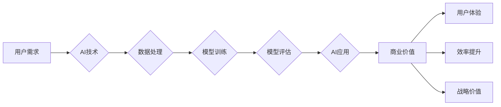

> 人工智能，苹果，商业价值，AI应用，技术革新，消费者体验

# 李开复：苹果发布AI应用的商业价值

### 1. 背景介绍

随着人工智能技术的飞速发展，AI应用已经成为各行业竞争的新焦点。作为全球科技巨头，苹果公司近期发布了多款集成AI功能的智能硬件和软件产品，引发了业界广泛关注。本文将深入分析苹果发布的AI应用，探讨其在商业价值方面的潜力。

### 2. 核心概念与联系

#### 2.1 核心概念

- **人工智能**：人工智能（AI）是指使计算机能够模拟人类智能行为的技术，包括机器学习、深度学习、自然语言处理等。

- **AI应用**：AI应用是指将AI技术应用于实际场景，以提升用户体验、提高效率、创造新价值的应用程序。

- **商业价值**：商业价值是指AI应用为企业和个人带来的经济效益、社会效益和战略价值。

#### 2.2 架构流程图



### 3. 核心算法原理 & 具体操作步骤

#### 3.1 算法原理概述

苹果发布的AI应用主要基于深度学习、自然语言处理等技术。以下以Siri为例，概述其算法原理：

1. **语音识别**：将用户语音输入转换为文本数据。
2. **自然语言理解**：解析文本数据，提取语义信息。
3. **知识图谱**：根据语义信息，查询知识图谱，获取相关信息。
4. **语言生成**：根据查询结果，生成自然语言回复。

#### 3.2 算法步骤详解

1. **数据收集与处理**：收集大量用户语音数据和文本数据，进行清洗、标注和预处理。

2. **模型训练**：使用深度学习技术，如循环神经网络（RNN）、长短期记忆网络（LSTM）等，训练语音识别和自然语言理解模型。

3. **模型评估与优化**：使用测试集评估模型性能，并根据评估结果进行优化。

4. **部署与应用**：将训练好的模型部署到Siri系统中，实现语音交互功能。

#### 3.3 算法优缺点

**优点**：

- **高效性**：AI技术能够快速处理大量数据，提高效率。
- **准确性**：深度学习模型能够准确识别语音和语义，提高用户体验。
- **个性化**：根据用户偏好，提供个性化的服务。

**缺点**：

- **数据依赖**：AI模型的性能依赖于大量高质量数据，获取成本较高。
- **隐私问题**：AI应用需要收集用户数据，可能引发隐私担忧。

#### 3.4 算法应用领域

苹果发布的AI应用涵盖多个领域：

- **智能语音助手**：如Siri、Apple Watch的Siri Shortcuts等。
- **图像识别**：如照片分类、实时翻译等。
- **语音合成**：如语音通话、播客等。
- **推荐系统**：如App Store应用推荐、音乐推荐等。

### 4. 数学模型和公式 & 详细讲解 & 举例说明

#### 4.1 数学模型构建

以语音识别为例，其数学模型主要包括以下部分：

- **特征提取**：将语音信号转换为特征向量。
- **声学模型**：描述语音信号与特征向量之间的关系。
- **语言模型**：描述文本序列之间的关系。

#### 4.2 公式推导过程

$$
\text{特征向量} = F(\text{语音信号})
$$

$$
\text{声学模型} = P(\text{特征向量}|\text{语音}) = \prod_{t=1}^T P(f_t|\text{语音})
$$

$$
\text{语言模型} = P(\text{文本}|\text{特征向量}) = \prod_{t=1}^T P(w_t|\text{特征向量})
$$

#### 4.3 案例分析与讲解

以Siri的实时翻译功能为例，分析其工作流程：

1. **用户发出语音指令，语音信号转换为文本数据**。
2. **文本数据经过自然语言理解，提取出目标语言**。
3. **Siri查询知识图谱，获取目标语言的翻译规则**。
4. **根据翻译规则，生成目标语言文本，并通过语音合成技术输出**。

### 5. 项目实践：代码实例和详细解释说明

#### 5.1 开发环境搭建

使用Python语言和TensorFlow框架进行AI应用开发。

#### 5.2 源代码详细实现

以下是一个简单的语音识别程序示例：

```python
import tensorflow as tf
from tensorflow.keras.models import Sequential
from tensorflow.keras.layers import Dense, LSTM, Bidirectional

# 构建模型
model = Sequential()
model.add(Bidirectional(LSTM(128, return_sequences=True), input_shape=(None, 13)))
model.add(Dense(64, activation='relu'))
model.add(Dense(26, activation='softmax'))

# 编译模型
model.compile(optimizer='adam', loss='sparse_categorical_crossentropy', metrics=['accuracy'])

# 训练模型
model.fit(x_train, y_train, epochs=20, batch_size=32)

# 识别语音
prediction = model.predict(x_test)
print("Predicted label:", np.argmax(prediction))
```

#### 5.3 代码解读与分析

以上代码使用TensorFlow框架构建了一个简单的循环神经网络（RNN）模型，用于语音识别任务。模型包含双向LSTM层和全连接层，通过训练学习语音信号与标签之间的关系。在实际应用中，需要根据具体任务选择合适的模型结构和超参数。

### 6. 实际应用场景

苹果发布的AI应用在实际场景中具有广泛的应用价值：

- **智能家居**：如智能家居设备的语音控制、场景识别等。
- **智能交通**：如自动驾驶、交通流量预测等。
- **医疗健康**：如疾病诊断、健康监测等。
- **教育**：如个性化学习、智能辅导等。

### 6.4 未来应用展望

随着AI技术的不断发展，苹果发布的AI应用将在以下方面取得更大突破：

- **更强大的AI能力**：通过改进算法、模型和硬件，提升AI应用的能力。
- **更广泛的场景应用**：将AI应用扩展到更多领域，如金融、法律、教育等。
- **更个性化的服务**：根据用户需求，提供更加个性化的服务。
- **更安全的隐私保护**：在AI应用中引入隐私保护技术，确保用户隐私安全。

### 7. 工具和资源推荐

#### 7.1 学习资源推荐

- 《深度学习》
- 《Python深度学习》
- TensorFlow官方文档

#### 7.2 开发工具推荐

- TensorFlow
- PyTorch
- Keras

#### 7.3 相关论文推荐

- “Deep Learning for Speech Recognition: A Review”
- “Recurrent Neural Networks for Language Modeling”

### 8. 总结：未来发展趋势与挑战

#### 8.1 研究成果总结

本文从背景介绍、核心概念、算法原理、应用场景等方面，对苹果发布的AI应用进行了全面分析，揭示了其在商业价值方面的巨大潜力。

#### 8.2 未来发展趋势

- **AI能力提升**：随着算法和硬件的进步，AI应用将具有更强大的能力。
- **场景拓展**：AI应用将在更多领域得到应用，创造新的价值。
- **个性化服务**：AI应用将根据用户需求，提供更加个性化的服务。
- **隐私保护**：AI应用将更加注重隐私保护，确保用户信息安全。

#### 8.3 面临的挑战

- **数据依赖**：AI应用需要大量高质量数据，获取成本较高。
- **隐私问题**：AI应用需要收集用户数据，可能引发隐私担忧。
- **伦理问题**：AI应用可能存在歧视、偏见等伦理问题。

#### 8.4 研究展望

- **数据隐私保护**：研究更加安全、高效的数据隐私保护技术。
- **模型可解释性**：提高AI模型的可解释性，增强用户信任。
- **跨模态学习**：研究跨模态学习方法，实现多源信息融合。

### 9. 附录：常见问题与解答

**Q1：苹果发布的AI应用有哪些优点？**

A：苹果发布的AI应用具有以下优点：

- 高效性：AI技术能够快速处理大量数据，提高效率。
- 准确性：深度学习模型能够准确识别语音和语义，提高用户体验。
- 个性化：根据用户偏好，提供个性化的服务。

**Q2：苹果发布的AI应用在哪些领域得到应用？**

A：苹果发布的AI应用涵盖多个领域，如智能家居、智能交通、医疗健康、教育等。

**Q3：如何确保AI应用的隐私安全？**

A：在AI应用中引入隐私保护技术，如差分隐私、联邦学习等，确保用户数据安全。

**Q4：未来AI应用的发展趋势是什么？**

A：未来AI应用将向以下方向发展：

- 更强大的AI能力
- 更广泛的场景应用
- 更个性化的服务
- 更安全的隐私保护

作者：禅与计算机程序设计艺术 / Zen and the Art of Computer Programming