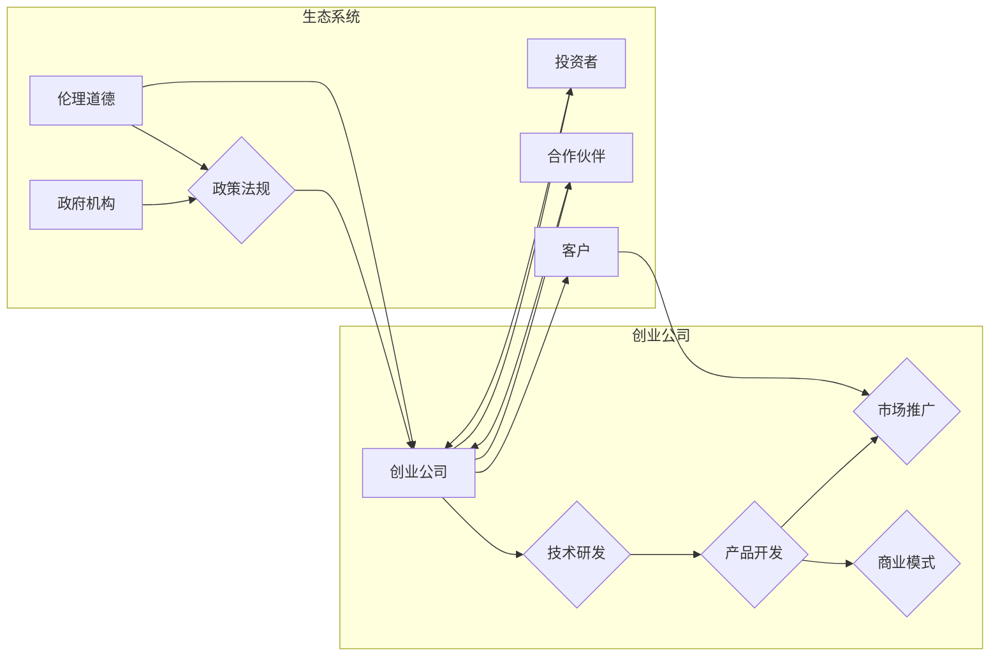

# 构建充满活力的AI创业生态系统的挑战

> 关键词：AI创业，生态系统，挑战，合作，创新，可持续发展

## 1. 背景介绍

随着人工智能（AI）技术的飞速发展，AI创业已成为当前科技领域的一股热潮。众多创业公司纷纷涌现，旨在利用AI技术解决实际问题，推动社会进步。然而，构建一个充满活力的AI创业生态系统并非易事，面临着诸多挑战。本文将深入探讨这些挑战，并提出相应的解决方案。

### 1.1 AI创业的兴起

近年来，AI技术的突破性进展，如深度学习、自然语言处理、计算机视觉等，为各行各业带来了颠覆性的变革。这为AI创业提供了丰富的土壤，使得越来越多的创业公司投身于AI领域，寻求商业机会。

### 1.2 AI创业生态系统的意义

构建一个充满活力的AI创业生态系统，对于推动AI技术发展、促进创新、创造就业机会具有重要意义。它能够：

- 促进知识传播和资源共享。
- 降低创业门槛，吸引更多人才加入AI领域。
- 促进跨行业合作，推动AI技术在更多领域的应用。
- 创造新的商业模式和市场机会。

### 1.3 AI创业生态系统面临的挑战

然而，构建一个充满活力的AI创业生态系统并非易事，面临着以下挑战：

- 技术创新与市场需求的匹配。
- 创业公司之间的合作与竞争。
- 政策法规和伦理道德约束。
- 资金和人才短缺。
- 技术伦理和隐私保护问题。

## 2. 核心概念与联系

### 2.1 核心概念

#### 2.1.1 AI创业

AI创业是指利用人工智能技术，通过创新的方式解决实际问题，满足市场需求，创造商业价值的过程。

#### 2.1.2 生态系统

生态系统是指由多个相互依赖、相互作用的个体或组织构成的整体，它们共同维护系统的平衡和发展。

#### 2.1.3 创新与可持续发展

创新是指通过创造新的产品、服务或商业模式，满足市场需求，推动社会进步。可持续发展是指在满足当前需求的同时，不损害后代满足其需求的能力。

### 2.2 Mermaid流程图

以下是一个简化的AI创业生态系统流程图：



### 2.3 核心概念联系

AI创业公司是生态系统的核心，通过技术研发、产品开发、市场推广和商业模式创新，满足市场需求。投资者和合作伙伴为创业公司提供资金、技术支持和市场资源。客户是最终受益者，政府机构制定政策法规，规范市场秩序，伦理道德约束确保技术应用的正当性。

## 3. 核心算法原理 & 具体操作步骤

### 3.1 算法原理概述

构建AI创业生态系统的核心算法原理是创新驱动和合作共赢。具体而言，包括以下几个方面：

- 技术创新：不断探索新的技术领域，开发具有竞争力的产品和服务。
- 市场研究：深入了解市场需求，准确把握市场趋势。
- 合作共赢：与投资者、合作伙伴、客户、政府机构等各方建立良好的合作关系。
- 人才培养：吸引和培养优秀人才，为生态系统注入活力。

### 3.2 算法步骤详解

#### 3.2.1 技术创新

1. 关注前沿技术：持续关注AI领域的前沿技术，如深度学习、自然语言处理、计算机视觉等。
2. 技术研发：投入研发资源，进行技术攻关，开发具有竞争力的产品和服务。
3. 技术验证：通过实验、测试等方式，验证技术的可行性和有效性。

#### 3.2.2 市场研究

1. 市场调研：收集和分析市场数据，了解市场趋势和用户需求。
2. 竞争分析：分析竞争对手的优势和劣势，找准市场定位。
3. 商业模式设计：设计符合市场需求和自身条件的商业模式。

#### 3.2.3 合作共赢

1. 建立合作伙伴关系：与供应商、渠道商、技术合作伙伴等建立长期稳定的合作关系。
2. 跨界合作：与其他行业的企业或机构合作，实现资源共享和优势互补。
3. 产业链协同：与上下游企业共同打造完整的产业链，提升整体竞争力。

#### 3.2.4 人才培养

1. 人才招聘：招聘具备相关技能和经验的优秀人才。
2. 人才培养：通过培训、轮岗等方式，提升员工的综合素质和业务能力。
3. 人才激励：建立完善的人才激励机制，留住优秀人才。

### 3.3 算法优缺点

#### 3.3.1 优点

- 提升创业成功率：通过创新驱动和合作共赢，提高创业项目的成功率。
- 促进技术发展：推动AI技术在更多领域的应用，推动科技进步。
- 创造就业机会：为更多人提供就业机会，促进社会稳定。

#### 3.3.2 缺点

- 创新风险：技术革新过程中可能面临技术失败、市场反应迟钝等风险。
- 合作风险：合作伙伴之间的利益冲突、信任问题可能导致合作破裂。
- 人才竞争：优秀人才的争夺激烈，可能导致人才流失。

### 3.4 算法应用领域

AI创业生态系统的构建原理和应用领域广泛，包括：

- 人工智能：开发智能硬件、智能机器人、智能语音识别等。
- 金融科技：开发智能投顾、智能客服、反欺诈系统等。
- 医疗健康：开发智能诊断、药物研发、健康管理等领域的产品。
- 智能制造：开发智能工厂、工业机器人、智能物流等。
- 交通出行：开发智能驾驶、智能交通管理系统等。

## 4. 数学模型和公式 & 详细讲解 & 举例说明

### 4.1 数学模型构建

构建AI创业生态系统的数学模型可以从以下几个维度进行：

- 技术创新：采用技术生命周期模型，分析技术成熟度和市场潜力。
- 市场研究：采用市场细分模型，分析目标市场、竞争对手和用户需求。
- 合作共赢：采用合作伙伴关系网络模型，分析合作伙伴之间的合作关系和影响力。
- 人才培养：采用人才生命周期模型，分析人才招聘、培养和激励策略。

### 4.2 公式推导过程

以技术创新为例，采用技术生命周期模型，可以构建以下公式：

$$
R(T) = f(T) \cdot M(T)
$$

其中，$R(T)$ 表示技术成熟度，$f(T)$ 表示技术成熟度函数，$M(T)$ 表示市场需求。

技术成熟度函数 $f(T)$ 可以表示为：

$$
f(T) = \frac{C(T)}{C_0}
$$

其中，$C(T)$ 表示技术当前的投资成本，$C_0$ 表示技术初始投资成本。

市场需求 $M(T)$ 可以表示为：

$$
M(T) = \frac{D(T)}{D_0}
$$

其中，$D(T)$ 表示技术当前的市场需求，$D_0$ 表示技术初始市场需求。

### 4.3 案例分析与讲解

以智能驾驶为例，分析其技术创新、市场研究、合作共赢和人才培养等方面的数学模型：

- 技术创新：智能驾驶技术成熟度 $R(T)$ 与其投资成本 $C(T)$ 和市场需求 $D(T)$ 相关，可通过公式 $R(T) = f(T) \cdot M(T)$ 进行评估。
- 市场研究：智能驾驶市场需求 $M(T)$ 与汽车保有量、交通出行需求等因素相关，可通过市场细分模型进行分析。
- 合作共赢：智能驾驶产业链涉及整车制造、零部件供应商、软件开发商、运营商等多个环节，需要建立良好的合作伙伴关系。
- 人才培养：智能驾驶领域需要大量的技术人才，需要通过招聘、培训和激励等手段，培养一支高素质的人才队伍。

## 5. 项目实践：代码实例和详细解释说明

### 5.1 开发环境搭建

由于AI创业生态系统涉及多个领域，开发环境搭建相对复杂。以下以Python为例，介绍基本的开发环境搭建步骤：

1. 安装Python：从Python官方网站下载并安装Python。
2. 安装Anaconda：安装Anaconda，用于创建和管理Python虚拟环境。
3. 安装PyTorch：使用Anaconda的pip工具，安装PyTorch。
4. 安装其他常用库：安装NumPy、Pandas、Scikit-learn等常用库。

### 5.2 源代码详细实现

以下是一个简单的Python代码示例，用于分析AI创业生态系统中的合作伙伴关系：

```python
import networkx as nx

# 创建一个合作伙伴关系网络
G = nx.Graph()

# 添加节点
G.add_node('整车制造')
G.add_node('零部件供应商')
G.add_node('软件开发商')
G.add_node('运营商')

# 添加边
G.add_edge('整车制造', '零部件供应商')
G.add_edge('整车制造', '软件开发商')
G.add_edge('软件开发商', '运营商')

# 绘制网络图
nx.draw(G, with_labels=True)
```

### 5.3 代码解读与分析

以上代码使用了NetworkX库构建了一个简单的合作伙伴关系网络。首先创建了一个无向图 `G`，然后添加了四个节点，表示整车制造、零部件供应商、软件开发商和运营商。接着，添加了三条边，分别表示这四个节点之间的合作关系。最后，使用 `nx.draw` 函数绘制了网络图。

### 5.4 运行结果展示

运行以上代码后，将得到一个展示合作伙伴关系的网络图，如图所示：

```mermaid
graph LR
    A[整车制造] --> B{零部件供应商}
    A --> C{软件开发商}
    C --> D[运营商}
```

## 6. 实际应用场景

### 6.1 智能驾驶

智能驾驶是AI创业生态系统中一个典型的应用场景。它涉及多个领域，如硬件、软件、服务等，需要各方共同努力，构建完整的生态系统。

### 6.2 金融科技

金融科技领域也是AI创业的热点之一。智能投顾、智能客服、反欺诈等应用，都需要AI技术作为支撑。

### 6.3 医疗健康

AI技术在医疗健康领域的应用前景广阔。智能诊断、药物研发、健康管理等领域，都需要AI技术的助力。

### 6.4 未来应用展望

随着AI技术的不断进步，未来AI创业生态系统将在更多领域得到应用，如教育、零售、物流、能源等。这些领域的应用将为AI创业生态系统的可持续发展注入新的活力。

## 7. 工具和资源推荐

### 7.1 学习资源推荐

- 《Python机器学习》
- 《深度学习》
- 《人工智能：一种现代的方法》
- 《人工智能：一种概率的方法》
- 《人工智能：一种统计方法》

### 7.2 开发工具推荐

- Python
- PyTorch
- TensorFlow
- Anaconda
- Jupyter Notebook

### 7.3 相关论文推荐

- "Deep Learning for Natural Language Processing" by Christopher D. Manning and Prabhakar Raghavan
- "Speech Recognition: A Deep Learning Approach" by Joseph D. P. Costa and David A. Hogg
- "Probabilistic Graphical Models: Principles and Techniques" by Kevin P. Murphy
- "The Hundred-Page Machine Learning Book" by Andriy Burkov

## 8. 总结：未来发展趋势与挑战

### 8.1 研究成果总结

本文从背景介绍、核心概念、算法原理、数学模型、项目实践、实际应用场景等方面，对构建充满活力的AI创业生态系统的挑战进行了全面探讨。研究表明，AI创业生态系统的发展需要技术创新、市场研究、合作共赢、人才培养等多方面因素的共同推动。

### 8.2 未来发展趋势

- AI创业将进一步拓展应用领域，覆盖更多行业。
- AI创业生态系统将更加开放和协作，促进资源共享和优势互补。
- AI创业将更加注重可持续发展，关注社会责任和伦理道德。

### 8.3 面临的挑战

- 技术创新与市场需求之间的匹配。
- 创业公司之间的合作与竞争。
- 政策法规和伦理道德约束。
- 资金和人才短缺。
- 技术伦理和隐私保护问题。

### 8.4 研究展望

未来，应关注以下研究方向：

- 开发更加高效、可靠的AI技术，满足市场需求。
- 构建更加开放、协作的AI创业生态系统。
- 建立健全的政策法规和伦理道德体系，确保AI技术的健康发展。

## 9. 附录：常见问题与解答

**Q1：AI创业生态系统的构建需要哪些关键要素？**

A：AI创业生态系统的构建需要以下关键要素：

- 技术创新：开发具有竞争力的AI技术和产品。
- 市场研究：了解市场需求和用户需求。
- 合作共赢：与各方建立良好的合作关系。
- 人才培养：吸引和培养优秀人才。
- 资金支持：获得充足的资金支持。

**Q2：如何克服AI创业生态系统中的合作与竞争关系？**

A：在AI创业生态系统中，合作与竞争是并存的。可以通过以下方式克服这种关系：

- 建立互信和共赢的合作关系。
- 重视合作伙伴之间的沟通和协调。
- 建立合理的利益分配机制。

**Q3：如何应对AI创业生态系统中的政策法规和伦理道德约束？**

A：应对政策法规和伦理道德约束，需要：

- 关注政策法规的变化，确保企业合规经营。
- 建立健全的伦理道德体系，确保技术应用的正当性。
- 加强社会责任，关注技术对人类社会的影响。

**Q4：如何解决AI创业生态系统中的资金和人才短缺问题？**

A：解决资金和人才短缺问题，可以从以下方面着手：

- 寻求风险投资、政府补贴等资金支持。
- 加强人才引进和培养，建立完善的人才激励机制。
- 与高校、研究机构合作，共同培养人才。

**Q5：如何确保AI创业生态系统的可持续发展？**

A：确保AI创业生态系统的可持续发展，需要：

- 注重技术创新和商业模式创新。
- 建立完善的产业链和生态圈。
- 关注社会责任和伦理道德，确保技术应用的正当性。

---

作者：禅与计算机程序设计艺术 / Zen and the Art of Computer Programming