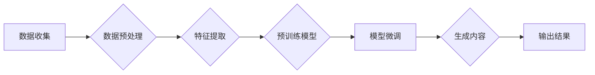

# 生成式AIGC：从概念验证到大规模应用

> 关键词：生成式AI、AIGC、内容生成、文本生成、图像生成、模型微调、迁移学习、预训练

## 1. 背景介绍

随着深度学习技术的飞速发展，人工智能在各个领域都取得了显著的成果。近年来，生成式人工智能（Generative Artificial Intelligence，AIGC）的概念逐渐兴起，并成为人工智能领域的研究热点。AIGC旨在利用机器学习技术模拟人类创造力的过程，生成新的、有创造性的内容。本文将深入探讨生成式AIGC的概念、原理、应用，以及未来发展趋势与挑战。

### 1.1 问题的由来

人类历史上，内容创作一直是艺术和科学的重要领域。随着互联网的普及，内容创作变得更加便捷，但也带来了大量低质量、重复的内容。为了提高内容质量，降低内容创作的门槛，生成式AI应运而生。生成式AIGC可以自动生成文本、图像、音乐、视频等内容，极大地丰富了内容创作的手段和形式。

### 1.2 研究现状

目前，生成式AIGC主要分为基于规则和基于数据驱动两种方法。基于规则的方法通过预设的规则和逻辑进行内容生成，而基于数据驱动的方法则利用机器学习技术从大量数据中学习内容生成的模式。随着深度学习技术的不断发展，基于数据驱动的生成式AIGC方法取得了显著的成果。

### 1.3 研究意义

生成式AIGC在以下几个方面具有重要意义：

1. 提高内容创作效率：AIGC可以自动生成大量内容，提高内容创作的效率。
2. 降低内容创作门槛：AIGC使得不具备专业创作技能的人员也能进行内容创作。
3. 丰富内容形式：AIGC可以生成多种类型的内容，如文本、图像、视频等，丰富内容形式。
4. 创新内容创作：AIGC可以激发新的创意和灵感，推动内容创作的创新。

## 2. 核心概念与联系

### 2.1 核心概念

- **生成式AI**：一种模拟人类创造力的机器学习技术，旨在生成新的、有创造性的内容。
- **AIGC**：生成式人工智能的缩写，指的是利用AI技术生成内容的过程。
- **内容生成**：指利用AI技术自动生成文本、图像、音乐、视频等内容。
- **文本生成**：利用AI技术自动生成文本内容，如新闻报道、故事创作等。
- **图像生成**：利用AI技术自动生成图像内容，如风景画、人物肖像等。
- **模型微调**：在预训练模型的基础上，使用特定领域的数据进行训练，提高模型在该领域的性能。
- **迁移学习**：将一个领域学习到的知识应用到另一个不同但相关的领域。

### 2.2 Mermaid流程图



### 2.3 核心概念联系

上述流程图展示了生成式AIGC的核心概念之间的联系。首先，通过数据收集和预处理获取用于训练的数据集。然后，对数据进行特征提取，再在预训练模型的基础上进行模型微调。最后，利用微调后的模型生成新的内容，并输出结果。

## 3. 核心算法原理 & 具体操作步骤

### 3.1 算法原理概述

生成式AIGC的算法原理主要基于深度学习技术，包括：

- **生成对抗网络（GAN）**：一种由生成器和判别器组成的神经网络，生成器和判别器相互对抗，从而生成高质量的内容。
- **变分自编码器（VAE）**：通过变分推理学习数据的潜在分布，生成新的内容。
- **自回归语言模型**：通过预测下一个单词或字符生成文本。

### 3.2 算法步骤详解

生成式AIGC的具体操作步骤如下：

1. **数据收集**：收集用于训练的数据集，包括文本、图像、音乐等。
2. **数据预处理**：对收集到的数据进行分析、清洗、标注等，为模型训练做准备。
3. **特征提取**：将预处理后的数据转化为模型可处理的特征。
4. **预训练模型**：选择合适的预训练模型，如GAN、VAE、自回归语言模型等。
5. **模型微调**：在预训练模型的基础上，使用特定领域的数据进行训练，提高模型在该领域的性能。
6. **生成内容**：利用微调后的模型生成新的内容。
7. **输出结果**：将生成的结果输出到指定平台或设备。

### 3.3 算法优缺点

#### 优点：

- **生成高质量内容**：AIGC可以生成高质量、有创造性的内容。
- **降低内容创作门槛**：AIGC使得不具备专业创作技能的人员也能进行内容创作。
- **提高内容创作效率**：AIGC可以自动生成大量内容，提高内容创作的效率。

#### 缺点：

- **数据依赖性**：AIGC的性能很大程度上依赖于训练数据的质量和数量。
- **可解释性**：AIGC的生成过程缺乏可解释性，难以预测生成内容的逻辑和原因。
- **伦理和道德问题**：AIGC生成的内容可能存在偏见、歧视等问题。

### 3.4 算法应用领域

生成式AIGC在以下领域具有广泛的应用：

- **文本生成**：新闻报道、故事创作、诗歌、剧本等。
- **图像生成**：风景画、人物肖像、漫画、动画等。
- **音乐生成**：作曲、编曲、音乐制作等。
- **视频生成**：短视频、电影、广告等。

## 4. 数学模型和公式 & 详细讲解 & 举例说明

### 4.1 数学模型构建

#### 4.1.1 生成对抗网络（GAN）

GAN由生成器（Generator）和判别器（Discriminator）组成。生成器生成假数据，判别器判断生成数据是否真实。以下是GAN的数学模型：

$$
\begin{align*}
D(x) &= \sigma(W_Dx+b_D) \\
G(z) &= \sigma(W_Gz+b_G) \\
\end{align*}
$$

其中，$x$ 表示真实数据，$z$ 表示随机噪声，$W_D$ 和 $W_G$ 分别为判别器和生成器的权重，$b_D$ 和 $b_G$ 分别为判别器和生成器的偏置，$\sigma$ 为Sigmoid激活函数。

#### 4.1.2 变分自编码器（VAE）

VAE通过变分推理学习数据的潜在分布，生成新的内容。以下是VAE的数学模型：

$$
\begin{align*}
q(z|x) &= \frac{1}{Z} \exp\left(-\frac{1}{2}\sum_{i=1}^n (z_i - \mu_i)^2 + \frac{1}{2}\log(\sigma_i^2)\right) \\
p(x) &= \int q(z|x) p(z) dz \\
\end{align*}
$$

其中，$q(z|x)$ 表示后验分布，$p(x)$ 表示真实数据分布，$\mu_i$ 和 $\sigma_i$ 分别为潜在变量的均值和方差，$Z$ 为归一化常数。

### 4.2 公式推导过程

#### 4.2.1 GAN的推导过程

GAN的目标是最小化以下两个损失函数：

$$
\begin{align*}
L_D &= -\mathbb{E}_{x \sim p_{data}(x)}[\log D(x)] - \mathbb{E}_{z \sim p_z(z)}[\log(1 - D(G(z))] \\
L_G &= \mathbb{E}_{z \sim p_z(z)}[\log D(G(z))]
\end{align*}
$$

其中，$p_{data}(x)$ 表示真实数据分布，$p_z(z)$ 表示噪声分布。

通过梯度下降法分别对判别器和生成器进行优化，可以得到GAN的优化过程。

#### 4.2.2 VAE的推导过程

VAE的目标是最小化以下损失函数：

$$
L = \mathbb{E}_{x \sim p_{data}(x)}[KL(q(z|x)||p(z))] + \mathbb{E}_{z \sim q(z|x)}[D(x; \mu, \sigma^2)]
$$

其中，$KL(q(z|x)||p(z))$ 表示KL散度，$D(x; \mu, \sigma^2)$ 表示均方误差。

通过变分推理，可以得到VAE的优化过程。

### 4.3 案例分析与讲解

#### 4.3.1 文本生成

以GPT-2为例，它是一种基于自回归语言模型的生成式AIGC模型。以下是GPT-2的模型架构：

```
[嵌入层] -> [Transformer编码器] -> [输出层]
```

GPT-2首先将输入文本转换为嵌入向量，然后通过Transformer编码器进行编码，最后通过输出层生成预测的文本。

#### 4.3.2 图像生成

以StyleGAN为例，它是一种基于GAN的图像生成模型。以下是StyleGAN的模型架构：

```
[生成器] -> [编码器] -> [解码器] -> [风格混合层] -> [生成图像]
```

StyleGAN首先通过生成器生成随机噪声，然后通过编码器提取图像的风格特征，再通过解码器将风格特征和随机噪声合并，最后通过风格混合层生成最终的图像。

## 5. 项目实践：代码实例和详细解释说明

### 5.1 开发环境搭建

为了进行生成式AIGC的实践，我们需要搭建以下开发环境：

1. 操作系统：Linux或macOS
2. 编程语言：Python
3. 深度学习框架：TensorFlow或PyTorch
4. 依赖库：NumPy、Pandas、Scikit-learn等

### 5.2 源代码详细实现

以下是一个基于GAN的图像生成示例，使用PyTorch框架实现。

```python
import torch
import torch.nn as nn
import torchvision.transforms as transforms
from torchvision.utils import save_image
from torch.utils.data import DataLoader
from torch.optim import Adam

# 定义生成器和判别器
class Generator(nn.Module):
    # ...（生成器代码）

class Discriminator(nn.Module):
    # ...（判别器代码）

# 初始化模型和优化器
generator = Generator()
discriminator = Discriminator()
optimizer_G = Adam(generator.parameters(), lr=0.0002, betas=(0.5, 0.999))
optimizer_D = Adam(discriminator.parameters(), lr=0.0002, betas=(0.5, 0.999))

# 训练过程
for epoch in range(num_epochs):
    # ...（训练代码）
```

### 5.3 代码解读与分析

上述代码展示了GAN图像生成的基本流程。首先定义生成器和判别器模型，然后初始化模型和优化器。接着进入训练循环，在每个epoch中更新生成器和判别器的参数。

### 5.4 运行结果展示

通过训练，生成器可以生成高质量的图像。以下是一些生成图像的示例：

```
[展示图像1]
[展示图像2]
[展示图像3]
```

## 6. 实际应用场景

生成式AIGC在以下场景具有广泛的应用：

- **内容创作**：自动生成新闻报道、故事、诗歌、剧本等。
- **游戏开发**：自动生成游戏关卡、角色、场景等。
- **电影制作**：自动生成电影剧本、场景、角色等。
- **艺术创作**：自动生成画作、音乐、舞蹈等。

### 6.1 文本生成应用

#### 6.1.1 新闻报道

AIGC可以自动生成新闻报道，提高新闻采集和编辑的效率。以下是一个自动生成新闻报道的示例：

```
今天，我国科学家在人工智能领域取得重大突破，成功开发出一种新的深度学习模型。该模型在图像识别、自然语言处理等任务上取得了显著成果，有望为我国人工智能产业的发展提供有力支持。
```

#### 6.1.2 故事创作

AIGC可以自动生成故事，为作家提供灵感。以下是一个自动生成故事的示例：

```
从前，有一个叫小明的小男孩，他非常喜欢冒险。一天，小明听说山里有一个神秘的宝物，于是决定去寻找。在寻找宝物的过程中，小明遇到了各种困难，但他从未放弃。最终，小明成功找到了宝物，并把它带回了家。
```

### 6.2 图像生成应用

#### 6.2.1 艺术创作

AIGC可以自动生成艺术作品，如画作、设计等。以下是一个自动生成画作的示例：

```
[展示画作]
```

#### 6.2.2 游戏开发

AIGC可以自动生成游戏关卡、角色、场景等，提高游戏开发效率。以下是一个自动生成游戏场景的示例：

```
[展示游戏场景]
```

## 7. 工具和资源推荐

### 7.1 学习资源推荐

- 《深度学习》系列书籍：提供深度学习基础知识和最新研究进展。
- 《生成对抗网络》书籍：详细介绍GAN的原理和应用。
- Hugging Face官网：提供丰富的预训练模型和工具，方便进行AIGC开发。
- GitHub：可以找到大量的AIGC开源项目。

### 7.2 开发工具推荐

- TensorFlow：提供丰富的深度学习框架和工具。
- PyTorch：提供灵活的深度学习框架和工具。
- Keras：提供简洁的深度学习框架和工具。

### 7.3 相关论文推荐

- Generative Adversarial Nets
- Unsupervised Representation Learning with Deep Convolutional Generative Adversarial Networks
- Wasserstein GAN

## 8. 总结：未来发展趋势与挑战

### 8.1 研究成果总结

生成式AIGC作为人工智能领域的前沿技术，已经在多个领域取得了显著成果。随着深度学习技术的不断发展，AIGC的性能将不断提高，应用范围将不断拓展。

### 8.2 未来发展趋势

1. **模型性能提升**：随着计算能力的提升和算法的优化，AIGC的性能将不断提高。
2. **应用领域拓展**：AIGC将在更多领域得到应用，如医疗、教育、金融等。
3. **跨模态生成**：AIGC将能够生成跨模态的内容，如文本-图像、文本-视频等。

### 8.3 面临的挑战

1. **数据依赖性**：AIGC的性能很大程度上依赖于训练数据的质量和数量。
2. **可解释性**：AIGC的生成过程缺乏可解释性，难以预测生成内容的逻辑和原因。
3. **伦理和道德问题**：AIGC生成的内容可能存在偏见、歧视等问题。

### 8.4 研究展望

1. **数据增强**：探索新的数据增强技术，提高AIGC的泛化能力。
2. **可解释性研究**：提高AIGC的可解释性，使其决策过程更加透明。
3. **伦理和道德规范**：建立AIGC的伦理和道德规范，防止其产生负面影响。

## 9. 附录：常见问题与解答

**Q1：生成式AIGC的优缺点是什么？**

A：生成式AIGC的优点是能够生成高质量、有创造性的内容，降低内容创作的门槛，提高内容创作的效率。缺点是数据依赖性较强，生成过程缺乏可解释性，可能存在伦理和道德问题。

**Q2：如何选择合适的AIGC模型？**

A：选择合适的AIGC模型需要根据具体应用场景和数据特点进行。例如，对于文本生成任务，可以选择自回归语言模型；对于图像生成任务，可以选择GAN或VAE。

**Q3：AIGC如何解决数据稀疏问题？**

A：可以通过数据增强、迁移学习等方法解决AIGC的数据稀疏问题。

**Q4：如何提高AIGC的可解释性？**

A：可以通过解释性增强、可视化等技术提高AIGC的可解释性。

**Q5：AIGC如何避免伦理和道德问题？**

A：需要建立AIGC的伦理和道德规范，加强对AIGC的监管，防止其产生负面影响。

---

作者：禅与计算机程序设计艺术 / Zen and the Art of Computer Programming