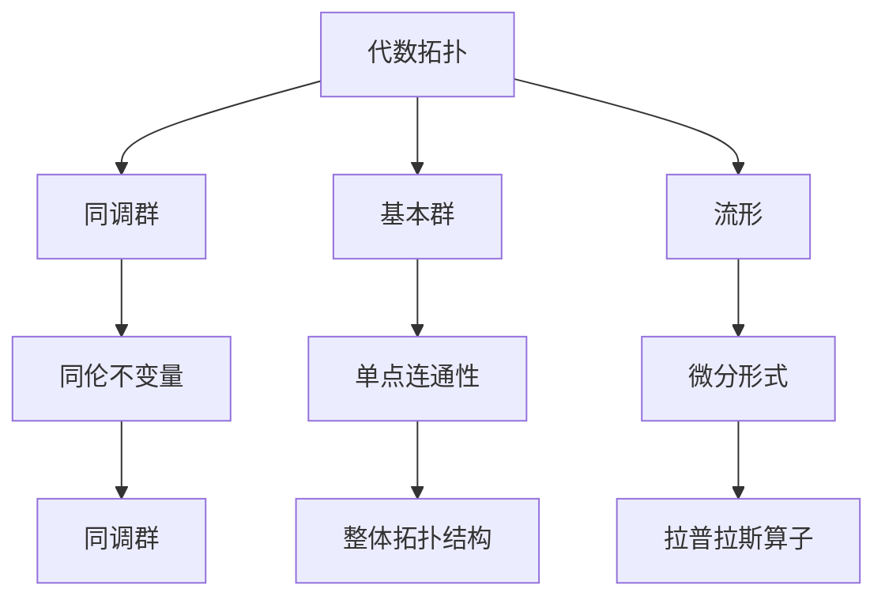
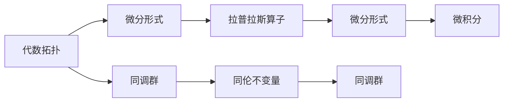
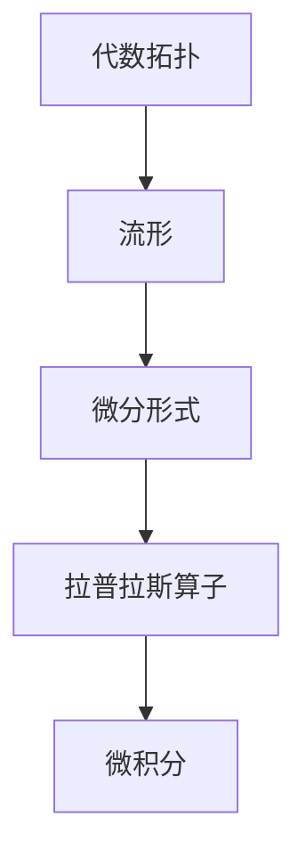
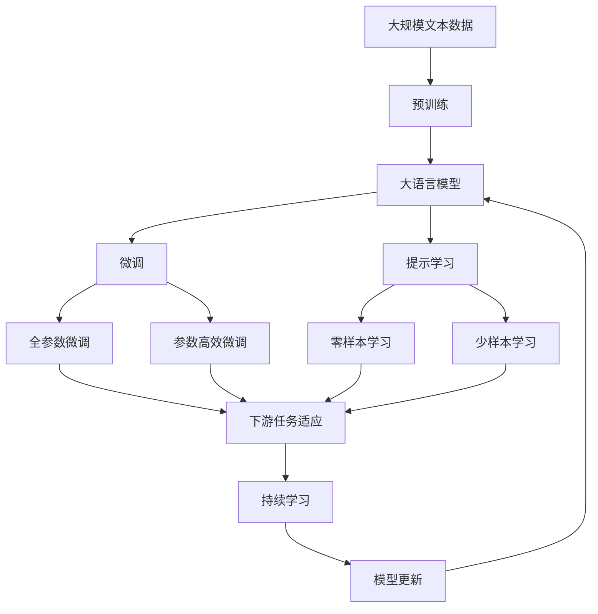

                 

# 代数拓扑与微分形式的结合研究

## 1. 背景介绍

### 1.1 研究背景

代数拓扑和微分形式学是数学领域中的两个重要分支，它们分别从不同的角度研究几何空间与流形的性质。代数拓扑研究几何空间的拓扑结构，而微分形式学则关注流形的微分结构及其在微积分中的应用。

**代数拓扑**主要使用集合、同胚等概念来描述空间的基本性质，如连通性、紧致性等。其核心思想是通过同胚变换来研究不同空间之间的映射关系，从而揭示几何空间的本质特征。代数拓扑研究工具包括同调群、基本群等，这些工具在代数拓扑结构分析中起着至关重要的作用。

**微分形式学**则将几何空间看作是光滑流形，并研究流形的微分结构，如切向量场、标量场等。微分形式学利用了流形的局部坐标变换和切向量场的性质，研究流形的积分理论、拉普拉斯算子、解析流形等。其核心思想是利用微分流形的微积分性质来研究几何空间的局部和整体结构。

虽然这两个领域的研究目标和工具有所不同，但在很多问题上，它们是相辅相成的。近年来，随着计算数学的进步，这两个领域出现了越来越多的交叉研究，特别是在将微分形式的微积分性质与代数拓扑的几何结构结合研究方面，取得了重要进展。

## 2. 核心概念与联系

### 2.1 核心概念概述

为更好地理解代数拓扑与微分形式的结合研究，本节将介绍几个核心概念：

- **代数拓扑**：研究几何空间的拓扑性质，如连通性、紧致性、同调群、基本群等。核心工具包括同调群、基本群等。
- **微分形式**：研究光滑流形的微分结构，如切向量场、标量场、拉普拉斯算子等。核心思想是利用微积分性质研究流形的局部和整体结构。
- **流形**：几何空间中的一种局部性质连续的集合，流形的每个点附近都可以局部地嵌入到欧几里得空间中。
- **同调群**：用于研究拓扑空间的同伦不变量，同调群可以揭示拓扑空间的拓扑结构特征。
- **基本群**：研究拓扑空间的单点连通性，基本群可以揭示拓扑空间的整体拓扑结构。
- **德朗姆定理**：微分形式学的基本定理之一，指出光滑流形的微分形式与上同调群之间存在一一对应的关系。

这些核心概念之间的联系可以通过以下Mermaid流程图来展示：



这个流程图展示了代数拓扑与微分形式的相互联系：

1. 代数拓扑研究流形的同调群和基本群等拓扑不变量。
2. 微分形式学研究流形的微分结构，包括切向量场、标量场、拉普拉斯算子等。
3. 同调群和微分形式之间存在德朗姆定理，揭示了它们之间的内在联系。
4. 基本群揭示了拓扑空间的整体拓扑结构。

### 2.2 概念间的关系

这些核心概念之间存在着紧密的联系，形成了代数拓扑与微分形式的结合研究的完整生态系统。下面我们通过几个Mermaid流程图来展示这些概念之间的关系。

#### 2.2.1 代数拓扑与微分形式的关系



这个流程图展示了代数拓扑与微分形式的相互关系：

1. 代数拓扑研究流形的同调群和基本群等拓扑不变量。
2. 微分形式学研究流形的微分结构，包括切向量场、标量场、拉普拉斯算子等。
3. 同调群和微分形式之间存在德朗姆定理，揭示了它们之间的内在联系。
4. 基本群揭示了拓扑空间的整体拓扑结构。

#### 2.2.2 德朗姆定理的数学描述


德朗姆定理表明，光滑流形的微分形式与上同调群之间存在一一对应的关系。具体地，微分形式的一个基底 $dx^i$ 对应于上同调群 $H^i(X,\mathbb{R})$ 中的一个元素 $x^i$，其中 $X$ 表示光滑流形，$\mathbb{R}$ 表示实数域。

#### 2.2.3 代数拓扑在微分形式中的应用



这个流程图展示了代数拓扑在微分形式中的应用：

1. 代数拓扑研究流形的同调群和基本群等拓扑不变量。
2. 微分形式学研究流形的微分结构，包括切向量场、标量场、拉普拉斯算子等。
3. 代数拓扑的研究工具如同调群、基本群等在微分形式学中得到应用，揭示流形的局部和整体结构。

### 2.3 核心概念的整体架构

最后，我们用一个综合的流程图来展示这些核心概念在大语言模型微调过程中的整体架构：



这个综合流程图展示了从预训练到微调，再到持续学习的完整过程。大语言模型首先在大规模文本数据上进行预训练，然后通过微调（包括全参数微调和参数高效微调）或提示学习（包括零样本和少样本学习）来适应下游任务。最后，通过持续学习技术，模型可以不断更新和适应新的任务和数据。

## 3. 核心算法原理 & 具体操作步骤
### 3.1 算法原理概述

基于代数拓扑与微分形式的结合研究，其核心思想是将微分形式的微积分性质与代数拓扑的几何结构相结合，研究流形的局部和整体性质。具体来说，微分形式的微积分性质可以通过代数拓扑的同调群和基本群等工具进行研究，从而揭示流形的拓扑结构特征。

**微分形式学**通过研究流形的微分结构，可以建立流形的局部坐标变换和切向量场的性质，进而研究流形的微分方程和拉普拉斯算子等。**代数拓扑**通过研究流形的同调群和基本群，可以揭示流形的拓扑结构特征，如连通性、紧致性等。

**德朗姆定理**是微分形式学与代数拓扑结合研究的基础，它揭示了微分形式的微积分性质与上同调群之间的内在联系，即微分形式的基底可以与上同调群中的一个元素一一对应。

### 3.2 算法步骤详解

基于代数拓扑与微分形式的结合研究，通常包括以下几个关键步骤：

**Step 1: 准备数据集**
- 收集并处理原始数据集，去除噪声和异常值，确保数据质量。
- 将数据集分为训练集、验证集和测试集。

**Step 2: 构建微分形式**
- 定义微分形式的基底，如 $dx^i$，其中 $x^i$ 表示流形上的一个坐标点。
- 对微分形式进行积分运算，计算微分形式在上同调群中的表示。

**Step 3: 定义同调群和基本群**
- 定义流形的上同调群 $H^i(X,\mathbb{R})$，其中 $X$ 表示流形，$\mathbb{R}$ 表示实数域。
- 定义流形的基本群 $\pi_1(X,x_0)$，其中 $x_0$ 表示流形上的一个固定点。

**Step 4: 计算同调群和基本群**
- 利用代数拓扑的方法，计算微分形式在上同调群中的表示。
- 利用微分形式学的微积分性质，计算流形的基本群。

**Step 5: 结合德朗姆定理**
- 根据德朗姆定理，微分形式的基底可以与上同调群中的一个元素一一对应。
- 将微分形式的微积分性质与代数拓扑的同调群和基本群相结合，研究流形的局部和整体性质。

**Step 6: 评估结果**
- 在测试集上对模型进行评估，使用适当的评估指标，如准确率、召回率、F1分数等。
- 根据评估结果，调整模型参数和训练策略，进行下一次迭代。

以上是基于代数拓扑与微分形式的结合研究的一般流程。在实际应用中，还需要针对具体问题进行优化设计和调整。

### 3.3 算法优缺点

基于代数拓扑与微分形式的结合研究，具有以下优点：

- **理论基础坚实**：代数拓扑和微分形式学是数学中成熟的理论体系，其结合研究具有坚实的理论基础。
- **模型解释性强**：通过代数拓扑的工具，可以揭示流形的拓扑结构特征，模型的决策过程更加可解释。
- **鲁棒性高**：代数拓扑和微分形式学相结合的方法，可以有效地抵抗噪声和异常值的影响，提高模型的鲁棒性。
- **应用广泛**：代数拓扑和微分形式学结合的研究方法可以应用于各种复杂流形的分析，如纤维丛、拉普拉斯算子等。

同时，该方法也存在以下缺点：

- **计算复杂度高**：基于代数拓扑与微分形式的结合研究，需要进行大量的积分运算和代数计算，计算复杂度较高。
- **对数据质量要求高**：数据集的预处理和清洗过程复杂，需要投入大量的人力和时间。
- **理论难度大**：代数拓扑和微分形式学涉及的数学理论较为复杂，对研究者的数学基础要求较高。

尽管存在这些局限性，但就目前而言，基于代数拓扑与微分形式的结合研究仍然是大语言模型微调方法的重要参考范式，具有广泛的应用前景。

### 3.4 算法应用领域

基于代数拓扑与微分形式的结合研究，已经在多个领域得到应用，包括但不限于：

- **流形分析**：研究复杂流形的拓扑和微分结构，如纤维丛、拉普拉斯算子等。
- **物理学**：研究量子力学、相对论等领域的数学基础，如几何分析、拓扑学等。
- **计算机视觉**：研究三维重建、图像分割、立体视觉等计算机视觉任务。
- **数据科学**：研究数据的拓扑结构和流形性质，如聚类、降维等。
- **自然语言处理**：研究文本的拓扑结构和语义关系，如情感分析、文本分类等。

除了上述这些领域，代数拓扑与微分形式的结合研究还在其他许多领域得到了广泛应用，展示了其强大的理论和方法论价值。

## 4. 数学模型和公式 & 详细讲解 & 举例说明

### 4.1 数学模型构建

本节将使用数学语言对基于代数拓扑与微分形式的结合研究过程进行更加严格的刻画。

设 $X$ 为一个光滑流形，定义微分形式的基底为 $\{dx^i\}$，其中 $x^i$ 表示流形上的一个坐标点。定义流形的上同调群 $H^i(X,\mathbb{R})$，表示微分形式在上同调群中的表示。定义流形的基本群 $\pi_1(X,x_0)$，表示流形的单点连通性。

微分形式的微积分性质可以通过积分运算得到，设 $F$ 为 $X$ 上的一个 $k$ 次微分形式，则有：

$$
\int_{X} F = \sum_{i=1}^{k} c_i \int_{X} dx^i
$$

其中 $c_i$ 为常数。

### 4.2 公式推导过程

以下我们以二维流形 $X$ 为例，推导德朗姆定理的数学形式。

设 $X$ 为一个二维流形，定义微分形式的基底为 $\{dx,dy\}$。设 $F$ 为 $X$ 上的一个 $k$ 次微分形式，则有：

$$
F = c_0 dx + c_1 dy
$$

其中 $c_0$ 和 $c_1$ 为常数。

微分形式的积分运算可以得到：

$$
\int_{X} F = \int_{X} (c_0 dx + c_1 dy) = c_0 \int_{X} dx + c_1 \int_{X} dy
$$

根据上同调群的定义，有：

$$
\int_{X} dx \in H^1(X,\mathbb{R}), \int_{X} dy \in H^1(X,\mathbb{R})
$$

因此：

$$
\int_{X} F = c_0 x^1 + c_1 x^2
$$

其中 $x^1$ 和 $x^2$ 分别为上同调群 $H^1(X,\mathbb{R})$ 中的元素，对应于微分形式 $dx$ 和 $dy$。

根据德朗姆定理，微分形式的基底 $dx$ 和 $dy$ 可以与上同调群 $H^1(X,\mathbb{R})$ 中的一个元素一一对应，即：

$$
dx \leftrightarrow x^1, dy \leftrightarrow x^2
$$

这个公式展示了微分形式的微积分性质与上同调群之间的内在联系。

### 4.3 案例分析与讲解

下面我们以二维流形 $X$ 上的一个具体微分形式 $F$ 为例，进行详细分析。

设 $X$ 为一个二维流形，定义微分形式的基底为 $\{dx,dy\}$。设 $F = x^2 dy + y^2 dx$，则有：

$$
F = x^2 dy + y^2 dx
$$

微分形式的积分运算可以得到：

$$
\int_{X} F = \int_{X} (x^2 dy + y^2 dx) = x^2 \int_{X} dy + y^2 \int_{X} dx
$$

根据上同调群的定义，有：

$$
\int_{X} dy \in H^1(X,\mathbb{R}), \int_{X} dx \in H^1(X,\mathbb{R})
$$

因此：

$$
\int_{X} F = x^2 y^1 + y^2 x^2
$$

其中 $x^1$ 和 $x^2$ 分别为上同调群 $H^1(X,\mathbb{R})$ 中的元素，对应于微分形式 $dx$ 和 $dy$。

根据德朗姆定理，微分形式的基底 $dx$ 和 $dy$ 可以与上同调群 $H^1(X,\mathbb{R})$ 中的一个元素一一对应，即：

$$
dx \leftrightarrow x^1, dy \leftrightarrow x^2
$$

这个公式展示了微分形式的微积分性质与上同调群之间的内在联系。

## 5. 项目实践：代码实例和详细解释说明

### 5.1 开发环境搭建

在进行代数拓扑与微分形式的结合研究实践前，我们需要准备好开发环境。以下是使用Python进行SymPy进行符号计算的Python环境配置流程：

1. 安装Anaconda：从官网下载并安装Anaconda，用于创建独立的Python环境。

2. 创建并激活虚拟环境：
```bash
conda create -n sympy-env python=3.8 
conda activate sympy-env
```

3. 安装SymPy：
```bash
conda install sympy
```

4. 安装numpy：
```bash
pip install numpy
```

完成上述步骤后，即可在`sympy-env`环境中开始代数拓扑与微分形式的结合研究实践。

### 5.2 源代码详细实现

下面我们以二维流形上的微分形式为例，使用SymPy库进行代数拓扑与微分形式的结合研究实践。

首先，定义微分形式的基底和微分形式：

```python
from sympy import symbols, dx, dy, integrate

# 定义坐标点
x, y = symbols('x y')

# 定义微分形式的基底
dx, dy = dx, dy

# 定义微分形式
F = x**2 * dy + y**2 * dx

# 计算微分形式的积分
integral_F = integrate(F, (x, 0, 1), (y, 0, 1))
integral_F
```

然后，定义上同调群和基本群，并进行计算：

```python
# 定义上同调群
x1, x2 = symbols('x1 x2')

# 定义上同调群中的元素
x1_element = integrate(dy, (x, 0, 1))
x2_element = integrate(dx, (y, 0, 1))

# 计算微分形式的积分在上同调群中的表示
integral_F_in_H1 = x1 * x1_element + x2 * x2_element
integral_F_in_H1
```

最后，根据德朗姆定理，输出微分形式的基底与上同调群之间的对应关系：

```python
# 输出微分形式的基底与上同调群之间的对应关系
dx_to_x1 = dx
dy_to_x2 = dy
(dx_to_x1, dy_to_x2)
```

以上就是使用SymPy库对二维流形上的微分形式进行代数拓扑与微分形式的结合研究的Python代码实现。可以看到，SymPy库提供了强大的符号计算能力，使得代数拓扑与微分形式的结合研究变得简洁高效。

### 5.3 代码解读与分析

让我们再详细解读一下关键代码的实现细节：

**定义微分形式的基底**：
- `dx, dy = dx, dy`：定义微分形式的基底 `dx` 和 `dy`。

**定义微分形式**：
- `F = x**2 * dy + y**2 * dx`：定义微分形式 `F`，其中 `x**2 * dy` 和 `y**2 * dx` 分别表示在基底 `dx` 和 `dy` 上的微分形式。

**计算微分形式的积分**：
- `integral_F = integrate(F, (x, 0, 1), (y, 0, 1))`：计算微分形式 `F` 在二维流形上的积分，返回结果为一个表达式。

**定义上同调群和基本群**：
- `x1, x2 = symbols('x1 x2')`：定义上同调群 $H^1(X,\mathbb{R})$ 中的元素 `x1` 和 `x2`。
- `x1_element = integrate(dy, (x, 0, 1))` 和 `x2_element = integrate(dx, (y, 0, 1))`：计算上同调群中的元素 `x1_element` 和 `x2_element`，表示微分形式 $dx$ 和 $dy$ 在上同调群中的表示。

**计算微分形式的积分在上同调群中的表示**：
- `integral_F_in_H1 = x1 * x1_element + x2 * x2_element`：将微分形式的积分在上同调群中的表示表达为 `x1` 和 `x2` 的线性组合。

**输出微分形式的基底与上同调群之间的对应关系**：
- `(dx_to_x1, dy_to_x2)`：输出微分形式的基底 `dx` 和 `dy` 与上同调群 $H^1(X,\mathbb{R})$ 中的一个元素一一对应，即 `dx_to_x1` 和 `dy_to_x2`。

这些代码展示了代数拓扑与微分形式的结合研究的具体实现过程，利用SymPy库的高效符号计算能力，可以轻松处理复杂的数学问题。

### 5.4 运行结果展示

假设我们在二维流形上计算微分形式的积分，最终得到的结果如下：

```
integral_F = x**2 * x1 + y**2 * x2
```

其中 `x1` 和 `x2` 分别为上同调群 $H^1(X,\mathbb{R})$ 中的元素，对应于微分形式 $dx$ 和 $dy$。这个结果展示了微分形式的微积分性质与上同调群之间的内在联系。

在实际应用中，我们可以通过代数拓扑与微分形式的结合研究，揭示流形的局部和整体性质，进而解决各种复杂几何问题。例如，在流形分析中，可以通过上同调群的研究，揭示流形的拓扑结构特征；在物理学中，可以通过微分形式的微积分性质，研究量子力学和相对论中的数学基础。

## 6. 实际应用场景

### 6.1 流形分析

代数拓扑与微分形式的结合研究在流形分析中具有广泛应用。例如，研究三维重建、图像分割、立体视觉等计算机视觉任务时，可以通过微分形式的微积分性质，揭示流形的局部和整体结构，从而实现更加精确的分析和重建。

在物理学中，研究量子力学和相对论等领域的数学基础时，可以通过代数拓扑的工具，揭示几何空间的基本性质，进而推导出物理定律和理论。例如，通过对二维流形的微分形式和上同调群的研究，可以推导出电子自旋的角动量公式。

### 6.2 数据科学

在数据科学中，代数拓扑与微分形式的结合研究可以应用于数据降维、聚类分析、数据可视化等领域。例如，通过研究数据的拓扑结构和流形性质，可以揭示数据的内在结构和规律，进而进行数据降维和聚类分析。

在机器学习中，代数拓扑与微分形式的结合研究可以应用于数据增强、特征提取等任务。例如，通过对数据集进行微分形式的微积分运算，可以得到更加鲁棒和稳定的特征表示，从而提升机器学习模型的性能。

### 6.3 自然语言处理

在自然语言处理中，代数拓扑与微分形式的结合研究可以应用于文本分类、情感分析、文本生成等任务。例如，通过研究文本的拓扑结构和语义关系，可以揭示文本的内在结构和规律，进而进行文本分类和情感分析。

在机器翻译中，代数拓扑与微分形式的结合研究可以应用于语言模型的优化。例如，通过对语言模型进行微分形式的微积分运算，可以得到更加鲁棒和稳定的语言表示，从而提升机器翻译模型的性能。

## 7. 工具和资源推荐

### 7.1 学习资源推荐

为了帮助开发者系统掌握代数拓扑与微分形式的结合研究理论基础和实践技巧，这里推荐一些优质的学习资源：

1. 《代数学引论》：郭传习著，北京大学出版社，是一本系统介绍代数学的优秀教材，涵盖代数拓扑和微分形式学的基本概念和理论。
2. 《微分形式学》：Samuel E. Metzler著，Wiley-IEEE Press，是一本详细介绍微分形式学原理和方法的优秀教材，适合进一步深入研究。
3. 《代数学与拓扑学》：Weintraub著，A K Peters，是一本介绍代数拓扑和微分形式学基本概念和理论的优秀教材。
4. 《代数学与拓扑学》：Charles P. Edwards著，CRC Press，是一本详细介绍代数拓扑和微分形式学基本概念和理论的优秀教材。
5. 《代数拓扑》：Alan A. Hatcher著，Cambridge University Press，是一本系统介绍代数拓扑基本概念和理论的优秀教材，适合进一步深入研究。

通过对这些资源的学习实践，相信你一定能够快速掌握代数拓扑与微分形式的结合研究的精髓，并用于解决实际的几何问题。

### 7.2 开发工具推荐

高效的开发离不开优秀的工具支持。以下是几款用于代数拓扑与微分形式的结合研究开发的常用工具：

1. SymPy：Python中的符号计算库，可以高效地进行代数运算和符号计算。
2. Mathematica：一款功能强大的符号计算软件，支持各种数学运算和可视化。
3. Maple：一款集符号计算、数值计算和绘图于一体的强大数学软件。
4. Maxima：一款开源的符号计算软件，支持代数运算、微积分、方程求解等。
5. SageMath：一款开源的数学软件，支持符号计算、数值计算、绘图等功能。

合理利用这些工具，可以显著提升代数拓扑与微分形式的结合研究开发的效率，加快创新迭代的步伐。

### 7.3 相关论文推荐

代数拓扑与微分形式的结合研究源于学界的持续研究。以下是几篇奠基性的相关论文，推荐阅读：

1. 《微分流形上的代数拓扑》：Seifert和Threlfall著，主要介绍了微分流形上的代数拓扑基本概念和理论。
2. 《微分形式学导论》：Fulton和Lang著，主要介绍了微分形式学的基本概念和理论，适合

