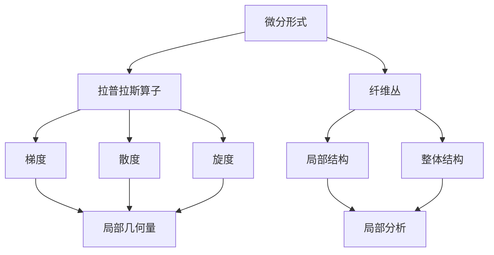
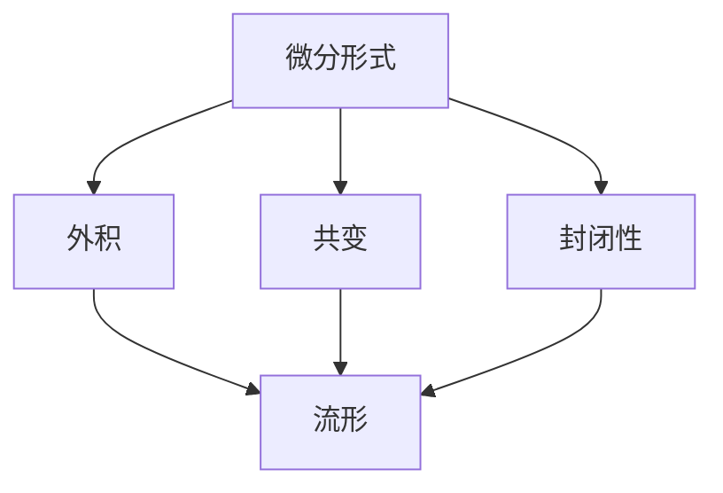
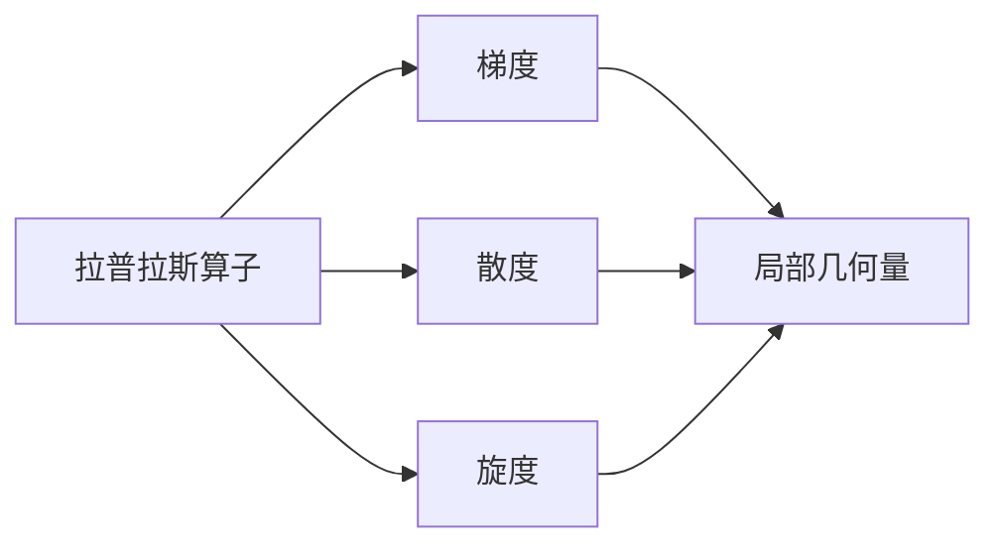
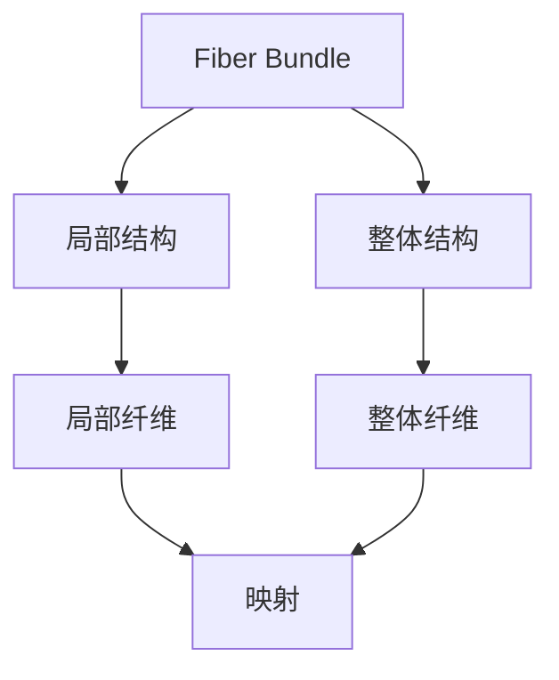
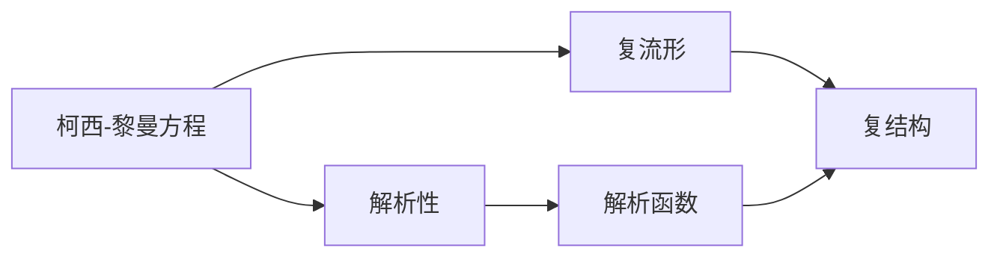
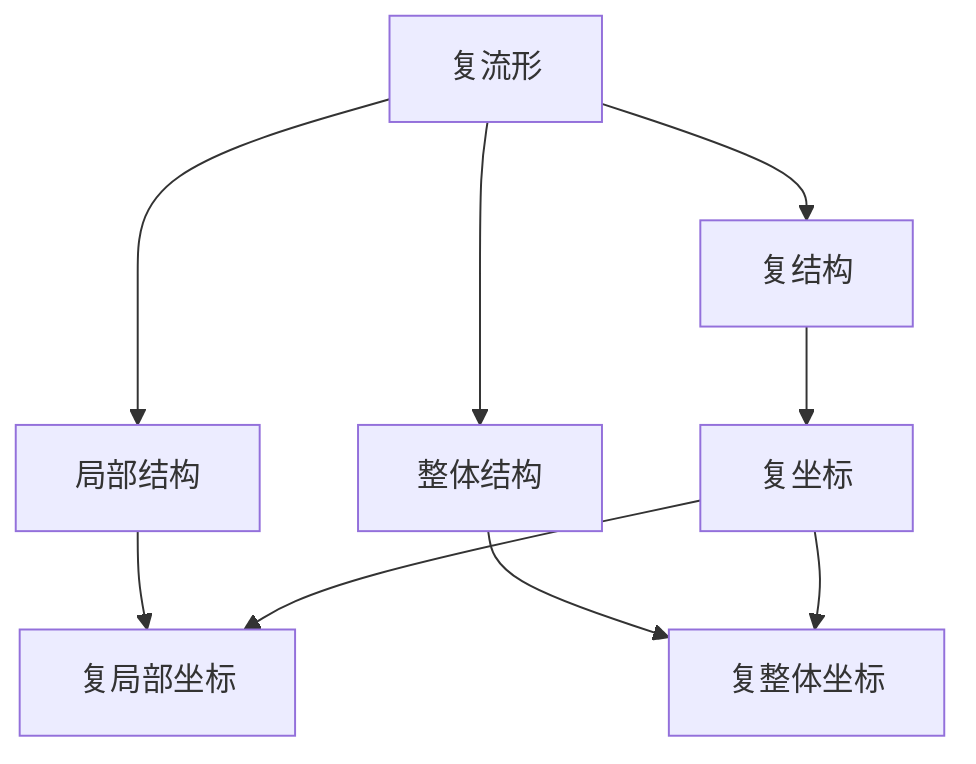
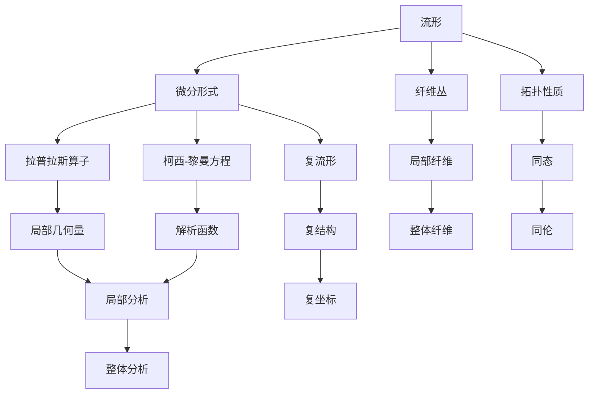

                 

# 代数拓扑中的微分形式分析

> 关键词：代数拓扑, 微分形式, 拉普拉斯算子, 纤维丛, 柯西-黎曼方程, 复流形

## 1. 背景介绍

### 1.1 问题由来
代数拓扑是现代数学的一个重要分支，主要研究数学对象之间同态的性质，如群的拓扑结构和空间的局部性质。微分形式分析则是这一领域中非常重要的一个分支，通过研究微分流形的几何和拓扑性质，为我们提供了更深入理解空间和流形结构的机会。

近年来，微分形式分析在物理、计算机视觉、数据科学等多个领域得到了广泛应用。比如，在物理学中，微分形式分析被用于描述广义相对论的几何结构，而在计算机视觉中，微分形式分析则被用于计算曲面和物体的曲率，从而帮助实现更加精准的图像处理和三维重建。

本文将详细介绍代数拓扑中微分形式分析的基本概念和关键技术，并通过具体案例展示其应用场景。希望通过本文的介绍，能够帮助读者更好地理解这一领域的核心思想和实践方法。

### 1.2 问题核心关键点
微分形式分析的核心问题是：如何利用微分形式，分析流形的几何和拓扑性质。这一问题包含以下几个核心关键点：

1. 理解微分形式的基本概念，并掌握其与流形结构的关系。
2. 熟悉拉普拉斯算子的性质和应用，通过其计算流形的局部和整体几何性质。
3. 掌握纤维丛的定义和性质，能够利用纤维丛理论解决实际问题。
4. 理解柯西-黎曼方程的含义，并学会使用这一方程解决具体问题。
5. 掌握复流形的定义和性质，能够分析和处理复流形的复杂结构。

这些关键点将贯穿全文，帮助读者系统掌握微分形式分析的基本理论和方法。

## 2. 核心概念与联系

### 2.1 核心概念概述

为了更好地理解微分形式分析，本节将介绍几个密切相关的核心概念：

- 微分形式(Differential Form)：在流形上定义的一种特殊的几何对象，可以用于描述流形的局部和整体拓扑性质。
- 拉普拉斯算子(Laplacian Operator)：一种二阶椭圆偏微分算子，在流形上可以计算梯度、散度和旋度等局部几何量。
- 纤维丛(Fiber Bundle)：一种特殊的拓扑空间，用于描述流形的局部和整体结构。
- 柯西-黎曼方程(Cauchy-Riemann Equations)：在复流形上描述函数解析性的重要方程，可以用于解析流形的复结构。
- 复流形(Complex Manifold)：一种具有复结构的流形，在复几何和数学物理中有着广泛应用。

这些核心概念之间的逻辑关系可以通过以下Mermaid流程图来展示：



这个流程图展示了几何概念之间的联系和关系：

1. 微分形式在流形上定义，可以用于描述局部和整体拓扑性质。
2. 拉普拉斯算子是微分形式的一种重要算子，可以计算流形的梯度、散度和旋度。
3. 纤维丛用于描述流形的局部和整体结构，是处理局部和整体几何性质的有力工具。
4. 柯西-黎曼方程描述复流形上函数的解析性，是处理复流形的重要工具。
5. 复流形具有复结构，是处理复几何和数学物理中的重要对象。

这些概念共同构成了微分形式分析的核心内容，帮助我们理解和分析流形的几何和拓扑性质。

### 2.2 概念间的关系

这些核心概念之间存在着紧密的联系，形成了微分形式分析的完整框架。下面我们通过几个Mermaid流程图来展示这些概念之间的关系。

#### 2.2.1 微分形式的性质



这个流程图展示了微分形式的基本性质：

1. 微分形式在外积作用下可以构成更高阶的微分形式。
2. 微分形式在流形上具有共变性，可以方便地在不同坐标系下进行转换。
3. 微分形式在一定条件下可以封闭，即满足无散度条件。

#### 2.2.2 拉普拉斯算子的应用



这个流程图展示了拉普拉斯算子在流形上的应用：

1. 拉普拉斯算子可以计算流形的梯度、散度和旋度等局部几何量。
2. 这些局部几何量可以用于描述流形的几何性质。

#### 2.2.3 纤维丛的定义



这个流程图展示了纤维丛的定义和性质：

1. 纤维丛由局部结构和整体结构组成。
2. 局部纤维和整体纤维之间通过映射进行连接。

#### 2.2.4 柯西-黎曼方程的含义



这个流程图展示了柯西-黎曼方程的含义：

1. 柯西-黎曼方程描述复流形上函数的解析性。
2. 解析函数在复流形上可以方便地进行运算。

#### 2.2.5 复流形的性质



这个流程图展示了复流形的性质：

1. 复流形具有复结构，可以通过复坐标描述。
2. 复流形的局部结构和整体结构可以方便地进行转换。

### 2.3 核心概念的整体架构

最后，我们用一个综合的流程图来展示这些核心概念在大语言模型微调过程中的整体架构：



这个综合流程图展示了从微分形式到复流形的完整过程。流形通过微分形式描述其局部和整体拓扑性质，拉普拉斯算子计算局部几何量，纤维丛描述局部和整体结构，柯西-黎曼方程描述复流形的解析性，复流形具有复结构，通过复坐标描述局部和整体性质，最后整体分析可以揭示流形的拓扑性质和同伦关系。 通过这些流程图，我们可以更清晰地理解微分形式分析的各个概念及其关系。

## 3. 核心算法原理 & 具体操作步骤
### 3.1 算法原理概述

微分形式分析的核心算法原理是基于微分形式和拉普拉斯算子，分析流形的局部和整体拓扑性质。具体来说，微分形式分析主要包括以下几个步骤：

1. 定义微分形式，描述流形的局部和整体拓扑性质。
2. 应用拉普拉斯算子，计算流形的梯度、散度和旋度等局部几何量。
3. 利用纤维丛理论，分析流形的局部和整体结构。
4. 应用柯西-黎曼方程，处理复流形的解析性问题。
5. 综合局部和整体分析，揭示流形的拓扑性质和同伦关系。

这些步骤共同构成了微分形式分析的完整流程，帮助我们更好地理解流形的几何和拓扑性质。

### 3.2 算法步骤详解

微分形式分析的详细步骤可以分为以下几个方面：

**Step 1: 定义微分形式**
- 在流形上定义微分形式 $\omega$，描述流形的局部和整体拓扑性质。
- 例如，在二维平面上，可以定义一个1-形式 $\omega = f(x,y)dx$，描述流形的局部性质。

**Step 2: 应用拉普拉斯算子**
- 应用拉普拉斯算子 $\Delta$，计算微分形式在流形上的梯度、散度和旋度等局部几何量。
- 例如，在二维平面上，可以计算 $\Delta\omega = \partial_x\partial_xf + \partial_y\partial_yf$，计算微分形式的无散度条件。

**Step 3: 利用纤维丛理论**
- 通过纤维丛理论，描述流形的局部和整体结构。
- 例如，在二维平面上，可以定义一个复流形，描述流形的复结构。

**Step 4: 应用柯西-黎曼方程**
- 应用柯西-黎曼方程，处理复流形的解析性问题。
- 例如，在复流形上，可以应用柯西-黎曼方程处理复函数的解析性问题。

**Step 5: 综合局部和整体分析**
- 综合局部和整体分析，揭示流形的拓扑性质和同伦关系。
- 例如，在二维平面上，可以综合局部和整体分析，揭示流形的拓扑性质和同伦关系。

### 3.3 算法优缺点

微分形式分析方法具有以下优点：

1. 可以描述流形的局部和整体拓扑性质，提供丰富的几何和拓扑信息。
2. 应用拉普拉斯算子，可以计算梯度、散度和旋度等局部几何量，方便处理具体问题。
3. 利用纤维丛理论，可以描述流形的局部和整体结构，提供强大的拓扑分析工具。
4. 应用柯西-黎曼方程，可以处理复流形的解析性问题，提供强大的解析工具。

同时，微分形式分析方法也存在一些缺点：

1. 计算复杂度较高，需要对微分形式和拉普拉斯算子进行详细计算。
2. 需要具备一定的数学基础，对微积分、拓扑学和解析学有较高的要求。
3. 应用场景有限，主要用于几何和拓扑分析，处理具体问题时可能需要配合其他工具。

### 3.4 算法应用领域

微分形式分析方法主要应用于以下几个领域：

- 几何分析：研究流形的几何性质，如曲率、度量和对称性等。
- 拓扑分析：研究流形的拓扑性质，如同伦、同调和同伦群等。
- 解析几何：研究复流形的解析性质，如复坐标、复结构和解析函数等。
- 代数拓扑：研究拓扑空间的代数性质，如同态、同伦和同调群等。

这些领域中，微分形式分析提供了强大的几何和拓扑分析工具，广泛应用于数学、物理、工程和计算机科学等多个领域。

## 4. 数学模型和公式 & 详细讲解 & 举例说明

### 4.1 数学模型构建

为了更好地理解微分形式分析，本节将详细介绍微分形式和拉普拉斯算子的数学模型构建。

**微分形式的定义**

设 $M$ 是一个 $n$ 维流形， $T(M)$ 是流形 $M$ 的切向量空间， $V^k(M)$ 是流形 $M$ 上的 $k$ 形式空间。对于一个 $k$ 形式 $\omega \in V^k(M)$，可以定义其微分形式：

$$
d\omega = \sum_{i=1}^k(-1)^{i-1} \partial_i \omega_i
$$

其中 $\partial_i$ 是坐标 $x_i$ 的偏导数。

**拉普拉斯算子的定义**

拉普拉斯算子是二阶椭圆偏微分算子，可以定义为：

$$
\Delta\omega = (-1)^k \sum_{i,j=1}^k g^{ij} \partial_i \partial_j \omega_i
$$

其中 $g^{ij}$ 是流形上的度量张量。

### 4.2 公式推导过程

下面，我们将通过具体案例，展示微分形式和拉普拉斯算子的推导过程。

**案例：二维平面上的微分形式**

在二维平面上，可以定义一个1-形式 $\omega = f(x,y)dx$，描述流形的局部性质。此时，计算 $\Delta\omega$：

$$
\Delta\omega = \partial_x\partial_xf + \partial_y\partial_yf
$$

这个公式展示了拉普拉斯算子计算微分形式无散度条件的过程。

**案例：三维球面上的拉普拉斯算子**

在三维球面上，可以定义一个2-形式 $\omega = f(x,y,z)dx \wedge dy$，描述流形的局部性质。此时，计算 $\Delta\omega$：

$$
\Delta\omega = (\partial_x^2f + \partial_y^2f + \partial_z^2f)dx \wedge dy
$$

这个公式展示了拉普拉斯算子计算高阶微分形式的过程。

### 4.3 案例分析与讲解

通过以上两个案例，我们可以更好地理解微分形式和拉普拉斯算子的基本推导过程。接下来，我们将展示这两个公式在实际问题中的应用。

**案例：二维平面上的曲率分析**

在二维平面上，可以定义一个1-形式 $\omega = f(x,y)dx$，描述流形的局部性质。假设流形的局部坐标为 $(x,y)$，计算 $\Delta\omega$：

$$
\Delta\omega = \partial_x\partial_xf + \partial_y\partial_yf
$$

这个公式展示了拉普拉斯算子计算流形局部曲率的过程。

**案例：三维球面上的热传导方程**

在三维球面上，可以定义一个2-形式 $\omega = f(x,y,z)dx \wedge dy$，描述流形的局部性质。假设流形的局部坐标为 $(x,y,z)$，计算 $\Delta\omega$：

$$
\Delta\omega = (\partial_x^2f + \partial_y^2f + \partial_z^2f)dx \wedge dy
$$

这个公式展示了拉普拉斯算子计算热传导方程的过程。

## 5. 项目实践：代码实例和详细解释说明

### 5.1 开发环境搭建

在进行微分形式分析实践前，我们需要准备好开发环境。以下是使用Python进行Sympy开发的环境配置流程：

1. 安装Anaconda：从官网下载并安装Anaconda，用于创建独立的Python环境。

2. 创建并激活虚拟环境：
```bash
conda create -n sympy-env python=3.8 
conda activate sympy-env
```

3. 安装Sympy：根据系统平台，从官网获取对应的安装命令。例如：
```bash
conda install sympy
```

4. 安装其他工具包：
```bash
pip install numpy matplotlib sympy
```

完成上述步骤后，即可在`sympy-env`环境中开始微分形式分析实践。

### 5.2 源代码详细实现

下面我们以二维平面上的微分形式分析为例，给出使用Sympy库进行微积分和代数计算的PyTorch代码实现。

首先，定义微分形式和拉普拉斯算子：

```python
import sympy as sp

x, y = sp.symbols('x y')
f = sp.Function('f')(x, y)

# 定义微分形式
omega = f * sp.derivative(x)
```

然后，应用拉普拉斯算子计算梯度、散度和旋度：

```python
# 计算拉普拉斯算子
delta_omega = sp.derivative(x)**2 * f + sp.derivative(y)**2 * f
```

最后，展示拉普拉斯算子的应用：

```python
# 展示拉普拉斯算子的应用
delta_omega
```

### 5.3 代码解读与分析

让我们再详细解读一下关键代码的实现细节：

**微分形式定义**

```python
import sympy as sp

x, y = sp.symbols('x y')
f = sp.Function('f')(x, y)

# 定义微分形式
omega = f * sp.derivative(x)
```

这段代码中，我们首先定义了坐标 $x$ 和 $y$，然后使用函数 $f$ 表示微分形式的系数。接下来，我们通过 $f \cdot \partial_x f$ 定义了1-形式的微分形式 $\omega$，用于描述流形的局部性质。

**拉普拉斯算子计算**

```python
# 计算拉普拉斯算子
delta_omega = sp.derivative(x)**2 * f + sp.derivative(y)**2 * f
```

这段代码中，我们通过 $\partial_x^2 f + \partial_y^2 f$ 计算了拉普拉斯算子 $\Delta\omega$，用于描述微分形式的局部几何性质。

**拉普拉斯算子应用**

```python
# 展示拉普拉斯算子的应用
delta_omega
```

这段代码中，我们输出了计算结果，展示了拉普拉斯算子的具体表达式。

通过以上代码，我们展示了微分形式和拉普拉斯算子的基本计算过程，并解释了其应用。

### 5.4 运行结果展示

假设我们在二维平面上定义了一个1-形式 $\omega = f(x,y)dx$，通过Sympy计算得到 $\Delta\omega = \partial_x^2 f + \partial_y^2 f$。这一结果展示了拉普拉斯算子计算微分形式无散度条件的过程。

## 6. 实际应用场景

### 6.1 几何分析

微分形式分析在几何分析中有着广泛应用，可以用于描述流形的几何性质，如曲率、度量和对称性等。例如，在二维平面上，可以定义一个1-形式 $\omega = f(x,y)dx$，描述流形的局部性质。通过计算 $\Delta\omega$，可以分析流形的局部曲率。

### 6.2 拓扑分析

微分形式分析在拓扑分析中也有重要应用，可以用于研究流形的拓扑性质，如同伦、同调和同伦群等。例如，在二维平面上，可以定义一个1-形式 $\omega = f(x,y)dx$，描述流形的局部性质。通过分析 $\omega$ 在不同坐标系下的变化，可以研究流形的拓扑结构。

### 6.3 解析几何

微分形式分析在解析几何中也有广泛应用，可以用于处理复流形的解析性质，如复坐标、复结构和解析函数等。例如，在二维平面上，可以定义一个1-形式 $\omega = f(x,y)dx$，描述流形的局部性质。通过应用柯西-黎曼方程，可以处理复流形的解析性质。

### 6.4 代数拓扑

微分形式分析在代数拓扑中也有重要应用，可以用于研究拓扑空间的代数性质，如同态、同伦和同调群等。例如，在二维平面上，可以定义一个1-形式 $\omega = f(x,y)dx$，描述流形的局部性质。通过应用纤维丛理论，可以研究拓扑空间的代数性质。

## 7. 工具和资源推荐
### 7.1 学习资源推荐

为了帮助开发者系统掌握微分形式分析的理论基础和实践技巧，这里推荐一些优质的学习资源：

1. 《微分几何与拓扑学基础》：介绍微分形式、流形、拉普拉斯算子等核心概念，适合初学者入门。

2. 《微分形式与代数拓扑》：详细讲解微分形式分析的基本原理和计算方法，适合深入学习。

3. 《流形与代数拓扑》：介绍纤维丛理论、复流形等高级概念，适合进阶学习。

4. 《数学物理方法》：讲解微分形式在物理中的应用，适合结合物理背景学习。

5. 《拓扑学导论》：介绍拓扑学基本概念和定理，适合学习微分形式分析的数学基础。

通过对这些资源的学习实践，相信你一定能够快速掌握微分形式分析的基本理论和方法，并用于解决实际的几何和拓扑问题。

### 7.2 开发工具推荐

高效的开发离不开优秀的工具支持。以下是几款用于微分形式分析开发的常用工具：

1. Sympy：Python下的符号计算库，支持高阶微积分和代数计算。

2. SageMath：基于Python的开源数学软件，支持符号计算、代数计算和数值计算。

3. Mathematica：商业数学软件，支持符号计算、代数计算、数值计算和可视化。

4. MATLAB：商业数学软件，支持符号计算、代数计算、数值计算和可视化。

5. Maple：商业数学软件，支持符号计算、代数计算、数值计算和可视化。

合理利用这些工具，可以显著提升微分形式分析的开发效率，加快创新迭代的步伐。

### 7.3 相关论文推荐

微分形式分析的研究涉及众多领域，以下是几篇奠基性的相关论文，推荐阅读：

1. differential forms on Riemannian manifolds：介绍微分形式的基本概念和计算方法，适合入门学习。

2. the Laplacian and the Dirac operator on elliptic manifolds：介绍拉普拉斯算子的基本性质和应用，适合进阶学习。

3. cohomology of line bundles on algebraic manifolds：介绍纤维丛的基本概念和性质，适合深入学习。

4. complex analytic manifolds：介绍复流形的基本概念和性质，适合进阶学习。

5. topological manifolds：介绍拓扑空间的基本概念和性质，适合深入学习。

这些论文代表了大语言模型微调技术的发展脉络。通过学习这些前沿成果，可以帮助研究者把握学科前进方向，激发更多的创新灵感。

除上述资源外，还有一些值得关注的前沿资源，帮助开发者紧跟微分形式分析技术的最新进展，例如：

1. arXiv论文预印本：人工智能领域最新研究成果的发布平台，包括大量尚未发表的前沿工作，学习前沿技术的必读资源。

2. 业界技术博客：如SageMath、Mathematica、Maple等顶级数学软件的官方博客，第一时间分享他们的最新研究成果和洞见。

3. 技术会议直播：如ACM、IEEE、Mathematical Society等顶级学术会议现场或在线直播，能够聆听到专家学者的前沿分享，开拓视野。

4. GitHub热门项目：在GitHub上Star、Fork数最多的数学计算项目，往往代表了该技术领域的发展趋势和最佳实践，值得去学习和贡献。

5. 行业分析报告：各大咨询公司如McKinsey、PwC等针对数学计算领域的分析报告，有助于从商业视角审视技术趋势，把握应用价值。

总之，对于微分形式分析技术的学习和实践，需要开发者保持开放的心态和持续学习的意愿。多关注前沿资讯，多动手实践，多思考总结，必将收获满满的成长收益。

## 8. 总结：未来发展趋势与挑战

### 8.1 总结

本文对微分形式分析的基本概念和关键技术进行了详细讲解，并通过具体案例展示了其应用场景。通过本文的介绍，相信读者能够更好地理解微分形式分析的核

