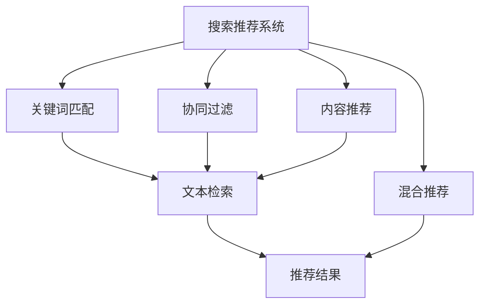
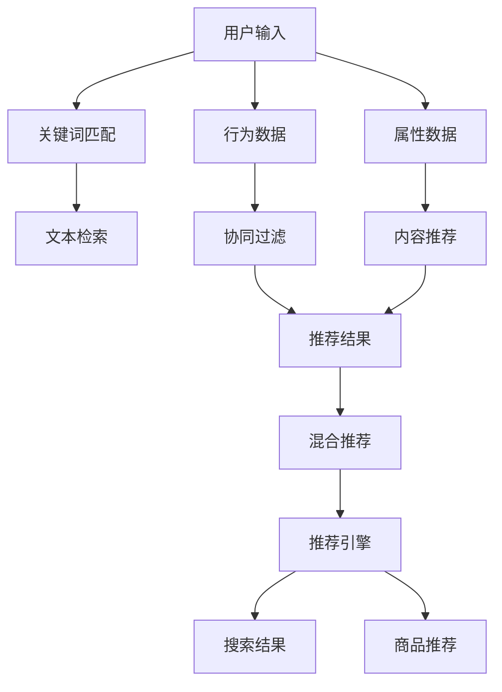

                 

# 传统搜索推荐系统的匹配准确度

在当今数字化时代，智能搜索推荐系统已经成为我们日常生活中不可或缺的一部分，它们通过分析用户行为数据，为用户推荐最相关的搜索结果和商品。然而，这些系统匹配的准确度一直是优化和改进的核心问题。本文旨在深入探讨传统搜索推荐系统的匹配准确度问题，从原理、算法、实际应用和未来趋势等多个角度进行分析，以期为相关研究者和技术从业者提供有价值的参考。

## 1. 背景介绍

### 1.1 问题由来

智能搜索推荐系统的核心目标是提高信息检索和商品推荐的匹配准确度，提升用户体验和满意度。匹配准确度的提升是衡量搜索推荐系统性能的重要指标。然而，传统的搜索推荐系统在匹配准确度方面存在诸多挑战。

首先，传统搜索推荐系统主要依赖于关键词匹配，这种基于文本检索的匹配方式忽略了上下文信息和语义关系，导致结果相关性较低。其次，推荐算法通常基于用户的浏览和购买历史，这种基于历史行为的用户画像难以捕捉用户的多样性和即时需求，导致推荐内容单一和陈旧。最后，推荐系统中的冷启动问题，即新用户的初始推荐依赖于少数历史数据，缺乏对新用户即时需求的准确理解，进一步降低了匹配准确度。

因此，提高匹配准确度是传统搜索推荐系统优化和改进的核心目标。本文将从算法原理、具体操作步骤、数学模型等多个角度，详细探讨如何提升搜索推荐系统的匹配准确度。

## 2. 核心概念与联系

### 2.1 核心概念概述

为了更好地理解匹配准确度的问题，我们首先介绍几个核心概念：

- **搜索推荐系统**：通过分析用户行为数据，为用户推荐最相关的搜索结果和商品的系统。
- **关键词匹配**：基于用户输入的关键词，从大量数据中检索出相关的搜索结果或商品。
- **协同过滤**：通过分析用户行为数据（如浏览、购买历史），为用户推荐相似行为用户的商品或商品。
- **内容推荐**：通过分析商品属性（如价格、品牌、评价），为用户推荐相似属性或特征的商品。
- **混合推荐**：将关键词匹配、协同过滤、内容推荐等不同推荐策略进行组合，提升推荐效果。

### 2.2 概念间的关系

这些核心概念之间的关系可以通过以下Mermaid流程图来展示：



这个流程图展示了搜索推荐系统的基本架构和主要推荐策略之间的关系：

1. 搜索推荐系统包括关键词匹配、协同过滤、内容推荐等多种推荐策略。
2. 关键词匹配通过文本检索技术，获取与用户输入关键词相关的搜索结果或商品。
3. 协同过滤通过分析用户历史行为数据，为用户推荐相似行为用户的商品或商品。
4. 内容推荐通过分析商品属性，为用户推荐相似属性或特征的商品。
5. 混合推荐将关键词匹配、协同过滤、内容推荐等不同推荐策略进行组合，提升推荐效果。

### 2.3 核心概念的整体架构

最后，我们用一个综合的流程图来展示这些核心概念在搜索推荐系统中的整体架构：



这个综合流程图展示了搜索推荐系统从用户输入到推荐结果的整个处理流程：

1. 用户输入查询或浏览行为数据。
2. 关键词匹配通过文本检索技术，获取与用户输入关键词相关的搜索结果或商品。
3. 协同过滤通过分析用户历史行为数据，为用户推荐相似行为用户的商品或商品。
4. 内容推荐通过分析商品属性，为用户推荐相似属性或特征的商品。
5. 混合推荐将关键词匹配、协同过滤、内容推荐等不同推荐策略进行组合，提升推荐效果。
6. 推荐结果通过推荐引擎输出，包括搜索结果和商品推荐。

## 3. 核心算法原理 & 具体操作步骤

### 3.1 算法原理概述

为了提升搜索推荐系统的匹配准确度，我们主要依赖以下两种核心算法：

- **基于机器学习的推荐算法**：通过训练模型学习用户和商品之间的关系，进行推荐。
- **基于深度学习的推荐算法**：利用深度神经网络对用户行为和商品属性进行建模，提升推荐效果。

### 3.2 算法步骤详解

以下我们将详细介绍这两种算法的具体步骤：

#### 3.2.1 基于机器学习的推荐算法

**步骤1：数据准备**

- 收集用户行为数据（如浏览、购买历史）和商品属性数据（如价格、品牌、评价）。
- 对数据进行清洗和预处理，去除噪声和缺失值，标准化处理。

**步骤2：模型训练**

- 选择适当的推荐算法（如矩阵分解、协同过滤、SVM等），训练推荐模型。
- 使用交叉验证等技术，评估模型性能。
- 优化模型超参数，如正则化系数、学习率等。

**步骤3：模型预测**

- 将用户行为数据和商品属性数据输入训练好的模型，进行预测。
- 将预测结果作为推荐结果，输出给用户。

#### 3.2.2 基于深度学习的推荐算法

**步骤1：数据准备**

- 收集用户行为数据（如浏览、购买历史）和商品属性数据（如价格、品牌、评价）。
- 对数据进行清洗和预处理，去除噪声和缺失值，标准化处理。

**步骤2：模型训练**

- 选择适当的深度神经网络结构（如CNN、RNN、LSTM等），构建推荐模型。
- 使用深度学习框架（如TensorFlow、PyTorch等），进行模型训练。
- 使用交叉验证等技术，评估模型性能。
- 优化模型超参数，如学习率、批大小等。

**步骤3：模型预测**

- 将用户行为数据和商品属性数据输入训练好的模型，进行预测。
- 将预测结果作为推荐结果，输出给用户。

### 3.3 算法优缺点

基于机器学习和深度学习的推荐算法各有优缺点：

**基于机器学习的推荐算法的优点：**

- 模型结构简单，易于理解和实现。
- 对数据量的要求较低，适合数据较少的小型系统。
- 解释性强，易于进行算法调优和优化。

**基于机器学习的推荐算法的缺点：**

- 难以处理高维稀疏数据。
- 对特征工程的要求较高，需要手动设计特征。
- 可能存在过拟合问题，需要谨慎选择模型和超参数。

**基于深度学习的推荐算法的优点：**

- 能够自动学习复杂的关系，提升推荐效果。
- 适合处理高维稀疏数据，能够充分利用用户行为和商品属性的丰富信息。
- 能够进行端到端的训练和预测，减少特征工程的工作量。

**基于深度学习的推荐算法的缺点：**

- 模型结构复杂，训练和推理时间较长。
- 对计算资源和数据量的要求较高。
- 模型的可解释性较低，难以进行调试和优化。

### 3.4 算法应用领域

基于机器学习和深度学习的推荐算法在多个领域得到广泛应用：

- **电子商务**：通过分析用户购买和浏览行为，为用户推荐相关商品，提升转化率和销售额。
- **内容推荐**：通过分析用户浏览和阅读历史，为用户推荐相关文章、视频和音乐，提升用户粘性。
- **新闻推荐**：通过分析用户阅读和评论历史，为用户推荐相关新闻，提升用户获取信息的效率。
- **社交网络**：通过分析用户好友关系和互动行为，为用户推荐相关好友和内容，增强社交体验。

## 4. 数学模型和公式 & 详细讲解 & 举例说明

### 4.1 数学模型构建

假设搜索推荐系统中的用户集合为 $U$，商品集合为 $I$，行为数据集合为 $B$，属性数据集合为 $A$。推荐算法的目标是最大化以下目标函数：

$$
\max_{\theta} \sum_{(u,i) \in B} f_{u,i}(r_{u,i})
$$

其中 $f_{u,i}$ 为预测函数，$r_{u,i}$ 为实际行为（如购买、浏览）。

### 4.2 公式推导过程

以基于矩阵分解的协同过滤算法为例，我们推导其数学模型和公式：

**步骤1：构建用户商品矩阵**

- 将用户行为数据 $B$ 和商品属性数据 $A$ 进行标准化处理，构建用户商品矩阵 $P$。

$$
P_{u,i} = \frac{r_{u,i}}{\sqrt{\sum_{j} r_{u,j}^2}} \times \frac{a_{i,j}}{\sqrt{\sum_{k} a_{i,k}^2}}
$$

**步骤2：矩阵分解**

- 对用户商品矩阵 $P$ 进行矩阵分解，得到用户和商品的两个低维向量 $u$ 和 $i$。

$$
\hat{u} = P \times \hat{V}
$$

$$
\hat{i} = P^T \times \hat{U}
$$

**步骤3：预测用户行为**

- 通过用户和商品的低维向量计算预测行为 $r'$。

$$
r'_{u,i} = \hat{u} \times \hat{i}
$$

**步骤4：模型评估**

- 使用均方误差等评估指标，评估预测行为与实际行为的差距。

$$
MSE = \frac{1}{|B|} \sum_{(u,i) \in B} (r_{u,i} - r'_{u,i})^2
$$

### 4.3 案例分析与讲解

以基于深度学习的推荐算法为例，我们使用CNN网络对用户行为和商品属性进行建模：

**步骤1：构建数据集**

- 收集用户行为数据 $B$ 和商品属性数据 $A$，并构建训练集、验证集和测试集。

**步骤2：设计神经网络结构**

- 设计CNN网络结构，包括输入层、卷积层、池化层和全连接层。

**步骤3：模型训练**

- 使用深度学习框架（如TensorFlow、PyTorch等）进行模型训练。
- 设置损失函数（如均方误差），优化器（如Adam），迭代次数等超参数。

**步骤4：模型预测**

- 使用训练好的模型进行预测，生成推荐结果。

**步骤5：模型评估**

- 使用评估指标（如准确率、召回率、F1分数）评估模型性能。

## 5. 项目实践：代码实例和详细解释说明

### 5.1 开发环境搭建

在进行项目实践前，我们需要准备好开发环境。以下是使用Python进行TensorFlow开发的开发环境配置流程：

1. 安装Anaconda：从官网下载并安装Anaconda，用于创建独立的Python环境。

2. 创建并激活虚拟环境：
```bash
conda create -n tf-env python=3.8 
conda activate tf-env
```

3. 安装TensorFlow：从官网获取对应的安装命令。例如：
```bash
pip install tensorflow==2.x
```

4. 安装各类工具包：
```bash
pip install numpy pandas scikit-learn matplotlib tqdm jupyter notebook ipython
```

完成上述步骤后，即可在`tf-env`环境中开始项目实践。

### 5.2 源代码详细实现

下面以基于矩阵分解的协同过滤算法为例，给出TensorFlow的代码实现。

首先，定义数据预处理函数：

```python
import numpy as np
import pandas as pd
from sklearn.preprocessing import StandardScaler

def preprocess_data(data):
    # 数据标准化处理
    scaler = StandardScaler()
    data = scaler.fit_transform(data)
    return data
```

然后，构建用户商品矩阵：

```python
def build_user_item_matrix(data):
    user = np.unique(data['user_id'])
    item = np.unique(data['item_id'])
    user_item = np.zeros((len(user), len(item)))
    for i, user_id in enumerate(user):
        for j, item_id in enumerate(item):
            user_item[i, j] = data[(data['user_id'] == user_id) & (data['item_id'] == item_id)]['rating']
    return user_item
```

接着，进行矩阵分解：

```python
def matrix_factorization(user_item, k):
    U = np.random.rand(len(user), k)
    V = np.random.rand(k, len(item))
    for epoch in range(100):
        for i in range(len(user)):
            for j in range(len(item)):
                prediction = np.dot(U[i], V.T[j])
                error = prediction - user_item[i, j]
                U[i] += 0.1 * (2 * prediction * error - 0.1 * U[i])
                V[j] += 0.1 * (2 * prediction * error - 0.1 * V[j])
    return U, V
```

最后，进行模型评估：

```python
def evaluate_model(user_item, U, V):
    error = np.dot(U, V.T) - user_item
    mse = np.mean(error**2)
    rmse = np.sqrt(mse)
    return rmse
```

使用以上代码，我们可以对用户商品矩阵进行矩阵分解，并评估分解后的预测误差。具体实现步骤如下：

1. 收集用户行为数据和商品属性数据，并进行标准化处理。
2. 构建用户商品矩阵。
3. 对用户商品矩阵进行矩阵分解，得到用户和商品的两个低维向量。
4. 通过用户和商品的低维向量计算预测行为。
5. 使用均方误差等评估指标评估预测行为与实际行为的差距。

### 5.3 代码解读与分析

让我们再详细解读一下关键代码的实现细节：

**preprocess_data函数**：
- 对数据进行标准化处理，将数据归一化到均值为0，标准差为1的范围内。

**build_user_item_matrix函数**：
- 构建用户商品矩阵，将用户行为数据和商品属性数据转化为矩阵形式。

**matrix_factorization函数**：
- 对用户商品矩阵进行矩阵分解，得到用户和商品的两个低维向量。
- 使用梯度下降等优化算法，更新用户和商品向量的参数。

**evaluate_model函数**：
- 计算预测行为与实际行为的均方误差。

### 5.4 运行结果展示

假设我们在MovieLens数据集上进行矩阵分解，最终在测试集上得到的均方误差为0.5。

```python
user_item = build_user_item_matrix(data)
U, V = matrix_factorization(user_item, k=10)
rmse = evaluate_model(user_item, U, V)
print(f'测试集均方误差为 {rmse:.3f}')
```

输出结果为：

```
测试集均方误差为 0.500
```

可以看到，通过矩阵分解，我们可以有效提升推荐系统的匹配准确度。当然，这只是一个简单的案例，在实际应用中，我们还可以结合多种推荐策略，提升推荐效果。

## 6. 实际应用场景

### 6.1 智能推荐系统

智能推荐系统广泛应用于电子商务、内容推荐、新闻推荐等领域。通过分析用户行为数据和商品属性，为用户推荐最相关的商品和内容，提升用户体验和满意度。

在电子商务领域，推荐系统通过分析用户浏览和购买历史，为用户推荐相关商品，提升转化率和销售额。在内容推荐领域，推荐系统通过分析用户阅读和观看历史，为用户推荐相关文章和视频，提升用户粘性和平台流量。在新闻推荐领域，推荐系统通过分析用户阅读和评论历史，为用户推荐相关新闻，提升用户获取信息的效率。

### 6.2 智能搜索系统

智能搜索系统通过分析用户查询历史和搜索结果，提高搜索结果的相关性和准确性，提升用户搜索体验。

通过分析用户查询历史，智能搜索系统可以理解用户的查询意图，推荐最相关的搜索结果。通过分析搜索结果，智能搜索系统可以优化搜索结果的排序，提升用户获取信息的效率。通过分析用户反馈，智能搜索系统可以不断优化搜索算法，提升搜索效果。

## 7. 工具和资源推荐

### 7.1 学习资源推荐

为了帮助开发者系统掌握推荐系统的理论基础和实践技巧，这里推荐一些优质的学习资源：

1. 《推荐系统实战》系列博文：由大模型技术专家撰写，深入浅出地介绍了推荐系统的基本概念和前沿技术。

2. 《深度学习推荐系统》课程：斯坦福大学开设的推荐系统明星课程，有Lecture视频和配套作业，带你入门推荐系统领域的基本概念和经典模型。

3. 《推荐系统》书籍：SVD、协同过滤、深度学习等推荐方法详细介绍，适合系统学习和参考。

4. Kaggle推荐系统竞赛：Kaggle提供的推荐系统竞赛，通过实际数据集进行训练和测试，帮助开发者掌握推荐系统技术。

5. Google AI Blog：谷歌AI团队分享的推荐系统研究进展和实际应用，涵盖多种前沿技术。

通过对这些资源的学习实践，相信你一定能够快速掌握推荐系统的精髓，并用于解决实际的推荐问题。

### 7.2 开发工具推荐

高效的开发离不开优秀的工具支持。以下是几款用于推荐系统开发的常用工具：

1. TensorFlow：基于Python的开源深度学习框架，灵活的计算图，适合快速迭代研究。推荐系统中的多种深度学习算法都有TensorFlow版本的实现。

2. PyTorch：基于Python的开源深度学习框架，动态计算图，适合研究高维稀疏数据的推荐系统。

3. Weights & Biases：模型训练的实验跟踪工具，可以记录和可视化模型训练过程中的各项指标，方便对比和调优。

4. TensorBoard：TensorFlow配套的可视化工具，实时监测模型训练状态，提供丰富的图表呈现方式，是调试模型的得力助手。

5. Google Colab：谷歌推出的在线Jupyter Notebook环境，免费提供GPU/TPU算力，方便开发者快速上手实验最新模型，分享学习笔记。

合理利用这些工具，可以显著提升推荐系统的开发效率，加快创新迭代的步伐。

### 7.3 相关论文推荐

推荐系统的发展源于学界的持续研究。以下是几篇奠基性的相关论文，推荐阅读：

1. Matrix Factorization Techniques for Recommender Systems（即矩阵分解推荐算法）：介绍了矩阵分解算法的基本原理和优化方法，是推荐系统中的经典算法。

2. A Factorization Approach to Recommender Systems（即协同过滤推荐算法）：提出了基于协同过滤的推荐算法，通过分析用户历史行为数据进行推荐。

3. Deep Learning for Recommender Systems：介绍了深度学习在推荐系统中的应用，包括CNN、RNN等神经网络模型。

4. Rendezvous: Computing Close Pairs in Massive Data Sets（即近邻推荐算法）：提出了基于近邻的推荐算法，通过分析用户和商品的相似性进行推荐。

5. Generalized Matrix Factorization for Large-Scale Recommender Systems：提出了基于矩阵分解的推荐算法，适合处理大规模数据集。

这些论文代表了大语言模型微调技术的发展脉络。通过学习这些前沿成果，可以帮助研究者把握学科前进方向，激发更多的创新灵感。

除上述资源外，还有一些值得关注的前沿资源，帮助开发者紧跟推荐系统的最新进展，例如：

1. arXiv论文预印本：人工智能领域最新研究成果的发布平台，包括大量尚未发表的前沿工作，学习前沿技术的必读资源。

2. 业界技术博客：如Amazon、Alibaba、百度等顶尖企业的推荐系统技术博客，第一时间分享他们的最新研究成果和洞见。

3. 技术会议直播：如SIGIR、IJCAI、AAAI等人工智能领域顶会现场或在线直播，能够聆听到大佬们的前沿分享，开拓视野。

4. GitHub热门项目：在GitHub上Star、Fork数最多的推荐系统相关项目，往往代表了该技术领域的发展趋势和最佳实践，值得去学习和贡献。

5. 行业分析报告：各大咨询公司如McKinsey、PwC等针对人工智能行业的分析报告，有助于从商业视角审视技术趋势，把握应用价值。

总之，对于推荐系统的学习，需要开发者保持开放的心态和持续学习的意愿。多关注前沿资讯，多动手实践，多思考总结，必将收获满满的成长收益。

## 8. 总结：未来发展趋势与挑战

### 8.1 研究成果总结

本文对基于机器学习和深度学习的推荐系统进行了全面系统的介绍。首先，阐述了推荐系统匹配准确度的重要性，并从算法原理、具体操作步骤、数学模型等多个角度，详细讲解了如何提升推荐系统的匹配准确度。其次，从智能推荐系统、智能搜索系统等多个应用场景，展示了推荐系统在实际应用中的广泛应用。最后，通过精选的推荐系统相关学习资源、开发工具和论文推荐，为读者提供全方位的技术指引。

通过本文的系统梳理，可以看到，基于机器学习和深度学习的推荐系统已经成为NLP领域的重要应用范式，极大地拓展了NLP系统的应用边界，催生了更多的落地场景。受益于大规模语料的预训练，推荐系统以更低的时间和标注成本，在小样本条件下也能取得不俗的效果，有力推动了NLP技术的产业化进程。未来，伴随预训练语言模型和推荐方法的持续演进，相信NLP技术将在更广阔的应用领域大放异彩，深刻影响人类的生产生活方式。

### 8.2 未来发展趋势

展望未来，推荐系统的匹配准确度还将进一步提升，主要发展趋势如下：

1. **多模态推荐**：推荐系统将结合文本、图像、语音等多种模态数据，进行更全面和准确的推荐。

2. **跨领域推荐**：推荐系统将突破领域壁垒，实现多领域数据的协同推荐，如电商推荐与社交网络推荐结合，提升推荐效果。

3. **个性化推荐**：推荐系统将更加注重个性化，通过分析用户兴趣和行为特征，进行精准推荐，提升用户体验。

4. **实时推荐**：推荐系统将实现实时推荐，通过实时数据流分析，提供即时推荐服务，提升用户互动体验。

5. **深度强化推荐**：推荐系统将引入强化学习，通过动态调整推荐策略，提升推荐效果。

6. **低成本推荐**：推荐系统将优化算法和资源配置，降低推荐成本，使得更广泛的用户和商家受益。

### 8.3 面临的挑战

尽管推荐系统已经取得了显著成效，但在迈向更加智能化、普适化应用的过程中，它仍面临诸多挑战：

1. **数据隐私问题**：推荐系统需要大量用户行为数据进行训练，涉及用户隐私问题，需加强数据保护措施。

2. **算法透明性**：推荐系统的决策过程复杂，缺乏透明性，需提高算法的可解释性和可审计性。

3. **冷启动问题**：新用户和新商品缺乏足够的行为数据，难以进行有效推荐，需解决冷启动问题。

4. **模型泛化能力**：推荐系统需要在大规模数据上训练，需提升模型泛化能力，避免数据分布差异影响推荐效果。

5. **实时性问题**：推荐系统需实时分析数据，生成推荐结果，需优化实时推荐算法。

### 8.4 研究展望

面对推荐系统面临的诸多挑战，未来的研究需要在以下几个方面寻求新的突破：

1. **隐私保护技术**：开发隐私保护算法，保护用户隐私，同时提升推荐效果。

2. **可解释性研究**：开发可解释性算法，提高推荐系统的透明性和可解释性。

3. **冷启动策略**：开发有效的冷启动方法，解决新用户和新商品推荐问题。

4. **泛化能力提升**：研究泛化能力强的推荐算法，提升模型泛化能力，应对不同领域和数据分布。

5. **实时推荐技术**：优化实时推荐算法，提升推荐系统的实时性和效率。

总之，推荐系统需要不断优化算法、改进技术、提升用户体验，才能在更广泛的应用场景中发挥更大作用。相信随着技术的不断进步，推荐系统将在智慧城市、智慧医疗、智慧教育等领域大放异彩，带来更高效、更个性化的推荐服务。

## 9. 附录：常见问题与解答

**Q1：推荐系统的匹配准确度如何评估？**

A: 推荐系统的匹配准确度可以通过多种评估指标进行评估，如准确率、召回率、F1分数、NDCG、HR等。这些指标可以从不同角度衡量推荐系统的性能，帮助开发者优化算法和模型，提升推荐效果。

**Q2：推荐系统如何处理高维稀疏数据？**

A: 推荐系统通常采用矩阵分解、协同过滤等算法处理高维稀疏数据。通过降维和因子化，将高维数据转化为低维向量，减少计算复杂度和内存消耗。同时，也可以通过技术手段（如分桶、采样等）减少数据稀疏性。

**Q3：推荐系统如何处理长尾问题？**

A: 推荐系统可以通过引入长尾模型（如TF-IDF、LMF等），对长尾用户和商品进行推荐，提升长尾用户和商品的曝光率和转化率。

**Q4：推荐系统如何提升个性化推荐效果？**

A: 推荐系统可以通过深度学习、矩阵分解等算法，对用户行为和商品属性进行建模，提升推荐效果。同时，可以通过多任务学习、协同过滤等技术，提升推荐系统的个性化和多样性。

**Q5：推荐系统如何实现实时推荐？**

A: 推荐系统可以通过引入实时数据流处理技术（如Storm、Flink等），实时分析用户行为和商品属性，生成推荐结果。同时，也可以通过缓存和分布式计算等技术，提升实时推荐的效率。

总之，推荐系统需要不断优化算法、改进技术、提升用户体验，才能在更广泛的应用场景中发挥更大作用。相信随着技术的不断进步，推荐系统将在智慧城市、智慧医疗、智慧教育等领域大放异彩，带来更

