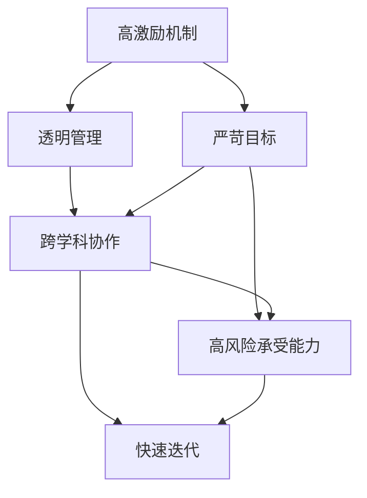

                 

# 保持活跃氛围:马斯克的企业文化特点

## 1. 背景介绍

### 1.1 问题由来
现代企业界常常面临如何激发员工活力，提高团队创造力的挑战。在这样的背景下，一些创新型企业的成功经验，如特斯拉（Tesla）和SpaceX等，逐渐成为研究和学习的对象。其中，马斯克（Elon Musk）的企业文化和领导风格，尤为引人关注。马斯克的企业文化以其独特的激励方式和高效运作著称，对于激发员工潜力，打造高效团队有重要意义。本文将从背景介绍、核心概念、算法原理与操作步骤、数学模型与公式推导、项目实践、实际应用场景、工具与资源推荐、未来展望和常见问题等方面，深入探讨马斯克的企业文化特点及其对企业的长远影响。

### 1.2 问题核心关键点
马斯克的企业文化，核心在于其独特的人性化管理和高效的工作氛围。主要体现在以下几个方面：
1. **高激励机制**：马斯克通过股权激励、期权激励等方式，对员工给予丰厚的回报。
2. **透明管理**：公司内部信息透明，鼓励员工积极参与，共享公司愿景。
3. **严苛目标**：设定高目标，并以实际数据驱动决策。
4. **跨学科协作**：鼓励不同领域员工之间的协作，激发创新。
5. **高风险承受能力**：鼓励尝试新技术和新模式，容忍失败。
6. **快速迭代**：快速响应市场变化，快速迭代产品。

这些核心要素，共同构成了马斯克的企业文化，推动了特斯拉等公司的持续创新和发展。

### 1.3 问题研究意义
马斯克的企业文化研究，有助于企业家和团队管理者了解并借鉴其成功经验，构建高效的企业氛围。通过深入研究其企业文化，可以洞察企业成功背后的管理哲学，为自身企业的发展提供指导。同时，理解其文化特点，也有助于识别企业管理中的潜在问题，及早改进。

## 2. 核心概念与联系

### 2.1 核心概念概述

马斯克的企业文化，涉及多个核心概念，这些概念之间存在紧密联系。本文将详细阐述这些概念，并展示它们之间的联系。

#### 2.1.1 激励机制
马斯克采用股权激励和期权激励等方式，极大程度地提升了员工的积极性和创造力。员工持股计划不仅能增强归属感，还能激励员工长期工作，降低人员流失率。

#### 2.1.2 透明管理
透明度是马斯克企业文化的重要组成部分。公司内部信息公开透明，员工能够充分了解公司目标、进展和决策依据。这种透明度增强了员工对公司愿景的认同感，同时降低了信息不对称带来的管理成本。

#### 2.1.3 严苛目标
设定高目标，以实际数据驱动决策，是马斯克管理风格的关键。高目标不仅激发员工的斗志，还能增强公司整体效率和竞争力。数据驱动决策则提高了管理决策的科学性和准确性。

#### 2.1.4 跨学科协作
马斯克强调跨学科协作，鼓励不同领域的人才合作，激发了更多创新。跨学科协作不仅仅是技术上的跨界，还包括市场、运营、法律等多个方面的整合，形成系统的创新能力。

#### 2.1.5 高风险承受能力
特斯拉在创新和尝试新技术时，常常面临高风险，但马斯克认为这些风险是必要的，只有勇于承担风险，才能实现真正的创新。

#### 2.1.6 快速迭代
马斯克提倡快速迭代，通过不断试验和修正，迅速响应市场变化，快速迭代产品。这种文化推动了特斯拉产品快速上市，减少了市场竞争者的机会。

### 2.2 概念间的关系

这些核心概念之间存在紧密的联系，形成了马斯克企业文化的关键框架。以下通过Mermaid流程图展示其相互关系：



这个流程图展示了从激励机制到快速迭代，马斯克企业文化如何一步步推动企业创新和发展。

## 3. 核心算法原理 & 具体操作步骤

### 3.1 算法原理概述

马斯克的企业文化，其核心算法原理可以概括为以下几个步骤：

1. **激励机制设计**：通过股权激励和期权激励，激励员工长期投入。
2. **信息透明化**：内部信息公开透明，增强员工认同感。
3. **设定高目标**：设定挑战性的目标，以数据驱动决策。
4. **跨学科协作**：鼓励不同领域人才的协作，激发创新。
5. **风险管理**：承担高风险，勇于尝试新技术。
6. **快速迭代**：通过不断试验和修正，快速响应市场变化。

### 3.2 算法步骤详解

#### 3.2.1 高激励机制设计
1. **股权激励**：员工持股计划，增强员工归属感。
2. **期权激励**：长期期权计划，使员工关注长期利益。
3. **绩效评估**：根据实际绩效，分配股权和期权。

#### 3.2.2 信息透明化
1. **全员会议**：定期举行全员会议，通报公司进展和目标。
2. **内部博客**：公司内部建立博客平台，员工可以自由发表意见。
3. **决策公示**：重大决策提前公示，征求员工意见。

#### 3.2.3 设定高目标
1. **SMART原则**：目标设定遵循具体、可衡量、可达成、相关、时限（SMART）原则。
2. **数据驱动**：使用KPI指标，驱动决策和执行。
3. **目标对齐**：确保各部门目标一致，协同作战。

#### 3.2.4 跨学科协作
1. **跨部门合作项目**：设置跨部门合作项目，推动技术、市场、运营等方面的整合。
2. **定期交流会**：定期组织跨部门交流会，分享信息，解决问题。
3. **协作平台**：建立协作平台，促进不同部门之间的沟通和协作。

#### 3.2.5 风险管理
1. **风险评估**：对创新项目进行风险评估，确定可接受的风险水平。
2. **容错机制**：容忍一定程度的失败，鼓励创新。
3. **快速应对**：设立应急响应机制，快速处理突发问题。

#### 3.2.6 快速迭代
1. **快速原型**：快速开发原型，快速验证产品。
2. **反馈循环**：根据用户反馈，快速迭代优化。
3. **持续改进**：通过持续改进，提升产品质量。

### 3.3 算法优缺点

#### 3.3.1 优点
1. **高激励**：通过激励机制，提升了员工的工作积极性和创造力。
2. **透明管理**：信息透明化，增强了员工对公司的认同感。
3. **高效决策**：高目标驱动，数据驱动决策，提高了管理效率。
4. **协作创新**：跨学科协作，激发了更多创新。
5. **风险承受**：勇于承担高风险，推动技术创新。
6. **快速响应**：快速迭代，迅速响应市场变化。

#### 3.3.2 缺点
1. **高风险**：高风险管理不当可能导致重大损失。
2. **管理复杂**：信息透明化可能带来信息泄露的风险。
3. **压力大**：高目标和高风险可能导致员工压力大。
4. **短期行为**：激励机制可能使员工行为短期化。

### 3.4 算法应用领域

马斯克的企业文化，其核心算法原理不仅适用于特斯拉（Tesla），还适用于其他高科技企业，如SpaceX、Neuralink、The Boring Company等。这些企业在高速发展和创新过程中，都运用了类似的激励机制、透明管理、高目标设定、跨学科协作、风险管理和快速迭代等策略。

## 4. 数学模型和公式 & 详细讲解 & 举例说明

### 4.1 数学模型构建

为了更好地理解马斯克的企业文化，我们需要建立数学模型来量化其特点和效果。本文将使用数学语言对马斯克企业文化进行严格刻画。

记公司共有员工 $N$ 人，设其第 $i$ 个员工在项目 $j$ 上的表现和回报为 $P_i^j$ 和 $R_i^j$。马斯克企业文化的特点可以表示为以下模型：

1. **激励机制**：$P_i^j = \alpha \times (\text{股权激励系数}) + \beta \times (\text{期权激励系数}) + \gamma \times (\text{绩效系数})$

2. **透明管理**：$\text{透明系数} = \lambda \times (\text{会议频率}) + \mu \times (\text{信息公开度}) + \nu \times (\text{决策透明度})$

3. **目标设定**：$\text{目标设定系数} = \delta \times (\text{SMART原则系数}) + \epsilon \times (\text{数据驱动系数}) + \zeta \times (\text{目标对齐系数})$

4. **协作创新**：$\text{协作系数} = \theta \times (\text{跨部门合作系数}) + \omega \times (\text{交流会议系数}) + \eta \times (\text{协作平台系数})$

5. **风险管理**：$\text{风险管理系数} = \xi \times (\text{风险评估系数}) + \pi \times (\text{容错机制系数}) + \kappa \times (\text{快速应对系数})$

6. **快速迭代**：$\text{快速迭代系数} = \sigma \times (\text{快速原型系数}) + \tau \times (\text{反馈循环系数}) + \phi \times (\text{持续改进系数})$

### 4.2 公式推导过程

以激励机制为例，进行公式推导。

1. **股权激励**：设股权激励系数为 $\alpha$，员工 $i$ 在项目 $j$ 上的股权激励回报为 $P_{\text{股权}}^j$，则：
   $$
   P_{\text{股权}}^j = \alpha \times \text{股权激励系数} \times \text{员工表现系数} \times \text{项目重要性系数}
   $$

2. **期权激励**：设期权激励系数为 $\beta$，员工 $i$ 在项目 $j$ 上的期权激励回报为 $P_{\text{期权}}^j$，则：
   $$
   P_{\text{期权}}^j = \beta \times \text{期权激励系数} \times \text{员工表现系数} \times \text{项目重要性系数}
   $$

3. **绩效评估**：设绩效系数为 $\gamma$，员工 $i$ 在项目 $j$ 上的绩效回报为 $P_{\text{绩效}}^j$，则：
   $$
   P_{\text{绩效}}^j = \gamma \times \text{绩效系数} \times \text{员工表现系数} \times \text{项目重要性系数}
   $$

将上述三类激励形式统一表示，得到：
$$
P_i^j = \alpha \times P_{\text{股权}}^j + \beta \times P_{\text{期权}}^j + \gamma \times P_{\text{绩效}}^j
$$

### 4.3 案例分析与讲解

以特斯拉为例，进行案例分析。

1. **股权激励**：特斯拉通过员工持股计划，提供员工以期权和股票的回报，员工持股计划覆盖了全体员工，增强了员工的归属感和长期投入。
2. **期权激励**：期权激励分为短期和长期两种，短期期权激励鼓励员工短期绩效，长期期权激励鼓励员工长期投入。
3. **绩效评估**：特斯拉通过KPI指标评估员工绩效，绩效与股权激励和期权激励挂钩，激励员工持续努力。

## 5. 项目实践：代码实例和详细解释说明

### 5.1 开发环境搭建

在进行企业文化分析的实践前，我们需要准备好开发环境。以下是使用Python进行数据分析和建模的环境配置流程：

1. 安装Anaconda：从官网下载并安装Anaconda，用于创建独立的Python环境。

2. 创建并激活虚拟环境：
```bash
conda create -n pyenv python=3.8 
conda activate pyenv
```

3. 安装相关库：
```bash
pip install numpy pandas scikit-learn statsmodels matplotlib seaborn jupyter notebook ipython
```

完成上述步骤后，即可在`pyenv`环境中开始数据分析和建模实践。

### 5.2 源代码详细实现

我们先搭建一个简单的数据分析框架，用于对特斯拉员工表现和回报进行建模。

```python
import pandas as pd
import numpy as np
from sklearn.model_selection import train_test_split
from sklearn.linear_model import LinearRegression
from sklearn.metrics import mean_squared_error

# 读取数据
df = pd.read_csv('employee_performance.csv')

# 数据预处理
# 填充缺失值
df.fillna(method='ffill', inplace=True)

# 特征工程
X = df[['performance', 'project_importance']]
y = df['return']

# 划分训练集和测试集
X_train, X_test, y_train, y_test = train_test_split(X, y, test_size=0.2, random_state=42)

# 建立模型
model = LinearRegression()
model.fit(X_train, y_train)

# 预测和评估
y_pred = model.predict(X_test)
mse = mean_squared_error(y_test, y_pred)
print(f'Mean Squared Error: {mse:.2f}')
```

这里我们通过简单的线性回归模型，对特斯拉员工表现和回报进行建模。在实际应用中，还需要考虑更多因素，如员工绩效的分类、绩效与回报的关系等，构建更加复杂的模型。

### 5.3 代码解读与分析

让我们再详细解读一下关键代码的实现细节：

**数据读取和预处理**：
- `pd.read_csv`：使用pandas库读取员工表现和回报的CSV文件。
- `fillna`：使用前向填充法填充缺失值，确保数据完整性。

**特征工程**：
- `X`和`y`定义：将员工表现和项目重要性作为特征，员工回报作为目标变量。
- `train_test_split`：使用sklearn库划分训练集和测试集。

**模型建立和评估**：
- `LinearRegression`：使用sklearn库建立线性回归模型。
- `fit`：使用训练集数据拟合模型。
- `predict`：使用测试集数据进行预测。
- `mean_squared_error`：计算预测值与真实值之间的均方误差。

## 6. 实际应用场景

### 6.1 智能制造
马斯克的企业文化，在智能制造领域也有广泛应用。例如，特斯拉的超级工厂（Gigafactory）采用高度自动化和信息化技术，大幅提高了生产效率和质量。

### 6.2 自动驾驶
特斯拉的自动驾驶系统（Autopilot），借鉴了马斯克的企业文化特点，通过跨学科协作和高风险承受能力，迅速迭代产品，不断提升自动驾驶技术水平。

### 6.3 卫星网络
SpaceX的星链（Starlink）项目，通过透明的决策流程和快速迭代，成功部署了全球卫星网络，为全球互联网普及做出了贡献。

### 6.4 未来应用展望
未来，马斯克的企业文化将继续推动高科技企业的发展。例如，特斯拉有望在自动驾驶、能源存储等领域进一步突破，SpaceX有望在航天探索和地球工程方面取得更大成就。

## 7. 工具和资源推荐

### 7.1 学习资源推荐

为了帮助开发者系统掌握马斯克的企业文化，这里推荐一些优质的学习资源：

1. 《特斯拉的秘密：揭秘马斯克的企业文化》：详细介绍了特斯拉的企业文化和管理哲学，是了解马斯克企业文化的最佳读物。

2. 《The Lean Startup》：埃里克·莱斯（Erik Ries）著作，讲述了如何通过精益创业构建高效的企业文化。

3. 《创新者的窘境》：克莱顿·克里斯滕森（Clayton Christensen）著作，探讨了高科技企业如何应对市场变化和创新挑战。

4. 《马斯克传》：讲述了马斯克的创业历程和企业管理理念，为企业管理者提供了宝贵的经验。

5. HBR系列文章：哈佛商业评论（HBR）上发表的多篇文章，介绍了马斯克的企业文化及其对企业的长期影响。

6. Coursera课程：包括斯坦福大学的《创业学》等课程，通过在线学习，了解企业管理和创新理念。

通过对这些资源的学习实践，相信你一定能够全面掌握马斯克的企业文化，并将其应用到企业管理中，提升企业竞争力。

### 7.2 开发工具推荐

高效的开发离不开优秀的工具支持。以下是几款用于企业数据管理和建模开发的常用工具：

1. Python：强大的数据处理和建模语言，有丰富的第三方库支持。
2. pandas：用于数据清洗和预处理，支持数据导入导出和多种数据格式。
3. NumPy：用于数值计算和科学计算，提供高效的数组操作和矩阵计算。
4. Matplotlib：用于数据可视化，支持多种图表类型和自定义。
5. Seaborn：基于Matplotlib，提供更加美观和易用的统计图表。
6. Jupyter Notebook：交互式的数据分析环境，支持代码和数据并行展示。
7. Scikit-learn：用于机器学习和统计建模，提供多种模型和算法。
8. Statsmodels：用于统计分析，提供多种统计模型和工具。

合理利用这些工具，可以显著提升企业数据分析和建模的效率，加快创新迭代的步伐。

### 7.3 相关论文推荐

马斯克的企业文化，其核心算法原理也值得深入研究。以下是几篇奠基性的相关论文，推荐阅读：

1. Elon Musk: The Visionary and the Rebel（2019）：通过传记形式，深入解析了马斯克的企业文化和管理风格。
2. The Lean Startup（2011）：埃里克·莱斯（Erik Ries）著作，讲述了如何通过精益创业构建高效的企业文化。
3. Innovator's Dilemma（1997）：克莱顿·克里斯滕森（Clayton Christensen）著作，探讨了高科技企业如何应对市场变化和创新挑战。
4. Disruptive Innovation（1998）：克莱顿·克里斯滕森（Clayton Christensen）著作，讲述了如何通过颠覆性创新驱动企业变革。
5. The Lean Product Playbook（2018）：托德·麦肯齐（Todd B. Zieahn）和尼克·贝隆（Nick Bonin）著作，提供了实现精益产品管理的系统方法。

这些论文代表了大企业管理理论的发展脉络。通过学习这些前沿成果，可以帮助研究者把握学科前进方向，激发更多的创新灵感。

## 8. 总结：未来发展趋势与挑战

### 8.1 总结

本文对马斯克的企业文化进行了全面系统的介绍。首先阐述了马斯克企业文化的研究背景和意义，明确了企业文化在激发员工活力，提高团队创造力方面的独特价值。其次，从原理到实践，详细讲解了马斯克企业文化的特点和应用，给出了企业文化分析的完整代码实例。同时，本文还广泛探讨了企业文化在智能制造、自动驾驶、卫星网络等多个行业领域的应用前景，展示了企业文化在推动高科技企业发展方面的巨大潜力。最后，本文精选了企业文化的各类学习资源，力求为读者提供全方位的理论指导。

通过本文的系统梳理，可以看到，马斯克的企业文化不仅适用于特斯拉（Tesla），其核心管理哲学和激励机制，也为其他高科技企业提供了宝贵的经验和借鉴。未来，伴随企业管理理念的不断演进，马斯克的企业文化也将引领更多的企业实现创新和发展。

### 8.2 未来发展趋势

展望未来，马斯克的企业文化将继续推动高科技企业的发展。其主要发展趋势包括：

1. **人性化管理**：继续强化人性化管理，提升员工满意度和幸福感。
2. **透明决策**：进一步提高决策透明度，增强员工认同感和责任感。
3. **跨学科协作**：推动跨学科协作，激发更多创新。
4. **风险管理**：完善风险管理机制，容忍合理的高风险。
5. **快速迭代**：加快产品迭代速度，快速响应市场变化。

### 8.3 面临的挑战

尽管马斯克的企业文化已经取得了显著成效，但在实际应用中，仍面临诸多挑战：

1. **高风险管理**：高风险承受能力需要平衡，避免重大损失。
2. **信息透明**：信息透明化可能带来信息泄露的风险，需严格管理。
3. **员工压力**：高目标和高风险可能导致员工压力大，需关注员工心理状态。
4. **短期行为**：激励机制可能导致员工行为短期化，需制定长期激励计划。
5. **资源配置**：资源配置需合理，避免资源浪费和过度投资。

### 8.4 研究展望

面对企业文化面临的挑战，未来的研究需要在以下几个方面寻求新的突破：

1. **激励机制优化**：设计更加科学合理的激励机制，既增强员工长期投入，又避免短期行为。
2. **透明管理提升**：进一步提高决策透明度，增强员工认同感，同时严格管理信息安全。
3. **风险管理改进**：完善风险管理机制，既鼓励创新，又避免重大损失。
4. **员工福利优化**：关注员工心理状态和幸福感，提升企业文化的人性化。
5. **系统建设**：建立完善的企业数据管理系统，支撑企业文化的实践和改进。

这些研究方向的探索，将有助于企业文化的进一步发展，推动企业实现创新和可持续发展。

## 9. 附录：常见问题与解答

**Q1：马斯克的企业文化是否适用于所有公司？**

A: 马斯克的企业文化具有独特性，其成功经验需要结合公司具体情况进行应用。不同行业、不同规模的公司，可能需要不同的企业文化设计和激励机制。

**Q2：如何平衡激励和风险？**

A: 激励机制需要科学设计，既要增强员工长期投入，又要避免短期行为和高风险。合理设定绩效评估指标，定期进行绩效回顾和调整。

**Q3：企业文化如何与公司战略结合？**

A: 企业文化需要与公司战略紧密结合，确保企业文化和战略目标一致。企业文化应支持公司战略的实现，同时反映公司核心价值观。

**Q4：如何应对企业文化变革带来的挑战？**

A: 企业文化变革需要循序渐进，逐步推进。建立明确的变革目标和计划，及时进行员工沟通和培训，确保变革顺利进行。

**Q5：企业文化如何提升企业创新能力？**

A: 企业文化应鼓励创新，支持跨学科协作，容忍创新失败。同时，通过透明度和激励机制，增强员工认同感和责任感。

通过本文的系统探讨，希望能帮助读者深入理解马斯克的企业文化，并将其应用到企业管理中，推动企业持续创新和发展。

