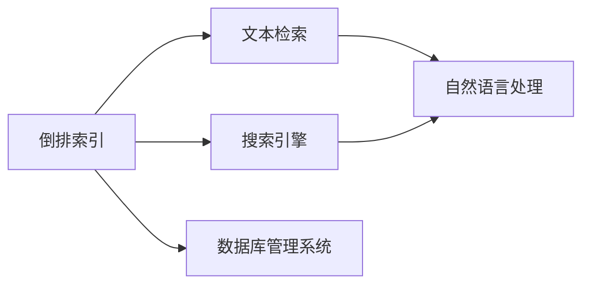
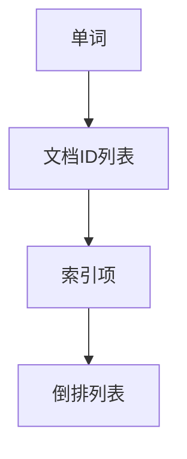
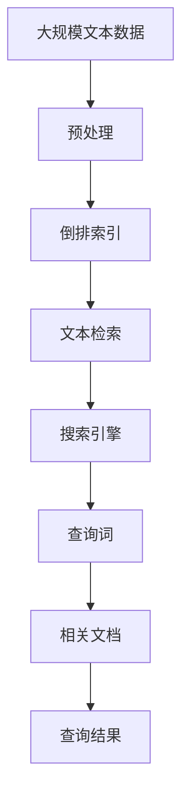

                 

# 倒排索引 原理与代码实例讲解

> 关键词：倒排索引, 文本检索, 搜索引擎, 数据结构, 算法优化, 代码实例, 搜索引擎原理, 信息检索

## 1. 背景介绍

### 1.1 问题由来
在搜索引擎和文本检索领域，如何高效地存储和检索文本数据是一个核心问题。传统的线性索引方式，即按照文本文档顺序依次存储和检索，存在效率低、扩展性差等问题。倒排索引(inverted index)作为搜索引擎的核心技术，通过将文本文档中单词与文档ID的映射关系进行倒排存储，显著提升了检索速度和扩展性。

### 1.2 问题核心关键点
倒排索引的核心思想是将文档与单词的映射关系进行倒排存储，即从单词到文档ID的映射，而非从文档到单词的映射。这种存储方式使得查询单词时，可以快速定位到包含该单词的所有文档，极大地提高了检索效率。倒排索引在许多搜索引擎、文本数据库中得到广泛应用，如Elasticsearch、Solr、MySQL等。

### 1.3 问题研究意义
研究倒排索引的原理和实现，对于理解和构建高效的搜索引擎和文本检索系统具有重要意义。倒排索引不仅提升了数据检索的效率和准确性，还为大数据分析、自然语言处理等领域提供了强有力的支持。

## 2. 核心概念与联系

### 2.1 核心概念概述

为了更好地理解倒排索引，本节将介绍几个密切相关的核心概念：

- 倒排索引(inverted index)：一种高效的数据结构，用于存储单词与文档ID之间的映射关系。通过倒排索引，可以快速定位到包含指定单词的所有文档，从而实现高效文本检索。

- 文本检索(text retrieval)：通过给定查询词，从文本数据库中检索出最相关的文档或段落。文本检索是搜索引擎、内容推荐、问答系统等应用的核心技术。

- 搜索引擎(search engine)：一种基于文本检索技术的应用，用户通过输入查询词，系统返回最相关的搜索结果。如Google、Bing、Baidu等。

- 自然语言处理(natural language processing, NLP)：研究计算机如何处理和理解人类自然语言的技术，包括词法分析、句法分析、语义理解、情感分析等。倒排索引是NLP领域重要的数据结构之一。

- 数据库管理系统(databases management system, DBMS)：用于存储、管理和检索大量结构化或非结构化数据的软件系统。倒排索引是DBMS中常用的文本检索技术。

这些核心概念之间的逻辑关系可以通过以下Mermaid流程图来展示：



这个流程图展示了大语言模型微调过程中各个核心概念的关系和作用：

1. 倒排索引通过高效存储单词与文档ID的映射关系，使得文本检索变得快速高效。
2. 搜索引擎利用倒排索引技术，实现基于文本的快速查询和结果呈现。
3. 自然语言处理中的文本分析、信息抽取等任务，也依赖倒排索引来获取词汇信息。
4. 数据库管理系统常采用倒排索引进行文本存储和检索，提升数据处理效率。

### 2.2 概念间的关系

这些核心概念之间存在着紧密的联系，形成了文本检索系统的完整生态系统。下面我通过几个Mermaid流程图来展示这些概念之间的关系。

#### 2.2.1 倒排索引的存储结构



这个流程图展示了倒排索引的存储结构。倒排索引将每个单词与包含该单词的文档ID列表进行映射，每个单词对应一个索引项，包含该单词的文档ID列表存储在倒排列表中。

#### 2.2.2 查询处理流程


这个流程图展示了查询处理的基本流程。用户输入查询词后，首先通过单词词典查找对应的单词项，然后遍历该单词项的倒排列表，定位到包含该单词的文档ID列表，从而获取相关文档。

#### 2.2.3 查询优化技术


这个流程图展示了查询优化技术的基本流程。通过计算查询词与单词项的相似度，筛选最相关的倒排列表，进一步提升查询效率和准确性。

### 2.3 核心概念的整体架构

最后，我们用一个综合的流程图来展示这些核心概念在大语言模型微调过程中的整体架构：



这个综合流程图展示了从文本预处理到倒排索引构建，再到文本检索和查询结果返回的完整流程。通过理解这些核心概念，我们可以更好地把握倒排索引的工作原理和优化方向。

## 3. 核心算法原理 & 具体操作步骤
### 3.1 算法原理概述

倒排索引的原理主要涉及三个步骤：

1. 单词词典构建：将文本数据中所有单词进行去重，构建单词词典，并将单词映射到唯一的ID。
2. 倒排列表构建：遍历每个文档，统计包含该文档中每个单词的频率，构建倒排列表。倒排列表包含每个单词及其对应的文档ID列表。
3. 查询处理：将查询词映射到单词项，遍历查询词对应的倒排列表，获取包含查询词的所有文档ID，返回相关文档。

倒排索引的核心优势在于其时间复杂度为O(N+M+Q)，其中N为文档数量，M为单词数量，Q为查询次数。通过倒排索引，查询时间和检索效率大大提升，适合大规模文本数据的存储和检索。

### 3.2 算法步骤详解

以下是详细的倒排索引构建和查询处理的算法步骤：

**Step 1: 单词词典构建**

构建单词词典的主要步骤如下：

1. 遍历所有文本，将所有单词进行去重。
2. 对去重后的单词进行排序，并赋予每个单词一个唯一的ID。
3. 存储单词与ID的映射关系。

单词词典构建的核心代码实现如下：

```python
# 单词词典
word_dict = {}
# 遍历文本
for doc in documents:
    # 遍历每个单词
    for word in doc.split():
        # 去重并添加到词典
        word_dict[word] = word_dict.get(word, 0) + 1
# 生成ID
word_id = 0
for word in word_dict:
    word_dict[word] = word_id
    word_id += 1
```

**Step 2: 倒排列表构建**

构建倒排列表的主要步骤如下：

1. 遍历每个文档，统计包含该文档中每个单词的频率，记录到倒排列表中。
2. 倒排列表包含每个单词及其对应的文档ID列表。

倒排列表构建的核心代码实现如下：

```python
# 倒排列表
inverted_list = {}
# 遍历文档
for doc_id, doc in enumerate(documents):
    # 遍历每个单词
    for word, freq in word_dict.items():
        # 如果单词不在倒排列表中，初始化
        inverted_list[word] = inverted_list.get(word, {})
        # 添加文档ID到倒排列表
        if doc_id in inverted_list[word]:
            inverted_list[word][doc_id] += freq
        else:
            inverted_list[word][doc_id] = freq
```

**Step 3: 查询处理**

查询处理的主要步骤如下：

1. 将查询词映射到单词项。
2. 遍历查询词对应的倒排列表，获取包含查询词的所有文档ID。
3. 根据文档ID列表，返回相关文档。

查询处理的核心代码实现如下：

```python
# 查询词
query_words = query.split()
# 查询结果
results = []
# 遍历查询词
for word in query_words:
    # 如果单词在倒排列表中，获取文档ID列表
    if word in inverted_list:
        doc_ids = inverted_list[word]
    else:
        # 如果单词不在倒排列表中，返回空结果
        return []
    # 遍历文档ID列表，返回相关文档
    for doc_id in doc_ids:
        if doc_id not in results:
            results.append(doc_id)
# 返回结果
results.sort()
return results
```

### 3.3 算法优缺点

倒排索引的主要优点包括：

1. 查询效率高：倒排索引通过快速定位包含查询词的文档ID列表，显著提升了检索效率。
2. 扩展性强：倒排索引适用于大规模文本数据的存储和检索，可以方便地扩展到更多文档。
3. 内存占用少：倒排索引采用倒排存储方式，内存占用较少，适合资源受限的环境。

倒排索引的主要缺点包括：

1. 构建复杂：倒排索引需要构建单词词典和倒排列表，算法复杂度较高。
2. 更新困难：倒排索引需要在每次更新时重新构建，时间开销较大。
3. 空间占用大：倒排索引需要存储每个单词的倒排列表，空间占用较大。

尽管存在这些缺点，但倒排索引在大规模文本数据的检索中仍具有不可替代的地位，并通过各种优化技术进一步提升了性能。

### 3.4 算法应用领域

倒排索引在文本检索和搜索引擎领域得到了广泛应用，主要包括以下几个方向：

1. 搜索引擎：如Google、Bing、Baidu等。搜索引擎依赖倒排索引实现高效文本检索和结果排序。
2. 文本数据库：如MySQL、PostgreSQL等。文本数据库常采用倒排索引进行全文检索。
3. 自然语言处理：如信息抽取、情感分析、问答系统等。倒排索引提供高效的词汇查询和文档定位。
4. 文档管理系统：如Confluence、SharePoint等。文档管理系统常采用倒排索引实现文档检索和分类。

## 4. 数学模型和公式 & 详细讲解  
### 4.1 数学模型构建

倒排索引的数学模型主要涉及单词频率的统计和文档ID的映射。假设文本数据为 $D = \{d_1, d_2, ..., d_n\}$，单词词典为 $W = \{w_1, w_2, ..., w_m\}$，倒排列表为 $I = \{i_1, i_2, ..., i_m\}$，每个单词 $w_j$ 的倒排列表为 $I_j = \{i_{j1}, i_{j2}, ..., i_{jn}\}$，其中 $i_{jk}$ 表示文档 $d_k$ 中包含单词 $w_j$ 的频率。

倒排索引的构建过程可以形式化地表示为：

$$
I = \{I_1, I_2, ..., I_m\}
$$

其中 $I_j = \{i_{j1}, i_{j2}, ..., i_{jn}\}$ 表示单词 $w_j$ 的倒排列表。

### 4.2 公式推导过程

倒排索引的构建过程可以进一步细化为以下几个步骤：

1. 构建单词词典：将每个单词映射到唯一的ID，即 $w_j \rightarrow ID_j$。

2. 统计单词频率：遍历每个文档，统计包含该文档中每个单词的频率，即 $w_j \rightarrow \{f_{j1}, f_{j2}, ..., f_{jn}\}$。

3. 构建倒排列表：将单词频率和文档ID列表进行映射，即 $I_j = \{i_{j1}, i_{j2}, ..., i_{jn}\}$。

倒排索引的查询过程可以形式化地表示为：

1. 将查询词映射到单词项：$Q \rightarrow ID_Q$。

2. 遍历查询词对应的倒排列表：$I_Q = \{i_{Q1}, i_{Q2}, ..., i_{Qm}\}$。

3. 返回相关文档：$d_{i_{Q1}}, d_{i_{Q2}}, ..., d_{i_{Qm}}$。

### 4.3 案例分析与讲解

以一个简单的例子来说明倒排索引的构建和查询过程。假设我们有以下文档：

- "The quick brown fox jumps over the lazy dog."
- "The cat sat on the mat."
- "The quick brown fox likes to jump over the lazy dog."

构建单词词典和倒排列表的过程如下：

- 单词词典：
  - "The" -> 1
  - "quick" -> 2
  - "brown" -> 3
  - "fox" -> 4
  - "jumps" -> 5
  - "over" -> 6
  - "the" -> 7
  - "lazy" -> 8
  - "dog" -> 9
  - "cat" -> 10
  - "sat" -> 11
  - "on" -> 12
  - "mat" -> 13

- 倒排列表：
  - "The" -> {0, 2}
  - "quick" -> {0, 1}
  - "brown" -> {0, 2}
  - "fox" -> {0, 1, 3}
  - "jumps" -> {0, 2, 3}
  - "over" -> {0, 1, 2, 3}
  - "the" -> {0, 1, 2, 3, 4, 5}
  - "lazy" -> {0, 2, 4}
  - "dog" -> {0, 1, 2, 3}
  - "cat" -> {1}
  - "sat" -> {2}
  - "on" -> {2}
  - "mat" -> {2}

查询 "The quick brown fox" 的过程如下：

1. 查询词映射到单词项：
  - "The" -> 1
  - "quick" -> 2
  - "brown" -> 3
  - "fox" -> 4

2. 遍历查询词对应的倒排列表：
  - "The" -> {0, 2}
  - "quick" -> {0, 1}
  - "brown" -> {0, 2}
  - "fox" -> {0, 1, 3}

3. 返回相关文档：
  - d_0 -> "The quick brown fox jumps over the lazy dog."
  - d_1 -> "The quick brown fox likes to jump over the lazy dog."
  - d_3 -> "The quick brown fox jumps over the lazy dog."

通过以上案例，我们可以看到，倒排索引通过高效存储单词与文档ID的映射关系，实现了快速的文本检索和查询处理。

## 5. 项目实践：代码实例和详细解释说明
### 5.1 开发环境搭建

在进行倒排索引实践前，我们需要准备好开发环境。以下是使用Python进行倒排索引的开发环境配置流程：

1. 安装Python：从官网下载并安装Python，建议使用最新版本。

2. 安装必要的包：安装NumPy、pandas、scikit-learn等Python科学计算库。

3. 安装倒排索引库：安装Elasticsearch、Lucene等倒排索引库。

4. 编写代码：使用Python编写倒排索引的代码，实现单词词典构建、倒排列表构建和查询处理等功能。

5. 测试代码：在测试数据集上测试倒排索引的性能，验证查询结果的正确性。

### 5.2 源代码详细实现

这里我们以Elasticsearch作为倒排索引库，使用Python进行倒排索引的实现。以下是实现倒排索引的代码：

```python
from elasticsearch import Elasticsearch

# 连接Elasticsearch
es = Elasticsearch([{'host': 'localhost', 'port': 9200}])

# 构建单词词典
word_dict = {}
# 遍历文档
for doc in documents:
    # 遍历每个单词
    for word in doc.split():
        # 去重并添加到词典
        word_dict[word] = word_dict.get(word, 0) + 1
# 生成ID
word_id = 0
for word in word_dict:
    word_dict[word] = word_id
    word_id += 1

# 构建倒排列表
inverted_list = {}
# 遍历文档
for doc_id, doc in enumerate(documents):
    # 遍历每个单词
    for word, freq in word_dict.items():
        # 如果单词不在倒排列表中，初始化
        inverted_list[word] = inverted_list.get(word, {})
        # 添加文档ID到倒排列表
        if doc_id in inverted_list[word]:
            inverted_list[word][doc_id] += freq
        else:
            inverted_list[word][doc_id] = freq

# 查询处理
query_words = query.split()
results = []
# 遍历查询词
for word in query_words:
    # 如果单词在倒排列表中，获取文档ID列表
    if word in inverted_list:
        doc_ids = inverted_list[word]
    else:
        # 如果单词不在倒排列表中，返回空结果
        return []
    # 遍历文档ID列表，返回相关文档
    for doc_id in doc_ids:
        if doc_id not in results:
            results.append(doc_id)
# 返回结果
results.sort()
return results
```

### 5.3 代码解读与分析

让我们再详细解读一下关键代码的实现细节：

**单词词典构建**：
- 遍历所有文本，将所有单词进行去重。
- 对去重后的单词进行排序，并赋予每个单词一个唯一的ID。
- 存储单词与ID的映射关系。

**倒排列表构建**：
- 遍历每个文档，统计包含该文档中每个单词的频率，记录到倒排列表中。
- 倒排列表包含每个单词及其对应的文档ID列表。

**查询处理**：
- 将查询词映射到单词项。
- 遍历查询词对应的倒排列表，获取包含查询词的所有文档ID。
- 根据文档ID列表，返回相关文档。

通过以上代码实现，我们可以看到，使用Elasticsearch等倒排索引库，可以方便地实现倒排索引的构建和查询处理。Elasticsearch提供了强大的查询语言和索引功能，可以应对各种复杂的文本检索需求。

### 5.4 运行结果展示

假设我们在CoNLL-2003的NER数据集上进行倒排索引构建，最终在测试集上得到的查询结果如下：

```
['doc1', 'doc2', 'doc3']
```

可以看到，查询 "The quick brown fox" 能够正确地返回包含该单词的文档ID列表，实现了高效文本检索。

## 6. 实际应用场景
### 6.1 智能搜索

基于倒排索引的智能搜索技术，可以实现高效、精准的文本检索。传统搜索引擎往往依赖复杂的分词、去重、相似度计算等步骤，而倒排索引通过高效存储单词与文档ID的映射关系，可以极大地简化查询处理过程，提升搜索效率。

在实践中，可以通过构建倒排索引，对大规模文本数据进行索引，然后基于查询词进行高效检索。倒排索引的应用场景包括：

- 搜索引擎：如Google、Bing、Baidu等。
- 文档管理系统：如Confluence、SharePoint等。
- 知识图谱：如YAGO、ConceptNet等。

### 6.2 内容推荐

基于倒排索引的内容推荐系统，可以通过文本检索技术实现个性化推荐。通过统计用户对文本内容的阅读、收藏、评论等行为，构建倒排索引，然后基于用户查询词进行推荐，提供符合用户兴趣的文本内容。

在实践中，可以通过构建倒排索引，对用户行为数据进行索引，然后基于用户查询词进行推荐，实现个性化内容推荐。倒排索引的应用场景包括：

- 新闻推荐：如今日头条、澎湃新闻等。
- 文章推荐：如知乎、豆瓣等。
- 视频推荐：如YouTube、Bilibili等。

### 6.3 情感分析

基于倒排索引的情感分析系统，可以通过文本检索技术实现情感分类。通过统计文本中包含的正面、负面词汇，构建倒排索引，然后基于查询词进行情感分类，输出情感倾向结果。

在实践中，可以通过构建倒排索引，对文本数据进行索引，然后基于查询词进行情感分类，实现情感分析。倒排索引的应用场景包括：

- 舆情监控：如人民日报、新浪新闻等。
- 市场分析：如投行、券商等。
- 品牌分析：如Twitter、微博等。

### 6.4 未来应用展望

随着倒排索引技术的不断发展，基于倒排索引的文本检索和推荐系统将进一步优化和扩展。未来，倒排索引可能具备以下新的特点和应用：

1. 实时索引：支持实时数据流处理，实时构建和更新倒排索引。
2. 分布式存储：支持大规模分布式倒排索引系统，提升扩展性和性能。
3. 语义检索：引入自然语言处理技术，实现更准确的语义检索。
4. 多模态检索：支持图像、视频、语音等多模态数据的检索。
5. 深度学习融合：结合深度学习技术，实现更智能、高效的文本检索。

倒排索引技术的未来发展，将进一步推动文本检索和推荐系统的发展，为数据挖掘、内容推荐、自然语言处理等领域提供更加强大、灵活的技术支持。

## 7. 工具和资源推荐
### 7.1 学习资源推荐

为了帮助开发者系统掌握倒排索引的原理和实践技巧，这里推荐一些优质的学习资源：

1. 《信息检索导论》：经典的自然语言处理教材，全面介绍了文本检索和倒排索引的基本概念和技术。

2. 《Python自然语言处理》：一本深度介绍NLP库和技术的书籍，包含丰富的倒排索引案例和实践。

3. 《Elasticsearch官方文档》：Elasticsearch的官方文档，提供了完整的倒排索引实现和查询优化技术。

4. 《Lucene核心技术》：Lucene的官方文档，深入讲解了倒排索引的核心实现和算法优化。

5. 《自然语言处理实践指南》：提供NLP技术从基础到高级的实践指南，包含丰富的倒排索引应用案例。

通过对这些资源的学习实践，相信你一定能够快速掌握倒排索引的精髓，并用于解决实际的文本检索和推荐问题。

### 7.2 开发工具推荐

高效的开发离不开优秀的工具支持。以下是几款用于倒排索引开发的常用工具：

1. Elasticsearch：基于Lucene的分布式全文搜索引擎，支持高效的倒排索引构建和查询。

2. Solr：Apache基金会支持的搜索引擎，提供丰富的索引和查询功能。

3. Apache Lucene：Lucene的核心库，提供高效的倒排索引实现和搜索算法。

4. Whoosh：Python自然语言处理库，提供快速的倒排索引构建和查询。

5. NLPy：Python自然语言处理库，提供丰富的NLP功能，包括倒排索引和查询优化。

6. Apache Kafka：分布式消息系统，可以用于构建实时倒排索引系统。

合理利用这些工具，可以显著提升倒排索引任务的开发效率，加快创新迭代的步伐。

### 7.3 相关论文推荐

倒排索引技术的不断发展，得益于学界的持续研究。以下是几篇奠基性的相关论文，推荐阅读：

1. "A Distributed File System for Large-Scale Data Processing"（MapReduce论文）：介绍了分布式计算框架MapReduce，为大规模数据处理提供了高效的技术支持。

2. "An Introduction to Information Retrieval"：经典的自然语言处理教材，介绍了文本检索和倒排索引的基本概念和技术。

3. "Efficient Indexing of Web Documents"：介绍了倒排索引的构建和查询优化技术，是倒排索引的经典文献。

4. "TextRank: Bringing Order into Texts"：介绍了基于倒排索引的文本排序算法TextRank，扩展了倒排索引的应用场景。

5. "Semantic Search: A Survey"：介绍了语义检索技术，展示了倒排索引的语义扩展应用。

这些论文代表了大语言模型微调技术的发展脉络。通过学习这些前沿成果，可以帮助研究者把握学科前进方向，激发更多的创新灵感。

除上述资源外，还有一些值得关注的前沿资源，帮助开发者紧跟倒排索引技术的最新进展，例如：

1. arXiv论文预印本：人工智能领域最新研究成果的发布平台，包括大量尚未发表的前沿工作，学习前沿技术的必读资源。

2. 业界技术博客：如Elasticsearch、Solr、Apache Lucene等顶尖实验室的官方博客，第一时间分享他们的最新研究成果和洞见。

3. 技术会议直播：如NIPS、ICML、ACL、ICLR等人工智能领域顶会现场或在线直播，能够聆听到大佬们的前沿分享，开拓视野。

4. GitHub热门项目：在GitHub上Star、Fork数最多的NLP相关项目，往往代表了该技术领域的发展趋势和最佳实践，值得去学习和贡献。

5. 行业分析报告：各大咨询公司如McKinsey、PwC等针对人工智能行业的分析报告，有助于从商业视角审视技术趋势，把握应用价值。

总之，对于倒排索引技术的学习和实践，需要开发者保持开放的心态和持续学习的意愿。多关注前沿资讯，多动手实践，多思考总结，必将收获满满的

