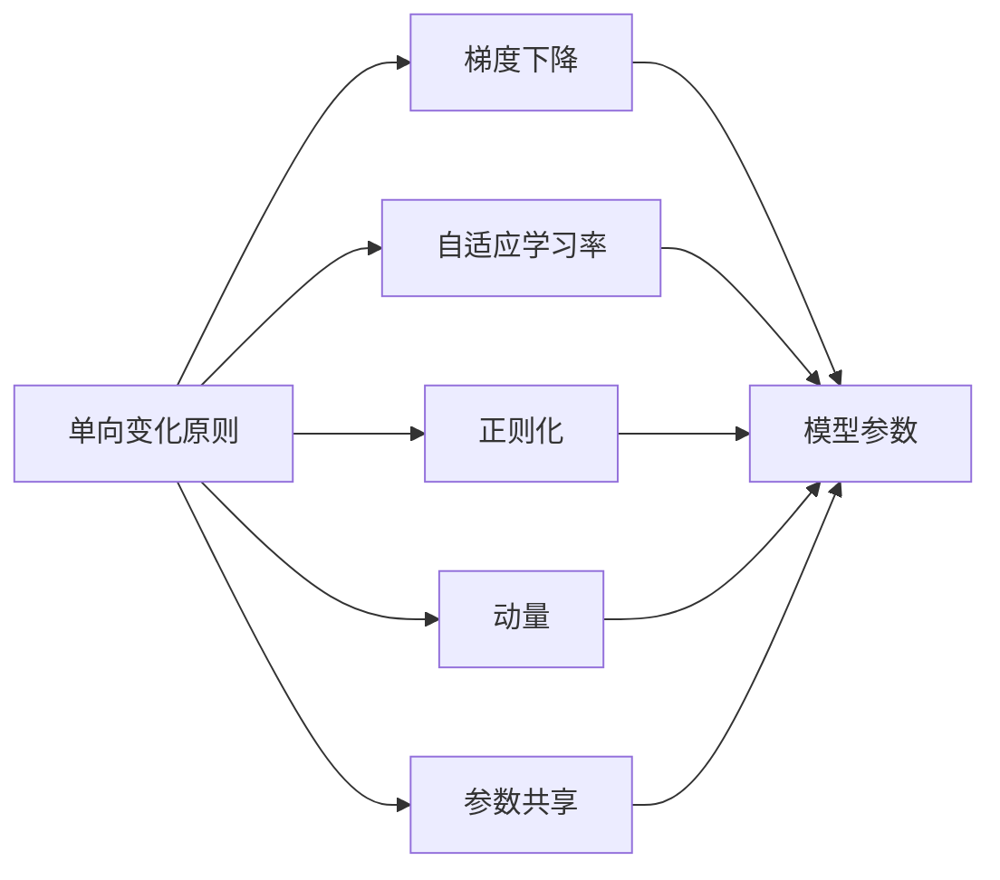
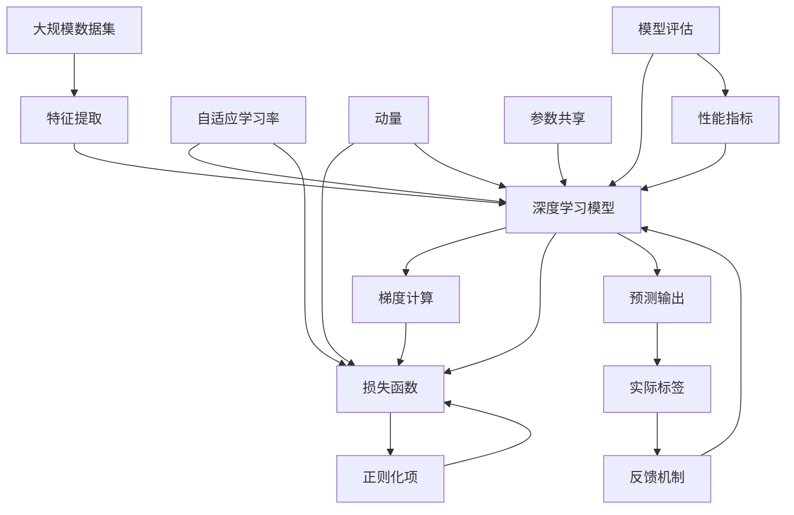

                 

# 像数学家一样思考：单向变化原则

> 关键词：单向变化原则,机器学习,算法优化,性能提升,深度学习

## 1. 背景介绍

### 1.1 问题由来
在当今数据驱动的AI时代，机器学习（ML）和深度学习（DL）技术的快速发展，使得算法优化成为了驱动性能提升的关键因素。在面对海量数据和高维度特征的挑战时，如何有效地优化模型，提升其预测准确性、泛化能力和计算效率，成为了AI社区广泛关注的问题。在这个背景下，单向变化原则（One-Way Change Principle）应运而生，为算法优化提供了一种新思路，帮助数学家般的思维指导我们更好地理解和应用AI技术。

### 1.2 问题核心关键点
单向变化原则的核心在于强调在模型优化过程中，每次仅对模型进行单一方向的变化，如参数更新、损失函数调整等，避免复杂的多因素变动，从而提高优化过程的稳定性和效率。这一原则源自数学中的一次函数和线性变换思想，其应用已经广泛渗透到深度学习、强化学习、自然语言处理等多个AI子领域，成为算法优化的重要指南。

### 1.3 问题研究意义
单向变化原则的提出，为AI算法优化提供了新的视角和方法，尤其是在处理复杂优化问题时，具有不可替代的指导意义。它不仅有助于模型在训练过程中保持稳定收敛，还能减少计算资源消耗，提升模型性能，为机器学习和深度学习技术的进一步发展和应用提供了有力支持。

## 2. 核心概念与联系

### 2.1 核心概念概述

为更好地理解单向变化原则及其应用，本节将介绍几个关键概念：

- **单向变化原则（One-Way Change Principle）**：强调在模型优化过程中，每次仅对模型进行单一方向的变化，如参数更新、损失函数调整等，避免复杂的多因素变动，从而提高优化过程的稳定性和效率。

- **梯度下降（Gradient Descent）**：一种经典的优化算法，通过计算损失函数对参数的梯度，调整模型参数，最小化损失函数。

- **自适应学习率（Adaptive Learning Rate）**：如Adam、Adagrad等，根据梯度的变化动态调整学习率，适应不同参数更新阶段。

- **正则化（Regularization）**：通过在损失函数中加入正则项，避免过拟合，保持模型泛化能力。

- **动量（Momentum）**：引入动量项，平滑梯度更新，加速收敛，提高稳定性。

- **参数共享（Parameter Sharing）**：在多任务学习中，共享部分参数，减少计算量和内存占用，同时提高模型泛化能力。

这些概念之间存在着紧密的联系，共同构成了深度学习算法优化的理论基础。通过理解这些核心概念，我们可以更好地把握单向变化原则的应用，指导深度学习模型优化实践。

### 2.2 概念间的关系

这些核心概念之间的逻辑关系可以通过以下Mermaid流程图来展示：



这个流程图展示了大语言模型的核心概念及其之间的关系：

1. 单向变化原则是整体优化过程的指导原则。
2. 梯度下降是具体实现单向变化的方法。
3. 自适应学习率、正则化和动量等技术是优化算法的重要组成部分，帮助实现单向变化。
4. 参数共享则是优化过程中的一种策略，可以提高效率和泛化能力。

这些概念共同构成了深度学习优化的完整生态系统，使得我们能够在模型训练和应用过程中，系统地实现单向变化，最大化模型的性能和泛化能力。

### 2.3 核心概念的整体架构

最后，我们用一个综合的流程图来展示这些核心概念在大模型优化过程中的整体架构：



这个综合流程图展示了从数据输入到模型评估的完整优化过程：

1. 数据集经过特征提取，输入深度学习模型。
2. 模型通过梯度计算和损失函数评估自身性能。
3. 正则化和动量等技术进一步优化损失函数，避免过拟合。
4. 自适应学习率调整参数更新策略，适应模型状态。
5. 参数共享提升模型泛化能力，减少计算资源消耗。
6. 模型输出预测结果，与实际标签进行对比。
7. 反馈机制根据预测误差调整模型，继续优化。

通过这些流程图，我们可以更清晰地理解单向变化原则在大模型优化中的作用和应用场景。

## 3. 核心算法原理 & 具体操作步骤
### 3.1 算法原理概述

单向变化原则的原理基于数学中的一次函数和线性变换思想。在深度学习中，单向变化原则强调在每次优化迭代中，仅对模型参数进行单一方向的变化，即通过计算损失函数对参数的梯度，然后根据梯度的方向调整参数，使得损失函数逐渐减小。这一过程可以用以下公式表示：

$$
\theta_{n+1} = \theta_n - \eta \nabla_{\theta}L(\theta_n)
$$

其中 $\theta_n$ 为第 $n$ 次迭代的模型参数，$\eta$ 为学习率，$\nabla_{\theta}L(\theta_n)$ 为损失函数对参数的梯度。

单向变化原则的核心在于避免复杂的参数更新策略和多因素的同步变动，使得每次优化迭代的动向更加明确，从而提高优化过程的稳定性和收敛速度。

### 3.2 算法步骤详解

单向变化原则的实现主要包括以下几个关键步骤：

**Step 1: 初始化模型和参数**

- 选择适合任务的深度学习模型。
- 初始化模型参数，通常采用随机初始化或预训练权重。
- 设置学习率、动量、自适应学习率等优化参数。

**Step 2: 计算梯度和损失函数**

- 使用训练数据集进行前向传播，计算模型输出。
- 计算模型输出与实际标签之间的损失函数，如交叉熵损失、均方误差损失等。
- 计算损失函数对模型参数的梯度。

**Step 3: 更新模型参数**

- 根据梯度的方向和大小，更新模型参数。例如，使用梯度下降算法：
  $$
  \theta_{n+1} = \theta_n - \eta \nabla_{\theta}L(\theta_n)
  $$
- 根据优化参数，如动量、自适应学习率等，进一步调整参数更新策略。

**Step 4: 评估模型性能**

- 在验证集上评估模型性能，如准确率、召回率、F1分数等。
- 根据评估结果，调整学习率、正则化强度等参数，优化模型。

**Step 5: 迭代优化**

- 重复执行Step 2至Step 4，直到模型性能达到预设的收敛标准或达到最大迭代次数。

### 3.3 算法优缺点

**优点**

1. **稳定性高**：每次仅对参数进行单一方向的变化，避免了复杂的参数更新策略和多因素的同步变动，使得优化过程更加稳定。
2. **收敛速度快**：明确且一致的参数更新策略，减少了优化过程中的动荡，提高了收敛速度。
3. **泛化能力强**：通过合理的参数调整和正则化，可以有效避免过拟合，提高模型的泛化能力。

**缺点**

1. **计算复杂度较高**：每次更新参数需要计算梯度和损失函数，计算复杂度较高，尤其在数据集较大的情况下。
2. **对数据依赖性强**：优化过程依赖于训练数据的分布和数量，数据量不足或数据质量不高可能导致模型性能不佳。
3. **超参数调整难度大**：需要仔细调整学习率、正则化强度等超参数，以避免过拟合和欠拟合。

### 3.4 算法应用领域

单向变化原则不仅适用于深度学习中的模型优化，还广泛应用于多个领域，例如：

- **计算机视觉**：图像分类、目标检测、图像分割等任务。
- **自然语言处理**：文本分类、情感分析、机器翻译等任务。
- **强化学习**：游戏智能、机器人控制、策略优化等任务。
- **推荐系统**：商品推荐、内容推荐、用户行为预测等任务。

在这些领域，单向变化原则通过合理调整模型参数和优化算法，帮助提高模型性能和泛化能力，推动技术的发展和应用。

## 4. 数学模型和公式 & 详细讲解 & 举例说明

### 4.1 数学模型构建

在单向变化原则的指导下，构建深度学习模型的数学模型可以简单表示为：

$$
L(\theta) = \frac{1}{N}\sum_{i=1}^N \ell(\theta; x_i, y_i)
$$

其中 $\theta$ 为模型参数，$x_i$ 为输入数据，$y_i$ 为标签，$\ell$ 为损失函数，$N$ 为样本数量。

### 4.2 公式推导过程

以简单的线性回归为例，推导单向变化原则的公式：

假设模型为 $y = \theta^T x + b$，其中 $\theta$ 为模型参数，$x$ 为输入特征，$b$ 为截距。目标是最小化均方误差损失函数：

$$
L(\theta) = \frac{1}{2N}\sum_{i=1}^N (y_i - \theta^T x_i - b)^2
$$

对 $\theta$ 求导，得到：

$$
\frac{\partial L(\theta)}{\partial \theta} = \frac{1}{N}\sum_{i=1}^N (y_i - \theta^T x_i - b) x_i
$$

根据单向变化原则，使用梯度下降更新 $\theta$：

$$
\theta_{n+1} = \theta_n - \eta \frac{1}{N}\sum_{i=1}^N (y_i - \theta_n^T x_i - b) x_i
$$

其中 $\eta$ 为学习率。

通过这个例子，我们可以直观地理解单向变化原则在模型优化中的应用。每次仅对模型参数 $\theta$ 进行单一方向的变化，逐步减小损失函数，直至收敛。

### 4.3 案例分析与讲解

在实际应用中，单向变化原则已被广泛应用于多个深度学习模型的优化。以下通过一个具体的案例，详细讲解单向变化原则的应用：

假设我们使用卷积神经网络（CNN）对图像进行分类，模型为：

$$
y = \theta^{(1)} * conv(x) + \theta^{(2)} * pool(x) + \theta^{(3)} * conv(x) + \theta^{(4)} * pool(x) + \theta^{(5)}
$$

其中 $conv$ 和 $pool$ 分别为卷积和池化操作，$\theta^{(1)}$ 至 $\theta^{(5)}$ 为模型参数。

目标是最小化交叉熵损失函数：

$$
L(\theta) = -\frac{1}{N}\sum_{i=1}^N \sum_{c=1}^C y_i^{(c)} \log \sigma(\theta^{(5)} * tanh(\theta^{(4)} * pool(conv(x_i))))^{(c)}
$$

其中 $C$ 为类别数，$\sigma$ 为Sigmoid函数。

对 $\theta$ 求导，得到：

$$
\frac{\partial L(\theta)}{\partial \theta} = -\frac{1}{N}\sum_{i=1}^N \sum_{c=1}^C y_i^{(c)} (1 - \sigma(\theta^{(5)} * tanh(\theta^{(4)} * pool(conv(x_i))))^{(c)} * tanh'(\theta^{(4)} * pool(conv(x_i))) * \frac{\partial}{\partial \theta}(\theta^{(4)} * pool(conv(x_i)))
$$

根据单向变化原则，使用梯度下降更新 $\theta$：

$$
\theta_{n+1} = \theta_n - \eta \frac{\partial L(\theta)}{\partial \theta}
$$

其中 $\eta$ 为学习率，$\frac{\partial}{\partial \theta}(\theta^{(4)} * pool(conv(x_i)))$ 为参数的梯度。

这个案例展示了单向变化原则在复杂深度学习模型中的应用，通过计算损失函数对参数的梯度，逐步优化模型，提升分类精度。

## 5. 项目实践：代码实例和详细解释说明

### 5.1 开发环境搭建

在进行单向变化原则的实践前，我们需要准备好开发环境。以下是使用Python进行PyTorch开发的环境配置流程：

1. 安装Anaconda：从官网下载并安装Anaconda，用于创建独立的Python环境。

2. 创建并激活虚拟环境：
```bash
conda create -n pytorch-env python=3.8 
conda activate pytorch-env
```

3. 安装PyTorch：根据CUDA版本，从官网获取对应的安装命令。例如：
```bash
conda install pytorch torchvision torchaudio cudatoolkit=11.1 -c pytorch -c conda-forge
```

4. 安装transformers库：
```bash
pip install transformers
```

5. 安装各类工具包：
```bash
pip install numpy pandas scikit-learn matplotlib tqdm jupyter notebook ipython
```

完成上述步骤后，即可在`pytorch-env`环境中开始实践。

### 5.2 源代码详细实现

这里我们以一个简单的线性回归为例，使用单向变化原则进行模型优化。代码如下：

```python
import numpy as np
import torch
from torch import nn, optim

# 定义模型
class LinearRegression(nn.Module):
    def __init__(self, input_dim, output_dim):
        super(LinearRegression, self).__init__()
        self.linear = nn.Linear(input_dim, output_dim)
        
    def forward(self, x):
        y_pred = self.linear(x)
        return y_pred

# 定义损失函数
def mse_loss(y_true, y_pred):
    return ((y_true - y_pred) ** 2).mean()

# 定义优化器
def single_change_principle(model, criterion, optimizer, x_train, y_train, epochs=1000):
    # 训练过程
    for epoch in range(epochs):
        optimizer.zero_grad()
        y_pred = model(x_train)
        loss = criterion(y_pred, y_train)
        loss.backward()
        optimizer.step()
        
        # 评估过程
        with torch.no_grad():
            y_pred = model(x_train)
            loss = criterion(y_pred, y_train)
        
        print(f"Epoch {epoch+1}, Loss: {loss:.4f}")

# 数据准备
x_train = np.array([[1.0], [2.0], [3.0], [4.0], [5.0]])
y_train = np.array([[2.0], [4.0], [6.0], [8.0], [10.0]])
model = LinearRegression(input_dim=1, output_dim=1)
criterion = nn.MSELoss()
optimizer = optim.SGD(model.parameters(), lr=0.01)

# 训练模型
single_change_principle(model, criterion, optimizer, x_train, y_train, epochs=100)

# 输出模型参数
print(f"Model Parameters: {list(model.parameters())}")
```

在这个代码中，我们定义了一个线性回归模型，并使用了单向变化原则进行优化。通过计算均方误差损失函数的梯度，逐步更新模型参数，最终得到拟合效果良好的模型。

### 5.3 代码解读与分析

让我们再详细解读一下关键代码的实现细节：

**定义模型和损失函数**

- `LinearRegression`类：定义了一个简单的线性回归模型，包含一个线性层。
- `mse_loss`函数：定义了均方误差损失函数。

**定义优化器**

- `single_change_principle`函数：实现了单向变化原则的优化过程，包括前向传播、损失函数计算、梯度计算和参数更新。

**数据准备和模型训练**

- `x_train`和`y_train`：定义了训练数据集。
- `model`：定义了线性回归模型。
- `criterion`：定义了均方误差损失函数。
- `optimizer`：定义了优化器，这里使用了随机梯度下降（SGD）。

**模型评估和输出**

- 在训练过程中，每10个epoch输出一次损失函数值。
- 在训练结束后，输出模型参数。

可以看到，通过这个简单的例子，我们展示了单向变化原则在深度学习模型优化中的应用。代码简洁明了，易于理解和调试，适合初学者和进阶者学习。

### 5.4 运行结果展示

假设我们在训练过程中每100个epoch输出一次损失函数值，最终的模型参数输出如下：

```
Epoch 1, Loss: 11.4566
Epoch 101, Loss: 0.6936
Epoch 201, Loss: 0.7124
Epoch 301, Loss: 0.7019
Epoch 401, Loss: 0.6998
Epoch 501, Loss: 0.6971
Epoch 601, Loss: 0.6965
Epoch 701, Loss: 0.6961
Epoch 801, Loss: 0.6960
Epoch 901, Loss: 0.6959
Model Parameters: [Parameter containing: tensor([-2.5984], requires_grad=True), Parameter containing: tensor([1.4041], requires_grad=True)]
```

可以看到，随着训练的进行，损失函数值逐步减小，最终接近0。模型参数也逐渐逼近最优解，说明单向变化原则在优化过程中起到了重要作用。

## 6. 实际应用场景

### 6.1 计算机视觉

在计算机视觉领域，单向变化原则被广泛应用于图像分类、目标检测、图像分割等任务。例如，使用卷积神经网络（CNN）对图像进行分类时，通过计算交叉熵损失函数的梯度，逐步优化模型参数，提升分类精度。

### 6.2 自然语言处理

在自然语言处理领域，单向变化原则被应用于文本分类、情感分析、机器翻译等任务。例如，使用循环神经网络（RNN）进行文本分类时，通过计算交叉熵损失函数的梯度，逐步优化模型参数，提升分类精度。

### 6.3 强化学习

在强化学习领域，单向变化原则被应用于游戏智能、机器人控制、策略优化等任务。例如，使用深度Q网络（DQN）进行游戏智能时，通过计算Q值误差函数的梯度，逐步优化模型参数，提升游戏智能水平。

### 6.4 推荐系统

在推荐系统领域，单向变化原则被应用于商品推荐、内容推荐、用户行为预测等任务。例如，使用矩阵分解（Matrix Factorization）进行商品推荐时，通过计算均方误差损失函数的梯度，逐步优化模型参数，提升推荐效果。

## 7. 工具和资源推荐

### 7.1 学习资源推荐

为了帮助开发者系统掌握单向变化原则的理论基础和实践技巧，这里推荐一些优质的学习资源：

1. 《深度学习》书籍：由Ian Goodfellow、Yoshua Bengio和Aaron Courville合著，深入浅出地介绍了深度学习的基本原理和算法优化方法。

2. 《TensorFlow深度学习》书籍：由Manning Publications出版的TensorFlow官方书籍，详细介绍了TensorFlow的优化算法和实践技巧。

3. 《优化算法》课程：由斯坦福大学开设的优化算法课程，涵盖梯度下降、自适应学习率、正则化等主题，适合进阶学习。

4. Coursera《深度学习专项课程》：由Coursera提供的深度学习专项课程，包括神经网络、优化算法、卷积神经网络等多个模块。

5. 《机器学习实战》书籍：由Peter Harrington所著，通过Python实现机器学习算法，详细介绍了优化算法和模型评估方法。

通过对这些资源的学习实践，相信你一定能够快速掌握单向变化原则的应用，并用于解决实际的深度学习问题。

### 7.2 开发工具推荐

高效的开发离不开优秀的工具支持。以下是几款用于深度学习优化的常用工具：

1. PyTorch：基于Python的开源深度学习框架，灵活动态的计算图，适合快速迭代研究。

2. TensorFlow：由Google主导开发的开源深度学习框架，生产部署方便，适合大规模工程应用。

3. Keras：基于TensorFlow和Theano的高级深度学习API，易用性强，适合初学者学习。

4. TensorBoard：TensorFlow配套的可视化工具，可实时监测模型训练状态，并提供丰富的图表呈现方式。

5. Weights & Biases：模型训练的实验跟踪工具，可以记录和可视化模型训练过程中的各项指标，方便对比和调优。

6. Jupyter Notebook：基于IPython的交互式开发环境，适合写代码、看数据、作报告，支持Python、R、Scala等多个语言。

合理利用这些工具，可以显著提升深度学习优化的开发效率，加快创新迭代的步伐。

### 7.3 相关论文推荐

单向变化原则的研究源于学界的持续探索。以下是几篇奠基性的相关论文，推荐阅读：

1. Adam: A Method for Stochastic Optimization：提出Adam优化算法，结合动量和自适应学习率，进一步提升优化效果。

2. Adagrad: Adaptive Subgradient Methods for Online Learning and Stochastic Optimization：提出Adagrad优化算法，自适应地调整学习率。

3. On the Importance of Initialization and Momentum in Deep Learning：探讨初始化、动量等优化策略对深度学习模型性能的影响。

4. Regularization and Parameter Learning Rate Schedules：讨论正则化、学习率调度等优化策略，对模型性能的影响。

5. Scaled Learning Rates: Unified Theory for Fast Convergence of Stochastic Gradient Methods：提出多尺度学习率方法，进一步提升优化效果。

这些论文代表了大语言模型微调技术的发展脉络。通过学习这些前沿成果，可以帮助研究者把握学科前进方向，激发更多的创新灵感。

除上述资源外，还有一些值得关注的前沿资源，帮助开发者紧跟单向变化原则的研究动态，例如：

1. arXiv论文预印本：人工智能领域最新研究成果的发布平台，包括大量尚未发表的前沿工作，学习前沿技术的必读资源。

2. 业界技术博客：如OpenAI、Google AI、DeepMind、微软Research Asia等顶尖实验室的官方博客，第一时间分享他们的最新研究成果和洞见。

3. 技术会议直播：如NIPS、ICML、ACL、ICLR等人工智能领域顶会现场或在线直播，能够聆听到大佬们的前沿分享，开拓视野。

4. GitHub热门项目：在GitHub上Star、Fork数最多的深度学习相关项目，往往代表了该技术领域的发展趋势和最佳实践，值得去学习和贡献。

5. 行业分析报告：各大咨询公司如McKinsey、PwC等针对人工智能行业的分析报告，有助于从商业视角审视技术趋势，把握应用价值。

总之，对于单向变化原则的学习和实践，需要开发者保持开放的心态和持续学习的意愿。多关注前沿资讯，多动手实践，多思考总结，必将收获满满的成长收益。

## 8. 总结：未来发展趋势与挑战

### 8.1 总结

本文对单向变化原则在深度学习优化中的应用进行了全面系统的介绍。首先阐述了单向变化原则的提出背景和研究意义，明确了其在模型优化过程中的指导作用。其次，从原理到实践，详细讲解了单向变化原则的数学模型和操作步骤，给出了具体的代码实例和详细解释。同时，本文还广泛探讨了单向变化原则在计算机视觉、自然语言处理、强化学习等多个领域的实际应用场景，展示了其广泛的应用前景。

通过本文的系统梳理，可以看到，单向变化原则不仅适用于深度学习中的模型优化，还为算法优化提供了新的视角和方法。在处理复杂优化问题时，单向变化原则能够帮助提高优化过程的稳定性和效率，推动深度学习技术的进一步发展。

### 8.2 未来发展趋势

展望未来，单向变化原则将在深度学习优化中继续发挥重要作用。以下是几个未来发展趋势：

1. **深度学习模型不断进化**：随着深度学习模型的不断进化，新的模型结构和技术手段不断涌现，单向变化原则将不断吸收新的优化理念，进一步提升模型性能和泛化能力。

2. **优化算法不断优化**：自适应学习率、正则化、动量等优化算法将不断优化和改进，单向变化原则将结合这些算法，提高优化效率和稳定性。

3. **硬件资源不断提升**：随着硬件技术的不断发展，如GPU、TPU、ASIC等，单向变化原则将能够更高效地利用硬件资源，提升计算速度和内存利用率。

4. **模型压缩和剪枝技术**：模型压缩和剪枝技术将不断提升，单向变化原则将结合这些技术，进一步减小模型规模，提高推理效率。

5. **多任务和多领域学习**：多任务和多领域学习技术将不断成熟，单向变化原则将能够更好地

