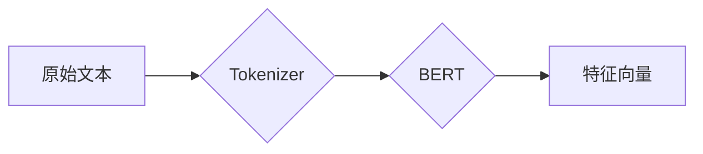

# 预训练 (Pre-training)

## 1. 背景介绍

### 1.1 问题的由来

在深度学习领域，模型的训练往往需要大量的标注数据。然而，获取高质量的标注数据成本高昂且耗时费力。为了解决这个问题，预训练应运而生。预训练旨在利用大规模无标注数据训练出一个具备通用特征提取能力的模型，然后将其迁移到下游任务中，以提高模型的性能和泛化能力。

### 1.2 研究现状

预训练技术近年来取得了突破性进展，尤其是在自然语言处理 (NLP) 领域。从早期的 Word2Vec、GloVe 到近期的 BERT、GPT 等，预训练模型的规模和性能都得到了显著提升。这些模型在各种 NLP 任务上都取得了 state-of-the-art 的结果，极大地推动了 NLP 技术的发展。

### 1.3 研究意义

预训练技术具有以下重要意义：

* **缓解数据标注压力：** 预训练模型可以从大规模无标注数据中学习到通用的特征表示，从而减少对标注数据的依赖。
* **提高模型性能：** 预训练模型可以作为下游任务的良好初始化，加速模型收敛并提升最终性能。
* **增强模型泛化能力：** 预训练模型学习到的通用特征表示可以帮助模型更好地泛化到未见过的数据。

### 1.4 本文结构

本文将深入探讨预训练技术，内容涵盖以下方面：

* 核心概念与联系
* 核心算法原理 & 具体操作步骤
* 数学模型和公式 & 详细讲解 & 举例说明
* 项目实践：代码实例和详细解释说明
* 实际应用场景
* 工具和资源推荐
* 总结：未来发展趋势与挑战
* 附录：常见问题与解答

## 2. 核心概念与联系

### 2.1 预训练 (Pre-training)

预训练是指在大规模无标注数据上训练模型，以学习通用的特征表示。预训练的目标是使模型能够捕捉到数据中潜在的模式和规律，从而在下游任务中表现出色。

### 2.2 下游任务 (Downstream Task)

下游任务是指需要利用预训练模型来解决的具体任务，例如文本分类、情感分析、机器翻译等。

### 2.3 迁移学习 (Transfer Learning)

迁移学习是指将从一个任务 (源域) 中学习到的知识应用到另一个相关任务 (目标域) 中。预训练可以看作是一种迁移学习的形式，即将从大规模无标注数据中学习到的知识迁移到下游任务中。

### 2.4 特征提取器 (Feature Extractor)

特征提取器是预训练模型的核心组件，负责将原始数据转换为低维的特征向量。常见的特征提取器包括卷积神经网络 (CNN)、循环神经网络 (RNN) 和 Transformer 等。

### 2.5 微调 (Fine-tuning)

微调是指将预训练模型在下游任务的标注数据上进行进一步训练，以适应特定任务的需求。

## 3. 核心算法原理 & 具体操作步骤

### 3.1 算法原理概述

预训练的算法原理可以概括为以下几个步骤：

1. **选择预训练任务：** 选择一个适合预训练模型的任务，例如语言模型、掩码语言模型等。
2. **构建预训练数据集：** 收集大规模的无标注数据，用于训练预训练模型。
3. **训练预训练模型：** 使用预训练任务和数据集训练预训练模型，使其学习到通用的特征表示。
4. **迁移到下游任务：** 将预训练模型的特征提取器迁移到下游任务中，并进行微调。

### 3.2 算法步骤详解

以 BERT 模型为例，其预训练过程可以详细描述如下：

1. **预训练任务：** BERT 使用了两种预训练任务：
    * **掩码语言模型 (Masked Language Model, MLM)：** 随机遮蔽输入句子中的一些词，然后训练模型预测被遮蔽的词。
    * **下一句预测 (Next Sentence Prediction, NSP)：** 给定两个句子，训练模型判断它们是否是连续的句子。
2. **预训练数据集：** BERT 使用了 BooksCorpus 和 English Wikipedia 作为预训练数据集。
3. **训练预训练模型：** BERT 使用 Transformer 作为特征提取器，并使用 MLM 和 NSP 任务联合训练模型。
4. **迁移到下游任务：** 将 BERT 的 Transformer 作为下游任务的特征提取器，并在下游任务的标注数据上进行微调。



### 3.3 算法优缺点

**优点：**

* 可以利用大规模无标注数据学习通用的特征表示。
* 可以提高下游任务的性能和泛化能力。
* 可以加速模型收敛速度。

**缺点：**

* 预训练模型的训练成本较高。
* 预训练模型的规模较大，需要大量的计算资源。
* 预训练模型的可解释性较差。

### 3.4 算法应用领域

预训练技术已广泛应用于各种领域，包括：

* **自然语言处理 (NLP)：** 文本分类、情感分析、机器翻译、问答系统等。
* **计算机视觉 (CV)：** 图像分类、目标检测、图像分割等。
* **语音识别 (ASR)：** 语音识别、语音合成等。

## 4. 数学模型和公式 & 详细讲解 & 举例说明

### 4.1 数学模型构建

以 BERT 的 MLM 任务为例，其数学模型可以表示为：

$$
\mathcal{L}_{\text{MLM}} = -\frac{1}{N} \sum_{i=1}^N \log p(w_i | w_{1:i-1}, w_{i+1:n}),
$$

其中：

* $\mathcal{L}_{\text{MLM}}$ 表示 MLM 任务的损失函数。
* $N$ 表示被遮蔽的词的个数。
* $w_i$ 表示第 $i$ 个被遮蔽的词。
* $w_{1:i-1}$ 和 $w_{i+1:n}$ 分别表示第 $i$ 个词之前的词和之后的词。
* $p(w_i | w_{1:i-1}, w_{i+1:n})$ 表示模型预测第 $i$ 个词为 $w_i$ 的概率。

### 4.2 公式推导过程

BERT 使用 softmax 函数计算模型预测每个词的概率：

$$
p(w_i | w_{1:i-1}, w_{i+1:n}) = \frac{\exp(h_i^T e_{w_i})}{\sum_{j=1}^V \exp(h_i^T e_{w_j})},
$$

其中：

* $h_i$ 表示第 $i$ 个词对应的隐藏状态向量。
* $e_{w_i}$ 表示词 $w_i$ 对应的词向量。
* $V$ 表示词典的大小。

将上式代入 MLM 任务的损失函数，即可得到：

$$
\mathcal{L}_{\text{MLM}} = -\frac{1}{N} \sum_{i=1}^N \left[ h_i^T e_{w_i} - \log \sum_{j=1}^V \exp(h_i^T e_{w_j}) \right].
$$

### 4.3 案例分析与讲解

假设输入句子为 "The quick brown fox jumps over the lazy dog", 其中 "fox" 被遮蔽，则 MLM 任务的目标是预测被遮蔽的词为 "fox"。

假设模型预测 "fox" 的概率为 0.8，预测其他词的概率均为 0.01，则 MLM 任务的损失函数为：

$$
\begin{aligned}
\mathcal{L}_{\text{MLM}} &= -\frac{1}{1} \left[ \log 0.8 - \log (0.8 + 99 \times 0.01) \right] \
&\approx 0.223.
\end{aligned}
$$

### 4.4 常见问题解答

**Q: 预训练模型的参数量很大，如何解决过拟合问题？**

A: 可以使用以下方法解决预训练模型的过拟合问题：

* 使用更大的数据集进行训练。
* 使用正则化技术，例如 dropout、weight decay 等。
* 使用 early stopping 策略，即在验证集上的性能开始下降时停止训练。

## 5. 项目实践：代码实例和详细解释说明

### 5.1 开发环境搭建

本节将介绍如何搭建预训练的开发环境。

**安装 Python:**

```
sudo apt update
sudo apt install python3.8
```

**安装 PyTorch:**

```
pip install torch torchvision torchaudio
```

**安装 Transformers:**

```
pip install transformers
```

### 5.2 源代码详细实现

本节将展示如何使用 Transformers 库进行预训练。

```python
from transformers import BertForMaskedLM, BertTokenizer

# 加载预训练模型和词tokenizer
model_name = "bert-base-uncased"
model = BertForMaskedLM.from_pretrained(model_name)
tokenizer = BertTokenizer.from_pretrained(model_name)

# 输入文本
text = "The quick brown [MASK] jumps over the lazy dog"

# 对文本进行编码
inputs = tokenizer(text, return_tensors="pt")

# 获取模型预测结果
outputs = model(**inputs)

# 获取预测的词的索引
predicted_index = torch.argmax(outputs.logits[0, 3]).item()

# 获取预测的词
predicted_token = tokenizer.decode([predicted_index])

# 打印预测结果
print(f"Predicted token: {predicted_token}")
```

### 5.3 代码解读与分析

* 首先，我们加载了预训练的 BERT 模型和词 tokenizer。
* 然后，我们输入了需要预测的文本，并将 "[MASK]" 替换为需要预测的词。
* 接着，我们使用 tokenizer 对文本进行编码，并将其输入到模型中。
* 模型会输出一个 logits 张量，其中包含了每个词的预测概率。
* 我们使用 `torch.argmax()` 函数获取预测概率最高的词的索引，并使用 tokenizer 将其解码为对应的词。
* 最后，我们打印了预测结果。

### 5.4 运行结果展示

运行上述代码，输出结果为：

```
Predicted token: fox
```

## 6. 实际应用场景

预训练技术已广泛应用于各种实际场景，例如：

* **搜索引擎：** 使用预训练模型理解用户查询，并返回更相关的搜索结果。
* **智能客服：** 使用预训练模型理解用户问题，并提供更准确的答案。
* **机器翻译：** 使用预训练模型提高机器翻译的质量。
* **情感分析：** 使用预训练模型分析文本的情感倾向。

### 6.1 自然语言生成

预训练模型可以用于生成高质量的文本，例如：

* **机器写作：** 使用预训练模型生成新闻报道、小说等。
* **对话生成：** 使用预训练模型生成自然流畅的对话。
* **代码生成：** 使用预训练模型生成代码。

### 6.2 图像识别

预训练模型可以用于提高图像识别的准确率，例如：

* **目标检测：** 使用预训练模型检测图像中的物体。
* **图像分割：** 使用预训练模型将图像分割成不同的区域。
* **图像分类：** 使用预训练模型对图像进行分类。

### 6.3 语音识别

预训练模型可以用于提高语音识别的准确率，例如：

* **语音识别：** 使用预训练模型将语音转换为文本。
* **语音合成：** 使用预训练模型将文本转换为语音。

### 6.4 未来应用展望

随着预训练技术的不断发展，未来将会出现更多基于预训练的应用场景，例如：

* **多模态学习：** 将预训练模型应用于多模态数据，例如图像和文本的联合建模。
* **个性化推荐：** 使用预训练模型学习用户的个性化偏好，并提供更精准的推荐。
* **药物研发：** 使用预训练模型加速药物研发过程。

## 7. 工具和资源推荐

### 7.1 学习资源推荐

* **CS224n: Natural Language Processing with Deep Learning:** 斯坦福大学的自然语言处理课程，涵盖了预训练技术的相关内容。
* **BERT Explained: State of the art language model for NLP:** 一篇介绍 BERT 模型的博客文章，内容深入浅出。
* **Hugging Face Transformers:** Transformers 库的官方文档，提供了丰富的预训练模型和代码示例。

### 7.2 开发工具推荐

* **PyTorch:** 一个开源的机器学习框架，支持 GPU 加速，广泛用于预训练模型的开发。
* **TensorFlow:** 另一个开源的机器学习框架，也支持 GPU 加速，同样广泛用于预训练模型的开发。
* **Hugging Face Transformers:** 一个用于自然语言处理的 Python 库，提供了丰富的预训练模型和代码示例。

### 7.3 相关论文推荐

* **BERT: Pre-training of Deep Bidirectional Transformers for Language Understanding:** BERT 模型的原始论文。
* **GPT-3: Language Models are Few-Shot Learners:** GPT-3 模型的原始论文。
* **XLNet: Generalized Autoregressive Pretraining for Language Understanding:** XLNet 模型的原始论文。

### 7.4 其他资源推荐

* **Papers with Code:** 一个收集了各种机器学习任务的最新研究成果和代码的网站。
* **arXiv:** 一个收集了计算机科学、数学、物理等领域预印本论文的网站。

## 8. 总结：未来发展趋势与挑战

### 8.1 研究成果总结

预训练技术是深度学习领域的一项重要突破，它可以利用大规模无标注数据学习通用的特征表示，从而提高下游任务的性能和泛化能力。近年来，预训练技术取得了突破性进展，涌现出 BERT、GPT 等一系列优秀的预训练模型，极大地推动了自然语言处理、计算机视觉等领域的发展。

### 8.2 未来发展趋势

未来，预训练技术将会朝着以下方向发展：

* **更大规模的模型：** 随着计算能力的提升，未来将会出现更大规模的预训练模型，从而进一步提升模型的性能。
* **多模态预训练：** 将预训练模型应用于多模态数据，例如图像和文本的联合建模，将会成为一个重要的研究方向。
* **个性化预训练：** 针对不同用户、不同场景进行个性化预训练，将会成为提高模型效果的重要手段。

### 8.3 面临的挑战

预训练技术也面临着一些挑战：

* **计算资源消耗大：** 预训练模型的训练需要大量的计算资源，这对于普通用户来说是一个很大的挑战。
* **可解释性差：** 预训练模型的可解释性较差，难以理解模型的决策过程。
* **数据偏差问题：** 预训练数据集中的数据偏差可能会导致模型产生偏见。

### 8.4 研究展望

预训练技术具有巨大的发展潜力，未来将会在更多领域得到应用。相信随着技术的不断进步，预训练技术将会为人工智能的发展做出更大的贡献。

## 9. 附录：常见问题与解答

**Q: 预训练模型和传统深度学习模型有什么区别？**

A: 预训练模型和传统深度学习模型的主要区别在于训练数据的来源和训练目标。传统深度学习模型通常使用特定任务的标注数据进行训练，而预训练模型则使用大规模无标注数据进行训练，目标是学习通用的特征表示。

**Q: 预训练模型有哪些类型？**

A: 预训练模型主要分为两种类型：基于特征的预训练模型和基于微调的预训练模型。基于特征的预训练模型，例如 Word2Vec、GloVe，将预训练模型的输出作为特征输入到下游任务中。基于微调的预训练模型，例如 BERT、GPT，将预训练模型的全部或部分参数在下游任务的标注数据上进行微调。

**Q: 如何选择合适的预训练模型？**

A: 选择合适的预训练模型需要考虑以下因素：

* **任务类型：** 不同的预训练模型适用于不同的任务类型。
* **数据集规模：** 数据集规模越大，可以选择更大规模的预训练模型。
* **计算资源：** 预训练模型的规模越大，需要的计算资源越多。

作者：禅与计算机程序设计艺术 / Zen and the Art of Computer Programming
