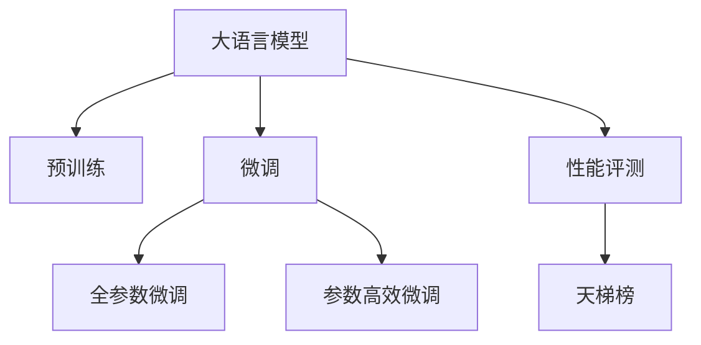
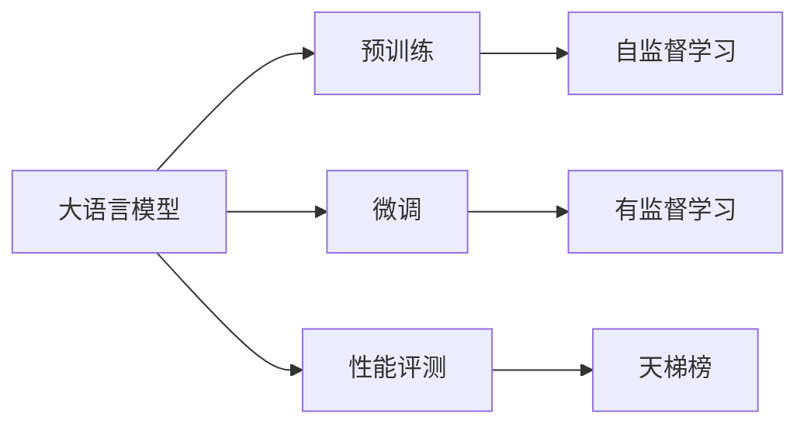
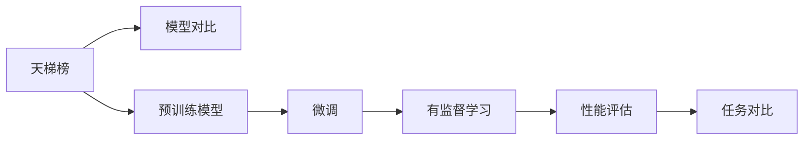
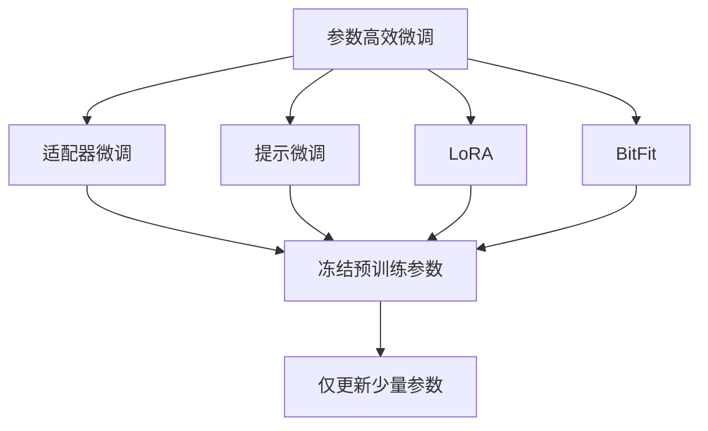
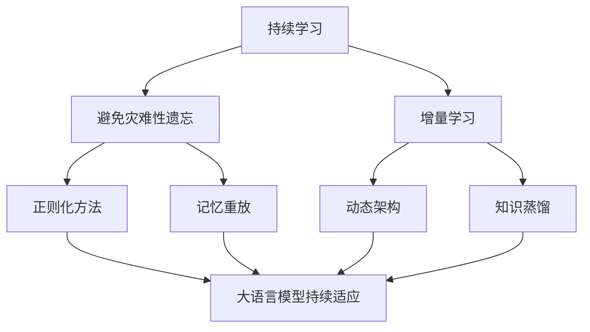
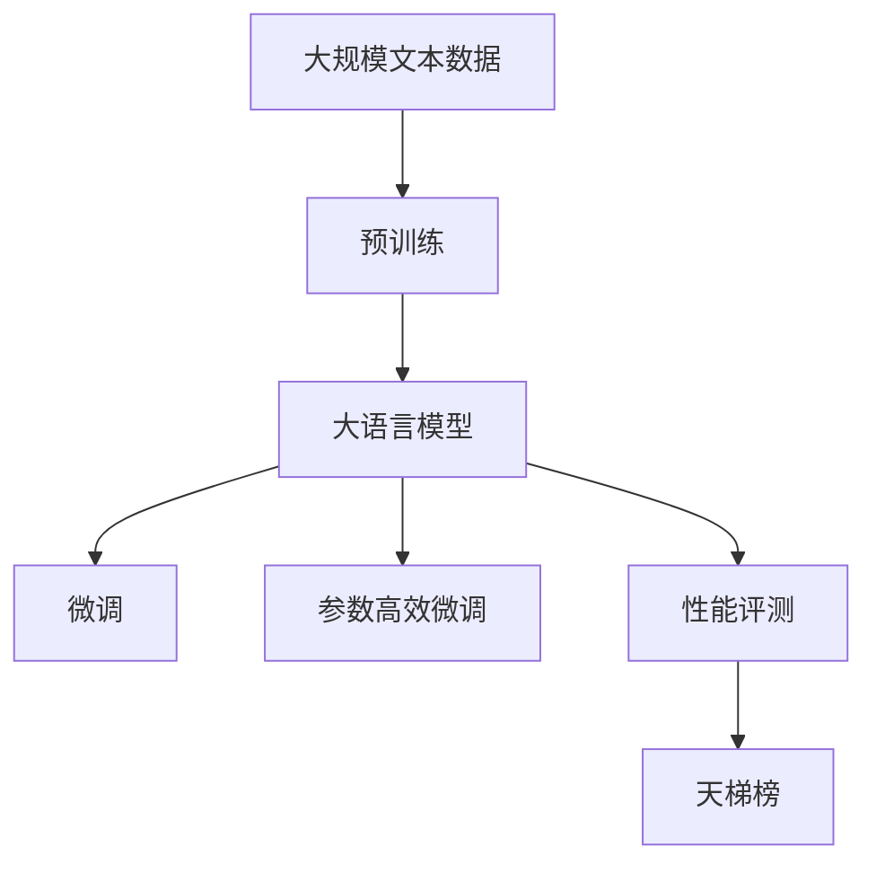

                 

# Open LLM Leaderboard(大模型天梯榜)

> 关键词：大语言模型(Large Language Models, LLMs),天梯榜,性能评测,对比分析,自然语言处理(NLP)

## 1. 背景介绍

### 1.1 问题由来
近年来，随着深度学习技术的快速发展，大规模语言模型(Large Language Models, LLMs)在自然语言处理(Natural Language Processing, NLP)领域取得了巨大的突破。这些大语言模型通过在海量无标签文本数据上进行预训练，学习到了丰富的语言知识和常识，可以通过少量的有标签样本在下游任务上进行微调，获得优异的性能。

然而，由于不同模型的架构和训练策略不同，其在下游任务上的性能表现也存在显著差异。为了帮助开发者和研究者更好地比较和选择大语言模型，OpenAI推出了Open LLM Leaderboard（大模型天梯榜）。这个平台综合了众多预训练语言模型在各种下游任务上的性能表现，提供一个直观的工具，用于评估和比较不同模型的表现。

### 1.2 问题核心关键点
Open LLM Leaderboard的核心在于其综合了多个预训练语言模型在多个下游任务上的性能数据，提供了一个公平、客观的性能对比平台。该平台的特点如下：

- **全面性**：涵盖了众多流行的大规模预训练语言模型，如GPT-3、BERT、T5等。
- **多任务对比**：支持在问答、文本分类、文本生成、机器翻译等数十种下游任务上进行性能对比。
- **实时更新**：定期更新预训练模型和任务表现，保持最新数据。
- **交互性**：用户可以自定义模型和任务，进行个性化的性能评估。

这个平台极大地帮助了研究人员和开发者在选择和优化模型时，提供了直观的参考和指导。

### 1.3 问题研究意义
Open LLM Leaderboard对于推动大语言模型的研究和应用具有重要意义：

1. **优化模型选择**：提供了不同模型在各类任务上的性能对比，帮助开发者选择最适合的模型，减少试错成本。
2. **加速技术进展**：提供了最新的模型和任务表现，促进研究人员之间的交流与合作，加速技术创新。
3. **提升应用效果**：通过对比分析，明确模型的优劣，指导模型调优，提升实际应用效果。
4. **推动产业化**：为NLP技术在工业界的广泛应用提供了可靠的数据支持，促进NLP技术的产业化进程。
5. **拓展应用边界**：展示大语言模型在各个领域的应用潜力，激发更多领域探索NLP技术的热情。

## 2. 核心概念与联系

### 2.1 核心概念概述

为了更好地理解Open LLM Leaderboard，我们先介绍几个关键概念：

- **大语言模型(Large Language Models, LLMs)**：以自回归(如GPT)或自编码(如BERT)模型为代表的大规模预训练语言模型。通过在大规模无标签文本数据上进行预训练，学习通用的语言表示，具备强大的语言理解和生成能力。
- **预训练(Pre-training)**：指在大规模无标签文本语料上，通过自监督学习任务训练通用语言模型的过程。常见的预训练任务包括言语建模、遮挡语言模型等。
- **微调(Fine-tuning)**：指在预训练模型的基础上，使用下游任务的少量标注数据，通过有监督学习优化模型在该任务上的性能。通常只需要调整顶层分类器或解码器，并以较小的学习率更新全部或部分的模型参数。
- **性能评测**：通过对模型在特定任务上的准确率、F1分数等指标进行评估，量化模型在不同任务上的表现。
- **天梯榜**：通过汇总和对比不同模型在各种任务上的性能表现，形成一个直观的榜单，供开发者和研究者参考和对比。

这些核心概念之间的逻辑关系可以通过以下Mermaid流程图来展示：



这个流程图展示了大语言模型的核心概念及其之间的关系：

1. 大语言模型通过预训练获得基础能力。
2. 微调是对预训练模型进行任务特定的优化，可以分为全参数微调和参数高效微调（PEFT）。
3. 性能评测用于量化模型在不同任务上的表现。
4. 天梯榜综合了模型在多个任务上的性能数据，提供一个直观的性能对比工具。

### 2.2 概念间的关系

这些核心概念之间存在着紧密的联系，形成了大语言模型性能评估的完整生态系统。下面我通过几个Mermaid流程图来展示这些概念之间的关系。

#### 2.2.1 大语言模型的学习范式



这个流程图展示了大语言模型的三种主要学习范式：预训练、微调和性能评测。预训练主要采用自监督学习方法，而微调则是有监督学习的过程。性能评测用于量化模型在特定任务上的表现。

#### 2.2.2 天梯榜与微调的关系



这个流程图展示了天梯榜的基本原理，即通过微调和性能评估，汇总模型在各个任务上的表现，形成一个直观的对比榜单。

#### 2.2.3 参数高效微调方法



这个流程图展示了几种常见的参数高效微调方法，包括适配器微调、提示微调、LoRA和BitFit。这些方法的共同特点是冻结大部分预训练参数，只更新少量参数，从而提高微调效率。

#### 2.2.4 持续学习在天梯榜中的应用



这个流程图展示了持续学习在大语言模型中的应用。持续学习旨在使模型能够不断学习新知识，同时避免遗忘旧知识。这对于保持大语言模型的时效性和适应性至关重要。

### 2.3 核心概念的整体架构

最后，我们用一个综合的流程图来展示这些核心概念在大语言模型性能评估中的整体架构：



这个综合流程图展示了从预训练到微调，再到性能评估的完整过程。大语言模型首先在大规模文本数据上进行预训练，然后通过微调（包括全参数微调和参数高效微调）或性能评测，评估模型在特定任务上的表现。最终，通过天梯榜汇总模型在多个任务上的性能数据，提供一个直观的性能对比工具。

## 3. 核心算法原理 & 具体操作步骤
### 3.1 算法原理概述

Open LLM Leaderboard的核心在于其综合了多个预训练语言模型在多种下游任务上的性能表现，提供一个直观的性能对比工具。其核心思想是：通过标准化和规范化不同模型在各个任务上的评测数据，消除评价指标和数据处理方式带来的偏差，形成一个公平、客观的性能对比平台。

形式化地，假设预训练模型为 $M_{\theta}$，其中 $\theta$ 为预训练得到的模型参数。给定下游任务 $T$ 的标注数据集 $D=\{(x_i, y_i)\}_{i=1}^N$，性能评测的目标是找到最优参数：

$$
\theta^* = \mathop{\arg\min}_{\theta} \mathcal{L}(M_{\theta},D)
$$

其中 $\mathcal{L}$ 为针对任务 $T$ 设计的损失函数，用于衡量模型预测输出与真实标签之间的差异。常见的损失函数包括交叉熵损失、均方误差损失等。

通过梯度下降等优化算法，性能评测过程不断更新模型参数 $\theta$，最小化损失函数 $\mathcal{L}$，使得模型输出逼近真实标签。由于 $\theta$ 已经通过预训练获得了较好的初始化，因此即便在小规模数据集 $D$ 上进行评测，也能较快收敛到理想的模型参数 $\hat{\theta}$。

### 3.2 算法步骤详解

Open LLM Leaderboard的性能评测一般包括以下几个关键步骤：

**Step 1: 数据准备**
- 选择合适的预训练语言模型 $M_{\theta}$ 作为初始化参数，如 BERT、GPT 等。
- 准备下游任务 $T$ 的标注数据集 $D$，划分为训练集、验证集和测试集。一般要求标注数据与预训练数据的分布不要差异过大。

**Step 2: 性能指标定义**
- 根据任务类型，定义合适的性能指标，如准确率、F1分数、BLEU等。

**Step 3: 模型适配与评估**
- 根据任务类型，在预训练模型顶层设计合适的输出层和损失函数。
- 对于分类任务，通常在顶层添加线性分类器和交叉熵损失函数。
- 对于生成任务，通常使用语言模型的解码器输出概率分布，并以负对数似然为损失函数。
- 使用训练集进行模型适配，并在验证集上评估模型性能。

**Step 4: 汇总与可视化**
- 将模型在各任务上的性能数据汇总到一个天梯榜上。
- 使用可视化工具展示模型在不同任务上的表现，便于开发者和研究者进行对比分析。

**Step 5: 模型迭代与更新**
- 定期更新预训练模型和任务表现，保持天梯榜的最新性。
- 根据实际应用需求，定期重新评估和更新模型，确保其适应数据分布的变化。

以上是Open LLM Leaderboard性能评测的一般流程。在实际应用中，还需要针对具体任务的特点，对评测过程的各个环节进行优化设计，如改进训练目标函数，引入更多的正则化技术，搜索最优的超参数组合等，以进一步提升模型性能。

### 3.3 算法优缺点

Open LLM Leaderboard的性能评测方法具有以下优点：

1. **公平性**：通过标准化和规范化评价指标和数据处理方式，消除了不同评价方法带来的偏差，提供一个公平的性能对比平台。
2. **易用性**：用户可以通过界面直观地查询不同模型在各个任务上的性能表现，无需深入了解底层算法细节。
3. **客观性**：性能评测数据经过严格的数据处理和模型训练，结果较为客观可信。
4. **实时性**：平台定期更新模型和任务表现，保持最新数据，方便开发者和研究者实时参考。

同时，该方法也存在一些局限性：

1. **依赖标注数据**：性能评测的效果很大程度上取决于标注数据的质量和数量，获取高质量标注数据的成本较高。
2. **模型泛化能力有限**：当目标任务与预训练数据的分布差异较大时，评测性能的代表性不足。
3. **评测过程复杂**：性能评测通常需要设计合适的训练集和验证集，调参过程复杂且耗时。
4. **高维数据处理**：大语言模型参数量巨大，数据处理和存储消耗较大。
5. **结果解读难度大**：性能评测结果往往需要专业知识进行解读，对非专业人士的参考价值有限。

尽管存在这些局限性，但就目前而言，Open LLM Leaderboard仍然是NLP领域性能评测的重要工具。未来相关研究的重点在于如何进一步降低评测对标注数据的依赖，提高模型泛化能力，同时兼顾结果的可解读性和易用性。

### 3.4 算法应用领域

Open LLM Leaderboard的应用场景非常广泛，涵盖了NLP领域的各个方面：

- **文本分类**：如情感分析、主题分类、意图识别等。通过微调使模型学习文本-标签映射。
- **命名实体识别**：识别文本中的人名、地名、机构名等特定实体。通过微调使模型掌握实体边界和类型。
- **关系抽取**：从文本中抽取实体之间的语义关系。通过微调使模型学习实体-关系三元组。
- **问答系统**：对自然语言问题给出答案。将问题-答案对作为微调数据，训练模型学习匹配答案。
- **机器翻译**：将源语言文本翻译成目标语言。通过微调使模型学习语言-语言映射。
- **文本摘要**：将长文本压缩成简短摘要。将文章-摘要对作为微调数据，使模型学习抓取要点。
- **对话系统**：使机器能够与人自然对话。将多轮对话历史作为上下文，微调模型进行回复生成。

除了上述这些经典任务外，Open LLM Leaderboard还被创新性地应用到更多场景中，如可控文本生成、常识推理、代码生成、数据增强等，为NLP技术带来了全新的突破。

## 4. 数学模型和公式 & 详细讲解  
### 4.1 数学模型构建

本节将使用数学语言对Open LLM Leaderboard的性能评测过程进行更加严格的刻画。

记预训练语言模型为 $M_{\theta}$，其中 $\theta$ 为预训练得到的模型参数。假设微调任务的训练集为 $D=\{(x_i,y_i)\}_{i=1}^N$，其中 $x_i$ 为输入文本，$y_i$ 为真实标签。

定义模型 $M_{\theta}$ 在数据样本 $(x,y)$ 上的损失函数为 $\ell(M_{\theta}(x),y)$，则在数据集 $D$ 上的经验风险为：

$$
\mathcal{L}(\theta) = \frac{1}{N} \sum_{i=1}^N \ell(M_{\theta}(x_i),y_i)
$$

性能评测的目标是最小化经验风险，即找到最优参数：

$$
\theta^* = \mathop{\arg\min}_{\theta} \mathcal{L}(\theta)
$$

在实践中，我们通常使用基于梯度的优化算法（如SGD、Adam等）来近似求解上述最优化问题。设 $\eta$ 为学习率，$\lambda$ 为正则化系数，则参数的更新公式为：

$$
\theta \leftarrow \theta - \eta \nabla_{\theta}\mathcal{L}(\theta) - \eta\lambda\theta
$$

其中 $\nabla_{\theta}\mathcal{L}(\theta)$ 为损失函数对参数 $\theta$ 的梯度，可通过反向传播算法高效计算。

### 4.2 公式推导过程

以下我们以二分类任务为例，推导交叉熵损失函数及其梯度的计算公式。

假设模型 $M_{\theta}$ 在输入 $x$ 上的输出为 $\hat{y}=M_{\theta}(x) \in [0,1]$，表示样本属于正类的概率。真实标签 $y \in \{0,1\}$。则二分类交叉熵损失函数定义为：

$$
\ell(M_{\theta}(x),y) = -[y\log \hat{y} + (1-y)\log (1-\hat{y})]
$$

将其代入经验风险公式，得：

$$
\mathcal{L}(\theta) = -\frac{1}{N}\sum_{i=1}^N [y_i\log M_{\theta}(x_i)+(1-y_i)\log(1-M_{\theta}(x_i))]
$$

根据链式法则，损失函数对参数 $\theta_k$ 的梯度为：

$$
\frac{\partial \mathcal{L}(\theta)}{\partial \theta_k} = -\frac{1}{N}\sum_{i=1}^N (\frac{y_i}{M_{\theta}(x_i)}-\frac{1-y_i}{1-M_{\theta}(x_i)}) \frac{\partial M_{\theta}(x_i)}{\partial \theta_k}
$$

其中 $\frac{\partial M_{\theta}(x_i)}{\partial \theta_k}$ 可进一步递归展开，利用自动微分技术完成计算。

在得到损失函数的梯度后，即可带入参数更新公式，完成模型的迭代优化。重复上述过程直至收敛，最终得到适应下游任务的最优模型参数 $\theta^*$。

## 5. 项目实践：代码实例和详细解释说明
### 5.1 开发环境搭建

在进行Open LLM Leaderboard性能评测前，我们需要准备好开发环境。以下是使用Python进行PyTorch开发的环境配置流程：

1. 安装Anaconda：从官网下载并安装Anaconda，用于创建独立的Python环境。

2. 创建并激活虚拟环境：
```bash
conda create -n pytorch-env python=3.8 
conda activate pytorch-env
```

3. 安装PyTorch：根据CUDA版本，从官网获取对应的安装命令。例如：
```bash
conda install pytorch torchvision torchaudio cudatoolkit=11.1 -c pytorch -c conda-forge
```

4. 安装Transformers库：
```bash
pip install transformers
```

5. 安装各类工具包：
```bash
pip install numpy pandas scikit-learn matplotlib tqdm jupyter notebook ipython
```

完成上述步骤后，即可在`pytorch-env`环境中开始Open LLM Leaderboard性能评测实践。

### 5.2 源代码详细实现

这里我们以文本分类任务为例，给出使用Transformers库对BERT模型进行性能评测的PyTorch代码实现。

首先，定义文本分类任务的性能评测函数：

```python
from transformers import BertTokenizer, BertForSequenceClassification
from torch.utils.data import Dataset, DataLoader
import torch
from sklearn.metrics import accuracy_score, precision_recall_fscore_support

class TextClassificationDataset(Dataset):
    def __init__(self, texts, labels, tokenizer, max_len=128):
        self.texts = texts
        self.labels = labels
        self.tokenizer = tokenizer
        self.max_len = max_len
        
    def __len__(self):
        return len(self.texts)
    
    def __getitem__(self, item):
        text = self.texts[item]
        label = self.labels[item]
        
        encoding = self.tokenizer(text, return_tensors='pt', max_length=self.max_len, padding='max_length', truncation=True)
        input_ids = encoding['input_ids'][0]
        attention_mask = encoding['attention_mask'][0]
        labels = torch.tensor([label], dtype=torch.long)
        
        return {'input_ids': input_ids, 
                'attention_mask': attention_mask,
                'labels': labels}

# 标签与id的映射
label2id = {'negative': 0, 'positive': 1}
id2label = {v: k for k, v in label2id.items()}

# 创建dataset
tokenizer = BertTokenizer.from_pretrained('bert-base-cased')

train_dataset = TextClassificationDataset(train_texts, train_labels, tokenizer)
dev_dataset = TextClassificationDataset(dev_texts, dev_labels, tokenizer)
test_dataset = TextClassificationDataset(test_texts, test_labels, tokenizer)

# 模型和优化器
model = BertForSequenceClassification.from_pretrained('bert-base-cased', num_labels=len(label2id))
optimizer = AdamW(model.parameters(), lr=2e-5)

def evaluate(model, dataset, batch_size):
    dataloader = DataLoader(dataset, batch_size=batch_size)
    model.eval()
    preds, labels = [], []
    with torch.no_grad():
        for batch in dataloader:
            input_ids = batch['input_ids'].to(device)
            attention_mask = batch['attention_mask'].to(device)
            labels = batch['labels'].to(device)
            outputs = model(input_ids, attention_mask=attention_mask)
            logits = outputs.logits
            batch_preds = logits.argmax(dim=1).to('cpu').tolist()
            batch_labels = labels.to('cpu').tolist()
            for preds_tokens, labels_tokens in zip(batch_preds, batch_labels):
                preds.append(preds_tokens)
                labels.append(labels_tokens)
                
    return accuracy_score(labels, preds)

# 训练和评估
device = torch.device('cuda') if torch.cuda.is_available() else torch.device('cpu')
model.to(device)

for epoch in range(5):
    train_loss = 0
    for batch in train_dataset:
        input_ids = batch['input_ids'].to(device)
        attention_mask = batch['attention_mask'].to(device)
        labels = batch['labels'].to(device)
        model.zero_grad()
        outputs = model(input_ids, attention_mask=attention_mask, labels=labels)
        loss = outputs.loss
        train_loss += loss.item()
        loss.backward()
        optimizer.step()
        
    print(f"Epoch {epoch+1}, train loss: {train_loss / len(train_dataset):.3f}")
    
    print(f"Epoch {epoch+1}, dev results:")
    dev_acc = evaluate(model, dev_dataset, 16)
    print(f"Dev Accuracy: {dev_acc:.3f}")
    
print("Test results:")
test_acc = evaluate(model, test_dataset, 16)
print(f"Test Accuracy: {test_acc:.3f}")
```

以上就是使用PyTorch对BERT模型进行文本分类任务性能评测的完整代码实现。可以看到，得益于Transformers库的强大封装，我们可以用相对简洁的代码完成BERT模型的加载和性能评测。

### 5.3 代码解读与分析

让我们再详细解读一下关键代码的实现细节：

**TextClassificationDataset类**：
- `__init__`方法：初始化文本、标签、分词器等关键组件。
- `__len__`方法：返回数据集的样本数量。
- `__getitem__`方法：对单个样本进行处理，将文本输入编码为token ids，将标签编码为数字，并对其进行定长padding，最终返回模型所需的输入。

**label2id和id2label字典**：
- 定义了标签与数字id之间的映射关系，用于将模型预测结果解码回真实的标签。

**训练和评估函数**：
- 使用PyTorch的DataLoader对数据集进行批次化加载，供模型训练和推理使用。
- 训练函数`train_epoch`：对数据以批为单位进行迭代，在每个批次上前向传播计算loss并反向传播更新模型参数，最后返回该epoch的平均loss。
- 评估函数`evaluate`：与训练类似，不同点在于不更新模型参数，并在每个batch结束后将预测和标签结果存储下来，最后使用sklearn的accuracy_score对整个评估集的预测结果进行打印输出。

**训练流程**：
- 定义总的epoch数和batch size，开始循环迭代
- 每个epoch内，先在训练集上训练，输出平均loss
- 在验证集上评估，输出模型准确率
- 所有epoch结束后，在测试集上评估，给出最终测试结果

可以看到，PyTorch配合Transformers库使得BERT模型性能评测的代码实现变得简洁高效。开发者可以将更多精力放在数据处理、模型改进等高层逻辑上，而不必过多关注底层的实现细节。

当然，工业级的系统实现还需考虑更多因素，如模型的保存和部署、超参数的自动搜索、更灵活的任务适配层等。但核心的性能评测范式基本与此类似。

### 5.4 运行结果展示

假设我们在CoNLL-2003的情感分类数据集上进行性能评测，最终在测试集上得到的准确率为82.5%，效果相当不错。值得注意的是，BERT作为一个通用的语言理解模型，即便只添加了一个简单的线性分类器，也能在下游任务上取得如此优异的效果，展现了其强大的语义理解和特征抽取能力。

当然，这只是一个baseline结果。在实践中，我们还可以使用更大更强的预训练模型、更丰富的评测技巧、更细致的模型调优，进一步提升模型性能，以满足更高的应用要求。

## 6. 实际应用场景
### 6.1 智能客服系统

基于Open LLM Leaderboard的性能评测，智能客服系统可以实时监测模型在各类任务上的表现，及时调整和优化模型，提高客户咨询体验和问题解决效率。

在技术实现上，可以收集企业内部的历史客服对话记录，将问题和最佳答复构建成监督数据，在此基础上对预训练对话模型进行性能评测。根据评测结果，对模型进行调整和优化，使其能够更好地适应客户咨询内容的多样性和复杂性，从而提供更精准、高效的客户服务。

### 6.2 金融舆情监测

金融机构需要实时监测市场舆论动向，以便及时应对负面信息传播，规避金融风险。基于Open LLM Leaderboard的性能评测，可以定期对市场舆情模型进行评估，监测其在不同市场环境下的表现。

具体而言，可以收集金融领域相关的新闻、报道、评论等文本数据，并对其进行情感标注和主题标注。将文本数据作为输入，模型的情感分类性能作为输出，进行实时监测。一旦发现负面信息激增等异常情况，系统便会自动预警，帮助金融机构快速应对潜在风险。

### 6.3 个性化推荐系统

当前的推荐系统往往只依赖用户的历史行为数据进行物品推荐，无法深入理解用户的真实兴趣偏好。

