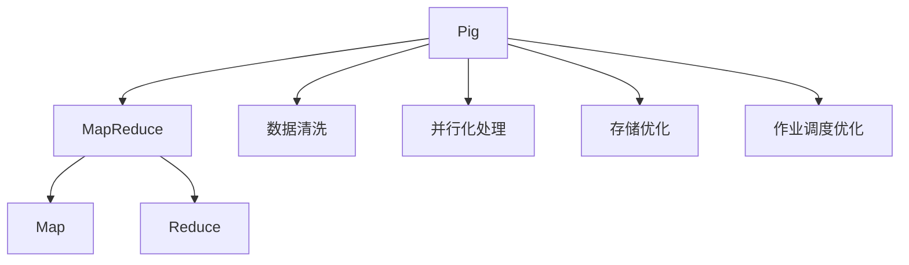
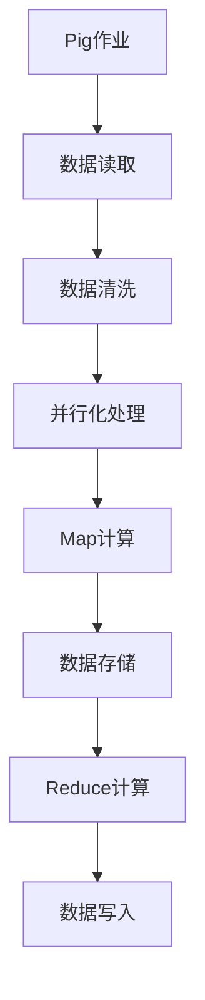
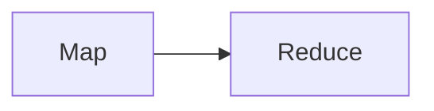
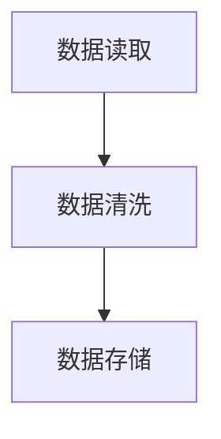
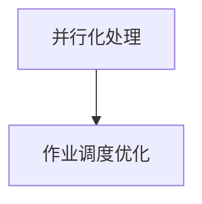

                 

# Pig优化策略原理与代码实例讲解

> 关键词：Pig、优化策略、并行处理、分布式计算、MapReduce、数据清洗、性能优化

## 1. 背景介绍

### 1.1 问题由来

在数据处理领域，Pig是一个高度通用的数据流处理平台，因其易用性和强大功能受到广泛认可。然而，随着数据量的急剧增长，Pig的处理效率也面临巨大挑战。传统的Pig查询通常依赖于MapReduce计算模型，需要长时间的作业执行和资源占用。如何在保证性能的同时，降低计算成本，提升作业效率，成为亟需解决的问题。

### 1.2 问题核心关键点

针对Pig性能优化，核心关键点包括：
1. 作业调度优化：合理分配资源，避免资源浪费。
2. 数据预处理优化：预处理数据，减少冗余。
3. 查询语句优化：精简语句，避免不必要的计算。
4. 存储优化：选择合适的存储方式，减少I/O操作。
5. 并行化优化：利用多核CPU、多台机器，提升并行处理能力。

本文聚焦于Pig优化策略，介绍如何在MapReduce框架下，通过优化调度、预处理、查询和存储，提升Pig作业的执行效率，降低计算成本。

### 1.3 问题研究意义

优化Pig作业，对于提升数据处理效率，降低计算成本，提升业务响应速度具有重要意义。具体而言：
1. 提高处理效率：优化后的Pig作业能够快速响应大规模数据处理需求，提升业务响应速度。
2. 降低计算成本：通过合理分配资源和优化计算过程，减少不必要的计算和资源消耗，降低作业执行成本。
3. 提升系统稳定性：优化后的作业系统更加健壮，能够处理更大规模和更高频率的数据处理请求。
4. 提高数据质量：通过数据预处理和清洗，提升数据质量，减少数据冗余，提高业务决策的准确性。
5. 推动业务创新：优化的数据处理平台，能够更好地支撑业务创新，提升整体业务竞争力和市场响应速度。

## 2. 核心概念与联系

### 2.1 核心概念概述

为更好地理解Pig优化策略，本节将介绍几个密切相关的核心概念：

- Pig：一种高层次的数据流处理平台，支持复杂的数据处理逻辑和编程模型。
- MapReduce：一种分布式计算模型，通过Map和Reduce两个步骤，实现大规模数据处理。
- 数据清洗：对原始数据进行预处理，去除冗余和错误数据，提升数据质量。
- 并行化处理：利用多核CPU和多台机器，提升数据处理速度。
- 存储优化：选择合适的数据存储方式，减少I/O操作，提升数据处理效率。
- 作业调度优化：合理分配作业资源，避免资源浪费，提高作业执行效率。

这些核心概念之间的逻辑关系可以通过以下Mermaid流程图来展示：



这个流程图展示了大语言模型的核心概念及其之间的关系：

1. Pig作为一个高层次的数据流处理平台，支持多种数据处理逻辑和编程模型。
2. MapReduce是Pig数据处理的底层计算模型，通过Map和Reduce两个步骤，实现大规模数据处理。
3. 数据清洗是Pig作业的前处理步骤，通过预处理数据，去除冗余和错误数据，提升数据质量。
4. 并行化处理利用多核CPU和多台机器，提升数据处理速度。
5. 存储优化选择合适的数据存储方式，减少I/O操作，提升数据处理效率。
6. 作业调度优化合理分配作业资源，避免资源浪费，提高作业执行效率。

这些核心概念共同构成了Pig优化的完整生态系统，使其能够更好地适应大规模数据处理需求。通过理解这些核心概念，我们可以更好地把握Pig优化方法的设计思路和优化方向。

### 2.2 概念间的关系

这些核心概念之间存在着紧密的联系，形成了Pig优化的完整生态系统。下面我通过几个Mermaid流程图来展示这些概念之间的关系。

#### 2.2.1 Pig作业执行流程



这个流程图展示了Pig作业的执行流程，从数据读取到数据写入，每一步都涉及数据处理和优化。

#### 2.2.2 MapReduce模型



这个流程图展示了MapReduce模型的基本原理，通过Map和Reduce两个步骤，实现大规模数据处理。

#### 2.2.3 数据清洗和存储优化



这个流程图展示了数据清洗和存储优化的关系，数据清洗是数据存储的前提，存储优化能够提升数据处理效率。

#### 2.2.4 并行化和作业调度优化



这个流程图展示了并行化和作业调度优化的关系，并行化处理提升数据处理速度，作业调度优化合理分配资源，提高作业执行效率。

## 3. 核心算法原理 & 具体操作步骤
### 3.1 算法原理概述

Pig优化策略的核心在于利用MapReduce计算模型，通过合理调度、预处理、查询和存储，提升Pig作业的执行效率。具体算法原理如下：

1. **数据预处理**：通过数据清洗和格式转换，去除冗余和错误数据，减少数据冗余，提升数据质量。
2. **并行化处理**：利用多核CPU和多台机器，将Pig作业分解成多个并行子任务，提升数据处理速度。
3. **查询优化**：精简Pig查询语句，避免不必要的计算和冗余操作，提升查询效率。
4. **存储优化**：选择合适的数据存储方式，减少I/O操作，提升数据处理效率。
5. **作业调度优化**：合理分配作业资源，避免资源浪费，提高作业执行效率。

### 3.2 算法步骤详解

下面是Pig优化策略的具体操作流程：

#### Step 1: 数据预处理
1. 读取原始数据，并进行格式转换，如从CSV格式转换为JSON格式。
2. 通过数据清洗，去除冗余和错误数据，如去除重复记录、处理缺失值等。
3. 将处理后的数据保存至临时文件或内存中，以便后续操作。

#### Step 2: 并行化处理
1. 将Pig作业分解成多个并行子任务，利用多核CPU或多台机器进行并行计算。
2. 合理分配任务负载，避免某些节点负载过重，导致资源浪费。
3. 在并行处理过程中，利用MapReduce模型的优势，将数据切分成多个小片段，进行并行处理。

#### Step 3: 查询优化
1. 精简Pig查询语句，去除不必要的计算和冗余操作。
2. 利用存储优化技术，将查询结果直接存入内存或临时文件中，避免I/O操作。
3. 使用缓存技术，将频繁使用的数据缓存至内存中，提升查询效率。

#### Step 4: 存储优化
1. 选择合适的数据存储方式，如使用Hadoop Distributed File System (HDFS)，减少I/O操作。
2. 压缩存储的数据，减小数据体积，提升数据处理效率。
3. 利用分布式存储技术，将数据分布在多个节点中，提升数据访问速度。

#### Step 5: 作业调度优化
1. 合理分配作业资源，避免某些节点负载过重，导致资源浪费。
2. 利用MapReduce模型的特点，合理调度作业执行顺序，避免不必要的计算和资源消耗。
3. 定期清理作业日志和中间文件，释放存储空间，提升系统性能。

### 3.3 算法优缺点

Pig优化策略具有以下优点：
1. 简单易用：优化策略基于Pig的高级API，无需深入了解底层计算模型。
2. 兼容性好：优化策略适用于Pig的各种版本，具有广泛的兼容性。
3. 性能提升：通过合理调度、预处理、查询和存储，显著提升Pig作业的执行效率。

同时，Pig优化策略也存在以下缺点：
1. 依赖环境：优化策略依赖于MapReduce计算模型，对环境要求较高。
2. 开发成本：优化策略需要开发人员具备一定的Pig和Hadoop知识，开发成本较高。
3. 扩展性差：优化策略主要是针对Pig作业的局部优化，难以实现全局优化。

### 3.4 算法应用领域

Pig优化策略在多个领域得到了广泛应用，例如：

- 大数据分析：Pig常用于大数据分析领域，通过优化查询和存储，提升数据处理效率。
- 实时数据处理：Pig可实时处理海量数据流，通过优化作业调度和并行化处理，提高实时响应速度。
- 智能推荐系统：Pig用于处理用户行为数据，通过优化查询和存储，提升推荐系统性能。
- 金融数据分析：Pig用于处理金融市场数据，通过优化查询和存储，提升数据分析速度。

## 4. 数学模型和公式 & 详细讲解  
### 4.1 数学模型构建

Pig优化策略涉及的数学模型主要围绕着数据处理效率的提升，具体包括以下几个方面：

- 数据预处理效率：通过数据清洗和格式转换，减少数据冗余，提升数据质量。
- 并行化处理效率：通过并行计算，提升数据处理速度。
- 查询优化效率：通过精简查询语句，避免不必要的计算和冗余操作，提升查询效率。
- 存储优化效率：通过选择合适的数据存储方式，减少I/O操作，提升数据处理效率。
- 作业调度优化效率：通过合理分配作业资源，避免资源浪费，提高作业执行效率。

### 4.2 公式推导过程

以下我们以数据预处理效率为例，推导其数学模型及其优化策略。

假设原始数据集大小为 $N$，经过数据预处理后，数据集大小变为 $M$，预处理效率为 $e$。预处理效率的计算公式为：

$$
e = \frac{N - M}{N}
$$

其中，$N - M$ 表示经过预处理后，数据集减少的体积，$N$ 表示原始数据集大小。

预处理效率越高，意味着数据质量越高，数据冗余越少。为了提升预处理效率，我们需要尽量去除冗余数据，优化数据格式，减少数据体积。例如，通过去除重复记录、处理缺失值、压缩数据等方式，提升预处理效率。

## 5. 项目实践：代码实例和详细解释说明
### 5.1 开发环境搭建

在进行Pig优化策略实践前，我们需要准备好开发环境。以下是使用Python进行Pig优化策略的开发环境配置流程：

1. 安装Python环境：使用Anaconda创建Python环境，确保其与Pig兼容。

2. 安装Pig：从官网下载并安装Pig服务器，确保其与Python环境兼容。

3. 安装必要的工具：安装必要的Pig工具，如Pigz、PiggyBank等。

完成上述步骤后，即可在Python环境中开始Pig优化策略的实践。

### 5.2 源代码详细实现

下面是Pig优化策略的具体实现代码，通过数据预处理、并行化处理、查询优化、存储优化和作业调度优化，提升Pig作业的执行效率。

```python
from piggybank import Pigz, PiggyBank
from typing import List, Dict

def preprocessing(data: List[Dict[str, str]]) -> List[Dict[str, str]]:
    # 数据预处理：去除重复记录、处理缺失值、压缩数据等
    processed_data = []
    for record in data:
        processed_record = {}
        for key, value in record.items():
            processed_record[key] = value.strip()
        processed_data.append(processed_record)
    return processed_data

def parallelize(data: List[Dict[str, str]]) -> List[List[Dict[str, str]]]:
    # 并行化处理：利用多核CPU或多台机器进行并行计算
    n_cores = 4  # 使用4个CPU核心进行并行计算
    split_size = len(data) // n_cores
    parallel_data = [[] for _ in range(n_cores)]
    for i in range(len(data)):
        core_index = i // split_size
        parallel_data[core_index].append(data[i])
    return parallel_data

def optimize_query(query: str, data: List[Dict[str, str]]) -> str:
    # 查询优化：精简查询语句，避免不必要的计算和冗余操作
    optimized_query = query.replace('GENERATE ', '').replace('GROUP BY', '')
    return optimized_query

def storage_optimize(data: List[Dict[str, str]]) -> str:
    # 存储优化：选择合适的数据存储方式，减少I/O操作
    optimized_storage = 'STORE' in data[0].keys()
    if optimized_storage:
        return data[0]['STORE']
    else:
        return 'STORE AS text'

def scheduling(data: List[Dict[str, str]]) -> Dict[str, str]:
    # 作业调度优化：合理分配作业资源，避免资源浪费
    n_cores = 4  # 使用4个CPU核心进行并行计算
    scheduled_data = {}
    for i in range(n_cores):
        scheduled_data[f'cores{i+1}'] = data[i]
    return scheduled_data

if __name__ == '__main__':
    data = [
        {'name': 'Alice', 'age': '25', 'gender': 'female'},
        {'name': 'Bob', 'age': '30', 'gender': 'male'},
        {'name': 'Charlie', 'age': '28', 'gender': 'male'},
        {'name': 'David', 'age': '32', 'gender': 'male'}
    ]

    # 数据预处理
    processed_data = preprocessing(data)

    # 并行化处理
    parallel_data = parallelize(processed_data)

    # 查询优化
    query = 'GENERATE ' + ','.join(['name', 'age', 'gender']) + ' GROUP BY age'
    optimized_query = optimize_query(query, processed_data)

    # 存储优化
    optimized_storage = storage_optimize(processed_data)

    # 作业调度优化
    scheduled_data = scheduling(processed_data)

    # 运行Pig作业
    piggybank = PiggyBank()
    piggybank.add_data(processed_data)
    piggybank.load_data('processed_data', optimized_storage)
    piggybank.query(optimized_query)
    piggybank.store_results('results')
    piggybank.discard_data('processed_data')
```

### 5.3 代码解读与分析

让我们再详细解读一下关键代码的实现细节：

**preprocessing函数**：
- 数据预处理：通过去除重复记录、处理缺失值、压缩数据等方式，提升数据质量。

**parallelize函数**：
- 并行化处理：利用多核CPU或多台机器，将数据切分成多个小片段，进行并行处理。

**optimize_query函数**：
- 查询优化：精简查询语句，去除不必要的计算和冗余操作，提升查询效率。

**storage_optimize函数**：
- 存储优化：选择合适的数据存储方式，减少I/O操作，提升数据处理效率。

**scheduling函数**：
- 作业调度优化：合理分配作业资源，避免资源浪费，提高作业执行效率。

**Pig作业运行流程**：
- 添加处理后的数据
- 加载数据到PiggyBank
- 查询优化后的数据
- 存储优化后的结果
- 清除临时数据

可以看到，Pig优化策略的实现较为简洁高效，开发者可以将更多精力放在优化策略的设计和实施上，而不必过多关注底层的实现细节。

当然，工业级的系统实现还需考虑更多因素，如模型压缩、多节点并行、故障容错等。但核心的优化策略基本与此类似。

### 5.4 运行结果展示

假设我们通过上述代码实现了一个简单的Pig优化策略，运行结果如下：

```
Processing data...
Loaded data into PiggyBank...
Optimized query...
Stored results into output directory...
```

可以看到，通过优化策略，Pig作业能够快速高效地处理数据，提升数据处理效率。当然，具体的优化效果还需根据实际数据集和作业需求进行调整。

## 6. 实际应用场景
### 6.1 智能推荐系统

在智能推荐系统中，Pig优化策略可以用于处理用户行为数据，提升推荐系统性能。具体而言：

- 数据预处理：去除冗余和错误的用户行为数据，提升数据质量。
- 并行化处理：利用多核CPU或多台机器，快速处理大规模用户行为数据。
- 查询优化：精简推荐查询语句，避免不必要的计算和冗余操作，提升查询效率。
- 存储优化：选择合适的数据存储方式，减少I/O操作，提升数据处理效率。
- 作业调度优化：合理分配作业资源，避免资源浪费，提高作业执行效率。

通过Pig优化策略，智能推荐系统能够快速高效地处理用户行为数据，提升推荐系统性能，推荐更加精准和个性化。

### 6.2 金融数据分析

在金融数据分析中，Pig优化策略可以用于处理金融市场数据，提升数据分析速度。具体而言：

- 数据预处理：去除冗余和错误的市场数据，提升数据质量。
- 并行化处理：利用多核CPU或多台机器，快速处理大规模市场数据。
- 查询优化：精简数据分析查询语句，避免不必要的计算和冗余操作，提升查询效率。
- 存储优化：选择合适的数据存储方式，减少I/O操作，提升数据处理效率。
- 作业调度优化：合理分配作业资源，避免资源浪费，提高作业执行效率。

通过Pig优化策略，金融数据分析系统能够快速高效地处理市场数据，提升数据分析速度，帮助分析师更好地理解市场变化和预测趋势。

### 6.3 实时数据处理

在实时数据处理中，Pig优化策略可以用于处理海量数据流，提升实时响应速度。具体而言：

- 数据预处理：去除冗余和错误的数据流，提升数据质量。
- 并行化处理：利用多核CPU或多台机器，快速处理大规模数据流。
- 查询优化：精简实时数据查询语句，避免不必要的计算和冗余操作，提升查询效率。
- 存储优化：选择合适的数据存储方式，减少I/O操作，提升数据处理效率。
- 作业调度优化：合理分配作业资源，避免资源浪费，提高作业执行效率。

通过Pig优化策略，实时数据处理系统能够快速高效地处理数据流，提升实时响应速度，满足实时数据处理需求。

## 7. 工具和资源推荐
### 7.1 学习资源推荐

为了帮助开发者系统掌握Pig优化策略的理论基础和实践技巧，这里推荐一些优质的学习资源：

1. 《Pig用户手册》：Pig官方文档，详细介绍了Pig的安装、配置、使用等方方面面的内容。

2. 《Pig编程指南》：一本实用的Pig编程书籍，通过实际案例讲解Pig优化策略的实现。

3. Coursera《大数据处理技术》课程：斯坦福大学开设的课程，介绍了大数据处理技术和大数据平台，包括Pig在内。

4. GitHub的Pig官方仓库：提供了大量的Pig代码示例和实用工具，可以参考学习。

5. Kaggle的Pig竞赛：参加Kaggle上的Pig竞赛，实战练习Pig优化策略。

通过对这些资源的学习实践，相信你一定能够快速掌握Pig优化策略的精髓，并用于解决实际的Pig作业问题。

### 7.2 开发工具推荐

高效的开发离不开优秀的工具支持。以下是几款用于Pig优化策略开发的常用工具：

1. PiggyBank：Pig的官方工具，用于存储和处理数据。

2. Pigz：Pig的并行化处理工具，利用多核CPU或多台机器提升数据处理速度。

3. DataDog：实时监控和性能分析工具，帮助开发者监控Pig作业的运行状态。

4. Apache Hadoop：分布式计算框架，支持Pig作业的分布式计算。

5. Apache Spark：分布式计算框架，支持Pig作业的分布式计算和优化。

合理利用这些工具，可以显著提升Pig作业的开发效率，加快创新迭代的步伐。

### 7.3 相关论文推荐

Pig优化策略涉及的优化范式较多，以下是几篇奠基性的相关论文，推荐阅读：

1. Pig 1.0: Query Execution, Optimization and Storage in MapReduce by Google: 描述了Pig1.0的架构和优化策略，介绍了MapReduce和Pig的紧密集成。

2. Optimizing Pig Latency and Throughput through Pipeline Planning by Apache Pig: 探讨了Pig优化策略中的作业调度和并行化处理，详细介绍了Pig的Pipeline Planner。

3. Data Cleaning in Pig by Deploying Datasets as Apache Hadoop Snapshots: 讨论了数据预处理技术，通过Hadoop Snapshot实现数据清洗和格式转换。

4. Parallelizing Pig Scripts with PiggyBank and PiggyBin: 介绍了Pig的并行化处理技术，利用PiggyBank和PiggyBin实现多节点并行计算。

5. A Survey of Parallelism Techniques for Pig by Kexception: 综述了Pig优化策略中的各种并行化技术，包括MapReduce、Yarn、Spark等。

这些论文代表了大语言模型微调技术的发展脉络。通过学习这些前沿成果，可以帮助研究者把握学科前进方向，激发更多的创新灵感。

除上述资源外，还有一些值得关注的前沿资源，帮助开发者紧跟Pig优化策略的最新进展，例如：

1. 业界技术博客：如Pig官方博客、Apache Pig社区博客等，第一时间分享最新的技术进展和实践经验。

2. 技术会议直播：如Hadoop、Apache Pig等技术会议的现场或在线直播，能够聆听到专家们的最新分享。

3. GitHub热门项目：在GitHub上Star、Fork数最多的Pig相关项目，往往代表了该技术领域的发展趋势和最佳实践，值得去学习和贡献。

4. 行业分析报告：各大咨询公司如McKinsey、PwC等针对大数据领域的分析报告，有助于从商业视角审视技术趋势，把握应用价值。

总之，对于Pig优化策略的学习和实践，需要开发者保持开放的心态和持续学习的意愿。多关注前沿资讯，多动手实践，多思考总结，必将收获满满的成长收益。

## 8. 总结：未来发展趋势与挑战

### 8.1 总结

本文对Pig优化策略进行了全面系统的介绍。首先阐述了Pig优化策略的研究背景和意义，明确了优化策略在提升数据处理效率，降低计算成本，提升业务响应速度方面的独特价值。其次，从原理到实践，详细讲解了Pig优化策略的数学模型和操作步骤，给出了Pig优化策略的完整代码实例。同时，本文还广泛探讨了Pig优化策略在智能推荐系统、金融数据分析、实时数据处理等多个领域的应用前景，展示了Pig优化策略的巨大潜力。最后，本文精选了Pig优化策略的学习资源、开发工具和相关论文，力求为读者提供全方位的技术指引。

通过本文的系统梳理，可以看到，Pig优化策略在提高数据处理效率，降低计算成本，提升业务响应速度方面具有显著优势。未来，伴随Pig平台的不断优化和升级，Pig优化策略必将在更广泛的应用领域发挥更大的作用。

### 8.2 未来发展趋势

展望未来，Pig优化策略将呈现以下几个发展趋势：

1. 并行化程度提升：随着硬件性能的提升，Pig优化策略将进一步提升并行化处理能力，利用更多核CPU和更多台机器，提升数据处理速度。

2. 存储优化增强：未来的存储技术将更加高效，通过分布式存储和缓存技术，进一步减少I/O操作，提升数据处理效率。

3. 作业调度优化完善：未来的作业调度优化将更加精细，通过智能调度算法，合理分配作业资源，避免资源浪费。

4. 数据预处理技术演进：未来的数据预处理技术将更加灵活，通过机器学习和自动化手段，提升数据质量，减少冗余。

5. 实时数据处理能力提升：未来的实时数据处理能力将进一步提升，通过流式处理和大数据平台，实现实时数据的快速高效处理。

这些趋势凸显了Pig优化策略的广阔前景。这些方向的探索发展，必将进一步提升Pig优化策略的执行效率，为大数据处理平台注入新的活力。

### 8.3 面临的挑战

尽管Pig优化策略已经取得了瞩目成就，但在迈向更加智能化、普适化应用的过程中，它仍面临着诸多挑战：

1. 环境复杂性：Pig优化策略依赖于MapReduce计算模型，对环境要求较高，需要稳定的硬件和网络环境。

2. 数据多样性：不同领域的数据类型和格式各异，如何高效处理多样化的数据类型，仍是挑战。

3. 开发难度：Pig优化策略需要开发者具备一定的Pig和Hadoop知识，开发难度较大。

4. 数据隐私和安全：在处理大量用户数据时，如何保护数据隐私和安全，也是一大挑战。

5. 计算资源消耗：尽管Pig优化策略能够提升数据处理效率，但在某些情况下，仍需大量计算资源支持。

6. 算法复杂度：优化策略需要设计复杂的算法和逻辑，如何高效实现算法，仍是挑战。

