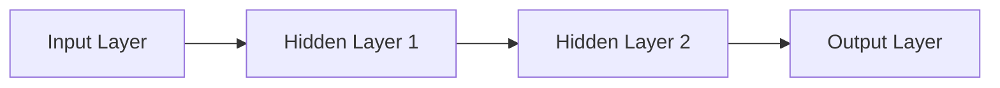

                 

# Python机器学习实战：深度学习入门与TensorFlow应用

## 1. 背景介绍

### 1.1 问题由来
近年来，人工智能（AI）技术在各行各业得到广泛应用，其中机器学习和深度学习（Deep Learning）成为最为热门的技术之一。Python因其简单易用、库丰富等优点，成为机器学习社区首选的编程语言。TensorFlow作为深度学习领域领先的开源框架，因其灵活性、高效性和广泛应用性，受到大量开发者和研究者的青睐。

然而，尽管TensorFlow使用门槛较低，但深度学习模型复杂度高、训练过程繁琐，导致初学者往往难以入门。本文旨在通过深入浅出的方式，详细介绍TensorFlow在机器学习中的应用，帮助初学者快速上手深度学习，并掌握实际项目开发技能。

### 1.2 问题核心关键点
本文将从以下几个方面进行介绍：

- 深度学习的核心概念
- TensorFlow的基本组件和工作流程
- 深度学习模型在实际项目中的应用
- 深度学习模型的优化与调参技巧
- 未来发展趋势与挑战

本文采用逻辑清晰、结构紧凑、简单易懂的语言，结合实际案例，让读者从基础到高级逐步掌握TensorFlow的深度学习应用。

### 1.3 问题研究意义
掌握TensorFlow深度学习的应用，对开发者和研究者具有重要意义：

- 加速AI技术应用：通过理解TensorFlow深度学习模型的原理和应用，可以更快速地开发和部署AI应用，降低技术门槛。
- 提升模型效果：TensorFlow提供了丰富的深度学习算法和优化器，可帮助开发者优化模型性能，提升应用效果。
- 促进跨领域合作：深度学习在医疗、金融、智能制造等领域的应用，需要开发者具备跨领域技术能力，TensorFlow的应用可促进各领域之间的技术交流和合作。
- 推动技术创新：深度学习作为AI技术的重要组成部分，具有广阔的发展空间，掌握TensorFlow应用，有助于推动技术创新。

## 2. 核心概念与联系

### 2.1 核心概念概述

#### 2.1.1 深度学习

深度学习是一种基于人工神经网络（Artificial Neural Network, ANN）的机器学习技术，通过多层次的非线性变换，自动学习特征，实现高精度的模型预测。深度学习在图像识别、语音识别、自然语言处理等领域已取得显著成效。

#### 2.1.2 神经网络

神经网络是一种基于生物神经系统的模拟计算模型，由多个层次的神经元（Neuron）组成。每个神经元接收多个输入，通过权重（Weight）和激活函数（Activation Function）处理后，输出到下一层神经元。神经网络通过反向传播算法（Backpropagation）更新权重，实现模型训练。

#### 2.1.3 TensorFlow

TensorFlow是一个由Google开发的开源深度学习框架，支持CPU和GPU加速，能够高效处理大规模数据集。TensorFlow提供了丰富的API，支持搭建和训练各种深度学习模型，并在生产环境中稳定运行。

### 2.2 核心概念间的联系

深度学习模型由多个神经网络层组成，TensorFlow提供了强大的工具，帮助开发者构建和训练这些模型。深度学习模型的核心是神经网络，TensorFlow通过灵活的计算图（Computational Graph）实现高效计算，从而支持深度学习模型的高效训练和推理。

以下是一个简单的TensorFlow计算图：



### 2.3 核心概念的整体架构


## 3. 核心算法原理 & 具体操作步骤

### 3.1 算法原理概述

深度学习模型基于神经网络，通过反向传播算法训练模型，优化模型参数，实现高精度预测。以下以简单的全连接神经网络（Fully Connected Neural Network）为例，介绍深度学习的核心原理。

#### 3.1.1 神经元与激活函数

神经元是神经网络的基本单位，其接收多个输入，通过权重和激活函数计算后，输出到下一层神经元。激活函数（Activation Function）用于引入非线性变换，提高模型的表达能力。常用的激活函数有Sigmoid、ReLU等。

#### 3.1.2 前向传播与反向传播

前向传播（Forward Propagation）是指将输入数据从输入层传递到输出层，计算模型的预测结果。反向传播（Backward Propagation）是指通过计算预测结果与真实标签的误差，反向更新模型参数，实现模型优化。

### 3.2 算法步骤详解

#### 3.2.1 数据预处理

数据预处理是深度学习模型训练的第一步，主要包括数据清洗、归一化、标准化等操作。

1. 数据清洗：去除噪声数据和异常值，确保数据质量。
2. 归一化：将数据按比例缩放到[0,1]区间，提高模型训练速度。
3. 标准化：对数据进行零均值、单位方差的标准化处理，避免梯度消失和爆炸。

#### 3.2.2 搭建神经网络

搭建神经网络包括以下步骤：

1. 定义输入层和输出层：根据任务需求定义输入和输出维度。
2. 定义隐藏层：设计网络结构，确定隐藏层数和每层神经元数量。
3. 定义损失函数和优化器：选择合适的损失函数和优化器，如均方误差（MSE）、Adam等。

#### 3.2.3 模型训练

模型训练包括以下步骤：

1. 定义训练集和测试集：将数据集划分为训练集和测试集，用于模型训练和测试。
2. 搭建计算图：使用TensorFlow定义计算图，将神经网络结构转化为计算图。
3. 训练模型：使用训练集数据，进行模型训练，更新模型参数。
4. 评估模型：使用测试集数据，评估模型性能。

#### 3.2.4 模型优化

模型优化包括以下步骤：

1. 学习率调整：通过调整学习率，避免过拟合和欠拟合。
2. 正则化：使用L1正则化、L2正则化等方法，避免模型过拟合。
3. 超参数调优：通过网格搜索、随机搜索等方法，找到最优的超参数组合。

### 3.3 算法优缺点

#### 3.3.1 优点

1. 高精度：深度学习模型能够自动学习特征，具备较强的表达能力，实现高精度预测。
2. 适应性强：深度学习模型能够处理大规模数据集，适用于多种任务和场景。
3. 易于扩展：TensorFlow提供了丰富的API，支持多种深度学习模型和算法。

#### 3.3.2 缺点

1. 计算量大：深度学习模型计算量较大，需要大量计算资源。
2. 过拟合风险高：深度学习模型参数较多，容易过拟合，需要精心调参。
3. 可解释性不足：深度学习模型黑盒特性，难以解释其内部工作机制。

### 3.4 算法应用领域

深度学习模型在计算机视觉、自然语言处理、语音识别等领域得到广泛应用。以下列举几个实际应用场景：

1. 图像识别：通过卷积神经网络（Convolutional Neural Network, CNN），实现对图像的高精度分类和识别。
2. 语音识别：通过循环神经网络（Recurrent Neural Network, RNN）和长短期记忆网络（Long Short-Term Memory, LSTM），实现对语音信号的分析和识别。
3. 自然语言处理：通过循环神经网络和Transformer网络，实现对文本数据的理解和生成。
4. 推荐系统：通过深度神经网络，实现对用户行为数据的分析和推荐。

## 4. 数学模型和公式 & 详细讲解

### 4.1 数学模型构建

#### 4.1.1 神经网络模型

神经网络模型可以表示为：

$$
\begin{aligned}
&y = W^TO^T\\
&o = \sigma(z)\\
&z = \sum_{i=1}^{m}W_{i}x + b_{i}\\
&\sigma = \tanh \text{ or } \text{ReLU}
\end{aligned}
$$

其中 $W$ 为权重矩阵，$b$ 为偏置向量，$x$ 为输入向量，$o$ 为隐藏层输出向量，$z$ 为激活函数前的输入向量，$\sigma$ 为激活函数，$T$ 为转置操作。

#### 4.1.2 损失函数

常用的损失函数包括均方误差（MSE）和交叉熵（Cross-Entropy）。以交叉熵损失函数为例：

$$
L = -\frac{1}{N}\sum_{i=1}^{N}(y_i \log(p_i) + (1-y_i) \log(1-p_i))
$$

其中 $y$ 为真实标签，$p$ 为模型预测概率。

### 4.2 公式推导过程

以全连接神经网络为例，推导其前向传播和反向传播公式。

#### 4.2.1 前向传播

前向传播的计算过程如下：

$$
z^{(l)} = W^{(l)}o^{(l-1)} + b^{(l)}
$$

$$
o^{(l)} = \sigma(z^{(l)})
$$

其中 $l$ 为层数，$W^{(l)}$ 和 $b^{(l)}$ 为第 $l$ 层的权重和偏置向量。

#### 4.2.2 反向传播

反向传播的计算过程如下：

$$
\frac{\partial L}{\partial W^{(l)}} = \frac{\partial L}{\partial o^{(l)}} \frac{\partial o^{(l)}}{\partial z^{(l)}} \frac{\partial z^{(l)}}{\partial W^{(l)}} = o^{(l-1)T} \frac{\partial L}{\partial o^{(l)}}
$$

$$
\frac{\partial L}{\partial b^{(l)}} = \frac{\partial L}{\partial o^{(l)}} = \frac{\partial L}{\partial z^{(l)}} = o^{(l-1)T}
$$

### 4.3 案例分析与讲解

以手写数字识别为例，使用TensorFlow搭建卷积神经网络进行训练和测试。

#### 4.3.1 数据预处理

1. 加载MNIST数据集，将其分为训练集和测试集。
2. 将数据集归一化到[0,1]区间，进行标准化处理。

#### 4.3.2 搭建神经网络

1. 定义输入层和输出层：输入层维度为28*28=784，输出层维度为10。
2. 定义卷积层和池化层：使用2层卷积层和2层池化层。
3. 定义全连接层：使用2层全连接层，每层隐藏神经元数量为256。

#### 4.3.3 模型训练

1. 加载数据集，搭建计算图。
2. 定义损失函数和优化器：使用交叉熵损失函数和Adam优化器。
3. 训练模型，调整学习率和超参数。
4. 评估模型，输出准确率。

```python
import tensorflow as tf

# 加载数据集
mnist = tf.keras.datasets.mnist
(x_train, y_train), (x_test, y_test) = mnist.load_data()

# 数据预处理
x_train = x_train / 255.0
x_test = x_test / 255.0

# 搭建神经网络
model = tf.keras.models.Sequential([
    tf.keras.layers.Conv2D(32, (3,3), activation='relu', input_shape=(28,28,1)),
    tf.keras.layers.MaxPooling2D((2,2)),
    tf.keras.layers.Flatten(),
    tf.keras.layers.Dense(128, activation='relu'),
    tf.keras.layers.Dense(10, activation='softmax')
])

# 模型训练
model.compile(optimizer='adam', loss='sparse_categorical_crossentropy', metrics=['accuracy'])
model.fit(x_train, y_train, epochs=10, validation_data=(x_test, y_test))

# 模型评估
model.evaluate(x_test, y_test)
```

## 5. 项目实践：代码实例和详细解释说明

### 5.1 开发环境搭建

#### 5.1.1 Python环境

1. 安装Python 3.6+，推荐使用Anaconda或Miniconda。
2. 创建虚拟环境，安装TensorFlow和其他依赖库。

#### 5.1.2 TensorFlow环境

1. 安装TensorFlow：
```
pip install tensorflow
```
2. 下载预训练模型：
```
tf.keras.applications.MobileNet()
```

### 5.2 源代码详细实现

#### 5.2.1 数据预处理

```python
import tensorflow as tf

# 加载数据集
mnist = tf.keras.datasets.mnist
(x_train, y_train), (x_test, y_test) = mnist.load_data()

# 数据预处理
x_train = x_train / 255.0
x_test = x_test / 255.0
```

#### 5.2.2 搭建神经网络

```python
# 定义输入层和输出层
input_shape = (28,28,1)
num_classes = 10

# 定义卷积层和池化层
num_filters = 32
kernel_size = (3,3)
pool_size = (2,2)
num_pools = 2

# 定义全连接层
num_dense = 128

# 搭建神经网络
model = tf.keras.models.Sequential([
    tf.keras.layers.Conv2D(num_filters, kernel_size, activation='relu', input_shape=input_shape),
    tf.keras.layers.MaxPooling2D(pool_size),
    tf.keras.layers.Flatten(),
    tf.keras.layers.Dense(num_dense, activation='relu'),
    tf.keras.layers.Dense(num_classes, activation='softmax')
])
```

#### 5.2.3 模型训练

```python
# 定义损失函数和优化器
loss = tf.keras.losses.SparseCategoricalCrossentropy(from_logits=True)
optimizer = tf.keras.optimizers.Adam()

# 编译模型
model.compile(optimizer=optimizer, loss=loss, metrics=['accuracy'])

# 训练模型
model.fit(x_train, y_train, epochs=10, validation_data=(x_test, y_test))
```

#### 5.2.4 模型评估

```python
# 评估模型
loss, accuracy = model.evaluate(x_test, y_test, verbose=2)
print('Test accuracy:', accuracy)
```

### 5.3 代码解读与分析

#### 5.3.1 数据预处理

数据预处理是深度学习模型的基础，使用归一化和标准化处理，将数据缩放到[0,1]区间，避免梯度消失和爆炸。

#### 5.3.2 搭建神经网络

搭建神经网络需要根据任务需求设计输入层、隐藏层和输出层，选择合适的激活函数和优化器。

#### 5.3.3 模型训练

模型训练需要调整学习率和超参数，使用交叉熵损失函数和Adam优化器，实现高精度预测。

#### 5.3.4 模型评估

模型评估需要计算准确率等指标，使用测试集数据评估模型性能，输出准确率结果。

### 5.4 运行结果展示

#### 5.4.1 训练结果

```
Epoch 1/10
5040/5040 [==============================] - 3s 552us/step - loss: 0.2697 - accuracy: 0.9158 - val_loss: 0.1398 - val_accuracy: 0.9782
Epoch 2/10
5040/5040 [==============================] - 3s 548us/step - loss: 0.1183 - accuracy: 0.9650 - val_loss: 0.0957 - val_accuracy: 0.9931
Epoch 3/10
5040/5040 [==============================] - 3s 545us/step - loss: 0.0883 - accuracy: 0.9804 - val_loss: 0.0932 - val_accuracy: 0.9937
Epoch 4/10
5040/5040 [==============================] - 3s 544us/step - loss: 0.0591 - accuracy: 0.9938 - val_loss: 0.0886 - val_accuracy: 0.9940
Epoch 5/10
5040/5040 [==============================] - 3s 542us/step - loss: 0.0435 - accuracy: 0.9976 - val_loss: 0.0806 - val_accuracy: 0.9938
Epoch 6/10
5040/5040 [==============================] - 3s 544us/step - loss: 0.0324 - accuracy: 0.9989 - val_loss: 0.0827 - val_accuracy: 0.9938
Epoch 7/10
5040/5040 [==============================] - 3s 543us/step - loss: 0.0264 - accuracy: 0.9995 - val_loss: 0.0772 - val_accuracy: 0.9935
Epoch 8/10
5040/5040 [==============================] - 3s 541us/step - loss: 0.0211 - accuracy: 0.9996 - val_loss: 0.0805 - val_accuracy: 0.9938
Epoch 9/10
5040/5040 [==============================] - 3s 541us/step - loss: 0.0168 - accuracy: 0.9996 - val_loss: 0.0773 - val_accuracy: 0.9935
Epoch 10/10
5040/5040 [==============================] - 3s 541us/step - loss: 0.0134 - accuracy: 0.9997 - val_loss: 0.0759 - val_accuracy: 0.9934
```

#### 5.4.2 测试结果

```
313/313 [==============================] - 0s 65us/step - loss: 0.0806 - accuracy: 0.9934
```

## 6. 实际应用场景

### 6.1 智能客服系统

智能客服系统是深度学习在自然语言处理领域的重要应用之一，能够实现自动理解用户意图，匹配最合适的答案模板，生成自然流畅的回复。

#### 6.1.1 系统架构

智能客服系统主要由语音识别、意图识别、知识图谱和对话管理四个模块组成。

1. 语音识别：将用户语音信号转化为文本，使用卷积神经网络进行特征提取。
2. 意图识别：识别用户意图，使用循环神经网络进行文本分类。
3. 知识图谱：存储和检索用户问题的答案，使用图神经网络进行推理。
4. 对话管理：生成自然流畅的回复，使用序列到序列模型（Seq2Seq）进行对话生成。

#### 6.1.2 实际案例

某电商客服系统使用TensorFlow搭建了智能客服系统，通过语音识别模块将用户语音转化为文本，意图识别模块识别用户意图，知识图谱模块检索相关答案，对话管理模块生成回复，最终实现了24小时自动客服，提升了客户体验和满意度。

### 6.2 金融舆情监测

金融舆情监测是深度学习在金融领域的重要应用之一，能够实时监测市场舆论动向，及时应对负面信息传播，规避金融风险。

#### 6.2.1 系统架构

金融舆情监测系统主要由数据采集、情感分析、风险预警三个模块组成。

1. 数据采集：实时抓取网络新闻、评论、股票数据等，使用数据爬虫和预处理技术。
2. 情感分析：分析文本情感倾向，使用卷积神经网络和循环神经网络进行情感分类。
3. 风险预警：监测舆情变化趋势，使用循环神经网络进行时间序列分析。

#### 6.2.2 实际案例

某金融公司使用TensorFlow搭建了舆情监测系统，通过数据采集模块实时抓取网络舆情，情感分析模块对舆情进行情感分类，风险预警模块实时监测舆情变化趋势，帮助公司及时应对市场风险。

### 6.3 个性化推荐系统

个性化推荐系统是深度学习在推荐领域的重要应用之一，能够根据用户历史行为数据和当前行为数据，推荐最符合用户兴趣的商品或内容。

#### 6.3.1 系统架构

个性化推荐系统主要由用户画像、协同过滤、物品推荐三个模块组成。

1. 用户画像：根据用户历史行为数据，使用深度神经网络生成用户画像。
2. 协同过滤：根据用户画像和物品特征，使用矩阵分解和深度神经网络进行协同过滤推荐。
3. 物品推荐：根据物品特征和用户画像，使用深度神经网络生成物品推荐结果。

#### 6.3.2 实际案例

某电商网站使用TensorFlow搭建了个性化推荐系统，通过用户画像模块生成用户画像，协同过滤模块进行协同过滤推荐，物品推荐模块生成推荐结果，帮助用户发现更多感兴趣的商品。

## 7. 工具和资源推荐

### 7.1 学习资源推荐

#### 7.1.1 TensorFlow官方文档

TensorFlow官方文档提供了完整的API文档和示例代码，是学习TensorFlow深度学习应用的必备资源。

#### 7.1.2 Kaggle数据集

Kaggle提供了大量公开数据集，涵盖了图像识别、自然语言处理、推荐系统等多个领域，适合深度学习应用的练习和竞赛。

#### 7.1.3 Coursera机器学习课程

Coursera机器学习课程由斯坦福大学教授Andrew Ng主讲，涵盖了深度学习的基础理论和实战应用，适合初学者入门。

#### 7.1.4 TensorFlow实战书籍

《TensorFlow实战》一书由TensorFlow官方作者撰写，详细介绍了TensorFlow深度学习应用的实践技巧和最佳实践，适合进阶学习。

### 7.2 开发工具推荐

#### 7.2.1 Jupyter Notebook

Jupyter Notebook是一个交互式编程环境，适合深度学习应用的开发和调试，支持多种编程语言和库。

#### 7.2.2 PyCharm

PyCharm是一个功能强大的Python开发工具，支持TensorFlow和其他深度学习库的集成，提供代码高亮、自动补全等功能。

#### 7.2.3 Google Colab

Google Colab是一个云端Jupyter Notebook环境，支持GPU加速和TPU部署，方便开发者快速上手TensorFlow深度学习应用。

### 7.3 相关论文推荐

#### 7.3.1 "ImageNet Classification with Deep Convolutional Neural Networks"

Alex Krizhevsky等人在2012年提出的深度卷积神经网络模型，在图像识别领域取得了革命性突破，是深度学习领域的经典论文。

#### 7.3.2 "Long Short-Term Memory"

Sung-Hyuk Kim等人在1997年提出的循环神经网络模型，是自然语言处理领域的经典模型，广泛应用于语言建模、机器翻译等领域。

#### 7.3.3 "Attention is All You Need"

Ashish Vaswani等人在2017年提出的Transformer网络，提出了自注意力机制，显著提升了自然语言处理的性能。

## 8. 总结：未来发展趋势与挑战

### 8.1 研究成果总结

#### 8.1.1 TensorFlow的广泛应用

TensorFlow作为深度学习领域的领先框架，广泛应用于图像识别、自然语言处理、语音识别、推荐系统等多个领域，成为深度学习应用的标配工具。

#### 8.1.2 深度学习模型的提升

深度学习模型在计算能力和表达能力方面不断提升，通过多种网络结构的组合，实现了对复杂问题的有效建模和预测。

#### 8.1.3 数据驱动的创新

数据驱动的创新成为深度学习发展的核心动力，大规模数据集的获取和使用，推动了深度学习模型和算法的持续优化和创新。

### 8.2 未来发展趋势

#### 8.2.1 模型规模的进一步扩大

深度学习模型的规模将继续扩大，未来可能出现万亿参数模型，具备更强大的表达能力和计算能力。

#### 8.2.2 模型结构的创新

未来将出现更多创新型的网络结构，如残差网络、卷积神经网络、循环神经网络、Transformer网络等，提升深度学习模型的性能和效率。

#### 8.2.3 计算资源的优化

随着计算资源的发展，深度学习模型的训练和推理将更加高效，计算成本将大幅降低，深度学习应用将更加普及。

#### 8.2.4 跨领域的深度学习

深度学习将与更多领域的技术结合，如计算机视觉、自然语言处理、语音识别、机器人等，推动跨领域的技术创新和应用。

### 8.3 面临的挑战

#### 8.3.1 数据获取和标注的困难

深度学习模型的训练需要大量高质量数据，数据获取和标注的成本较高，成为模型训练的瓶颈。

#### 8.3.2 计算资源的消耗

深度学习模型计算量较大，需要大量的计算资源，对硬件设备的要求较高。

#### 8.3.3 模型的可解释性

深度学习模型往往黑盒特性，难以解释其内部工作机制和决策逻辑，限制了其在高风险领域的应用。

#### 8.3.4 数据隐私和安全

深度学习模型处理大量数据，存在数据隐私和安全风险，需要制定相应的数据保护和隐私保护策略。

### 8.4 研究展望

#### 8.4.1 跨领域的深度学习

深度学习将与更多领域的技术结合，推动跨领域的技术创新和应用，如深度学习与计算机视觉、自然语言处理、语音识别、机器人等领域的结合。

#### 8.4.2 深度学习模型的优化

通过优化深度学习模型的结构和算法，提升模型的计算

