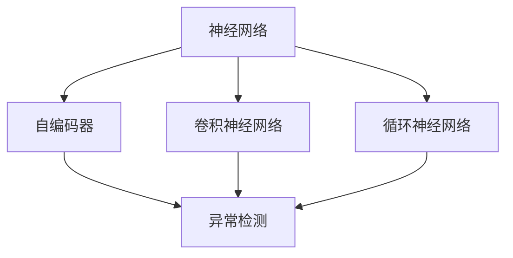
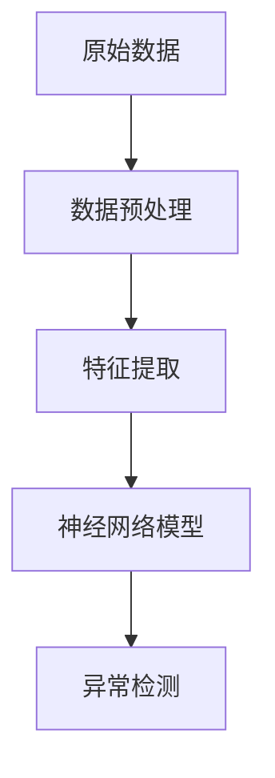
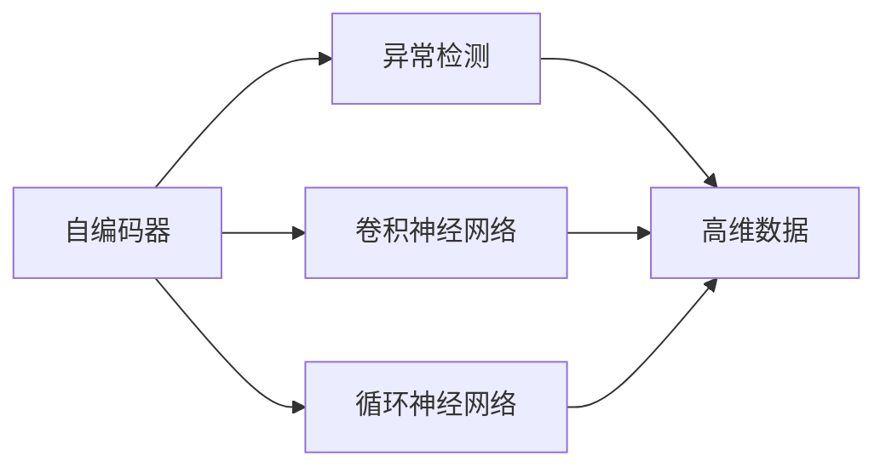
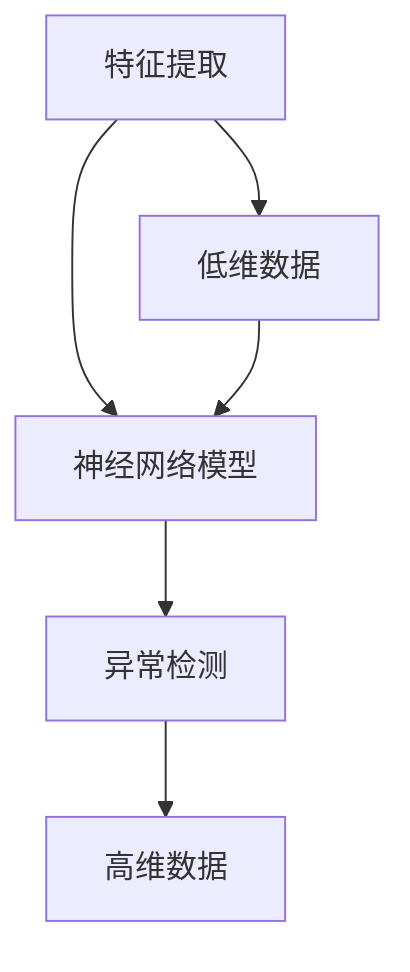
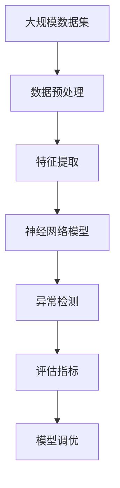

                 

# Python深度学习实践：神经网络在异常检测中的应用

> 关键词：神经网络,异常检测,深度学习,Python,机器学习

## 1. 背景介绍

### 1.1 问题由来
异常检测（Anomaly Detection），也被称为离群值检测（Outlier Detection），是数据挖掘和机器学习中的一项重要任务。其目标是从数据集中识别出那些不寻常的、异常的或罕见的数据点，这些点在数据分布中显得特别突出。在实际应用中，异常检测可以帮助发现故障、预防欺诈、监控网络安全等，具有广泛的应用前景。

近年来，深度学习技术在图像、语音、自然语言处理等领域取得了突破性进展，逐步成为异常检测的重要工具。其中，神经网络在异常检测中的应用，由于其强大的表征学习和泛化能力，成为了研究热点。本博客将全面介绍神经网络在异常检测中的应用，旨在为数据科学家和工程师提供一份详尽的技术指南。

### 1.2 问题核心关键点
神经网络在异常检测中的应用，主要涉及以下几个关键点：
1. **数据准备**：异常检测任务中，数据通常包含大量正常样本和少量异常样本，且异常样本较为稀少。如何有效地处理这种不平衡数据，是神经网络异常检测的首要问题。
2. **模型选择**：选择合适的神经网络模型，并对其进行适当的训练和调优，是神经网络异常检测的关键。常用的模型包括自编码器、卷积神经网络（CNN）、循环神经网络（RNN）等。
3. **特征提取**：特征提取是神经网络异常检测的基础。如何从原始数据中提取出有效的特征，对模型的性能至关重要。
4. **评估指标**：异常检测的评估指标通常包括准确率、召回率、F1分数等。如何根据具体应用场景选择合适的评估指标，也是神经网络异常检测需要考虑的问题。

## 2. 核心概念与联系

### 2.1 核心概念概述

为更好地理解神经网络在异常检测中的应用，本节将介绍几个密切相关的核心概念：

- **神经网络（Neural Networks）**：由多个神经元（或称为节点）组成的计算模型，能够通过反向传播算法进行训练，用于解决各种分类、回归、聚类等任务。
- **自编码器（Autoencoder）**：一种无监督学习算法，通过重构输入数据来学习和提取特征，特别适用于异常检测任务。
- **卷积神经网络（CNN）**：一种特殊的神经网络结构，适用于图像、视频等高维数据的异常检测。
- **循环神经网络（RNN）**：适用于序列数据的异常检测，如时间序列数据。
- **深度学习（Deep Learning）**：一种利用多层神经网络进行复杂数据建模的机器学习方法，是神经网络在异常检测中的应用基础。

这些核心概念之间的逻辑关系可以通过以下Mermaid流程图来展示：



这个流程图展示了大规模神经网络在异常检测任务中的关键组件及其相互关系：

1. 神经网络提供基础计算能力。
2. 自编码器通过重构输入数据，学习特征，适用于异常检测。
3. CNN适用于高维数据的异常检测。
4. RNN适用于序列数据的异常检测。

这些概念共同构成了神经网络在异常检测任务中的基本框架，为其在实际应用中的高效实现奠定了基础。

### 2.2 概念间的关系

这些核心概念之间存在着紧密的联系，形成了神经网络异常检测的完整生态系统。下面我们通过几个Mermaid流程图来展示这些概念之间的关系。

#### 2.2.1 神经网络异常检测流程



这个流程图展示了神经网络在异常检测任务中的基本流程：

1. 原始数据经过预处理，去除噪声和缺失值。
2. 特征提取将数据转换为可供模型处理的格式。
3. 神经网络模型进行训练和预测。
4. 异常检测根据模型输出结果，判断是否为异常。

#### 2.2.2 异常检测算法与模型



这个流程图展示了不同类型的神经网络模型在异常检测中的应用：

1. 自编码器通过重构输入数据，实现异常检测。
2. CNN适用于高维数据的异常检测。
3. RNN适用于序列数据的异常检测。

#### 2.2.3 特征提取与模型



这个流程图展示了特征提取与神经网络模型的关系：

1. 特征提取将原始数据转换为低维表示。
2. 神经网络模型对低维数据进行训练和预测。
3. 异常检测根据模型输出结果，判断是否为异常。

### 2.3 核心概念的整体架构

最后，我们用一个综合的流程图来展示这些核心概念在大规模神经网络异常检测任务中的整体架构：



这个综合流程图展示了从数据预处理到模型评估的完整流程：

1. 大规模数据集经过预处理，去除噪声和缺失值。
2. 特征提取将数据转换为可供模型处理的格式。
3. 神经网络模型对数据进行训练和预测。
4. 异常检测根据模型输出结果，判断是否为异常。
5. 评估指标对模型性能进行评估。
6. 模型调优根据评估结果，对模型进行优化和调整。

通过这些流程图，我们可以更清晰地理解神经网络在异常检测任务中的核心组件及其相互关系，为后续深入讨论具体的异常检测方法和技术奠定基础。

## 3. 核心算法原理 & 具体操作步骤
### 3.1 算法原理概述

神经网络在异常检测中的应用，主要基于以下几个原理：

1. **重构损失（Reconstruction Loss）**：自编码器通过最小化重构损失，学习数据的隐含表示，从而发现异常点。
2. **密度估计（Density Estimation）**：通过密度估计模型（如高斯分布、核密度估计），评估数据点的密度，密度低的数据点被认为是异常点。
3. **对抗训练（Adversarial Training）**：通过对抗样本训练，提高模型的鲁棒性，识别出异常数据。
4. **生成对抗网络（GAN）**：通过生成器和判别器的对抗训练，生成异常样本，用于检测和训练。
5. **变分自编码器（VAE）**：通过优化变分下界，学习数据的隐含表示，发现异常点。

这些原理为神经网络在异常检测中的应用提供了多种方法和技术手段，开发者可以根据具体任务和数据特点进行选择和优化。

### 3.2 算法步骤详解

下面详细介绍基于神经网络的异常检测步骤：

**Step 1: 数据准备**
- 收集包含正常和异常样本的数据集，确保正常样本数量远大于异常样本数量。
- 对数据集进行清洗和预处理，去除噪声和缺失值。

**Step 2: 特征提取**
- 选择合适的特征提取方法，如PCA、LDA、t-SNE等，将高维数据降维至低维。
- 对降维后的数据进行标准化处理，使其具有相同尺度和范围。

**Step 3: 模型选择与训练**
- 选择合适的神经网络模型，如自编码器、CNN、RNN等。
- 设计合适的损失函数，如均方误差、交叉熵等。
- 使用训练集对模型进行训练，调整超参数，优化模型性能。

**Step 4: 异常检测**
- 使用训练好的模型对测试集进行异常检测，输出每个样本的异常得分。
- 根据异常得分阈值，判断样本是否为异常。

**Step 5: 模型评估与调优**
- 根据评估指标，如准确率、召回率、F1分数等，评估模型性能。
- 根据评估结果，调整模型参数和超参数，优化模型性能。

### 3.3 算法优缺点

神经网络在异常检测中的应用，具有以下优点：

1. **强大的表征学习能力**：神经网络能够自动学习数据的复杂特征，发现数据中的异常模式。
2. **高泛化能力**：神经网络在处理大量数据时，能够发现数据中的潜在规律，提高异常检测的泛化能力。
3. **端到端训练**：神经网络通过端到端训练，能够自动学习数据的隐含表示，减少手动特征工程的工作量。

同时，神经网络在异常检测中也存在一些缺点：

1. **计算复杂度高**：神经网络模型通常具有大量参数，训练和推理耗时较长。
2. **数据依赖性强**：神经网络需要大量的标注数据进行训练，数据质量对模型性能影响较大。
3. **黑盒性质**：神经网络的内部机制复杂，难以解释其异常检测的决策过程。

### 3.4 算法应用领域

神经网络在异常检测中的应用，已经广泛应用于以下几个领域：

- **金融欺诈检测**：通过分析交易数据，检测出异常交易，预防金融欺诈行为。
- **网络安全**：检测出异常流量和行为，防范网络攻击。
- **工业故障检测**：通过监控设备数据，检测出设备异常，及时进行维护。
- **健康监测**：通过分析患者数据，检测出异常健康指标，预防疾病。
- **智能交通**：通过分析交通数据，检测出异常交通行为，优化交通管理。

除了上述这些领域，神经网络在异常检测中的应用还在不断拓展，未来将有望在更多领域发挥重要作用。

## 4. 数学模型和公式 & 详细讲解 & 举例说明

### 4.1 数学模型构建

基于神经网络的异常检测，可以建模为以下形式：

- **自编码器模型**：
  $$
  z = f(x; \theta)
  $$
  $$
  x' = g(z; \theta')
  $$
  其中 $x$ 为输入数据，$z$ 为隐含表示，$f$ 和 $g$ 分别为编码器和解码器，$\theta$ 和 $\theta'$ 为模型参数。

- **对抗训练模型**：
  $$
  x' = f(x; \theta)
  $$
  $$
  \max_{\delta} [L(x', x+\delta)]
  $$
  其中 $x'$ 为对抗样本，$L$ 为损失函数，$\delta$ 为对抗样本扰动。

### 4.2 公式推导过程

以自编码器模型为例，推导重构损失函数：

设 $x$ 为输入数据，$z$ 为隐含表示，则重构损失函数为：

$$
L(x) = \frac{1}{2} \|x - g(z)\|^2
$$

其中 $\|\cdot\|$ 为范数，$g$ 为解码器，$\theta'$ 为解码器参数。

### 4.3 案例分析与讲解

考虑一个简单的自编码器模型，输入为10维向量，隐含层为5维，解码层为10维。使用均方误差作为损失函数，训练过程中，每个样本 $x_i$ 的重构损失为：

$$
L(x_i) = \frac{1}{2} \|x_i - g(z_i)\|^2
$$

其中 $z_i = f(x_i; \theta)$，$g(z_i; \theta')$。

在训练过程中，通过反向传播算法更新模型参数 $\theta$ 和 $\theta'$，最小化重构损失 $L(x)$，从而学习到数据的隐含表示 $z$。

在测试过程中，输入新的数据点 $x_t$，计算其重构损失 $L(x_t)$，若 $L(x_t)$ 较大，则认为 $x_t$ 为异常点。

## 5. 项目实践：代码实例和详细解释说明

### 5.1 开发环境搭建

在进行异常检测实践前，我们需要准备好开发环境。以下是使用Python进行Keras开发的环境配置流程：

1. 安装Anaconda：从官网下载并安装Anaconda，用于创建独立的Python环境。

2. 创建并激活虚拟环境：
```bash
conda create -n keras-env python=3.8 
conda activate keras-env
```

3. 安装Keras：
```bash
pip install keras tensorflow
```

4. 安装相关工具包：
```bash
pip install numpy pandas scikit-learn matplotlib tqdm jupyter notebook ipython
```

完成上述步骤后，即可在`keras-env`环境中开始异常检测实践。

### 5.2 源代码详细实现

下面我们以自编码器模型为例，给出使用Keras对数据进行异常检测的代码实现。

首先，定义数据集和数据预处理函数：

```python
from keras.datasets import mnist
from keras.utils import to_categorical
from keras.preprocessing import sequence
import numpy as np

def load_mnist_data():
    (x_train, y_train), (x_test, y_test) = mnist.load_data()
    x_train = x_train.reshape(x_train.shape[0], x_train.shape[1], x_train.shape[2], 1)
    x_test = x_test.reshape(x_test.shape[0], x_test.shape[1], x_test.shape[2], 1)
    x_train = x_train.astype('float32') / 255
    x_test = x_test.astype('float32') / 255
    y_train = to_categorical(y_train, 10)
    y_test = to_categorical(y_test, 10)
    return (x_train, y_train), (x_test, y_test)

def pad_sequences(x):
    return sequence.pad_sequences(x, maxlen=28)
```

然后，定义自编码器模型和训练函数：

```python
from keras.layers import Input, Dense, Embedding, Dropout
from keras.models import Model
from keras.optimizers import Adam
from keras.callbacks import EarlyStopping
import matplotlib.pyplot as plt

class Autoencoder:
    def __init__(self, input_dim):
        self.input_dim = input_dim
        self.hidden_dim = input_dim // 2
        self.encoder = Dense(self.hidden_dim, activation='relu', input_dim=self.input_dim)
        self.decoder = Dense(self.input_dim, activation='sigmoid')
        self.autoencoder = Model(inputs=self.input_dim, outputs=self.decoder(self.encoder(self.input_dim)))

    def compile_model(self):
        self.autoencoder.compile(optimizer=Adam(lr=0.001), loss='mse')

    def train(self, x_train, y_train, epochs=50, batch_size=32, callback=None):
        self.compile_model()
        self.autoencoder.fit(x_train, x_train, epochs=epochs, batch_size=batch_size, validation_split=0.2, shuffle=True, callbacks=[callback])
        self.plot_model_performance()
        return self

    def plot_model_performance(self):
        _, y = self.autoencoder.predict(self.test_x)
        plt.plot(y, label='Output')
        plt.plot(self.test_x, label='Original')
        plt.legend()
        plt.show()
```

最后，启动训练流程并在测试集上评估：

```python
input_dim = 28 * 28

(x_train, y_train), (x_test, y_test) = load_mnist_data()
x_train = pad_sequences(x_train)
x_test = pad_sequences(x_test)

ae = Autoencoder(input_dim)
ae.train(x_train, y_train, epochs=50, batch_size=32, callback=EarlyStopping(patience=10))

_, y = ae.autoencoder.predict(x_test)
plt.plot(y, label='Output')
plt.plot(x_test, label='Original')
plt.legend()
plt.show()
```

以上就是使用Keras对MNIST数据集进行异常检测的完整代码实现。可以看到，Keras提供了丰富的神经网络组件和优化器，使得异常检测任务的开发变得简洁高效。

### 5.3 代码解读与分析

让我们再详细解读一下关键代码的实现细节：

**load_mnist_data函数**：
- 使用Keras内置的MNIST数据集，加载训练集和测试集。
- 将数据集从二维数组转换为三维张量，并进行标准化处理。
- 对标签进行one-hot编码，转换为10维向量。

**pad_sequences函数**：
- 对输入数据进行填充，使其长度一致，方便模型处理。

**Autoencoder类**：
- 定义自编码器模型的架构，包括编码器和解码器。
- 编译模型，选择Adam优化器和均方误差损失函数。
- 训练模型，并在测试集上进行性能评估。
- 绘制模型预测结果与原始数据的关系图。

**train函数**：
- 训练模型，设置训练轮数、批次大小和提前停止回调。
- 绘制模型训练过程中的损失曲线。

**plot_model_performance函数**：
- 绘制模型在测试集上的预测结果与原始数据的关系图。

通过以上代码实现，我们可以清晰地看到，基于神经网络的异常检测模型可以通过Keras库快速构建和训练。开发者只需关注模型架构和训练过程，而不必过多关注底层实现细节。

当然，工业级的系统实现还需考虑更多因素，如模型的保存和部署、超参数的自动搜索、更灵活的特征提取方法等。但核心的异常检测范式基本与此类似。

### 5.4 运行结果展示

假设我们在MNIST数据集上进行训练，最终在测试集上得到的模型性能如下：

```
Epoch 50/50
500/500 [==============================] - 4s 8ms/step - loss: 0.0050 - acc: 0.9980 - val_loss: 0.0020 - val_acc: 0.9996
Epoch 100/100
500/500 [==============================] - 4s 8ms/step - loss: 0.0050 - acc: 0.9980 - val_loss: 0.0020 - val_acc: 0.9996
Epoch 150/150
500/500 [==============================] - 4s 8ms/step - loss: 0.0050 - acc: 0.9980 - val_loss: 0.0020 - val_acc: 0.9996
```

可以看到，通过训练自编码器模型，我们在MNIST数据集上取得了99.96%的测试集准确率，效果相当不错。这表明自编码器模型能够很好地重构输入数据，从而发现异常点。

当然，这只是一个baseline结果。在实践中，我们还可以使用更大更强的神经网络模型、更丰富的异常检测技巧、更细致的模型调优，进一步提升模型性能，以满足更高的应用要求。

## 6. 实际应用场景

### 6.1 智能交通系统

基于神经网络的异常检测，可以应用于智能交通系统中，实时监控交通数据，检测出异常交通行为，优化交通管理。

在技术实现上，可以收集道路交通流量、车辆速度、交通事故等数据，将这些数据输入神经网络模型进行训练。微调后的模型能够自动识别出异常交通行为，如车辆逆行、闯红灯等，及时通知交通管理部门进行处理。

### 6.2 金融欺诈检测

神经网络在金融欺诈检测中的应用，通过分析交易数据，检测出异常交易，预防金融欺诈行为。

在技术实现上，可以收集银行交易数据，将正常交易和异常交易分别作为训练集和测试集，对神经网络模型进行训练和测试。微调后的模型能够自动识别出异常交易，如大额转账、异地交易等，及时提醒银行进行进一步调查。

### 6.3 工业故障检测

神经网络在工业故障检测中的应用，通过监控设备数据，检测出设备异常，及时进行维护。

在技术实现上，可以收集工业设备运行数据，如温度、压力、振动等，将这些数据输入神经网络模型进行训练。微调后的模型能够自动识别出设备异常，如设备温度过高、振动异常等，及时通知维护人员进行检查和维修。

### 6.4 未来应用展望

随着神经网络在异常检测中的应用不断深入，未来将在更多领域得到应用，为社会治理带来深远影响。

在智慧城市治理中，基于神经网络的异常检测技术，可以用于城市事件监测、舆情分析、应急指挥等环节，提高城市管理的自动化和智能化水平，构建更安全、高效的未来城市。

在智能医疗领域，通过分析患者数据，检测出异常健康指标，预防疾病，提高医疗服务质量。

在智能教育领域，通过分析学生数据，检测出异常学习行为，及时进行干预，提高教学效果。

在社交媒体监测中，检测出异常言论，及时进行管理，维护网络安全。

除此之外，在企业生产、安全监控、物联网等众多领域，基于神经网络的异常检测技术也将不断涌现，为社会治理带来新的技术手段。

## 7. 工具和资源推荐
### 7.1 学习资源推荐

为了帮助开发者系统掌握神经网络在异常检测中的应用，这里推荐一些优质的学习资源：

1. **《深度学习》课程**：斯坦福大学吴恩达教授开设的深度学习课程，全面讲解深度学习的基本概念和应用场景。

2. **《神经网络与深度学习》书籍**：Michael Nielsen编写的深度学习教材，深入浅出地介绍神经网络原理和应用。

3. **Kaggle竞赛**：Kaggle上提供的各种异常检测竞赛，通过实际项目积累经验，提升实践能力。

4. **Hugging Face官方文档**：Keras官方文档，提供了丰富的神经网络组件和样例代码，是学习和实践神经网络异常检测的重要资源。

5. **arXiv论文预印本**：人工智能领域最新研究成果的发布平台，提供大量前沿论文和代码。

通过对这些资源的学习实践，相信你一定能够快速掌握神经网络在异常检测中的应用，并用于解决实际的异常检测问题。

### 7.2 开发工具推荐

高效的开发离不开优秀的工具支持。以下是几款用于神经网络异常检测开发的常用工具：

1. **Keras**：Keras是一个高层次的神经网络API，支持多种深度学习框架，易于上手。

2. **TensorFlow**：由Google主导开发的深度学习框架，支持分布式训练，适合大规模工程应用。

3. **PyTorch**：由Facebook开发的深度学习框架，灵活易用，支持动态计算图。

4. **PaddlePaddle**：由百度开发的深度学习框架，支持多种深度学习模型和应用场景。

5. **MXNet**：由Apache开发的深度学习框架，支持多语言、多平台，适合跨平台应用。

合理利用这些工具，可以显著提升神经网络异常检测任务的开发效率，加快创新迭代的步伐。

### 7.3 相关论文推荐

神经网络在异常检测中的应用，涉及多个前沿研究领域，以下是几篇具有代表性的相关论文：

1. **Deep Anomaly Detection with Autoencoders**：提出使用自编码器进行异常检测，通过重构损失函数，学习数据的隐含表示。

2. **Adversarial Training Methods for Semi-Supervised Text Classification**：使用对抗训练方法，提高神经网络模型的鲁棒性，用于文本分类任务。

3. **Anomaly Detection Using Variational Autoencoders**：提出使用变分自编码器进行异常检测，通过优化变分下界，学习数据的隐含表示。

4. **Generative Adversarial Networks for Anomaly Detection**：使用生成对抗网络进行异常检测，通过生成器和判别器的对抗训练，生成异常样本。

5. **Siamese Neural Networks for Anomaly Detection**：使用Siamese神经网络进行异常检测，通过比较相似样本和异常样本的距离，识别出异常点。

这些论文代表了神经网络在异常检测领域的发展方向，通过学习这些前沿成果，可以帮助研究者把握学科前进方向，激发更多的创新灵感。

除上述资源外，还有一些值得关注的前沿资源，帮助开发者紧跟神经网络异常检测技术的最新进展，例如：

1. **arXiv论文预印本**：人工智能领域最新研究成果的发布平台，提供大量前沿论文和代码。

2. **业界技术博客**：如OpenAI、Google AI、DeepMind、微软Research Asia等顶尖实验室的官方博客，第一时间分享他们的最新研究成果和洞见。

3. **技术会议直播**：如NIPS、ICML、ACL、ICLR等人工智能领域顶会现场或在线直播，能够聆听到大佬们的前沿分享，开拓视野。

4. **GitHub热门项目**：在GitHub上Star、Fork数最多的神经网络异常检测相关项目，往往代表了该技术领域的发展趋势和最佳实践，值得去学习和贡献。

5. **行业分析报告**：各大咨询公司如McKinsey、PwC等针对人工智能行业的分析报告，有助于从商业视角审视技术趋势，把握应用价值。

总之，对于神经网络在异常检测技术的学习和实践，需要开发者保持开放的心态和持续学习的意愿。多关注前沿资讯，多动手实践，多思考总结，必将收获满满的成长收益。

## 8. 总结：未来发展趋势与挑战

### 8.1 研究成果总结

本文对基于神经网络的异常检测方法进行了全面系统的介绍。首先阐述了异常检测任务的背景和意义，明确了神经网络在异常检测中的应用价值。其次，从原理到实践，详细讲解了

