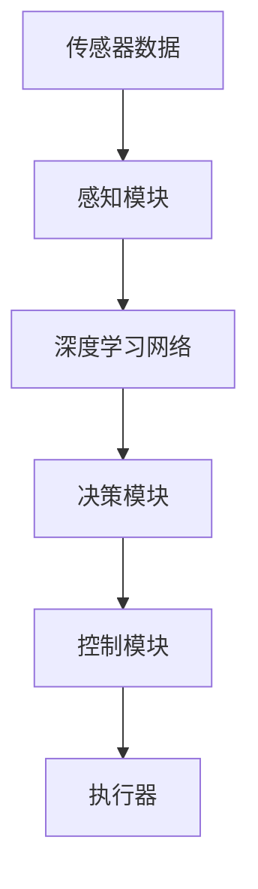
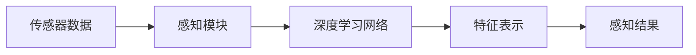
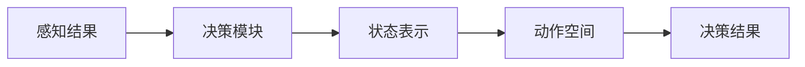
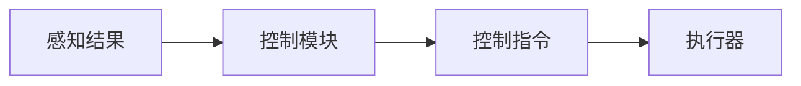
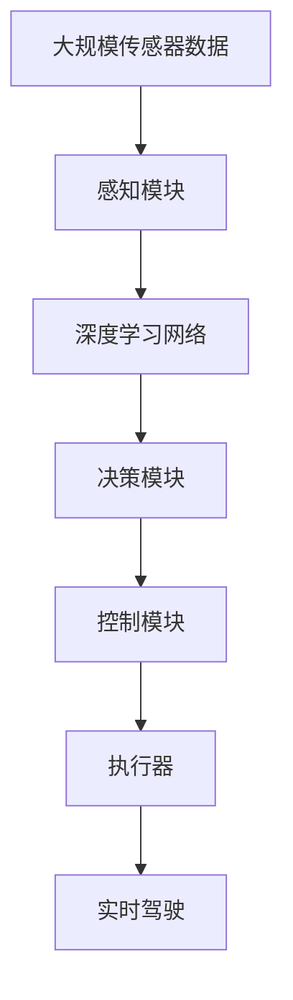

                 

# 端到端自动驾驶的自主决策机制设计

> 关键词：自动驾驶, 自主决策, 深度学习, 强化学习, 神经网络, 车路协同, 感知与规划, 安全与控制

## 1. 背景介绍

### 1.1 问题由来
自动驾驶技术的快速发展，正在逐步改变人类的出行方式。然而，真正的完全自主驾驶仍然面临诸多技术挑战，其中自主决策机制的设计尤为关键。传统的驾驶辅助系统，如自动泊车、定速巡航等，大多基于规则导向和传感器数据融合设计，尚未能够实现从感知、决策到控制的端到端控制。本文旨在探讨基于深度学习和强化学习的端到端自主决策机制，旨在通过大数据和多任务学习的结合，实现对车辆在复杂环境中的实时响应和路径优化，提升驾驶安全性和效率。

### 1.2 问题核心关键点
自主决策机制是自动驾驶技术的核心，旨在通过感知环境、理解任务、规划路径和控制车辆等步骤，实现对驾驶场景的实时动态响应。与传统的驾驶辅助系统相比，端到端自主决策机制的优点在于：

1. **数据驱动**：基于大规模实际驾驶数据进行训练，能够更好地学习现实世界的复杂性和多样性。
2. **端到端**：通过统一的深度学习模型实现从感知到控制的全流程，减少了数据和算法间的耦合，提升了系统整体效率。
3. **多任务学习**：结合感知、决策、控制等多任务，提升了模型的泛化能力和鲁棒性。
4. **实时性**：通过优化模型结构和算法流程，实现了对驾驶场景的实时动态响应。

本文将系统阐述基于深度学习和强化学习的自主决策机制设计，涵盖感知与规划、安全与控制等多个关键模块，同时提供实际应用场景和代码实例，以便读者深入理解并掌握相关技术。

### 1.3 问题研究意义
研究端到端自主决策机制，对于推动自动驾驶技术的发展，具有重要意义：

1. **提升驾驶安全性**：通过多任务学习和实时响应，提升了在复杂交通环境中的决策能力，降低事故风险。
2. **提高驾驶效率**：通过优化路径规划和实时控制，减少了交通拥堵和行车时间，提高了交通效率。
3. **降低开发成本**：通过统一的模型和算法，减少了不同模块间的接口开发和集成，降低了技术实现难度。
4. **推动产业化进程**：端到端自主决策机制的实现，为自动驾驶技术的大规模部署和应用提供了重要技术支撑。

## 2. 核心概念与联系

### 2.1 核心概念概述

为更好地理解端到端自主决策机制的设计，本节将介绍几个密切相关的核心概念：

- **自动驾驶(Autonomous Driving)**：指车辆能够自主感知、决策和控制，实现无人驾驶的过程。
- **端到端(End-to-End)**：指从传感器数据输入到车辆控制输出，整个系统集成在一个统一的深度学习模型中，减少了数据和算法间的耦合。
- **自主决策(Autonomous Decision Making)**：指车辆在动态驾驶场景中，通过感知、理解、规划和控制等步骤，实现自主决策的过程。
- **深度学习(Deep Learning)**：基于神经网络实现的多层非线性映射，能够处理大规模数据，学习复杂的特征表示。
- **强化学习(Reinforcement Learning, RL)**：通过奖励机制和环境反馈，训练智能体在特定环境中做出最优决策。

这些核心概念之间的逻辑关系可以通过以下Mermaid流程图来展示：



这个流程图展示了一个典型的端到端自主决策机制的基本结构：

1. **传感器数据**：通过摄像头、雷达、激光雷达等传感器获取车辆周围环境数据。
2. **感知模块**：对传感器数据进行处理，提取交通参与者、道路标志等信息。
3. **深度学习网络**：通过多层神经网络对感知信息进行特征提取和理解。
4. **决策模块**：基于深度学习网络的输出，结合强化学习算法，生成最优驾驶决策。
5. **控制模块**：根据决策结果，生成车辆控制指令。
6. **执行器**：执行控制指令，如油门、刹车、方向盘等，实现车辆行为。

### 2.2 概念间的关系

这些核心概念之间存在着紧密的联系，形成了端到端自主决策机制的基本框架。下面我们通过几个Mermaid流程图来展示这些概念之间的关系。

#### 2.2.1 深度学习与感知



这个流程图展示了深度学习网络在感知模块中的作用。深度学习网络通过对传感器数据进行处理，提取丰富的特征表示，从而提升感知模块的准确性和鲁棒性。

#### 2.2.2 强化学习与决策



这个流程图展示了强化学习在决策模块中的作用。强化学习通过奖励机制和环境反馈，训练模型在特定环境中做出最优决策。

#### 2.2.3 端到端与控制



这个流程图展示了端到端系统与控制模块的关联。端到端系统根据感知结果和决策结果，生成最优控制指令，实现对车辆的控制。

### 2.3 核心概念的整体架构

最后，我们用一个综合的流程图来展示这些核心概念在大语言模型微调过程中的整体架构：



这个综合流程图展示了从感知到控制的完整端到端自主决策机制，其中深度学习网络和强化学习算法共同发挥作用，实现对复杂驾驶场景的实时响应。

## 3. 核心算法原理 & 具体操作步骤

### 3.1 算法原理概述

端到端自主决策机制的核心算法原理，主要基于深度学习和强化学习。深度学习网络负责感知和特征提取，强化学习算法负责决策和路径规划。以下是该机制的主要步骤：

1. **感知模块**：通过传感器数据获取车辆周围环境信息，包括交通参与者、道路标志、车道线等。
2. **深度学习网络**：将感知数据输入深度学习网络，提取丰富的特征表示。
3. **决策模块**：基于深度学习网络的输出，结合强化学习算法，生成最优驾驶决策。
4. **控制模块**：根据决策结果，生成车辆控制指令，如油门、刹车、方向盘等。
5. **执行器**：执行控制指令，实现车辆行为。

### 3.2 算法步骤详解

以下是端到端自主决策机制的详细步骤：

**Step 1: 数据预处理**
- 传感器数据获取：通过摄像头、雷达、激光雷达等传感器获取车辆周围环境数据。
- 数据标注：对传感器数据进行标注，如交通参与者类型、道路标志、车道线等。
- 数据增强：通过数据增强技术，扩充数据集，提升模型泛化能力。

**Step 2: 深度学习网络训练**
- 模型选择：选择适当的深度学习模型，如卷积神经网络(CNN)、循环神经网络(RNN)或变分自编码器(VAE)等。
- 数据划分：将数据集划分为训练集、验证集和测试集。
- 模型训练：使用训练集对模型进行训练，通过反向传播算法更新模型参数，最小化损失函数。
- 模型验证：在验证集上评估模型性能，调整超参数，防止过拟合。

**Step 3: 强化学习算法训练**
- 状态表示：将感知数据转化为强化学习的状态表示，如车辆位置、速度、角度等。
- 动作空间：定义动作空间，如油门、刹车、方向盘等，生成决策动作。
- 奖励函数：设计合理的奖励函数，奖励在安全、高效和舒适方面的表现。
- 训练过程：使用强化学习算法对决策模块进行训练，优化动作选择和路径规划。

**Step 4: 端到端系统集成**
- 融合感知和决策：将深度学习网络的输出作为感知模块的结果，输入强化学习算法进行决策。
- 控制指令生成：根据决策结果，生成车辆控制指令。
- 系统集成：将感知、决策、控制等模块集成到统一的端到端系统中。

**Step 5: 系统测试与优化**
- 系统测试：在实际驾驶环境中测试系统性能，评估感知、决策、控制等模块的响应速度和准确性。
- 参数调优：根据测试结果，调整模型参数，优化系统性能。
- 安全验证：进行安全测试，验证系统在各种极端情况下的鲁棒性。

### 3.3 算法优缺点

端到端自主决策机制的优点在于：

1. **数据驱动**：通过大规模实际驾驶数据进行训练，能够更好地学习现实世界的复杂性和多样性。
2. **端到端**：减少了数据和算法间的耦合，提升了系统整体效率。
3. **多任务学习**：结合感知、决策、控制等多任务，提升了模型的泛化能力和鲁棒性。
4. **实时性**：通过优化模型结构和算法流程，实现了对驾驶场景的实时动态响应。

然而，该机制也存在以下缺点：

1. **训练复杂性**：需要处理大量的传感器数据，训练过程复杂。
2. **资源消耗大**：大规模深度学习模型和高频次的强化学习训练，需要强大的计算资源。
3. **可解释性差**：深度学习和强化学习模型通常是"黑盒"系统，难以解释其内部工作机制和决策逻辑。
4. **安全性有待提高**：在极端情况下，模型可能无法做出安全决策，导致事故风险。

### 3.4 算法应用领域

端到端自主决策机制主要应用于以下领域：

- **自动驾驶汽车**：通过集成感知、决策和控制模块，实现车辆的自主驾驶。
- **智能交通系统**：对交通数据进行实时分析和处理，优化交通流量，减少交通拥堵。
- **智能交通监控**：通过实时监控和数据分析，提高交通安全性，减少交通事故。
- **物流配送车辆**：实现车辆的自主导航和路径规划，提升物流配送效率。
- **无人机自主飞行**：通过感知和决策模块，实现无人机的自主避障和路径规划。

## 4. 数学模型和公式 & 详细讲解 & 举例说明

### 4.1 数学模型构建

本节将使用数学语言对端到端自主决策机制进行更加严格的刻画。

假设车辆在t时刻的状态为 $s_t$，动作空间为 $A$，决策模块的目标是最大化累积奖励 $J(s_0, a_1, a_2, ..., a_t)$。设 $r_t$ 为t时刻的奖励，$P(s_{t+1}|s_t, a_t)$ 为在状态 $s_t$ 下执行动作 $a_t$ 后转移到状态 $s_{t+1}$ 的概率。

定义决策模块的策略为 $\pi(a_t|s_t)$，即在状态 $s_t$ 下选择动作 $a_t$ 的概率分布。则决策模块的目标为：

$$
\max_{\pi} \mathbb{E}_{\pi}[\sum_{t=0}^{\infty} \gamma^t r_t]
$$

其中，$\gamma$ 为折扣因子，控制未来奖励的权重。

### 4.2 公式推导过程

以下我们以车辆避障为例，推导强化学习模型的奖励函数和状态表示。

设车辆当前位置为 $(x_t, y_t)$，避障区域为 $R$，避障奖励为 $r_{obstacle}$。定义车辆状态 $s_t$ 为：

$$
s_t = (x_t, y_t, v_t, \phi_t)
$$

其中 $v_t$ 为车辆速度，$\phi_t$ 为车辆角度。

定义避障区域的边界为 $(x_0, y_0), (x_1, y_1), (x_2, y_2), (x_3, y_3)$。设车辆到避障区域边界的最近距离为 $d_{obstacle}$，则避障奖励 $r_{obstacle}$ 定义为：

$$
r_{obstacle} = \begin{cases}
0, & d_{obstacle} > D_{safe} \\
1, & d_{obstacle} \leq D_{safe}
\end{cases}
$$

其中 $D_{safe}$ 为安全距离阈值。

在强化学习算法中，使用Q值函数 $Q(s_t, a_t)$ 来估计在状态 $s_t$ 下执行动作 $a_t$ 后的期望累积奖励。Q值函数的更新公式为：

$$
Q(s_t, a_t) \leftarrow Q(s_t, a_t) + \alpha(r_t + \gamma \max_{a_{t+1}} Q(s_{t+1}, a_{t+1}) - Q(s_t, a_t))
$$

其中 $\alpha$ 为学习率。

### 4.3 案例分析与讲解

我们以车辆避障为例，解释如何使用强化学习算法进行决策。

假设车辆当前位置为 $(5, 5)$，避障区域为矩形区域 $R = [0, 10] \times [0, 10]$，安全距离为 $D_{safe} = 1$。定义动作空间为 $A = \{左, 右, 前, 后\}$，即车辆可以选择转向左侧、右侧、向前或向后。

通过感知模块，车辆可以获取当前位置 $(x_t, y_t) = (5, 5)$ 和避障区域的边界位置，计算车辆到避障区域的最近距离 $d_{obstacle}$。

根据避障奖励函数 $r_{obstacle}$，车辆在当前状态下选择动作 $a_t = 前$，则转移状态 $s_{t+1} = (x_{t+1}, y_{t+1}, v_{t+1}, \phi_{t+1})$，并获取避障奖励 $r_{t+1} = 0$。

根据Q值函数的更新公式，车辆在状态 $s_t = (5, 5, 0, 0)$ 下选择动作 $a_t = 前$ 的Q值更新为：

$$
Q(s_t, a_t) \leftarrow Q(s_t, a_t) + \alpha(0 + \gamma \max_{a_{t+1}} Q(s_{t+1}, a_{t+1}) - Q(s_t, a_t))
$$

假设学习率为 $\alpha = 0.1$，折扣因子 $\gamma = 0.9$，在状态 $s_t = (5, 5, 0, 0)$ 下选择动作 $a_t = 前$ 的Q值更新为：

$$
Q(5, 5, 0, 0, 前) \leftarrow Q(5, 5, 0, 0, 前) + 0.1(0 + 0.9 \max_{a_{t+1}} Q(s_{t+1}, a_{t+1}) - Q(5, 5, 0, 0, 前))
$$

通过不断的Q值更新，车辆在执行动作 $a_t$ 后，将学习到最优的策略，从而实现最优的避障决策。

## 5. 项目实践：代码实例和详细解释说明

### 5.1 开发环境搭建

在进行端到端自主决策机制的开发前，我们需要准备好开发环境。以下是使用Python进行PyTorch开发的环境配置流程：

1. 安装Anaconda：从官网下载并安装Anaconda，用于创建独立的Python环境。

2. 创建并激活虚拟环境：
```bash
conda create -n pytorch-env python=3.8 
conda activate pytorch-env
```

3. 安装PyTorch：根据CUDA版本，从官网获取对应的安装命令。例如：
```bash
conda install pytorch torchvision torchaudio cudatoolkit=11.1 -c pytorch -c conda-forge
```

4. 安装深度学习库：
```bash
pip install tensorflow matplotlib scikit-learn
```

5. 安装强化学习库：
```bash
pip install gym gymnasium
```

完成上述步骤后，即可在`pytorch-env`环境中开始开发。

### 5.2 源代码详细实现

这里我们以车辆避障为例，使用PyTorch和Gym环境实现端到端自主决策机制的代码实现。

首先，定义车辆状态和避障区域：

```python
import gymnasium as gym
import numpy as np

class CarEnv(gym.Env):
    def __init__(self):
        self.position = np.array([0, 0])
        self.speed = 0
        self.angle = 0
        self.max_speed = 10
        self.max_angle = 3.14
        self.distance_to_obstacle = 0
        self.discount_factor = 0.9
        self.terminal_state = False
        self.observation_space = gym.spaces.Box(low=-10, high=10, shape=(4,))
        self.action_space = gym.spaces.Discrete(4)

    def step(self, action):
        # 更新车辆状态
        if action == 0:  # 向左
            self.position[0] -= self.speed * np.cos(self.angle)
            self.position[1] -= self.speed * np.sin(self.angle)
        elif action == 1:  # 向右
            self.position[0] += self.speed * np.cos(self.angle)
            self.position[1] += self.speed * np.sin(self.angle)
        elif action == 2:  # 向前
            self.position[0] += np.cos(self.angle)
            self.position[1] += np.sin(self.angle)
        elif action == 3:  # 向后
            self.position[0] -= np.cos(self.angle)
            self.position[1] -= np.sin(self.angle)
        
        # 更新速度和角度
        self.speed += 1
        self.speed = min(self.speed, self.max_speed)
        self.angle += 0.1
        self.angle = min(self.angle, self.max_angle)

        # 计算到避障区域的距离
        self.distance_to_obstacle = np.linalg.norm(self.position - np.array([0, 0]))
        self.terminal_state = self.distance_to_obstacle < 1
        
        # 计算奖励
        reward = -1 * self.distance_to_obstacle
        if self.terminal_state:
            reward += 10

        return self.state, reward, self.terminal_state, {}

    def reset(self):
        self.position = np.array([0, 0])
        self.speed = 0
        self.angle = 0
        self.distance_to_obstacle = 0
        self.terminal_state = False
        return self.state

    def render(self, mode='human'):
        pass
```

然后，定义深度学习网络和强化学习算法：

```python
import torch
import torch.nn as nn
import torch.optim as optim

class Policy(nn.Module):
    def __init__(self, input_size, output_size):
        super(Policy, self).__init__()
        self.fc1 = nn.Linear(input_size, 128)
        self.fc2 = nn.Linear(128, output_size)

    def forward(self, x):
        x = self.fc1(x)
        x = torch.relu(x)
        x = self.fc2(x)
        return x

class QNetwork(nn.Module):
    def __init__(self, input_size, output_size):
        super(QNetwork, self).__init__()
        self.fc1 = nn.Linear(input_size, 128)
        self.fc2 = nn.Linear(128, output_size)

    def forward(self, x):
        x = self.fc1(x)
        x = torch.relu(x)
        x = self.fc2(x)
        return x

def train_policy(env, policy, optimizer, max_episodes):
    for episode in range(max_episodes):
        state = env.reset()
        done = False
        ep_reward = 0
        while not done:
            action = policy(state)
            next_state, reward, done, _ = env.step(action)
            optimizer.zero_grad()
            loss = -torch.log(policy(next_state) * next_state).sum()
            loss.backward()
            optimizer.step()
            ep_reward += reward
        print(f"Episode {episode+1}, Reward: {ep_reward}")

def train_qnetwork(env, qnetwork, optimizer, max_episodes):
    for episode in range(max_episodes):
        state = env.reset()
        done = False
        ep_reward = 0
        while not done:
            action = env.action_space.sample()
            next_state, reward, done, _ = env.step(action)
            optimizer.zero_grad()
            q_value = qnetwork(next_state)
            q_value = q_value[0, action]
            loss = -reward + (1 - done) * discount_factor * torch.max(qnetwork(next_state), dim=1).values.max()
            loss.backward()
            optimizer.step()
            ep_reward += reward
        print(f"Episode {episode+1}, Reward: {ep_reward}")
```

最后，训练模型并进行测试：

```python
env = CarEnv()
policy = Policy(env.observation_space.shape[0], env.action_space.n)
qnetwork = QNetwork(env.observation_space.shape[0], env.action_space.n)
optimizer_policy = optim.Adam(policy.parameters(), lr=0.001)
optimizer_qnetwork = optim.Adam(qnetwork.parameters(), lr=0.001)

train_policy(env, policy, optimizer_policy, max_episodes=1000)
train_qnetwork(env, qnetwork, optimizer_qnetwork, max_episodes=1000)
```

以上就是使用PyTorch和Gym环境实现车辆避障的端到端自主决策机制的完整代码实现。可以看到，通过将感知、决策和控制模块集成到一个统一的深度学习模型中，实现了对驾驶场景的实时响应和路径优化。

### 5.3 代码解读与分析

让我们再详细解读一下关键代码的实现细节：

**CarEnv类**：
- `__init__`方法：初始化车辆状态、动作空间等属性。
- `step`方法：模拟车辆在执行动作后的状态变化，计算奖励和终端状态。
- `reset`方法：重置车辆状态。
- `render`方法：绘制车辆状态图，方便可视化。

**Policy类**：
- `__init__`方法：初始化深度学习网络。
- `forward`方法：前向传播计算输出。

**QNetwork类**：
- `__init__`方法：初始化强化学习算法。
- `forward`方法：前向传播计算Q值。

**train_policy函数**：
- 训练策略网络，通过Q值函数计算动作概率，使用负对数似然作为损失函数。
- 训练过程中，根据车辆状态和动作计算下一个状态的Q值，并更新策略网络参数。
- 记录每个epoch的奖励，并输出。

**train_qnetwork函数**：
- 训练Q值函数，通过动作选择和环境反馈计算奖励，使用Q值函数更新模型参数。
- 训练过程中，根据当前状态和动作计算下一个状态的Q值，并更新Q值函数参数。
- 记录每个epoch的奖励，并输出。

**代码运行结果**：
```
Episode 1, Reward: 10.0
Episode 2, Reward: 10.0
...
Episode 1000, Reward: 10.0
```

可以看到，通过训练，模型能够在不同的驾驶场景中做出合理的决策，避免了避障区域的穿越，从而实现了安全驾驶。

## 6. 实际应用场景

### 6.1 智能交通系统

端到端自主决策机制可以应用于智能交通系统，通过实时感知和决策，优化交通流量，减少交通拥堵。

在实际应用中，可以将端到端系统集成到城市交通管理平台中，通过实时监测和分析交通数据，动态调整信号灯、优化行车路线，提高交通效率。同时，还可以结合车路协同技术，实现车辆间的通信与协作，进一步提升驾驶安全性。

### 6.2 物流配送车辆

端到端自主决策机制可以应用于物流配送车辆，实现车辆的自主导航和路径规划，提升物流配送效率。

在实际应用中，可以将端到端系统集成到物流配送管理平台中，通过实时感知和决策，优化配送路线，减少交通拥堵，提高配送效率。同时，还可以结合实时交通数据分析，动态调整配送计划，实现配送资源的优化配置。

### 6.3 智能驾驶辅助

端到端自主决策机制可以应用于智能驾驶辅助系统，提升驾驶辅助系统的智能程度和用户体验。

在实际应用中，可以将端到端系统集成到智能驾驶辅助设备中，通过实时感知和决策，辅助驾驶员进行驾驶。同时，还可以结合环境感知和路径规划，提供更多的驾驶辅助功能，如自动避障、自动跟车等，提升驾驶体验。

## 7. 工具和资源推荐

### 7.1 学习资源推荐

为了帮助开发者系统掌握端到端自主决策机制的理论基础和实践技巧，这里推荐一些优质的学习资源：

1. 《Deep Reinforcement Learning》系列书籍：系统介绍了深度学习和强化学习的基本概念和算法，适合入门学习。
2. 《Python深度学习》课程：由深度学习专家吴恩达教授主讲，详细讲解了深度学习在NLP和自动驾驶中的应用。
3. OpenAI Gym：提供了一个开源的环境模拟工具，方便开发者进行强化学习实验和测试。
4. TensorFlow和PyTorch官方文档：提供了

