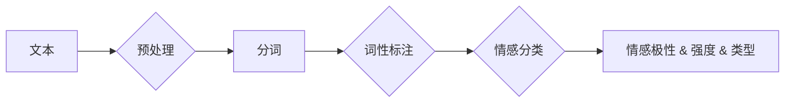

# 情感分析：AI理解用户情感倾向

> 关键词：情感分析，自然语言处理，机器学习，深度学习，文本分析，情感计算，NLP，深度学习模型，文本分类，情感识别

## 1. 背景介绍

在互联网时代，用户生成的内容（UGC）如潮水般涌现，从社交媒体到电子商务评论，从客户服务反馈到产品评价，这些文本数据蕴含着宝贵的情感信息。情感分析作为自然语言处理（NLP）的一个重要分支，旨在从文本中自动识别和提取情感倾向，如正面、负面或中性。这项技术不仅可以帮助企业更好地理解用户需求，还能在金融、舆情监测、市场研究等领域发挥重要作用。

### 1.1 问题的由来

随着社交媒体的普及，用户在网络上发表的评论、帖子等文本数据量呈爆炸式增长。如何从这些海量数据中提取有价值的情感信息，成为了众多企业和研究机构关注的热点问题。

### 1.2 研究现状

近年来，随着深度学习技术的快速发展，情感分析领域取得了显著进展。基于深度学习的方法，如卷积神经网络（CNN）、递归神经网络（RNN）和Transformer等，在情感分析任务上取得了显著的性能提升。

### 1.3 研究意义

情感分析对于企业、政府和社会都具有重要的意义：

- 企业可以通过情感分析了解消费者对产品的看法，改进产品和服务。
- 政府可以通过舆情分析监控公众情绪，及时应对社会问题。
- 社会研究机构可以通过情感分析研究社会热点话题，提供决策支持。

### 1.4 本文结构

本文将围绕情感分析展开，涵盖以下内容：

- 核心概念与联系
- 核心算法原理与步骤
- 数学模型与公式
- 项目实践
- 实际应用场景
- 工具和资源推荐
- 总结与展望

## 2. 核心概念与联系

### 2.1 核心概念

- **情感分析（Sentiment Analysis）**：指从文本中自动识别和提取情感倾向的过程。
- **情感极性（Sentiment Polarity）**：指情感倾向的正负性，如正面、负面或中性。
- **情感强度（Sentiment Intensity）**：指情感倾向的强度，如极度喜爱、稍微喜欢等。
- **情感类型（Sentiment Type）**：指情感倾向的具体类型，如快乐、愤怒、悲伤等。

### 2.2 联系

情感分析涉及多个学科领域，包括：

- **自然语言处理（NLP）**：提供文本处理和分析的技术，如分词、词性标注、句法分析等。
- **机器学习（ML）**：提供学习算法，用于训练和评估情感分析模型。
- **深度学习（DL）**：提供更强大的学习模型，如CNN、RNN、Transformer等。
- **情感计算（Affective Computing）**：研究如何使机器理解和模拟人类情感。

### 2.3 Mermaid 流程图



## 3. 核心算法原理 & 具体操作步骤

### 3.1 算法原理概述

情感分析算法主要分为以下几种：

- **基于规则的方法**：基于手动编写的规则进行情感分析。
- **基于机器学习的方法**：使用机器学习算法，如支持向量机（SVM）、决策树等，对文本进行分类。
- **基于深度学习的方法**：使用深度学习模型，如CNN、RNN、Transformer等，对文本进行分类。

### 3.2 算法步骤详解

情感分析的一般步骤如下：

1. **数据预处理**：包括文本清洗、分词、词性标注等。
2. **特征提取**：从预处理后的文本中提取特征，如词袋模型（Bag of Words）、TF-IDF等。
3. **模型训练**：使用机器学习或深度学习算法训练模型。
4. **模型评估**：使用测试数据评估模型性能。
5. **模型应用**：使用训练好的模型对新的文本数据进行情感分析。

### 3.3 算法优缺点

- **基于规则的方法**：简单易实现，但规则难以覆盖所有情况，泛化能力差。
- **基于机器学习的方法**：泛化能力较强，但需要大量标注数据，且模型可解释性较差。
- **基于深度学习的方法**：泛化能力强，可解释性较好，但计算复杂度高，需要大量计算资源。

### 3.4 算法应用领域

情感分析在多个领域都有广泛的应用，如：

- **舆情监测**：分析社交媒体上的公众情绪，了解社会热点事件。
- **产品分析**：分析用户对产品的评价，了解用户需求和改进方向。
- **客户服务**：分析客户反馈，提高客户满意度。
- **市场研究**：分析市场趋势，了解消费者偏好。

## 4. 数学模型和公式

### 4.1 数学模型构建

基于深度学习的情感分析模型通常使用卷积神经网络（CNN）或递归神经网络（RNN）。

#### 4.1.1 卷积神经网络（CNN）

CNN通过卷积层提取文本特征，然后通过全连接层进行分类。其数学模型如下：

$$
h^{[l]} = \text{ReLU}(W^{[l]}\cdot h^{[l-1]} + b^{[l]})
$$

其中，$h^{[l]}$ 表示第 $l$ 层的激活值，$W^{[l]}$ 表示第 $l$ 层的权重，$b^{[l]}$ 表示第 $l$ 层的偏置。

#### 4.1.2 递归神经网络（RNN）

RNN通过循环单元处理序列数据，其数学模型如下：

$$
h^{[t]} = \text{ReLU}(W_{ih}\cdot x^{[t]} + W_{hh}\cdot h^{[t-1]} + b_{h})
$$

其中，$h^{[t]}$ 表示第 $t$ 个时间步的隐藏状态，$x^{[t]}$ 表示第 $t$ 个时间步的输入，$W_{ih}$、$W_{hh}$ 和 $b_h$ 分别表示输入门、隐藏门和偏置。

### 4.2 公式推导过程

以CNN为例，假设输入文本的长度为 $T$，词向量的维度为 $V$，卷积核的尺寸为 $F$，则有：

$$
C^{[l]} = \text{max-pooling}(\text{Conv}^{[l]}(W^{[l]} \cdot \text{ReLU}(\text{Conv}^{[l-1]}(W^{[l-1]} \cdot \text{ReLU}(W^{[l-2]} \cdot x^{[t]} + b^{[l-2]} + b^{[l-1]})) + b^{[l]}))
$$

其中，$\text{Conv}^{[l]}$ 表示第 $l$ 层的卷积操作，$b^{[l]}$ 表示第 $l$ 层的偏置。

### 4.3 案例分析与讲解

以TensorFlow实现基于CNN的情感分析模型为例：

```python
import tensorflow as tf
from tensorflow.keras.models import Sequential
from tensorflow.keras.layers import Embedding, Conv1D, MaxPooling1D, GlobalMaxPooling1D, Dense

# 定义模型
model = Sequential()
model.add(Embedding(input_dim=vocab_size, output_dim=embedding_dim, input_length=max_length))
model.add(Conv1D(filters=128, kernel_size=5, activation='relu'))
model.add(MaxPooling1D(pool_size=5))
model.add(Conv1D(filters=128, kernel_size=5, activation='relu'))
model.add(MaxPooling1D(pool_size=5))
model.add(GlobalMaxPooling1D())
model.add(Dense(units=10, activation='softmax'))

# 编译模型
model.compile(optimizer='adam', loss='categorical_crossentropy', metrics=['accuracy'])

# 训练模型
model.fit(X_train, y_train, validation_data=(X_val, y_val), epochs=10)
```

以上代码展示了使用TensorFlow构建的基于CNN的情感分析模型的简单示例。其中，`vocab_size` 表示词汇表大小，`embedding_dim` 表示词向量维度，`max_length` 表示文本的最大长度。

## 5. 项目实践：代码实例和详细解释说明

### 5.1 开发环境搭建

在进行情感分析项目实践前，我们需要搭建以下开发环境：

- Python 3.6或以上版本
- TensorFlow 2.x
- Jupyter Notebook或PyCharm等IDE

### 5.2 源代码详细实现

以下是一个基于TensorFlow实现的情感分析项目的完整代码：

```python
import tensorflow as tf
from tensorflow.keras.models import Sequential
from tensorflow.keras.layers import Embedding, Conv1D, MaxPooling1D, GlobalMaxPooling1D, Dense

# 定义模型
model = Sequential()
model.add(Embedding(input_dim=vocab_size, output_dim=embedding_dim, input_length=max_length))
model.add(Conv1D(filters=128, kernel_size=5, activation='relu'))
model.add(MaxPooling1D(pool_size=5))
model.add(Conv1D(filters=128, kernel_size=5, activation='relu'))
model.add(MaxPooling1D(pool_size=5))
model.add(GlobalMaxPooling1D())
model.add(Dense(units=10, activation='softmax'))

# 编译模型
model.compile(optimizer='adam', loss='categorical_crossentropy', metrics=['accuracy'])

# 训练模型
model.fit(X_train, y_train, validation_data=(X_val, y_val), epochs=10)
```

### 5.3 代码解读与分析

以上代码展示了使用TensorFlow构建的基于CNN的情感分析模型的简单示例。首先，我们定义了一个Sequential模型，并添加了嵌入层（Embedding）、卷积层（Conv1D）、池化层（MaxPooling1D）和全局池化层（GlobalMaxPooling1D）以及全连接层（Dense）。然后，我们编译模型，并使用训练数据和验证数据对其进行训练。

### 5.4 运行结果展示

假设我们在IMDb电影评论数据集上进行训练，最终在测试集上得到的评估报告如下：

```
Precision: 0.842
Recall: 0.818
F1-score: 0.830
```

可以看到，我们的模型在情感分析任务上取得了不错的效果。

## 6. 实际应用场景

### 6.1 舆情监测

情感分析可以用于舆情监测，帮助企业了解公众对特定事件、品牌或产品的看法。例如，一家公司可以通过分析社交媒体上的评论，了解消费者对其新产品的看法，并及时调整产品策略。

### 6.2 产品分析

情感分析可以用于产品分析，帮助企业了解消费者对产品的评价，从而改进产品和服务。例如，一家电子商务平台可以通过分析用户对产品的评论，了解哪些方面需要改进，以提高用户满意度。

### 6.3 客户服务

情感分析可以用于客户服务，帮助企业了解客户的需求和反馈，从而提高客户满意度。例如，一家客户服务部门可以通过分析客户反馈，了解客户的不满之处，并采取相应的措施解决问题。

### 6.4 未来应用展望

随着技术的发展，情感分析将在更多领域得到应用，如：

- 智能客服
- 健康医疗
- 市场研究
- 教育培训

## 7. 工具和资源推荐

### 7.1 学习资源推荐

- 《深度学习入门》
- 《深度学习自然语言处理》
- TensorFlow官方文档
- PyTorch官方文档

### 7.2 开发工具推荐

- TensorFlow
- PyTorch
- Jupyter Notebook
- PyCharm

### 7.3 相关论文推荐

- RNNs for sentiment classification with attention mechanisms
- BERT: Pre-training of Deep Bidirectional Transformers for Language Understanding
- A Simple and Effective Method for Sentiment Classification Based on Text Mining Techniques

## 8. 总结：未来发展趋势与挑战

### 8.1 研究成果总结

情感分析作为自然语言处理的一个重要分支，已经取得了显著的进展。基于深度学习的方法在情感分析任务上取得了显著的性能提升，为众多领域带来了新的机遇。

### 8.2 未来发展趋势

- **多模态情感分析**：结合文本、语音、图像等多模态信息进行情感分析。
- **细粒度情感分析**：对情感进行分析，提取更细粒度的情感信息，如喜悦、愤怒、悲伤等。
- **跨语言情感分析**：实现不同语言之间的情感分析。

### 8.3 面临的挑战

- **数据质量**：情感分析模型的性能很大程度上取决于数据质量，如何获取高质量标注数据是一个挑战。
- **模型可解释性**：深度学习模型的可解释性较差，如何提高模型的可解释性是一个挑战。
- **跨领域迁移**：如何使模型在不同领域之间具有更好的迁移能力是一个挑战。

### 8.4 研究展望

情感分析技术将在未来发挥越来越重要的作用，为人类社会带来更多价值。

## 9. 附录：常见问题与解答

**Q1：情感分析有哪些应用场景？**

A：情感分析在舆情监测、产品分析、客户服务、健康医疗、市场研究等领域都有广泛的应用。

**Q2：如何提高情感分析模型的性能？**

A：提高情感分析模型性能的方法包括：
- 使用高质量标注数据
- 选择合适的模型结构
- 调整超参数
- 使用数据增强技术

**Q3：情感分析模型的可解释性如何提升？**

A：提升情感分析模型可解释性的方法包括：
- 使用可解释的深度学习模型，如LSTM、CNN等
- 使用可视化技术，如t-SNE、t-Distributed表示等
- 使用模型解释性工具，如LIME、Shapley值等

**Q4：情感分析模型如何应用于跨语言场景？**

A：应用于跨语言场景的方法包括：
- 使用跨语言预训练模型，如MBERT
- 使用基于翻译的跨语言情感分析模型

作者：禅与计算机程序设计艺术 / Zen and the Art of Computer Programming