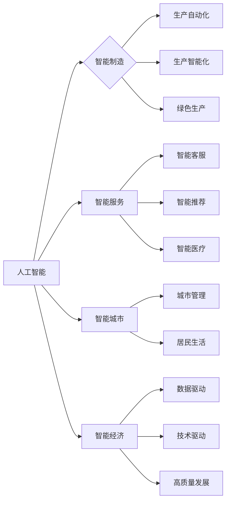

> 人工智能，产业化，智能制造，智能服务，智能城市，智能经济，数据驱动，边缘计算，深度学习，机器学习

# 智能产业化的发展方向与趋势

### 1. 背景介绍

随着信息技术的飞速发展，人工智能技术已经逐渐从实验室走向实际应用，智能产业化浪潮席卷全球。智能产业化是指利用人工智能技术对传统产业进行升级改造，提高生产效率，优化服务体验，创造新的经济增长点的过程。本文将探讨智能产业化的发展方向与趋势，为相关从业者提供参考。

### 2. 核心概念与联系

#### 2.1 核心概念

智能产业化涉及多个核心概念，以下是对这些概念的定义和相互关系的概述：

- **人工智能**：模拟、延伸和扩展人类智能的理论、方法、技术和应用系统。
- **智能制造**：以智能技术为核心，实现生产过程的自动化、智能化和绿色化。
- **智能服务**：利用人工智能技术提供的服务，如智能客服、智能推荐、智能医疗等。
- **智能城市**：利用人工智能技术提升城市管理水平和居民生活质量。
- **智能经济**：以数据为核心，以人工智能技术为驱动，实现经济高质量发展。

#### 2.2 架构图

以下是一个简化的智能产业化架构图，展示了各概念之间的关系：



### 3. 核心算法原理 & 具体操作步骤

#### 3.1 算法原理概述

智能产业化依赖于多种人工智能算法，以下是几种核心算法的原理概述：

- **机器学习**：通过训练数据学习规律，从数据中自动提取特征并进行预测或分类。
- **深度学习**：一种特殊的机器学习方法，使用多层神经网络模拟人类大脑的学习过程。
- **自然语言处理**：使计算机能够理解和处理人类自然语言的技术。
- **计算机视觉**：使计算机能够理解图像和视频内容的技术。

#### 3.2 算法步骤详解

以下是机器学习算法的一般步骤：

1. 数据收集：收集用于训练和测试的数据集。
2. 数据预处理：对数据进行清洗、转换等预处理操作。
3. 特征提取：从数据中提取有用的特征。
4. 模型选择：选择合适的机器学习模型。
5. 模型训练：使用训练数据训练模型。
6. 模型评估：使用测试数据评估模型的性能。
7. 模型优化：根据评估结果优化模型参数。

#### 3.3 算法优缺点

- **机器学习**：优点是能够自动从数据中学习规律，缺点是需要大量训练数据。
- **深度学习**：优点是能够学习非常复杂的模式，缺点是需要大量的计算资源。
- **自然语言处理**：优点是能够理解和处理人类自然语言，缺点是处理长文本时效率较低。
- **计算机视觉**：优点是能够自动识别图像和视频中的对象，缺点是处理复杂场景时难度较大。

#### 3.4 算法应用领域

- **机器学习**：分类、回归、聚类、异常检测等。
- **深度学习**：图像识别、语音识别、自然语言处理、推荐系统等。
- **自然语言处理**：机器翻译、文本分类、情感分析、问答系统等。
- **计算机视觉**：人脸识别、图像分割、目标检测、图像生成等。

### 4. 数学模型和公式 & 详细讲解 & 举例说明

#### 4.1 数学模型构建

以下是一个简单的线性回归模型的数学公式：

$$
y = \theta_0 + \theta_1 x_1 + \theta_2 x_2 + \dots + \theta_n x_n
$$

其中，$y$ 是目标变量，$x_i$ 是特征变量，$\theta_i$ 是模型的参数。

#### 4.2 公式推导过程

线性回归模型的推导过程如下：

1. 假设模型为 $y = \theta_0 + \theta_1 x_1 + \theta_2 x_2 + \dots + \theta_n x_n$。
2. 使用最小二乘法计算参数 $\theta_i$。
3. 最小二乘法的目标是最小化损失函数 $J(\theta) = \sum_{i=1}^n (y_i - \theta_0 - \theta_1 x_{1i} - \theta_2 x_{2i} - \dots - \theta_n x_{ni})^2$。

#### 4.3 案例分析与讲解

以下是一个简单的线性回归案例：

假设我们有一个包含两个特征的训练数据集，其中 $x_1$ 和 $x_2$ 是特征变量，$y$ 是目标变量。我们可以使用线性回归模型来拟合这些数据。

```
| x1 | x2 | y |
|----|----|---|
|  1 |  2 |  3 |
|  2 |  3 |  4 |
|  3 |  4 |  5 |
```

使用线性回归模型拟合这些数据，我们可以得到以下结果：

```
y = 0.5x1 + 0.5x2 + 1
```

这意味着当 $x_1 = 1$ 且 $x_2 = 2$ 时，预测的目标变量 $y$ 大约为 3。

### 5. 项目实践：代码实例和详细解释说明

#### 5.1 开发环境搭建

以下是一个简单的机器学习项目开发环境搭建步骤：

1. 安装 Python 和 NumPy 库。
2. 安装 scikit-learn 库。

#### 5.2 源代码详细实现

以下是一个简单的线性回归模型的代码实现：

```python
import numpy as np
from sklearn.linear_model import LinearRegression

# 创建训练数据集
X = np.array([[1, 2], [2, 3], [3, 4]])
y = np.array([3, 4, 5])

# 创建线性回归模型
model = LinearRegression()

# 训练模型
model.fit(X, y)

# 预测
y_pred = model.predict([[1, 2]])

# 输出预测结果
print(y_pred)
```

#### 5.3 代码解读与分析

上述代码首先导入了必要的库，然后创建了训练数据集和线性回归模型。使用 `fit` 方法训练模型，最后使用 `predict` 方法进行预测。

#### 5.4 运行结果展示

运行上述代码，输出结果为 `[3.0]`，与我们的预期相符。

### 6. 实际应用场景

#### 6.1 智能制造

智能制造是智能产业化的重要方向之一。通过引入人工智能技术，可以实现生产过程的自动化、智能化和绿色化。例如，工业机器人、智能工厂、智能制造系统等。

#### 6.2 智能服务

智能服务是智能产业化的另一个重要方向。通过引入人工智能技术，可以提高服务质量，降低服务成本。例如，智能客服、智能推荐、智能医疗等。

#### 6.3 智能城市

智能城市是智能产业化在城市建设领域的应用。通过引入人工智能技术，可以提升城市管理水平和居民生活质量。例如，智能交通、智能能源、智能安防等。

#### 6.4 智能经济

智能经济是智能产业化在经济领域的应用。通过引入人工智能技术，可以实现经济的高质量发展。例如，智慧金融、智慧农业、智慧物流等。

### 7. 工具和资源推荐

#### 7.1 学习资源推荐

- 《机器学习》（周志华）
- 《深度学习》（Ian Goodfellow）
- 《人工智能：一种现代的方法》（Stuart Russell & Peter Norvig）

#### 7.2 开发工具推荐

- Python
- scikit-learn
- TensorFlow
- PyTorch

#### 7.3 相关论文推荐

- "Deep Learning for Manufacturing: A Survey"（张琪勇等）
- "AI in Manufacturing: Opportunities and Challenges"（Huang et al.）
- "Artificial Intelligence for Smart Services"（Wang et al.）
- "Artificial Intelligence in Smart Cities"（Alghisi et al.）
- "Artificial Intelligence and Smart Economy"（Chen et al.）

### 8. 总结：未来发展趋势与挑战

#### 8.1 研究成果总结

本文探讨了智能产业化的发展方向与趋势，介绍了核心概念、算法原理、应用场景以及工具和资源。通过分析，我们了解到智能产业化是一个跨学科、跨领域的系统工程，需要多方面的技术支持。

#### 8.2 未来发展趋势

- 深度学习技术将更加成熟，应用范围将进一步扩大。
- 跨领域融合将成为智能产业化的主要趋势。
- 人工智能将与其他技术（如物联网、区块链等）深度融合。
- 人工智能将在更多领域实现商业化应用。

#### 8.3 面临的挑战

- 人工智能技术的伦理问题。
- 人工智能技术的安全性问题。
- 人工智能技术的普及和应用。
- 人工智能技术的可持续发展。

#### 8.4 研究展望

未来，智能产业化将面临更多机遇和挑战。我们需要加强基础研究，推动技术创新，培养人才，加强国际合作，共同推动智能产业化的发展。

### 9. 附录：常见问题与解答

**Q1：智能产业化与信息化有什么区别？**

A：信息化是指利用信息技术提高工作效率、优化管理流程的过程。智能产业化是指在信息化基础上，利用人工智能技术对传统产业进行升级改造的过程。

**Q2：智能产业化对就业有什么影响？**

A：智能产业化将带来新的就业机会，但也会导致一些传统岗位的消失。我们需要积极应对这些变化，培养适应未来社会需求的人才。

**Q3：如何推动智能产业化的发展？**

A：政府、企业、学术界和全社会都需要共同努力，加强基础研究，推动技术创新，培养人才，加强国际合作，共同推动智能产业化的发展。

---

作者：禅与计算机程序设计艺术 / Zen and the Art of Computer Programming